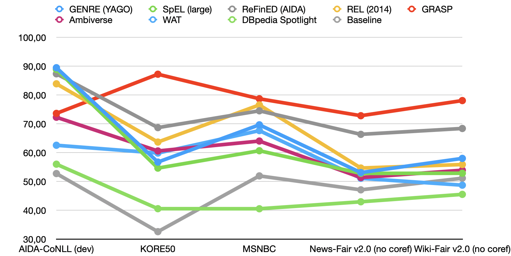
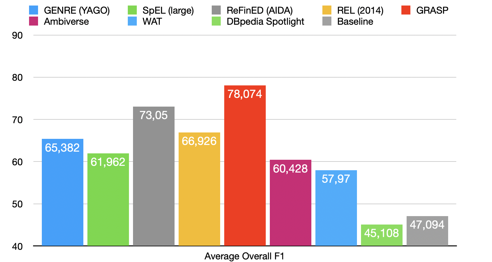
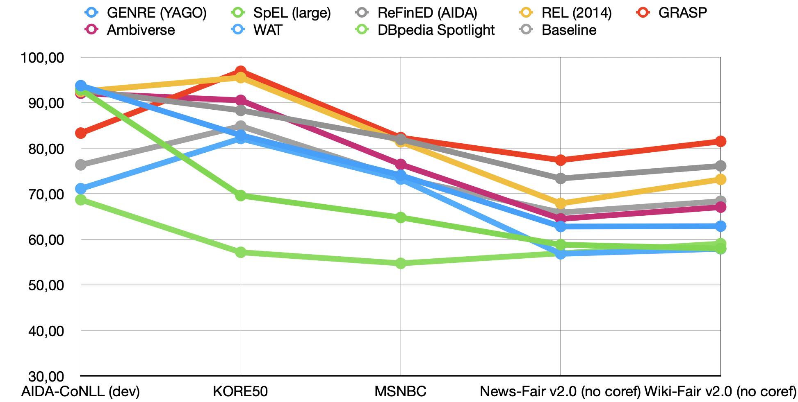
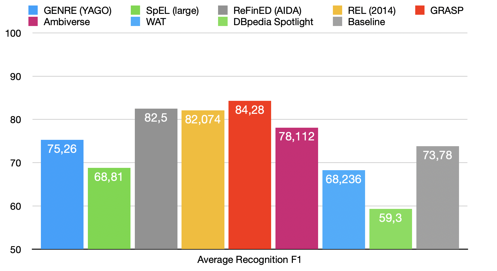
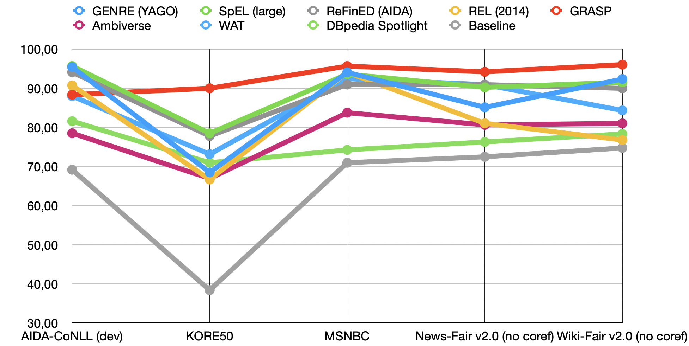
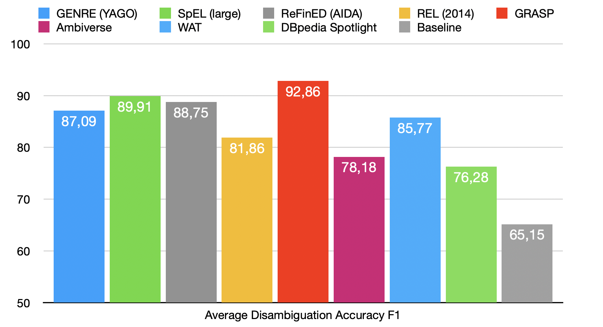
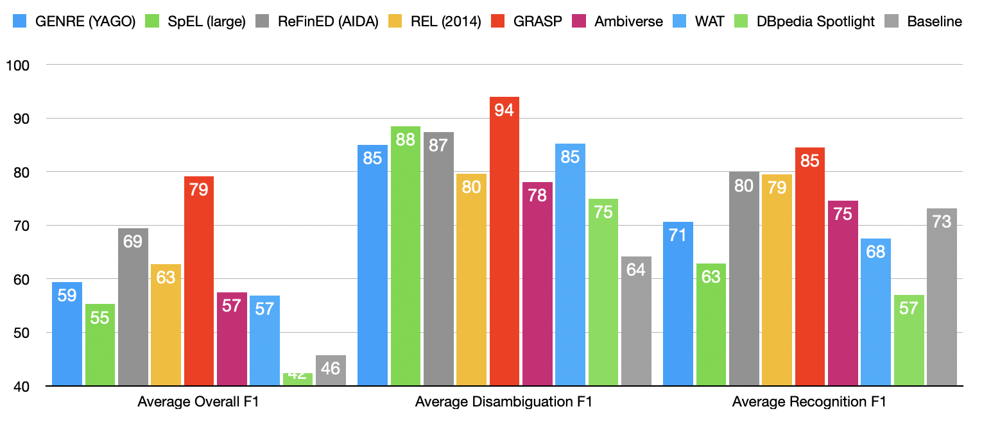
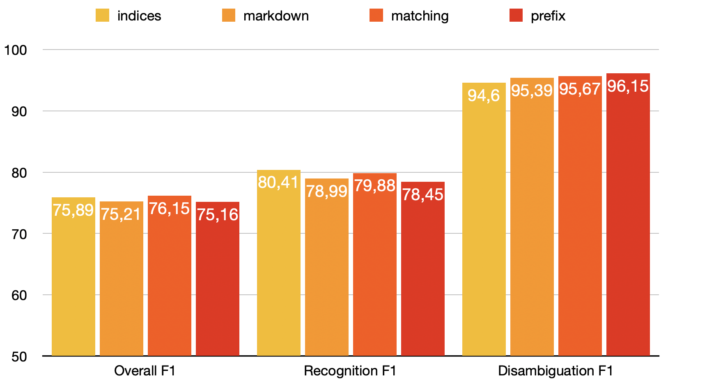
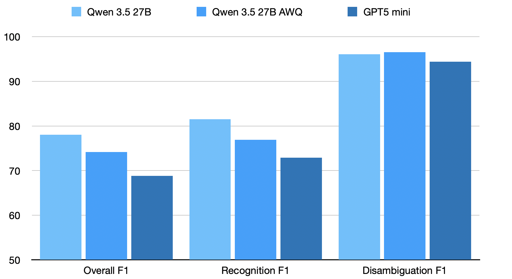

**Entity linking** consists of finding entity mentions in natural language text — such as mentions of people, places, events etc. — and linking them to canonical entities in a knowledge graph.
This can be a difficult task since it is not always clear what should be linked or which entity is referred to in the text. This project does entity linking by using off-the-shelf **reasoning LLMs** equipped with **knowledge graph exploration** and **text annotation functions** in a **zero-shot setting**.
The contributions of this project are the implementation of the entity linking task in the existing GRASP framework (which already provides the knowledge graph exploration functions), the implementation and evaluation of four different annotation methods and the evaluation of the system on **five entity linking benchmarks** against eight existing entity linkers.
The evaluation shows that the system achieves an **average F1 score of 78%** compared to the previous best result of **73%**.


## Introduction
Linking mentions of entities in unstructured natural language text to canonical entities in a knowledge graph can be useful for a lot of downstream tasks that require structured knowledge. The following example from the Kore50 entity linking benchmark gives a good intuition instead of a formal definition of the task.

Given the string
> "Onassis married Kennedy on October 20, 1968."

and the knowledge graph ```wikidata``` return the following list:
> {"start: 0, "end": 7, "id": "Q165421"}, {"start: 16, "end": 23, "id": "Q9696"}

(Q165421 refers to Jacqueline Kennedy Onassis, Q9696 refers to John F. Kennedy)

The first part of the entity linking task is to recognize the two names as entities, this is called **entity recognition**. The second part is searching the knowledge graph, in this case Wikidata, for the corresponding entities and choosing the correct one out of the possible matches. This is called **entity disambiguation**. The result is a list of triples of start index, end index and entity ID. These triples specify the exact start and end character indices of an entity mention in the given text together with the knowledge graph ID of the entity.  
(The given example also highlights a problem that will come back later. The correct annotations should be Aristotle Onassis and Jacqueline Kennedy, which can easily be noticed when looking at the given date. The ground truth in the Kore50 benchmark is just wrong. This was a recurring challenge in both the development and evalutation of this project.)  
The GRASP entity linking system works in the following way: A Large Language Model (LLM) is prompted with a description of the entity linking task and the input text as well as a description of all the available functions that can be used in tool calls. Then in one ongoing conversation the LLM reasons about the task, executes function calls to find entities in the knowledge graph and to annotate the text. This happens in a loop until the task is done. The knowledge graph functions are provided by the [GRASP](https://grasp.cs.uni-freiburg.de) framework. LLMs are usually very good at tasks that involve natural language interaction but very limited in giving absolute indices. So in order to annotate the text, four different annotation functions that use different approaches to specify which exact words need to be annotated are implemented.  
The four annotation methods are compared on the Wikifair benchmark. One method is chosen and the system is evaluated on five different entity linking benchmarks that are also used in the paper [A Fair and In-Depth Evaluation of Existing End-to-End Entity Linking Systems](https://ad-publications.cs.uni-freiburg.de/EMNLP_entity_linking_evaluation_BHP_2023.pdf).  
There is no fine-tuning or prompt engineering to fit to the individual benchmarks. The idea is to keep the system as universal as possible.  
The evaluations are done on english language texts and Wikidata since benchmarks are readily available in [ELEVANT](https://elevant.cs.uni-freiburg.de/). However, given an LLM capable of understanding the language and a knowledge graph searchable by GRASP the system should generalize to other languages and knowledge graphs. This could be a big advantage since no knowledge graph specific training is needed.


## Implementation

There are two parts to the implementation. The first part is adding the entity linking task to the [GRASP](https://ad-publications.cs.uni-freiburg.de/ISWC_grasp_WB_2025.pdf) framework. The second part is the implementation of annotation function to let the LLM specify which words to annotate with an entity. Four different annotation methods were implemented and later compared. They are described below. The LLM is given separate instructions for each method on how it works and how to use it.
1. `annotate()`
    * **prefix**
        - Inputs: `prefix: string`, `words_to_be_annotated: string`, `suffix: string`
        - This method matches the given words to be annotated in the text and if provided it uses prefix and suffix to distinguish between multiply occurences of the words. 
        Newlines or spaces between the words to be annotated and the prefix or suffix are ignored in order to catch the most frequent errors. Further the text is normalized by replacing unicode singular quotes "‘" with the ascii apostroph "'" . This was a Qwen 3.5 specific issue since it has a very strong bias to only use ascii singular quotation marks.

    * **indices**
        - Inputs: `start_idx: int`, `end_idx: int`
        - The input text for the LLM is enriched with word indices according to very simple rules. A new index is given to every sequence of characters that are not broken up by one of {""", " ", ",", ".", ";", ":", "'"}. If a sequence of number characters contain "." or "," they are not split up, since adding indices inside of numbers regularly confused the LLM. The indices are then used to specify the words to be annotated.
        This method is not very universal since languages like Japanese do not use spaces to denote breaks between words. Also weird formating could lead to mistakes. Another negative example would be the german possessive "s": The words "Gödels Beweis" would be indexed "Gödels(1) Beweis(2)" and a correct annotation of just "Gödel" is therefore impossible. So this method is not as universal as the other methods because of this indexing induced bias that limits the expressivity of the annotation. (Note that this problem is not necessarily reflected in the benchmark results where most of the errors stem from other issues, but could still be relevant if used for actual annotation work.)

    * **markdown**
        - Inputs: `annotated_text: string`,
        - The LLM inputs the annotations by giving the original text with the annotations added in markdown format: Text with \[words to be annotated](annotation). The parsing works by finding the pattern \[...](...) in the text.
        The first iteration of this method matched the original text to the text input from the LLM however the length of the text negatively influences the correctness and it would lead to a lot of errors where little mistakes were made. So this second iteration only uses absolute positions for the annotation so in theory the LLM could input just random characters for the rest of the text as long as the positions of the annotations and the annotations are correct.

    * **matching**
        - Inputs: `words_to_be_annotated: string`, `occurrence_index: int`
        This method is an evolution of the prefix method. It also does string matching of the words to be annotated but does not use a prefix or suffix. Instead it uses the index of the occurrence of these words in the text. So when the words occur multiple times, the ones that should be annotated can be chosen. This method is the most elegant, since it retains full expressivity while being easy to use.

2. `show_current_text_and_annotations(only_current_window: bool = True)`
    This function shows the excerpt of the text with the current annotations written in markdown format. If the flag `use_annotation_window` is set in the config file it takes the argument `only_current_window` and shows only the currently specified annotation window if set to true. 

3. `change_annotation_window(start: int, end: int)`
    This function is only available if the `use_annotation_window` flag is set in the config file. It allows the LLM to choose a smaller window of the full text in order to reduce confusion.

4. `stop()`
    This function ends the annotation process.

### The GRASP project in general

Since this project is just an extension of GRASP, the functions to explore the knowledge graph were already provided and are not described here. For more details visit [GRASP](https://grasp.cs.uni-freiburg.de).


### LLMs used for Benchmarking

The first experiments were done with GPT 5.1 mini using the OpenAI API. However, due to high costs (about 5\$ for a wikifair benchmark) all the later development and evaluations was done on self hosted QWEN 3.5 27B models.

The settings for the final evaluation with QWEN 3.5 27B were:
- repetition penalty: 1.05, which is not recommended by the official Qwen 3.5 documentation, but otherwise a lot of reasoning loops occur. It was the only change that solved the reasoning loop problem.
- temperature: 0.4, which is also lower than the recommended 0.6 to 1.0 but with higher temperature the tool calls become very unreliable.


## Benchmarks for Evaluation

For evaluation the benchmarks were chosen according to the 5 benchmarks used in the paper [A Fair and In-Depth Evaluation of Existing End-to-End Entity Linking Systems](https://ad-publications.cs.uni-freiburg.de/EMNLP_entity_linking_evaluation_BHP_2023.pdf). They reflect a range of different challenges:

1. **Kore50:** 
    This benchmark consists of 50 very short texts that only contain one sentence each. Those sentences are usually hard to understand since they are completely out of context and require a lot of common knowledge and reasoning ability to annotate correctly. 

2. **WikiFair 2.0 no coref:** 
    This benchmark consists of 120 wikipedia articles of varying length. Out of every article only three consecutive paragraphs need to be annotated, the remaining text is just for context. For this benchmark very good instructions on what should be linked are given.

3. **NewsFair 2.0 no coref:**
    This benchmark consists of 120 news articles. Otherwise the details are similar to the WikiFair benchmark.

4. **MSNBC (updated):** 
    This benchmark consists of 20 News articles from MSNBC.

5. **AIDA_CoNLL:** 
    This benchmark has 3 different datasets — Train, Test and Dev. Only the dev dataset is used for the benchmark, since it is the smallest. It contains 216 texts that are usually very sports related. It is very entity mention dense. It contains a lot of names and sport results.

### Working Example
This is a very short example of what the log of a normal linking process would look like. The function call results are written directly after the function calls. It is one ongoing conversation.

```text
Input: "Hertha won against Dortmund."
   

Reasoning:
   
I’ll first inspect the text and identify likely named entities.
“Hertha” in a football context most likely refers to the German football club
Hertha BSC, and “Dortmund” most likely refers to Borussia Dortmund
rather than the city, because “won against” suggests a sports match between teams.
I’ll verify both entities in Wikidata before annotating.

search_entity({
  "kg": "wikidata",
  "query": "Hertha BSC"
}):

Top 10 entity alternatives:
1. Hertha BSC (wd:Q102720), also known as "Hertha", "Hertha Berlin", "Hertha Berliner Sport-Club", "Hertha, Berliner Sport-Club e. V":
  - is instance of association football club
  - sports club of Berlin in Germany
2. Hertha BSC (wd:Q127433417):
  - first U-19 soccer team
  - is instance of U-19 association football team
3. Category:Hertha BSC (wd:Q8509150):
  - is instance of Wikimedia category
  - Wikimedia category
4. Hertha BSC II (wd:Q920263):
  - association football club
  - is instance of men's association football team
  - is instance of reserve team
5. Template:Hertha BSC (wd:Q11173008):
  - is instance of Wikimedia navigational template
  - Wikimedia template
6. Hertha BSC Stiftung (wd:Q105781645):
  - German foundation (2002-)
  - is instance of Stiftung
7. Hertha BSC Museum (wd:Q105781911):
  - is instance of museum
  - museum of the football club Hertha BSC in Berlin, Germany
8. Hertha BSC Berlin (wd:Q97905939):
  - first men's team of Hertha BSC Berlin
  - is instance of men's association football team
9. Category:Hertha BSC players (wd:Q7133296):
  - is instance of Wikimedia category
  - Wikimedia category
10. Category:Hertha BSC managers (wd:Q8509152):
  - is instance of Wikimedia category
  - Wikimedia category


Reasoning:
   
“Hertha” maps well to Hertha BSC (wd:Q102720).
Now I’ll verify “Dortmund” in the same sports context, expecting Borussia Dortmund.

search_entity({
  "kg": "wikidata",
  "query": "Borussia Dortmund"
}):

Top 10 entity alternatives:
1. Borussia Dortmund (wd:Q41420), also known as "Ballspielverein Borussia 09 e.V. Dortmund", "BVB", "Die Borussen", "Die Schwarzgelben", "Dortmund", etc.:
  - German professional sports club based in Dortmund
  - is instance of association football club
  - is instance of nonprofit organization
  - is instance of sports club
2. Borussia Dortmund (wd:Q133465682), also known as "Borussia Dortmund Frauen", "Borussia Dortmund Women", "BVB", "BVB Frauen", "BVB Women", etc.:
  - German women's football club
  - is instance of sports club
  - is instance of women's association football team
3. Borussia Dortmund (wd:Q2149413):
  - is instance of auto racing club
  - racing team
4. IMO 9162681 (wd:Q52345683, matched via "Borussia Dortmund"), also known as "Alasa", "Borussia Dortmund":
  - container ship built in 1998
  - is instance of container feeder ship
5. Category:Borussia Dortmund (wd:Q8307463):
  - is instance of Wikimedia category
  - Wikimedia category
6. Borussia Dortmund II (wd:Q865720):
  - is instance of association football team
  - is instance of men's association football team
  - reserve association football team in Germany
7. Borussia Dortmund Handball (wd:Q894278):
  - German handball team
  - is instance of handball team
8. Template:Borussia Dortmund (wd:Q6723391):
  - is instance of Wikimedia navigational template
  - Wikimedia template
9. Inside Borussia Dortmund (wd:Q74827318):
  - is instance of television series
  - television series
10. Category:Borussia Dortmund players (wd:Q7121298):
  - is instance of Wikimedia category
  - Wikimedia category
   

Reasoning:
   
I have identified the two named entities in context as football clubs.
I’ll annotate “Hertha” with Hertha BSC and “Dortmund” with Borussia Dortmund.

annotate({
  "kg": "wikidata",
  "optional_short_prefix": "",
  "exact_words_to_be_annotated": "Hertha",
  "optional_short_suffix": "won",
  "entity": "wd:Q102720"
}):

Annotated text sequence [0: 6] 'Hertha' with entity wd:Q102720

   
Reasoning:
   
The first annotation succeeded. 
I’ll now annotate “Dortmund” with Borussia Dortmund.

annotate({
  "kg": "wikidata",
  "optional_short_prefix": "against",
  "exact_words_to_be_annotated": "Dortmund",
  "optional_short_suffix": "",
  "entity": "wd:Q41420"
}):

Annotated text sequence [19: 27] 'Dortmund' with entity wd:Q41420

   
Reasoning:
   
Before finalizing, I’ll check the current annotations to ensure all named entities in the excerpt have been annotated.

show_current_text_and_annotations({}):

[Hertha](wd:Q102720) won against [Dortmund](wd:Q41420)

Annotated entities:
- Hertha BSC (wd:Q102720), also known as "Hertha", "Hertha Berlin", "Hertha Berliner Sport-Club", "Hertha, Berliner Sport-Club e. V":
  - is instance of association football club
  - sports club of Berlin in Germany
- Borussia Dortmund (wd:Q41420), also known as "Ballspielverein Borussia 09 e.V. Dortmund", "BVB", "Die Borussen", "Die Schwarzgelben", "Dortmund", etc.:
  - German professional sports club based in Dortmund
  - is instance of association football club
  - is instance of nonprofit organization
  - is instance of sports club

   
Reasoning:
   
The annotations look correct and complete for the excerpt. 
I’ll finalize them now.

stop({}):

Stopping
```


## Evaluation Results

The evaluation results are split into overall entity linking score and the subtasks entity recognition and disambiguation. The detailed results for every benchmark are given in the diagrams and also the averages over the five benchmarks. Further, a comparison of the four annotation methods is given and a comparison of different LLMs.

### Overall F1
This is the overall score taking into account entity recognition and disambiguation.




### Recognition F1
These are the results of only the subtask of entity recognition, not taking into account if the correct entities were linked.





### Disambiguation F1
These are the results of only the subtask of disambiguation given a correctly recognized entity.




### Average results without the AIDA-CoNLL benchmark

The AIDA-CoNLL benchmark is very biased. About half of the texts are sport results related and contain a lot of demonyms and metonyms which the LLM was not instructed to annotate with the implied meaning (e.g. Scotland national football team for "SCOTLAND" in the phrase "AUSTRIA DOMINATE SCOTLAND IN WORLD CUP QUALIFIER" instead of the country of Scotland). But even for the metonyms the ground truth is chosen rather arbitrarily. Sometimes it is the literal meaning of the word instead of the implied one (e.g. the suburb of headingley is annotated in the phrase "played at headingley" instead of the headingley stadium). With training or fine-tuning on the benchmark a linker can overfit very easily on these specifics and achieve very good results. Since we did not do any training or even special instructions the results are not really comparable to the other linkers. The problems with this benchmark were known before the evaluation and it was only included to have more interesting results. So it is valid to also give the average performance excluding AIDA-CoNLL. This performance is probably a truer evaluation of the real performance. 




### Comparison of different Annotation Methods on WikiFair

The four different annotation methods were tested on the WikiFair v2.0 (no coref) benchmark. The testing was done before including the correct task definition that contains all the additional categories of entities to annotate for the WikiFair benchmark, so the results are a little bit worse than the overall results in the previous section. 


The four different annotation methods perform about the same. Even after a lot of trial and error in making the methods more robust, every method still introduces a couple of errors (very few and different for each method) in the annotation process but the main challenge is still the task of entity linking and not the annotation method.

### Comparison of different LLMs on wikifair


There is a substantial difference in the quality of the results depending on the LLM used.  
A test run with gemma4 31B AWQ showed really bad results. It did not really work due to very little reasoning (even when extensively prompted to be very verbose and reason before and after each tool call) but a lot of random tool calls and annotations.


#### Cost and Time
The evaluation took between one and ten hours per benchmark. The WikiFair benchmark for example took five hours with three instances running in parallel with a self hosted Qwen3.5 27B LLM. In theory, there could be much more parallelism, but it was limited to three instances in order not to overload the knowledge graph server and the LLM server. 
Using the OpenAI API the evaluation of WikiFair with gpt5 mini resulted in 4.5M output tokens and a cost of \$4.50.  

## Discussion
Here are a couple of comments on the results of the benchmarks and other observations.

### Results by Benchmark:

**Kore50:** The large improvement over the other existing linkers can be explained by the LLM being able to explore the knowledge graph and reason about the findings to link entities that are not self evident from the context. An example would be: "Karl and Theo made their fortunes selling low priced groceries". The reasoning trace indicates that the LLM does not know the correct entities from its world knowledge. It first searches for entities called "Karl and Theo" in Wikidata and eventually finds Karl and Theo Albrecht, the founders of Aldi, and is able to correctly annotate the entities.

**MSNBC:** This benchmark has a very vague definition of which entities to annotate. There are also many inconsistencies in the choice of entities to annotate. This could explain why there is not as much improvement as with other benchmarks.

**AIDA-CoNLL:** As discussed before in the results section, this benchmark has a lot of problems. Mainly the arbitrarily decided ground truth on demonyms and metonyms. These two categories can explain a big part of the gap to the other linkers. To get better results benchmark specific instructions would be needed.

**WikiFair:** This and the NewsFair benchmark are the most meaningful results, since the ground truth quality and task definition of both of the Fair benchmarks is substantially better than those of the other benchmarks. Therefore, the results can be taken more seriously.

**NewsFair:** This benchmark can be seen as a true validation benchmark, since the other benchmarks were sometimes used during development to test the implementation of the system. And although no specific prompt engineering was done to fit to the other benchmarks, maybe there still was a small unintentional effect. This benchmark was never used before the final run.

### Results of Annotation Methods:

The four annotations methods all work as intended. The results show very similar F1 score for all four methods on the WikiFair benchmark. Every method introduces a bias to the LLM and therefore they can influence the reasoning, the amount of output tokens used and the decisions made about what to annotate. These influences, however, are very hard to specify, especially since they are interacting with other existing biases. So which method to use is a choice that should be decided on an experimental basis.

**markdown**: The problem with this method is that for every correction the full excerpt has to be written again and therefore new possibilities for errors are created and a lot of output tokens are used. Also, if the text is just one character off, all annotations are wrong. Compared to the other methods this is the only one that cannot be used to incrementally annotate the text excerpt.

**indices**: Depending on the input text, this method can have the problem that a lot of reasoning is used for determining the correct index since it is not that easy for the LLM to immediately tell it apart from numbers in the text. Also this method relies on texts being mostly natural language since that is what the indexing heuristic relies upon to produce good indices. In theory this method uses the least amount of output tokens per annotation, only about two to specify the words to be annotated. But this benefit is not really relevant since it is amortized by a lot of reasoning and other tool calls needed for every annotation.

**prefix**: With this method, the errors that happen are ususally that the wrong or way too long prefixes are used. It is very difficult for the LLM to adhere to the instructions on this. Sometimes, a lot of reasoning is wasted on this problem of actually finding the correct prefix or suffix, or even deciding when to use them and when not to. On the other hand, this method is very universal and seems to work very reliably. That is why all the other evaluations were done with the prefix annotation method.

**matching**: The only observed problem with this method is that sometimes the LLM gets confused when a word to be annotated is the substring of another word earlier in the sentence and it gets the index wrong. Somehow, this seems to be very difficult for the LLM to understand. But this is a very manageable problem that maybe could be solved by adding even better instructions on how to use it.

To give a recommendation on which method to use based on anecdotal evidence observing the linking process, not on benchmark performance: The matching and prefix methods seem to work really well in general. The indices method works great if the text does not contain numbers, dates or anything other than natural language (also no languages that do not use spaces between words). The markdown method is not recommended.

### LLM results
The GRASP entity linking system is very dependent on a good reasoning LLM with multi-turn capabilities. An LLM without chain-of-thought reasoning would not work well for this task.

### Other results:

This entity linking system really works well in reasoning heavy tasks, such as those required in the kore50 benchmark. Even if there is not enough pretraing knowledge to identify the entities correctly, by extensively using the knowledge graph exploration functions, the LLM is frequently able to find the correct entities.

The cost of this method of entity linking is relatively high. If we extrapolate from the \$4.5 API cost for the 120 articles in the WikiFair benchmark to linking the full english Wikipedia with currently around seven million articles, a very rough cost estimate would be about  \$300000 to link the full english Wikipedia.

The experiments showed that the length of the text excerpt should be short. It should be not more than 400 or 500 characters to avoid forgetting annotations and to avoid bad instruction following in general due to large context sizes. The longer the conversation, the larger is the distance from the current token to the instructions in the LLM. This usually affects performance negatively. A very rough estimate that was shown by the experiments is that for every 1000 input characters, the model used about 10000 output tokens for reasoning and function calls. 


## Conclusion

The goal of this project was to implement the entity linking task in the GRASP framework and evaluate the implementation against other existing entity linkers. The implementation was successful.
The results show that doing entity linking using off-the-shelf reasoning LLMs in a zero shot setting equiped with text annotation functions and knowledge graph exploration function can give better results than other existing entity linking systems. The tradeoff with this system is the rather high cost compared to other entity linkers. Depending on the application however, this tradeoff could be worth it to achieve better results.  
The four implemented annotation methods all work for the task. The average overall F1 score for entity linking over the five benchmarks is 78% where the best other entity linker only achieves 73%. The GRASP linkers average results over the benchmarks excluding the AIDA-CoNLL benchmark is 79% where the best other linker only achieves 69% (reasons for exclusion discussed in the results section).

**Implications:** With good open source reasoning LLMs becoming more available and smaller models that can be hosted locally on consumer hardware becoming increasingly better this could be a good alternative to other entity linking methods. As shown in the results even a quantized version of the LLM running on a normal GPU still gives good results. The real world performance of this system would probably be even better than the benchmarks suggest since the benchmarks are flawed and no fine-tuning was done. More rules and examples could be provided in the instructions for each individual task. Another important point is that this system should generalize to other knowledge graphs which could make it very useful.

**Limitations and further research:** The number of possible experiments that can be done with this system is huge. There are so many hyperparameters to change, every word in the prompt for the LLM can influence the results. But the time it takes to run one benchmark is between one and ten hours and the cost is not negligible. The most obvious limitation is that only english language benchmarks were used and only Wikidata as the knowledge graph. Here are a couple of ideas to explore for further research and also things that could be improved: 

1. Use an even more agentic approach by better structuring the interaction with the LLM instead of having one ongoing conversation. Reasoning LLMs are not all trained to do multi-turn conversations and would benefit from a more structured approach where each turn is presented like a new task. This could be done for example by first doing entity recognition, then disambiguation by using sub agents for searches in the knowledge graph that currently are all done in context. Entities already found in the knowledge graph could be reused if parts are not linked by independent instances but in one instance (which is not possible for longer texts currently because the conversation becomes too long). This would require some changes to the GRASP core loop.

2. Improve GRASP search functionality. In some instances a lot of function calls (sometimes as much as 20) and reasoning is used just to find a rather basic entity. The city of Norfolk in Virginia is an example of an entity that is repeatedly hard to find for the LLM. On the Wikidata website the correct entity is the first search result for the query "Norfolk Virginia". So this probably could be improved.

4. Do fine-tuning on a benchmark by adding specific instructions. The LLM could be prompted to pay attention to certain categories or made more aware of the things that show up in evaluation. This was not done in this project intentionally in order to keep the results representative. Also a lot of prompt engineering could be done for a given LLM since every LLM needs to be biased differently according to their "personality" (GPT5 frequently stops early, Qwen3.5 cannot stop questioning decisions over and over so the right prompt for one LLM would actually amplify the problems of the other).

5. Prompt the LLM to annotate entities not found in the knowledge graph with "\<NIL\>". This could degrade performance on correctly linked entities since the LLM is encouraged to "give up" early on searching the correct entity. For archieving a higher recognition score however, this could be an interesting experiment.

6. Provide the LLM with more than one annotation method and let it choose the method according to the problems it encounters. This could help to prevent the LLM from getting stuck in loops when annotations fail. 


**Statement on the use of AI**  
I did not use any generative AI for this project, writing this blog post or writing the code. I used the Overleaf spell checker and grammar checker to correct errors in this blog post.