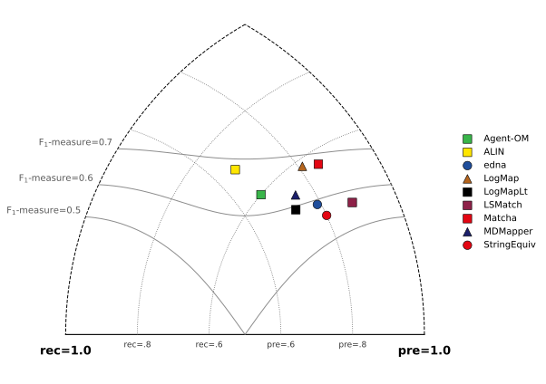
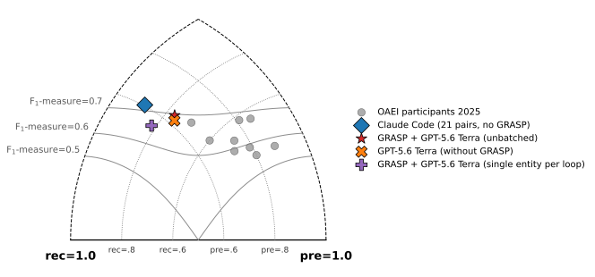

Some summary

<!--more-->

## Introduction

## Ontology Matching

*This section is based largely on the standard reference by Euzenat and Shvaiko <a href="#euzenat2013">[1]</a>.*

*Ontology matching* or *ontology alignment* (hereafter OM) has been an active field of research since the 1990s and still plays an important role in the real world today. When two companies merge, for instance, or legacy software systems are consolidated, their databases have to be linked. Without OM, the merged system would not recognize that ```client``` and ```date_of_birth``` in system A mean the same thing as ```customer``` and ```DOB``` in system B, leading to duplicate records, fragmented data, and analyses that report incorrect figures. Customers would receive duplicate invoices, search queries would return incomplete results, and automated workflows would fail on incompatible fields. OM is likewise used extensively in medical and pharmaceutical research, where hospitals and laboratories worldwide need to harmonize clinical trial data and drug databases. It is equally indispensable for modern web search engines and knowledge graphs (such as Wikidata or Google), which connect data globally, as well as for e-commerce platforms and supply chains that merge product data and spare-parts catalogs from thousands of heterogeneous suppliers into a single system in real time.

OM is difficult for computers for several reasons. First, equivalence and other relations between the individual entries in the databases (in technical terms, *entities*) rest on vague semantic-pragmatic (in the linguistic sense) criteria. One example is what Euzenat and Shvaiko call "semiotic heterogeneity" <a href="#euzenat2013">[1, p. 38]</a>. On this, they write <a href="#euzenat2013">[1, p. 38]</a>: 
> "[Semiotic heterogenity] is concerned with how entities are interpreted by people. Indeed, entities which have exactly the same semantic interpretation are often interpreted by humans with regard to the context, for instance, of how they are ultimately used. This kind of heterogeneity is difficult for the computer to detect and even more difficult to solve, because it is out of its reach. The intended use of entities has a great impact on their interpretation, therefore, matching entities which are not meant to be used in the same context is often error-prone."

Besides linguistic-semantic factors, structural factors (i.e., how the knowledge graph is built) also play a major role. This can be illustrated with a simple phenomenon: 


[KI: hier Unterschrift einfügen: "Chart 1: lexically high confidence but structurally unfitting correspondences"]

If the entities ```Corporation``` and ```Client``` in the two ontologies are set as equivalent, a problem arises: in the newly merged ontology, ```Corporation``` becomes a subcategory of ```Person```. A query for persons would then suddenly also return company objects. In the worst case, structural errors in matching can render an alignment completely unusable if they introduce logical violations, particularly when the database is represented in a highly formalized form (e.g., OWL/OWL2) on which reasoning is performed. There are many other structural consistency and similarity criteria that must be considered during matching. Here too, similarity measures remain quite vague, owing to subtle semiotic differences between graph models.

Finally, matching tasks often involve large ontologies (biomedical ontologies, for example, frequently comprise millions of entries), which is why matchers need to scale well.

Because the task is so difficult for machines, ontology alignment remains a challenge to this day. Regarding pure schema matching — the task this project is concerned with — the OAEI, which has for years been the standard evaluation platform for ontology matching, states <a href="#oaei2025">[2, p. 28]</a>: 
> "[S]till little substantial progress [is reached] in terms of the quality of the results or runtime of top matching systems. As already reported in the last years, we observe a performance plateau being reached by existing strategies and algorithms. It is also true that established matching systems tend to focus more on new tracks and datasets than on improving their performance in long-standing tracks, whereas new systems typically struggle to compete with established ones. [...] The best-performing systems are not consistent across tasks and settings, demonstrating the diversity of our datasets."

## Ontology Matching with LLMs
In recent years, LLMs have increasingly been incorporated into OM. Since training or even fine-tuning LLMs for this specific task has proven impractical <a href="#qiang2024">[3, p. 2]</a>, most systems instead use general-purpose LLMs via natural-language prompts. Because LLMs come with a very high runtime-complexity overhead, candidate search and selection in the systems tested so far is typically not left entirely to the LLM, but is complemented by traditional methods. Across every matcher I reviewed that uses LLMs and has taken part in the OAEI in recent years, the LLM's role is limited to two functions: 
1. Validating mappings: the LLM is asked to choose, among several pre-selected candidates, which one constitutes a valid mapping. These are typically edge cases that the other matching methods could not clearly confirm or rule out.
2. Enriching node information: the LLM is asked, for example, to augment labels with a short description of their meaning in the context of the graph, so that later steps can apply more robust similarity measures.

A notable example is AgentOM, which its creators describe, in a paper of theirs, as the "first [...] LLM-agent-based framework for OM tasks" <a href="#qiang2024">[3, p. 519]</a>. A review of the described algorithm and its source code shows that here, too, candidate search for equivalences between entities is largely carried out using traditional, deterministic methods, and that the LLM — besides enriching information about individual entities — functions only as an additional validation instance when equivalences are finally set.

## Project Goals and Research Questions
Since [GRASP](https://grasp.cs.uni-freiburg.de) has proven itself on many knowledge-graph-related tasks, this project set out to extend GRASP for OM. The plan was to first build a small prototype and test it on small pairs of ontologies. The literature review above shows that a genuinely agentic use of an LLM for the OM task has not yet been attempted. 

Accordingly, the project's central questions are:
1. Are agentic LLMs in general a promising approach for OM?
2. To what extent can GRASP help an agentic LLM perform the OM task faster and/or more accurately?

## GRASP in Kürze
GRASP works with RAG by equipping a freely chosen LLM with elaborate search functions over the knowledge graphs involved. It further implements an agentic loop in which the LLM receives an input instruction and then works out a solution to the given task over several rounds <a href="#walter-bast2025">[4]</a>. Besonders an GRASP ist, dass es dem agentichen LLM dazu verhilft, diverse Aufgaben in einem "Zero Shot Setting" zu meistern. Das heißt: Das Modell soll Aufgaben ohne Vorbereitung lösen [KI: bitte diese Erklärung zu Zero Shot verbessern...]. Dementsprechend ein zentraler Bestandteil der GRASP-Philosophie, dass die unterschiedlichen Aufgaben möglichst offen gehalten werden und nicht nur spezielle Typen der Aufgaben gelöst werden. Im Falle dieses Projekts heißt es: Es sollen unterschiedliche Representationsformate unterstützt werden und nicht nur etwa OWL-Ontologien, obwohl die üblichen Benchmarks meistens mit OWL-Ontologien arbeiten.


## The Test Track
As a point of reference for the first prototype, the OAEI's "Conference track" was chosen. As mentioned above, the OAEI's tracks are "the" standard benchmarks for OM. The Conference track in particular was chosen because it involves setting simple 1:1 equivalences between small ontologies (roughly 80–200 entities per ontology). With a few minor and negligible exceptions, these ontologies contain only classes and properties, no instances or literals (so-called "T-Box matching"). In doing so, the OAEI deliberately separates pure schema matching from instance matching (A-Box), which is more concerned with attribute similarity, duplicate detection, and scaling to large volumes of data, and instead focuses on the core question of ontology matching: whether two independently created concept hierarchies model the same concepts. This suits a first GRASP prototype well, because it keeps both the search space (80–200 rather than potentially millions of entities) and the number of tool calls needed per chat loop manageable, while the signals that LLM's strengths rely on, i.e. lexical context in diverse forms, are at the center of the task. 

It is also worth highlighting that, like most other OAEI tracks, all ontologies in this track are represented in the strongly formalized, reasoning-capable OWL format. This may be surprising, since in practice — in company databases, for instance — simpler and not always logically consistent models are far more common. The likely reason is that such logically consistent models are simply easier to evaluate. It also makes it possible to test whether matchers can read and exploit deeper relations between entities, such as disjointness and sub-entity relations. Here, GRASP's strength lies in the fact that it is not restricted to a single format and does not require logical consistency to perform the task well, but can instead respond flexibly to different formats and contexts. In that sense, the strong (artificial) focus on OWL ontologies is, if anything, an additional challenge for measuring GRASP's capabilities.

Overall, the Conference track is therefore a good test baseline for a first prototype that applies an agentic LLM to OM: it consists of small ontologies, requires good NLP — which is where LLMs excel — while at the same time it can expose potential weaknesses, since top-down reasoning and logical consistency are still a challenge for LLMs (as the tests also show).


## Implementation
The prototype aimed to stay within the GRASP framework as much as possible, initially forgoing other external modules or task-specific extensions, in order to have a baseline for further development. Accordingly, implementing the OM task within the GRASP framework involved:
1. formulating a suitable prompt for the LLM.
2. writing dedicated tools for the LLM to set and remove correspondences.
3. implementing injectivity enforcement when setting equivalences.
4. integrating the remaining GRASP components, namely the GRASP tools and `Shapes`, an index that provides a quick overview of a class's graph context for each class (see below in the example agentic loop).


## Beispiel eines Chat-Loops mit dem LLM innerhalb eines OM-Laufs mithilfe von GRASP
[KI: Wie kann man das so gestalten, dass die Zeilen in der Endansicht so umgebrochen werden, dass man nicht nach rechts scrollen muss, weil Zeilen zu lang sind?]
```text
USER
Align the following entity from the source ontology cmt with an entity from the target ontology edas or verify it has no appropriate match:
### Entity 1
**Source**: Full IRI: http://cmt#Chairman, shortened IRI: cmt:Chairman, label: Chairman, aliases: ['Chairman'], infos: ['class', 'subclass of Person']

shape:
cmt:Chairman {
  cmt:markConflictOfInterest cmt:Paper ;
}

Shapes are approximate (derived from instance data and/or schema declarations) and may be incomplete, so treat them as guidance. A leading ^ marks an inverse edge, where the class is the property's object.


Step 1
MODEL
Reasoning summary:
**Inspecting target chair roles**
Content:
I’ll compare CMT’s generic conference chair role with EDAS chair classes, starting from target shape discovery and then verifying hierarchy and review/conflict context.

search_shape({
  "kg": "edas",
  "query": "chair person conference management",
  "page": 1
}):
Shapes (page 1 of 2):
1. edas:ConferenceChair {
  edas:initiates edas:Call ;
  edas:isReviewing edas:Paper ;
  ^edas:isInitiatedBy edas:Call ;
  ^edas:isReviewedBy edas:Paper ;
}
2. edas:SessionChair {
  edas:initiates edas:Call ;
  edas:isReviewing edas:Paper ;
  ^edas:isInitiatedBy edas:Call ;
  ^edas:isReviewedBy edas:Paper ;
}
3. edas:ConferenceSession {
  edas:hasRelatedDocument edas:Document ;
  ^edas:relatesTo edas:Document ;
}

Step 2
MODEL
Reasoning summary:
**Listing CMT sources and class hierarchy**

Content:
`edas:ConferenceChair` is the likely counterpart; I’ll verify that it is a Person-level chair role and check whether CMT’s `Chairman` has any narrower session-specific meaning.

execute({
  "kg": "edas",
  "sparql": "SELECT ?super ?disjoint ?p ?range WHERE { OPTIONAL { edas:ConferenceChair rdfs:subClassOf ?super . FILTER(isIRI(?super)) } OPTIONAL { edas:ConferenceChair owl:disjointWith ?disjoint } OPTIONAL { edas:ConferenceChair ?p ?range . FILTER(?p IN (rdfs:subClassOf, rdfs:label, rdfs:comment)) } }"
}):
Got 1 row and 4 columns in 0.03s:
| super                | disjoint             | p               | range                |
| -------------------- | -------------------- | --------------- | -------------------- |
| Person (edas:Person) | Author (edas:Author) | rdfs:subClassOf | Person (edas:Person) |

[...]

Step 7
MODEL
Reasoning summary:
**Mapping CMT chairman roles**

Content:
EDAS has no generic `Chairman`; `ConferenceChair` and `SessionChair` are distinct. CMT’s generic management role aligns with the conference-level chair rather than the programme-session role, so I will establish the high-confidence correspondence.

set_correspondence({
  "source_entity": "http://cmt#Chairman",
  "target_entity": "http://edas#ConferenceChair",
  "overwrite": false
}):

Mapping Conflict detected: The entity 'http://edas#ConferenceChair' has already been mapped to 'cmt:ConferenceChair', but you proposed a new mapping to 'http://cmt#Chairman'.

Do not default to keeping the existing mapping. Treat both candidates as hypotheses and evaluate them from scratch:
- Option A (Current):   'http://edas#ConferenceChair' ≡ 'cmt:ConferenceChair'
- Option B (New candidate): 'http://edas#ConferenceChair' ≡ 'http://cmt#Chairman'

Compare both semantically and structurally. Which target entity is genuinely the better conceptual match?
- If Option B is superior: Re-submit by calling `set_correspondence(..., overwrite=True)`.
- If Option A is superior: It will be automatically retained. Find a different valid match for the unmapped entity or leave it unmapped.

Step 8
MODEL
Reasoning summary:
**Checking ConferenceChair distinction**

Content:
A collision shows that `edas:ConferenceChair` is already aligned to CMT’s explicitly named `ConferenceChair`. I’ll compare the two CMT chair concepts directly; the exact conference-role name is likely the superior match, while `Chairman` may have no safe EDAS equivalent.

execute({
  "kg": "cmt",
  "sparql": "SELECT ?class ?super ?p ?range WHERE { VALUES ?class { cmt:Chairman cmt:ConferenceChair } OPTIONAL { ?class rdfs:subClassOf ?super . FILTER(isIRI(?super)) } OPTIONAL { ?class ?p ?range . FILTER(?p NOT IN (rdf:type,rdfs:subClassOf,owl:equivalentClass)) } } ORDER BY ?class ?p"
}):
Got 2 rows and 4 columns in 0.02s:
| class                                  | super                                    | p                | range                                  |
| -------------------------------------- | ---------------------------------------- | ---------------- | -------------------------------------- |
| Chairman (cmt:Chairman)                | Person (cmt:Person)                      |                  |                                        |
| Conference Chair (cmt:ConferenceChair) | Conference Member (cmt:ConferenceMember) | owl:disjointWith | Associated Chair (cmt:AssociatedChair) |

Step 9
MODEL
Reasoning summary:
**Evaluating chairman role mappings**

Content:
No correspondence set for `cmt:Chairman`.

`edas:ConferenceChair` is already and more precisely aligned with `cmt:ConferenceChair`. `cmt:Chairman` is only a generic `Person` subclass, while EDAS offers only conference- and session-specific chair roles; neither is safely equivalent.

OUTPUT
| Source Entity (Ontology 1)        |  Target Entity (Ontology 2) | Relation |
| --------------------------------- | --------------------------- | -------- |
| http://cmt#Conference             |      http://edas#Conference |        = |
| http://cmt#Paper                  |           http://edas#Paper |        = |
| http://cmt#Person                 |          http://edas#Person |        = |
| http://cmt#Reviewer               |        http://edas#Reviewer |        = |
| http://cmt#Document               |        http://edas#Document |        = |
| http://cmt#ProgramCommitteeMember |       http://edas#TPCMember |        = |
| http://cmt#Author                 |          http://edas#Author |        = |
| http://cmt#Review                 |          http://edas#Review |        = |
| http://cmt#ConferenceChair        | http://edas#ConferenceChair |        = |

================================================================================

TRACE (task=om, elapsed=19.19s)
```


## Tests
To evaluate matchers, the OAEI implements the [MELT](https://dwslab.github.io/melt/) framework. All tests described below were evaluated using this evaluation environment, in order to compare results with current state-of-the-art matchers that have taken part in the OAEI in recent years. The full evaluation comprises 7 ontologies to be aligned pairwise (out of 16 ontologies in the track in total), yielding 21 test pairs. I carried out the following tests:

1. First, a full test run over the 21 ontology pairs from the Conference track was carried out natively with Claude Code in the Claude Code CLI, i.e., completely without GRASP. Here, only the same prompt used for the OM task in GRASP was used. The goal was to get an initial sample of how a powerful middle-tier model performs in an agentic environment that allows an LLM to work on tasks over multiple steps.

2. Second, several test runs were carried out on a sub-sample of 4 ontologies, and thus 6 ontology pairs instead of 21, since tests are costly due to the use of an LLM via API. Here, my GRASP extension was tested with OpenAI's GPT-5.6 Terra. First, the task was organized — following the pattern of other GRASP tasks — so that the LLM had to map only a single entity from the source ontology to the target ontology per chat loop. A matching task therefore consisted of many chat loops, e.g., 100 individual chat loops when the source ontology had 100 entities. For comparison, a test was run with OpenAI's GPT-5.6 Terra without GRASP, similar to the test with Claude Code, to see whether differences emerge when working on the task within the GRASP framework. All model configurations (verbosity, reasoning effort, etc.) were kept identical to the GRASP test run. Based on the results of these two tests, a further test run was then carried out on the same 6 ontology pairs with GRASP, but this time without matching individual entities per chat loop; instead, the entire source ontology was provided at once. This meant that, within a single chat loop, the LLM had to find equivalent counterparts in the target ontology for up to 185 entities.

## Test Results
MELT evaluiert Alignments des Conference Tracks gegen ein von Expert*innen manuell gefertigtes Reference Alignments. Die OAEI nutzt bei ihrer internen Auswertung zwei weitere Stufen, die aber nicht öffentlich zugänglich und damit nicht exakt reproduzierbar sind. Obwohl die dritte Stufe laut OAEI ausschlaggebend ist ("uncertain" reference alignment, resolved for logic violations) (__ZITAT__ https://oaei.ontologymatching.org/2025/results/conference/eval.html), zeigt eine Durchsicht der Ergebnisse, dass die Rangfolge der Matcher zwischen der hier beschriebenen Stufe 1 und 3 gleich bleibt. Der größte Unterschied ist, dass Matcher generell schlechter abschneiden, wenn sie gegen das dritte Referenz-Alignmentgemessen werden. Deshalb werden alle Ergebnisse hier in der CRISP-Reference-Alignment-Version gezeigt, also die oben beschriebene Stufe 1 ("ra1-M3" laut __ZITAT__ https://oaei.ontologymatching.org/2025/results/conference/eval.html):


[KI: Unterschrift "Official Results for the Conference Track 2025 (ra1-M3) according to __ZITAT__ https://oaei.ontologymatching.org/2025/results/conference/eval.html"]


[KI: Unterschrift "Results from my Tests Compared to official OAEI Results 2025"]

## Analyse der Ergebnisse
Auf dem zweiten Schaubild ist erkennbar, dass die Ergebnisse von agentischen LLMs für kleine Ontologien wie im Conference Track der OAEI vielversprechend sind. Ein general purpose LLM-Agent wie Claude Code erzielt mit den Standardkofigurationen und in seiner nativen, nicht speziell für diese Aufgabe eingerichteten Umgebung (Claude Code CLI) ein Ergebnis, das vom F1-Score leicht besser dasteht als die spezialisierten Spitzen-Matcher des Jahres 2025. 

Auch ist auffällig, dass die Ergebnisse von agentichen LLMs im Gegensatz zu den aktuellen Matchern stark in die "Recall"-Hälfte im Schaubild rücken. Das deckt sich mit bisherigen Beobachtungen, dass LLMs bei OM zu hohem Recall und schwacher Precision tendieren (__ZITAT__ https://ceur-ws.org/Vol-3632/ISWC2023_paper_427.pdf, https://arxiv.org/html/2404.10329v1, http://arxiv.org/html/2507.14032v1). Dabei wurde der Prompt an das LLM im akutellen Projekt in jedem Testfall absichtlich 'streng' formuliert, mit mehreren eingebetetten "Precision over Recall"-Hinweisen und Erklärungen, wie das LLM zu großzügige Äquivalenzsetzungen vermeiden soll, da mir das Problem aus der Literatur bereits bekannt war.

Als zweiter Punkt fällt auf, dass die Ergebnisse vom einfachen GPT-5.6 Terra-Lauf ohne GRASP ähnlich stark wie die Testläufe mit GRASP sind. In diesem minimalen Kontrolllauf konnte das LLM nur übliche bash-Tools nutzen, aber keine Netzwerkaufrufe starten und hatte im Gegensatz zum Testlauf in der GRASP-Umgebung keine Möglichkeit, SPARQL-Queries auf die Ontologien aufzurufen. Eine Analyse des Chatverlaufs zeigt, dass das LLM in diesem Setting hauptsächlich über die Python-Bibliothek RDFLib gearbeitet hat und sich so relevante Informationen zur Gesamtontologie und zu Einzelentitäten beschaffen konnte. Dagegen arbeitet dasselbe LLM mit denselben Einstellungen im GRASP-Kontext neben den GRASP-eigenen Suchfunktiionen viel mit SPARQL-Aufrufen. Die ähnlichen F1-Ergebnisse zwischen GPT-5.6 mit und ohne GRASP waren für mich und das GRASP-Team eine große Überraschung, denn die Bearbeitung anderer Aufgaben mit GRASP, etwa Cell Entity Annotation, hat gezeigt, dass das LLM diese Aufteilung in einzelne Elemente braucht, um gut zu performen. Die Tests mit kleinen Ontologien ergeben aber für OM, dass solch kleinteiliges Batching eine Fehlkonfiguration darstellt. Denn während die F1-Scores mit und ohne Batching ähnlich ausfallen, zeigen sich große Unterschiede in Laufzeit und Tokenverbrauch: Während das LLM ohne GRASP knapp 650.000 Tokens für alle 6 Ontologiepaare benöntigte, betrug der Tokenverbrauch beim ungebatchten GRASP-Testlauf mehr als 3,5 Mio für dieselbe Aufgabe. Beim gebatchten GRASP-Testlauf (eine Eintity pro Chat-Loop) brauchte es sogar über 22 Mio Tokens. Der Unterschied zwischen GRASP und no GRASP, beides ohne Batching, lässt sich folgendermaßen erklären: Eine genauere Durchsicht des Chatverlaufs zeigt, dass der Tokenoverhead bei GRASP vor allem am GRASP-internen Chat-Loop-Design liegt. Bei jeder Runde wird dem LLM die gesamte Chathistorie gesendet und jeder Tool-Call erzwingt bei GRASP eine neue Runde. In diesem konkreten Fall bewirkt es, dass das LLM bei jeder Korrespondenzsetzung (davon gab es 99) den gesamten Chatverlauf nochmals als Input geschickt bekommen hat. Diese 1-Toolcall-pro-Runde-Erzwingung wurde beibehalten, damit jede Äquivalenzsetzung auf Injektivitätsverletzungen überprüft werden kann, sollte aber in der Zukunft nochmal ausführlich überprüft werden. Der Token-Overhead beim Single-Entity-per-Loop-Lauf entsteht, weil das LLM bei jeder Quellentität den Quell- und Zielgraphen neu exploriert (über 3000 SPARQL-, Suchfunktions und Graphverbalisierungsaufrufe über die gesamte Aufgabe verteilt gegenüber 55 solche Aufrufe beim ungebatchten GRASP-Testlauf). Während diese Fokussierung auf ein oder wenige Elemente pro Chat-Loop bei anderen Aufgabentypen hilfreich ist, scheint sie hier pure Verschwendung zu sein.

## Fazit und Ausblick
Das Projekt hat sich auf ein erstes Prototyp für OM mithilfe von GRASP fokussiert. Im Zentrum stand ein 'puristisches' GRASP-Artifakt, das diese Aufgabe möglichst mit GRASP-eigenen Mitteln und nach dem Vorbild anderer Aufgabenlösungen von GRASP (vor allem Cell Entity Annotation) zu lösen versucht. Eine Literaturrecherche und die Sichtung der Matcher, die in den letzten Jahren bei der OAEI teilgenommen haben, ergibt, dass ein Matcher, der auf agentisches LLM basiert, bisher eine Lücke darstellt. Ferner ergeben die in diesem Projekt geführten Tests, dass  LLM-Agenten aus dem Alltag bereits beachtliche Ergebnisse im OM erzielen. Gleichzeitig zeigt sich aber auch, dass GRASP bei kleinen Ontologien noch keinen Mehrwert gegenüber einfachen Multi-Purpose-Umgebungen für agentische LLMs bietet. 

Zentrale Fragen, die aus dem Projekt resultieren sind: 
1. Lassen sich die Ergebnisse für kleine Ontologien noch deutlich verbessern?
2. Wie lassen sich solche OM-LLM-Agenten auf große Ontologien skalieren?

GRASP besitzt Potenzial, bei beiden Problemen weiterzuhelfen. Hierzu sollten Prompts an das LLM noch systematisch entwickelt und verbessert werden sowie mögliche Settings für das Zusammenspiel mit traditionellen Methoden untersucht werden.


<footer>
    <h1 id="references"> References </h1>
    <ol id="references-ol">
        <li id="euzenat2013"> J. Euzenat and P. Shvaiko, <em>Ontology Matching</em>, 2nd ed. Berlin, Heidelberg: Springer, 2013. doi: <a href="https://doi.org/10.1007/978-3-642-38721-0">10.1007/978-3-642-38721-0</a>. </li>
        <li id="oaei2025"> M. Abd Nikooie Pour et al., "Results of the Ontology Alignment Evaluation Initiative 2025," CEUR Workshop Proceedings, vol. 4144, 2025. <a href="https://inria.hal.science/hal-05447839v1/document">https://inria.hal.science/hal-05447839v1/document</a>. </li>
        <li id="qiang2024"> Z. Qiang, W. Wang, and K. Taylor, "Agent-OM: Leveraging LLM Agents for Ontology Matching," Proceedings of the VLDB Endowment, vol. 18, no. 3, pp. 516–529, 2024. doi: <a href="https://doi.org/10.14778/3712221.3712222">10.14778/3712221.3712222</a>. </li>
        <li id="walter-bast2025"> S. Walter and H. Bast, "GRASP: Generic Reasoning And SPARQL Generation across Knowledge Graphs," in <em>The Semantic Web – ISWC 2025</em>, Lecture Notes in Computer Science, Springer, 2026. doi: <a href="https://doi.org/10.1007/978-3-032-09527-5_15">10.1007/978-3-032-09527-5_15</a>. </li>
    </ol>
</footer>
