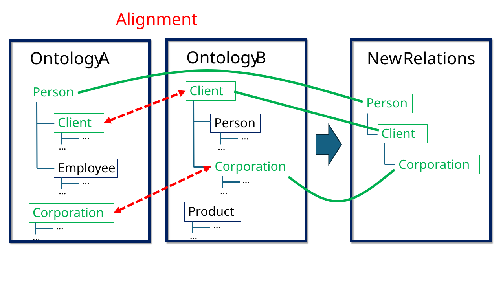

Some summary

<!--more-->

## Introduction

## Ontology Matching

*Der folgende Abschnitt basiert weitgehend auf dem Standardwerk von Euzenat und Shvaiko <a href="#euzenat2013">[1]</a>.*

*Ontology Matching* bzw. *Ontology Alignment* (im folgenden OM) wird seit den 1990ern erforscht und betrieben und spielt heute nach wie vor eine wichtige Rolle in der echten Welt. Wenn etwa zwei Firmen fusionieren oder alte Softwaresysteme zusammengelegt werden, müssen deren Datenbanken verknüpft werden. Ohne OM würde das fusionierte System nicht erkennen, dass ```client``` und ```date_of_birth``` in System A dasselbe bedeuten wie ```customer``` und ```DOB``` in System B, wodurch Duplikate entstehen, Datenbestände fragmentiert bleiben und Analysen falsche Kennzahlen liefern. Kunden würden Rechnungen doppelt erhalten, Suchabfragen würden unvollständige Treffer liefern, und automatisierte Workflows würden an inkompatiblen Feldern scheitern. OM kommt auch in der Medizin- und Pharmaforschung zum Einsatz, wo Krankenhäuser und Labore weltweit klinische Studien und Wirkstoffdatenbanken harmonisieren müssen. Ebenso unverzichtbar ist es für moderne Web-Suchmaschinen und Wissensgraphen (wie Wikidata oder Google), die Datenbestände global vernetzen, sowie für E-Commerce-Plattformen und Logistikketten, die Produktdaten und Ersatzteilkataloge von tausenden heterogenen Lieferanten in Echtzeit in einem einheitlichen System zusammenführen.

OM ist aus mehreren Gründen schwierig für Computer. Zum einen beruhen Äquivalenz- und andere Beziehungen zwischen den einzelnen Einträgen in den Datenbanken (fachsprachlich *entities*) auf vage semantisch-pragmatische (im linguistischen Sinne) Kriterien: Dazu zählt zum Beispiel die "Semiotic heterogenity", wie Euzenat und Shvaiko sie nennen <a href="#euzenat2013">[1, S. 38]</a>. Sie sagen dazu <a href="#euzenat2013">[1, S. 38]</a>: 
> "[Semiotic heterogenity] is concerned with how entities are interpreted by people. Indeed, entities which have exactly the same semantic interpretation are often interpreted by humans with regard to the context, for instance, of how they are ultimately used. This kind of heterogeneity is difficult for the computer to detect and even more difficult to solve, because it is out of its reach. The intended use of entities has a great impact on their interpretation, therefore, matching entities which are not meant to be used in the same context is often error-prone."
Zum anderen spielen neben sprachlich-semantischen Faktoren auch strukturelle Faktoren (also der Aufbau des Wissensgraphen) eine große Rolle. Dies sei anhand eines einfachen Phänomens verdeutlicht: 



Wenn die jeweiligen Entities ```Corporation``` und ```Client``` in beiden Ontologien als äquivalent gesetzt werden, entsteht das Problem, dass ```Corporation``` in der neu entstanden Gesamtontologie eine Unterkategorie von ```Person``` ist. Eine Suchanfrage auf Personen liefert auf einmal Firmenobjekte. Im schlimmsten Fall machen strukturelle Fehler beim Matching ein Alignment völlig unbrauchbar, wenn dadurch Logikverletzungen entstehen, während die Datenbank in einer stark formalisierten Form repräsentiert wird (z. B. OWL/OWL2) und darauf Reasoning ausgeführt wird. Es gibt viele weitere strukturelle Konsistenz- und Ähnlichkeitskritierien, die beim Matching bedacht werden müssen. Auch hier bleiben Ähnlichkeitsmaße aufgrund von schwer fassbaren semiotischen Unterschieden bei den Graphmodellierungen sehr vage.

Nicht zuletzt betrifft die Matching-Aufgabe häufig große Ontologien (biomedizinische Ontologien umfassen beispielsweise nicht selten Millionen von Einträgen), weshalb Matcher gut skalieren können sollten.

Aufgrund der Schwierigkeit der Aufgabe für Maschinen stellt Ontology Alignment nach wie vor eine Herausforderung dar. Bezüglich reinem Schema-Matching, der Aufgabe, mit der sich das vorliegende Projekt beschäftigt hat, postuliert die OAEI, die seit Jahren als die Standard-Evaluationsplattform für Ontology-Matching gilt, <a href="#oaei2025">[2, S. 28]</a>: 
> "[S]till little substantial progress [is reached] in terms of the quality of the results or runtime of top matching systems. As already reported in the last years, we observe a performance plateau being reached by existing strategies and algorithms. It is also true that established matching systems tend to focus more on new tracks and datasets than on improving their performance in long-standing tracks, whereas new systems typically struggle to compete with established ones. [...] The best-performing systems are not consistent across tasks and settings, demonstrating the diversity of our datasets."

## Ontology Matching mithilfe von LLMs
In den letzten Jahren wurden LLMs zunehmend im OM einbezogen. Da sich das Training oder sogar Fine-Tuning von LLMs auf diese spezifische Aufgabe als unpraktisch erweist <a href="#qiang2024">[3, S. 2]</a>, nutzen die meisten Systeme allgemeine LLMs mittels natürlichsprachlicher Prompts. Da LLMs einen sehr hohen Overhead an Laufzeitkomplexität mit sich bringen, wird die Kandidatensuche und -auswahl in den bisher getesteten Systeme typischerweise nicht vollständig dem LLM überlassen, sondern durch traditionelle Verfahren ergänzt. Die Rolle des LLMs beschränkt sich in allen von mir durchgesichteten Matchern, die in den letzten Jahren bei der OEAI mitgemacht haben und LLMs nutzen, auf zwei Funktionen: 
1. Validierung von Mappings: Das LLM soll zwischen mehreren vorausgewählten Kandidaten wählen, welches ein valides Mapping darstellt. Typischerweise sind es Randfälle, die die anderen Matching-Methoden nicht klar setzen oder ausschließen konnten.
2. Informationsanreicherung von Knoten: Das LLM soll beispielsweise Labels um eine kurze Bedeutungsbeschreibung im Zusammenhand des Graphen ergänzen, damit spätere Schritte robustere Ähnlichkeitsmaße setze können. 
Ein bezeichnendes Beispiel ist AgentOM, das in einem Paper der Macher als "first [...] LLM-agent-based framework for OM tasks" profiliert wird <a href="#qiang2024">[3, S. 3]</a>. Eine Durchsicht des beschriebenen Algorithmus und des Quellcodes ergibt, dass auch hier die Kandidatensuche für Äquivalenzen zwischen Entities weitgehend mithilfe von traditionellen deterministischen Verfahren durchgeführt wird und das LLM neben einer Anreicherung der Informationen zu den einzelnen Entitäten nur als eine zusätzliche Validierungsinstanz beim endgültigen Setzen der Äquivalenzen fungiert.

## Zielsetzung und Fragestellung des Projekts
Da [GRASP](https://grasp.cs.uni-freiburg.de) sich in vielen Knowledge-Graph-bezogenen Aufgaben bewährt hat, sollte GRASP in diesem Projekt für OM erweitert werden. Dabei sollte erstmal ein kleines Prototyp gebaut und anhand von kleinen Ontologiepaaren getestet werden. Aus dem Literaturbericht oben wird ersichtlich, dass ein wahrhaftig agentischer Einsatz eines LLMs bei der OM-Aufgabe bisher nicht versucht wurde. Als Orientierung für das erste Prototyp wurde der "Conference-Track" der OAEI ausgewählt. Die Tracks der OAEI stellen wie oben erwähnt "die" Standard-Benchmarks für OM dar. Es wurde speziell der Conference-Track ausgesucht, da hier simple 1:1-Äquivalenzen zwischen kleinen Ontologien (circa. 80-200 Entities pro Ontologie) gesetzt werden sollen. In diesen Ontologien sind bis auf kleine und unbedeutende Ausnahmen nur Klassen und Properties enthalten und keine Instanzen/Literale (sogenanntes "T-Box-Matching") [KI: kurze Erklärung, warum die OAEI das so macht und warum es sich für ein erstes GRASP-Prototyp gut eignet?]. Hervorzuheben ist, dass alle Ontologien im Track im stark formalisierten und Reasoning-fähigen OWL-Format repräsentiert sind, wie die meisten anderen Traks der OAEI auch [KI: warum macht die OAEI das so, obwohl in der Realität, z. B. in der Wirtschaft häufiger einfache, logisch nicht konsistente Modellierungen gewählt werden? Ferner: was hat es mit meiner Zielsetzung und Fragestellung zu tun?].
Dementsprechend sind die zentralen Frage des Projekts:
1. Sind agentische LLMs allgemein potenziell ein guter Ansatz für OM?
2. Inwiefern kann GRASP einem agentischen LLM bei der OM-Aufgabe dazu verhelfen, schneller und/oder präziser zu arbeiten.

## Implementierung
Das Prototyp hatte zum Ziel, möglichst innerhalb vom GRASP-Framework zu bleiben und erstmal auf sonstige externe Module oder aufgabenspezifische Erweiterungen zu verzichten, um eine Basline für weitere Entwicklungen zu haben. GRASP arbeitet mit RAG, indem es ein frei gewähltes LLM mit ausgetüftelten Suchfunktionen auf die involvierten Knowledge Graphs ausstattet. Ferner implementiert es einen agentischen Loop, indem das LLM eine Input-Anweisung bekommt und dann in mehreren Runden eine Lösung für die jeweilige Aufgabe erarbeitet <a href="#walter-bast2025">[4]</a>. Dementsprechend bestand die Implementierung der OM-Aufgabe innerhalb des GRASP-Framework darin, einen passenden Prompt an das LLM zu formulieren, spezielle Tools für das LLM zum Setzen und Entfernen von Korrespondenzen zu schreiben, eine Injektivitätserzwingung beim Setzen von Äquivalenzen zu implementieren und die übrigen GRASP-Bestandteile zu integrieren, also GRASP-Tools und `Shpaes`, ein Index, das zu Klassen eine schnelle Übersicht über ihren Graphkontext liefert (siehe unten im beispielhaften agentischen Loop).


## Tests
Zum Evaluieren von Matchern implementiert die OAEI das [MELT](https://dwslab.github.io/melt/)-Framework. Alle im Folgenden beschriebenen Tests wurden mithilfe dieser Evaluationsumgebung ausgewertet, um einen Vergleich mit aktuellen State-of-the-Art-Matchern zu haben, die in den letzten Jahren bei der OAEI mitgemacht haben. Die volle Evaluation beinhaltet 7 Ontologien, die paarweise alignt werden sollen (aus insgesamt 16 Ontologien im Track), wodurch 21 Testpaare entstehen. Folgende Tests wurden von mir durchgeführt:

1. Einerseits wurde ein voller Testlauf mit 21 Ontologiepaaren aus dem Conference-Track mit Claude Code nativ in der Claude Code CLI durchgeführt, also völlig ohne GRASP. Hier wurde bloß derselbe Prompt verwendet, wie er auch in der OM-Aufgabe in GRASP steht. Ziel war es, eine erste Stichprobe zur Leistung eines leistungsstarken middle-tier Modells in einer agentischen Umgebung zu haben, die einem LLM eine mehrschrittige Bearbeitung von Aufgaben erlaubt.

2. Andererseits wurden mehrere Testläufe auf einem Unter-Sample von 4 Ontologien und damit 6 Ontologiepaaren statt 21 durchgeführt, da die Tests wegen der Nutzung eines LLMs per API kostspielig sind. Hier wurde meine GRASP-Erweiterung mit OpenAIs GPT-5.6 Terra getestet. Zuerst wurde die Aufgabe in Anlehnung an andere GRASP-Aufgaben so organisiert, dass das LLM pro Chat-Loop nur eine einzelne Entity aus der Quellontologie zur Zielontologie mappen sollte. Eine Matching-Aufgabe bestand damit aus vielen Chat-Loops, etwa aus 100 einzelnen Chat-Loops, wenn die Quellontologie 100 Entities besaß. Zum Vergleich wurde ein Test mit OpenAIs GPT-5.6 Terra ohne GRASP durchgeführt, ähnlich wie der Test mit Claude Code, um zu sehen, ob Unterschiede zum Bearbeiten der Aufgabe innerhalb vo GRASP-Framework ersichtlich werden. Dabei wurden alle Konfigurationen des Modells (Verbosity, Reasoning Effort etc.) gleich gesetzt wie beim GRASP-Testlauf. Aufgrund der Ergebnisse dieser beiden Tests wurde dann ein weiterer Testlauf auf dieselben 6 Ontologiepaare mit GRASP durchgeführt, wobei aber nun nicht mehr einzelne Entities pro Chat-Loop gematcht werden sollten, sondern stets die gesamte Quellontologie eingegeben wurde. Damit musste das LLM innerhalb eines Chat-Loops für bis zu 185 Entities äquivalente Gegenstücke in der Zielontologie finden.

## Test-Ergebnisse

<footer>
    <h1 id="references"> Quellen </h1>
    <ol id="references-ol">
        <li id="euzenat2013"> J. Euzenat and P. Shvaiko, <em>Ontology Matching</em>, 2nd ed. Berlin, Heidelberg: Springer, 2013. doi: <a href="https://doi.org/10.1007/978-3-642-38721-0">10.1007/978-3-642-38721-0</a>. </li>
        <li id="oaei2025"> M. Abd Nikooie Pour et al., "Results of the Ontology Alignment Evaluation Initiative 2025," CEUR Workshop Proceedings, vol. 4144, 2025. <a href="https://inria.hal.science/hal-05447839v1/document">https://inria.hal.science/hal-05447839v1/document</a>. </li>
        <li id="qiang2024"> Z. Qiang, W. Wang, and K. Taylor, "Agent-OM: Leveraging LLM Agents for Ontology Matching," Proceedings of the VLDB Endowment, vol. 18, no. 3, pp. 516–529, 2024. doi: <a href="https://doi.org/10.14778/3712221.3712222">10.14778/3712221.3712222</a>. </li>
        <li id="walter-bast2025"> S. Walter and H. Bast, "GRASP: Generic Reasoning And SPARQL Generation across Knowledge Graphs," in <em>The Semantic Web – ISWC 2025</em>, Lecture Notes in Computer Science, Springer, 2026. doi: <a href="https://doi.org/10.1007/978-3-032-09527-5_15">10.1007/978-3-032-09527-5_15</a>. </li>
    </ol>
</footer>