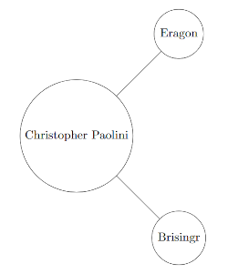
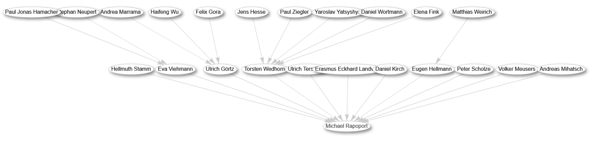

This blog post discusses the migration of Scholia from the Wikidata Query Service to Qlever. In particular, the services that the Wikidata Query Service offers and that are being used in Scholia are analyzed. Further, replicating the functionality of these services through SPARQL queries is explored.

<!--more-->

For easier understanding of this blog post, a few key terms will be defined first:
- The Resource Description Framework (further called RDF) is an information description standard. Using this standard, any information is described as an expression in the form of a triple consisting of subject, predicate and object (e.g. Christopher Paolini, has-occupation, author). A table of data points in this form can be seen as a directed and labeled graph, where the predicate connects the subject along a directed edge to the object.
- A graph is a data structure that consists of a set of data points, called nodes, which we visually represent with a circle. The interesting feature of graphs is that data points can be in relation to each other. For visual representation, we draw a line (or edge) connecting the nodes. The elements "Christopher Paolini", "Eragon" and "Brisingr", together with the relation "author" can be visualized as such:
  
- The SPARQL 1.1 standard defines a language to query and update RDF-style data as well as protocols for handling RDF-style data. This standard defines the syntax and semantics of the SPARQL 1.1 Query Language, including some extensions.
  One extension that is particularly important for this blog post is Federated Queries. They allow parts of the query to be federated to services. Services represent endpoints different from the database that queries Wikidata. They evaluate a part of the query and send the intermediary result back to the database. 
  Various databases implement SPARQL, but the operations used to compute a query can differ greatly. This explains why there are significant differences in the performance of different databases, even though they are queried in the same query language.
- Wikidata is a free and open knowledge base maintained by the Wikimedia Foundation. Wikidata adheres to the RDF format. Therefore it is a graph-based database. This in turn means emphasis is put not on the items, but on their relations with each other. From a human perspective, following the edges of a graph is a very easy/intuitive way to understand the relations between entities. A graph also preorders the data naturally. This allows for efficient lookup algorithms and short query times. Thus, Wikidata is suited to automated updating and retrieving information. It is used in that manner, for example, by other Wikimedia projects like Wikipedia.
- Scholia is an open-source project that renders Wikidata's scientific and bibliographic information accessible at the click of a button. It eliminates the need to write custom SPARQL queries to access Wikidata's knowledge, speeding up the process immensely and opening up a whole new world of data for people without a SPARQL background. In Scholia, pre-written SPARQL query templates are used to query Wikidata. They are selected based on the topic of the prompt. The collected data is then visualized for better readability (display formats include graphs, lists, timelines, bar charts, and geolocations) and used to create a scholarly profile. This profile is not just a lot of data that has to be sifted through in order to find the interesting part but instead looks like a modern and orderly website.
- Querying the Wikidata dataset varies in efficiency, based on the database that evaluates the query. Since Wikidata is a very large dataset, only such databases that have high performance can be considered. Examples of such databases are Blazegraph, QLever, and Virtuoso. 
  The Wikidata project provides its own service to query the Wikidata dataset, called Wikidata Query Service (WQS). This service runs using the Blazegraph database, because Blazegraph is especially known for its performance.

## Migration of Scholia
The Scholia project wanted to move away from using the WQS and instead use Qlever to query Wikidata. This is because, recently, Wikidata has been growing to a scale that Blazegraph is struggling to perform well on. The immediate solution to this problem was to split the dataset into a scholarly dataset and a main dataset (commonly referred to as scholarly/main graph, the split is referred to as Wikidata graph split).[^1]
The scholarly dataset contains theses, papers, researchers, and the like. Everything else is part of the main dataset. The scholarly set has fewer items but a higher connection density. This results in about half of all triples being part of the scholarly dataset. Therefore, each dataset is about the same size.[^2] 

### Consequences for Scholia
Scholia relies on SPARQL query templates to function. These queries were all written to run on the unified Wikidata dataset. Though not for every query, access to both datasets is important for scholia queries. The graph split thus renders Scholia unable to function without some major adjustments.
The straightforward solution would have been to rewrite all the close to 400 templates so that they run on the split datasets. Instead, the Scholia team decided to migrate the project to a different database: Qlever. 
Qlever is an open-source database developed and maintained by the Chair of Algorithms and Data Structures at the University of Freiburg. It has been demonstrated that Qlever's performance scales extremely well with huge databases like Wikidata. If WQS had been running on Qlever, it likely would not have been necessary to split Wikidata at all.
This database migration was not the easiest way to deal with the split, as it came with a lot of hardships. However, it is also supposed to serve as a first step and a proof of concept to migrate the entire Wikidata ecosystem to Qlever.

### Challenges of migrating to Qlever
The process of migrating Scholia to Qlever came with a lot of challenges. The biggest one and the one discussed in this blog post are the query templates. The templates were often not conforming to the SPARQL 1.1 standard and had to be rewritten.
The Wikidata Query Service (WQS) exposes a set of handy services. Throughout Scholia's templates, various of these services were used. They allow for increased performance in the case of some queries, whereas other queries rely on them to work.
These services are not available when querying Wikidata with Qlever. Therefore, the goal of the migration is to replicate their behavior in SPARQL. 
The services discussed in this work will be discussed from the context of their usage in scholia. Therefore, only parts of their functionality will be touched on.

A big part of this work consisted of finding templates that were not working and directly comparing the results of templates. 
See [here](https://github.com/KonradLinden/scholia/tree/template_testing/scholia/app/templates/testing) the Python testing scripts that were created and used to test the query templates, as well as compare their results and performance across different endpoints (Qlever and WQS).

#### GAS - Gather, Apply, Scatter
Graph traversal problems are a class of problems that are defined by finding paths to or between nodes or finding nodes along paths. A path is a sequence of relations that leads to a specific target node. Intuitively, it is problems where a graph needs to be searched by traversing it. Frequently occurring examples of these problems are "Given a start node, which nodes can be reached by traversing some relation(s)", "Can a target node be reached from a start node" or "Finding the shortest path from start to target node"
Wikidata is a large dataset of RDF-style triples. There are many different types of relations that connect many different types of nodes, forming a densely connected graph. This is where graph traversal problems become challenging and the need for efficient algorithms arises.
For exactly these situations, GAS algorithms were invented. They strive to efficiently solve graph traversal problems. 

Algorithms following the GAS structure are powerful tools of graph analysis because they are highly parallel. At the core of these algorithms is the "think like a vertex"[^3][^4] approach. The idea is to view the graph from a node's perspective. Each node only needs information about its neighboring nodes, making it independent of other calculations. This makes it possible to search from the perspectives of many nodes in parallel. 
A node that is active during one iteration of a GAS algorithm will execute the following three steps:
- Gather: It will gather information about what neighbors it has.
- Apply: The gathered information is used to compute its new state. This can include, for example, a goal check (check if one of the neighbors is the target node), or creating a new shortest (sub)path.
- Scatter: It will distribute the results of the previous step to its neighbors, and it may also activate its neighbors for the next iteration.

Further, this class of algorithms is treated in the context of an example, a query template from Scholia: author academic tree. This query template aims to build an academic tree for a given researcher. An academic tree is a tree-like graph of researchers, where the root node is the target researcher. This tree branches into the supervisors and students (PhD students/supervisors) and ultimately contains every researcher who is linked to the target through either a chain of supervision relations or a chain of student relations.

In this example, an academic tree for the mathematician Michael Rapoport (Q90246) is constructed. Since the target is used frequently in this example, it is bound to a handy prefix. This prefix will be used in the entire section on GAS, including all its subheadings.
  ``` sparql
PREFIX target: <http://www.wikidata.org/entity/Q90246>
  ```  

###### GAS in Blazegraph
WQS grants access to GAS algorithms through a service call to ```gas:service``` (using the ```SERVICE``` keyword). We will only touch on the following Breath-First-Search (BFS) algorithm (which is selected through the ```gas:gasClass``` argument).
```sparql
# previous implementation using gas
SELECT ?student1 ?supervisor1 (MIN(?depth1) AS ?depth) WHERE {
  SERVICE gas:service {
    gas:program gas:gasClass "com.bigdata.rdf.graph.analytics.BFS" ;
                gas:in target: ;
                gas:traversalDirection "Forward" ;  
                # "Reverse" for reverse traversal
                # "Undirected" for undirected traversal
        gas:out ?student1 ;
                gas:out1 ?depth1 ;
                gas:out2 ?supervisor1 ;
                gas:linkType wdt:P185 ;
  }
}
```

The input ```gas:in``` defines the initial state of the frontier. The frontier of the algorithm contains all nodes that will be activated and that will calculate their own states in the next iteration of the algorithm. Initially, it is set to the target node because it is the root of the academic tree.
The link between nodes is the relation ```wdt:P185 = doctoral student``` (set with the arg ```gas:linkType```).
Each result at the depth ```?depth1``` (length of the chain of links) of this algorithm is a direct or indirect student of the target researcher (captured in the ```?student1``` variable). ````?supervisor1```` captures the direct supervisors of the students, which is the direct predecessor in the tree graph. 
Note that this doesn't construct a full academic tree, because only (possibly indirect) students of the target are found and not supervisors. The full academic tree is generated by joining the results from forward traversal and reverse traversal. Forward and reverse traversal refers to the direction in which the link is traversed.
The execution of this query creates a graph like this:

 

###### SPARQL Property Paths
The key to replicating this behavior in SPARQL is property paths. Property paths find nodes along properties, possibly skipping intermediary nodes. In the following example, it finds all students of the target and all of their students, etc.

```sparql
target: wdt:P185+ ?student
target: wdt:P185* ?student
target: wdt:P185/wdt:P185/wdt:P185 ?student # only finds students at depth 3
```
The ```+``` operator finds all nodes connected to the target node by one or more property edges. With ```*``` nodes with zero or more edges are found. In other words, the same as the ```+``` operator, but including the target itself.  In SPARQL there also exists a ```?``` operator (for zero or one edge), but that will not be used here. A specific path can also be given by chaining predicates using the ```/``` operator. Contrary to the example, the predicates don't have to be the same.

###### Forward Traversal
Using property paths, we can construct this SPARQL code that is almost equivalent to the previously shown WQS service call.
```sparql
# Forward traversal: all reachable students and their predecessor (closest supervisor)
SELECT ?student ?supervisor WHERE {
    # compute all reachable students
    target: wdt:P185+ ?student .
    # compute all of their supervisors
    ?supervisor wdt:P185 ?student .
    # ensure that the supervisor is a predecessor
    target:  wdt:P185* ?supervisor .
} GROUP BY ?student ?supervisor
```

The difference is, the WQS service finds every student at most once, even if they have several supervisors. The supervisor that is returned is the one that is found first, and if the same student is found for another supervisor, the entry is disregarded. 
The question that arises is whether this behavior makes sense and should be copied. Alternatively, the more customizable nature of property paths could be leveraged to include these entries. However, considering that the results of this query are supposed to be shown in a tree graph, it makes sense to exclude multiple supervisors. Otherwise branches of the tree would converge.
Our query should therefore return only the supervisor at the lowest depth and discard the others.

###### Depth
Through the usage of property paths, it is not trivial to calculate the depth. The depth is not returned from the property path and has to be computed or rather approximated manually. The most straightforward way of doing this is enumerating the cases manually and joining them with the ```UNION``` construct.
```sparql
SELECT ?supervisor (MIN(?depth1) as ?depth) WHERE {
    { target: wdt:P185 ?supervisor . BIND(1 AS ?depth1) }
    UNION
    { target: wdt:P185/wdt:P185 ?supervisor . BIND(2 AS ?depth1) }
    UNION
    { target: wdt:P185/wdt:P185/wdt:P185 ?supervisor . BIND(3 AS ?depth1) }
}
```
This approach is naturally not scalable and therefore can't be applied.
A different approach is to count the intermediary steps of a path.
```sparql
SELECT ?supervisor (COUNT( DISTINCT ?intermediate) AS ?depth) WHERE { 
    target: wdt:P185+ ?intermediate . 
    ?intermediate wdt:P185* ?supervisor . 
} GROUP BY ?student
```
However, this approach is also flawed. If there are multiple paths to a supervisor, the sum of all paths' lengths is calculated. 

Because there is no satisfactory solution, the approach of calculating the depth is discarded. Instead, this solution is used.
``` sparql
 # Forward traversal: all reachable students and their predecessor (closest supervisor)
SELECT ?student1 (MIN(?supervisor) AS ?supervisor1) WHERE {
    # compute all reachable students
  target: wdt:P185+ ?student1 .
    # compute all of their supervisors
  ?supervisor wdt:P185 ?student1 .
  # ensure that the supervisor is a predecessor
  target:  wdt:P185* ?supervisor .
} GROUP BY ?student1
```
This solution picks the supervisor not based on their depth in the tree graph but based on their Wikidata ID. This behavior is completely arbitrary, but it doesn't hide its arbitrariness. Furthermore, because it doesn't need the extra depth calculation, it is much simpler and faster.
###### Reverse Traversal
In reverse traversal, the GAS algorithm explores the graph in the reverse direction of the relations. Using the same relation ```wdt:P185 = doctoral student```, not students are found, but instead supervisors. Looking at the RDF triple ```subject predicate object```, it is easy to see that the target becomes the object of this triple and the free variable the subject.
```sparql
?supervisor wdt:P185+ target:
?supervisor wdt:P185* target:
```
Alternatively, the predicate's direction can be inversed with the ```^``` operator. This is equivalent to the above:
```sparql
target: ^wdt:P185+ ?supervisor
target: ^wdt:P185+ ?supervisor
```

With this, it is easy to construct the reverse traversal in the same manner as the forward traversal.
```sparql
# Reverse traversal: all reachable supervisors and their direct predecessors
SELECT (MIN(?student1) AS ?student) ?supervisor WHERE {
  # compute all reachable supervisors
    ?supervisor wdt:P185+ target: .
    # compute all of their students
    ?supervisor wdt:P185 ?student1 .
    # then make sure the student is a predecessor
    ?student1 wdt:P185* target: .
} GROUP BY ?supervisor
```

###### Undirected Traversal
Undirected traversal means the GAS algorithm may, in each step, traverse either in forward or reverse direction. This finds all nodes that are reachable by any combination of forward and reverse edges.
Academics are so interconnected that an academic tree, built with undirected traversal, would most likely contain almost every academic in Wikidata. 
Property paths are also capable of undirected traversal. For this, the ```|``` operator is used.
```sparql
target: (wdt:P185 | ^wdt:P185) ?academic
```
This finds any academic who is either a doctoral student (```wdt:P185```) or a supervisor (```^wdt:P185```) of target. In combination with ```*``` or ```+```, undirected traversal can be replicated.
```sparql
target: (wdt:P185 | ^wdt:P185)* ?academic
```

###### Conclusion
The core functionality of GAS algorithms can be achieved in standard SPARQL. However, the Blazegraph GAS service is generally better equipped to handle these graph-search problems. In the featured example, the knowledge about depth values creates not just a more sensical academic tree, but it only ever finds the shortest path to a scientist instead of computing all paths and then filtering. This overhead should grow the more densely connected the search graph is. Which is a problem, especially in the case of undirected traversal. In the case of undirected traversal, the search tree for undirected traversal is naturally denser, as it contains the edges of both forward and backward traversal.
Importantly, the SPARQL queries used in the context of this blog post performed just as well as the query using the WQS service. It is likely that Property Paths might not be powerful enough to replicate the performance of the Blazegraph GAS service for queries that have a significantly denser search tree. Though, in that case, neither option would perform well enough for a real-time application like Scholia.

#### MediaWiki API
The MediaWiki API (further: MWAPI) is an interface that allows users to remotely and potentially automatically access or change data across many Wikimedia projects (such as Wikidata, Wikipedia, etc.). It also supports logging in to a wiki account and, along with that, many account-related actions, like sending mail. Account authentication is also needed for data-manipulation actions (e.g. editing a Wikidata entry).
In Scholia, however, service calls to MWAPI are only used to search among the title and content of Wikipedia pages as well as among labels of Wikidata entities. More precisely, it is used to find all Wikipedia pages or Wikidata labels that contain a search string. Below, we will handle these two Wikimedia projects separately.

###### Text search on Wikidata Labels
Filtering literals for matching text is fairly straightforward in SPARQL. 
```sparql
FILTER(STR(?literal) == "foo")  # exact match
FILTER(CONTAINS("foo", STR(?literal)))  # the literal is a substring of "foo"
```
Regular expressions are also supported, but the computation is more expensive.
```sparql
FILTER(REGEX("foo", STR(?literal)))
```
The literal is being interpreted as a regex pattern and ".\*" is automatically added to the start and the end of the literal. Therefore, the literals "f", "o", "fo" or "oo" would also pass the filter, similar to the ```CONTAINS()``` statement above.

Getting all the Wikidata labels (seen in the code block below) is also straightforward, therefore the search among Wikidata Labels is trivial to implement in pure SPARQL.
```sparql
?entity  <http://www.w3.org/2000/01/rdf-schema#label> ?label . 
FILTER(LANG(?label) = 'en')  # optional: additionally filter labels by language labels in a single language
```
The runtime is, however, notably higher for this pure SPARQL query.

###### Text search on Wikipedia pages
With  SPARQL queries that query Wikidata, it is obviously not possible to run text search on Wikipedia pages. To search among Wikipedia text, all of Wikipedia would need to be contained within Wikidata.

The closest approximation that could be achieved in the scope of this work was to retrieve only the entities that have a Wikipedia article attached. Since it is impossible to get the content of that article it seemed plausible that the label of the article, as well as the labels of its properties, are mentioned in the Wikipedia article. Looking only at the results, this approach is by no means a good approximation. On top of that, it has a tremendously high runtime.

###### Conclusion
Queries that use MWAPI to perform text search on Wikipedia cannot be equivalently implemented using just SPARQL. Additionally, queries that perform text search on Wikidata labels perform worse than with MWAPI. Not having access to MWAPI would be quite a loss for the Scholia project, even though it is only used in a handful of query templates. 
If the aim is for Qlever to at some point include the entire set of MWAPI capabilities (which is much larger than the text search discussed here), the only option seems to be exposing the MWAPI service to Qlever.

During the migration, the queries relying on MWAPI have not been rendered dysfunctional. Instead, WQS is used to evaluate the subqueries containing MWAPI calls.

#### Random Sampling
Federating a (part of a) query to ```bd:sample``` is a means of performance increase when only a part of the results is actually needed. In this section a ```target:``` prefix is used (defined like in the section about GAS):
```sparql
SERVICE bd:sample {
  ?subject ?predicate target: .
  bd:serviceParam bd:sample.limit 100
}
```
Instead of finding all ```?subject``` ```?predicate``` combinations from Wikidata, this example returns only a maximum of 100 combinations. These combinations are randomly sampled.

In pure SPARQL, this could be achieved like this:
```sparql
{
?subject ?predicate target: .
} ORDER BY RAND() LIMIT 100
```
Where ```LIMIT 100``` reduces the returned results and ```ORDER BY RAND()``` randomly orders the table previously. This also returns 100 randomly sampled results, but the key difference is that in the SPARQL example, the query ```?subject ?predicate target:``` is evaluated first. At that point, a table with potentially more than 100 entries is generated, and only after will the results be reduced. Therefore, the SPARQL version doesn't come with increased performance.

###### Conclusion
It is not possible to reproduce the performance increase seen from ```bd:sample``` in pure SPARQL. However, Qlever is already more efficient than Blazegraph. In the context of this blog post, pure SPARQL queries on Qlever still consistently outperformed queries using ```bd:sample``` with WQS. Thus, to get equivalent (or better) results ```bd:sample``` is not needed.
Note that the ```LIMIT``` and ```ORDER BY``` keywords can also be omitted, because the purpose of ```bd:sample``` is increased performance and not reducing and reordering the results.

### Language Labels
In Scholia's query templates, the information fetched is automatically adjusted to the user's browser language. But an issue arises when the preferred language is not available. In such cases, having a fallback language is necessary. Since labels make the query results human-legible, they are the most important part of a query. As such, they are part of every query template. Retrieving the label in the correct language, without notably increasing the query time, is absolutely necessary for Scholia.

WQS provides a handy service for this:
```sparql
SERVICE wikibase:label { 
bd:serviceParam wikibase:language "[AUTO_LANGUAGE],mul,en" .
}
```
Before the query's evaluation, Scholia automatically replaces ```[AUTO_LANGUAGE]``` with the language code corresponding to the browser language.

In SPARQL, getting the labels in one language is simple. We have seen it once before in the section on MWAPI. Getting the labels in more than one language is straightforward as well:
```sparql
?entity  <http://www.w3.org/2000/01/rdf-schema#label> ?label . 
FILTER(LANG(?label) = '[AUTO_LANGUAGE]') | FILTER(LANG(?label) = 'mul') | FILTER(LANG(?label) = 'en')
```
The issue with this is that the label is always returned in all given languages and therefore several times. The user, however, is supposed to see just one label.

This section is all about labels. Therefore, we will use the following prefix.
```sparql
PREFIX rdfs: <http://www.w3.org/2000/01/rdf-schema#>
```
This simplifies getting the labels of an entity.
```sparql
?entity rdfs:label ?label . 
```

Trying to get the label in the second language should only ever happen if it is not possible to get it in the first language. This reduces the number of searches and therefore speeds up the process. This can be achieved in 2 syntactically and computationally different ways.

The first option is to use the ```FILTER NOT EXIST``` keywords. For simplicity's sake, this showcase considers only one fallback language.
```sparql
{ 
?entity rdfs:label ?label . 
FILTER(LANG(?label) = 'mul')
} UNION {
?entity rdfs:label ?label . 
FILTER(LANG(?label_priorityLang) = 'en')
FILTER NOT EXISTS (
  ?entity rdfs:label ?label_priorityLang . 
  FILTER(LANG(?label_priorityLang) = 'mul'))
}
```
This approach is highly inefficient, as within the ```FILTER NOT EXIST``` brackets the labels will be checked for languages of higher priority. This means that for every fallback language, all languages with higher priority will be reevaluated. Having two fallback languages means at least half of the language evaluations will be redundant. In the case that the first language is present, the labels will be evaluated for a language five more times (twice more for the first language). 

The second approach is using ```OPTIONAL``` blocks.
```sparql
OPTIONAL { ?entity rdfs:label ?label_mul . FILTER(LANG(?label_mul) = 'mul') }
OPTIONAL { ?entity rdfs:label ?label_en . FILTER(LANG(?label_en) = 'en') }
BIND(COALESCE(?label_mul, ?label_en) AS ?label)
```
This approach avoids the overhead of repeating the same operation multiple times while keeping the functionality. It is also simpler and more readable. Additionally, ```OPTIONAL``` blocks are highly optimized in Qlever.
###### Conclusion
There is a well-performing alternative to the ```SERVICE``` call to ```wikibase:label``` in SPARQL. There are no drawbacks in comparison to the previous solution, except the need to write more and more complex code. 
However, in Scholia, this code doesn't have to be typed each time, because a macro is used that allows similar ease of use as the ```SERVICE``` call.

### Conclusion of the Blog post
The migration of Scholia was successful, and all the query templates that previously ran on WQS now run on Qlever. Most of them perform significantly better. It was possible to replace most of the services previously used by Scholia with SPARQL code. 
However, in general, the services offered a higher level of control, better performance, or just more functionality. Therefore, the services are not redundan, t and the next goal could be an instance of WQS powered by Qlever running on the unified dataset while also exposing all the services.


[^1]: wikidata.org; Wikidata:SPARQL query service/WDQS graph split
[^2]: Knowledge Creation, Dissemination, and Preservation Studies; LIS Journals' Lack of Participation in Wikidata Item Creation; Eric Willey, Susan Radovsky
[^3]: In the context of this blog post "vertex" is used synonymously to "node".
[^4]: McCune et al., “Thinking Like a Vertex: A Survey of Vertex-Centric Frameworks for Large-Scale Distributed Graph Processing”, _ACM Computing Surveys_, 2015
