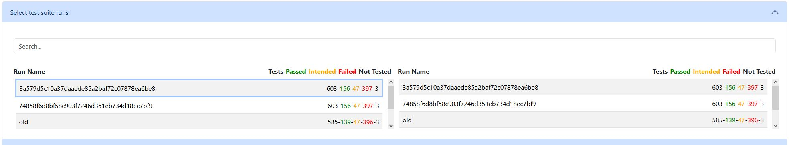
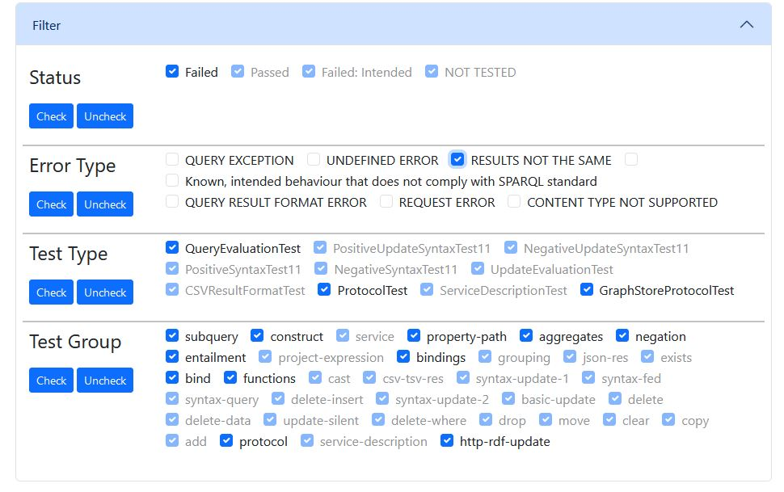
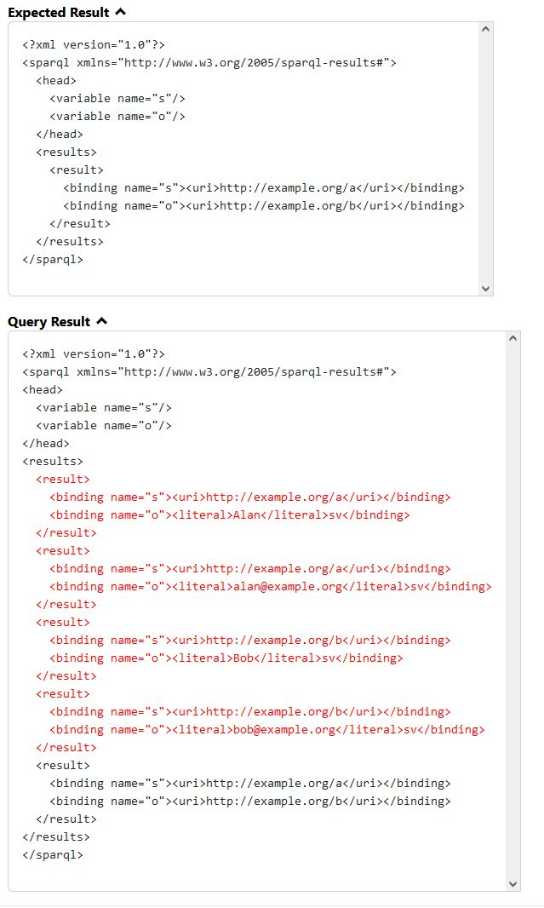

The SPARQL engine [QLever](https://qlever.cs.uni-freiburg.de/) has been designed with the intention of providing comprehensive support for [SPARQL 1.1](https://www.w3.org/TR/sparql11-query/).
In this project, we implement automated standard compliance testing using the SPARQL 1.1
test suite (a collection of test cases) and a web-based visualization tool for the test results.

---
<!--more-->

## Content
1. [Introduction](#intro)
2. [SPARQL 1.1 Test Suite](#test-suite)
3. [Implementation](#impl)
4. [Results](#results)
5. [Conclusion](#conc)

----

## 1. Introduction {#intro}
The SPARQL Protocol and RDF Query Language (SPARQL) is a query language used to retrieve and manipulate data stored in the Resource Description Framework (RDF) format. It allows users to query RDF data using triple patterns consisting of subject, predicate, and object statements.

QLever is a SPARQL engine designed to efficiently execute queries over large RDF datasets and aims to fully support SPARQL 1.1. To verify support for the SPARQL 1.1 standard, it is necessary to be able to execute the entire SPARQL 1.1 test suite and visualize the results. This facilitates the identification of errors and non-compliance with the SPARQL 1.1 standard.

## 2. SPARQL 1.1 Test Suite {#test-suite}
The World Wide Web Consortium (W3C) offers developers an evolving test suite for assessing the compliance of their implementations with the SPARQL 1.1 standard. This also enables developers to provide users with a report on the conformity of their implementations.

The SPARQL 1.1 test suite is designed to evaluate the full range of features included in the SPARQL 1.1 standard. This comprehensive approach results in over 600 tests, which are grouped into the following categories:

+ **Query Evaluation Test:** Tests containing a SPARQL query, expecting a given result
+ **Syntax Test:** Tests containing a SPARQL query, expecting a positive or negative HTTP response
+ **Result Format Test:** Similar to the Query Evaluation Test but for formats which need special handling
+ **Update Evaluation Test:** Tests containing a SPARQL update query, expecting correct changes to the given graphs
+ **Protocol Test:** Tests containing a HTTP request, expecting a given HTTP response
+ **Service Description Test:** Testing the service description vocabulary specification

These tests are grouped into smaller collections based on the functionality being tested. Each test collection has its own directory and manifest file. The directory contains all the necessary files for the tests, such as the graph files and query files. The manifest file declares all the tests. For example, all tests that test the SPARQL 1.1 JSON format standard are in the json directory. Most tests define a default graph on which to execute a query.

Example of how a test is defined in the manifest file (Turtle format):

```
<test-002> a mf:QueryEvaluationTest ;
      mf:name    "test-002" ;
      rdfs:comment  "Comment explaining test-002" ;
      mf:action
          [ qt:query  <test-002.rq> ;
            qt:data   <test-data.ttl> ] ;
      mf:result  <test-002.ttl> .
```

## 3. Implementation {#impl}
We use python for our tool to automate the execution of the test suite because of its vast ecosystem of libraries and tools for various tasks, including parsing, data manipulation and testing. Leveraging existing libraries made development easier and reduced implementation time.

### Extracting tests from the manifest
To extract the tests from the manifest files we decided to use QLever because it makes the task very simple. 
We simply set up QLever using the manifest file of each collection and run a query for each type of test.
QLever's response to our query will contain all the necessary information for these tests.

Another way to do this would be to use the `RDFLib` library to build a graph for each manifest file and then extract all the necessary information from the graph.

For example the query to retrieve all Query Evaluation Tests:

```
PREFIX rdf:     <http://www.w3.org/1999/02/22-rdf-syntax-ns#>
PREFIX rdfs:    <http://www.w3.org/2000/01/rdf-schema#>
PREFIX mf:      <http://www.w3.org/2001/sw/DataAccess/tests/test-manifest#>
PREFIX dawgt:   <http://www.w3.org/2001/sw/DataAccess/tests/test-dawg#>
PREFIX qt:      <http://www.w3.org/2001/sw/DataAccess/tests/test-query#>
PREFIX ut:      <http://www.w3.org/2009/sparql/tests/test-update#>
PREFIX sd:      <http://www.w3.org/ns/sparql-service-description#>
PREFIX ent:     <http://www.w3.org/ns/entailment/RDF>
PREFIX rs:      <http://www.w3.org/2001/sw/DataAccess/tests/result-set#>

SELECT DISTINCT ?type ?name ?query ?result ?data ?test (GROUP_CONCAT(DISTINCT ?feature; SEPARATOR=";") AS ?featureList) ?comment ?approval (GROUP_CONCAT(DISTINCT ?approvedBy; SEPARATOR=";") AS ?approvedByList)  ?regime
WHERE {
    ?test rdf:type mf:QueryEvaluationTest .
    BIND ("QueryEvaluationTest" AS ?type) .
    ?test mf:action ?action .
    ?action qt:query ?query .
    OPTIONAL {?action qt:data ?data .}
    OPTIONAL {?action sd:entailmentRegime ?regime .}
    OPTIONAL {?action qt:graphData  ?actionGraphData .}
    ?test mf:result ?result .
    OPTIONAL {?test mf:name ?name .}
    OPTIONAL {?test mf:feature ?feature .}
    OPTIONAL {?test rdfs:comment ?comment .}
    OPTIONAL {?test dawgt:approval ?approval .}
    OPTIONAL {?test dawgt:approvedBy  ?approvedBy .}
}
GROUP BY ?type ?name ?query ?result ?data ?test ?comment ?approval ?regime
```

### Executing the tests

**Setting up QLever**:

QLever currently does not support update actions, which makes it harder to run the tests. 
With the current QLever implementation (24.04.2024) we have to set up QLever for each graph individually. This includes indexing the graph and starting the QLever server for that index.

**Prepare and send the query**:

Most of the time the tests define a file containing the SPARQL query to be read and sent, but some test require special handling. For example the Protocol tests, where the query is defined as a comment in the manifest file and needs to be extracted and prepared before being sent.

The SPARQL standard defines several ways to send a query. One option would be to use the HTTP GET method, but for our purposes the other option using the POST method is better because we can put the given query into the request message body. We just need to set the proper HTTP headers. The Content-Type header is either `application/sparql-query` or `application/sparql-update` depending on the test. The Accept header lets us define the desired format given by the QLever server. It makes our life easier if the given result format is equal to the result format of the response. We infer the MIME-type by looking at the file ending of the given result file. For example `.srx` is the ending for the SPARQL 1.1 Query Results XML format which has the MIME-type `application/sparql-results+xml`.

#### Evaluate response
**Check response**:

Before comparing the results we have to check that the HTTP response headers are correct. If the response status code is 200-399 we can compare the result in the HTTP response body with the test result expected by the test. Except for some tests, where the result is not relevant. For these tests we only compare the HTTP response status code and headers with the status and headers expected by the test. For example some Protocol tests check whether the status and the Content-Type are correct for a givern HTTP request.

**Compare result**:

If we want to compare the results, we must first consider the format of the results.

The SPARQL 1.1 standard defines the following formats:

- Turtle or RDF/XML
- SPARQL 1.1 Query Results XML Format
- SPARQL 1.1 Query Results CSV/TSV Format
- SPARQL 1.1 Query Results JSON Format

For each of these formats we need to implement a comparison.
For the Turtle and RDF/XML format which are formats describing an RDF graph we can use the `RDFLib` library.

For the other formats there usually exists a library for the general format. For example for the SPARQL 1.1 Query Results JSON Format, we could use a module that includes JSON comparison. This does not work due to SPARQL specifics and our QLever oriented design choices.

We implemented a custom comparison for all formats using the following method:

1. Iterate over the elements
2. Remove matching elements in both results
3. If both results are empty, the results are equivalent

When matching the elements we ignore the order, handle the bank nodes and take the QLever specifics into account.


#### Highlight differences in the result
Highlighting the differences makes them easier to find when we later display the results on our website. To do this we build a string representation of the given result format. Then we highlight the parts that do not have a match in the other result. The part is highlighted by constructing an HTML element. Then we replace the leftover part with the newly created HTML element.

Basic example (CSV format):
```
Result 1:
s,p,o
1,2,3
1,1,1
Result 2:
s,p,o
1,2,3
2,2,2

Replace 1,1,1 with <span class="red">1,1,1</span>
Replace 2,2,2 with <span class="red">2,2,2</span>

Result 1:
s,p,o
1,2,3
<span class="red">1,1,1</span>
Result 2:
s,p,o
1,2,3
<span class="red">2,2,2</span>
```

### Website
The website was built using HTML, CSS, JS and to improve the look and speed up the development we use [Bootstrap](https://getbootstrap.com/) and its elements.
We did not implement a custom backend server and instead use the GitHub pages or the python built-in http server (`python -m http.server`) to host our website and visualize the results.

The website lets you select one or two runs, meaning executions of the test suite.
If you select only one all test results will be shown in a table, otherwise only the difference between the runs
will be shown in the table.
To make it easier to search through the 600 tests we implemented a filter that lets you include or exclude tests by their type, error, status and group.


<center style="margin-top:-35px;margin-bottom:55px;">Figure 1: Selection of a test suite run.</center>


<center style="margin-top:-35px;margin-bottom:55px;">Figure 2: The test filter.</center>


<center style="margin-top:-35px;margin-bottom:55px;">Figure 3: Example results.</center>

## 4. Results {#results}
Our implemantation is able to automaticly execute and visualize 600 tests:
| Category               | Number of Tests |
|------------------------|-----------------|
| Query Evaluation Test  | 282             |
| Result Format Test     | 3               |
| Update Evaluation Test | 94              |
| Syntax Test            | 169             |
| Protocol Test          | 52              |

Of these tests 23.83% passed, 69.33% failed and 6.83% "semi-passed". 
"Semi-passed" means that they failed, but the differences between the results are deemed close enough by the
QLever developers.

To get a better understanding we can take a look at the conformance of certain categories of the SPARQL 1.1 standard:

| Category                                      | Tests | Passed | Semi-Passed | Failed | Pass Rate     |
|-----------------------------------------------|-------|--------|-------------|--------|---------------|
| SPARQL 1.1 Query Language                     | 301   | 97     | 39          | 165    | 32.22% / 45.18% |
| SPARQL 1.1 Update                             | 157   | 21     | 0           | 136    | 13.38%        |
| SPARQL 1.1 Query Results CSV and TSV Formats  | 6     | 6      | 0           | 0      | 100%          |
| SPARQL 1.1 Query Results JSON Format          | 4     | 0      | 2           | 2      | 0% / 50%      |
| SPARQL 1.1 Federation Extensions              | 10    | 0      | 0           | 10     | 0%            |
| SPARQL 1.1 Entailment Regimes                 | 70    | 4      | 0           | 66     | 5.71%         |
| SPARQL 1.1 Protocol                           | 34    | 13     | 0           | 21     | 38.24%        |
| SPARQL 1.1 Graph Store HTTP Protocol          | 18    | 2      | 0           | 16     | 11.11%        |

Many tests fail because of features that are still missing in the current QLever version. Of the 416 failed tests 174 fail due to unsupported queries, many of them `ASK` queries or named graphs. Another 94 tests fail because QLever does not support update queries and subsequently does not support the HTTP Content-Type header `application/sparql-update`.

## 5. Conclusion {#conc}
The goal of this project was to improve the process of making the QLever engine conform to the SPARQL 1.1 standard by developing a tool that automaticly executes the SPARQL 1.1 test suite. Additionally, a visualization tool was developed to display the test results. Limitations include the test suite's coverage and the tools specificity to QLever. This suggests future work to focus on expanding the test suite, broaden applicability beyond QLever and integrate these tools into the GitHub workflow.
