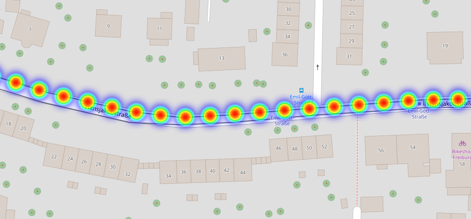
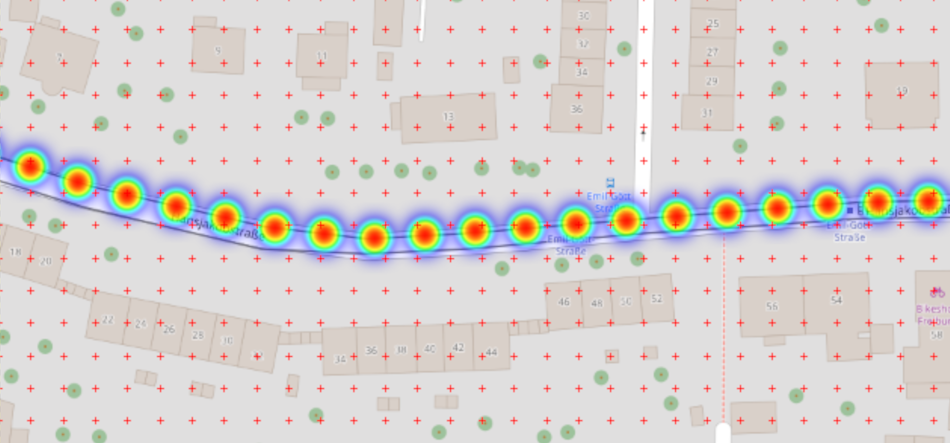
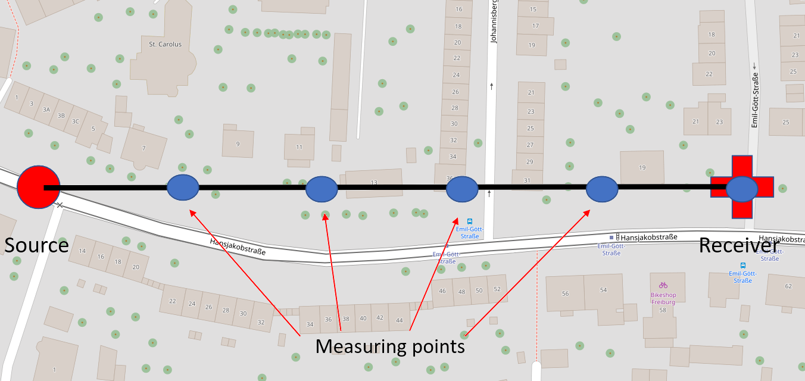
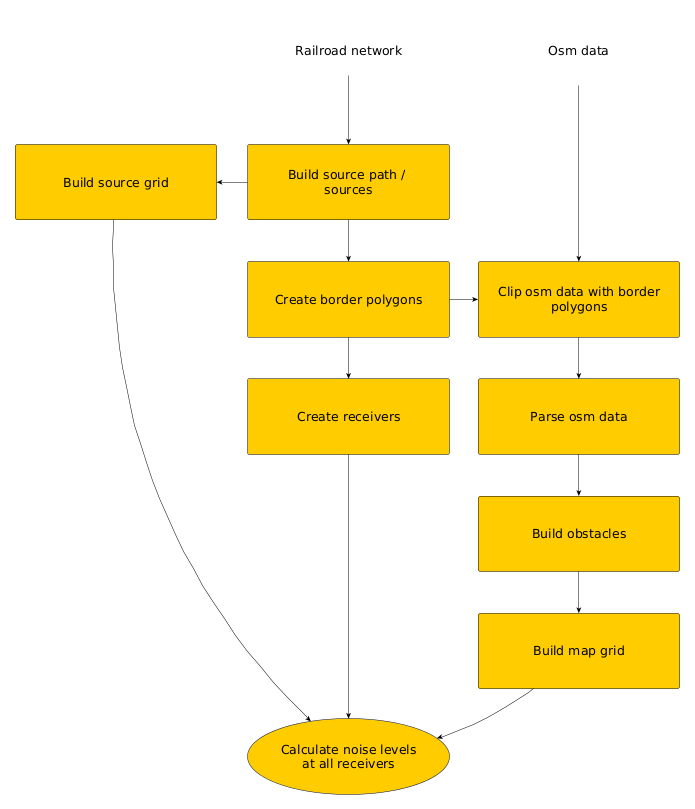
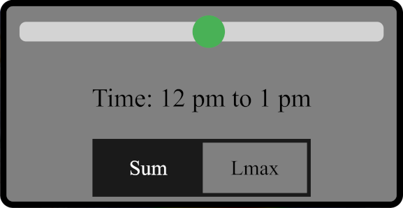
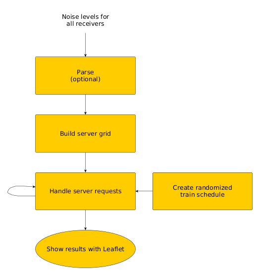

Given a geographical network of railroads and OpenStreetMap data, automatically generate rail noise maps from this data.
The results can be shown in a web application where hourly time spans, which represent typical rail schedules, can
be compared.

<!--more-->

## Content
- [Introduction](#introduction)
  1. [Grids](#1-grids)
  1. [Main concepts](#2-main-concepts)
  
- [Sound Pressure Level](#sound-pressure-level)
  1. [Inverse-square law](#1-inverse-square-law)
  1. [Obstacles](#2-obstacles)
  1. [Multiple sources](#3-multiple-sources)

- [Implementation](#implementation)
  1. [Calculate noise levels](#1-calculate-noise-levels)
  1. [Web application](#2-web-application)
      
- [Conclusion](#conclusion)

## Introduction
A noise map represents how sound propagates over obstacles and shows this by coloring areas of different sound levels
accordingly, over a defined time-span. There are sound sources that emit the sound. In this project, we use only trains that act
as the sound sources.

Furthermore, the only obstacles we consider in this project are buildings and forests.
Also, the only information about these obstacles we utilize are the plain outlines of them.
For example, we are leaving out height information about obstacles, that in the real world would be important for sound propagation.

### 1. Grids
In this blog post and the implementation we will often use a 'grid'. This will always imply the same concept that is as follows:
We overlay a grid with square cells on top of the map. The coordinates of the cells are the same as the (Longitude, Latitude) coordinates.

The key is that we have different grid cell sizes for different purposes. For example, we use grid cell sizes of 3 meters to up to 1000 meters.
Each grid cell will then cover an area of 9 square meters up to 1000 square meters.\
Furthermore, each grid cell is represented by its bottom-left corner. We then map these bottom-left corner coordinates to data we want to store.

The goal is, to be able to map any coordinate on the map to the grid cell it is located in and quickly access the data about the grid cell.
By increasing the grid cell size, we can save memory, but the accuracy will suffer.

For any coordinate, we can calculate the grid cell it is located in (i.e. the bottom-left corner) in constant time.
This implies that we can get the stored information about any coordinate in constant time by using a hash table.

### 2. Main concepts

#### 2.1. Sources
As explained earlier, we only use trains that act as noise sources. These trains are ultimately given as their railroads
they travel on.

The railroads are given as a geographical network. As a railroad is a continuous line source, we represent the railroad
by multiple single point sources for simplification. The single point sources should be equally spaced along the continuous railroad
line as seen in the following figure:

</img>

We call this string of points in the following line string or source path.

#### 2.2. Receivers
A main concept to create a noise map is, that we place noise receivers equally spaced over the map.
We create a point raster of receivers with predefined spacing.

For this project we place a receiver every 10 meters. We then need to calculate the incoming noise for every receiver.
In the following figure, the receivers are represented by the red crosses alongside the red source dots from the previous section:

</img>

#### 2.3. Map grid
As we are only considering buildings and forest as obstacles, these are the only things we need to store about the map. 
The needed functionality for how to store the map is, given any coordinate on the map, to get if there is a building, a forest or no obstacle,
i.e. nothing, and that as fast as possible.

We use the previously described grid for this with a grid cell size of 3 meters. That means that forests and buildings have an accuracy of 3 meters.

Alongside this, we use a hash table to map the grid coordinates to their stored data. For every grid coordinate, we map the coordinate to the type of obstacle on that coordinate.
If there is no obstacle on the coordinate, the coordinate is just not contained in the hash table.

This way we save the necessary map information (where forests and buildings are located) in a sparse-like-fashion.
We can check if an obstacle (and what obstacle) is on a coordinate in average time complexity of O(1) which is very important for the
performance of this project.

#### 2.4. Rays
We use rays to connect sources to receivers in a straight line. On the ray, we place equally spaced measuring points where we later check for
obstacles on these points:

</img>

## Sound Pressure Level
When talking about noise, what we usually mean is the sound (pressure) level measured in decibel (dB).\
Without further ado, 'noise' and 'sound pressure level' will be used interchangeable.
As the noise sources we use in this project are trains, we need to know how much noise a train makes.
As it turned out, the exact answer to how much noise a train makes is quite complicated.
Many factors such as the speed of the train, the type of the engine (electrical or diesel)
or other mechanical noises from the rails come in to consideration.

To simplify things a lot, we just assume that the trains used in this project (the trams of the city of Freiburg)
always produce a sound level of 65 dB.
This is the defined noise level with a distance of 1 meter from the train which is frequently used as the standard distance.

### 1. Inverse-square law
Obviously, when getting further away from the sound source the measured sound level will decrease.
This behavior is described by the inverse square law. It states that every doubling of the distance from the sound source
results in dividing the measurable effect (noise level) by four.

This means the sound level will decrease by 6 dB for each doubling of the distance from the source.
Note that this only applies in a free field environment. \
Clearly, trains will rarely only travel through free fields but for simplicity we still use the inverse-square law in this project.

Let \\(L_{p1}\\) be the sound level from the source as described at a distance \\(r_1\\) of 1 meter.
Then the sound level \\(L_{p2}\\) (in dB) at an arbitrary distance \\(r_2\\) can be calculated with
$$L_{p2} = L_{p1} + 20\\;log_{10}(\frac{r_1}{r_2})$$

### 2. Obstacles
The other way the sound level decreases when traveling over distance are obstacles that are blocking the sound.
As already said, we only consider buildings and forests as obstacles in this project.

When iterating over the measuring points of a ray from the source to a receiver, we simply check what object is
on the map on these measuring points. There are three possibilities in the context of this project: Either a building, a forest
or nothing.

We use the following decibel values which will be subtracted from the source noise level when encountering them:
\\begin{array} {|r|r|}\\hline Building & -10 \\\ \\hline Forest & -2 \\\ \\hline None & 0 \\\ \\hline  \\end{array}

### 3. Multiple sources
As of the nature of continuous sources, there will be receivers that receive sound from multiple sources.
To calculate the total sound level of n (incoherent) sources, we use the following formula:
$$L_{\Sigma} = 10\\;log_{10}(\\sum_{i=1}^{n} 10^{\\frac{L_i}{10}})$$
with n is the number of sound levels (from different sources) \\(L_i\\) (with \\(1 \\leq i \leq n\\)) and \\(L_{\Sigma}\\) is the sum of the \\(L_i\\).

## Implementation
In this section we are looking at the necessary steps starting from the input until the noise map can be displayed in the web application. \
We split it up in the part where the noise levels are calculated (main program) and a second part for the steps to show the results in a web application.

### 1. Calculate noise levels
This is the main program we use in this project.\
In the following figure, the main steps we use for the main program are shown in a flow-chart-like diagram:

</img>

The main program gets as its input the OSM data and the railroad network. \
The results are the noise levels for all receiver points.
The main steps are wrapped into the yellow boxes and the last step in the yellow ellipse. The flow is from top to bottom indicated with
arrows.

Each step has some input and output (except the last). For example if a step is 'build something', the output of that step will be
the 'something' that is finished built. Generally the order of the steps' execution is irrelevant as long as a steps inputs are ready.

#### 1.1. Build source path / sources
The input of this step is the geographical network of railroads. It includes all its nodes and edges.
The edges also store to which railroad route they belong to, which can be more than one, e.g. in railway stations multiple
train routes will come together.

The first thing we need to do for this step, is to collect for each train route the edges that belong to the specific routes.
Having these, we can build the routes by traversing the edges (they should be connected if the network is correct) using
Depth-first search.
The result we get from this will be for each train route one long connected line string of coordinates that represents this route.

At this point, the points along the line string can have arbitrary distances with their adjacent points.
But as described in the Main concepts section under Sources, the points that represent the source line string must have the same distances
with their adjacent points.

To calculate this representation where the points of the line string are all equally spaced, we use the forward azimuths (bearing) between
each point and the point's successor point. With the forward azimuth and adding new points between adjacent points where the gap is too big,
we can calculate the desired equally spaced line string for each train route.

Beforehand, we define how big the space between the points should be, in this project we use 10 meters, i.e. every 10 meters there should be a point on the
line string.

The result from this step is, that on the one hand we use these points to create the sources as in the Main concepts - Sources section.
Each source is then represented only by its coordinate and the train route it belongs to.

On the other hand, we will also further use the line strings of the routes as we will see in the next section.

#### 1.2. Create border polygon
One of the next steps will be to parse the OSM data to have the information of obstacles in memory. The input OSM data usually contains the data for a complete
region, e.g. all of Germany or Europe. \
We could parse the entire data, but that would need gigantic amounts of memory and time to complete. \
As a matter of fact, we only need the adjacent environment of the railroads as sound reduces over distance quite quickly.
What we need to do, is to clip the input OSM data with the result that in a new OSM file only the desired regions around the railroads are included.

To accomplish this, we use the program osmconvert by feeding it with a so-called border polygon. This polygon states which parts of the entire data should be
used and put into a new OSM file including only these.

To calculate the border polygon, we introduce a predefined variable max_distance which indicates the maximum distance a receiver can receive noise from a source.
Then we create a corridor around the railroads with a width of max_distance on each side. We now use the just built source paths for each train route. \
For each source on the path, we create a square with the source in the middle of it. The square has width and height 2 * max_distance.
This square will cover all the area that is in distance of max_distance. \
With the Shapely python package, we can merge these squares into one polygon, the border polygon.
With osmconvert and the border polygon, we can then create a new OSM file containing only the necessary data.

#### 1.3. Create receivers
As already shown in the introduction, we want to place receivers in a grid-like fashion.
We again only need receivers where sound can reach them. We don't need to create receivers that are several kilometers away from any source as their noise level
will be zero anyways.
We only need the relevant receivers. In this context that means receivers that are at most max_distance away from a source.

To accomplish this, we take the in the previous step created squares around the sources. In these squares, we create receivers at every 10 meters and add them to a set to avoid
duplicates. This will result in only the necessary receivers according to max_distance.

#### 1.4. Clip OSM data with border polygons
In this step, we take the created border polygon and the input OSM data.\
With the border polygon, osmconvert will clip the input file and create a new OSM file containing only the area that is defined by the border polygon.
This new OSM file will be much smaller than the input OSM file, as intended.

#### 1.5. Parse OSM data
This takes as its input the just clipped OSM data. We only parse the relevant data for this project. That includes only buildings and forests.
For each obstacle, the parsed data consists of the following:
- One or more outer ways that define the outer shape of the obstacle.
- Additional inner ways that define holes inside the obstacle, e.g. if a forest has grassland in the middle of it.

#### 1.6. Build obstacles
This step directly gets the parsed obstacles with its inner and outer ways. \
From this, we need one closed line string for the outer shape and one closed line string for each inner shape of the obstacle.\
For big forests or building, the OSM data for the outer and inner shapes will often be separated into multiple ways that correctly
connected together form the shapes in one line string.

To go from these multiple ways per shape to one closed way each, we perform Depth-first search on a graph where each way is an edge and search
for circles.

Additionally, to save memory space later, we also clip the obstacles according to the border polygon. The python Shapely package provides a
function to do this. This is especially important for forests, since it often occurs that only very small parts of forests are included
in the relevant area while the full forests are huge.

#### 1.7. Build map grid
Now we have the obstacles represented by their outer way and optional inner ways, all closed. To build the map grid as already described in the introduction,
all obstacles need to be filled (rasterized) except for the areas defined by the inner ways. In this project the matplotlib.path module is used for rasterization.

An important variable in this context is, at what precision the obstacles should be rasterized. The precision has a high influence on memory consumption
as well as the time to rasterize them. In this project, we use a precision of 3 meters as it is a sweet spot between precision and performance.
This precision is the cell size of the map grid.
As output this step has the whole map stored in memory as described in the introduction.

#### 1.8. Build source grid
As input to this step we get the source path i.e. all the sources we created. In the final step ('Calculate noise levels at all receivers')
it will be necessary to iterate over all sources for each receiver. Obviously this will result in terrible performance when the number of sources
increases.

In fact, it is not necessary to iterate over all sources for each receiver. That is the case if a source and a receiver are too far apart from each other and
the noise level will be zero in any case.

For this, we use the predefined variable max_distance that states when to skip a source because of the distance.
A simple data structure to take the distances into consideration is, to sort the sources into a grid with grid cell size max_distance.

With this, we can get in constant time in which source grid cell a receiver is located in. To get all sources that are at least max_distance meters away, we simply take
all the sources from the grid cell the receiver is in, and all sources in adjacent grid cells of that cell. This way we will always get all relevant (i.e. within max_distance meters)
but also have an upper limit of sources we need to check.

#### 1.9. Calculate noise levels at all receivers
The final step is, to calculate all the noise levels for the receivers. For this we iterate over all receivers and do the following for each:

1. Get relevant sources: We get all relevant sources with the help of the source grid as described in the previous section.
2. Iterate over relevant sources: For each source, we create a ray between the source and the receiver as described in the main concepts.
   - First we calculate the noise level for the distance of the ray with the inverse square law.
   - Given this noise level, we iterate over the measuring points of the ray and check if there are obstacles on the points.
     If yes, we subtract from the noise level as defined under the sound pressure level section.
3. After we have collected all the sound levels from the rays, the receiver will most likely have multiple sound levels from the same train route.
   We use the formula for the sum of multiple sound levels to merge them together for each train route.
   Additionally, we store the maximum sound received from each train route.

It is important to store the noise levels from the different train routes separately for each receiver as we will see in the Web application section.
For each train route we store the total sound level (see sound pressure level section) as well as the maximum received sound level.

#### 1.10. Optional: Serialize noise levels
After we have calculated the noise levels, they can also be saved to be able to load them fast into the web application later.
The noise levels can easily be serialized by storing the individual sum of noises and max noises from each train route for each receiver in a JSON file.

### 2. Web application
To show the results on a map, we use a python http.server. We use OpenStreetMap and Leaflet to display an interactive map in a browser.
To display the heat layer, we utilize the plugin Leaflet.heat. This plugin is very simple to use.
All it needs are coordinates, which each have a heat intensity value assigned. The heat intensities are our receivers with their noise levels.

Additionally, to the interactive map, the web application includes a control panel as seen in the following picture:
</img>
Located at the top, there is a slider with which the hourly timespans can be adjusted and compared. There is also the possibility to switch between
the maximum noise levels (Lmax) at the set timespan and the sum of noise levels (\\(L_{\Sigma}\\)) according to the train schedules.

The workflow of the web application is shown in the following figure:

</img>

#### 2.1. Parse
Loading the noise levels back into memory from a JSON file.

#### 2.2 Build server grid
As there can be millions of receivers, it's infeasible to send them all to the server. This will result in very bad performance.
In fact, we only need to send the receivers that are visible in the current map view in the browser.
The bounds of the visible view can be read out from Leaflet.

To get only (or at least mostly) the visible receivers, we again build a grid for the server and select a grid cell size of 1000 meters.
Each grid cell contains the receivers that are located in it on the map. With the by Leaflet provided bounds of the browser view,
we can easily get only the visible receivers by iterating over the visible cells and collecting the receivers.

#### 2.3. Create randomized train schedule
The web application has the ability to set hourly time spans and compare the changing noise levels.

The changes for the time spans follow from the train schedule. For example, there will be less noise at night than at rush hour.
As we don't get train schedules as input for this project, we create randomized schedules for each train route. \
As it turns out, the only relevant information of a train schedule for this project is, how many trains pass each route at every hour starting from midnight (0 am).

To create these schedules, which store the number of train passes at each hour, we make use of the poisson distribution to simulate
peak times and times of low traffic.

All we need to define is an expected number \\( \lambda\\) of train passes for each of the 24 hours. For example peak times
will be in the morning and at 5 pm to 7 pm when people travel back home from work. At nighttimes there may be no train passes at all.

For each train route we sample with the predefined expected numbers \\( \lambda\\) and build the train schedules.

#### 2.4. Handle server requests
Every time the map in the browser is moved, the zoom level is changed, the time slider is changed or the noise levels are changed between Lmax and the sum \\(L_{\Sigma}\\),
there will be a new request that gets sent to the server.

The request includes the bounds of the current map view, the current zoom level, the current time the slider is on and the state of the switch.

We use the bounds of the current map view to only get the receivers that are in view. To further increase performance, we thin out (i.e. send less receivers) the visible receivers depending
on the zoom level. The smaller the zoom level is (i.e. when zooming out), the more we thin out to accommodate the bigger map view and thus the more visible receivers.
The process of thinning out is made randomly.

Given the current time span, we calculate the final noise levels given the train schedules with the formula of the sum of noise levels from the sound pressure level section.
For example, if a train passes a route 10 times in the timespan, the sound level a receiver gets from this route will be added 10 times to the \\(L_{\Sigma}\\) formula.\
This only applies if the switch in on the sum \\(L_{\Sigma}\\).\
If the switch is on Lmax, we just take the maximum noise level each receiver gets from all the train routes.

#### 2.5. Show results with Leaflet
Leaflet itself is a very easy to use library, and we had no problems using it. In this project, we use Leaflet only to provide the map in the background.
To show the heat layer, we use the Leaflet.heat plugin. \
In retrospect, this plugin is not best suited for the use case of a noise heat map with emphasis on noise.
Generally the colors for the noise levels range from red, yellow, green to blue where red is loudest and blue the most quiet level.

The problem is that the plugin is internally clustering heat points what results in the noise levels getting falsified by the plugin.
The plugin provides options like the size of the heat points,
the amount of blur and a gradient for the colors. Changing only one of these options basically completely changes the whole shown heat map.

Out of the box with the standard settings of the plugin, the heat map looked quite bad and didn't represent the calculated noise levels at all as nearly everything was red, we found.
Also, the heat map looked different at each zoom level, e.g. when zooming out everything turned red.
We tried our best and tuned the settings with the following goals:
- When zooming the heat map should look (nearly) the same at all zoom levels.
- The colors shown should represent the actual calculated noise levels, e.g. red should only be directly at the railroads
  because it's loudest there.

The result after some hours of playing around with the settings is as follows:
- The zoom level problems could be fixed by having different settings for the noise point size and blur at each zoom level.
- At the highest zoom level, the colors are still too 'hot' (i.e. too much red). This can be fixed by further reducing the size of the heat points, but then
  the individual points are visible what looks terrible. This is a trade-off between the accuracy of the heat map and the visual look. We decided to value
  the visual looks more than the accuracy.

In conclusion, due to the plugin's clustering and internal changing of the heat levels after they were sent, we can't provide a legend for the colors.
We tuned a custom color gradient so that the heat map looks, in our opinion, as good as possible.

But what gets shown on the map by the plugin just doesn't correspond to the noise levels and the custom gradient. We can only say the colors range from red (loud) to blue (quiet).
The noise levels are still comparable between the different time spans as well as how the noise spreads between obstacles.

## Conclusion
Ultimately, the calculated noise levels are built up on so many simplifications, that the results that we obtained in this project
are very far from accurate. \
The additional problems from the heat layer plugin only further distort the result that we show in the web application. \
To be fair, accuracy never was the intention of this project.

But what the results of this project can be used for is, how the sound gets blocked by obstacles and how the sound finds its
ways through gaps and open spaces in urban areas. \
Also, the results may not be accurate, but it can still give us an idea of noisier or less noisy areas.

One thing that definitely worked out quite well, in our opinion, are the comparisons between the time spans with the time slider
and the sum of the noises. \
Especially when looking at the Freiburg Innenstadt region, the fact that all train routes meet there is reflected quite well in the
result.
