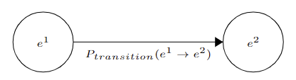
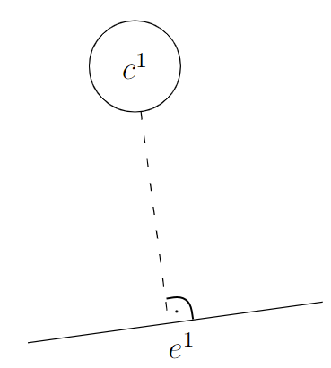
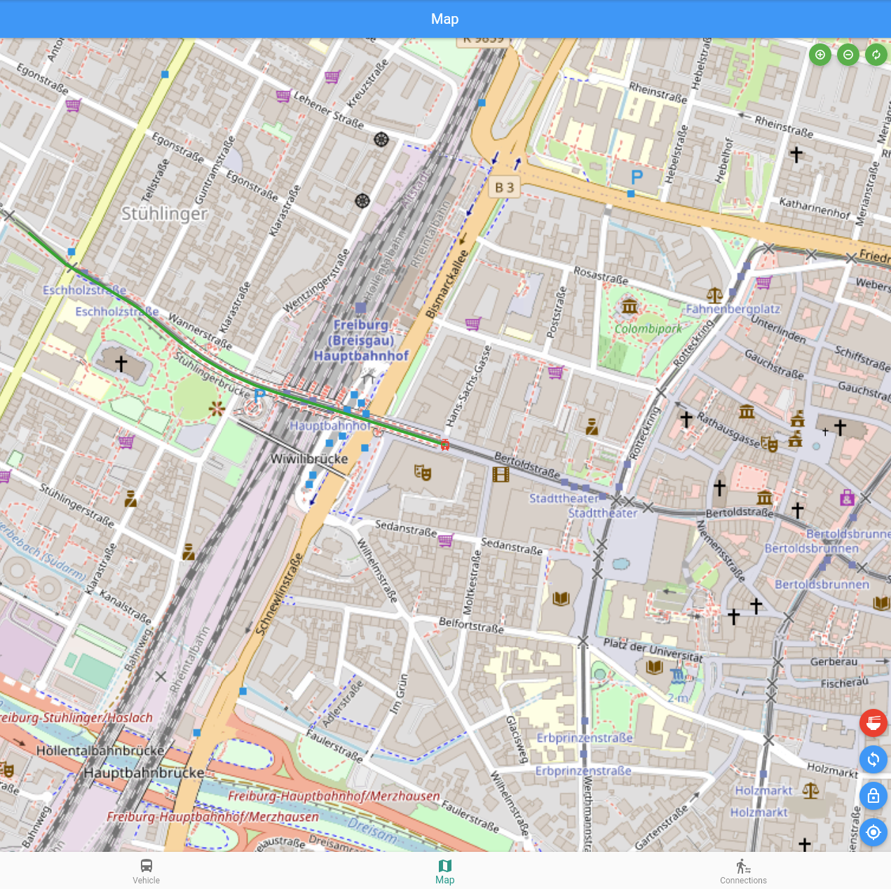
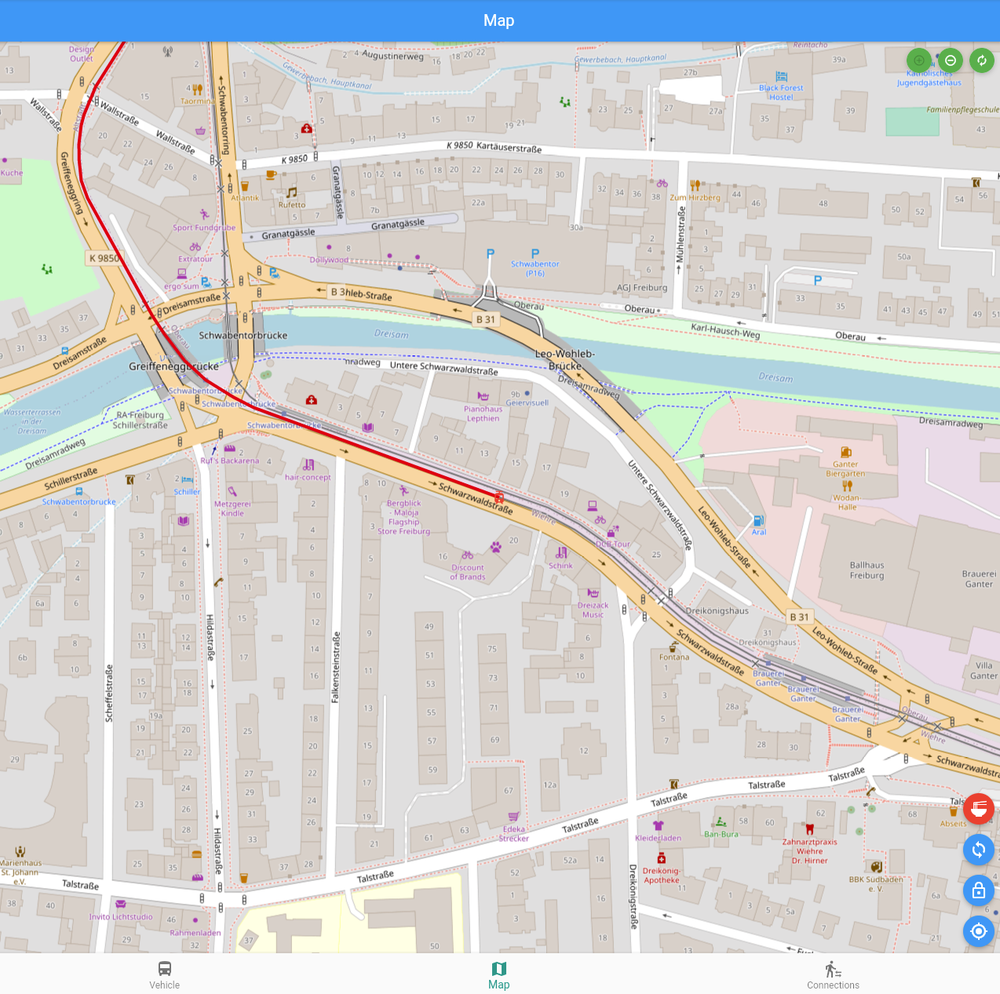
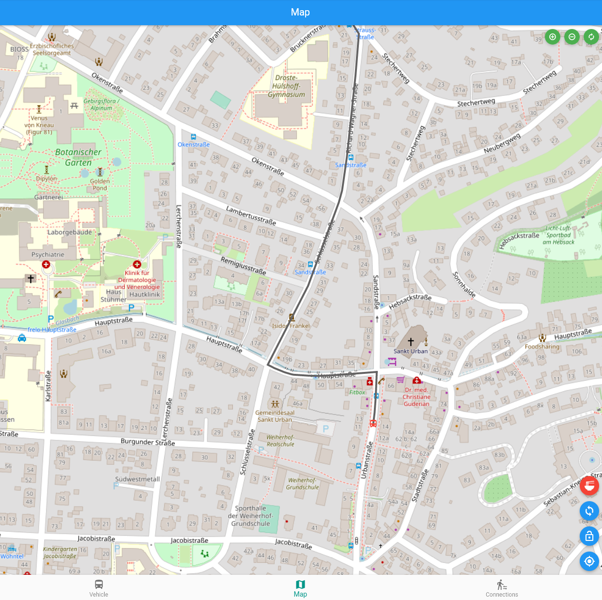
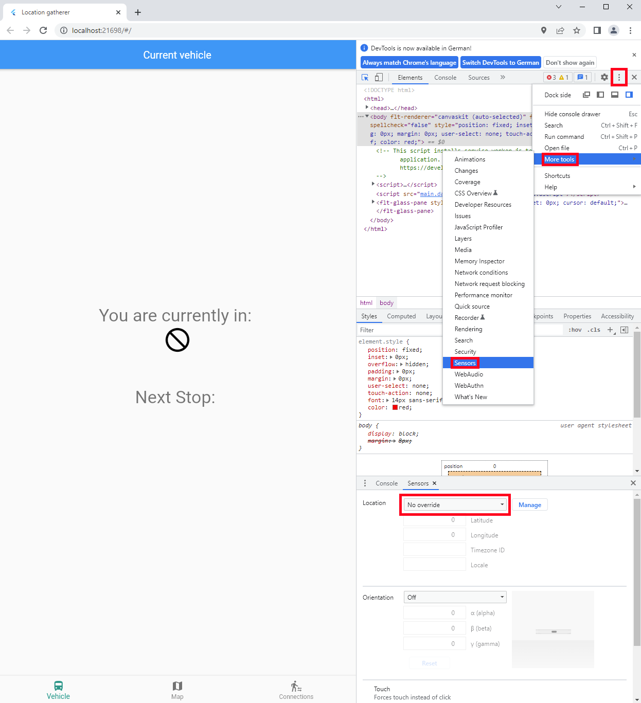

In this blog post, we compare two dynamic map matching algorithms for matching a mobile phone to a public transit vehicle (PTV).

# Content

- [Content](#content)
- [Introduction](#introduction)
- [Backend](#backend)
  - [Introduction to GTFS](#introduction-to-gtfs)
  - [Map Matching to a Dynamic Map](#map-matching-to-a-dynamic-map)
    - [Hidden Markov Models](#hidden-markov-models)
    - [What is a Candidate? Old vs New Approach](#what-is-a-candidate-old-vs-new-approach)
    - [Transition probability](#transition-probability)
    - [Fast graph building](#fast-graph-building)
  - [Flask as our API](#flask-as-our-api)
- [Evaluation](#evaluation)
- [Frontend](#frontend)
  - [Flutter as our framework](#flutter-as-our-framework)
  - [Content of the app](#content-of-the-app)
- [Testing](#testing)
  - [Using selenium to manipulate a devices GPS location](#using-selenium-to-manipulate-a-devices-gps-location)
  - [Generating fake GPS data](#generating-fake-gps-data)
- [Installation](#installation)

# Introduction

We present an algorithm to deduce the public transit vehicle (PTV) a mobile phone is travelling in in real time. In a nutshell, this is based on analyzing the last few GPS points of the device and applying our spatio-temporal map matching algorithm, which uses static (non-realtime) PTV schedule information.

This project aims to improve on Robin Wu's and my previous work [1-3], by improving accuracy and speed. We therefore re-design our previous spatio-temporal map-matching algorithm conceptually. We further improve query speed by implementing the reworked backend in C++.

# Backend

## Introduction to GTFS

The General Transit Feed Specification ([GTFS](https://developers.google.com/transit/gtfs)) lets PTV agencies describe the following static schedule properties:

**Trips**\
Each journey of a PTV from a start stop to a destination stop is called a trip.

**Shapes**\
Every trip of a public transit vehicle follows a specific shape, which can be described as a list of GPS points. For busses for example, the shape likely follows the most direct path in the street network from one stop to the next one, for all stops on the trip.

**Stop times**\
GTFS also gives us arrival and departure times for every stop on a trip.

**Service information**\
Every trip operates based on a service, which describes whether the trip is active on a given weekday. There can also be exceptions for specific dates, e.g. holidays.

### Trip Segments

We can subdivide a trip into k segments, where each segment describes the part of the trip between two stops. [img?]

### Active Trips

We consider a trip as active during time point \\(t\\), if \\(\texttt{trip\_start} < t < \texttt{trip\_end}\\) for \\(\texttt{trip\_start}, \texttt{trip\_end} \in \texttt{stop_times}(\texttt{trip})\\).

Similarly, we consider an edge as active during time point \\(t\\), if the edge is part of a shape that is used by an active trip.

We can relax the definition of activeness by allowing for a slack \\((\texttt{earliness},\ \texttt{delay})\\) before and after the trip's start / end time.

## Map Matching to a Dynamic Map

Map Matching (MM) describes the process of fitting (often noisy) recorded points to the trajectory of a vehicle on a static map. [IMG?]
A typical use of MM is a navigation systen, where the gps points of a car get matched to a street network graph.

In Dynamic Map Matching (DMM), instead of matching to a static map, we match to moving targets on an underlying static graph. In our case, the GTFS shapes can be represented as a directed graph \\(G_\texttt{network}\\).
In this graph, each GPS point of a shape is represented as a node and successive points in a shape are connected with a directed edge.

Mobile devices emit **Events** \\(ev = (\texttt{lat}, \texttt{lon}, \texttt{time})\\), where we abbreviate timestamp with **time**.

The aim of our dynamic map matching algorithms \\(F_\texttt{DMM}\\) is to match a list of Events \\(EV = [ev_0, ..., ev_{n-1}]\\) to both spatial and temporal dimensions, such that the most likely trip \\(t_\texttt{best}\\) is returned: \\(F_\texttt{DMM}(EV) = t_\texttt{best}\\)

### Hidden Markov Models

The map matching can be solved by using a [Hidden Markov Model (HMM)](https://en.wikipedia.org/wiki/Hidden_Markov_model).
A HMM is used when a process can likely be modeled by a Markov chain (The probability of transitioning from one state to another is solely dependant on the current state), but its states are unknown.

In both approaches PTS and PTVM, we get **HMM candidates** \\(c_j \in C_\texttt{PTS}\\) for each event \\(ev_i\\). With these, we create HMM graph \\(G_\texttt{HMM}\\), which consists of \\(|EV|\\) layers. We find the shortest path through the network, based on emission probabilities \\(P_\texttt{emission}\\) and transition probabilities \\(P_\texttt{transition}\\) (see [infographic]).

### What is a Candidate? Old vs New Approach

While the candidates in the old PTS approach are a filtered set of edges from GTFS shapes network graph \\(G_{network}\\), the new PTVM approach uses a set of filtered trips as candidates.

#### PTS

On an incoming event from a user request, the older approach PTS starts by querying an R-Tree for close edges to the event location. PTS then filters roughly by time, so we just consider edges that are generally active during the event time. In this context, active means that the edge is used by a trip that is actively moving anywhere on its shape at the event time.

Now, PTS adds these edges to a HMM. In PTS, HMM-candidates are edges. All edges that are close to the event locations [(see Figure 1)](#fig:g_network) are candidates in \\(G_\texttt{HMM}\\) [(see Figure 2)](#fig:g_hmm).

{{< figure id="fig:g_network" src="img/PTS_G_network.png" alt="G_network" width="800" caption="> Figure 1: \\(G_{\text{network}}\\) contains all edges. The two colored points are events (timestamped locations) emitted by a user. In this example, all edges are close to an event." >}}

{{< figure id="fig:g_hmm" src="img/PTS_G_HMM.png" alt="G_HMM" width="800" caption="> Figure 2: \\(G_{\text{HMM}}\\) has one column for each event. Each event column contains all edges that are close to the event. The red path \\([\texttt{Start}, e^0_{ev_0}, e^0_{ev_1}, \texttt{End}]\\) is the shortest path through \\(G_{\text{HMM}}\\) (compare with the [\\(G_{\text{network}}\\)-Figure 1 above](#fig:g_network))." >}}

We then find the shortest path through \\(G_\texttt{HMM}\\), which gives a set of shortest path edges \\(E_\texttt{sp}\\). After this step, we take the GTFS shape that is most common along all \\(e \in E_\texttt{sp}\\). From this shape, we choose an active trip with the mose occurences on the edges of \\(E_\texttt{sp}\\). If there is a tie, only then do we do a more precise time based matching.
Generally, this old approach tries find a good spatial solution first, and only afterwards checks whether it is temporally valid.

#### PTVM

In the new approach PTVM, both spatial and temporal dimensions are taken into consideration simultaneously. The weight of the dimensions can be tuned with a parameter. In the PTVM-approach, HMM-candidates are trips, not edges as in PTS.

PTVM starts by querying its Geocalendar Index (GCI) for crude spatial and temporal trip candidates. A GCI consists of a grid containing spatial candidate trips [(see Figure 3)](#fig:grid), as well as a calendar, which is a list of evenly spaced time intervals, which each contain trips that are active at any point during the interval.

{{< figure id="fig:grid" src="img/PTVM_Grid.png" alt="PTVM Grid" width="800" caption="> Figure 3: PTVM's spatial component of the GCI: Each cell in the grid contains a list of trips that are on any of the edges passing the cell. In this example, the blue shape is the shape trips \\(\texttt{T1}\\) and \\(\texttt{T2}\\), while the pink shape holds trips \\(\texttt{T3}\\) and \\(\texttt{T4}\\). The cell on the top left grid-position thus holds the list \\([\texttt{T3}, \texttt{T4}]\\), while the top right cell holds \\([\texttt{T1}, \texttt{T2}, \texttt{T3}, \texttt{T4}]\\)." >}}

After querying a list of trips \\(\texttt{GCI}(ev) = \texttt{grid}(ev) \cap \texttt{calendar}(ev)\\), we loop over all of their trip segments. We first filter by \\(k=50m\\) radius, then by a \\((\texttt{earliness},\ \texttt{delay})\\)-relaxed time window to get both close and active trip segments. On these remaining trip segments, we calculate a mixed spatio-temporal score.

{{< figure id="fig:emission" src="img/PTVM_mixed_emission_score.png" alt="PTVM Mixed Emission Score" width="800" caption="> Figure 4: This Figure visualizes the calculation of the spatio-temporal emission score, that is calculated for each PTVM HMM candidate trip. The orange point represents a user emitted event location \\(ev\\), the orange circle around it the \\(k=50m\\) radius. The alternating black and red lines represent edges of an active trip segment passing through the event radius. For all edges \\(e_i\\) in the event radius, we determine the closest point \\(p_{e_i}\\) to \\(ev\\), represented as turqouise points. Based on the stop times of the trip segment, we interpolate the expected time of the PTV at each \\(p_{e_i}\\). The final emission score for this trip is the best combination of time discrepancy and spatial distance." >}}

Both approaches have the downside that they rely on linear interpolation for estimating where the PTV is between two stops. This is not accurate for _trip segments_ with varying speeds.

We have the GTFS shapes network, where \\(G_{network}\\) and 

### Transition probability
The transition probability describes the likelihood of getting from one state in the Markov Chain to another.
As a reminder, the transition probability is the weight from a node \\(e^1\\) to one of its outgoing neighbors \\(e^2\\) in \\(G_{markov}\\).
</img>
Firstly, each node represents an edge, and we want to include the length of the edge in the weight. 
The length can be calculated with the [great circle distance](https://en.wikipedia.org/wiki/Great-circle_distance) between the two end points of an edge.
Then, we try to find the shortest path from \\(e^1\\) to \\(e^2\\) within \\(G_{network}\\).
We add the lengths of the shortest path to the transition probability. 
Furthermore, we need to consider the direction of travel. This is important for shapes that are close to each other, but go in opposite directions.
Since we are getting all close edges within a 100 meters radius, the opposite direction is a possibility in the Markov Chain.
If we remember the order of the edges in a shape, we can check if the edges are in ascending order oder descending order.
Travelling in descending order means that we are travelling in the opposite direction of the shape. Thus, we penalize this direction.
In contrast, an ascending order corresponds to the correct direction, so we just set the penalty to 0.
\begin{align*}
    P_{transition}(e^1 \to e^2) &= ||e^1||_{great\\_circle} + ||e^2||_{great\\_circle}\newline
    &\phantom{\text{= }} + \text{len_shortest\_path}(e^1, e^2) + \text{direction\_penalty}(e^1, e^2)
\end{align*}
If there is no such direct path available, we penalize this path by adding a high weight.
This has the effect that this path can then still be matched if there is no other possibility. This can happen due to a transfer between vehicles.\
As the start and end nodes of \\(G_{markov}\\) do not represent edges, we need a different transition probability for those.
For the start node, we use the shortest great circle distance of the first GPS point to the first edge as weight.
</img>
In the same manner, we calculate the distance between the last edge to the last GPS point.
As a result, we get a shape where the start and end points are close to the GPS points.

### Fast graph building
In order to generate the most likely path, we need to quickly build a graph and also try to keep the graph as small as possible. 
We could just add all edges that are close to the GPS points, e.g. in a 100 meters radius, to our Markov Chain.
This works well in areas with little traffic and not many public transit routes. However, we run into performance issues in busy areas such as city centers. 
This is because calculating the shortest path takes much longer in a bigger Markov Chain graphs.
In order to mitigate this issue, we filter unnecessary nodes.\
Firstly, for every GPS point, we fetch all edges that are within a 100 meters radius. 
Then, we only consider those edges that have traffic of a public transit vehicle at the included timestamp.\
For that, we can pre-calculate the timeframe where a given vehicle is active on a particular edge. 
We can only fetch times for each stop of the vehicle from the GTFS data. Typically, there are multiple edges between the stops. 
Inorder to minimize the number of edges we get, we try to calculate an exact time frame for each edge between two stops.
The main difficulty in this approach is that the coordinates of a stop do not lie on the edges of a shape for a trip.
Thus, we need to split the shape at the stops. We can project every stop coordinate onto the shape line to find the closest edge. Then we can split the edge at these projected points.
As this calculation is computationally rather expensive, we can pre-calculate the split shapes for each trip and use them to calculate the time frame later.\
We only include the edge in \\(G_{markov}\\) if there is any traffic on the edge at the timestamp. 
With this approach we can greatly reduce the number of edges and therefore get results much faster.

## Flask as our API
Map matching is computationally expensive and requires a representation of the public transit network in memory.
Therefore, it is not feasible to calculate the Markov Chain on a mobile device such as a smartphone.
Instead, the mobile device continuously records GPS points with a corresponding timestamp. Then, these GPS points are sent to our API on a server.
The transit network is already loaded in memory on the server, so it can quickly calculate the map matching.
After calculating a matched path on the server, we only need to return information for displaying the matched path to the mobile device.
All the requests and responses can be easily handled with [Flask](https://flask.palletsprojects.com/en/2.1.x/) as our API.
The framework we used for our app makes use of [CORS](https://developer.mozilla.org/en-US/docs/Web/HTTP/CORS) to check if the API permits the actual request.
Not handling those on the server-side leads to errors. Luckily, there is an [extension](https://flask-cors.readthedocs.io/en/latest/) for Flask to handle these CORS requests.

# Evaluation

In this chapter, we compare PTS and PTVM with regard to query time and accuracy. PTVM strongly outperforms PTS in both categories.

## Method

We consider all trips of the GTFS dataset VAGFR of Freiburg's PTV agency VAG on Wednesday 15th of October 2025. We precalculate simulated trajectories along each trip \\(t\\), which is a list of events \\(ev_{(\texttt{t}, \delta)}\\). Here, \\(\delta \in (\texttt{min_delay},\ \texttt{max_delay})\\) describes noise on top of the time point of the event. For each event on a trip segment (between two stops), we linearly interpolate the timepoint \\(tp\\) based on the arrival/departure time at a trip's previous and next stop. We add a \\(\delta\\) to each \\(tp\\) to simulate some noise in the PTV network. Essentially, this either slows down or speeds up a simulated PTV along a trip segment.

Not only do we consider query time and accuracy on every single trip, we also examine the same metrics for all trip segments along the way.

In order to differentiate the difficulty of a query, we introduce _Activeness_. Trips and trip segments have Activeness \\(a_t\\) or \\(a_{ts}\\). We calculate Activeness based on how many trips pass an edge \\(e_t\\) within our time window: Activeness \\(a_{e_t}\\) of edge \\(e_t\\). Then, for each trip segment \\(ts_t\\) of trip \\(t\\), \\(a_{ts_t} = \texttt{avg}(a_{e_t})\\) for all edges within the trip segment. Similarly, we calculate a trip's Activeness \\(a_t = \texttt{avg}(a_{e_t})\\) for all edges of the trip. Generally, we expect a query to be more difficult if a trip or a trip segment is rather active, as there are more candidates to choose from.

VAGFR contains 3329 trips that start on Wednesday 2025.10.15 00:00:00 and serve two or more stops within 24 hours from then. We generate 912,434 events for all trips, or on average 274 events per trip. As one PTS query averages 0.482 seconds, we can expect a runtime of \\(\sim 122\\) hours on a single core to simulate all trips. As we want to speed up the simulation by parallelizing, we run several PTS backend instances with gunicorn. Only one backend instance does not suffice with one GIL-bound Flask API. With 8 processes, we get the simulation run time down to about 18 hours on a home machine with an AMD Ryzen 5 5600X.

## Settings

For both PTS and PTVM, we can choose the allowed earliness / delay in minutes, as well the GPS radius in meters and the maximum amout of HMM states. For both, we choose the following configuration:

| Parameter | Value | Description |
| --- | --- | --- |
| \\(\texttt{EARLINESS\_MINUTES}\\) | 5 | Maximum allowed earliness in minutes for temporal candidate query component |
| \\(\texttt{DELAY\_MINUTES}\\) | 5 | Maximum allowed delay in minutes for temporal candidate query component |
| \\(\texttt{GPS\_RADIUS\_M}\\) | 50 | Radius in meters for spatial query component |
| \\(\texttt{MAX\_HMM\_STATES}\\) | 10 | Maximum number of HMM states to consider per event |

For PTVM, we choose the following configurable parameters:

| Parameter | Value | Description |
| --- | --- | --- |
| \\(\texttt{NO\_TRIP\_PENALTY}\\) | 1000 | Penalty if no trip is assigned (no matching found) |
| \\(\texttt{TRIP\_CHANGE\_PENALTY}\\) | 1000 | Penalty for matching to a different trip than the matching from last request |
| \\(\texttt{TRANSITION\_PENALTY}\\) | 100 | Penalty if trips are different between events of two HMM layers |
| \\(\texttt{EMISSION\_PENALTY}\\) | 1000 | Maximum emission score |
| \\(\texttt{TEMPORAL\_WEIGHT}\\) | 0.5 | Weighting factor for temporal and spatial component of emission score. 0.5 means equal weighting. 0.3 means 30% temporal, 70% spatial. |
| \\(\texttt{CELL\_SIZE\_KM}\\) | 5 | Grid cell size in kilometers |
| \\(\texttt{CALENDAR_TIME_INTERVAL_H}\\) | 24 | Slot size of each calendar time interval in hours |

PTS has no other configurable parameters.

# Frontend
## Flutter as our framework
In order to match a mobile phone to a public transit vehicle, we needed an interface for the user. 
As we could not decide whether to build a web-app or a mobile app, we chose to use [Flutter](https://flutter.dev) for our frontend.
Flutter is an open source framework developed by Google for building web-apps and apps for iOS or Android, all from a singe codebase.
The programming language used for Flutter apps is [Dart](https://dart.dev), which is designed and optimized for UI (Exactly what we needed!).

## Content of the app
There are three pages, all of which we can show using examples from the city of 
[Freiburg](https://de.wikipedia.org/wiki/Freiburg_im_Breisgau) with GTFS from the [Freiburger Verkehrs AG (VAG)](https://www.vag-freiburg.de/service-infos/downloads/gtfs-daten).\
The first page shows the public transit vehicle the user has been matched to, as well as the next stop.\
</img>
The second page shows the matched vehicle on a line in the color specified for the route in the GTFS data.\
</img>
</img>
</img>
The third page shows the transfer possibilities at the next stop if the device has been matched to a trip.\
</img>

# Testing
As it would be very exhausting and expensive to code on board of a bus or tram on a laptop, to see if the map matching algorithm actually works, we wrote a tool to simplify the task.

## Using selenium to manipulate a devices GPS location
In the chrome devtools, one can use the location sensor to manipulate one's position.\
</img>
These sensors are also accessible via [selenium](https://www.selenium.dev/documentation/webdriver/bidirectional/chrome_devtools/), 
so we wrote a python script that takes in a list of GPS coordinates and updates the chrome sensor every other second.

## Generating fake GPS data
For every trip in the GTFS data, we know the exact shape it moves on. However, the GPS can be quite inaccurate. 
So, in order to simulate a device moving along a shape, we need to 'noisify' the polyline from the shape.\
First, we need to define an average public transit vehicle moving speed \\(v\\) in \\(\frac{m}{s}\\), 
a GPS signal frequency \\(p\\) in \\(\frac{1}{s}\\) and an average GPS accuracy \\(acc\\) in meters.\
Also, we can calculate the length \\(len\\) of the whole polyline and its parts \\(len_i\\) in meters by using the 
great circle distance for the GPS coordinates.\
Now, we can calculate the total time needed to travel along the polyline \\(t\\): $$t = \frac{len}{v}$$
The total number of GPS signals needed to simulate the whole trip is: $$numSignals = t \cdot p$$
And, as the simulated vehicle is moving with speed \\(v\\) and gets a signal every \\(\frac{1}{p}\\) seconds, 
the average travelling distance between two signals is: $$s = \frac{v}{p}$$

The next step is to generate points along the polyline.\
We generate these points for every signal by going along the polyline, one average travelling distance step \\(s\\) at a time.

As our Map Matching includes time, we need to annotate our test data with fitting timestamps.\
Calculating an estimated timestamp \\(t_{est}\\) for a GPS point can be done very similarly to checking whether a trip is active (see [fast graph building](#fast-graph-building)). 
We again match the stop coordinates to the edges of the selected shape. This splits the shape into segments. 
With the timeframe \\((t_{start}, t_{end})\\) of each segment we can project the generated GPS point to the shape. This gives us the segment the point was originally on. 
The length of the segment is \\(len_{segment}\\).
Then, we only need to project the point onto this segment and calculate the distance \\(dist_{proj}\\) to the start of this segment.
$$ t_{est} = t_{start} + (t_{end} - t_{start}) \cdot \frac{dist_{proj}}{len_{segment}} $$
With this, we get good timestamp estimates for every GPS point.

We can now 'noisify' the points along the line by adding a normally distributed deviation for each x and y with \\(\mu = 0\\) and \\(\sigma = acc\\).

Now, we have generated timed GPS points which can be used by our selenium script to simulate every trip from the GTFS files. 

# Installation
You can try everything out on your own by cloning our [GitHub repository](https://github.com/TheRealTirreg/PublicTransitSnapper/) and following the instructions in the README.md.
