Public bookshelves are publicly accessible shelves, where anyone can drop books off and take other books out for free. We implemented a combined online catalog for all public bookshelves across Germany. It allows users to find nearby public bookshelves and see which books are available there. Users can also search for books nation-wide and log which books they put onto or took out of a public bookshelf.

The full-stack web app uses OpenStreetMap data to find nearby bookshelves and the Deutsche Nationalbibliothek (DNB) API for book metadata.

<!--more-->

## Content

1. [Introduction](#introduction)
2. [The Web App](#the-web-app)
    - [Home Page](#home-page)
    - [Scan Page](#scan-page)
    - [Catalog Page](#catalog-page)
3. [Implementation](#implementation)
    - [Development Setup](#development-setup)
    - [Production Setup](#production-setup)
    - [Reasons](#reasons)
    - [Data Sources](#data-sources)
        - [OpenStreetMap](#openstreetmap)
        - [Deutsche Nationalbibliothek](#deutsche-nationalbibliothek)
    - [Fuzzy Search](#fuzzy-search)
    - [Miscellaneous Details](#miscellaneous-details)
    - [Dockerization](#dockerization)
    - [Testing](#testing)
4. [Conclusion](#conclusion)
5. [Future Work](#future-work)
6. [Use of Generative AI](#use-of-generative-ai)

## Introduction

The main goal of this project was to create an easy-to-use platform that lowers the effort of maintaining public bookshelves and their online catalogs.
Most public bookshelves today have no digital inventory, making it impossible for users to know which books are available before visiting the shelf in person.
Through BookFinder, the app we developed, every user can now contribute to the catalog by simply scanning a book's barcode. The application then determines the ISBN, retrieves bibliographic metadata, and updates the selected shelf.

The application also lets users and operators see when a book has been on a shelf for a long time, helping volunteers decide which books to remove if bookshelves get too full. This allows for user-led cleaning, but also helps the original operators of public bookshelves identify shelf-warmers.

Detailed setup instructions can be found within this project's [GitHub repository](https://github.com/JRuf02/bookfinder).

## The Web App

To keep it simple, the user interface was divided into three pages. Users can always switch between those pages by clicking the desired page's icon on the navigation bar sitting at the bottom of the screen (Figure 1).

### Home Page

The first page users will see upon entering the website is the Home page (Figure 1a). On the Home page, users can see all listed bookshelves as markers on an interactive map. Clicking on one of the markers opens a popup containing shelf metadata, such as opening hours, operator, shelf type and shelf name (Figure 1b). If the shelf has a known website, a button linking to the website will be shown on the popup as well. The shelf popup will always have buttons for navigation to the shelf, showing the books on the shelf, and for inserting and removing books from the shelf, as well as a button for showing the shelf with all its metadata on OpenStreetMap.

Besides the shelf map, the Home page also contains 'Insert Book' and 'Remove Book' buttons for instant access to the book insertion and removal feature, as well as a book search bar. Both, the buttons and the search bar, are shortcuts to one of the other two pages and added only for a more intuitively usable user interface. As mentioned before, users could also switch to those pages via the navigation bar.

  <figure style="flex:1; max-width:48%; margin:0; text-align:center;">
    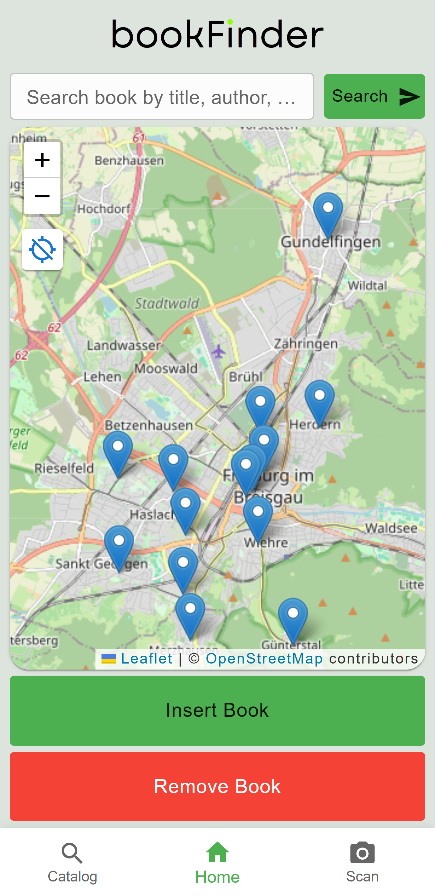
    <figcaption>Figure 1a: Home page</figcaption>
  </figure>
  <figure style="flex:1; max-width:48%; margin:0; text-align:center;">
    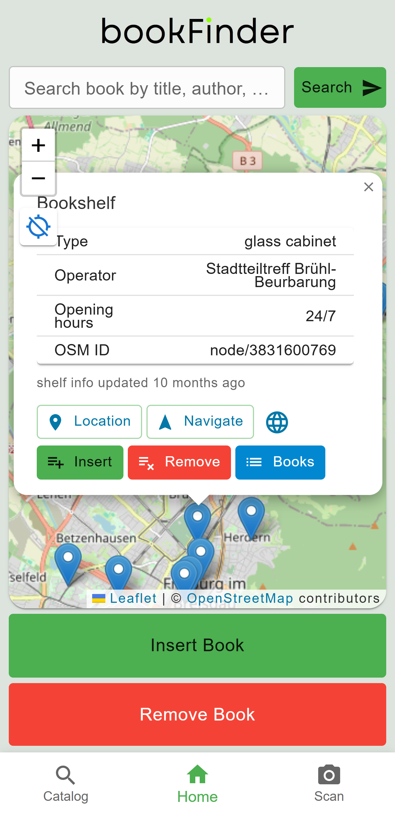
    <figcaption>Figure 1b: Home page with map popup</figcaption>
  </figure>

Figure 1: Application home page with shelf map and bottom navigation bar.

 

The Home page is meant to show the user what the app can do and to help navigate to either the Scan or the Catalog page.

### Scan Page

Besides by a click on the navigation bar, this page can also be reached either by a click on the 'Insert Book' or 'Remove Book' button on the Home screen, or by clicking the 'insert' or 'remove' button on a bookshelf's map popup.
The page adapts to how it was opened, e.g. by pre-selecting the shelf or hiding unnecessary buttons.

The Scan page consists of a full screen camera feed and a small text input field (Figure 2a). Users can either scan a book's barcode or manually type its ISBN.

The frontend then fetches metadata for the book and shows its author, title and cover, as well as some information about how popular this title usually is. Users can then choose to scan even more books or to continue (Figure 2b).

  <figure style="flex:1; max-width:48%; margin:0; text-align:center;">
    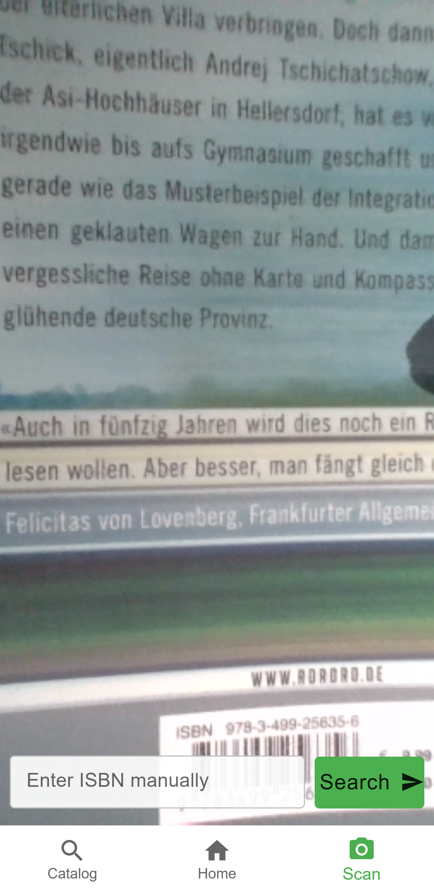
    <figcaption>Figure 2a: Scan page</figcaption>
  </figure>
  <figure style="flex:1; max-width:48%; margin:0; text-align:center;">
    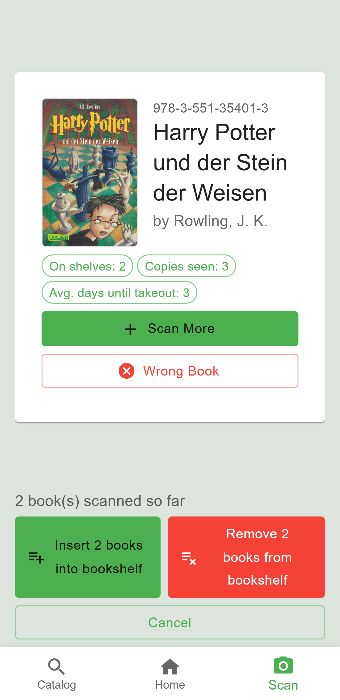
    <figcaption>Figure 2b: Scan results</figcaption>
  </figure>
  <figure style="flex:1; max-width:48%; margin:0; text-align:center;">
    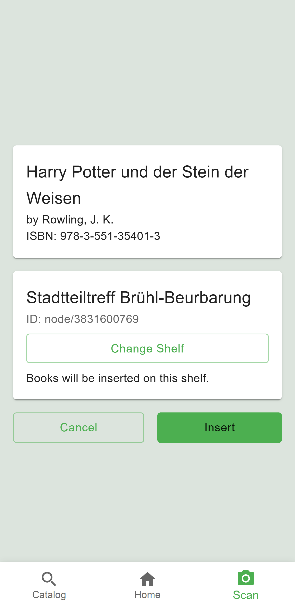
    <figcaption>Figure 2c: Shelf action overview</figcaption>
  </figure>

Figure 2: Scan page.

 

The user will then see a summary of scanned books and the selected shelf (Figure 2c). If wished, the shelf can be changed again on a shelf map similar to that on the Home page (Figure 3a).

If everything looks fine, the user can click on one of the conditionally shown 'Remove' or 'Insert' buttons to confirm. The backend will then check the request and add or remove the scanned books from the catalog for the selected shelf. After that, the user interface can show either a confirmation or an error message (Figure 3b).

The user can then restart scanning or change to another page via the navigation bar.

  <figure style="flex:1; max-width:48%; margin:0; text-align:center;">
    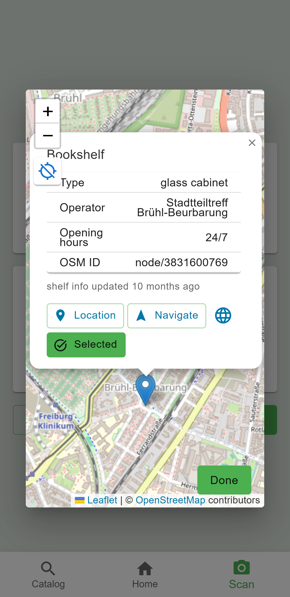
    <figcaption>Figure 3a: Shelf selection map</figcaption>
  </figure>
  <figure style="flex:1; max-width:48%; margin:0; text-align:center;">
    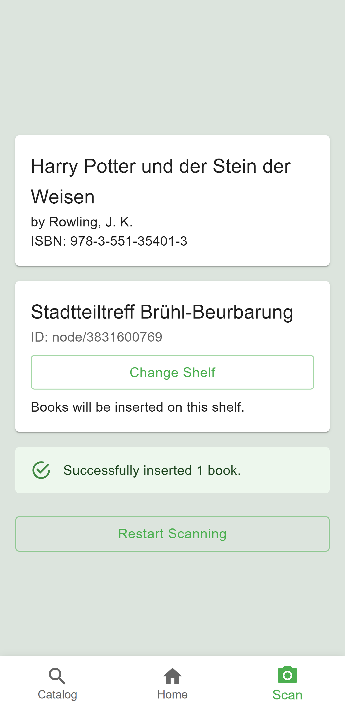
    <figcaption>Figure 3b: Shelf action confirmation</figcaption>
  </figure>

Figure 3: Scan page.

### Catalog Page

The Catalog page also reacts to how it was accessed. If accessed via the app's navigation bar, the Catalog page will simply show a search form and wait for user input (Figure 4a). If it was accessed by clicking the 'books' button on a shelf's map popup, the Catalog page will hide the search form behind a clickable button and show all books that are currently on the selected shelf (Figure 4b). The third and last way to access the Catalog page is via the quick search input field on the Home page. The Catalog page will then open up with the search results already loading (Figure 4c).

  <figure style="flex:1; max-width:48%; margin:0; text-align:center;">
    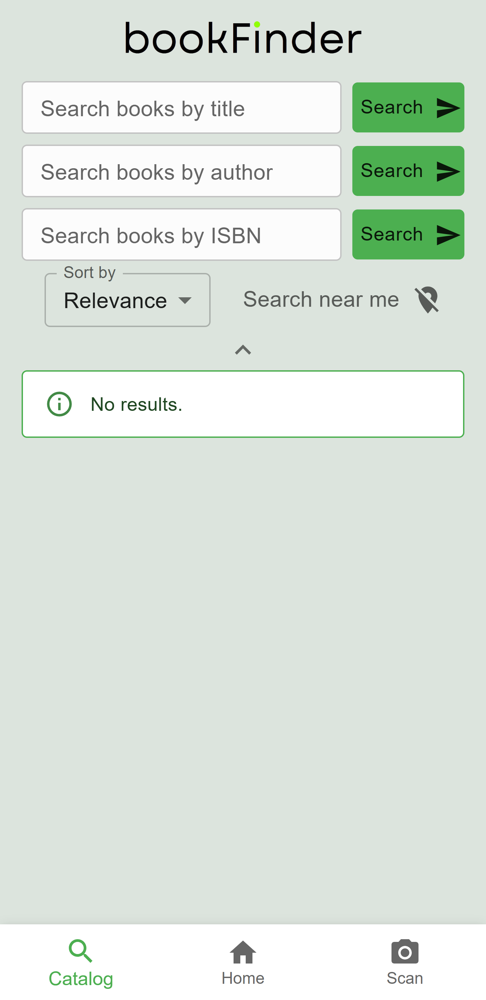
    <figcaption>Figure 4a: Catalog page without search input</figcaption>
  </figure>
  <figure style="flex:1; max-width:48%; margin:0; text-align:center;">
    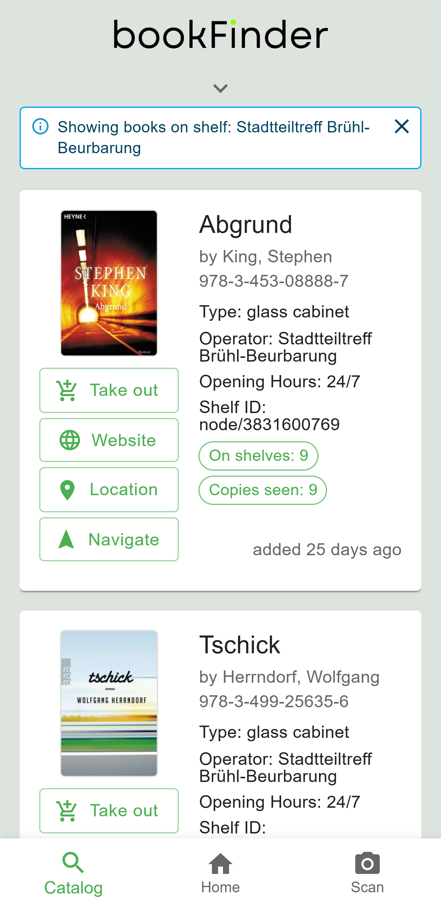
    <figcaption>Figure 4b: Catalog page with shelf view</figcaption>
  </figure>
  <figure style="flex:1; max-width:48%; margin:0; text-align:center;">
    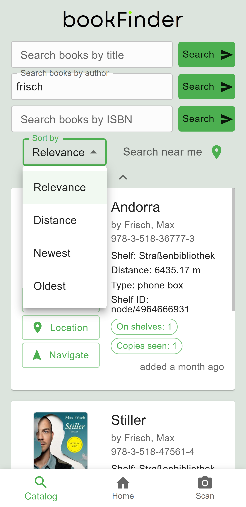
    <figcaption>Figure 4c: Catalog search results</figcaption>
  </figure>

Figure 4: Catalog page.

 

Results can be sorted by distance to the user, by relevance (fuzzy search score), or by the time the books have been on the shelf.
Each result is also tagged with general title popularity data and with its time on shelf, in a human readable form.

Search for a book is possible either by ISBN, by author, by title or by title and author. The catalog search is implemented as fuzzy search, so that the wished for book can be found even if there are typos in the user input.

## Implementation

The application combines a Python backend with a React / Typescript frontend. For the orchestration of front- and backend, two system architectures were implemented:

### Development Setup

The **development setup** (Figure 5) uses just two servers, making the setup less complex and therefore easier to understand and debug. It features verbose debug logging and Hot Module Replacement (HMR), removing the need for rebuilding files and restarting servers to verify the changes made during development.

<figure style="max-width:70%; margin:0; text-align:center; padding-bottom:20px;">
  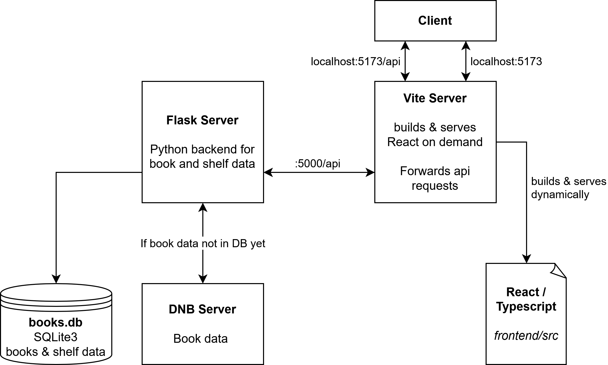
  <figcaption>Figure 5: Development setup</figcaption>
</figure>

### Production Setup

Besides the development setup, a production setup was implemented. The **production setup** (Figure 6) ditches HMR and debug modes in favor of a higher performance. It allows parallel backend processes and handles potential server crashes gracefully. For a better performance, the frontend is pre-compiled and served as plain HTML / JS / CSS.

<figure style="max-width:70%; margin:0; text-align:center; padding-bottom:20px;">
  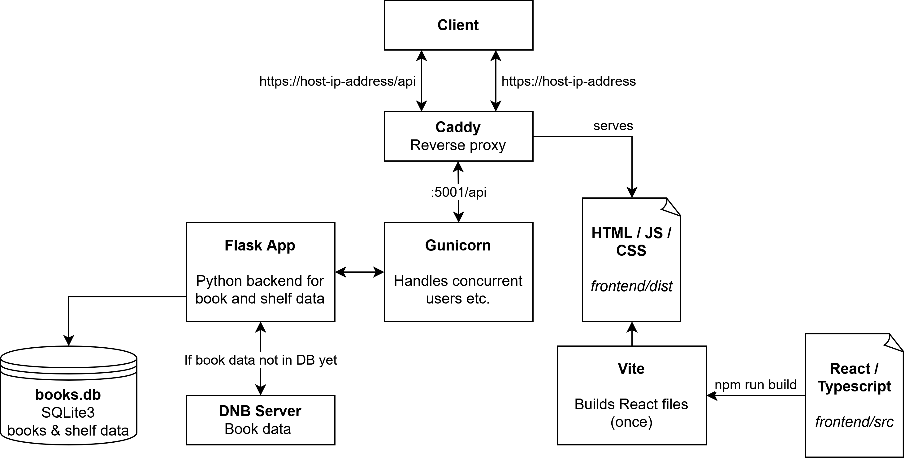
  <figcaption>Figure 6: Production setup</figcaption>
</figure>

### Reasons

**Python** was chosen because I was already familiar with the language and it allows for easy-to-understand code. There are a lot of libraries and writing REST APIs is very straightforward.

**SQLite3** was chosen because it is easy to use and performs well enough for mid-sized databases. A potential improvement would be using a database engine optimized for geospatial queries instead, as SQLite currently does not support efficient computation of distances. The implementation in Python seems quick enough though, so I kept using SQLite.

**Flask** was chosen because it is lightweight, easy to understand, and well suited for REST APIs.

**React** was chosen because it is an industry standard and I wanted to try it. A key benefit of React are reusable components, which help keep the code modular.

**Vite** provides a fast development server and tools for production builds. It was chosen because it is a popular all-in-one solution for React development and features Hot Module Replacement (HMR).

**Caddy and Gunicorn** were chosen because they don't require a lot of configuration and are easy to set up while still having all necessary functionality for production.
Gunicorn is added to the backend to handle concurrent connections and orchestrate worker processes. It starts Flask processes and handles potential crashes gracefully. 
Caddy is used as an easy-to-use, reliable reverse-proxy and for HTTPS.

**HTTPS** was used despite the expected browser warnings for self-signed certificates, because the application needs camera and location access, which modern browsers only grant if HTTPS is used. The browser warning would disappear after adding a valid, not self-signed TLS certificate, which could be issued by any trusted certificate authority (CA) as soon as the app is run on a device with a static IP address or behind a fixed domain.

### Data Sources

#### OpenStreetMap

As of August 2026, [OpenStreetMap](https://www.openstreetmap.org/) lists around 5800 public bookshelves within Germany. We can obtain their coordinates and other metadata efficiently via [QLever](https://qlever.cs.uni-freiburg.de/osm-planet/FG873S), and download the results in CSV format.

The backend of our application contains a standalone Python script that allows the import of said bookshelf metadata from a CSV file. If the database already contains bookshelves, the script safely updates them, warning if any shelf that still contains books in our database is to be removed. The script can be run via `make -C backend update-bookshelves`.

#### Deutsche Nationalbibliothek

The catalog of the German National Library [Deutsche Nationalbibliothek (DNB)](https://www.dnb.de/EN/) contains every book published in Germany since 1913 ([source](https://de.wikipedia.org/wiki/Deutsche_Nationalbibliothek#Aufgaben)). Its [API](https://www.dnb.de/DE/Professionell/Metadatendienste/Datenbezug/SRU/sru_node.html#doc58294bodyText5) allows our application to fetch book metadata like the title and author for any given ISBN. 

If a user scans a book that is unknown to DNB, there is a form for manual metadata entry integrated into our application.

Book metadata is only fetched from DNB whenever an ISBN is unknown to our backend, which will then store the data for future requests.

### Fuzzy Search

For an efficient and error-tolerant fuzzy catalog search, the backend uses the q-gram approach described in the [Information Retrieval lecture](https://daphne.tf.uni-freiburg.de/ws2324/InformationRetrieval/svn/public/slides/lecture-07.pdf). We stored the inverted indexes as tables in our SQLite3 database alongside the book and bookshelf metadata tables. The computation of fuzzy scores was implemented in Python.
More information can be found in the [project repository](https://github.com/JRuf02/bookfinder/blob/main/documentation/database-and-api-testing.md) and [source code](https://github.com/JRuf02/bookfinder/tree/main/backend/app/db).

### Miscellaneous Details

- The popularity of a book is computed as the average time that copies of the same book spent on their shelves before being taken out.
- The 'Navigate' button on a shelf's map popup opens a Google Maps navigation to the selected bookshelf.
- If a book's metadata is unavailable through the DNB API, the app offers a manual insertion dialog.
- OpenStreetMap objects are allowed to have arbitrary tags, so except for the coordinates, we are not guaranteed to get any metadata for a bookshelf. We handle this by conditionally showing only the information we found.
- To improve the shelf map's responsiveness and usability, markers are clustered if the user zooms out.

### Dockerization

The application can be run in a standalone Docker container for maximum isolation, or within a VS Code Devcontainer for development in a fully preconfigured IDE.

After setup, either the development servers (Vite + Flask) or the production servers (Caddy + Gunicorn) can be started. A central `Makefile` orchestrates starting servers and other common tasks; `make help` lists all available commands.

### Testing

Each API endpoint exposed by the backend has been thoroughly tested via the `pytest` framework. These tests can be found in `backend/api_tests/` and run via `make test` from the backend directory.

Even though the API endpoint tests are thorough enough to find most problems in each of the used functions, any functions with complex logic received additional unit- or doctests. The frontend does not contain any complex logic. Unit tests can be found in `backend/unit_tests/` and are also run via `make test` from the backend directory.

For the backend tests, our Makefile provides two targets: The standard `make test` uses Mocker to mock the DNB API's responses, which is necessary as running the tests often should not strain the external DNB servers. To ensure the entire system - including the DNB API - is working as expected, `make test-dnb` uses the real DNB API for the backend's API endpoint tests.

## Conclusion

The completed web application demonstrates how open data, modern web technologies, and collaborative editing can be combined to provide helpful information about public bookshelves throughout Germany. The project integrates OpenStreetMap, the Deutsche Nationalbibliothek API, React, Flask, Docker, Gunicorn, and Caddy into a complete production-ready system. By simplifying book registration through barcode scanning, the application reduces manual effort while keeping shelf inventories accurate and up to date.

## Future Work

While working on the project, the following features stood out as potentially useful future extensions:

- User accounts and gamification to motivate users to provide popular books
- Book borrowing history
- Statistics dashboard
- Recommendation engine like [bibtip](https://www.bibtip.de/en)
- Shelf moderation
- Offline support
- Reverse geocoding for shelf addresses
- International availability (would require replacing the DNB API)
- Support for books without ISBN

## Use of Generative AI

As this was my first time working with React, I used Claude Sonnet 5, ChatGPT and GitHub Copilot to generate example files and code snippets, which I then studied line by line and modified to my needs with the help of traditional means like the documentation. Towards the end of the project, I was able to write React code mostly without generative AI, as I had seen and understood the most important aspects of the framework.

Generative AI has also been used for brainstorming, code completion, formatting and documentation (comments and docstrings, not for standalone documentation files). Markdown files like this blog post or the README have been written without generative AI, but generative AI has been used for formatting and style improvement. Any AI-generated or modified code and text has been reviewed, understood and modified to ensure correctness.

| **Tool** | **Purpose** |
|---|---|
| ChatGPT | Learning React, React best practices, code snippets |
| Claude (Sonnet 5) | Debugging, Docker, formatting, suggestions for documentation, code snippets |
| GitHub Copilot | Code autocompletion, docstring autocompletion, debugging, React coding |

Table 1: Summary of AI tools used
