[DICOM Structured Reports](https://dicom.nema.org/dicom/2013/output/chtml/part20/sect_A.3.html), such as the standardized [Radiation Dose Structured Report (RDSR)](https://www.dicomstandard.org/using/radiation) are an invaluable source of information for radiation dose monitoring. [Dose Management Systems (DMS)](https://www.bfs.de/DE/bfs/wissenschaft-forschung/medizin/stellungnahmen/dosismanagementsystem.html) such as [Bayer Radimetrics™](https://space.bayer.de/radiologie/workflow-und-qm/radimetrics-mehrwert-radiologe/ihre-herausfordernde-rolle-in-einem-komplexen-umfeld) and [GE DoseWatch](https://www.gehealthcare.com/de-de/products/dose-management/dosewatch-dose-monitoring-software-ge-healthcare) provide commercial solutions to assist medical practitioners, radiographers, and medical physics experts in ensuring that radiation doses remain, on average, below national [Diagnostic Reference Levels (DRLs)](https://www.bfs.de/EN/topics/ion/medicine/diagnostics/reference-levels/reference-levels.html). However, in pursuit of serving compliance needs, advanced querying capabilities are often overlooked; non-radiation Structured Reports, such as those encoding [quantitative imaging biomarkers](https://pmc.ncbi.nlm.nih.gov/articles/PMC4888317/), are entirely disregarded.

To address this problem, we introduce [_*dicom2rdf*_](https://github.com/ad-freiburg/dicom2rdf), a two-stage data pipeline that processes millions of DICOM Structured Reports and provides a search interface not only for radiation doses, but for any Structured Report. The main idea is modeling the bare hierarchical structure of DICOM objects as a knowledge graph with the [Resource Description Framework (RDF)](https://www.w3.org/RDF/), but additionally transforming the resulting knowledge graph using an imposed set of rules. When paired with [QLever](https://qlever.dev), a high performance graph database, _*dicom2rdf*_ enables [SPARQL](https://www.w3.org/TR/sparql11-query) queries that operate on DICOM's "data element" level and make the data of arbitrary Structured Reports accessible to medical professionals who want to obtain data that go beyond serving compliance needs.

# Content
1. <a href="#problem">Problem</a>

2. <a href="#solution">Solution</a>

   2.1. <a href="#stage-convert">Stage 1: _convert_</a>

   2.2. <a href="#stage-construct">Stage 2: _construct_</a>

   2.3. <a href="#construct-queries">Dynamic SPARQL CONSTRUCT queries</a>

   2.4. <a href="#optimizations">Optimizations</a>

3. <a href="#evaluation">Evaluation</a>

   3.1. <a href="#datasets">Datasets</a>

   3.2. <a href="#eval-convert">Evaluation: _convert_</a>

   3.3. <a href="#eval-construct">Evaluation: _construct_</a>

   3.4. <a href="#clinical-utility">Clinical Utility</a>

4. <a href="#conclusion">Conclusion and Future Work</a>

   4.1. <a href="#improve-construct">Performance improvements to the _construct_ stage</a>

   4.2. <a href="#explore-data">Explore data beyond the thesis' scope</a>

   4.3. <a href="#prospective">Transition from retrospective to prospective pipeline</a>

   4.4. <a href="#llms">LLMs for generating SPARQL queries</a>

5. <a href="#appendix">Appendix</a>

   5.1. <a href="#query-1">Query #1: CTDIvol stratified by patient and scanner</a>

   5.2. <a href="#query-2">Query #2: Impact of excluding non-diagnostic acquisitions</a>

   5.3. <a href="#query-3">Query #3: Lung-RADS assessment distribution by gender</a>

   5.4. <a href="#query-4">Query #4: HKA deviation by BMI range and gender</a>

* * *

# <a id="problem"></a>1. Problem

Imagine a patient who visits a physician due to severe coughing and shortness of breath. The physician may order a chest CT to confirm e.g. a suspected [pulmonary embolism](https://www.mayoclinic.org/diseases-conditions/pulmonary-embolism/symptoms-causes/syc-20354647). The CT scanning process exposes the patient to ionizing radiation in a series of non-diagnostic and diagnostic scans, where the former ensures the best possible image quality for the latter while minimizing radiation exposure.

[Ionizing radiation poses health risks to humans](https://www.who.int/news-room/fact-sheets/detail/ionizing-radiation-and-health-effects). [Smith-Bindman et al.](https://doi.org/10.1001/jamainternmed.2025.0505) suggest that if current radiation dosing and utilization practices continue, CT-associated cancers could eventually account for 5% of all new cancer diagnoses annually. Strict monitoring of radiation doses is therefore required.

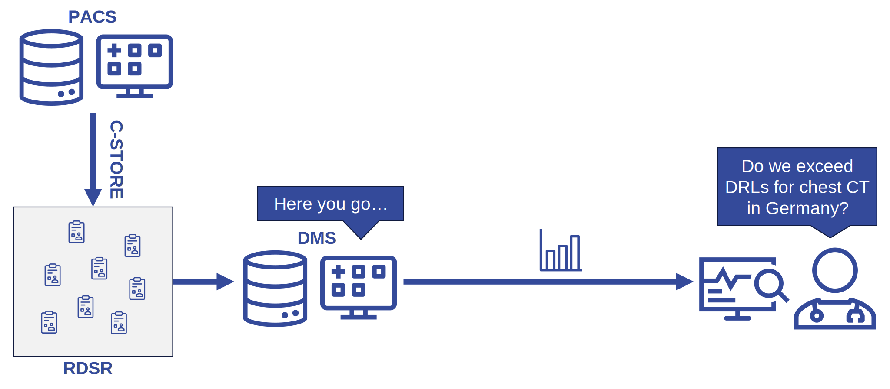

A Dose Management System (DMS) provides means to answer questions such as _"Do we exceed Dose Reference Levels (DRLs) for chest CT?"_. However, more complex queries depend on the capabilities of the DMS used within the clinical institution. For example, a DMS may not be able to report the _volume computed tomography dose index (CTDIvol)_, a central measure to estimate patient dose exposure, per _Acquisition Protocol_, a string identifier denoting a set of scan parameters. A medical physics expert may therefore not be able to distinguish how much of the reported radiation is attributed to diagnostic or non-diagnostic irradiation -- a recommended practice to avoid distortion of reported radiation doses ([Ria et al. 2019](https://doi.org/10.2214/AJR.18.21030); [Saltybaeva and Alkadhi 2019](https://doi.org/10.26044/esi2019/ESI-0061)).

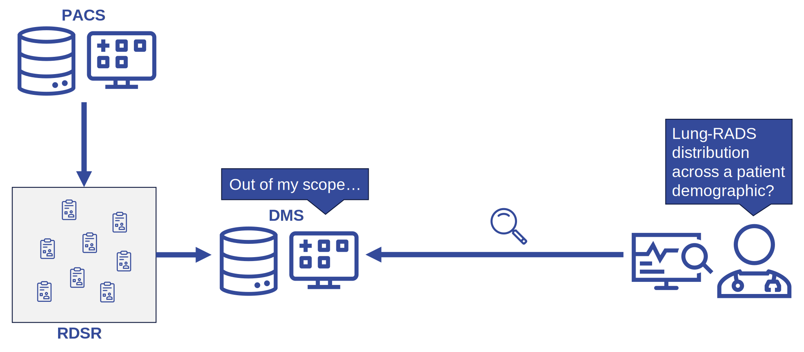

Beyond radiation dose reporting, DICOM SR are used to encode quantitative imaging biomarkers ([Prescott](https://doi.org/10.1007/s10278-012-9465-7)), which are not handled at all by DMS. For example, the question _"[Lung-RADS](https://radiopaedia.org/articles/lung-imaging-reporting-and-data-system-lung-rads) distribution across a patient demographic?"_ is simply out of scope and requires specialized software that ingests chest CT DICOM SR documents.

The problem statement is clear: Given millions of DICOM SR documents, how can we 

- index and query **all measurements**, and
- provide an **easy-to-use** and **fast** search interface

 regardless of the clinical context?

# <a id="solution"></a>2. Solution

_dicom2rdf_ consists of two stages: The _convert_ stage processes millions of DICOM SR documents and creates an intermediate knowledge graph. The _construct_ stage takes this knowledge graph as input and transforms it such that resulting queries make use of DICOM's embedded coded concepts. Queries that run against this semantic knowledge graph are less verbose and run faster compared to queries that run against the intermediate knowledge graph. 

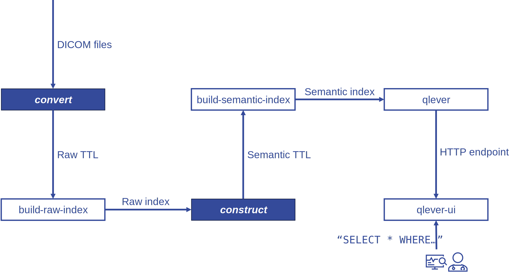

## <a id="stage-convert"></a>2.1. Stage 1: _convert_

A DICOM object is a Data Set; each Data Set consists of a list of Data Elements, where each Data Element has a _Tag_, a _Value Representation (VR)_, and a corresponding _Value_.

| Tag         | Meaning          | VR | Value                |
| ----------- | ---------------- | -- | -------------------- |
| (0010,0010) | Patient's Name   | PN | `"DOE^JANE"`           |
| (0010,1010) | Patient's Age    | AS | `"042Y"`               |
| (0010,1020) | Patient's Size   | DS | `1.62`                 |
| (0040,A730) | Content Sequence | SQ | `<List of Data Sets>` |

The VR imposes additional interpretation semantics on a value. For example, `"042Y"` is an _Age String_, where `42` is the scalar and `Y` the unit "year". For modeling the age of an infant in days, one would encode it as e.g. `"007D"`.

Notably, a Data Element's value can itself be a list of Data Sets. Therefore, it becomes evident that *DICOM objects form a tree*.

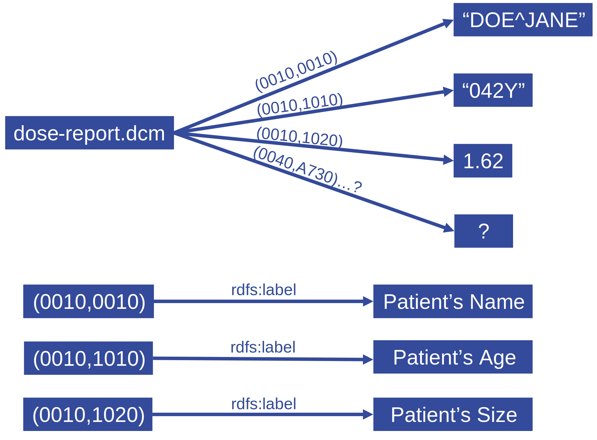

A natural translation of a DICOM object into RDF triples is to declare the _parent descriptor_ as the subject, the tags as the predicate, and the corresponding value as the object. We define the parent descriptor to be the **file name** at the root level. This definition is straightforward for non-sequence VRs; `SQ` warrants specific handling.

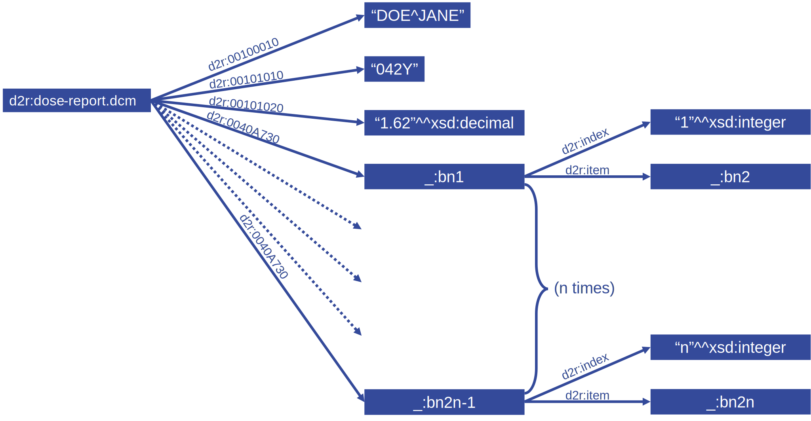

First, note that we have slightly adjusted the notation for the subject, predicate, and object to be able to properly serialize the triples using [RDF Turtle](https://www.w3.org/TR/turtle/), a concrete syntax for RDF. Second, note the repeated use of blank nodes to mediate between the parent and each child Data Set including its index, as the order of Data Sets in DICOM is significant. 

Each blank node subject in the resulting set of triples is itself a Data Set. Therefore, it is processed the same way as the root level. We promote the subject's IRI, which uniquely identifies a Data Set, to be the new parent descriptor, and continue to process the DICOM tree recursively. This process corresponds to a depth-first search (DFS) on the DICOM tree and eventually terminates due to the lack of circular structures as per the DICOM standard. The runtime of processing a single DICOM file is O(n), where n is the number of Data Elements in that file. The result is a RDF Turtle file - the intermediate RDF representation of the DICOM file.

A SPARQL query that retrieves all CTDIvol measurements from this intermediate representation is given below. In addition, we show the nodes that need to be visited in order to reach the desired measurement value.

```sparql
SELECT * WHERE {
    ?dose_report d2r:0040A730 ?ct_acq_cont_seq .
    ?ct_acq_cont_seq d2r:item ?ct_acq_item .
    ?ct_acq_item d2r:0040A043 ?ct_acq_cncs .
    ?ct_acq_cncs d2r:00080100 "113819" .
    ?ct_acq_cncs d2r:00080102 "DCM" .
    ?ct_acq_item d2r:0040A730 ?ct_dose_cont_seq .
    ?ct_dose_cont_seq d2r:item ?ct_dose_item .
    ?ct_dose_item d2r:0040A043 ?ct_dose_cncs .
    ?ct_dose_cncs d2r:00080100 "113829" .
    ?ct_dose_cncs d2r:00080102 "DCM" .
    ?ct_dose_item d2r:0040A730 ?ctdivol_cont_seq .
    ?ctdivol_cont_seq d2r:item ?ctdivol_item .
    ?ctdivol_item d2r:0040A043 ?ctdivol_cncs .
    ?ctdivol_cncs d2r:00080100 "113830" .
    ?ctdivol_cncs d2r:00080102 "DCM" .
    ?ctdivol_item d2r:0040A300 ?ctdivol_mv_seq .
    ?ctdivol_mv_seq d2r:004008EA ?ctdivol_mu_cs .
    ?ctdivol_mu_cs d2r:00080100 "mGy" .
    ?ctdivol_mu_cs d2r:00080102 "UCUM" .
    ?ctdivol_mv_seq d2r:0040A30A ?ctdivol .
}
```

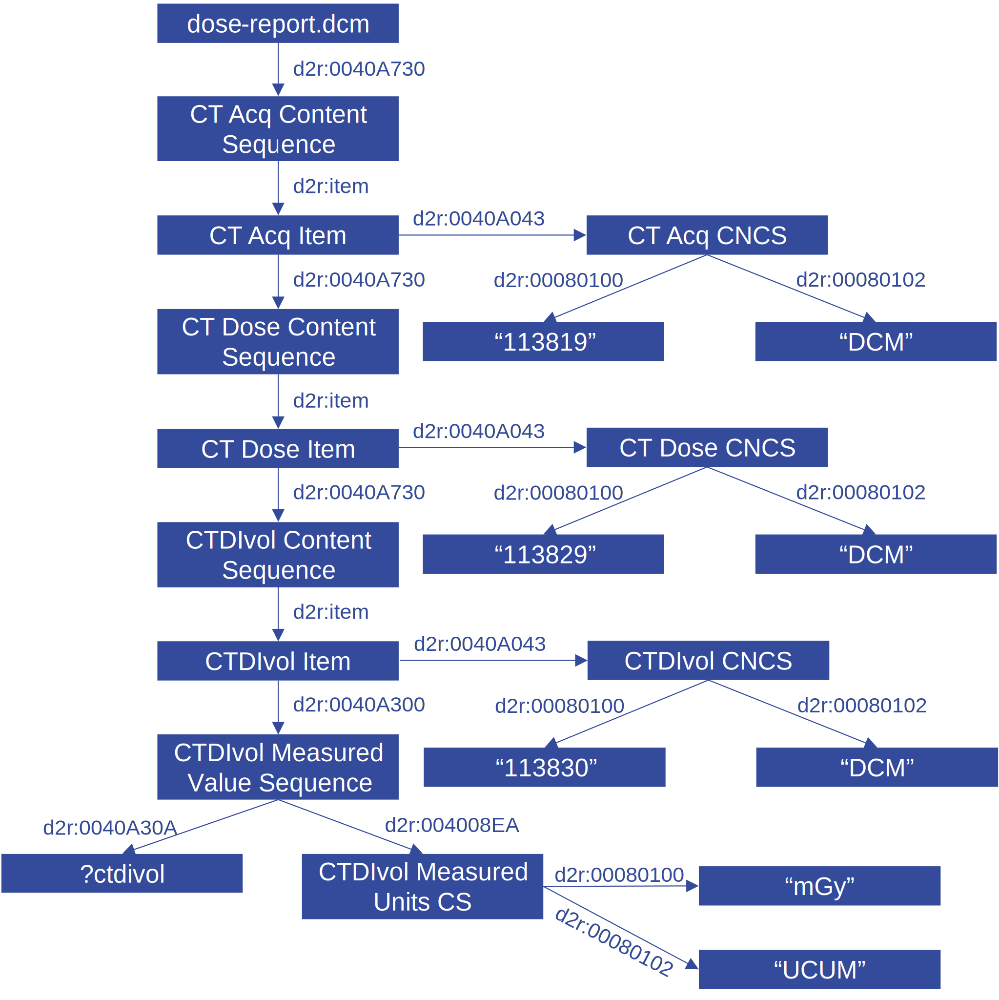

## <a id="stage-construct"></a>2.2. Stage 2: _construct_

An obvious shortcoming of the aforementioned SPARQL query is the number of triple patterns required to write a comparatively simple query.

The main reason for the query's verbosity is the number of triple patterns required to go from one coded concept to the next. Consider this not-yet-traversed portion of nodes that model a concept hop from CT Acquisition to CT Dose.

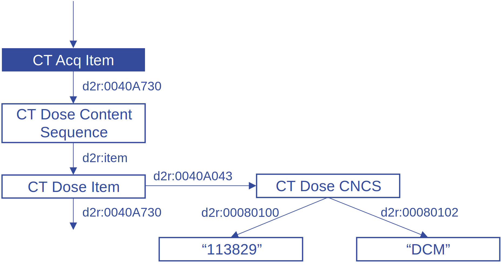

In order to establish that the Content Item is _indeed_ a CT Dose, one must first visit the intermediate Content Sequence node, followed by the Content Item. Then, it must be ensured that Concept Name Code Sequence (CNCS) specifies the Code 113829 and the Coding Scheme Designator DCM, establishing the concept of a CT Dose. The required amount of hops, i.e. triple patterns, is 5.

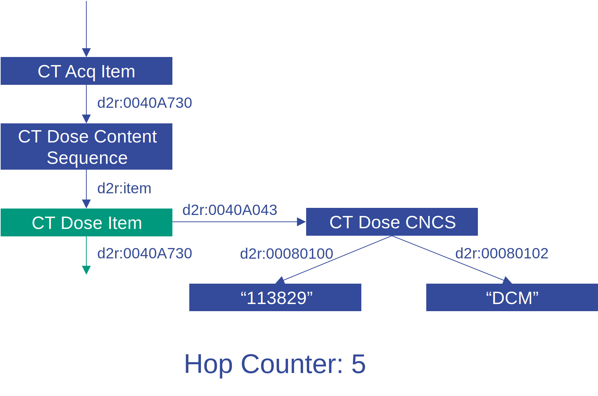

We decrease the number of required hops by **maximizing the information gain per hop**. First, we observe a more complete portion of nodes that model a concept hop from CT Acquisition to CT Dose. This portion also includes the Content Item's index and the concept's human-readable label.

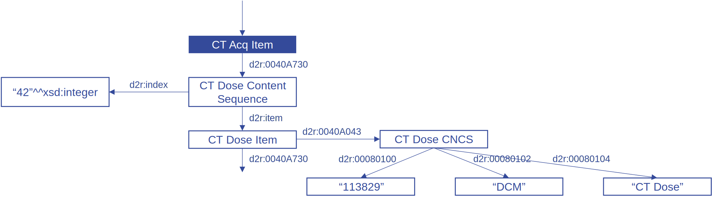

We use all triples of a CNCS by first forming a new predicate, where the Coding Scheme Designator (DCM) informs the IRI prefix to use. The Code (113829) is appended to that IRI prefix. A configuration file defines a variety of mappings from Coding Scheme Designator to IRI prefix, such that the resulting predicate IRI [points to an already established vocabulary, such as BioOntology](https://bioportal.bioontology.org/ontologies/DCM?p=classes&conceptid=http%3A%2F%2Fdicom.nema.org%2Fresources%2Fontology%2FDCM%2F113829). 

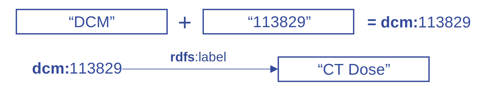

We also enrich this new predicate with the concept's human-readable label, resulting in a highly explorable knowledge graph via QLever UI's autocompletion support.

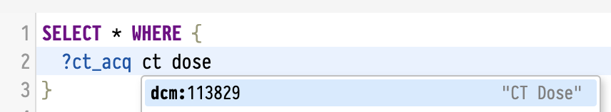

Finally, we use the newly constructed predicate to produce a triple that directly connects the source concept to the target concept. We conclude the transformation by moving the index triple to the target concept. As a result, we only require a single hop to go from one concept to the next.

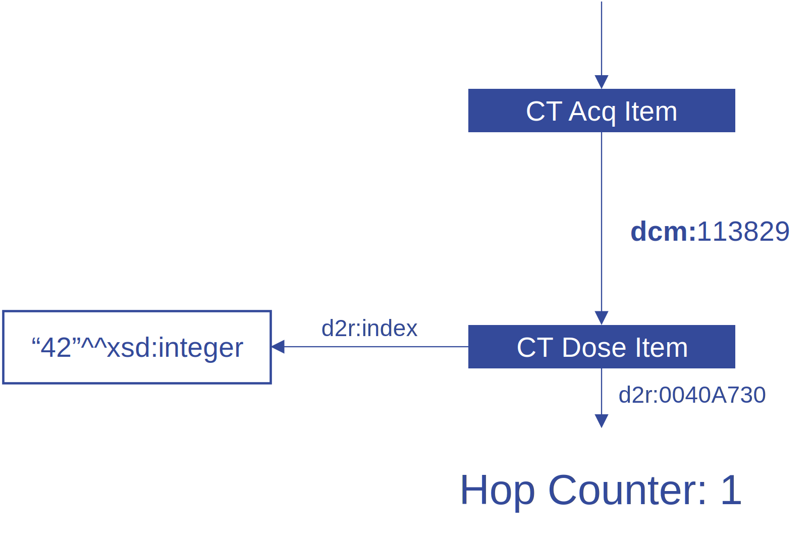

A series of similar "transformation rules" are defined for each Value Type, such as NUM, TEXT, CODE, and so on. Through strategic composition of multiple transformations, we drastically reduce the number of hops required to reach _any_ value in a DICOM object.

## <a id="construct-queries"></a>2.3. Dynamic SPARQL CONSTRUCT queries

The transformations are achieved via [SPARQL CONSTRUCT](https://www.w3.org/TR/sparql11-query/#construct) queries. Consider the following SPARQL CONSTRUCT query that extracts all TEXT values for the first level of concept containers:

```sparql
CONSTRUCT {
    # Directly connect the DICOM root with e.g. a specific instance of a CT Acquisition.
    ?level0IRI ?level0to1Predicate ?level1IRI .
    
    # Label the predicate above with e.g. "CT Acquisition".
    ?level0to1Predicate rdfs:label ?level1ConceptNameMeaning .
    
    # Directly connect e.g. the specific CT Acquisition with the specific TEXT value,
    # e.g. Acquisition Protocol.
    ?level1IRI ?valuePred ?value .
    
    # Label the value predicate with e.g. "Acquisition Protocol".
    ?valuePred rdfs:label ?conceptNameMeaning .
}
WHERE {
    # Ensure ?level0 is the DICOM object root.
    ?level0 a dicom2rdf:DocumentRoot .
    
    # Globally unique identifier for each DICOM object
    ?level0 dicom2rdf:00080018 ?sopInstanceUID .
    
    # Form an IRI that uniquely identifies this DICOM object.
    BIND(IRI(CONCAT(STR(rad:), "sopInstance/", ?sopInstanceUID)) AS ?level0IRI)
    
    # Prepare "a way out" of ?level0 to ?level1.
    ?level0 dicom2rdf:0040A730 [
        dicom2rdf:index ?level1Index ;
        dicom2rdf:item ?level1 ;
    ] .
    
    # Ensure that ?level1 is indeed a CONTAINER.
    ?level1 dicom2rdf:0040A040 "CONTAINER" .
    
    # Find out what concept ?level1 encodes.
    ?level1 dicom2rdf:0040A043 [
        dicom2rdf:00080100 ?level1ConceptNameCode ;
        dicom2rdf:00080102 ?level1ConceptNameCodingScheme ;
        dicom2rdf:00080104 ?level1ConceptNameMeaning
    ] .
    
    # Form an IRI that encodes the concept of ?level1.
    BIND(IRI(CONCAT(
        STR(?level1ConceptNameCodingScheme),
        ENCODE_FOR_URI(STR(?level1ConceptNameCode))
    )) AS ?level0to1Predicate)
    
    # Form an IRI for ?level1 itself.
    BIND(IRI(CONCAT(
        STR(?level0IRI),
        "_",
        STR(?level1Index),
        "_",
        ENCODE_FOR_URI(?level1ConceptNameMeaning)
    )) AS ?level1IRI)

    # Prepare "a way out" of ?level1 to ?level2.
    ?level1 dicom2rdf:0040A730 [
        dicom2rdf:index ?level2Index ;
        dicom2rdf:item ?level2
    ] .
    
    #----------------------------------------------------------------------------------
    
    # Ensure that ?level2 is indeed a TEXT value.
    ?level2 dicom2rdf:0040A040 "TEXT" .
    
    # Find out what concept ?level2, our TEXT, encodes.
    ?level2 dicom2rdf:0040A043 [
        dicom2rdf:00080100 ?conceptNameCode ;
        dicom2rdf:00080102 ?conceptNameCodingScheme ;
        dicom2rdf:00080104 ?conceptNameMeaning
    ] .

    # Retrieve the TEXT ?value.
    ?level2 dicom2rdf:0040A160 ?value .
    
    # Form an IRI that encodes the concept of ?level2.
    BIND(IRI(CONCAT(
        STR(?conceptNameCodingScheme),
        ENCODE_FOR_URI(?conceptNameCode)
    )) AS ?valuePred)
}
```

This query implements the transformation ideas discussed previously. The query is divided into two parts: traversing across `n = 1` containers, and capturing a specific value at the end. When reading this query, it becomes apparent that the first part gives rise to a parametric version of the concept traversal part. This is exactly what `construct.rs`, a Rust program that implements the _construct_ part of the pipeline, provides. In addition, value-specific queries that capture the value of numbers, coded concepts, dates, etc. are also provided.

For each level, value-specific CONSTRUCT queries are generated dynamically, up to `n`. We know `n` in advance, because the _convert_ stage keeps track of how many layers it descended and propagates the value to the _construct_ stage by writing a final `<> <meta:maxDepth> n .` triple to its output.

## <a id="optimizations"></a>2.4. Optimizations

The _convert_ and _construct_ stages employ several optimizations. First, we leverage the fact that DICOM files do not depend on each other, enabling processing of DICOM files in parallel. The Rust rayon crate provides a straightforward way to add data parallelism to the _convert_ stage.

Next, we introduce on-the-fly data compression to the output that the _convert_ stage creates. Especially with higher thread counts, disk I/O becomes the bottleneck. By spending more CPU cycles in favor of less data written to disk, we alleviate the issue a little bit.

Running CONSTRUCT queries on a QLever instance that holds triples for all 7 million DICOM files is unnecessarily wasteful. As established earlier, individual files do not have links among each other. Therefore, it is more efficient to split the QLever instances by a set amount of triples to reduce the overall runtime of a CONSTRUCT query.

# <a id="evaluation"></a>3. Evaluation

We evaluate various aspects of both stages _convert_ and _construct_. For _convert_, the focus is runtime and peak memory consumption. For _construct_, we focus on the reduction of both query complexity (number of required triple patterns) and runtime.

## <a id="datasets"></a>3.1. Datasets

We use two datasets for distinct purposes.

The **NSCLC-Radiomics dataset**, available publicly from the [National Cancer Institute - Imaging Data Commons](https://portal.imaging.datacommons.cancer.gov/explore/), contains **~40 GB of DICOM data**. However, **only 240 MB of those are SR documents**. In order to have sufficient data for throughput measurements, we **replicate the data 10-fold, yielding ~2.2 GB of SR documents**. The purpose of this dataset is to evaluate the performance of the *convert* stage in a reproducible manner.

The **institutional dataset**, provided by the [University Medical Center Freiburg](https://www.uniklinik-freiburg.de) and not available publicly for patient privacy reasons, contains **~357 GB of DICOM data, with 7,139,423 SR documents of all kinds, including RDSR documents**. This rich dataset allows for evaluating the *construct* stage, in particular how clinically relevant queries improve both in query complexity, in performance, and the overall clinical utility of *dicom2rdf* in a real world setting.

## <a id="eval-convert"></a>3.2. Evaluation: *convert*

We observe that conversion runtime decreases with increasing thread count. However, while runtime decreases approximately 8-fold when going from 1 thread to 8, we barely see a runtime reduction for additional threads. Increasing gzip compression level by 1 reduces overall runtime, however going beyond level 1 increases runtime yet again. A common cause for this type of behavior is shared resource contention, e.g. disk write speed.

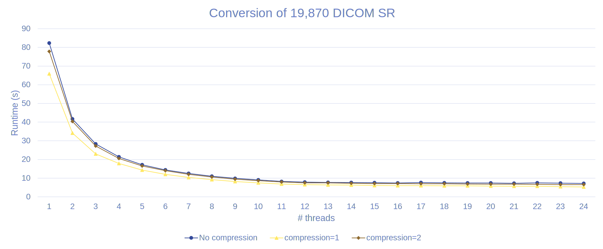

Next, we use [_dcm2rdf_](https://github.com/ebremer/dcm2rdf), a Java-based program written by [Erich Bremer](https://ebremer.com) that performs DICOM-to-RDF conversion similar to our *convert* stage. The conversion also uses all 24 threads and is started with the command `dcm2rdf -src /input -dest /output -t 24 -status`. We observe a 155-fold decrease in runtime and up to 97% less peak memory consumption. We attribute these performance gains mainly to our language of choice, [Rust](https://rust-lang.org), as well as to the excellent DICOM object implementation of [dicom-rs](https://github.com/Enet4/dicom-rs).

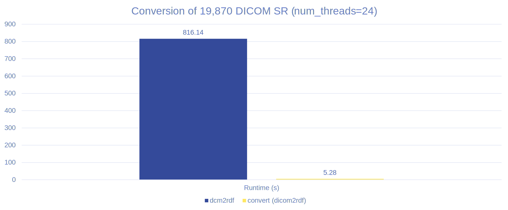

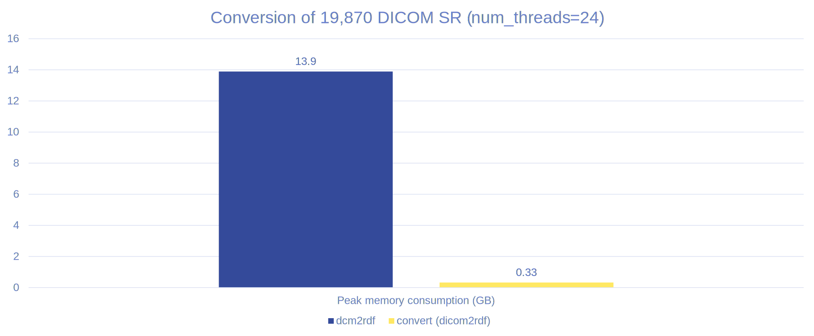

## <a id="eval-construct"></a>3.3. Evaluation: *construct*

We prepared four clinically relevant queries of varying complexity:

- Query #1: Mean CTDIvol stratified by patient height, patient weight, scanner model, and acquisition protocol
- Query #2: Impact of excluding non-diagnostic acquisitions on average per-study CTDIvol for the 10 most frequent protocol names
- Query #3: Lung-RADS assessment distribution by gender
- Query #4: Mean hip-knee angle (HKA) deviation by BMI range and gender

We confirm that _construct_ achieves its goal of both less verbose queries (decreased query complexity) as well as decreased query runtime: while runtime decreases by ~97%, complexity also decreases by up to 74%. This is in line with the _construct_ stage's transformation, reducing required hops from 5 to 1 for each concept traversal. Especially the reduced query runtime enables us to be more aggressive when re-evaluating queries on the frontend and paves the way for future real time measurement monitoring purposes.

The appendix provides a full listing of all four queries _after_ the _construct_ stage.

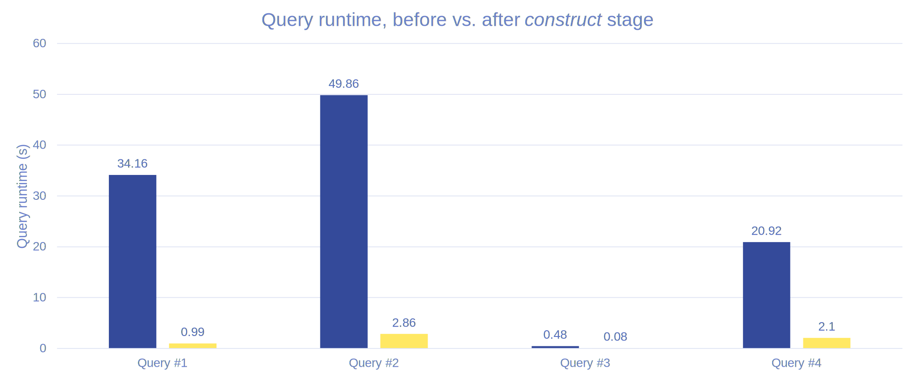
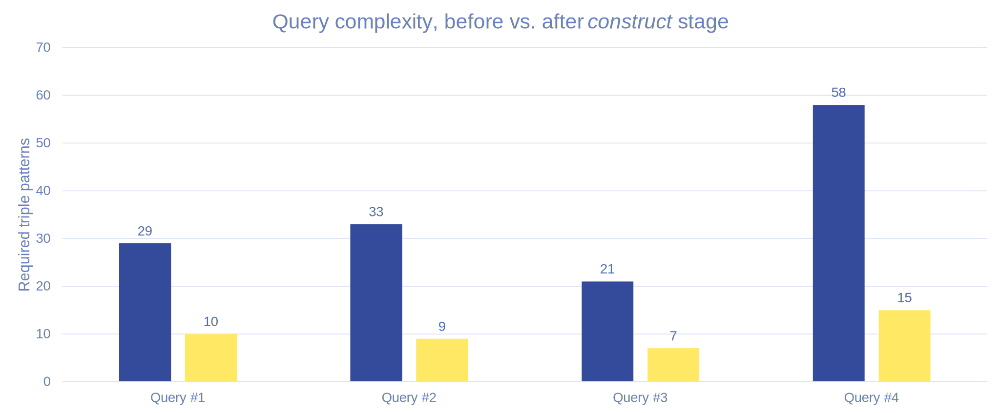

## <a id="clinical-utility"></a>3.4. Clinical Utility

We evaluated the performance characteristics of _dicom2rdf_, but how does it fare in terms of clinical utility? Please note that the data shown in this section does not make any claims of medical significance.

We begin by observing the results of an internal data analysis at the University Medical Center Freiburg. The internal presentation slide correlates both CTDIvol and _size-specific dose estimate (SSDE)_ with patient BMI, where the latter accounts for the patient size to over-/undercorrect received dose for children and adult patients, respectively. 

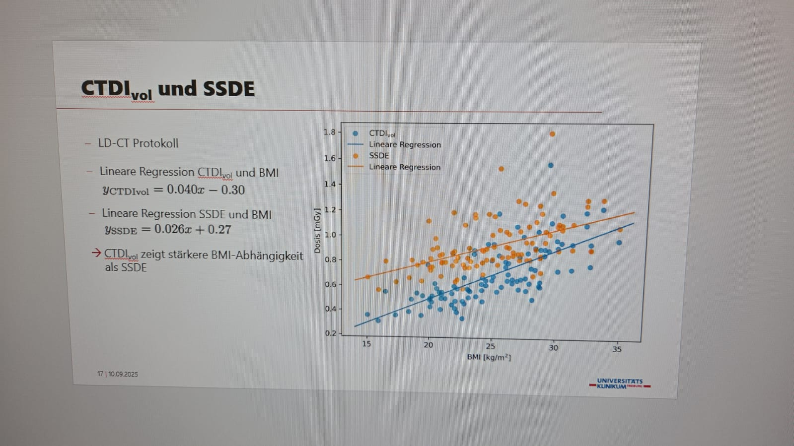

We replicate these results using a slight variation of query #1 by adding two more triple patterns to capture the SSDE value and its unit. A simple web interface executes this query against a QLever instance and plots the results in under a second. As expected, the CTDIvol slope is steeper and underestimates the received dose for patients with lower BMI, and vice-versa.

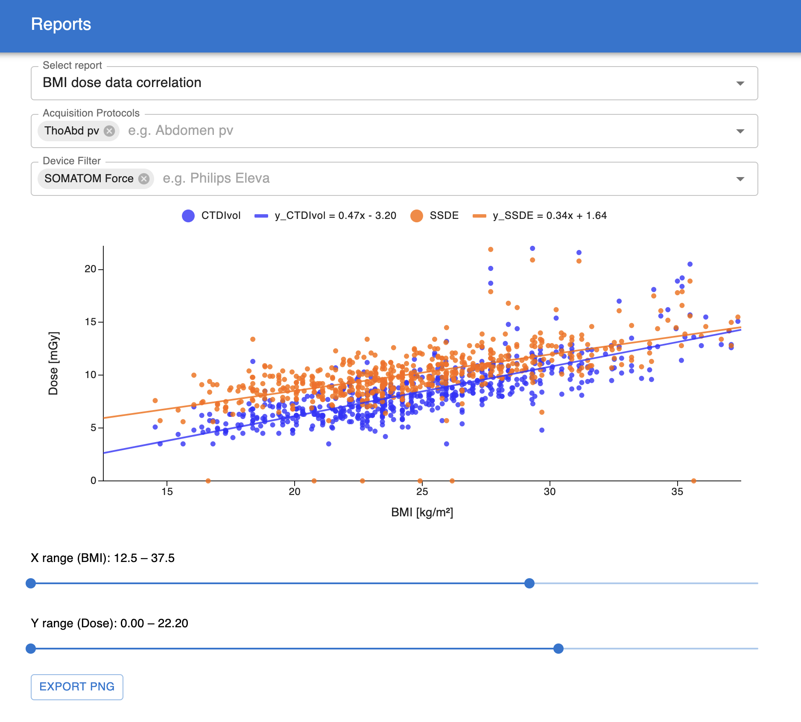

In contrast to the static presentation slide, the web UI is highly dynamic; observing values for only diagnostic protocols, specific devices, BMI ranges becomes a trivial task.

Query #2 revisits radiation dose measurements, in particular, how reported dose changes when non-diagnostic irradiation events are excluded. The data shows that the difference can be up to 12.2%.

| Row# | Protocol Name | Count | Avg CTDIvol ALL (mGy) | Avg CTDIvol Diagnostic (mGy) | Diff. (mGy) | Diff. (%) |
| ---- | ------------- | ----- | --------------------- | ---------------------------- | ----------- | --------- |
| 1 | 01a_Head_Ischaemie_Spi | 65,731 | 48.1 | 46.4 | 1.7 | 3.5 |
| 2 | 01a_Polytrauma | 33,893 | 64.2 | 62.4 | 1.8 | 2.8 |
| 3 | 07_Stroke | 31,860 | 120.7 | 114.1 | 6.6 | 5.5 |
| 4 | 04_Head_HWS_X_Care_Spirale | 24,996 | 52.6 | 51.9 | 0.6 | 1.2 |
| 5 | 02c_Multiregion | 19,936 | 61.1 | 57.1 | 3.9 | 6.5 |
| 6 | 0a1_Cardio | 19,357 | 24.6 | 21.6 | 3.0 | 12.2 |
| 7 | 05_Head_MG_HWS_X_Care_Spirale | 18,645 | 50.0 | 49.5 | 0.5 | 1.1 |
| 8 | 02a_prae_TAVI_konventionell | 17,592 | 57.5 | 52.0 | 5.6 | 9.7 |
| 9 | 11_Thx_Abd_DE_venoes | 16,879 | 8.7 | 8.5 | 0.2 | 2.3 |
| 10 | 01_Thorax_venoes | 16,214 | 4.5 | 4.4 | 0.04 | 0.9 |

Query #3 shows how Lung-RADS assessments are distributed by gender. The data shows that male patients are screened roughly twice as often as female patients, in line with [Randhawa et al.](https://doi.org/10.1007/s10900-020-00826-8).

| Row# | Gender | Count | Lung-RADS Assessment |
|-|-|-|-|
| 1 | female | 80 | Lung-rads 0 |
| 2 | male | 182 | Lung-rads 0 |
| 3 | female | 40 | Lung-rads 1 |
| 4 | male | 148 | Lung-rads 1 |
| 5 | other | 1 | Lung-rads 2 |
| 6 | female | 92 | Lung-rads 2 |
| 7 | male | 235 | Lung-rads 2 |
| 8 | female | 29 | Lung-rads 3 |
| 9 | male | 78 | Lung-rads 3 |
| 10 | other | 2 | Lung-rads 3 |
| 11 | female | 35 | Lung-rads 4a |
| 12 | male | 62 | Lung-rads 4a |
| 13 | female | 27 | Lung-rads 4b |
| 14 | male | 21 | Lung-rads 4b |
| 15 | female | 28 | Lung-rads 4x |
| 16 | male | 32 | Lung-rads 4x |
| 17 | other | 1 | Lung-rads 4x |

Other desired queries involve quantitative imaging biomarkers such as the distribution of hip-knee angle measurements. The data shows more male patients to exhibit HKA values outside the normal range than within. Additionally, data shows that female patients, on average, exhibit increasing HKA deviation between the left and right leg with increasing BMI (Query #4).

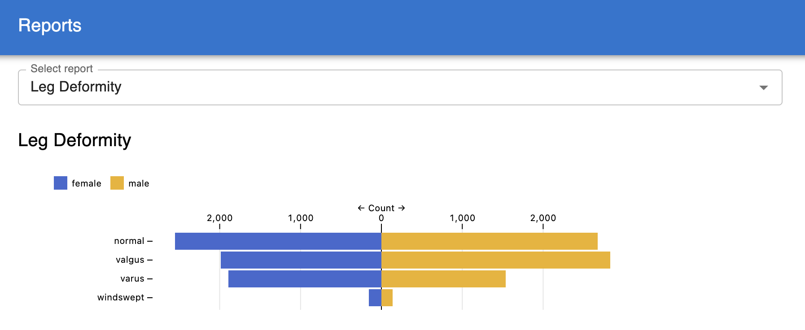

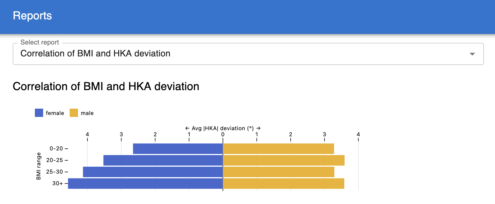

# <a id="conclusion"></a>4. Conclusion and Future Work

Overall, _dicom2rdf_ shows that modeling millions of DICOM SR documents as a knowledge graph is viable at institutional scale. Reflecting back on the problem statement, we are indeed able to index and query measurements on the Data Element level, and provide an easy-to-use and fast search interface, either via QLever UI, or custom web frontends with interactive visualizations, backed by data retrieved via SPARQL queries.

However, _dicom2rdf_ is far from complete and is intended to evolve with changing data querying requirements as well as emerging technologies.

## <a id="improve-construct"></a>4.1. Performance improvements to the _construct_ stage

As Stephen C. Johnson and Brian W. Kernighan wrote in the [August 1983 issue of Byte Magazine](https://archive.org/details/byte-magazine-1983-08):

> "[F]irst make it work, then make it right, and, finally, make it fast."

While the convert stage went through all three phases, work on the construct stage stopped after the second, leaving significant performance improvements unrealized.

For example, running the extractor queries for increasing depth leads to re-traversal of the same Container nodes over and over again. A more sensible approach would be to add Container nodes of depth `n` to a `frontier`, so that finding containers of depth `n+1` becomes an operation that is linear in the number of children for all nodes in the `frontier`.

## <a id="explore-data"></a>4.2. Explore data beyond the thesis' scope 

The focus of this thesis lay on dose data extraction stratified by patient demographic, as well as a few quantitative imaging biomarkers such as knee angle measurements. However, the institutional dataset contains data far beyond the scope, such as mammography, ultrasound, and sonography SR documents. Querying these documents with regards to clinically relevant questions will surely yield interesting results.

## <a id="prospective"></a>4.3. Transition from retrospective to prospective pipeline

The _dicom2rdf_ pipeline is designed to process a fixed collection of DICOM SR documents and analyze the data retrospectively, therefore accommodating a [_retrospective cohort study_](https://en.wikipedia.org/wiki/Retrospective_cohort_study). Extending the pipeline with a "watch mode" that provides an endpoint for continuously feeding in new DICOM SR documents would open the door for performing [_prospective cohort studies_](https://en.wikipedia.org/wiki/Prospective_cohort_study), where data of an ongoing study is collected and interpreted over time.

## <a id="llms"></a>4.4. LLMs for generating SPARQL queries

While _dicom2rdf_ makes DICOM SR documents queryable on the Data Element level, writing corresponding SPARQL queries remains a technically involved task and requires knowledge about the resulting schema. The paper [**G**eneric **R**easoning **A**nd **SP**ARQL Generation across Knowledge Graphs](https://arxiv.org/abs/2507.08107) (GRASP), written by Sebastian Walter and Hannah Bast, explores ways to systematically explore a knowledge graph using nothing more than its SPARQL endpoint. In fact, Sebastian Walter has conducted initial experiments against a knowledge graph produced by dicom2rdf with promising results. Below is a video by Sebastian Walter, showcasing how a prompt in natural language results in a SPARQL query.

<video controls width="600">
    <source src="img/conclusion-future-work/grasp_dicom_example_2025-09-17_cut.mp4">
</video>

Further exploring this approach would enable non-technical people with domain knowledge to generate SPARQL queries answering their clinically relevant questions.

# <a id="appendix"></a>5. Appendix

## <a id="query-1"></a>5.1. Query #1: Mean CTDIvol stratified by patient height, patient weight, scanner model, and acquisition protocol

```sparql
PREFIX ucum: <https://units-of-measurement.org/>
PREFIX qudt: <http://qudt.org/schema/qudt/>
PREFIX schema: <https://schema.org/>
PREFIX rad: <http://uniklinik-freiburg.de/rdf/radiologie/>
PREFIX dcm: <https://dicom.nema.org/resources/ontology/DCM/>
SELECT
    ?scanner_model_name
    ?patient_height
    ?patient_weight
    ?acquisition_protocol
    ?ctdivol
WHERE {
    ?sr dcm:121195 ?scanner_model_name .
    ?sr rad:patient ?patient .
    ?patient schema:height ?patient_height .
    ?patient schema:weight ?patient_weight .
    ?sr dcm:113819 ?ct_acquisition .
    ?ct_acquisition dcm:125203 ?acquisition_protocol .
    ?ct_acquisition dcm:113829 ?ct_dose .
    ?ct_dose dcm:113830 ?ctdivol_measurement .
    ?ctdivol_measurement qudt:unit ucum:mGy .
    ?ctdivol_measurement qudt:numericValue ?ctdivol .
}
```

## <a id="query-2"></a>5.2. Query #2: Impact of excluding non-diagnostic acquisitions on average per-study CTDIvol for the 10 most frequent protocol names

```sparql
PREFIX ucum: <https://units-of-measurement.org/>
PREFIX qudt: <http://qudt.org/schema/qudt/>
PREFIX dcm: <https://dicom.nema.org/resources/ontology/DCM/>
PREFIX dicom2rdf: <http://dicom2rdf.uniklinik-freiburg.de/>
SELECT
    ?protocol_name
    ?protocol_name_count
    (AVG(?study_ctdivol_all) AS ?avg_ctdivol_all)
    (AVG(?study_ctdivol_diag) AS ?avg_ctdivol_diag)
    (AVG(?study_ctdivol_all) - AVG(?study_ctdivol_diag) AS ?abs_difference)
    ((AVG(?study_ctdivol_all) - AVG(?study_ctdivol_diag)) / AVG(?study_ctdivol_all) * 100 AS ?rel_difference_pct)
WHERE {
    {
        SELECT
            (COUNT(?protocol_name) AS ?protocol_name_count)
            ?protocol_name
        WHERE {
            ?sr dicom2rdf:00181030 ?protocol_name .
            ?sr dcm:113819 ?ct_acquisition .
            FILTER (REGEX(?protocol_name,"^[0-9][0-9]"))
        }
        GROUP BY ?protocol_name
        ORDER BY DESC(?protocol_name_count)
        LIMIT 10
    }
    {
        SELECT
            ?sr
            ?protocol_name
            (SUM(?mean_ctdivol_num) AS ?study_ctdivol_all)
            (SUM(?mean_ctdivol_num_diag) AS ?study_ctdivol_diag)
        WHERE {
            ?sr dicom2rdf:00181030 ?protocol_name .
            ?sr dcm:113819 ?ct_acquisition .
            ?ct_acquisition dcm:125203 ?acquisition_protocol .
            ?ct_acquisition dcm:113829 ?ct_dose .
            ?ct_dose dcm:113830 ?mean_ctdivol .
            ?mean_ctdivol qudt:numericValue ?mean_ctdivol_num .
            ?mean_ctdivol qudt:unit ucum:mGy .
            BIND(
                IF(
                    ?acquisition_protocol IN (
                        "Topogram",
                        "Topogramm",
                        "TopoThorax",
                        "TopoTorAbd",
                        "TopoAbdomen",
                        "TopoHead",
                        "Topo Tor/Abd",
                        "Topo Th/Abd",
                        "Monitoring",
                        "PreMonitoring",
                        "Premonitoring",
                        "Pre-Monitoring",
                        "TestBolus"
                    ),
                    0,
                    ?mean_ctdivol_num
                )
            AS ?mean_ctdivol_num_diag)
        }
        GROUP BY ?sr ?protocol_name
    }
}
GROUP BY ?protocol_name ?protocol_name_count
ORDER BY DESC(?protocol_name_count)
```

## <a id="query-3"></a>5.3. Query #3: Lung-RADS assessment distribution by gender

```sparql
PREFIX radlex: <https://radlex.org/RID/>
PREFIX dcm: <https://dicom.nema.org/resources/ontology/DCM/>
PREFIX rad: <http://uniklinik-freiburg.de/rdf/radiologie/>
PREFIX schema: <https://schema.org/>
PREFIX rdfs: <http://www.w3.org/2000/01/rdf-schema#>
SELECT
    ?gender
    (COUNT(?gender) AS ?gender_count)
    ?lungrads_assessment_label
WHERE {
    ?sr rad:patient ?patient .
    ?patient schema:gender ?gender .
    ?sr dcm:126010 ?imaging_measurements .
    ?imaging_measurements dcm:125007 ?imaging_measurement_group .
    ?imaging_measurement_group radlex:RID50134 ?lungrads_assessment .
    ?lungrads_assessment rdfs:label ?lungrads_assessment_label .
}
GROUP BY ?gender ?lungrads_assessment_label
ORDER BY ?lungrads_assessment_label ?gender
```

## <a id="query-4"></a>5.4. Query #4: Mean hip-knee angle (HKA) deviation by BMI range and gender

```sparql
PREFIX qudt: <http://qudt.org/schema/qudt/>
PREFIX ibl: <https://uniklinik-freiburg.de/rdf/iblab/>
PREFIX ln: <https://bioportal.bioontology.org/ontologies/LOINC/>
PREFIX radlex: <https://radlex.org/RID/>
PREFIX rad: <http://uniklinik-freiburg.de/rdf/radiologie/>
PREFIX schema: <https://schema.org/>
SELECT
    ?gender
    ?bmi_range
    (AVG(?deviation_abs_mean) AS ?avg_deviation_abs_mean)
WHERE {
    ?sr rad:patient ?patient .
    ?patient schema:gender ?gender .
    ?patient schema:height ?height .
    
    BIND(
      ?height / 100
    AS ?height_m)
    
    ?patient schema:weight ?weight .
    ?patient schema:gender ?gender .
    
    BIND(
      ?weight / (?height_m * ?height_m)
    AS ?bmi)
    
    BIND(
        IF(
            ?bmi <= 20,
            "0-20",
            IF(
                ?bmi <= 25,
                "20-25",
                IF(
                    ?bmi <= 30,
                    "25-30",
                    "30+"
                )
            )
        )
    AS ?bmi_range)
    
    ?sr radlex:RID34785 ?cf .
    ?cf radlex:RID34785 ?cf_left .
    ?cf_left radlex:RID13390 ln:LA24413-9 .
    ?cf_left ibl:IBL-f-HKA/ibl:IBL-v-HKA/qudt:numericValue ?hka_left .
    ?cf radlex:RID34785 ?cf_right .
    ?cf_right radlex:RID13390 ln:LA24414-7 .
    ?cf_right ibl:IBL-f-HKA/ibl:IBL-v-HKA/qudt:numericValue ?hka_right .
    BIND(
      (ABS(?hka_left) + ABS(?hka_right)) / 2
    AS ?deviation_abs_mean)
}
GROUP BY ?bmi_range ?gender
```
