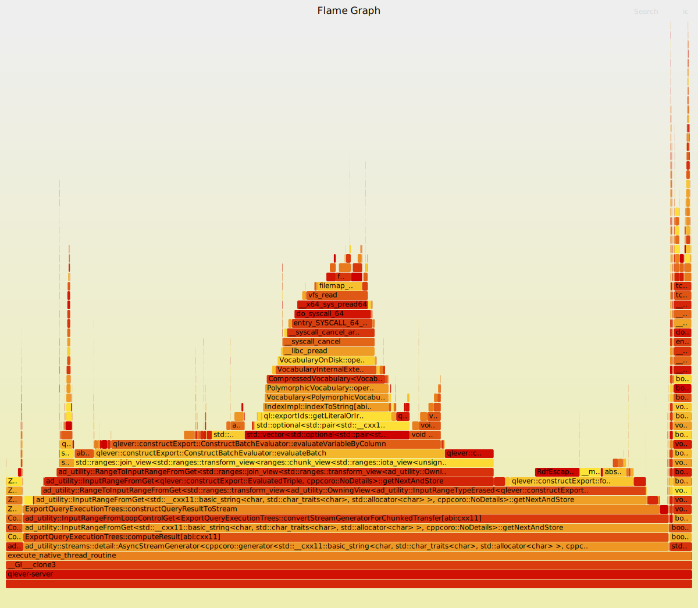

The SPARQL CONSTRUCT query form allows clients to extract and transform RDF data into a new graph.
In QLever, the original CONSTRUCT export pipeline was up to 2x slower than an equivalent SELECT export on the same data.
This post describes the analysis of the original implementation, 
the design and implementation of an improved implementation, 
an empirical evaluation of the speedup achieved, 
and a profiling-based analysis of the remaining overhead that motivates concrete directions for future work.

<!--more-->
# Table of Contents
- [Introduction](#introduction)
  - [RDF](#RDF)
  - [SPARQL](#SPARQL)
  - [CONSTRUCT queries](#Construct)
  - [QLever](#QLever)
- [Problem Statement](#problem_statement)
- [Approach](#approach)
- [Previous Work](#Previous_Work)
- [Implementation](#implementation)
- [Evaluation](#evaluation)
- [Discussion](#discussion)

# Introduction
In the following we will introduce the concepts which are necessary for understanding the context of the improvements
to the CONSTRUCT export pipeline.

## The RDF data model
The RDF data model is based on the idea of making statements about resources (in particular web resources) 
in expressions of the form *subject-predicate-object*, known as *triples*.
The *subject* denotes the resource, the *predicate* denotes traits or aspects of the resource, 
and expresses a relationship between the *subject* and the *object*.[^2]
RDF is a directed graph composed of triple statements.
An RDF graph statement is represented by:
(1) a node for the subject,
(2) a directed edge from subject to object, representing a predicate, and
(3) a node for the object.

Below is an example of a collection of RDF triples from [^1].
```ntriples
<Bob> <is a> <person>.
<Bob> <is a friend of> <Alice>.
<Bob> <is born on> <the 4th of July 1990>. 
<Bob> <is interested in> <the Mona Lisa>.
<the Mona Lisa> <was created by> <Leonardo da Vinci>.
<the video 'La Joconde à Washington'> <is about> <the Mona Lisa>
<Alice> <is interested in> <the Mona Lisa>.
<Alice> <is interested in> <the video 'La Joconde à Washington'>.
```
*Listing 1*

A set of RDF triples is also called a *knowledge graph*, or *knowledge base*.

There are three types of RDF data that occur in triples: IRIs, literals and blank nodes [^1].

**IRI**. An IRI (International Resource Identifier) is an identifier for a resource such as a person, document, 
or abstract concept. 
URLs, which serve as web addresses, are one form of IRI.
Not all IRIs imply a location or how to access a resource, some solely serve as identifiers. 
The same IRI can be reused across different RDF graphs to refer to the same resource. 
For example, `http://dbpedia.org/resource/Leonardo_da_Vinci` is used in DBpedia 
(a large RDF knowledge base derived from Wikipedia) 
as the identifier for Leonardo da Vinci. 

**Literal**.
A literal is a basic value such as a string, number, or date.
Unlike IRIs, literals do not identify resources but directly represent a value.
For example, `"the 4th of July 1990"` is a string literal representing a date.
Literals may only appear in the object position of a triple.

**Blank node**.
A blank node is a placeholder for a resource that has no IRI.
In contrast to IRIs, a blank node's identity is local to the document it appears in. 
The same blank node label in two different RDF files refers to two distinct resources.
Blank nodes are used when statements need to be made about a resource without assigning it a globally reusable identifier.

For example, to express that the Mona Lisa has a cypress tree in its background without naming that specific tree:
  ```ntriples
  <Mona Lisa> <has-background-feature> _:tree .
  _:tree <is-a> <cypress tree> .
  ```
  Here, _:tree is a blank node referring to some unnamed tree.

## RDF serialization formats
A number of serialization formats exist for writing down RDF graphs:
N-triples, Turtle, TriG, N-Quads, JSON-LD, RDFa, and RDF/XML.
Different serializations of the same RDF graph are logically equivalent.

Below we state the triples of the example knowledge base *Listing 1* in N-triples format, 
which is the simplest of the serialization formats. 

```
<http://example.org/bob#me> <http://www.w3.org/1999/02/22-rdf-syntax-ns#type> <http://xmlns.com/foaf/0.1/Person> .
<http://example.org/bob#me> <http://xmlns.com/foaf/0.1/knows> <http://example.org/alice#me> .
<http://example.org/bob#me> <http://schema.org/birthDate> "1990-07-04"^^<http://www.w3.org/2001/XMLSchema#date> .
<http://example.org/bob#me> <http://xmlns.com/foaf/0.1/topic_interest> <http://www.wikidata.org/entity/Q12418> .
<http://www.wikidata.org/entity/Q12418> <http://purl.org/dc/terms/title> "Mona Lisa" .
<http://www.wikidata.org/entity/Q12418> <http://purl.org/dc/terms/creator> <http://dbpedia.org/resource/Leonardo_da_Vinci> .
<http://data.europeana.eu/item/04802/243FA8618938F4117025F17A8B813C5F9AA4D619> <http://purl.org/dc/terms/subject> <http://www.wikidata.org/entity/Q12418> .
```

What follows is a short description of the N-triples syntax, using the listing above as an example. \
The datatype of a literal is appended via `^^`. 
A datatype specifies how the literal value should be interpreted. 
For example, whether "1990-07-04" is a date or just a string. 
Common datatypes are defined by XML Schema (a standard that defines a set of primitive datatypes), 
such as `xsd:date`, `xsd:integer`, `xsd:string`.
For plain string literals the datatype can be omitted: 
`"Mona Lisa"` is shorthand for `"Mona Lisa"^^xsd:string`. 
String literals can optionally carry a language tag, which identifies the natural language the string is written in. 
Language tags are written with an `@` suffix, e.g. `"La Joconde"@fr` for French, or `"Mona Lisa"@en` for English.

## SPARQL 
SPARQL is an RDF query language, that is, a query language for retrieving and manipulating data stored in RDF format.\
The most common query form is SELECT, which returns results as a table of variable bindings.\
The WHERE clause contains a set of triple patterns called a *basic graph pattern*.\
Triple patterns are like RDF triples except that subject, predicate, 
or object may be a variable (a string starting with `?`) 
or a constant (a fixed IRI or literal).

For example, 
the following query finds everyone (`?person`) 
who is interested in something (`?thing`) that was created by someone (`?creator`):


```sparql
SELECT ?person ?thing ?creator WHERE {
?person <is interested in> ?thing .
?thing <was created by> ?creator .
}
```

Against our example knowledge base (Listing 1), this returns:
| ?person | ?thing | ?creator |
---------|--------|----------|
| Bob | the Mona Lisa | Leonardo da Vinci |
| Alice | the Mona Lisa | Leonardo da Vinci |


The query engine (the software component that computes the result of a SPARQL query against an RDF knowledge base) 
finds all combinations of RDF terms that can be subsituted for the variables 
such that every triple pattern in the WHERE clause holds simultaneously against the data.\
Alice's interest in in the video produces no row because `<was created by>` triple exists for the video 
(only combinations of RDF terms where all triple patterns match appear in the result).

## CONSTRUCT queries 
A CONSTRUCT query produces a new RDF graph rather than a table of variable bindings. 
The CONSTRUCT clause clause specifies a *graph template*: 
a set of triple patterns that may contain variables and constants. \
For each result row produced by the WHERE clause, 
the engine substitutes the variable values into the template and adds the resulting triples to the output graph. 
The final output is the union of all such triples across all result rows.\

Consider the following CONSTRUCT query applied to our knowledge base from *Listing 1*:
```
  CONSTRUCT { 
    ?person <has-interest> ?thing .
  }
  WHERE {
    ?person <is interested in> ?thing .
  }
```
This query produces the following RDF graph:
```
<Bob> <has-interest> <the Mona Lisa> .
<Alice> <has-interest> <the Mona Lisa> .
<Alice> <has-interest> <the video 'La Joconde à Washington'> .
```
Unlike the SELECT query from the previous section, the result is not a table but a new set of RDF triples that can be 
stored, exported, or queried further. \
CONSTRUCT queries are particularly useful when the goal is not to inspect data in a table 
but to export or transform it as RDF. 
For example, to extract a subgraph from a large knowledge base for use in another system, 
or to produce a self-contained RDF file for exchange or archival.

## QLever
"QLever is a graph database implementing the RDF and SPARQL standards.
QLever can efficiently load and query very large datasets,
even with hundreds of billions of triples,
on a single commodity PC or server."[^4]
It is a open source project  written in the programming language C++ developed
by the Chair of Algorithms and  Data Structures at the University of Freiburg [^5]

### Vocabulary
Conceptually, the **vocabulary** is a list of all distinct IRIs and literals that appear in the dataset.
Each term is assigned a unique integer ID, with IDs assigned so that sorting by ID gives the natural order for each
type of term: IRIs lexicographically, integers numerically, dates chronologically, and so on.

All triples in the index, and all intermediate query results, are represented using these integer IDs rather than
strings, which keeps memory usage low and makes comparisons fast.

Each ID is technically a tagged 64-bit integer: 
4 bits encode the *type* of the value, and 60 bits encode the value itself. 
For IRIs and string literals, the value bits are an index into the vocabulary array (the
ID is a pointer to the term's string).
For numeric types, dates, and a few others, the value bits encode the data directly, with no vocabulary lookup needed.
The vocabulary therefore does not cover all IDs, it is the part of the ID space that maps to stored strings.

The actual vocabulary implementation is more complex than this conceptual picture (it is split into an in-memory
part and an on-disk part, with configurable rules for which terms go where), but the essential idea is a
bidirectional mapping between IDs and RDF term strings.

A small in-memory **local vocabulary** supplements the on-disk vocabulary during query execution: it holds terms
produced at query time (e.g. by `BIND` expressions) that have no pre-assigned ID.

### Index and index permutations
Before QLever can answer queries, the dataset must be built into an **index**
(a set of on-disk data structures optimized for fast triple lookup).
Each triple `(subject, predicate, object)` is stored as three integer IDs, one per term.
To support arbitrary triple access patterns efficiently, QLever stores the triples in six **permutations**:
all six orderings of the three positions (SPO, SOP, PSO, POS, OSP, OPS).
Each permutation is a sorted list of all triples in that order.
A triple pattern that fixes the predicate and subject, for example, 
is answered by reading the contiguous block of matching rows from the PSO permutation.
The actual implementation is more complex, but this is beyond the scope of this post.

## How QLever processes a query
To understand where the CONSTRUCT export fits in, 
it helps to see the big picture of what QLever does when it receives a query.

```
┌──────────────────────────────────────────────┐
│                    Client                    │
└──────────────────────┬───────────────────────┘
                       │ HTTP request
                       │ (query string, requrested output format)
                       ▼
┌──────────────────────────────────────────────┐
│           (1) Parse HTTP request             │
└──────────────────────┬───────────────────────┘
                       │
                       ▼
┌──────────────────────────────────────────────┐
│        (2) Parse SPARQL query string         │
│              -> ParsedQuery                  │
└──────────────────────┬───────────────────────┘
                       │
                       ▼
┌──────────────────────────────────────────────┐
│          (3) Plan and optimize query         │
│          -> QueryExecutionTree               │
└──────────────────────┬───────────────────────┘
                       │
                       ▼
┌──────────────────────────────────────────────┐
│          (4) Evaluate query                  │
│   execute QueryExecutionTree -> IdTable      │
└──────────────────────┬───────────────────────┘
                       │
                       ▼
┌──────────────────────────────────────────────┐
│          (5) Serialize result                │
│   decode integer IDs -> RDF terms            │
│   [CONSTRUCT: instantiate graph template]    │
│   serialize to requested output format       │
└──────────────────────┬───────────────────────┘
                       │ HTTP response
                       │ (serialized bytes)
                       ▼
┌──────────────────────────────────────────────┐
│                    Client                    │
└──────────────────────────────────────────────┘
Figure 2: The QLever query processing pipeline.
```

**1. Receiving and Parsing the HTTP request.**
The client sends an HTTP GET or POST to QLevers HTTP server.
QLever extracts the query string, the requested output format, and other parameters.

**2. Parsing the SPARQL query.**
The query string is passed to `SparqlParser::parseQuery()`,
which produces a `ParsedQuery`, which is a structured internal representation of the query.

**3. Query planning and optimization**
A `QueryPlanner` transforms the `ParsedQuery` into a `QueryExecutionTree`.
The `QueryExecutionTree` is a tree of concrete operations (index scans, joins, filters, etc.) 
that will be executed to evaluate the query on the given knowledge base.

**4. Query evaluation.**
The `QueryExecutionTree` is executed against the index, producing an `IdTable`.
The `IdTable` is a table of IDs, with one column per query variable and one row per query solution.

**5. Result serialization.**
`ExportQueryExecutionTrees::computeResult()` transforms the `IdTable` into the requested output format.
The integer IDs are decoded back into readable RDF terms (IRIs, Literals).
For CONSTRUCT queries, the decoded terms are used to instantiate the graph template, producing the output triples.
The result is then serialized and streamed back to the client as the HTTP response.

# Motivation: The CONSTRUCT Export is Slow
The goal of this project is to improve the performance of the CONSTRUCT query export in QLever.
Before optimizing, we first establish that a meaningful performance gap actually exists.

To isolate the cost of the CONSTRUCT export pipeline, we compare it against an equivalent SELECT query on the same data.
Both queries run the same WHERE clause and therefore perform the same query evaluation work.
The only difference is the export step.
Any gap in export time is therefore attributable to the CONSTRUCT export pipeline itself.

## Benchmarking Setup
**Query.** We use the following query, which retrieves X triples from the dataset:
```sparql
SELECT ?s ?p ?o WHERE { ?s ?p ?o } LIMIT X
```

For the CONSTRUCT variant, the construct template mirrors the SELECT query:
```sparql
CONSTRUCT { ?s ?p ?o } WHERE { ?s ?p ?o } LIMIT X
```

We vary the number of result rows using `LIMIT` (10,000 / 100,000 / 1,000,000) in order to see whether a potential
performance gap scales with the number of rows.

**Output format.** We benchmark across multiple common export formats to get a representative picture.
TSV, CSV, and `qleverJson` are supported by both query forms and are used for the SELECT vs. CONSTRUCT comparison.
We additionally report `Turtle` times for CONSTRUCT queries in isolation, as `Turtle` is the most common serialization
format for RDF graphs.

**Methodology.** We use QLever's internal query time, which covers the full request handling but excludes network
transfer. We run the query once before measuring to ensure the index is loaded into the OS page cache, then run the same
query five times and report median of the 5  measurements.

**Machine.** All measurements were taken at git `commit af00534d` from the master branch of the qlever repo [^5] on a
machine with the following specifications:
- CPU: AMD Ryzen 5 4600G
- RAM: 30.7 GiB
- Storage: Lexar NM620 1 TB NVMe SSD
- OS: Fedora 42, Kernel 6.8.13, x86\_64

The binary was compiled in Release mode using GCC with the LLD linker:
`cmake -DCMAKE_BUILD_TYPE=Release -DCMAKE_C_COMPILER=gcc -DCMAKE_CXX_COMPILER=g++ -DCMAKE_LINKER=/usr/bin/lld ..`

## Results

| Output format | LIMIT     | SELECT (ms)    | CONSTRUCT (ms)     | Ratio |
|---------------|-----------|----------------|------------------- |-------|
| TSV           | 10k       | 29             | 46                 | 1.59x |
| TSV           | 100k      | 191            | 363                | 1.90x |
| TSV           | 1M        | 1575           | 3479               | 1.98x |
| CSV           | 10k       | 29             | 47                 | 1.62x |
| CSV           | 100k      | 191            | 362                | 1.90x |
| CSV           | 1M        | 1738           | 3486               | 2.01x |
| qleverJson    | 10k       | 39             | 52                 | 1.33x |
| qleverJson    | 100k      | 272            | 422                | 1.55x |
| qleverJson    | 1M        | 2580           | 4084               | 1.58x |
| Turtle        | 10k       | not supported  | 47                 | None  |
| Turtle        | 100k      | not supported  | 354                | None  |
| Turtle        | 1M        | not supported  | 3401               | None  |

The `SELECT (ms)` and `CONSTRUCT (ms)` columns report the median wall-clock time in milliseconds over the five measured
runs. The `Ratio` column is the CONSTRUCT time divided by the SELECT time.

**Observation**: 
The CONSTRUCT export is consistently slower than the equivalent SELECT export across all formats and row counts. 
For TSV and CSV the CONSTRUCT export takes approximately 2x as long at 1 million rows. 
The ratio grows slightly with the number of rows (from ~1.6x at 10k rows to ~2x at 1M rows), 
indicating that the overhead of the CONSTRUCT export pipeline scales roughly linearly with the number or result rows.

In the next section we examine the original implementation of the CONSTRUCT Export pipeline to understand how we can
improve it.

# Original Implementation

## How the original implementation worked

The core of the CONSTRUCT export is a single function: `constructQueryResultToTriples`. \
Its structure is a straightforward nested loop: \
for each row in the result table 
(the table which is the result from computing the WHERE clause of the CONSTRUCT query) 
iterate over the triple patterns in the CONSTRUCT template and evaluate each triple. \
Evaluating a triple means resolving each of its three positions (subject, predicate, object) to a concrete string. \
If all three resolve successfully, the triple is emitted.

Let's make this concrete via an example, suppose the query is:
```sparql
CONSTRUCT { ?person <has-interest> ?thing }
WHERE     { ?person <is interested in> ?thing }
```

Let us walk through the execution of this CONSTRUCT query on the example knowledge base from earlier (Listing 1). \
The QLever engine executes the WHERE clause and produces the following `IdTable` as result:

| row | `?person` (col 0) | `?thing` (col 1) |
|-----|-------------------|------------------|
| 0   | `VocabId(42)`     | `VocabId(17)`    |
| 1   | `VocabId(99)`     | `VocabId(17)`    |

Each cell of the table holds a `ValueId` 
(this is the code construct that corresponds to the ID an RDF term is mapped to). \
For IRIs and literals stored in the main vocabulary, this is a `VocabIndex`, 
(which is an integer that serves as an index into the on-disk vocabulary).
We write `VocabId(id)` here to show that the `ValueId` is a `VocabIndex`.

The CONSTRUCT template `{ ?person <has-interest> ?thing }` is represented internally as a list of `GraphTerm` triples. \
Each position in a triple is one of: \
a `Variable`, an `Iri`, a `Literal`, or a `BlankNode`.

How a `GraphTerm` is evaluated depends on its type:
- `Iri` or `Literal`: the string representation is stored directly in the object and is returned immediately,
without any vocabulary lookup.
- `Variable`: based on it's column index in the `IdTable`, the `ValueId` for the current row of the result (`IdTable`) 
is retrieved from the `IdTable`, and then resolved to a string via a vocabulary lookup.
- `BlankNode`: the blank node identifier is constructed from the blank node's label and the current result row number, 
producing a  unique string such as `_:g42_b0`. No vocabulary lookup is needed. 

**Processing row 0:** \
The template triple `?person <has-interest> ?thing` is evaluated term by term. \
The subject `?person` is a `Variable`,
so the implementation reads column 0 of the current result table row, obtaining `VocabId(42)`, and resolves it via a
vocabulary lookup to `"<Bob>"`. \
The predicate `<has-interest>` is an `Iri`, so its string is returned directly from the object. \
The object `?thing` is again a `Variable`; column 1 yields `VocabId(17)`,
which resolves to `"<the Mona Lisa>"`.

The function emits a \
`StringTriple("<Bob>", "<has-interest>", "<the Mona Lisa>")`.

**Processing row 1:** \
The same template triple is evaluated again from scratch. \
The subject `?person` resolves via column 0 to `VocabId(99)`, which a vocabulary lookup turns into `"<Alice>"`. \
The predicate `<has-interest>` is returned directly from the `Iri` object as before. \
The object `?thing` again yields `VocabId(17)` from column 1, the same `ValueId` as in row 0,
which is looked up independently, again producing `"<the Mona Lisa>"`.

The function emits a \
`StringTriple("<Alice>", "<has-interest>", "<the Mona Lisa>")`.

**Serialization.** \
Once `constructQueryResultToTriples` has yielded a `StringTriple`, a format-specific serializer
produces a stream of string objects according to the output serialization format specified for the query. \
The output format is determined once per request from the HTTP `Accept` header. \

# Analysis of Improvement potential for the original Implementation 
The walkthrough above reveals three inefficiencies in the original implementation.

**1. Constants are re-evaluated on every row.** \
Every triple pattern in the CONSTRUCT template is evaluated from scratch for every result row, including constant
positions, i.e. `Iri` and `Literal` terms whose string representation never changes across rows. 
We note that evaluating a constant is cheap (it just reads a field already in memory).

**2. The same `ValueId` is often resolved multiple times.** \
Result tables frequently contain the same `ValueId` in many rows.
In the original implementation, each occurrence triggers an independent vocabulary lookup.
The walkthrough made this visible: `VocabId(17)` appeared in both row 0 and row 1, but was looked up twice.\
A cache that maps recently seen `ValueId`s to their resolved strings would eliminate redundant lookups for repeated values.

**3. Vocabulary lookups are issued one at a time** \
Resolving a `VocabIndex` requires reading from the on-disk vocabulary, which involves decompression and string
construction (depending on how the vocabulary is actually stored on disk, we do not always need decompression here). \
The original implementation issues these lookups individually: \
one lookup per variable position per row. \
Processing rows in batches could allow to detect duplicate `ValueId`s within one batch 
before issuing any lookups at all. \
This way we could also exploit more sequential memory access patterns in the vocabulary.

# Improved Implementation (Contribution)
The CONSTRUCT query export pipeline is implemented as four sequential phases, each with a single responsibility. The
diagram below gives an overview. The sections that follow describe each phase in detail.


### Phase 1 — Template preprocessing (ConstructTemplatePreprocessor)

`ConstructTemplatePreprocessor::preprocess` transforms the raw `GraphTerm` triples from the CONSTRUCT clause into a
`PreprocessedConstructTemplate`. A `GraphTerm` can be a `Literal`, a `BlankNode`, an `Iri`, or a `Variable`. Each
term is converted into one of three typed variants, resolving whatever can be determined once rather than per row:

- `PrecomputedConstant`: for `Iri` and `Literal` terms: the string is resolved immediately and stored as a
`shared_ptr<const EvaluatedTermData>`.
- `PrecomputedVariable`: for `Variable` terms: the variable is resolved to its column index in the `IdTable`.
- `PrecomputedBlankNode`: for `BlankNode` terms: the prefix (`_:g` for generated blank nodes, `_:u` for user-defined)
and suffix (`_` + label) are precomputed. 
When iterating over the rows of the result table, only the row number needs to be inserted between them to produce
a valid blank node.

A CONSTRUCT template may contain multiple triple patterns, and the same variable may appear in more than one of them.
To avoid redundant work, the preprocessing phase builds `uniqueVariableColumns_`: a deduplicated list of `IdTable`
column indices that appear as variables anywhere in the template triples. We will see in Phases 2 and 3 how the
improved pipeline makes use of `uniqueVariableColumns_`.

Phase 1 runs once per query, before any rows of the result table are processed.

---
### Phase 2 — Variable resolution (ConstructBatchEvaluator / evaluateBatch)
**Motivation.** After Phase 1, what remains is resolving `ValueId`s for variable positions. 
Remember that resolving those terms requires vocabulary lookups and are expensive since the vocabulary is 
(for the most part) stored on disk. 
Two properties can be exploited to do this efficiently.

First, note that the `IdTable` is stored in column-major order: each column is a contiguous array in memory. 
If we fetch all `Id` values for a variable `A` before moving to variable `B`, 
we follow this layout and get sequential memory access. 
The original per-row approach, evaluating all three template positions for row 0, then row 1
and so on, would jump across columns on every step (except when there is only one variable present in the CONSTRUCT
template).

Second, the `ValueId` values for a single variable column tend to be drawn from a similar region of the `Vocabulary`.
For example, all values in a predicate column are predicate Iris, which are clustered together on disk. Sorting those
`ValueId`s and resolving them in bulk therefore turns scattered disk reads into sequential ones.

Phase 2 exploits both properties by processing one variable column at a time across a batch of rows, and sorting the
`ValueId`s within each column before lookup.

`evaluateBatch` receives `uniqueVariableColumns_` from phase 1 and a `BatchEvaluationContext` describing a contiguous
slice of the `IdTable`. Because the same `ValueId` often recurs across many rows (e.g., a predicate column may repeat
the same IRI thousands of times), `evaluateBatch` also consults an LRU cache that maps `ValueId`s to their already-
resolved strings, avoiding redundant vocabulary lookups within and across batches.

For each variable column, `evaluateVariableByColumn` proceeds in two sub-steps.

1. **Sort and cache check**. The `Id` values for that column across all rows in the batch are collected and sorted. For
   each sorted `ValueId`, the LRU cache is checked first. Cache hits are written directly to the result; misses are
collected into a separate list.
2. **Batch resolution of misses**. The sorted list of cache-miss `ValueId`s  is passed to `idsToStringAndType`, which
   resolves them in bulk. The results are inserted into the cache and scattered back to the per-row positions in the
  output.

The output is a `BatchEvaluationResult`: a map from column index to a vector of `optional<EvaluatedTerm>`, with one
entry per row in the batch. A `nullopt` entry means the variable was unbound for that row.

The LRU cache is owned by `TableWithRangeEvaluator` and passed into `evaluateBatch`, so it persists across batches
within the same `TableWithRange`, allowing cache hits even when the same `ValueId` recurs across batch boundaries.

---
### Phase 3 — Template instantiation (ConstructTripleInstantiator / instantiateBatch)

**Motivation**. At this point all vocabulary work is done. Phase 3 is a pure assembly step: combine the precomputed
template structure from phase 1 with the resolved variable values from phase 2.

`instantiateBatch` iterates over every `(row, template triple)` pair.
For each term position, according to the term variant:
- `PrecomputedConstant`: the precomputed `EvaluatedTerm` shared pointer is copied into the output. This is a
reference-count increment, not a string copy.
- `PrecomputedVariable`: the resolved value is looked up in the `BatchEvaluationResult` by column index and row. If the
  value is `nullopt` the entire triple is dropped.
-`PrecomputedBlankNode`: the blank node string is constructed from the precomputed prefix, the current absolute row
index of the current row, and the precomputed suffix.

The output is a `vector<EvaluatedTriple>`.

---
### Phase 4 — Formatting (FormattedTripleAdapter / StringTripleAdapter in ConstructTripleGenerator)

**Motivation**. Phases 1-3 produce `EvaluatedTriple` objects, which contain the resolved term data without any
output-format-specific serialization applied. Phase 4 now serializes the `EvaluatedTriple` objects according to the
specified serialization format.

Two adapter classes inside `ConstructTripleGenerator.cpp` wrap a `TableWithRangeEvaluator` and pull `EvaluatedTriple`
objects from it one at a time:
- `FormattedTripleAdapter`: serializes each `EvaluatedTriple` into a `std::string`, applying the escaping and separators
  appropriate for the `MediaType` selected from the HTTP Accept header. It handles the Turtle, N-triples, TSV, and CSV
formats.
- `StringTripleAdapter`: formats each term into a string and returns a `StringTriple` (three separate strings), which is
  what the QLever JSON serialier consumes.
---
### Orchestration

`ConstructTripleGenerator` is the entry point for the whole pipeline. It runs phase 1 in its constructor. 
For each `TableWithRange` chunk of the result table, 
it creates a `TableWithRangeEvaluator` (which drives phases 2 and 3) and
wraps it either in a `FormattedTripleAdapter` or a `StringTripleAdapter` (phase 4), 
depending on the requested output
format. 
The per-chunk ranges are joined into a flat lazy output stream and passed directly to the HTTP response writer.

# Evaluation of original implementation

We evaluate the improved CONSTRUCT export pipeline against the original implementation on the DBLP dataset.

## Methodology
We use the same machine and build configuration as in the Problem Statement. 
For each experiment we run the query once as warmup to ensure the index is loaded into the OS page cache, 
then run the query five times and report the median wall-clock time for the query as reported by the qlever engine without the network transfer
overhead. 
Each measurement uses a fresh server instance to avoid interference from QLever's internal query cache.
We report times in milliseconds; ratios are new implementation time divided by old implementation time (lower is better).

Measurements taken on `construct-pipeline-refactor` branch at `git commit  0480d959`
(https://github.com/marvin7122/qlever/commit/0480d959a02b04d69b017364423ce1670ca833d4).

The build was configured using the following CMake settings:
```
cmake -B build \
-DCMAKE_BUILD_TYPE=Release \
-DCMAKE_C_COMPILER=gcc \
-DCMAKE_CXX_COMPILER=g++ \
-DCMAKE_LINKER=/usr/bin/lld
```

## Evaluation

We use the same measurement setup like in the Problem Statement. 
**Select** and **CONSTRUCT old** are the median times for the two query forms under the original implementation 
(commit `af00534d`); **CONSTRUCT new** is the median time under the refactored pipeline (commit `0480d959`). 
**Old ratio** and **New ratio** are CONSTRUCT divided by SELECT for the respective implementation. 
**Speedup** is old CONSTRUCT divided by new CONSTRUCT.


| Format     | Limit | SELECT (ms) | CONSTRUCT old (ms) | CONSTRUCT new (ms) | Old ratio | New ratio | Speedup |
|------------|-------|-------------|--------------------|--------------------|-----------|-----------|---------|
| TSV        | 10k   | 30          | 48                 | 26                 | 1.60x     | 0.87x     | 1.85x   |
| TSV        | 100k  | 196         | 373                | 147                | 1.90x     | 0.75x     | 2.54x   |
| TSV        | 1M    | 1768        | 3505               | 1271               | 1.98x     | 0.72x     | 2.76x   |
| TSV        | 10M   | 10747       | 22849              | 6241               | 2.13x     | 0.58x     | 3.66x   |
| CSV        | 10k   | 30          | 48                 | 26                 | 1.60x     | 0.87x     | 1.85x   |
| CSV        | 100k  | 192         | 381                | 146                | 1.98x     | 0.76x     | 2.61x   |
| CSV        | 1M    | 1758        | 3626               | 1283               | 2.06x     | 0.73x     | 2.83x   |
| CSV        | 10M   | 10737       | 22975              | 6190               | 2.14x     | 0.58x     | 3.71x   |
| qleverJson | 10k   | 39          | 54                 | 31                 | 1.38x     | 0.79x     | 1.74x   |
| qleverJson | 100k  | 289         | 434                | 197                | 1.50x     | 0.68x     | 2.20x   |
| qleverJson | 1M    | 2631        | 4102               | 1759               | 1.56x     | 0.67x     | 2.33x   |
| qleverJson | 10M   | 18895       | 28215              | 10430              | 1.49x     | 0.55x     | 2.71x   |
| Turtle     | 10k   | n/a         | 47                 | 25                 | n/a       | n/a       | 1.88x   |
| Turtle     | 100k  | n/a         | 359                | 139                | n/a       | n/a       | 2.58x   |
| Turtle     | 1M    | n/a         | 3426               | 1241               | n/a       | n/a       | 2.76x   |
| Turtle     | 10M   | n/a         | 22194              | 5690               | n/a       | n/a       | 3.90x   |

**Observation.** 
The new implementation is consistently faster than the original across all formats and row counts, 
with speedups ranging from 1.74x at 10k rows to 3.90x at 10M rows. 
The speedup grows with result set size, indicating that the optimizations scale well. 

# Discussion and Future Work

## Profiling the remaining overhead
The new implementation achieves a speedup over the original implementation for TSV, CSV, and Turtle at 10 million rows.
To understand where the remaining time goes and to motivate concrete directions for future work, we profile the
CONSTRUCT export pipeline and compare it against an equivalent SELECT export.

**Choice of queries.**
We profile `CONSTRUCT {?s ?p ?o} WHERE { ?s ?p ?o } LIMIT 10000000` and its SELECT equivalent
`SELECT ?s ?p ?o WHERE { ?s ?p ?o } LIMIT 10000000` side by side. 
Both queries evaluate the same WHERE clause;
any difference in their profiles is  therefore attributable to the CONSTRUCT export pipeline itself. 
he SPO query is the most informative subject for profiling because every result row contains three variable positions, 
each of which must be resolved via a vocabulary lookup. 
It maximises the load on the vocabulary access path and represents the worst case for the pipeline we want to understand. 
We use the 10 million limit, in order to be able to gather more data in the profiling. 
Both queries are exported in TSV format. TSV is supported by both query forms and has minimal per-row serialization overhead. 
Using the same format for both queries also ensures that any difference between the two profiles is attributable to improvements the CONSTRUCT pipeline itself rather than to format differences.

**Tool.** We use `perf record`, a statistical sampling profiler that interrupts the process at a fixed frequency and
records the current call stack at each sample. 
After enough samples, the aggregate reveals which functions account for the largest share of CPU time. 
We visualize the output as a flamegraph: 
each bar represents a function, its width proportional to the fraction of samples in which it appeared on the call stack. 
Wide bars near the top of the call stack are the hotspots (bars not near the top of the call stacks are from functions that delegate to callees).

**Build Configuration.** 
We compile the `qlever-server` binary with `RelWithDebInfo` rather than `Release`. 
Both use the same optimization level (TODO: verify), but `RelWithDebInfo` retains debug symbols, 
which allows `perf` to resolve function addresses to human-readable names and to correctly attribute time to inlined call sites. 
We additionally pass `-fno-omit-frame-pointer`, which restores the frame pointer register. 
This flag restores the frame pointer at negligible runtime cost, giving `perf` reliable call stack reconstruction.

The cmake command used is:
`cmake -B build-profile-20260325 \
-DCMAKE_BUILD_TYPE=RelWithDebInfo \
-DCMAKE_C_COMPILER=gcc \
-DCMAKE_CXX_COMPILER=g++ \
-DCMAKE_LINKER=/usr/bin/lld \
-DCMAKE_CXX_FLAGS="-fno-omit-frame-pointer" \
-DCMAKE_C_FLAGS="-fno-omit-frame-pointer"`

**Cache state.** We run each query under two cache conditions.

In the *warm-cache* run, we execute the query once before before profiling to load the relevant index blocks into the OS
page cache (the kernels in-memory buffer of recently accessed file data) (TODO: what is an index block). This isolates
the CPU-bound cost of the export pipeline: vocabulary lookups that miss the LRU cache are served from RAM rather than
disk, so the flamegraph reflects decompression and string construction work rather than I/O wait.

In the *cold-cache* run, we evict the vocabulary file from the OS page cache immediately before recording using
`vmtouch -e`. vmtouch is a utility that inspects and manipulates the page cache residency of specific files.
The `-e` flag evicts all pages of the given file (the files in that subdirectory) from the page cache,
forcing subsequent reads to go to disk. We verify the eviction worked by running `vmtouch` before and after
(it reports the number of pages currently resident  in the page cache for that file/directory, which should fall to zero after eviction.) 
Every vocabulary lookup that misses the LRU cache in the CONSTRUCT export pipeline now requires a real disk read.
Because `perf record` is an on-CPU profiler, it collects no samples while the process is blocked waiting for disk (the
process is simply not scheduled during that time.) A sparse flamegraph from the cold-cache run would therefore be
informative in the following way: it would indicate that the dominant cost is not CPU work but I/O wait.

**Recording procedure.** For each run we start a fresh server instance to avoid QLever's internal query result cache 
returning a pre-computed answer. We attach `perf record` to the running server process, issue the measured query,
and stop recording once the response is complete. We automate the full recording procedure in a single script that
starts a fresh server instance for each run, handles cache warming or dropping as appropriate, attaches `perf record`,
issues the query, and generates the flamegraph.
(The script is available in the repository at `artefacts/2026-03-25_profiling-construct-export.sh`.)
The exact perf record script used is:
`perf record --call-graph fp --freq=997 -p "$SERVER_PID" -o "$perf_out" &`, where `SERVER_PID` is the process id of the
`qlever-server` binary process that is running and `perf_out` is the file to which the profiling data should be written.
We give perf one second to attach before issuing the query, then send SIGINT to stop it gracefully
after the query completes, ensuring all buffered samples are flushed to disk before perf exits:

```bash
  perf record --call-graph fp --freq=997 -p "$SERVER_PID" -o "$perf_out" &
  PERF_PID=$!
  sleep 1 # give perf time to attach to all threads
  echo "Recording... sending query."
  curl -sf "http://localhost:$SERVER_PORT/?query=$query&action=sparql_query" >/dev/null
  kill -SIGINT "$PERF_PID"
  wait "$PERF_PID" 2>/dev/null || true

```

The sampling frequency is set to 997 Hz rather than a round number to avoid accidentally synchronising with periodic 
system events that fire at round-number intervals, which would bias the sample distribution.

## Results and Observations
**wall-clock times**.
The construct warm query completed in 6,299 ms and the construct cold query in 6,583 ms,
which is a difference of only 284 ms.
The select warm query completed in 10,851 ms and the select cold query 11,083 ms,
a difference of only 232 ms.
Two things stand out.
First, CONSTRUCT is substantially faster than SELECT at 10 million rows (roughly 6.3 seconds vs 10.9 seconds),
the opposite relationship we observed at 1 million rows in the evaluation of the original implementation section.
Second, the warm/cold difference is less than 5% for both queries
Evicting the entire index directory from OS page cache changes total query time by only a few hundred milliseconds.
This might be evidence that the LRU cache is absorbing a vast majority vocabulary lookups before they reach disk,
even on a cold first run. 

**Flame graph analysis**.
The construct-warm flamegraph shows `FormattedTripleAdapter::get` (the top level entry point of the export pipeline)
accounting for 81% of total CPU time.
Within that, two cost centers stand out.
First, `VocabularyOnDisk::operator[]` accounts for 13.77% of total CPU time,
representing the cost of resolving `ValueId`s to strings via disk reads.
Second, `formatTriple` accounts for 18.09% of total CPU time.
The functions that dominate `formatTriple`s call stack are all string manipulation operations
(`RdfEscaping::escapeForTsv`, `absl::strings_internal::CatPieces`, and `__memmove_avx_unaligned`).
This suggests that the serialization step is allocating and copying intermediate strings unnecessarily:
each term is likely escaped into a freshly allocated string,
and the three terms concatenated into yet another string,
rather than being written directly and incrementally into the output buffer.
Eliminating these allocations is a promising optimization direction.



**Why CONSTRUCT outperformed SELECT at 10M rows.**
To understand the reversal, we first analyze the structure of the result set. 
To understand the structure of the result set, we run two queries against the DBLP index.
The first counts the number of distinct subjects, predicates, and objects within the first 10 million rows of 
Running a subquery to count distinct values within the first 10 million rows of the SPO-query.

```sparql
SELECT (COUNT(DISTINCT ?s) AS ?ds) (COUNT(DISTINCT ?p) AS ?dp) (COUNT(DISTINCT ?o) AS ?do) WHERE {
  SELECT ?s ?p ?o WHERE { ?s ?p ?o } LIMIT 10000000
}
```

result table:
| ?ds        | ?dp | ?do |
|------------|-----|-----|
|10,000,000  |3    | 3   |


This reveals 10 million distinct subjects, 3 distinct predicates, and 3 distinct objects.

The second query shows how the 10 million rows are distributed across the 9 possible (predicate, object) combinations.

```sparql
SELECT ?p ?o (COUNT(?s) AS ?count) WHERE {
  SELECT ?s ?p ?o WHERE { ?s ?p ?o } LIMIT 10000000
} GROUP BY ?p ?o ORDER BY ?p ?o
```

result table:
| ?p              | ?o  | ?count    |
|-----------------|-----|-----------|
|numberOfCreators |0    | 64,366    |
|numberOfCreators |1    | 1,152,843 |
|numberOfCreators |2    | 441,263   |
|signatureOrdinal |1    | 8,338,784 |
|versionOrdinal   |0    | 920       |
|versionOrdinal   |1    | 1,824     |


The formula for the LRU `ValueId`-Cache size is 
`# of distinct variables in the construct template` x `2048`
entries for the binary that was used to create the measurement. 
Thus, for the profiled query, its size is `6,144`. 

The three distinct predicates and three distinct objects together occupy only six of those 6,144 slots 
and likely remain hits  for the entire query after the first batch. 
The remaining 6,138 slots are available for subject lookups, 
but with 10 million distinct subjects this likely provides a 0% 
hit rate for the subject column (all subject terms are different).

Despite the subject column seeing no cache hits, we warm/cold wall-clock difference remains only 284 ms.
To understand why, we inspect which index permutation QLever chose for this query 
QLever's `application/qlever-results+json` format includes a `runtimeInformation` field containing the query execution
plan. (TODO: define somewhere earlier what a query execution plan is).
We retrieve it with the following command against the server started as
`./qlever-server -i dblp -p 7001 --default-query-timeout 3600s`:

```
curl -X POST "http://localhost:7001/query" \
-H "Content-Type: application/sparql-query" \
-H "Accept: application/qlever-results+json" \
--data-binary "SELECT ?s ?p ?o WHERE { ?s ?p ?o } LIMIT 10000000" \
> /tmp/temp.txt
```

The relevant part of the response is:
```
"query_execution_tree": {
  "description": "LIMIT 10000000",
  "children": [
    {
      "description": "IndexScan OPS ?s ?p ?o",
      "column_names": ["?o", "?p", "?s"],
      "result_rows": 10000000
    }
  ]
}
```

The description field confirms that the query planner chose the OPS permutation 
and performed an IndexScan operation on it.
Within each (object, predicate) block, subject `ValueIds` therefore arrive in ascending order.
This may contribute to the small warm/cold difference by enabling more sequential access patterns in the
vocabulary file, but a precise explanation would require a more detailed analysis of the vocabulary file layout and 
the actual disk access pattern, which we leave as future work.

## Future Work.
1. **Real-world CONSTRUCT query evaluation.** \
The profiling results are specific to the SPO query, 
which has an unusual result set structure (10M distinct subjects, 3 distinct predicates, 3 distinct objects).
It is unclear how the LRU cache and sort-before-lookup optimization perform under more realistic CONSTRUCT queries.
An open question is also what "real-world CONSTRUCT queries" look like.

2. **`ValueId`-Cache parametrization.** \
The current cache size formula (`# unique variables x 2048`)
was chosen more or less  arbitrarily without proper analysis. \
A structured investigation of cache parametrization would need to address several open questions. \
2.1) What alternative cache parametrization strategies are possible? \
2.2) Along which dimensions can the cache be optimized (example dimensions could be hit rate, memory footprint, query
latency, ...)? \
2.3) Which of the dimensions from 2.2 matters most in practice? \
2.4) Given the most important dimension, how should the cache be parameterized to optimize for it?
miss rates, eviction counts, and memory footprint per query? Possibly also others?) \
2.5) How do we measure the chosen optimization target? \

3. **Investigate blocking I/O and implement batched disk reads.** \
The warm/cold wall-clock difference of only 284 ms suggests the LRU cache is effective for the SPO query, 
but this may not hold for queries that access a larger number of distinct `ValueIds` 
or on large indices like Wikidata (206 GB vocabulary vs TODO vocabulary size for dblp). \
A structured investigation would involve: \
3.1) Understand the vocabulary file layout and access patterns. Understand how `ValueId`s map to positions in the vocabulary file. \
3.2) Establish how to measure blocking I/O time. \
3.3) Define what "representative" queries and datasets mean in this context. \
3.4) Across those representative queries and datasets, quantify the blocking I/O overhead. \
3.5) If blocking I/O is significant, investigate strategies to mitigate it. \
For example replacing individual `pread` calls (system calls that read from disk) for batch misses with batched 
sequential reads, or prefetching vocabulary entries. Understanding how similar systems approach this is a prerequisite. \
3.6) Implement the most promising mitigation strategy. \
3.7) Measure the impact of the implementation across the same representative queries and datasets, comparing blocking
I/O time, wall-clock time, and cache miss rates before and after.

4. **Eliminate unnecessary work in the export pipeline.** \
As identified in the profiling section, `formatTriple` accounts for 18% of CPU time, with the call stack suggesting 
unnecessary intermediate string allocations during escaping and concatenation. \
4.1) In this specific instance, write escaped terms directly into a pre-allocated output buffer. \
4.2) More broadly, the export pipeline should be reviewed for other instances of avoidable work introduced by suboptimal
implementation choices (unnecessary copying, redundant computation, inefficient data structures).

5. **Correctness and testing of the CONSTRUCT export pipeline**. \
5.1) Establish what correct behavior means for the CONSTRUCT export pipeline specifically according to the 
SPARQL 1.1 and RDF standards. Formulate a set of requirements that capture this "correct" behavior. \
5.2) Develop a comprehensive test suite that verifies the pipeline's output against these requirements across a range 
of query templates, edge cases, and output formats. \
5.3) Use this test suite as a safety net for future optimizations, 
ensuring performance improvements do not introduce correctness regressions.

# References
[^1]: W3 Org. "RDF Primer" https://www.w3.org/TR/rdf11-primer/ Accessed 2026-04-01.
[^2]: Wikipedia. "RDF" TODO:wikipedia-link-here Accessed 2026-03-29.
[^3]: W3 Org. "SPARQL 1.1 Query Language" https://www.w3.org/TR/sparql11-query/#introduction Accessed 2026-03-18.
[^4]: "QLever Documentation" https://docs.qlever.dev/ Accessed 2026-03-18.
[^5]: "qlever" https://github.com/ad-freiburg/qlever Accessed 2026-03-18.
[^6]: W3 Org. "RDF Primer, Example 6" https://www.w3.org/TR/rdf11-primer/#section-vocabulary Accessed 2026-04-01.
