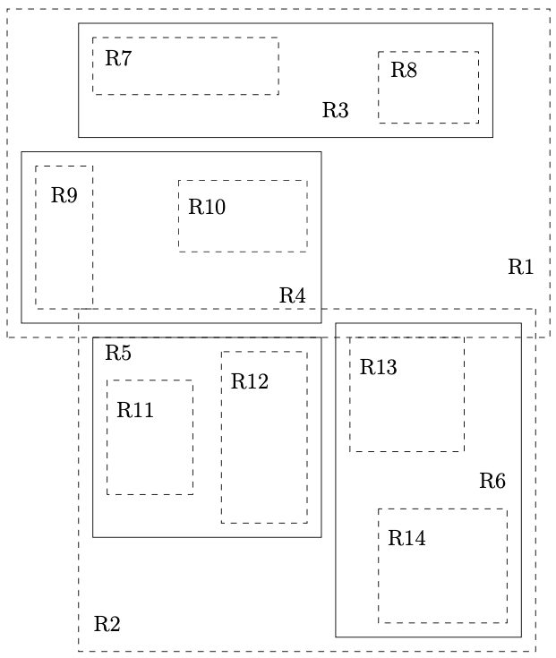
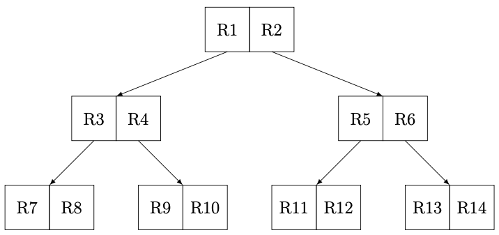
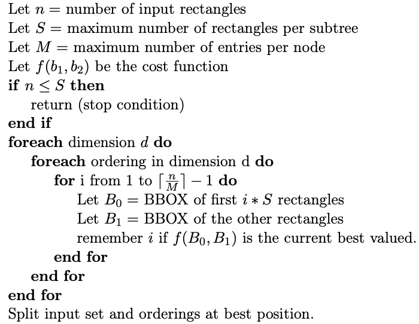

Information retrieval on large datasets is fundamental to our modern world. For the purpose of finding certain datapoints within a query region on geo spatial datasets, one can use numerous different algorithms and data structures. Probably the best pick for this application is the R-tree. While the basic concept of the R-tree is widely known, there is a lack of efficient algorithms that can build a R-tree on very large datasets without exceeding the capabilities of the working memory. In this project I designed and implemented a R-tree that can work on datasets of every size, while maintaining fast querying times and memory efficient building.

## Table of Contents
- [Introduction](#introduction)
- [Motivation](#motivation)
- [Goal](#goal)
- [Approach](#approach)
- [Implementation](#implementation)
- [How to use the R-tree](#how-to-use-the-r-tree)
    - [Use inside of Qlever](#use-inside-of-qlever)
- [Conclusion](#conclusion)

## Introduction
The R-tree[^1] is a data structure that allows to perform fast multidimensional querying over spatial data. In my case I am interseted in only two dimensional data, since the R-tree is used to search for geo locations entries. 
Each node of the R-tree divides all elements into \\(m\\) evenly packed child nodes. Each child node contains the information of its elements and the smallest rectangle containing all of its elements (called boundingbox). This structure allows you to check for intersection between your query and the child nodes and only expand the nodes where an intersection happened. The search therefore eliminates a big chunk of the search space in each step.
#### Visualization of the boxes inside a R-tree

#### Visualization of the tree structure of a R-tree

Assuming that \\(R7-R14\\) are the boundingboxes of the actual entries, you can see that the tree evenly divides those boxes into bigger boundingboxes, which enables a search in logarithmic time.

## Motivation
The deciding factor of the querying speed of a R-tree is the quality of the inner structure. A poorly built R-tree with many overlaps between inner nodes may have to expand unnecessary many child nodes in order to find the query results. The building algorithm is therefore the most important part of the R-tree.\
While it is possible to build a R-tree one element at the time, you will achieve the optimal structure only if the whole dataset is known in advance. The principle of taking all entries into account while building the R-tree is called **Bulk Loading**
There are many packing algorithms and implementations that work well for bulk loading, however most of them aren't applicable for very large datasets, since they don't allow to build the tree without having the whole dataset loaded in working memory.\
\
One of the most widely known implementation for C++ is the [Boost Geometry R-tree](https://beta.boost.org/doc/libs/1_82_0/libs/geometry/doc/html/geometry/reference/spatial_indexes/boost__geometry__index__rtree.html). I originally wanted to use the library to include spatial querying into the Qlever SPARQL engine, if it wasn't for three big problems:
1. The implementation has to load all entries into RAM while building the R-tree
2. There is no native way to serialize a finished R-tree
3. The whole R-tree needs to stay loaded in RAM to perform any queries.
<!-- end of the list -->
Therefore, this implementation is unusable for any kind of application that requires large datasets.

## Goal
I wanted to develop an R-tree implementation that can handle arbitrarily large datasets, while maintaining fast building and querying times. It should therefore:
- Work within a certain given memory limit
- Serialize the R-tree during the building process
- Deserialize the needed nodes on demand to achieve instant querying without having to load in the data structure first

## Approach
The problem of building a R-tree can be reduced to finding a split in the data space, that minimizes some cost function. The split should result in two disjoint subsets of the original data, which can then recursively be split until you have \\(m\\) (branching factor) evenly packed subsets that will be the child nodes. A very good algorithm for this is the Top-down Greedy Splitting Algorithm (TGS)[^2]:

For the cost function you can simply take the overlap of the two boundingboxes of the splits. A minimal overlap results in less paths that need to be visited during a search through the tree.\
\
As shown in the algorithm, there is no need to actually have all elements loaded into working memory. The split decisions can be done by just knowing every \\(S\\)th element of each ordering per dimension. The problem can therefore be reduced to performing splits on multiple sorted lists on disk, while maintaining each resulting split sorted.\
One way is to initially sort the elements by their center points once in x-direction and once in y-direction and label each element with its position in both sortings. Because you know at which index in which dimension the split should happen, you can divide the two sorted lists into four new lists, by iterating through every element and appending it in the correct split-list according to its labeled index.\
Since iterating through a list of elements can easily be made straight from disk (external data), this algorithm can perform a split with very little memory consumption.

## Implementation
I implemented the R-tree in C++ with the aim of integrating it into the Qlever SPARQL engine. Because of that, every R-tree entry is based on some geo location data in [WKT Format](https://en.wikipedia.org/wiki/Well-known_text_representation_of_geometry). I then extract the boundingbox of the wkt literal, which - together with an id - becomes a R-tree entry. This happens in the function `ConvertWordToRtreeEntry(...)`. These raw entries are then saved on disk in a binary file in the format `minX,minY,maxX,maxY,id`.\
The actual `BuildTree(...)` method receives the location of the file and first sorts the elements a total of three times:
1. Sort the elements by the x value of their center points -> Numerate them in order (`orderX`)
2. Sort the elements by the y value of their center points -> Numerate them in order (`orderY`)
3. Take the element list with `orderX` and `orderY`, copy it and sort it again by x
<!---->
The result are two lists (on disk), one sorted by x and one sorted by y. Each element of both lists knows its location in both sortings. The format in the binary files is `minX,minY,maxX,maxY,id,orderX,orderY`.\
In order to perform the sorting with respect to a given memory limit, I used the [stxxl library](https://stxxl.org/tags/1.4.1/).\
\
During the numeration process, every \\(S\\)th element and its following element get saved as possible split locations alongside the boundingbox of this possible split.\
The root node gets constructed with the possible split locations and put on a stack `layerStack`. While this `layerStack`is not empty, the first element gets extracted and \\(m\\) child nodes get constructed with the TGS algorithm `TGSRecursive(...)`. If the child nodes are not leaf nodes, they get pushed on the stack. This behaviour leads to a depth-first-build, which is crucial for memory efficiency. When a leaf node is found: it and recursively all its finished parent nodes get written to disk and their locations get added to a lookup file.\
\
`TGSRecursive(...)` splits the lists in one point with `SplitAtBest(...)` and calls itself for both splits. The terminal condition is \\(n \leq S\\) for which there won't be performed a split anymore. At the end, all \\(m\\) splits get collected in an array of lists containing the pointer to the actual data (on disk) and the locations of all possible next splits.\
\
`SplitAtBest(...)` receives the location of the best split by `GetBestSplit(...)`, which finds the one possible split that minimizes the cost function. This information gets then feeded into `PerformSplit(...)`.\
`PerformSplit(...)` iterates through both sortings of the elements and assigns each element to its split according to their `orderX` or `orderY` value. For example, if the best split was found between element 100 and 101 in the x-sorting, every element with `orderX` \\(\leq 100\\) is part of the left split and every element with `orderX` \\(>100\\) is part of the right split. While performing the split, every \\(S\\)th and its following element get saved together with the current boundingbox. This again builds a list with all possible split locations, which can be used to perform the next split one tree level deeper.

## How to use the R-tree
Since the intended use of the R-tree was its integration in Qlever, it is not completely optimized as a stand-alone program. However, you can import the source code from my [GitHub](https://github.com/noahnock/Bachelorprojekt) into your own project and use my R-tree implementation. Note that the [stxxl library](https://stxxl.org/tags/1.4.1/) is only used in the Qlever integration, which means that the initial sorting of the elements does not happen externally for this version of the code. Additionally, the conversion of a WKT literal to the data format which can be read by the R-tree (`ConvertWordToRtreeEntry(...)`) runs slower than the version that is integrated into Qlever.\
Besides these two restrictions, the code works the same.\
This example code constructs the right file from wkt literals (which are saved in the `infile`), builds a R-tree and searches through it.
```cpp
#include "Rtree/Rtree.h"
#include "Rtree/RtreeFileReader.h"


// Constructing the boundingboxes from wkt
std::ifstream infile("path/to/wkt_file");
std::ofstream convertOfs = std::ofstream("destination/path/of/converted_data/<name>.<file_suffix>.tmp", std::ios::binary);

long long id = 1;  // example for some kind of unique id, which can identify each boundingbox
for (std::string line; std::getline(infile, line);)
{
    std::optional<BasicGeometry::BoundingBox> boundingBox = BasicGeometry::ConvertWordToRtreeEntry(line);
    if (boundingBox) {
        FileReaderWithoutIndex::SaveEntry(boundingBox.value(), id, convertOfs);
    }
    id++;
}


// Build the R-tree
Rtree rtree = Rtree(1000000);  // Constructs a R-tree with 1000000 bits of working memory available
rtree.BuildTree("path/to/converted_data/<name>", ".<file_suffix>", 16, "destination/path/of/rtree");  // the 16 is the branching factor m

// Search through the R-tree
std::vector<RTreeValue> results = rtree.SearchTree(BasicGeometry::CreateBoundingBox(1, 2, 3, 4), "path/to/rtree");
```

Note that this search variant searches directly from disk without preloading any tree nodes. If you wish to precompute some of the tree levels to compensate for slow disk accesses, you can do so:
```cpp
#include "Rtree/Rtree.h"


Rtree rtree = Rtree(1000000);  // the working memory also applies to preloading the search
rtree.SetupForSearch("path/to/rtree");
std::vector<RTreeValue> results = rtree.SearchTree(BasicGeometry::CreateBoundingBox(1, 2, 3, 4));
```

### Use inside of Qlever
As of march 2025, the integration of my R-tree into Qlever can be seen in my [GitHub Fork of Qlever](https://github.com/noahnock/qlever/tree/rtree).\
The R-tree is used to perform a spatial filter over the results of an SPARQL expression:
```sparql
SELECT * WHERE {
    FILTER(<http://qlever.cs.uni-freiburg.de/boundingBoxContains>(?x, "1, 2, 3, 4"));
}
```
Note that `"1, 2, 3, 4"` is an example for a boundingbox with `minX=1, minY=2, maxX=3, maxY=4`

## Conclusion
The main goal of this project was to develop a R-tree building algorithm that can efficiently create a well structured R-tree with the use of external data (data from disk). For this I took the idea of the existing TGS algorithm and improved its runtime and applicability to work with arbitrarily large datasets. It is possible to assign a memory limit to the building algorithm and therefore restrict on how much of the data gets loaded into RAM to accerlate the process. After intitially building the R-tree, one can just search in it with a query boundingbox without having to load in anything. Alternatively, one can load in parts of the R-tree until a given memory limit is reached in order skip some disk accesses and therefore accerlate the searching time.\
This makes my implementation a flexible and useful choice for indexing large spatial datasets.


[^1]: A. Guttman, “R-trees: A dynamic index structure for spatial searching,” SIGMOD Rec., vol. 14, p. 47–57, jun 1984.
[^2]: Y. J. García R, M. A. López, and S. T. Leutenegger, “A greedy algorithm for bulk loading r-trees,” pp. 163–164, 1998.
