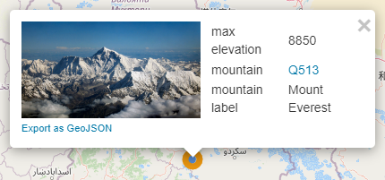
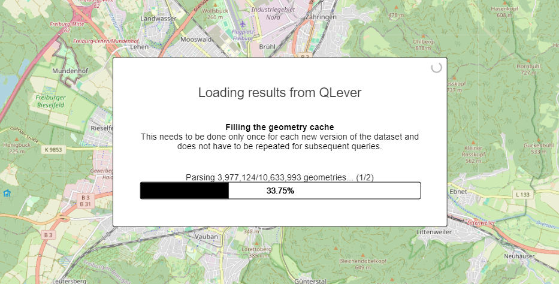
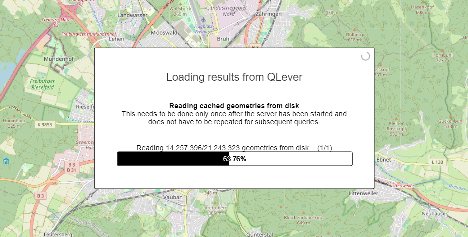
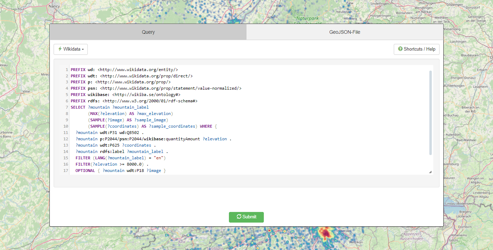
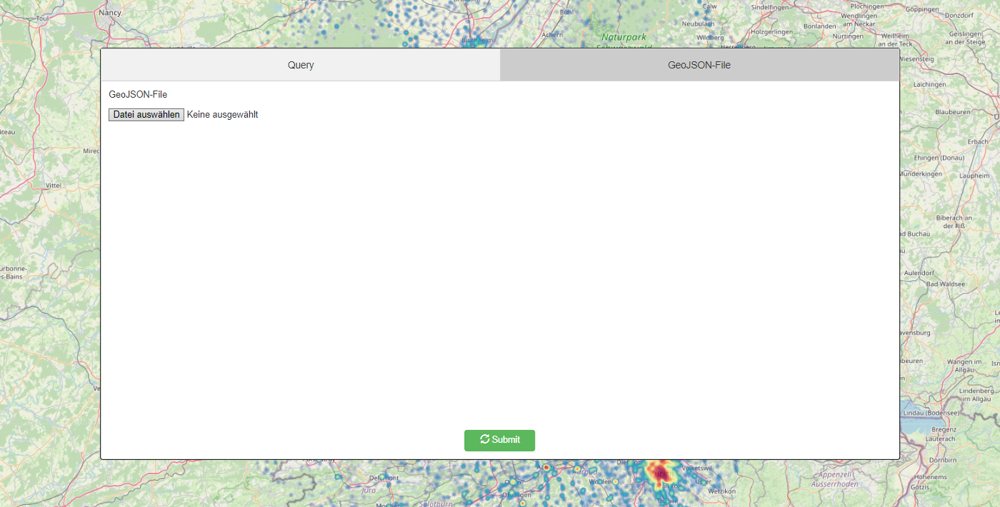
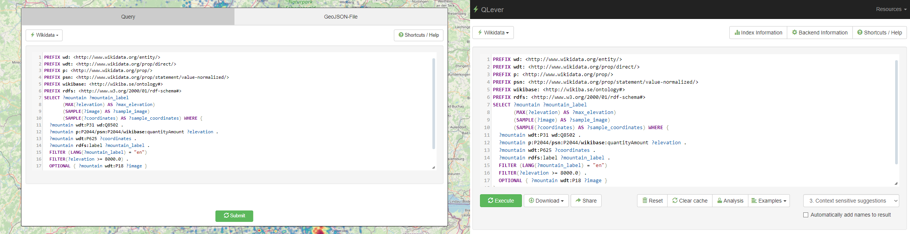

[Petrimaps](https://qlever.cs.uni-freiburg.de/mapui-petri/ "Petrimaps") is a powerful tool for visualizing geospatial data on a map. So far it has exclusively been using the results of [QLever](https://qlever.cs.uni-freiburg.de/ "QLever"), a tool for processing SPARQL queries. In this project we will see how we can add support for reading geospatial data from a GeoJson file, display a progress bar, and create a UI that reuses parts of the existing QLever UI for consistency. 
<!--more-->

# Content
1. <a href="#introduction-petrimaps">Introduction to petrimaps</a>
2. <a href="#progress-bar">Progress bar</a>
3. <a href="#submit-menu">Submit menu</a>
	
	3.1 <a href="#submit-menu-query">Query</a>
4. <a href="#geojson-support">GeoJson support</a>

	4.1 <a href="#geojson-support-structure">Structure</a>
	
	4.2 <a href="#geojson-support-implementation">Implementation</a>

5. <a href="#conclusion">Conclusion</a>

* * *

# <a id="introduction-petrimaps"></a>1. Introduction to petrimaps
Petrimaps is used to visualize geospatial data on a map. In fact, it is able to visualize quite a lot of data all at once. This data is primarily obtained by executing SPARQL queries using QLever and processing and caching the results. For that, there exists a so-called geometry cache which stores all relevant geometries. For example, such a query might return a bunch of data points representing all mountains higher than 8000 meters. The frontend only receives and displays an image generated by the backend to visualize the data of the current map view. Only if the user wants to know more about a particular data point, needed data is transmitted. In total, this approach minimizes the workload for the frontend and allows data in a geometry cache to be reused.

<p style="text-align: center;">Figure 1: Visualizing a data point.</p>

* * *

# <a id="progress-bar"></a>2. Progress bar
Filling a geometry cache can take time though, especially if the user executed a query which resulted in a lot of data. To reassure the user that progress is being made, we therefore want to display a plausible estimate of how much data we have already processed. To do this, we divide the overall progress from submitting a request to finally displaying an image into a number of stages, and combine their individual progress into an overall progress. These stages can be summarized as follows:
1. Filling the geometry cache or reading the cache from disk
2. Fetching geometries (Processing IDs of geometries)
3. Rendering the result<br>

While the backend knows the total amount of data and the amount of data that has already been processed, the frontend sends a POST request to retrieve this information at fixed intervals and uses it to display a simple progress bar. Additionally, the user can also see the current loading stage and a description of what is happening at that stage.

<p style="text-align: center;">Figure 2: Loading by query.</p>

As the first stage implies, the geometry cache data can also be written to a file and be reloaded instead of requesting the data again.

<p style="text-align: center;">Figure 3: Loading from disk.</p>

Once the frontend has received the image of the data to be displayed, it stops requesting the current progress.

* * *

# <a id="submit-menu"></a>3. Submit menu
Petrimaps was previously only intended to be used through QLever and not as a standalone tool. The user was expected to execute a SPARQL query through QLever and then click on a button that would refer to petrimaps, providing the requested query inside the URL. With GeoJson support it became clear that it also needed to provide a UI on its own, as it would be difficult and cumbersome to pass GeoJson content through the URL.<br>
The new submit menu solves this problem by allowing the user to choose between submitting a query and uploading a GeoJson file.

<p style="text-align: center;">Figure 4: Submit menu with the "Query" tab selected.</p>

<p style="text-align: center;">Figure 5: Submit menu with the "GeoJson file" tab selected.</p>

## <a id="submit-menu-query"></a>3.1 Submit menu: Query
For consistency it makes sense to provide the same UI as QLever does for submitting a query. However, this comes with a problem because there is no obvious way to simply include this UI in petrimaps. We could start to go through all the relevant files in the [QLever UI repository](https://github.com/ad-freiburg/qlever-ui "QLever UI repository"), copy everything we need and modify it to suit our needs, but this approach would bloat up our source files and most importantly also create a major maintenance problem if changes were made to the original QLever UI.<br>
Instead, we take advantage of the fact that we already have these source files available in this repository, and are able to include them in petrimaps using a third-party service called [JSDelivr](https://github.com/jsdelivr/jsdelivr "JSDelivr"), which allows us to retrieve the raw content of a file hosted on GitHub. Now we can just include all source files that contain needed definitions and code, but we can also simply not use them or override logic that we don't need. This approach has its limitations, especially because the QLever UI uses a different html source file that is generated using a template for each available backend, which makes it impossible for us to simply include everything for every backend because there exist no static versions of those source files. As a result, needed definitions currently only exist for the default backend.

The original QLever UI uses [CodeMirror](https://codemirror.net "CodeMirror") for the query editor, which transforms a plain html text area into a feature-rich text editor. If the original QLever UI were to change definitions that are used to identify elements needed for the petrimaps UI, things would break. For some changes, the UI would still be somewhat functional and perhaps only have visual problems, but especially if changes were made to the text editor, there is a good chance that the whole UI would become unusable. This would also happen if JSDelivr was not available.

<p style="text-align: center;">Figure 6: Comparison of the original QLever UI with the lighter version used in petrimaps.</p>

* * *

# <a id="geojson-support"></a>4. GeoJson support
By letting the user upload and export files containing geospatial data we make it more accessible to look at data several times and are able to use data that does not necessarily have to be the result of a SPARQL query. As a result, the workload for QLever may also be reduced.

## <a id="geojson-support-structure"></a>4.1 GeoJson support: Structure
GeoJson was specifically designed to contain geospatial data and has become a popular choice. As its name suggests, it is essentially just a Json file with a specific structure:

```
{
"type": "FeatureCollection",
"features": [{
	"type": "Feature",
	"geometry": {
		"type": "Point",
		"coordinates": [74.5899963379, 35.2391662598]
	},
	"properties": {
		"?max_elevation": "8850",
		"?mountain": "<http://www.wikidata.org/entity/Q513>",
		"?mountain_label": "\"Mount Everest\"@en",
		"?sample_coordinates": "\"Point(86.9250181 27.9882361)\"^^<http://www.opengis.net/ont/geosparql#wktLiteral>",
		"?sample_image": "<http://commons.wikimedia.org/wiki/Special:FilePath/Mount%20Everest%20as%20seen%20from%20Drukair2%20PLW%20edit.jpg>"
	}
}]
}
```
<p style="text-align: center;">Figure 7: A sample GeoJson file with only one feature being a point.</p>

You can find more examples on [Wikipedia](https://en.wikipedia.org/wiki/GeoJSON "Wikipedia GeoJson").

There are a number of types of geometry that are supported by GeoJson. As one would expect, we can represent points and lines but also more complex shapes like polygons.<br>
The properties provide additional information besides the geometry: In the case of mountains that are over 8000 meters we can for example retrieve their elevation, name and a sample image for each of them which we can then show to the user.<br>

## <a id="geojson-support-implementation"></a>4.2 GeoJson support: Implementation
After uploading a GeoJson file, the frontend uses the [`FileReader`](https://developer.mozilla.org/en-US/docs/Web/API/FileReader "FileReader") class to create a string containing the contents of the file. This string is then sent to the server, which creates an md5 hash of it. We use this md5 hash as a unique key pointing to a newly created or already existing geometry cache. The server then sends this md5 hash back to the frontend, which now uses it to ask for the loading progress of the geometry cache that is responsible for our GeoJson file. Otherwise, we would have to send the contents of the whole file each time.

<p style="text-align: center;">Figure 8: Requesting to load a GeoJson file.</p>

Inside the backend we primarily have to extend the existing geometry cache because it is responsible for encapsulating internal retrieval and caching of the obtained geometry. As it can only handle data obtained from QLever by executing a SPARQL query so far, but still has functionality that we need when handling GeoJson data, it makes sense to create a base class called `GeomCache` and classes `SPARQLCache` and `GeoJsonCache` that extend from it. The new `GeoJsonCache` now has to parse obtained data differently: As we can see in the sample GeoJson structure above we have to parse the geometry of each feature and store its properties.<br>
We use the [nlohmann/json](https://github.com/nlohmann/json) library to obtain a handy datastructure from the plain text that contains the contents of the GeoJson file. Using this datastructure, we can iterate over all features in order to obtain the geometry and properties of a feature. We transform the provided datastructure from nlohmann/json of a geometry of a certain type into an internally used datastructure representing geometry of that type and finally store the properties as is in a hashmap. By doing this, we assume that both key and value of a property are strings, because that is the expected format when the properties are displayed in the frontend.

* * *

# <a id="conclusion"></a>5. Conclusion
While Petrimaps still needs a lot of development and refinement to become a fully-fledged and stable tool, the addition of a progress bar, additional UI and GeoJson support has definitely improved its usability and flexibility and laid a good foundation for further progress.
