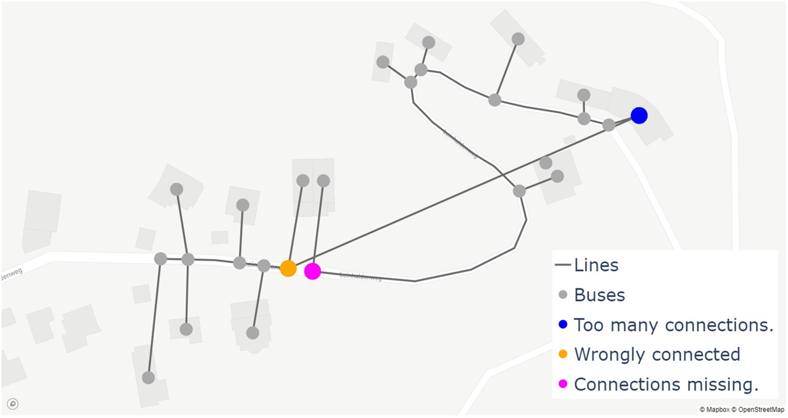
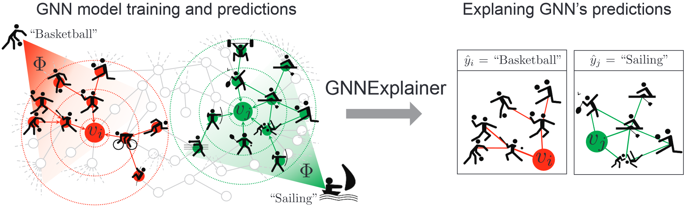
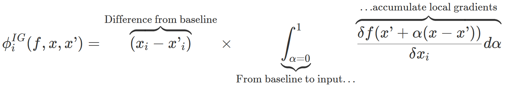
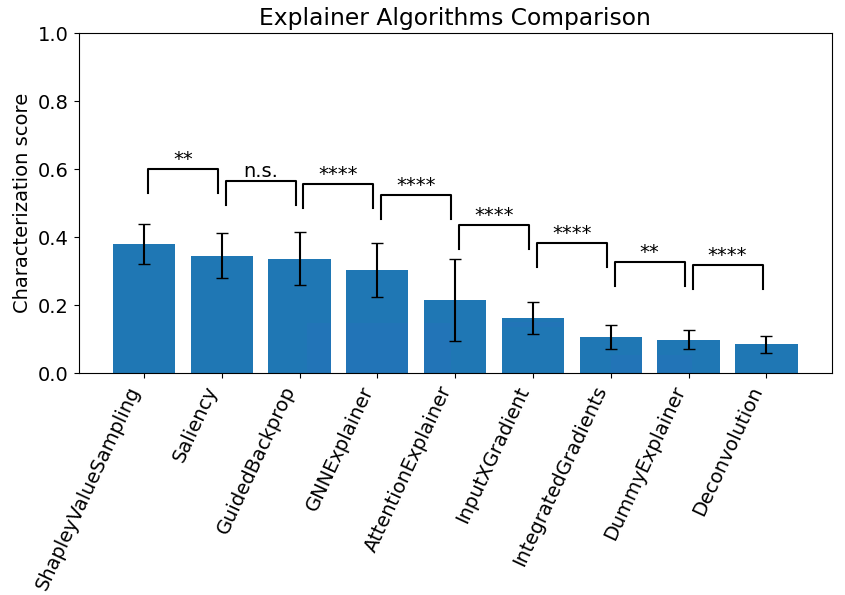
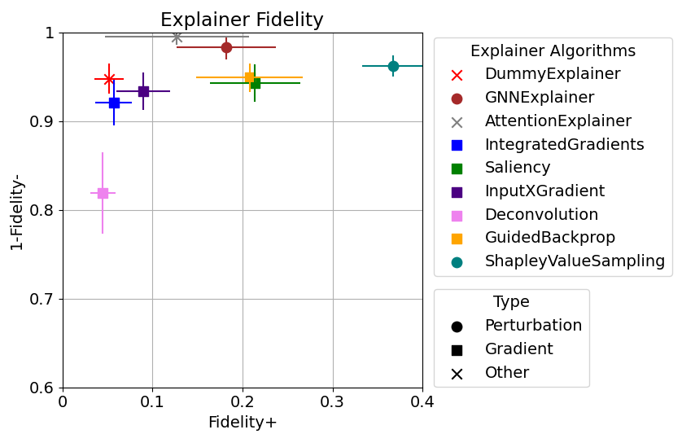
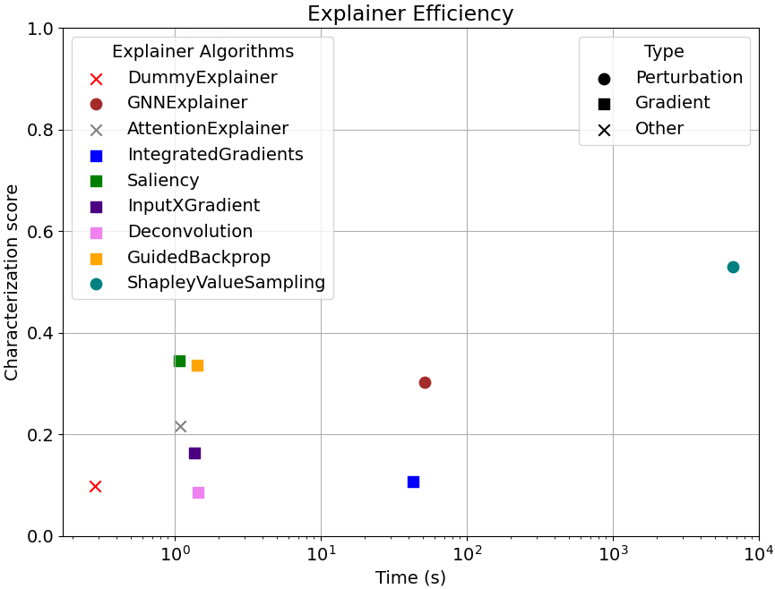
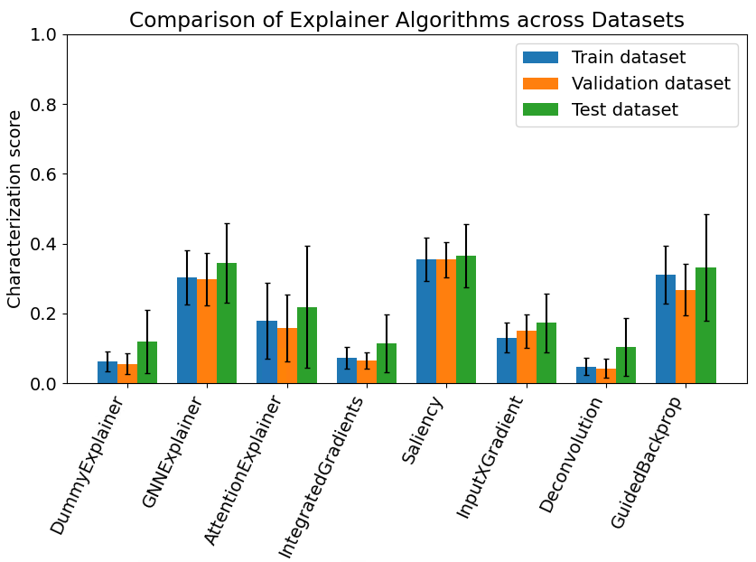
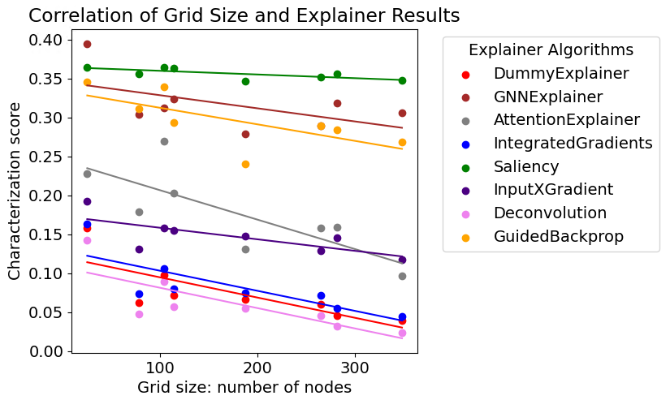
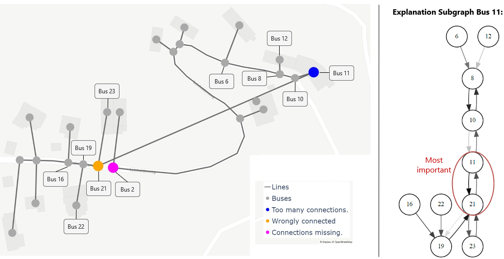
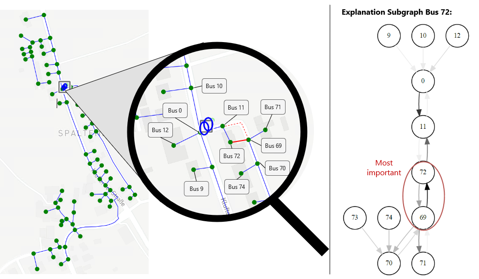

For a successful energy transition, we need accurate models of the electric grid. The Fraunhofer Institute for Solar Energy Systems ISE developed a Graph Neural Network (GNN) to identify and correct errors in grid models.
However, due to the complex model architecture the behavior of the GNN is hard to interpret.
Explainable AI can help network operators understand rather than blindly trust the GNN output.
In this blog post several explainer algorithms will be compared that enable understanding how the GNN reaches its conclusions.
<!--more-->

*This project is the outcome of a cooperation between Fraunhofer Institute for Solar Energy Systems ISE in Freiburg and the Algorithms & Data Structures Chair of the University of Freiburg.*

# Content
1. [Introduction](#introduction)
2. [Theoretical Foundations](#theoretical-foundations)
 &emsp; 2.1. [Distribution Grids and Topology Error Identification](#electricity-grids-and-topology-error-identification)
 &emsp; 2.2. [Graph Neural Networks](#graph-neural-networks)
 &emsp; 2.3. [Explainable AI](#explainable-ai)
3. [Methods](#methods)
 &emsp; 3.1. [Data](#data)
 &emsp; 3.2. [Model](#model)
 &emsp; 3.3. [Evaluation Metrics](#evaluation-metrics)
 &emsp; 3.4. [Explainer Algorithms](#explainer-algorithms)
4. [Results](#results)
 &emsp; 4.1. [Comparison of Explainer Algorithms](#comparison-of-explainer-algorithms)
 &emsp; 4.2. [Example Explanation](#example-explanation)
5. [Conclusion and Future Work](#conclusion-and-future-work)
6. [References](#references)
7. [Appendix](#appendix)

# Introduction
The increasing presence of distributed energy sources such as solar panels, wind turbines and new types of consumers such as heat pumps and electric vehicles has a massive impact on low-voltage distribution grids. For ensuring stability and enabling optimal operation and extension of the distribution grids, a precise knowledge of the grid's topology is necessary. However, distribution grid operators have often not yet fully digitized their grids. This means that the available digital models may be incomplete and changes in the grid must be fed in manually, which does not always happen immediately. Therefore, grid topologies could contain errors like wrongly connected lines. A Graph Neural Network (GNN) may help to identify misconnected lines in distribution grid models. At Fraunhofer ISE a GNN for topology error identification in electrical distribution grids was developed <a href="#nolde22"> [1] </a>.

GNNs are popular and expressive machine learning models. However, due to the non-linear representations they are often hard to interpret.
 Imagine you are a network operator and a GNN-based program tells you that a certain line in your grid model is connected incorrectly. The recommendation could be, for example, that this line in the model should not be connected to 3 Park Avenue but to 5 Canal Road. How do you react as a network operator? Do you follow this instruction blindly? Do you go to Park Avenue and check, although this could be time-consuming? How reliable and trustworthy is the output of the program? What are the chances that it has made a mistake? To answer these questions, it would be useful to be able to understand how the GNN came to its decision and which factors had a particular influence. Explainable AI (XAI) can help unlocking the black boxes of complex models like GNNs and gain a better understanding of these models and their predictions.

In recent years, there has been rapid developments in the area of explainability of GNNs and an emergence of explainer algorithms <a href="#longa"> [2] </a> <a href="#yuan22"> [3] </a>. The goal of this project was to find out whether XAI can be used to gain meaningful insights into the specific problem of GNN topology error identification. If so, which of these many explainer algorithms is best suited? Given a trained topology error identification GNN, we systematically evaluate and compare nine explainer algorithms across different grid topologies. The focus of this blog post lies on the comparison of explainer algorithms and not on the analysis of the individual explanations. The latter is subject of ongoing work.

The structure of this blog post is as follows: Chapter 2 introduces the theoretical foundations, namely the concepts of Topology Error Identification, Graph Neural Networks and Explainable AI. In chapter 3, we explain the methods used in the project. The utilized data, model, evaluation metrics as well as the explainer algorithms are presented. Chapter 4 discusses the results of the comparison of the explainer algorithms including a variance analysis. Finally, the work is concluded in chapter 5.

# Theoretical Foundations
This chapter explains the relevant theoretical background which will help understanding the following chapters. First, we introduce electricity distribution grids and the concept of topology error identification. The representation of electricity grids as graphs leads to the concept of graph neural networks (GNNs). The basics of GNNs as well as the graph learning task node classification will be introduced. Finally, we present the necessity and the idea behind the concept of Explainable AI. A particular focus lies on GNN Explainability.

## Distribution Grids and Topology Error Identification
Nowadays, the electric industry changes structurally, because of a rising number of distributed energy resources like photovoltaic and wind generators as well as energy storage devices and electric vehicles connected to the power grid. As a result, distribution grids no longer have only a passive role. Distribution grids are the last phase in the power delivery process, where electricity is transported from the transmission system to individual consumers like households. Distribution grids are crucial for securing the unpredictable energy supply from renewable sources and utilizing emerging storage technologies.

However, due to various reasons like frequent distribution grid topology changes, incomplete knowledge of new components and potentially outdated physical topology maps, it is hard to obtain the grids' accurate digital twin, the correct grid topology model. For instance, if a field engineer repairs a part of a grid, it is likely that he does not report the changes of the grid topology immediately. Moreover, costly sensors are often only placed at particular locations leading to limited sensor data. <a href="#weng"> [4] </a> <a href="#luan"> [5] </a> <a href="#deka"> [6] </a>

An example of an erroneous grid model with a wrongly connected line can be seen in the following figure:

In this figure electric distribution lines (**--**) and buses (&#9679;) are depicted. Lines are used for transmitting electricity from sources to loads. In the case of low-voltage distribution grids, sources are often transformers which transform an input voltage from the transmission grid to the lower output voltage. Other sources could be for example photovoltaic cells on houses. Loads consume energy, e.g. households or factories. Lines connect buses. In the figure, there are buses representing households and buses on the street where lines branch off to the house buses.
 The figure shows a faulty line from the bus marked in orange to the bus marked in blue, which should actually lead to the bus marked in pink. As a result, the blue bus has too many connections, the orange bus is wrongly connected and the pink bus has connections missing. Most topology model errors will be more subtle than the one shown here.

Erroneous grid models can have a significant negative impact on grid planning and operation. For example, they could lead to unsuitable optimization measures due to faulty load flow calculations of the electric power flow. Therefore, for grid operators methods for automatically identify model errors are important as they increase grid reliability. <a href="#nolde22"> [1] </a>

Electric grids with lines and buses can be naturally seen as graphs. The buses can be represented as graph nodes and the lines as graph edges. This natural graph representation suggests the optimization using Graph Neural Networks (GNNs). GNNs will be introduced in the next section.

## Graph Neural Networks
Since many real-world structures, like electric grids, can be represented in form of graphs and graphs have a great expressive power, GNNs are treated with growing interest in recent years <a href="#yuan22"> [3] </a> <a href="#zhou"> [7] </a>. Nowadays, GNNs are the de-facto standard for learning tasks based on graph data <a href="#yuan22"> [3] </a>.
 Graph data is a data structure that captures a collection of objects, referred to as nodes, and the relationships between them, modeled as edges. A graph is denoted as \\(G = (V,E)\\), where \\(V\\) is the node set and \\(E\\) the edge set. <a href="#zhou"> [7] </a>
 Classical machine learning models perform well for simple grid-like input data. For instance, images with fixed structure and size could be thought of as fixed-size grid graphs and text as line graphs. In contrast, graph data does not have a fixed form due to variable sizes and unordered nodes, where nodes can have varying numbers of neighbors <a href="#miro"> [8] </a> <a href="#stanford"> [9] </a>:

Aside from information about nodes and edges, graph connectivity is crucial for predictions on graphs. To consider graph connectivity, in GNNs so-called *message passing* is used. Message passing is the recursive neighborhood aggregation between representations of nodes in a graph. Typically, the initial representation of a node is its feature vector. Each node aggregates the representations of the neighboring nodes, resulting in the message, which is then used to calculate the nodes' new representation. Message passing consists of two steps <a href="#sanchez21"> [10] </a>:
1. **Aggregate** all the representations from the neighboring nodes using an aggregate function.
2. **Update** the node representations by passing the aggregated message through an update function, typically a neural network.

The part of the graph \\(G\\) used in aggregation is called *computation graph \\(G_C\\)* w.r.t. a specific node \\(v\\), and contains a subset of the node set \\(V\\).
After *k* message passing steps (*k* aggregation and update iterations), a node representation expresses the structural information within the *k*-hop neighborhood of this node. <a href="#brody"> [11] </a> <a href="#xu"> [12] </a>

### Node Classification
GNNs can be used for different types of graph learning tasks <a href="#sanchez21"> [10] </a>. We focus on node classification which aims to categorize nodes into classes. Formally, the goal is to predict for a node \\(v\\) its label \\(y_v\\).
Our considered model categorizes nodes into the classes "error" or "no error" depending on whether the grid topology is correct or incorrect at this node. The model will be explained in more detail later.

### Graph Attention Networks
Different GNN architectures have emerged in recent years <a href="#zhou"> [7] </a>. In classical GNNs like Graph Convolutional Networks, the node's representation update is usually calculated as the average of its neighbor's representations. However, there is no distinction between the individual contributions of different neighbors. In contrast, in Graph Attention Networks (GATs), nodes compute a weighted average of their neighbors by assigning trainable attention coefficients to them, instead of just averaging across them. More important neighbors are given more consideration. <a href="#brody"> [11] </a>

## Explainable AI
Nowadays, complex machine learning models achieve promising performance in various research areas. However, the increase of performance often goes along with a growth in model size and complexity <a href="#nauta"> [13] </a>. Problematic is that the models are usually developed without interpretability and hence referred to as "black-boxes" with non-transparent decision making.
The term "black-box" is related to the fact that the models are very hard to explain and often cannot be fully understood, not even by domain experts. Usually, deep neural networks have a complex architecture with a vast number of layers and parameters. Treated as black-boxes, the models cannot be completely trusted, reducing the willingness to use them. Besides accurate predictions, human-understandable explanations are important for a trustful deployment of deep neural networks. <a href="#yuan22"> [3] </a> <a href="#machlev"> [15] </a>

The concept of improving the explainability of machine learning models is referred in the literature as Explainable Artificial Intelligence (XAI). An impactful definition of the term "explanation" has been given by Arun Das and Paul Rad <a href="#das"> [14] </a>:
> "An explanation is additional meta information, generated by an external algorithm or by the machine learning model itself, to describe the feature importance or relevance of an input instance towards a particular output classification."

XAI aims to enhance the interpretability of machine learning models for developers, researchers, domain experts, and users, without compromising their performance and accuracy. Many explainer algorithms can be found in the literature <a href="#das"> [14] </a> <a href="#machlev"> [15] </a> <a href="#adadi"> [16] </a>. We will dive deeper into some of them in the section [Explainer Algorithms](#explainer-algorithms).

### GNN Explainability
Explainability of GNNs is important but challenging due to various reasons. As mentioned in a previous section ([Graph Neural Networks](#graph-neural-networks)) graph data not has a fixed form and tabular-like structure. Graph nodes have a varying number of neighboring nodes. Moreover, for the prediction of a GNN, nodes, edges and their interactions are important. Explainer algorithms are not necessarily able to capture these interactions. It is not sufficient to investigate the importance of individual words or pixels like for text or image data. In terms of GNNs, the structural information must be captured too. Graphs often represent complex data consisting of diverse node and edge features. That makes it challenging to generate human-interpretable explanations. <a href="#yuan22"> [3] </a>

The format of an explanation for a GNN model is normally an explanation subgraph of the computation graph. It highlights the graph nodes and edges contributing most to the prediction of the GNN. Usually, every edge of the explanation subgraph has an importance score assigned. Explanations could also include the feature importance. However, we focus on the explanation subgraphs. The feature importance is subject of ongoing work. <a href="#li"> [17] </a> <a href="#amara23"> [18] </a>
 The idea of such an explanation subgraph is visualized in the following figure <a href="#ying19"> [19] </a> showing a schematic example of a GNN for classifying sport activities based on a social interaction graph. A social interaction graph is a graph where the nodes represent people and the edges represent social connections between them.

Based on a trained GNN model and a prediction \\(\hat{y}_i\\) = "Basketball" for the person represented as node \\(v_i\\) (red in the figure), the explainer identified an explanation subgraph. The subgraph shown on the right highlights the most influential nodes for the prediction. In the case of \\(\hat{y}_i\\) = "Basketball" it can be seen that many friends, the neighboring nodes of \\(v_i\\), in a specific part of their social circle enjoy playing ball games. This is an explanation for the prediction "basketball". Similarly, the GNN predicts that "sailing" is the most likely activity for \\(v_j\\) (green in the figure) based on the fact that \\(v_j\\)'s friends love water and beach sports. <a href="#ying19"> [19] </a>

More formally, given a graph \\(G\\) with a node set \\(V\\), an edge set \\(E\\), and a trained GNN model \\(f\\), we can define the explanation task as follows: The goal of an explanation is to identify the most influential compact subgraph \\(G_{S}\\) for the model's prediction by generating an explanatory edge mask \\(M \in \mathbb{R}^{|E|}\\) representing the edge importances. To make the explanations more useful for humans, the edge mask \\(M\\) can be transformed to a sparse matrix by only keeping the highest values and setting all others to zero. An explainer algorithm can be represented as a function \\(h : G → G\\) , which yields an explanatory subgraph \\(h(G)\\) for each given input graph \\(G\\). <a href="#amara23"> [18] </a>

### XAI in the Power and Energy Sector
The application of XAI in the power and energy sector is still in its early stages, but researchers are increasingly utilizing XAI techniques. There has been a consistent increase in the number of publications since 2019 that describe XAI techniques for power system and energy applications. <a href="#machlev"> [15] </a>
However, there is not yet a comparable work for our specific application.

# Methods
In this chapter, we will introduce the methods used in the work. These include the utilized data and model, the evaluation metrics for comparing the explainer algorithms as well as the nine compared explainer algorithms.

## Data
We work with graphs representing electrical distribution grids. Graph edges represent lines transmitting electricity in a grid from sources to loads. Graph nodes represent buses. <a href="#gebhard"> [20] </a>
 The nodes and edges have features like power and voltage measurements. Using the existing synPro tool at Fraunhofer ISE, time series forecasts can be made based on realistic assumptions about consumption and generation. We created three scenarios for the grids, representing the years 2022, 2030 and 2040. A scenario consists of snapshots throughout an entire year, with a resolution of 15 minutes.
To further enhance the data, voltage state estimation was conducted by performing power flow calculations. Voltage state estimation aims to determine the optimal estimate for the system state. This estimation is based on the network model and the collected measurements from the grid.  When using a grid topology model with a misconnected line, the estimation of voltages in the affected area tends to result in higher errors compared to the actual measured voltages. Relevant input features were found in a hyperparameter study by predecessors <a href="#nolde22"> [1] </a>. The list of used features can be found in the [appendix](#appendix).

Our dataset consists of real grid topology data from grid operators as well as synthetic data. The synthetic data was augmented from the real data to ensure having enough data. For the augmentation OpenStreetMap (OSM) data was used to create electrical grid topologies for any cities. Most transmission lines align with city streets. Therefore, the augmented grid topologies may not exactly match the actual grids in those cities, but they capture important features and characteristics of real-world grids. It was ensured that graph properties, e.g. number of nodes and average node degree of real-world and synthetic grid topologies are similar.
 In total, every GNN model was trained on four grids, three synthetic and one real one. Furthermore, the GNN models were validated and tested on two grids each, one real and one synthetic. <a href="#nolde22"> [1] </a>

The original data consists of realistic grid topologies without topology errors. With an error generator grid topology errors were simulated and the data manipulated accordingly. This enabled training with labeled data using the original data as ground truth.

## Model
This section describes the GNN model on which the explainer algorithms were evaluated. The notes on training refer to the GNN model, not to explainer algorithms, which will be explained in a [later section](#explainer-algorithms). Since the explainer algorithms and not the model itself was the focus of this work, model architecture and training are only briefly discussed. More details can be found in previous work <a href="#nolde22"> [1] </a>.

We trained a binary node classification model which aims to classify the nodes into two classes: nodes with error and nodes without error. It is a supervised learning task since the model was trained with labeled data. The model was trained for 25.000 epochs on a NVIDIA Quadro RTX 8000 GPU with CUDA 11.0. The model with the best performance on the validation set was kept as final model. <a href="#nolde22"> [1] </a>

As model architecture GATv2 from Brody et al. <a href="#brody"> [11] </a> was chosen. It is a variant of the classical GAT architecture with the difference that it uses a dynamic form of attention by switching the order of internal operations. More details about the GATv2 architecture can be found in <a href="#brody"> [11] </a>.

The model and training hyperparameters were determined in a hyperparameter study as described in previous work <a href="#nolde22"> [1] </a>. The search space and the results of the hyperparameter study including the used optimizer, activation function and learning rate can be found in the [appendix](#hyperparameter-study).

## Evaluation Metrics
Evaluating explanations is more challenging than evaluating model prediction accuracy or computational complexity, because interpretability is not easily measurable. Moreover, it is not trivial to distinguish between errors stemming from the misbehavior of the model and those originating from the explainer's malfunction. There exist two common approaches for evaluating explanations:
1. Using ground-truth explanations for measuring the **accuracy**, also referred to as plausibility.
2. Using objective metrics for measuring the **fidelity** or faithfulness of explanations. 

The first approach has two disadvantages: First, it is dependent on the existence of ground-truth explanations which usually are not available. Secondly, it is less objective than the second approach since ground-truth explanations are subjective as they represent the human's view. Measuring the accuracy using ground-truth explanations evaluates the plausibility, not the correctness of explanations. Petsiuk et al. <a href="#petsiuk"> [21] </a> argue that it is preferable to exclude the human's view from the evaluation process for making it more fair and reflecting the model's understanding more accurately. Therefore, fidelity and faithfulness metrics are the most common evaluation metrics according to recent XAI literature <a href="#nauta"> [13] </a> <a href="#amara23"> [18] </a> <a href="#jacovi"> [22] </a>.

In our case no ground-truth explanations exist. Consequently, we focus on the second approach, using objective metrics for measuring the fidelity or faithfulness of explanations. These metrics will be further defined and discussed below. We evaluate the explanatory subgraphs on their contribution to the initial prediction.

According to Amara et al. <a href="#amara22"> [23] </a>, in terms of explanations, there are three users' needs: Explanations must be *sufficient*, *necessary* and *efficient*. For measuring if an explanation is sufficient, only the explanation subgraph is provided to the model and the prediction is compared to the original model prediction computed on the whole graph. This performance metric is called *fidelity-* and is computed as
$$ fid_- = 1 - \frac{1}{N} \sum_{i=1}^{N} \unicode{x1D7D9}(\hat{y}_i^{G_{S}} = \hat{y}_i) $$
where \\(N\\) denotes the number of graph nodes in the node set \\(V\\), \\(\hat{y}_i\\) denotes the original prediction of node \\(i\\) and \\(G_{S}\\) is the explanation subgraph. For all nodes \\(i\\) the prediction \\(\hat{y}_i^{G_{S}}\\) when only providing the explanation subgraph to the model is compared to the original prediction \\(\hat{y}_i\\). With the help of the indicator function denoted by \\(\unicode{x1D7D9}()\\) it is counted how often both predictions are the same.
The fidelity- metric is normalized. The closer it is to \\(0\\), the more sufficient an explanation is. <a href="#amara23"> [18] </a>

However, measuring fidelity only in terms of sufficiency with the evaluation metric fidelity-, a bias favoring large explanations is introduced. This is not intended, because the explanation subgraph should be the minimal subgraph that contains all the necessary information for making a prediction <a href="#li"> [17] </a>. Therefore, a second fidelity score, *fidelity+*, is regarded. The necessity or comprehensiveness of an explanation can be evaluated by removing the explanation subgraph \\(G_{S}\\) from the entire computation graph \\(G_{C}\\), in other words: by giving only the complement of the explanation \\({G_{C \setminus S}}\\) to the model.
Fidelity+ is defined as the difference of the prediction accuracy between the original model predictions and the modified model predictions when masking out relevant inputs and is computed as follows: <a href="#longa"> [2] </a> <a href="#yuan22"> [3] </a>
$$ fid_+ = 1 - \frac{1}{N} \sum_{i=1}^{N} \unicode{x1D7D9}(\hat{y}_i^{G_{C \setminus S}} = \hat{y}_i) $$
The fidelity+ metric is normalized. The closer it is to \\(1\\), the more necessary an explanation is. <a href="#amara23"> [18] </a>

To summarize, fidelity measures if the explanation fits to the model prediction. In other words: how well the explainer reproduces the GNN model logic. Higher fidelity means that the patterns used by the model for its predictions are better captured by the explanations. Fidelity is closely related to accuracy: an explanation with high fidelity on a model with high accuracy has high accuracy too. <a href="#molnar"> [24] </a>

The two fidelity scores, fidelity- and fidelity+, can be combined into one single metric, the *characterization score*:
$$ charact = \frac{w_+ + w_-}{\frac{w_+}{fid_+} + \frac{w_-}{1 - fid_-}}$$
The weights \\(w_+\\) and \\(w_-\\) belong to the range [0, 1] and represent the weights assigned to \\(fid_+\\) and \\(1-fid_-\\) respectively. These weights must satisfy the condition 
$$ w_+ + w_- = 1.$$
A typical choice for the weight is \\(w_+ = w_- = 0.5\\), which are also the values we utilize. In future work, there is the possibility to adjust the weights in order to compare explainers with a greater emphasis on one aspect over the other.

The third users' need, efficiency, is measuered via the computation time of the explanation. <a href="#amara22"> [23] </a>

## Explainer Algorithms
This section introduces types and categorizations of explainer algorithms and presents the nine explainer algorithms used in the following comparison. The following graphic shows an overview of the explainer algorithms used.

 The categorizations and the individual explainer algorithms are described in more detail below.

### Scope of Explanations
We follow the systematization proposed by Yuan et al. <a href="#yuan22"> [3] </a> and focus on *instance-level explanations*. These explainer algorithms aim to identify the specific components of the input that contribute to the models' output. Instance-level explanations focus on zooming in on a single instance and examining how the model predicts for that specific input. Instance-level explanations help to understand individual models' predictions.
In contrast, model-based explanations take a broader perspective and seek to understand models at a global level. Instead of focusing on individual instances, these explanations aim to uncover patterns, relationships, and general principles within the model.

Popular instance-level explainer algorithms are *attribution methods*. An attribution of an input feature \\(x_i\\) quantifies its relevance or contribution to a model's prediction output \\(y\\). It indicates which parts of the input influences a model's prediction most. Attributions matching human intuition can increase the trust in the model. Otherwise, they can be used for debugging by detecting spurious correlations. <a href="#sanchez20"> [25] </a> <a href="#ancona"> [26] </a>

### Perturbation-based vs. Gradient-based
There are two different types of attribution methods: Perturbation-based and gradient-based methods. *Perturbation-based* explainer algorithms generate explanations by manipulating parts of the input data to obtain explanation subgraphs. They perturb input features by masking their values and analyze the effects on the model performance.
 In contrast, *gradient-based* attribution methods exploit the gradients of the prediction with respect to the input features. The backward pass is used to compute the relevance of the input towards the output. The gradients of the output are calculated via backpropagation. However, in general, the gradients are noisy which leads to attributions showing contributions from irrelevant features. For handling this problem several variants of gradient-based methods were invented, mostly differing in how the gradients are computed. <a href="#das"> [14] </a> <a href="#nielsen"> [27] </a>
 Furthermore, there exist other types of explainer algorithms like surrogate- or decomposition-based methods. They were not investigated in the project and will not be further described here.

In the following, the explainer algorithms used in this project will be presented. We focus on explainer algorithms for GNNs which are currently state-of-the-art. These include algorithms specifically designed for GNNs, as well as algorithms adapted from other model types or application domains.

**GNNExplainer** (Perturbation) <a href="#ying19"> [19] </a>: GNNExplainer was the first algorithm designed specifically for GNNs. It learns a trainable mask of the input graph for each node based on graph perturbation. The masks are randomly initialized and treated as trainable variables.
 Formally, GNNExplainer is formulated as an optimization task to maximize the Mutual Information \\(MI\\) between the predictions of the GNN and the distribution of potential subgraphs. \\(MI\\) is a concept from probability theory and information theory and measures the mutual dependence between two variables. Intuitively, \\(MI\\) is a measure of the information both variables share. It is directly linked to the concept of entropy \\(H(X)\\) in information theory which quantifies the information for a random variable \\(X\\). To understand the idea behind GNNExplainer, first realize the following: The predictions of the GNN are fully determined by the graph structural information in form of the computation graph \\(G_C\\), the node feature information \\(X_C\\) and the model \\(f\\): \\(\hat{y} = f(G_C, X_C\\)). This implies that we only have to consider the graph structure \\(G_C\\) and the node features \\(X_C\\) for the explanation of \\(\hat{y}\\). The explanations generated by GNNExplainer are a subgraph \\(G_S\\) of the computation graph and a subset of node features \\(X_S\\).
\\(MI\\) computes the changes of the model \\(f\\) in the prediction when the computation graph \\(G_C\\) is limited to the explanation subgraph \\(G_S\\) and the node features to \\(X_S\\) <a href="#longa"> [2] </a> <a href="#ying19"> [19] </a>:
$$ \max_{G_{S}} MI (Y, (G_S, X_S)) = H(Y) − H(Y|G = G_S, X = X_S) $$
where \\(Y\\) is a random variable which represents the class labels {\\(1,...,C\\)}, indicating the probability of nodes belonging to each of \\(C\\) classes. The model \\(f\\) is trained to estimate the conditional probability distribution of the labels Y.

However, due to the exponential number of subgraphs \\(G_S\\) for a given input graph \\(G_C\\), solving the optimization problem directly is not tractable. Instead, a relaxed version is computed, which can be seen as a variational approximation of the subgraph distribution. <a href="#longa"> [2] </a>

**AttentionExplainer** (Attention): AttentionExplainer is a specific algorithm for GATs, attention-based GNNs like GATv2. It uses the attention mechanism for generating attention scores for a given node on edges to neighboring nodes. These attention scores can be used to determine the importance for propagating information relevant to the predictive task. <a href="#sanchez20"> [25] </a>

**Saliency** (Gradient) <a href="#simonyan"> [28] </a>: Saliency calculates the importance of each node by assigning weights based on the gradient of the output with respect to the node features. The gradient of a function represents the direction of maximum increase and indicates which input features cause the steepest local slope in the output. The Saliency method can be thought of as performing a first-order Taylor expansion of the network at the input. <a href="#amara22"> [23] </a> <a href="#captum"> [29] </a> <a href="#sturmfels"> [30] </a>

**InputXGradient** (Gradient): The InputXGradient method is an advancement of the Saliency method. It multiplies the partial derivatives of the output with respect to the input with the input feature values themselves.
To get a better intuition for this method think of a simple linear model: For a linear model, the gradients are just the coefficients of the linear equation. The impact that an individual feature has on the model's prediction is the product of its value and its coefficient. This is exactly what the InputXGradient method computes. <a href="#ancona"> [26] </a> <a href="#captum"> [29] </a>

**IntegratedGradients** (Gradient) <a href="#sundararajan"> [31] </a>: Gradient-based methods like Saliency or InputXGradient suffer from the problem that gradients of input features become very small, even though those features are actually important for the network's predictions. This can occur when the network function becomes flat after the features reach a certain magnitude. The next paragraph will give an example for a better understanding, but before that the concept of baseline needs to be introduced.
IntegratedGradients needs a baseline input which can be set as hyperparameter. The baseline represents the absence of an input. It is of the same dimensionality and shape as the inputs. A typical choice of the baseline is zero.
 Let's take as an example a one-variable, one ReLU network: \\(f(x) = 1-ReLU(1-x)\\). ReLU (Rectified Linear Unit) outputs the input value if it is positive, and \\(0\\) otherwise. Assuming the baseline is \\(x = 0\\) and the input is \\(x = 2\\), the function \\(f\\) transitions from \\(0\\) to \\(1\\). However, due to the flat region of \\(f\\) at \\(x \geq 1\\), the gradient method assigns an attribution of \\(0\\) to \\(x\\), failing to capture its contribution to the output.
 Integrated Gradients (IG) overcomes this saturation problem by accumulating gradients along the path from a baseline input, usually a zero-vector, to the current input. Consequently, it provides a more robust measure. The importance value for the \\(i\\)-th feature value is defined by IG as follows: <a href="#amara22"> [23] </a> <a href="#sturmfels"> [30] </a>

where \\(f\\) is the model, \\(x\\) the input and \\(x'\\) the baseline. The goal is to understand how the network transitioned from predicting essentially nothing at \\(x'\\) to being fully saturated towards the correct output class at \\(x\\). The features with the greatest impact on increasing the prediction capability, when scaled along this path, should be identified. The above formula for IG provides exactly this information by integrating over this path. This integration allows to avoid relying solely on local gradients that may lose sensitivity due to saturation. <a href="#sturmfels"> [30] </a>
 IG is computationally more expensive than other gradient-based algorithms since it expands the inputs by the amount of integral approximation steps.

**Deconvolution** (Gradient) <a href="#zeiler"> [32] </a>: Deconvolution also calculates the gradients of the output with respect to the input. However, in case of the backpropagation of ReLU functions, the gradients are modified to only backpropagate non-negative values. Deconvolution was initially introduced in the context of Convolutional Neural Networks (CNNs) to visualize the image patterns which highly activate neurons within a CNN. A CNN is a type of a neural network often used for object recognition and image classification. Deconvolution in the context of CNNs can be understood as a way to reverse and recreate input images. However, the explainer algorithm Deconvolution is not limited to CNNs and can be applied more broadly. <a href="#captum"> [29] </a>

**GuidedBackprop** (Gradient) <a href="#springenberg"> [33] </a>: GuidedBackprop is very similar to Deconvolution. It also overrides the gradients of ReLU functions, but in contrast to deconvolution the ReLU function is not directly backpropagated by applying it to the output gradients but is applied to the input gradients.

**ShapleyValueSampling** (Perturbation) <a href="#castro"> [34] </a>: ShapleyValueSampling is a method based on the concept of Shapley values from cooperative game theory defined by Shapley <a href="#kuhn"> [35] </a>. The idea is visualized in the following figure (on the left). Imagine several people playing a game and contributing differently to the payout. Shapley values provide an answer to the question how the payout should be paid out.

Shapley values indicate the average contribution of a player to the payout by answering the question how the team would have performed with vs. without a certain player. However, the interactions between the players must also be taken into account. Imagine the case that player A has made a big contribution, but only in combination with player B, because they complement each other. Shapley values calculate player contribution for each subgroup and then average these contributions.
 Unlike traditional Shapley values which are calculated for players in a game (left part of the above figure), ShapleyValueSampling calculates the Shapley value for each feature to determine its contribution to the GNN model's prediction (right part of the above figure).
 However, the calculation of Shapley values is NP-complete <a href="#deng"> [36] </a>. ShapleyValueSampling is a polynomial method which estimates the Shapley values based on sampling theory. Sampling refers to the technique of drawing a representative group from a population. <a href="#castro"> [34] </a>

**DummyExplainer**: As a control, we compared our results with an explainer algorithm that returns random explanations. The DummyExplainer simply returns random nodes and edge importances by sampling from a uniform distribution.

# Results
After introducing the model, the evaluation metrics, and the explainer algorithms in the last chapter, we can now compare the explainer algorithms applied to the model based on the evaluation metrics.

## Comparison of Explainer Algorithms
In the following figure, the results of the comparison of the nine explainer algorithms regarding the evaluation metric characterization score are visualized.
The characterization scores were averaged across 200 snapshots of the power grid scenario "Spaltenstein" from the year 2022. The grid scenario contains 15-minute resolution snapshots of one year with varying features like different loads and voltages at the buses. Due to the high computation time of the ShapleyValueSampling algorithm which will be analyzed later, we decided to compute the results for this algorithm only based on ten snapshots.
The standard deviation of the explainer algorithms is visualized as error bars. Moreover, we used the Student's t-test to test whether the difference between two explainer algorithms with similar results is statistically significant or not. The Student's t-test is a statistical test that determines if there is a significant difference between the responses of two groups. The received p-values describe how likely it is to find the observations if the null hypothesis were true. The null hypothesis is that there is no difference among the explainer algorithms' characterization scores. We use the common threshold of p < 0.05 to reject the null hypothesis and to state the differences with statistical significance. This means that it is unlikely that the observation occurred by chance.
We use the following gradations in the figure: p \\(\geq\\) 0.05: n.s. (not significant), p < 0.05: \\( * \\), p < 0.01: \\( * * \\), p < 0.001: \\( * * \\)\\( * \\),
 p < 0.0001: \\( * * \\)\\( * * \\).

We observe that ShapleyValueSampling has the best characterization score. Saliency and GuidedBackprop deliver good results too.
Deconvolution performs poorly, even worse than DummyExplainer. One possible reason for this is that Deconvolution was originally invented for CNNs, not for GNNs. Although it can be adapted for GNNs, it appears to be ineffective in this particular case.

The t-values observed in the analysis (exact values can be found in the [appendix](#t-test-results)) are consistently high, indicating a substantial difference between the explainer algorithms. Additionally, the corresponding p-values are remarkably low, indicating a high level of statistical significance. The results suggest that there are significant differences between most pairs of explainer algorithms, except for Saliency and GuidedBackprop, where the difference is not statistically significant.

The characterization score is a combined metric of the two fidelity scores fidelity+ and fidelity-. To analyze the results more precisely, it is useful to look at the individual fidelity scores.
In the following figure, the results of the comparison of the nine explainer algorithms regarding the evaluation metrics fidelity+ and 1 - fidelity- are visualized. For a more intuitive visualization and to be comparable to a similarly structured overview study <a href="#amara22"> [23] </a>, we display the values for 1 - fidelity- instead of fidelity- on the y-axis, so that good results receive high values.

Explainer algorithms scoring high on the y-axis with high 1-fidelity- values generate sufficient explanations. Explainer algorithms that have a high value on the x-axis, meaning a high fidelity+ score, produce necessary explanations. 
It can be observed that most algorithms achieve high 1-fidelity- scores, indicating sufficient explanations. However, very few algorithms generate highly necessary explanations.
This suggests that it is easier to produce sufficient explanations than necessary ones. One possible reason is that algorithms may return large parts of the original graph as subgraphs to achieve high 1-fidelity- scores, resulting in highly sufficient explanations. It could be harder to cut a large, but vague subgraph down to the essentials and just return the necessary nodes and edges to achieve high fidelity+ results. Additionally, the relatively small size of our graphs (up to 350 nodes) compared to other types of graphs like social interaction graphs (with thousands or millions of nodes), may contribute to high 1-fidelity scores. In smaller graphs it is more likely to detect important nodes by chance, leading to sufficient but not inevitably necessary explanations.
To counteract this, ongoing work involves adjusting the weights in the computation of the characterization score to prioritize fidelity+ over fidelity-.

The result that 1-fidelity- values are higher than fidelity+ values is in line with the results of an overview comparison paper from Amara et al. <a href="#amara22"> [23] </a>. They systematically evaluated and compared representative techniques in the field of input-level explainability for node-classification GNNs on ten publicly available benchmark datasets.

We observe that ShapleyValueSampling has the best overall score, mainly because of its better fidelity+ score compared to other explainer algorithms. However, it is not the most efficient algorithm as can be seen in the following figure, displaying the characterization scores and computation times in seconds for the same explainer algorithms:

The Saliency algorithm is about \\(10^3\\) times faster than ShapleyValueSampling. The higher computational cost may not justify the increase in characterization score. Therefore, one could argue that Saliency is the most efficient algorithm. This observation is also similar to the results from Amara et al. <a href="#amara22"> [23] </a> where Saliency scored best in terms of efficiency across benchmark datasets too.

Furthermore, we compared the explainer algorithms on the models training, validation, and test dataset. To clarify, in this context, "training" specifically refers to the process of training the model, not the explainer. The model had seen the training data together with the labels during training. The training process was validated on the validation data for preventing overfitting and tuning the hyperparameters. The final model performance was evaluated on the test data.
 The explainer algorithms can only be used sensibly in practice if they also deliver satisfactory results on unseen test data. In the following figure, the characterization scores of the explainer algorithms for the three datasets can be seen. Due to the high computation time of the explainer algorithm ShapleyValueSampling, we excluded it from the following computational expensive experiments.

It can be seen that the algorithms generalize well to unseen data. For some explainer algorithms the results on the validation dataset are slightly worse, but the differences are not significant. Interestingly, the results on the test dataset are even slightly better than on the training dataset.

A possible explanation for the slightly better results on the training dataset could be the differences in the size of the electricity grids: in the test dataset they have on average fewer graph nodes than in the training dataset. The exact number of nodes can be seen in the following table:
| Training grids | Validation grids | Test grids |
| ------------- | --------------- | --------------- |
| Spaltenstein (syn): 79 nodes | Oberraderach (syn): 281        | Minimal (syn): 25            |
| Eggenweiler (syn): 114  | E208 (real): 187        | E301 (real): 104             |
| Manzell Nord (syn): 348 |         |              |
| E212 (real): 265        |         |              |

Smaller graphs are easier to interpret which could explain the slightly better results. This hypothesis was investigated in a follow-up experiment: We analyzed the performance of the explainer algorithms on the eight individual grid topologies of the three datasets listed in the above table. The results can be seen in the following figure. To make the trend clearer, we performed a simple linear regression for each of the explainer algorithms.
The Pearson coefficients and confidence intervals can be found in the [appendix](#pearson-coefficients-and-confidence-intervals). Pearson coefficients are used to quantify the strength of a linear correlation between two variables. We calculate the Pearson coefficients between the grid size and the explainer results.

Two conclusions can be drawn from this experiment. Firstly, there is a negative correlation between the grid size and the explainer results. The characterization scores for larger grids are worse compared to smaller grids. This confirms the assumption that larger grids are more difficult to explain.
Secondly, the explainer algorithm Saliency (green in the figure) not only achieves the best results in terms of the charaterization score, but also exhibits the smallest decrease with increasing grid size compared to the other explainer algorithms. This is desirable because we are interested in explainer algorithms that can handle grids of any size effectively.

All in all, the experiments show that the explainer algorithms can generalize well to grid topologies of varied sizes and unseen data. The explainer algorithm Saliency tends to be the best for all analyzed grid topologies. GuidedBackprop and GNNExplainer deliver promising results too. ShapleyValueSampling returns good explanations, but has high computational costs.

## Example Explanation
This section gives an example explanation to get a better understanding of the actual form of the explanations generated by the compared explainer algorithms.
 Lets consider again the erroneous grid topology from the chapter [Theoretical Foundations](#theoretical-foundations) (left part of the figure below).
An example explanation subgraph for bus 11 with prediction = "error" produced by the GNNExplainer looks as follows (right part of the figure below):

The darker the arrows, the more important the corresponding edges are. The highest direct influence for the prediction of bus 11 have the edges between its wrongly connected neighboring bus 21.

However, most topology model errors will be more subtle than the one shown in this simple example. In the following figure a more complex example can be seen. The figure shows the grid "Spaltenstein" with 79 nodes. The solid red line in the magnifying glass is the erroneous line. The correct line would be the dotted red line along the road, as there is no house in between. The explanation subgraph for bus 11 produced by the explainer algorithm Saliency looks as follows (right part of the figure below):

It can be seen that the wrongly connected bus 69 has high influence for the prediction of bus 72.
Examining such individual explanations more thoroughly is the subject of ongoing work.

# Conclusion and Future Work
In this work, we systematically evaluated and compared nine different explainer algorithms for a topology error identification GNN. With a variance analysis across multiple snapshots, different topology grids and model variants, we ensured the robustness of our evaluation.
Our work is unique in the sense that it combines the fields of electricity grid topology error identification, GNNs and Explainable AI, and provides a comparison of a wide variety of explainer algorithms for this task.

In this project, the explanation algorithms were compared quantitatively using the evaluation metrics presented. An example explanation subgraph for one explanation algorithm was shown in the last section. In future work, the explanations will be examined in detail based on such subgraphs rather than at the abstract level of the evaluation metrics. The qualitative evaluation of the explanations could provide insights for the prediction problem itself. Research questions for future work include:
- How do the differences in the explanation subgraphs vary when comparing different explainer algorithms, models, and grid topologies in a random sampling manner? How are the different nodes explained and is there any recurring pattern in these explanations?
- What are the results of the evaluation metrics when they are separately calculated for correctly classified versus misclassified nodes? Can explainers help to identify wrong model results? Can they be used to improve the prediction of the model itself?
- How does the model architecture and training affect the explanations? Do the explanation results of the model vary based on the length of training, the amount of regularization, and the choice of hyperparameters and included features, even if these factors do not have any significant negative impact on the model's performance? Can the model be optimized to improve its explainability?
- How human-interpretable are the explanations? What is the usability of the explanations? How can it be improved?
- How do the explainer algorithms perform for other electric grid GNNs like a state estimation model?

This work lays the foundation for further research, as it addresses the need for effective explainers to answer most of these questions. The comparative analysis conducted in this study has identified good explainer algorithms, which will serve as a valuable resource for future investigations.

<footer>
    <h1 id="references"> References </h1>
    <ol id="references-ol">
        <li id="nolde22"> J. Nolde, „Topology Error Identification in Electrical Distribution Grids with Graph Neural Networks“. Master Thesis. Feb. 28, 2023. </li>
		<li id="longa"> A. Longa et al., “Explaining the Explainers in Graph Neural Networks: a Comparative Study.” arXiv, Jun. 07, 2023. doi: 10.48550/arXiv.2210.15304. </li>
		<li id="yuan22"> H. Yuan, H. Yu, S. Gui, and S. Ji, “Explainability in Graph Neural Networks: A Taxonomic Survey.” arXiv, Jul. 01, 2022. doi: 10.48550/arXiv.2012.15445. </li>
		<li id="weng"> Y. Weng, Y. Liao, and R. Rajagopal, “Distributed Energy Resources Topology Identification via Graphical Modeling,” IEEE Transactions on Power Systems, vol. 32, no. 4, pp. 2682–2694, Jul. 2017, doi: 10.1109/TPWRS.2016.2628876. </li>
		<li id="luan"> W. Luan, J. Peng, M. Maras, and J. Lo, “Distribution network topology error correction using smart meter data analytics,” in 2013 IEEE Power & Energy Society General Meeting, Jul. 2013, pp. 1–5. doi: 10.1109/PESMG.2013.6672786. </li>
		<li id="deka"> D. Deka, V. Kekatos, and G. Cavraro, “Learning Distribution Grid Topologies: A Tutorial.” arXiv, Apr. 27, 2023. doi: 10.48550/arXiv.2206.10837. </li>
		<li id="zhou"> J. Zhou et al., “Graph Neural Networks: A Review of Methods and Applications.” arXiv, Oct. 06, 2021. doi: 10.48550/arXiv.1812.08434. </li>
		<li id="miro"> <a href="https://ambolt.io/en/image-classification-and-object-detection/">https://ambolt.io/en/image-classification-and-object-detection/</a>. Accessed on Mar. 17, 2024. </li>
		<li id="stanford"> <a href="https://web.stanford.edu/class/cs224w/slides/03-GNN1.pdf">https://web.stanford.edu/class/cs224w/slides/03-GNN1.pdf</a>. Accessed on Mar. 22, 2024. </li>
		<li id="sanchez21"> B. Sanchez-Lengeling, E. Reif, A. Pearce, and A. B. Wiltschko, “A Gentle Introduction to Graph Neural Networks,” Distill, vol. 6, no. 9, p. e33, Sep. 2021, doi: 10.23915/distill.00033. </li>
		<li id="brody"> S. Brody, U. Alon, and E. Yahav, “How Attentive are Graph Attention Networks?” arXiv, Jan. 31, 2022. doi: 10.48550/arXiv.2105.14491. </li>
		<li id="xu"> K. Xu, W. Hu, J. Leskovec, and S. Jegelka, “How Powerful are Graph Neural Networks?” arXiv, Feb. 22, 2019. doi: 10.48550/arXiv.1810.00826. </li>
		<li id="nauta"> M. Nauta et al., “From Anecdotal Evidence to Quantitative Evaluation Methods: A Systematic Review on Evaluating Explainable AI,” ACM Comput. Surv., vol. 55, no. 13s, pp. 1–42, Dec. 2023, doi: 10.1145/3583558. </li>
		<li id="das"> A. Das and P. Rad, “Opportunities and Challenges in Explainable Artificial Intelligence (XAI): A Survey.” arXiv, Jun. 22, 2020. doi: 10.48550/arXiv.2006.11371. </li>
		<li id="machlev"> R. Machlev et al., “Explainable Artificial Intelligence (XAI) techniques for energy and power systems: Review, challenges and opportunities,” Energy and AI, vol. 9, p. 100169, Aug. 2022, doi: 10.1016/j.egyai.2022.100169. </li>
		<li id="adadi"> A. Adadi and M. Berrada, “Peeking Inside the Black-Box: A Survey on Explainable Artificial Intelligence (XAI),” IEEE Access, vol. 6, pp. 52138–52160, 2018, doi: 10.1109/ACCESS.2018.2870052. </li>
		<li id="li"> P. Li, Y. Yang, M. Pagnucco, and Y. Song, “Explainability in Graph Neural Networks: An Experimental Survey.” arXiv, Mar. 17, 2022. doi: 10.48550/arXiv.2203.09258. </li>
		<li id="amara23"> K. Amara, M. El-Assady, and R. Ying, “GInX-Eval: Towards In-Distribution Evaluation of Graph Neural Network Explanations.” arXiv, Nov. 05, 2023. doi: 10.48550/arXiv.2309.16223. </li>
		<li id="ying19"> R. Ying, D. Bourgeois, J. You, M. Zitnik, and J. Leskovec, “GNNExplainer: Generating Explanations for Graph Neural Networks.” arXiv, Nov. 13, 2019. doi: 10.48550/arXiv.1903.03894. </li>
		<li id="gebhard"> L. Gebhard. "Expansion Planning of Low-Voltage Grids Using Ant Colony Optimization". Master Thesis. Aug., 2021. </li>
		<li id="petsiuk"> V. Petsiuk, A. Das, and K. Saenko, “RISE: Randomized Input Sampling for Explanation of Black-box Models.” arXiv, Sep. 25, 2018. doi: 10.48550/arXiv.1806.07421. </li>
		<li id="jacovi"> A. Jacovi and Y. Goldberg, “Towards Faithfully Interpretable NLP Systems: How should we define and evaluate faithfulness?” arXiv, Apr. 27, 2020. doi: 10.48550/arXiv.2004.03685. </li>
		<li id="amara22"> K. Amara et al., “GraphFramEx: Towards Systematic Evaluation of Explainability Methods for Graph Neural Networks.” arXiv, Oct. 11, 2022. doi: 10.48550/arXiv.2206.09677. </li>
		<li id="molnar"> C. Molnar, Interpretable Machine Learning: A Guide For Making Black Box Models Explainable. Munich, Germany: Independently published, 2022. </li>
		<li id="sanchez20"> B. Sanchez-Lengeling et al., “Evaluating Attribution for Graph Neural Networks,” in Advances in Neural Information Processing Systems, Curran Associates, Inc., 2020, pp. 5898–5910. </li>
		<li id="ancona"> M. Ancona, E. Ceolini, C. Öztireli, and M. Gross, “Towards better understanding of gradient-based attribution methods for Deep Neural Networks.” arXiv, Mar. 07, 2018. doi: 10.48550/arXiv.1711.06104. </li>
		<li id="nielsen"> I. E. Nielsen, D. Dera, G. Rasool, N. Bouaynaya, and R. P. Ramachandran, “Robust Explainability: A Tutorial on Gradient-Based Attribution Methods for Deep Neural Networks,” IEEE Signal Process. Mag., vol. 39, no. 4, pp. 73–84, Jul. 2022, doi: 10.1109/MSP.2022.3142719. </li>
	    <li id="simonyan"> K. Simonyan, A. Vedaldi, and A. Zisserman, “Deep Inside Convolutional Networks: Visualising Image Classification Models and Saliency Maps.” arXiv, Apr. 19, 2014. doi: 10.48550/arXiv.1312.6034. </li>
	    <li id="captum"> <a href="https://captum.ai/docs/attribution_algorithms">https://captum.ai/docs/attribution_algorithms</a>. Accessed on Apr. 08, 2024. </li>
	    <li id="sturmfels"> P. Sturmfels, S. Lundberg, and S.-I. Lee, “Visualizing the Impact of Feature Attribution Baselines,” Distill, vol. 5, no. 1, p. e22, Jan. 2020, doi: 10.23915/distill.00022. </li>
	    <li id="sundararajan"> M. Sundararajan, A. Taly, and Q. Yan, “Axiomatic Attribution for Deep Networks.” arXiv, Jun. 12, 2017. doi: 10.48550/arXiv.1703.01365. </li>
	    <li id="zeiler"> M. D. Zeiler and R. Fergus, “Visualizing and Understanding Convolutional Networks.” arXiv, Nov. 28, 2013. doi: 10.48550/arXiv.1311.2901. </li>
	    <li id="springenberg"> J. T. Springenberg, A. Dosovitskiy, T. Brox, and M. Riedmiller, “Striving for Simplicity: The All Convolutional Net.” arXiv, Apr. 13, 2015. doi: 10.48550/arXiv.1412.6806. </li>
	    <li id="castro"> J. Castro, D. Gómez, and J. Tejada, “Polynomial calculation of the Shapley value based on sampling,” Computers & Operations Research, vol. 36, no. 5, pp. 1726–1730, May 2009, doi: 10.1016/j.cor.2008.04.004. </li>
	    <li id="kuhn"> H.W. Kuhn, A.W. Tucker (Eds.), Contributions to the theory of games II, Annals of mathematics studies, vol. 28, Princeton University Press, Princeton, NJ (1957), pp. 307-317 </li>
	    <li id="deng"> X. Deng and C. H. Papadimitriou, “On the Complexity of Cooperative Solution Concepts,” Mathematics of Operations Research, vol. 19, no. 2, pp. 257–266, 1994. </li>
	</ol>
</footer>

# Appendix
## Features in the Graph Data
In the following table, the node features used for training the GNN model are listed. In previous work <a href="#nolde22"> [1] </a>, a hyperparameter study identified the input features that are relevant for the task and should be included in the model to optimize performance.
| Feature   | Description |
| ---------------- | --------------- |
| \\(\hat{V}_{mag}\\)          | Estimated voltage magnitude at the bus |
| \\(\hat{V}_{ang}\\) | Estimated voltage angle at the bus |
| \\(p\\)  | Measured active power at the bus |
| \\(q\\) | Measured reactive power at the bus |
| \\(V_{mag}\\)        | Measured voltage magnitude at the bus |
| \\(V_{ang}\\)         | Measured voltage angle at the bus |
| \\(\hat{V}_ {mag}-V_{mag}\\)         | Voltage magnitude estimation error at the bus |            |
| \\( \hat{V}_ {ang}-V_{ang}\\)     | Voltage angle estimation error at the bus |

## Hyperparameter Study
In previous work <a href="#nolde22"> [1] </a>, a hyperparameter search was conducted to find the best hyperparameters for the GNN topology error identification model. The search space and the best performing hyperparameter configuration are listed in the following table. This best performing hyperparameter configuration was used for the model of this project. For further information, please refer to <a href="#nolde22"> [1] </a>.
| Hyperparameter   | Short description | Search space | Best value |
| ---------------- | --------------- | --------------- | --------------- |
| \\(K\\)          | Number of update layers | [1..6]             | 3 |
| \\(H_{number}\\) | Number of attention heads | [1..6]        | 8             |
| \\(H_{width}\\)  | Width of the attention heads | \\(2^{[2..5]}\\)        | 16             |
| \\(𝛿_{dropout}\\) | Dropout rate | [0.0, 0.2]        | 0.0118             |
| \\(𝜎(·)\\)        | Non-linear activation function | {ReLU, Tanh}        | ReLU             |
| \\(B\\)          | Batch size | 50 * [1..8]        | 200             |
| \\(𝜂\\)          | Learning rate | [0.0001, 0.05]        | 0.0026             |
| \\(opt(·)\\)     | Optimizer | {Adam, AdamW, Adagrad, Adadelta, RMSProp} | RMSProp             |

## T-Test Results
In the experiments, a student's t-test was conducted to find out if their is a statistically significant difference between the compared explainer algorithms.
In the following table, the results of the t-test including the t- and p-values are listed. The t-test was performed for pairs of algorithms with consecutive averaged characterization scores.
| Explainer Algorithm Pair | t-value | p-value |
| ------------- | --------------- | --------------- |
| (ShapleyValueSampling, Saliency) | 2.9856        | 0.0032            |
| (Saliency, GuidedBackprop)  | 1.1906        | 0.2345             |
| (GuidedBackprop, GNNExplainer) | 4.3138        | 0.0000             |
| (GNNExplainer, AttentionExplainer)        | 8.2955        | 0.0000             |
| (AttentionExplainer, InputXGradient)        | 5.7551        | 0.0000             |
| (InputXGradient, IntegratedGradients)        | 13.2438        | 0.0000             |
| (IntegratedGradients, DummyExplainer)        | 2.8762        | 0.0042             |
| (DummyExplainer, Deconvolution)        | 4.6136        | 0.0000             |

## Pearson Coefficients and Confidence Intervals
To analyze if smaller grids are easier to explain and therefore achieve better characterization scores, we computed the Pearson coefficients between the grid size and the explainer results.
In the following table, we provide the Pearson coefficients and the 95% confidence interval for the Pearson coefficients. The confidence intervals help identifying if there is indeed a significant linear relationship between the grid size and the explainer results.
| Explainer Algorithm | Pearson Coefficient | Confidence Interval | p-value |
| ------------- | --------------- | --------------- | --------------- |
| DummyExplainer | -0.778 | ( -0.9577 , -0.1626 ) | 0.1151 |
| GNNExplainer | -0.5430 | ( -0.9024 , 0.2619 ) | 0.1643 |
| AttentionExplainer | -0.7805 | ( -0.9582 , -0.1686 )             | 0.0223 |
| IntegratedGradients |-0.7963 | ( -0.9615 , -0.2089 )             | 0.0180 |
| Saliency | -0.7395 | ( -0.9494 , -0.0726 )            | 0.0360 |
| InputXGradient | -0.7289 | ( -0.9471 , -0.0497 )             | 0.0402 |
| Deconvolution | -0.7841        | ( -0.9589 , -0.1775 )             | 0.0213 |
| GuidedBackprop | -0.6860        | ( -0.9375 , 0.0361 )             | 0.0603 |

