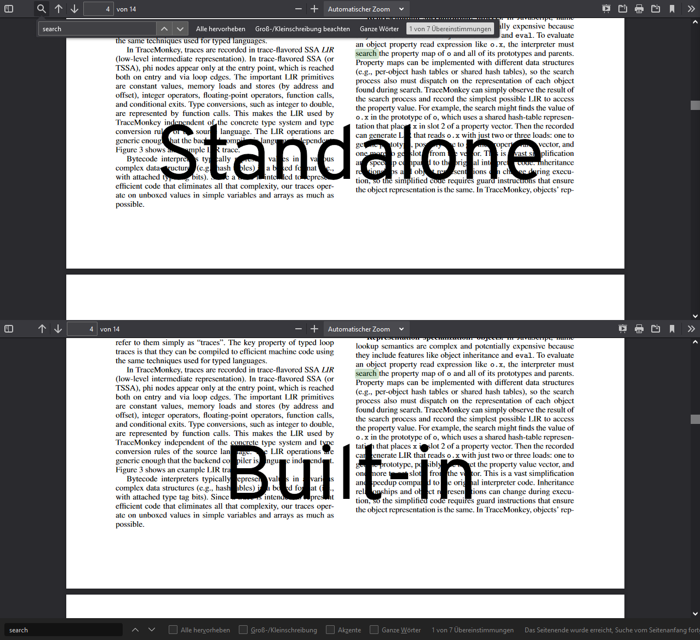
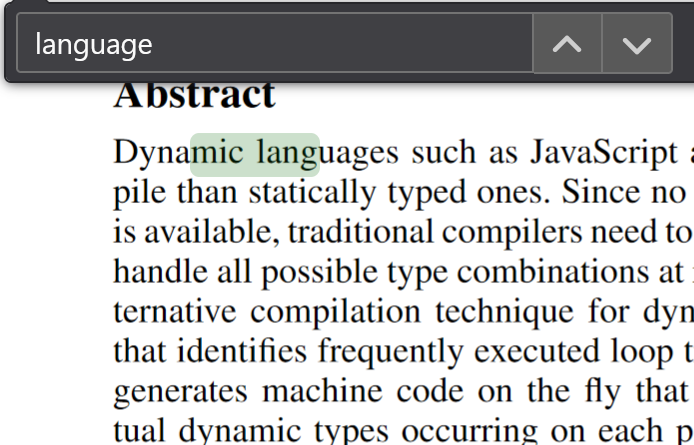
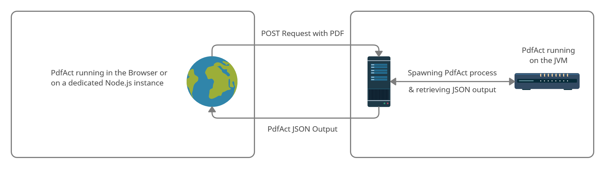

An adventure into pdf.js' text extraction, and the ways it can be improved for better
find functionality

<!--more-->

## Content

1. [What is pdf.js anyways?](#what-is-pdf-js-anyways)
    1. [PDF and the Web - Internet of Browsers](#pdf-and-the-web-internet-of-browsers)
    2. [How find works](#how-find-works)
2. [Improving find](#improving-find)
    1. [Adding simple concatenation rules for line breaks](#adding-simple-concatenation-rules-for-line-breaks)
    2. [Adjusting for misaligned indices](#adjusting-for-misaligned-indices)
    3. [Inter-page text search](#inter-page-text-search)
    4. [Some problems remain](#some-problems-remain)
3. [Introducing PdfAct](#introducing-pdfact)
    1. [Explaining the idea](#explaining-the-idea)
    2. [Building an HTTP wrapper](#building-an-http-wrapper)
    3. [Incorporating PdfAct](#incorporating-pdfact)
       1. [Tackling fundamental problems](#tackling-fundamental-problems)
4. [The result](#the-result)
    1. [Bodging code](#bodging-code)
    2. [Conclusion](#conclusion)


## What is pdf.js anyways?

### PDF and the Web - Internet of Browsers

Almost everyone nowadays knows the PDF format. It is the de-facto standard for platform-independent
representation of documents. If you ever want to send a document to a group partner, a colleague or
even your boss and need to make sure that it looks the same for them, PDF has become the first
choice.

Starting with Windows 10 Microsoft even shipped a "to-PDF-printer" with Windows by default because
even they had to admit their XPS standard was no match for the success of PDFs.

For a majority of PDFs lifespan you had to install a dedicated PDF reader application onto your
machine. One of the most popular options - if not the most popular - is *Adobe Acrobat Reader*, a
proprietary reader software by the original creators of the PDF specification.

Windows 8 for example came with a dedicated PDF viewing software '[Reader](https://www.microsoft.com/de-de/p/reader/9wzdncrfhwg5)'.
It became obsolete in 2017 however, in favour of the built-in PDF-reading capabilities of Edge, following
Chrome ([introducing a PDF viewer in 2010](https://chrome.googleblog.com/2010/11/pdf-goodness-in-chrome.html) now known as
'[PDFium](https://pdfium.googlesource.com/pdfium/+/master/README.md)')
and Firefox which introduced [pdf.js](https://mozilla.github.io/pdf.js/) [in Firefox 19](https://website-archive.mozilla.org/www.mozilla.org/firefox_releasenotes/en-us/firefox/19.0/releasenotes/)
as their built-in open-source PDF reader solution in 2013. Previously both browsers (Edge didn't exist back then) required
third-party add-ons for this.
Even though apart from Windows most operating systems still ship with a dedicated Document-Viewer (with support
for multiple formats including .pdf, .epub, etc.), it's obvious that unless you have a very specific use-case
it's convenient to open PDFs within the browser of your choice, especially when dealing with PDFs embedded in web-pages.

### How find works

Pdf.js, just like PDFium is open source, which makes it easy to have a quick look at the source code.
Both products follow a completely different design philosophy. PDFium is a native reader written in
mostly C++ and simply embedded into Chrome/Chromium. Pdf.js was started as an experiment by Mozilla Labs,
with the goal "to create a general-purpose, web standards-based platform for parsing and rendering PDFs".
(Taken from the former project README on GitHub.)
If this experiment was to be successful, it was planned to be integrated directly into Firefox.
Apart from that it was always intended to be used as part of third-party web applications.

In order to achieve this, the fundamental mechanism behind pdf.js is essentially a PDF-to-HTML
converter written in pure JavaScript. To guarantee correct rendering of the content it does a
lot of magic behind the scenes to make the reading experience as pleasant as possible.

As of right now pdf.js has 2 different backends: The canvas, and the experimental svg backend not
meant for production use. These backends do the heavy lifting to bring the PDF document
into the DOM. It shouldn't really make a difference for this use case but in order to
avoid potential early-adopter problems we'll stick to the former for this journey.

If you're familiar with the canvas element in HTML5, you'll know that it's a purely visual component
meant only for rare cases when the content of your website can't be represented with "normal" HTML.
Using a canvas leaves a lot of functionality missing that developers usually take for granted.
Selecting text, and the built-in find feature are perhaps the most notable user-facing examples,
but from a web-developer perspective the missing option to use CSS makes things harder in most cases.
To make up for those limitations pdf.js has to recreate the missing features in JavaScript
simply because people expect them to work.

At this point it's perhaps worth noting that Firefox actually uses a slightly differently configured
variant of pdf.js to make it feel like a native viewer. The most notable differences are that

1. Firefox uses the built-in "Find Text" box instead of the HTML dialog created by pdf.js which
   provides the same functionality. They only differ by their respective position on the page.
   One is on the top, the other on the bottom of the page (see pictures below).
2. The URL bar only contains the path to the PDF file when using the built-in version instead of
   the full URL to the actual viewer application i.e. Firefox Users just see `file:/path/to/file.pdf`
   instead of some `file://viewer.html?path=%2Fpath%2Fto%2Ffile.pdf`



The key takeaway from this is that the find-text-algorithm is ***not*** relying on Firefox' built-in
"Find in Page" mechanism which is being used for "normal" HTML, but calling pdf.js functions
instead. Everything described here is part of pdf.js. No additional magic added. This is great
because this means it is rather easy to tinker around with this code without having to clone and
build the whole browser locally.

So how does pdf.js simulate all the features like text-selection, copy-pasting etc. then?
By relying on HTML of course! pdf.js creates a transparent "text layer" in the DOM consisting
of several span elements where the whole text content of any given PDF is placed at roughly
the same location as it is in the actual rendered PDF. This way whenever a user tries to select
any text, they are actually selecting the transparent text on the "text layer" making it look
like they selected the text on the canvas.


pdf.js' find functionality is pretty straightforward. The content of all of those text spans in the
DOM is simply concatenated on a per-page basis. So whenever a user searches for a string, this
concatenated string is checked for a match. Simple exact string matching using `string.indexOf()`
functions from the standard library. This approach has some limitations. We will explore
those in the following sections.

## Improving find

### Adding simple concatenation rules for line breaks

The naïve concatenation of strings already is suboptimal. Imagine the following DOM:

```html
<span>Make it work, make it right,</span>
<span>make it fast.</span>
```

When simply concatenating those two strings we'd get

> Make it work, make it right,make it fast.

as the result. I want you to have a close look at the line break caused by the divs. As you can see
there's no space after the comma, so when searching for

> right, make

with the space in between we'd get no result, even though the author of the PDF probably included
this space originally when creating the PDF.

Why not just add spaces in between when concatenating the contents, you may ask yourself.
Unfortunately it's not that simple either. Let's have a look at the following example:

```html
<span>construct a high-</span>
<span>quality bench-</span>
<span>mark for simple</span>
<span>data analysis</span>
```

Intuitively we would concatenate this in our heads like this:

> construct a high-quality benchmark for simple data analysis

Did you notice how we apply a different concatenation rule to every single line break in this
example?

- Lines 1 &amp; 2 are concatenated without adding or removing any characters.
- Lines 2 &amp; 3 are concatenated by removing the dash between *bench* and *mark* to build the word
  *benchmark*.
- Lines 3 &amp; 4 are concatenated by adding the space we just talked about.

These rules reflect nuances of the english language and probably a lot of other languages as well.
This makes it very hard to develop a fixed set of rules to provide the correct method for every text
in every language, even if we just care about the english language for now.

Let's try to tackle this problem by trying to implement some basic rules for line break concatenation:

The pdf.js repository contains roughly 400 files, but for now only a single one is interesting:
`pdf_find_controller.js`.  This class is responsible for building and querying the search strings.
Let's try to improve the concatenation line breaks by using a slightly smarter approach that's still
simple to implement.


Previously the strings were simply concatenated as-is. The lines
```json
[
  "the",
  "lazy",
  "fox"
]
```

would result in

```json
"thelazyfox"
```

So in order to fix this problem, we try to modify the individual strings before concatenating them,
based on their following neighbour:

```javascript {linenos=table}
function modifyStringBeforeConcatenation(current, next) {
    if (next && current.transform[5] !== next.transform[5]) {
      if (current.str.endsWith("-")) {
        return current.str.substr(0, current.str.length - 1);
      }
      return current.str + " ";
    }
    return current.str;
}
```

This is the code I ended up using as a very basic ruleset. The function above is used as the core
element of a reducer function. If you are familiar with functional programming, you will know what
I'm talking about. The value of `transform` in the `current` and `next` arguments that are passed to
the function, is an array containing position information of the div that will end up in the DOM.
The value at index 5 is referring to the y position of said div. `current` and `next` seem to be
exclusively representing new lines, but can technically represent single characters, words or
sentences within a line.

The function is called for every element in an array, in our case abstract
representations of what will eventually turn into divs in the DOM, and return the string with

1. The last character removed if the `next` argument has a different y-coordinate, and the `current` arguments'
   `str` property ends with a dash (Line 4)
2. A space added to the end if the `next` argument has a different y-coordinate, and the `current` argument's
   `str` property does not end with a dash (Line 6)
3. No changes at all if we reached the last line
   or previous cases don't apply. (Line 8)

Sure, it would remove the dash in *high-quality* and turn it into *highquality* if that would end up
separated, but I decided to ignore that for now. It improves results by a lot already. In theory
you could build on that and continue to add even more granular rule-sets that work for an increasing
amount of languages and their oddities, but that would be an incredible amount of work, out of scope
for this project.


### Adjusting for misaligned indices

I had to learn the hard way that this change alone is not enough to create a satisfying result.
Don't get me wrong, the find feature works better than ever before, but once you look at what it
actually highlights you'll instantly realize that the wrong text is highlighted.



I found the reason for this newly introduced bug rather quickly. In order to find "highlight matches"
the code calls `String.prototype.indexOf()` to find the index where query and the search string match
and passes it to the code that does the actual highlighting.
This "highlighting-code" does its calculations based on the strings that can be found in the DOM.
So it assumes that we don't modify the strings, but has to work with data that we intentionally
change to be semantically more accurate. Obviously this goes wrong.

That's when I realized that I had to implement a mechanism that accounts for those offsets in
indices. For every change I made to the string I added a new entry to an array that contains
key-value-pairs where the keys are the offsets in the modified search string, and the value is the
offset that has to be added to get to the index being used by the DOM. A couple of days, and a lot
of wrong arithmetics later and finally the correct search terms were highlighted at the correct
position with the correct length.


```javascript
[
  { offset: 17, value:  0 },
  { offset: 30, value:  1 },
  { offset: 45, value:  0 }
]
```

I use a JavaScript array that is entirely made up of JS objects, one for every change we apply
to the strings before concatenating them as explained earlier. The value for `offset` contains
the index of the change, while the value for `value` stores the difference between the original
and the 'modified' index.

So in order to get the correct index in the DOM based on the index in the search string, you just
need to find the nearest `offset` value strictly below your current index and add `value` to it.
Because the array is already sorted by ascending values for `offset` finding this value is very
easy. Looking back at it, a binary search would've been super efficient, but I went with a
simple linear search because I could implement it in 2 lines of code and it was only called
once for every "highlighted match" on the page.

To not make things more complicated than they already are my code assumes that the strings are only
ever modified at their respective ends. This is always the case for my three operations,
but in case we ever wanted to modify any ligatures or correct any diacritics I would have to compute
some sort of edit distance to create sub-offsets within the string to get it 100% correct. Because
of their complicated nature I will ignore this topic for simplicity, more on that later. Thinking
about this there is a point to be made that any operations that actually modify anything other than
linebreaks should also be applied to the contents of the DOM so that copy operations get the correct
text content as well. In this case my code would actually be good enough.

### Inter-page text search

There's also another challenge to be tackled. A common problem with pdf.js is that you can't search
for text that stretches over more than one page. Not so much of a problem for PowerPoint/Impress slides
that are exported to PDF, but pretty annoying and misleading in articles or papers.
The reason for this is purely technical. Search strings are built on a per-page level, not
per-document. So if one sentence is interrupted by a "page break", both pages are being searched for
the sentence, but neither matches the string completely, only partially which leads to 0
results in total. This is not what humans would expect when reading continuous text.

Let's have a look at the following example:


As humans, we would intuitively expect to be able to search for the string

> This text spans across multiple pages.

and find a result that highlights the respective part in each page. Counterintuitively the code
can't do that. You can only search for

> This text spans across

and

> multiple pages.

individually. Both at the same time is not possible, because each page is checked on its own.

pdf.js uses a lot of asynchronous mechanisms presumably to increase loading times and general
performance. JavaScript is single threaded after all. I learned that pdf.js uses Worker-Threads to
parse the PDF and feed the results back to the main thread, but the find functionality seems to
run purely on the main thread. I originally thought simply changing the code to create a big
string combining the text of all pages instead of building a string for every page individually
would be enough. Once I did that however, I had to realise that there were many implementation-specific
details that relied on this per-page behaviour. Because of all the
necessary refactoring, it ended up being more work than anticipated, even though very little changed
from a users point of view. Counting the amount of matches was one thing I had to refactor, and I also had to make another iteration to my index-adjustment code: Suddenly the offsets I carefully tracked for the individual pages
were no longer correct for the single string I created.

Previously I had multiple arrays for the offset like this:

```javascript
// Page 1 with 60 chars of length
[
  { offset: 17, value:  0 },
  { offset: 30, value:  1 },
  { offset: 45, value:  2 }
]
// Page 2 with 56 chars of length
[
  { offset: 11, value:  -1 },
  { offset: 15, value:  -2 },
  { offset: 34, value:  -1 }
]
// Page 3 and so on...
```

Now it was just a single array for everything:

```javascript
[
  { offset: 17, value:  0 },
  { offset: 30, value:  1 },
  { offset: 45, value:  2 },
  { offset: 71, value:  1 },
  { offset: 75, value:  0 },
  { offset: 94, value:  1 }
]
```

This worked so well I was even considering making a pull request over at the pdf.js repository. Now
the challenge was to tackle more complex problems.

### Some problems remain

If that wasn't enough trouble already, there are some stylistic challenges to tackle as well.
Starting with umlauts and other diacritic symbols, "good" PDF generators use the proper codepoint
to include characters like `ÄäÖöÜü` as a single unit, however in many cases PDFs combine characters
like the base character `a`&nbsp;(U+0061), and the Unicode symbols
` ̈`&nbsp;(U+0020&nbsp;&amp;&nbsp;U+0308) to make it seem like there is a single character
`ä`&nbsp;(U+00E4).

Due to those circumstances a sentence containing the common german word `Döner`&nbsp;(`D%C3%B6ner`)
can only be found by searching for `D ̈oner`&nbsp;(`D%20%CC%88oner`) even though the correct way to
combine diacritics with Unicode would be `Döner`&nbsp;(`Do%CC%88ner`).
Note that depending on the situation there might be multiple correct Unicode representations of
the same string. Using [Unicode Normalization](https://unicode.org/reports/tr15/) converts all
of those into a consistent notation that can be used for comparison. This is also the reason
why your browser is probably treating notation variant 1 and 3 equally. 
Depending on your browser all of these 3 notations might look more or less the same, the reason why
I added the URI encoded version of each individual string next to it for comparison.

Already confused? There's more. Ligatures! For visual aesthetics some character combinations are
combined into single characters. This includes combining `ff`&nbsp;(U+0066&nbsp;&amp;&nbsp;U+0066)
into `ff`&nbsp;(U+FB00) or `ae`&nbsp;(U+0061&nbsp;&amp;&nbsp;U+0065) into `æ`&nbsp;(U+00E6) and many
more. This happens more frequently than one might think. The problem that comes with this is that
nobody is going to search for those kinds of ligatures when they probably don't even know those
special characters exist in the first place.

Pdf.js has little special handling for this. So when searching for the semantically correct
characters the search algorithm might not find anything even though the text clearly contains them.
For example the word 'efficient' might get converted to 'efficient' which might look the same
depending on the used font. Try searching for it on this page, you're probably not going to find
the second variant. Pdf.js is actually able to deal with this particular example because of
[a mapping](https://github.com/mozilla/pdf.js/blob/94ca66f528c1c02347d2f9c327f42fc8ba5e6ec1/src/core/glyphlist.js#L21-L4346)
that maps the individual Unicode characters to their "normal" counterparts. However, this isn't able
to deal with diacritics as I just explained because they work the other way around. Ligatures are
a combination of characters that can be expanded, diacritic symbols give different meanings to
already existing characters.

There isn't a simple solution to this problem, this is where a more sophisticated approach is
required.

## Introducing PdfAct

Even though PDF is used as a document format, it really behaves more like a vector image. In
contrast to a format like SVG, PDF doesn't store whole sentences or text blocks, but the individual
characters, which explains all the issues I mentioned earlier.

PdfAct is a tool developed at the chair of "Algorithms and Datastructures" that aims to provide a
far more accurate representation of the text content of a PDF file.

### Explaining the idea

So could we use this tool to replace pdf.js' mediocre text extraction? PdfAct outputs data that is
close to what pdf.js needs ([example](#incorporating-pdfact)), ideally with a more accurate text content.
It should be possible to use PdfAct as a drop-in replacement, if an API is created that allows both
pieces of software to communicate with each other.

### Building an HTTP wrapper

PdfAct is written in Java and is a standalone application. In order to use it from within pdf.js
or from the browser in general we need some sort of web API. It needs to be capable to accept
a PDF and return the resulting JSON. I didn't have any strong preferences
on which framework to use for this, but ideally I'd use something I already knew, so I decided
to use Node.js with express for this small application.



So whenever pdf.js loads a PDF, it sends the PDF to our newly built backend as a
multipart POST request and expects the JSON output from PdfAct in return.

I originally tried to keep this backend completely in memory. No need to bother the hard drive with
storing temporary files. On Linux or other UNIX-like operating systems you could just provide
`/dev/stdin` as input file and then pipe any existing byte-stream into the standard input of the
process. With a one-line change to the source code of PdfAct this worked as expected for small PDFs,
but I just couldn't get it working with larger files. There probably is a way to achieve this, but
after trying for hours without success I just ended up using temporary files to temporarily store PDFs
so they could get process by Pdfact, which worked flawlessly. Now we just need to get the data into
the right places.

### Incorporating PdfAct

It took me a while to find the part of the code which is responsible to extract text from PDFs
in the pdf.js codebase, because a lot of the code is kept modular and tends to hide implementation
details in favour of interface-like code architecture. This is mainly caused by the need for worker
threads which is definitely not helping readability. Once I found it I could finally get a side-by-side
comparison:

Here you can see an excerpt of pdf.js' output showing the information extracted for the title of a
scientific research paper:
```json
[
  {
    "str": "Trace-based Just-in-Time Type Specialization for Dynamic",
    "dir": "ltr",
    "width": 449.09111040000005,
    "height": 17.9328,
    "transform": [
      17.9328,
      0,
      0
      17.9328,
      80.5159,
      700.6706
    ],
    "fontName": "g_do_f1"
  },
  {
    "str": "Languages",
    "dir": "ltr",
    "width": 82.70607360000001,
    "height": 17.9328,
    "transform": [
      17.9328,
      0,
      0,
      17.9328,
      263.706,
      680.7453
    ],
    "fontName": "g_do_f1"
  }
]
```

This is PdfAct's output for the same section of the paper:
```json
[
  {
    "color": {
      "id": "color-0"
    },
    "positions": [{
      "minY": 697,
      "minX": 80.5,
      "maxY": 713.1,
      "maxX": 529.6,
      "page": 1
    }],
    "text": "Trace-based Just-in-Time Type Specialization for Dynamic ",
    "font": {
      "font-size": 17.899999618530273,
      "id": "font-289"
    }
  },
  {
    "color": {
      "id": "color-0"
    },
    "positions": [{
      "minY": 677.1,
      "minX": 263.7,
      "maxY": 692.9,
      "maxX": 346.4,
      "page": 1
    }],
    "text": "Languages ",
    "font": {
      "font-size": 17.899999618530273,
      "id": "font-289"
    }
  }
]
```

I was slightly concerned when I noticed that Pdfact's and pdf.js' positional information differed.
Luckily closer inspection revealed that the differences were small and therefore negligible because
they are barely or not visible at all on normal screens.

#### Tackling fundamental problems

So getting something to work on a fundamental level wasn't difficult anymore. Needless to say I was
able to write some code that forwared the data to the places in pdf.js where it was required rather
fast. Because PdfAct and pdf.js weren't designed to work with each other the whole system is good, but
has some minor flaws.
When searching for text that is being supplied by PdfAct, the modified pdf.js-code will find it, this works.
The visuals are a little trickier though, simply because the pdf.js renderers goal is to render visually
pleasing text, but our goal is to provide accurate text.

Pdf.js needs to know where the text is positioned in the PDF in order to be able to highlight it.
The creator of a PDF can freely choose the used font, so it doesn't have to be a monospace font.
So in order to get the position exactly right, I had to not only consider PdfAct's text output, but
also the texts individual fonts, hoping that the browser rendering the text knows the font.
This is because depending on the font family, each character can have a varying width and height. So
if this information is missing the code simply assumes the widths and heights of a fallback-font at
the cost of positional accuracy of the individual characters (not the sentence or line as a whole).
The code also assumes that text is written left-to-right for simplicity,
otherwise this would go down another rabbit hole of foreign language oddities. This is not a problem of
Pdfact (it was designed as a text-extraction tool, not as a PDF viewer), but in a perfect system there would be a tool that converts
any font inside the PDF document into a browser compatible woff-format (Web Open Font Format, an alternative to True Type Fonts)
so the browser can load this font in any case.

For this project some adjustments were made to PdfAct, using a special pdf.js mode (shoutout to Claudius Korzen,
who went through the hassle of making this possible). This mode outputs line-by-line objects with their individual bounds for better compatibility with pdf.js. Using this mode, the only challenge left was to adjust the find algorithm to the enhanced output of Pdfact. The custom line-break enhancement code I created earlier are not required
anymore. Because text is transmitted line by line, some context is lost that would be present if the whole text-block
would be sent instead. Ideally the text being transmitted should be very close to the actual rendered text,
along with some instructions on how to join the individual lines to get back that missing information.
However, a simpler route was chosen: The transmitted text is pre-formatted so that the individual lines are just joined together to create the search string. Before adding the strings to the DOM, any trailing whitespace is removed, so it doesn't look weird. 
Using the example from earlier the code basically does this:

`'Trace-based Just-in-Time Type Specialization for Dynamic '`

and

`'Languages '`

are joined to form

`'Trace-based Just-in-Time Type Specialization for Dynamic Languages '`

and trailing whitespaces are removed to result in

`'Trace-based Just-in-Time Type Specialization for Dynamic Languages'`

PdfAct is now finally incorporated into pdf.js.

## The result

### Bodging code

At this point you probably realized that this project is really just an experiment to make a point,
a proof-of-concept you might say. Regarding that I'd say it succeeded without a doubt. If PdfAct
was extended to provide more information for pdf.js' rendering requirements (like providing embeddable
browser fonts for example), I suppose that this could lead to very accurate results - in theory, but
all of this functionality would contribute nothing to its core functionality (text-extraction), so
this is nothing this tool should actually pursue.

In practice the code could use a lot of improvement in the long run. The "HTTP-to-CLI" API I created
is far from being perfect. On my machine it once took a whopping 7.57 seconds to process
[the PDF](https://raw.githubusercontent.com/mozilla/pdf.js/6a15973/web/compressed.tracemonkey-pldi-09.pdf).
2 seconds of which is establishing the HTTP connection. The upload and download rates are below 1ms
because everything is running on localhost for me. Using better server infrastructure should
decrease this initial latency by a fair amount, but just starting PdfAct and processing the PDF
makes up most of the time nevertheless. Even if PdfAct and my API were optimized for speed, by avoiding so called "JVM cold-starts" for example, having to run a dedicated application in the background is an overhead that is not feasible for a pure JavaScript application like pdf.js.

Pdf.js makes some assumptions in its code that don't align with the reality of fluent text. For
example, it assumes that matches are on a page by page basis, where in reality text can continue on
the next site. My code worked around this issue making it look like 2 independent matches, but this
is obviously not the case here. A lot of refactoring would be needed to overcome this issue. Pdf.js
also assumes that selectable text is the same as searchable text. If a line ended with a dash
breaking the word "compile" into "com-" and "pile". The dash should be selectable because it is
clearly visible, but it clearly shouldn't be searchable because nobody would expect the dash in the
middle of the word. This discrepancy caused most of the problems when modifying the code.

### Conclusion

That being said it's remarkable that the developers of pdf.js were able to implement such a
fast text extraction algorithm in javascript, even if it isn't as accurate as PdfAct.

However, we were able to show that improvement is easily possible by applying simple rules to the
existing code. I think if someone is willing re-implement PdfAct inside the pdf.js codebase and make
pdf.js specific adjustments the code could be enhanced to be really accurate and overcome the
remaining issues.
