Topology maps of distribution grids are not always 100 % accurate. Nevertheless, precise topology knowledge is required for efficient grid operation and grid expansion. At Fraunhofer ISE an approach based on Graph Neural Networks was developed in order to verify given grid topologies. This Master's Project evaluates the algorithm in more realistic scenarios and analyzes possible improvements.

<!--more-->

<h2 id="introduction">Introduction</h2>

Energy supply networks can be broadly divided into low-voltage distribution grids and medium-/high-voltage transmission grids. Historically, energy supply was primarily controlled within the transmission grid, while distribution grids played a merely passive role. However, with the ongoing energy transition, the role of distribution grids (DGs) has significantly changed. The increase in electrical loads due to electric vehicle charging and heat pumps, the direct integration of energy from solar panels into DGs, the unpredictability of most renewable energy sources, and the growing presence of storage batteries in businesses have introduced, and will continue to introduce, dynamics within DGs on an unprecedented scale.

Distribution grid operators (DGOs) are tasked with managing DGs. They are urgently seeking new methods to control the new dynamics in a manner that is user-friendly, economical, and protective of the network. Intelligent steering, however, requires precise knowledge of the grid's topology.

Let us assume a sample residential area.
<figure style="text-align: center; margin-top: -20px;">
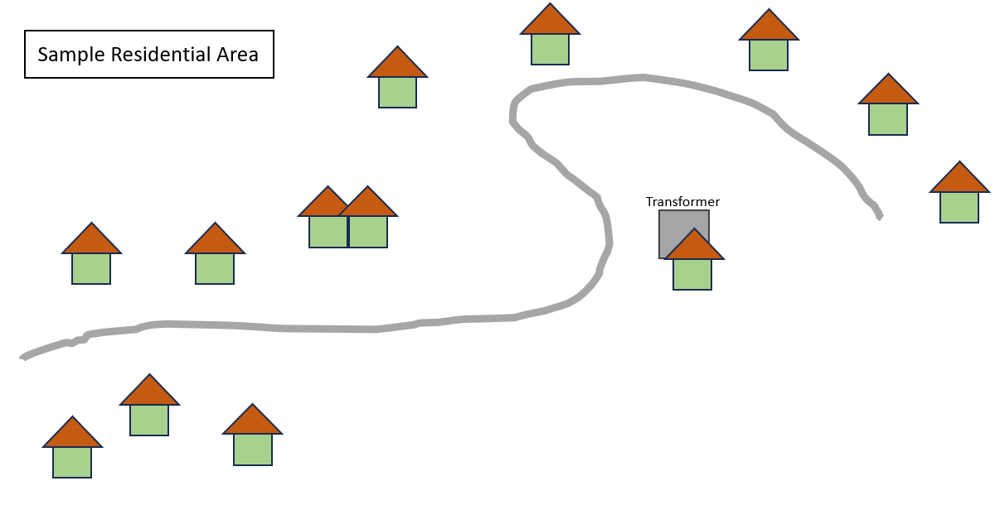
<figcaption style="text-align: center; font-size: 90%; color: darkseagreen">Figure 1: A small residential area with 13 buildings. For future reference the transformer is marked. </figcaption>
</figure>
<br>

In Germany there are over 850 <a href="#ref4"> [4]</a>. The one managing the grid of our sample residential area will usually use a topology map of the grid indicating all connection points (called buses) and lines. For our residential area, the corresponding topology map could look like this:
<figure style="text-align: center; margin-top: -20px;">
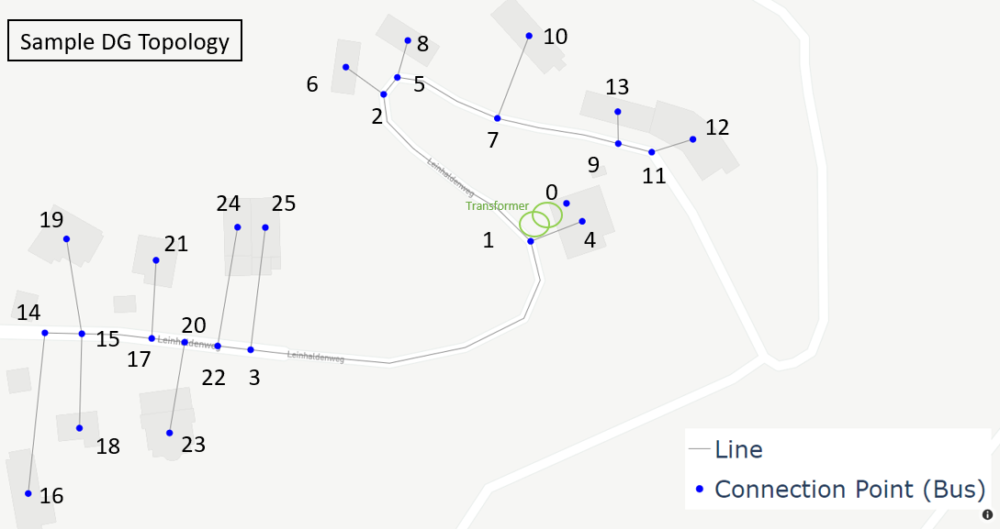
<figcaption style="text-align: center; font-size: 90%; color: darkseagreen">Figure 2: The topology of the DG of the residential area. </figcaption>
</figure>
<br>

Now assume that the residential area in question was predominantly built around 50 years ago. Can we be certain that the current topology map accurately reflects the actual configuration of the electrical grid? Can we be certain that every modification made to the grid over the past five decades has been accurately documented, reported, and digitized? Given the inherent challenges associated with observing underground cables: we can not <a href="#ref5">[5]</a>.

But there is hope: In order to enhance energy efficiency, improve grid management and empower smart grid usage, the European Union has decided that households shall be equipped with smart meters <a href="#ref29">[29]</a><a href="#ref30">[30]</a>. And Germany just recently passed a law to meet these directives <a href="#ref22">[22]</a>. Smart meters are intelligent measuring devices that, in contrast to common power meters, can directly communicate with the DGO. They furthermore do not only measure power, but also voltage. DGOs thus have potentially access to voltage and power data with a 15 minute resolution.

The new data source might be very hand if a DGO is uncertain about the accuracy of their topology map. Assuming that all connection points are existing as indicated by the map, we therefore aim to build a classifier that can decide if the connections (i.e. lines) between the buses are given as indicated. More precisely we aim to develop an algorithm that takes in all available data from the DGO to classify as either connected according to the given topology or not. We refer to the class of nodes that are connected to the exact same nodes as indicated by the map as "green nodes", while those that do not meet this criterion are labeled as "red nodes." A possible outcome could look like this:

<figure style="text-align: center; margin-top: -20px;">
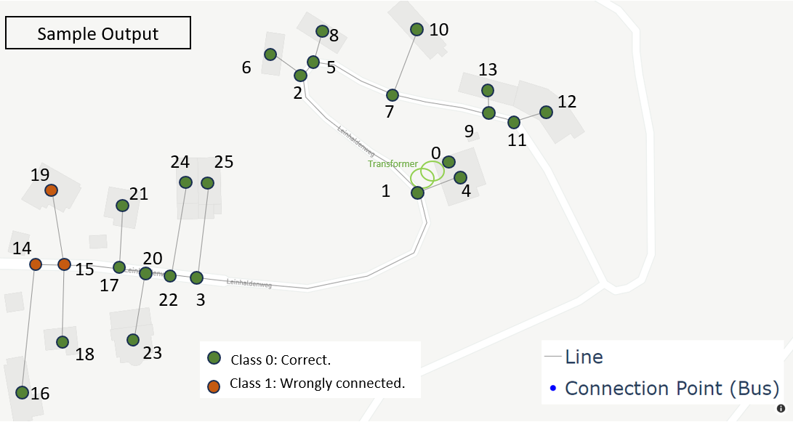
<figcaption style="text-align: center; font-size: 90%; color: darkseagreen"> Figure 3: Possible classification output: Green nodes are connected as indicated. Red nodes are not. </figcaption>
</figure>
<br>

Based on how much trust you put in the algorithm, you have different options:

<ol>
    <li> Directly infer that there is no line between node 14 and node 19, but one between node 15 and node 19.
    <li> Reconfigure your topology map at the marked nodes and find a variation that the algorithm accepts.  
    <li> Check possible errors at the marked locations, based on archive data or in-field checkups.
</ol>

Thus you are enabled to correct your topology map. A previous Master Thesis has investigated the effectivesness of Graph Neural Networks (GNNs) as a classifier in this context. This project aimed at testing the performance of GNNs in a more realistic setting: In order to simulate errors in measurement, we applied Gaussian Noise to the data. In order to simulate a lack of measurement devices, we tested the GNN with incomplete data. And in order to make the errors more subtle and less recognizible by the eye of an expert, we improved the error generator, that is used to simulate errors in a topology map.

<h2 id="background">A Short Walk Through the Mechanisms of a Grid </h2>

In order to understand the further details of our work and related papers, a superficial understanding of the mechanisms of a DG is required. Some simplifications were made to keep the section in limits. Readers interested in this topic might want to consult furthers sources.

First, a few notes on DG topologies as depicted <a href="topology">above</a>.

<ol>
    <li> Node 0 does not exist in reality, but represents the transmission grid. It is called "slack bus" and will, on paper, provide the energy needed in the distribution grid. If, for example due to solar panels, the DG system had a positive energy balance, it would "consume" the excess energy.
    <li> The Distributed Generation (DG) system "begins" at the transformer, where higher voltage levels from the transmission grid are stepped down to safer, lower voltage levels. In Germany, these levels are typically 400 V or 230 V.
    <li> Apart from the transformer, our grid topologies primarily consists of lines and buses. Approximately half of these buses are located within buildings, while the other half are situated at intermediary points between them.
    <li> Buses and lines can naturally be understood as nodes and edges of a graph. A real grid topology will feature more complicated components such as switches. But they can be modeled by buses and lines and are not explicitely considered at this stage of algorithm development.
    <li> Grids do not have to be, but often are tree structured. In a tree, possible issues can be located faster since outage of one line affects exactly the subtree it connects.
</ol>

Second we will have to take a look at the three features that play a major role in our algorithm development: Power (\\(P\\)), voltage magnitude (\\(V_{Mag}\\)) and voltage angle \\((V_{Ang}).\\)

<h3 id="power"> Power </h3>

If you activate your toaster, your toaster becomes a load: it consumes power. This power has an active and a reactive part. The active part is the power that is actually consumed, while the reactive part oscillates between the source and the load. In this work we will only care about active loads and neglect reactive ones since reactive loads are comparatively small. We thus use "power" synonymous to "active power". The counterpart to loads are generators: they produce power. We will only talk abouts "loads" and use a positive sign for loads that generate power, and a negative sign for loads that consume it. 

Since reducing power consumption is an important ingredient of a climate-friendly energy transition, power consumption behavior has been investigated in much detail. At Fraunhofer ISE we use a tool called "ScenarioCreator" that provides us with typical power consumption data, given (mainly) a grid and a time frame. If we simulate our sample grid at 4:15 AM, we observe the following load values:

<figure style="text-align: center; margin-top: -20px;">
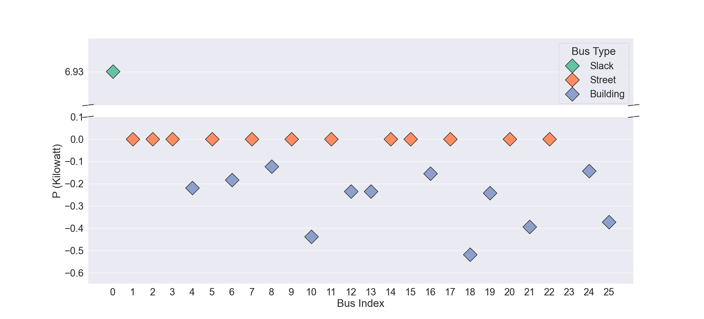
<figcaption style="text-align: center; font-size: 90%; color: darkseagreen"> Figure 4: Active load relates to bus type. One outlier (Bus 23, a building, with a load of -2.6) has been omitted from the figure. Values were gained by simulation (ScenarioCreator) at 4:15 AM. </figcaption>
</figure>
<br>

As you can see, the bus type roughly predicts the load: 
<ol>
    <li> Buses in buildings consume power, as people use electricity.
    <li> The slack bus must balance the consumed power by supplying an equivalent amount.
    <li> Buses located below the street have no load, as there are neither photovoltaic panels nor toasters underground.
</ol>

Note: The power you consume (or produce) is not dependent on whether your building is connected to the grid via bus 2 or bus 15. As long as the bus is connected and there are no irregular events, such as overloads, power remains, in a sense, independent of the grid's topology. This is a crucial difference from voltage magnitude and voltage angle, that both are directly influenced by the grid's configuration.

<h3 id="voltage-magnitude"> Voltage Magnitude </h3>

Voltage magnitude in alternating current (AC) refers to the absolute value of the AC voltage and aligns with the concept of voltage in direct current (DC). In both AC and DC systems, voltage magnitude represents the potential difference between two points in the circuit and indicates the strength of the electrical force driving the current.

We assume our low-voltage grid operating at 400 volts. If there were no impedance (AC equivalent of resistance) in the lines, we would measure a voltage magnitude at all buses. But there is, so we don't. Instead we typically find a voltage magnitude distribution such as this one:
<figure style="text-align: center; margin-top: -20px;">
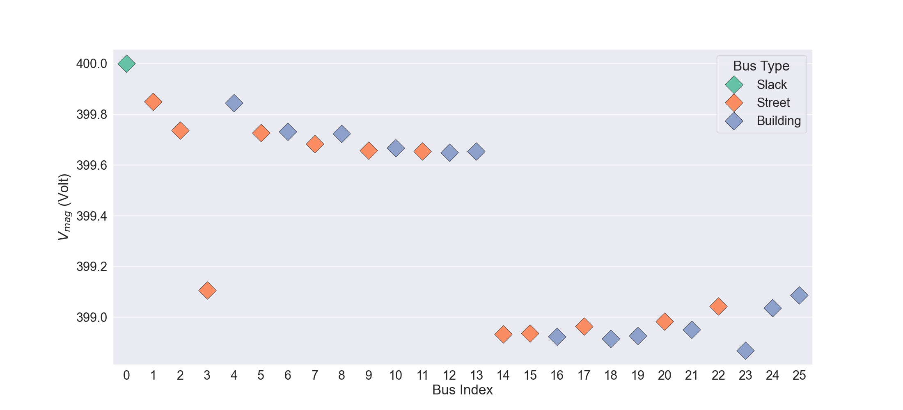
<figcaption style="text-align: center; font-size: 90%; color: darkseagreen"> Figure 5: Buses close to each other typically have a similar voltage magnitude. Data was gained by power flow (see below) for simulated power values at 4:15 AM.  </figcaption>
</figure>
<br>

The slack bus provides us with 400 volts (actually the transmission grid provides us with a voltage magnitude that is transformed down to 400 V). Based on similar voltage magnitude, we could define clusters. One potential clustering would be ((0, 1, 4), (2, 5, 6, ..., 12, 13), (3, 14, 15, ..., 24, 25)). If you take a look on the topology map above, you will see that this clustering really corresponds to a certain proximity of the buses. Especially the long line between bus 1 and 3 seems to explain the high drop in voltage magnitude between their respective clusters. 

The same observation can be made for voltage angle.

<h3 id="Voltage Angle"> Voltage Angle </h3>

In alternating current (AC) systems, voltage varies over time and is described by a sine wave. The voltage angle, also known as the phase angle, indicates the phase shift of this sine wave relative to a reference point. The typical reference point is the slack bus (\\(V_{Ang} = 0 \\)).

<figure style="text-align: center; margin-top: -20px;">
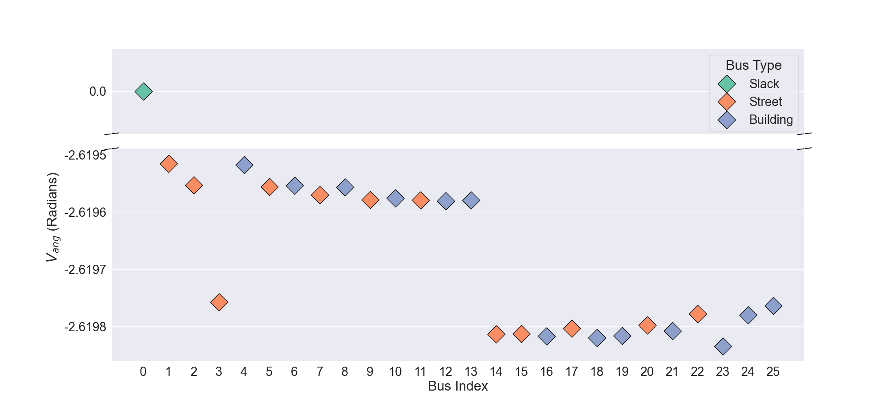
<figcaption style="text-align: center; font-size: 90%; color: darkseagreen"> Figure 6: Buses close to each other typically have a similar voltage angle. Data was gained by power flow (see below) for simulated power values at 4:15 AM. </figcaption>
</figure>
<br>

Like voltage magnitude, the angle also depends on the position of a bus within the topology. In fact the two magnitudes usually display a positive correlation, which is even higher if you disregard the slack bus. The biggest shift in angle happens between slack bus and DG (during transformation). Within the DG we see only a tiny amount of phase variance. There is a smaller shift between the subtree rooted in node 3 and the remaining grid. This might be again due to the inproportionally long line between node 1 and node 3.

Keep in mind, that we are looking at a very simple DG. Larger grid - with up to 500 buses - might have several topological clusters with similar voltage values.

<h3 id="power flow"> Power Flow </h3>

Given all loads and line impedances you can directly calculate the voltage magnitude and angle for every bus in the grid. After applying basic physical laws, this comes down to solving a non-linear equation system, which can be solved with a Newton-type gradient descent. This process is referred to as "calculating the power flow".
<figure style="text-align: center; margin-top: -20px;">
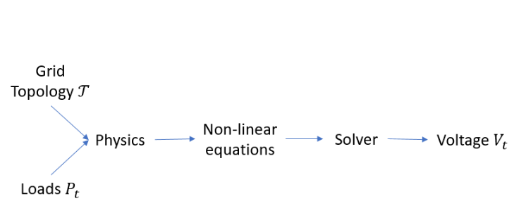
<figcaption style="text-align: center; font-size: 90%; color: darkseagreen"> Figure 7: Ingredients of a powerflow at timestep t. </figcaption>
</figure>
<br>

The power flow is a very powerfull tool. As long there is no extensive spread of smart meters, voltage data is hard to get by. Power consumption on the other side can be measured by common power meters or simulated by tools such as the above mentioned ScenarioCreator. We leveraged this idea to create our datasets. Details are explained in the section "Data Processing and Dataset". But first, we will have a closer look at the inference task our algorithm is supposed to solve.

<h2 id=related-work> Inference Task and Related Work </h2>

Ultimately we aim to correct grid topologies. That means we want to develop an algorithm that uses a topology map \\(T\\) as well as measurement data and then tells us where \\(T\\) differs from reality. For now, we are content if the algorithm indicates which buses are not connected as assumed by \\(T\\). 
<figure style="text-align: center; margin-top: -20px;">
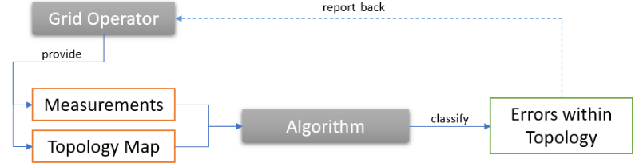
<figcaption style="text-align: center; font-size: 90%; color: darkseagreen"> Figure 8: Our algorithm should be able to verify a topology map given measurements provided by a DGO. </figcaption>
</figure>
<br>

The literature is rich with concepts on solving very similar tasks <a href="#ref5"> [5] </a>. We found mainly two problems with these: Either they assume unrealistic data availability (for Germany) or they try to solve a far more difficult problem.

Many approaches assume intelligent measuring devices in every household <a href="#ref8"> [8] </a> <a href="#ref9"> [9] </a> <a href="#ref10"> [10] </a>. This assumption is strongly context dependent. In the context of Germany, the so-called smart meter rollout has just been initiated <a href="#ref22"> [22] </a>. There are practically no grids with 100 % smart meter penetration. Furthermore some physics-based approaches assume having knowledge about the voltage angle <a href="#ref12"> [12] </a> <a href="#ref25"> [25] </a> <a href="#ref26"> [26] </a>. However, smart meters usually only measure voltage magnitude and not its angle. Only in some countries, so called Phasor-Measurement Units can indeed provide voltage angles, but in Germany they are not provided for the distribution grid.

Other papers do not use an existing topology \\(T\\) but directly aim at inferring the grids real admittance matrix from smart meter data <a href="#ref27"> [27] </a>. The admittance  matrix not only describes the grids lines, but also their (inverse) impedance. We think this is a two-fold overcomplication: First DGOs would already be very happy with secure knowledge about their cable routing. The exact physical properties of individual cables are less important (not least because they also vary with temperature). And second, there is no reason to not incorporate an existing topology map in the pipeline. It might not be perfect, but it is a very good initial guess.

In order to quantify the success of our algorithm on the inference task, we will use the F1-score (F1). It is defined as the harmonic mean between precision (P) and recall (R) which themselves are defined in this context by comparing the number of red nodes that are correctly identified as green nodes (n_true_positives), the number of the green nodes that are wrongly classified as red nodes (n_false_positives) and the the number of red nodes that are wrongly classified as green nodes (n_false_negatives).

$$ P = \frac{\text{n_true_positives}}{\text{n_true_positives} + \text{n_false_positives}} $$
$$ R = \frac{\text{n_true_positives}}{\text{n_true_positives} + \text{n_false_negatives}} $$
$$ F1 = 2\frac{P \cdot R}{P + R} $$

<h2 id=related-work> Algorithm Design: A Three-Layered GNN </h2>

To summarize, the desired algorithm should be able to deal with incomplete (and potentially noisy) measurement data. It should allow for graph-structured input with numeric features on different scales. Also categorical input might be interesting, such as the bus type as shown in <a href="#fig4"> Figure 4 </a>. It should match the desired problem complexity and thus not be fully dependent on properties such as line admittance. Lastly, it should be easy to adapt since we are still quite early in development. One modern canonical contender for this set of requirements are neural networks, specifically GNNs <a href="#ref15"> [15] </a>.

In a previous Master Thesis at Fraunhofer ISE <a href="#ref12"> [12] </a>, it has been shown that under conditions of full observability and noiseless data, a 3-layered GNN can detect some randomly-built errors in DGs, given singular time steps (validation F1-score 0.68). We continue to use this model with two alterations: We use binary classification as depicted above (the old model used multiple error categories) and we normalize the input data. 
Since this project focuses on experiments on data preprocessing and we did not alter the model's backbone compared to the previous thesis, we will not dig too deep into GNNs. But in order to gain a basic understanding of the workings within a GNN, here is an explanation of it's main mechanism: message passing.

<h3 id=message-passing> Message Passing </h3>

Message passing refers to the repeated application of two successive steps: 

<ol>
    <li> Aggregation: For each node, collect the values of all neighbors and - optionally - the node itself.
    <li> Update: Based on this collection, calculate a new value for the corresponding node, using an update function.
</ol>

To understand these two steps better, consider <a href="#fig9"> Figure 9 </a>. We start with an input graph and 3 possible color values: _Red_, _Blue_ & _None_. We than have applied these two simple definitions:

<ol>
    <li> Aggregation: Collect the color values of all neighbors, including the node itself, in a list.
    <li> Update: If there are multiple color values: Mix them, ignoring None-values.
</ol>
<figure style="text-align: center; margin-top: -20px;">
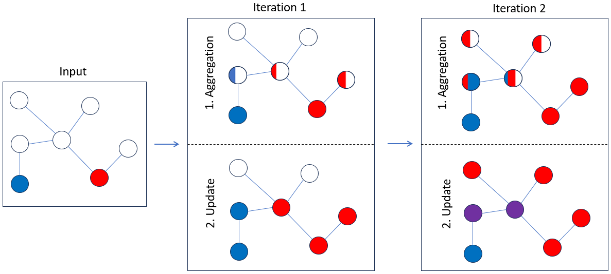
<figcaption style="text-align: center; font-size: 90%; color: darkseagreen"> Figure 9: Message passing for a sample graph: color is used as feature.  </figcaption>
</figure>
<br>

GNNs apply message passing and use a neural network as an update function. This implies that the update function has trainable parameters and thus must be fitted to training data. Furthermore you can apply the full canon of deep learning theory, including attention, activation functions, normalization, etc. In this example we use only color as feature. But you can of course have larger input dimensions and especially larger hidden layer widths. Our model's backbone consists of three successive layers of improved graph attention. You can check out the details of this mechanism in the paper by Brody et al. <a href="#ref16"> [16] </a>. The output of layer 3 is passed to a multi-layer perceptron <a href="#ref31"> [31] </a> to perform the binary classification task.

<h2 id=data-preprocessing> Data Processing and Dataset </h2>

<h3 id=inference-processing> Data Processing for Inference </h3>

Data processing is very crucial to our project. Not only are DGs a tricky data type, but our preprocessing has a special twist to it. Consider again the inference task: the grid operator provides us with measurements and the topology map in question. Now, you have to remember that power and voltage are different in a very crucial aspect: power is in principle independent of the grid topology, yet voltage is not. 

If we differentiate between the given topology \\(T^{* }\\) and the real topology \\(T\\), than the voltage values are measured at \\(T\\), while the power used is the same for \\(T^{* }\\) and \\(T\\). This allows us to use the following trick: We can use the given power values and \\(T_{* }\\) to compute the power flow, and thus gain the expected voltage values for every bus, given \\(T^{*}\\). The difference between the measured and the expected voltage has proven to be a very useful feature, when verifying a grid's topology. <a href="#fig10"> Figure 10 </a> sketches how the data is processed during inference.
<figure style="text-align: center; margin-top: -20px;">
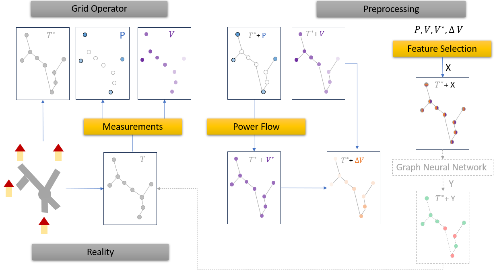
<figcaption style="text-align: center; font-size: 90%; color: darkseagreen"> Figure 10: Central to data preprocessing is differentiating between measured voltage (from the real topology) and simulated voltage (for the topology map). Dotted elements indicate the inference. </figcaption>
</figure>
<br>

<h3 id=inference-processing> Data Processing for Training </h3>

For our model training, the approach is slightly different. First of all, since grid data is hard to obtain and extensive amounts of data are required to train a GNN, we augment our dataset by creating synthetic grids using SynGridOSM. SynGridOSM is a tool from Fraunhofer ISE that generates DGs based on OpenStreetMap data. Note that these synthetic grids are somewhat idealized: what would the grid look like if planned today? Furthermore, synthetic grids lack measurements for power values. To address this, we simulate power values by assigning typical load profiles to buildings. For this, we will use ScenarioCreator.

Secondly, since we need grids with topological errors for model training, we insert those, using an error generator. For now, you can think of the error generator as rerouting a single line to create a slightly incorrect - but still fully connected - topology map. We can gain multiple faulty variations from the same source grid by this method. We also experimented with a more sophisticated error generator. Details are found with experiment 5. 

Measured voltage data is simulated by conducting a powerflow, yet not on the faulty variation but on the original topology.

The following scheme provides an overview of the training data generation process:
<figure style="text-align: center; margin-top: -20px;">
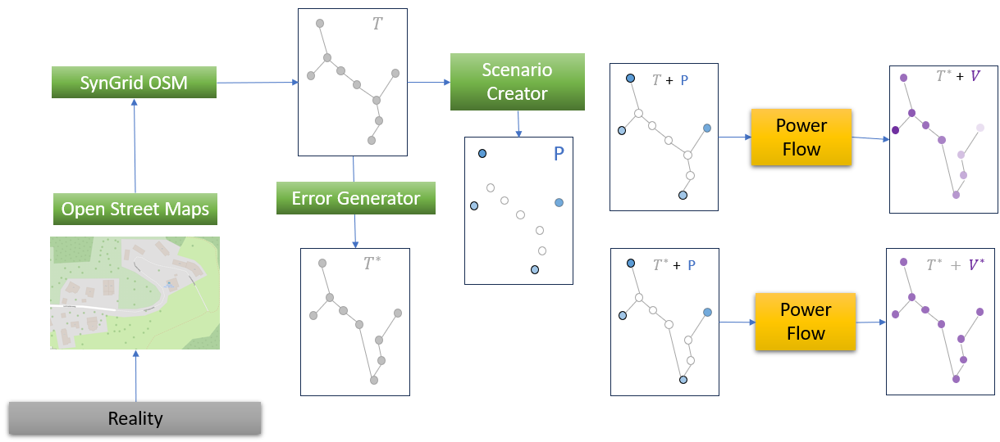
<figcaption style="text-align: center; font-size: 90%; color: darkseagreen"> Figure 11: Synthetic data generation allows the creation of larger datasets based on OpenStreetMap data.  </figcaption>
</figure>
<br>

<h3 id=inference-processing> Dataset </h3>

Initially we used the training and validation as created in the previous state of the project: 1 real grid and 3 synthetic grids were used for the training the model. 1 real grid and 1 synthetic grid were used to validate the models performance. To each, the ScenarioCreator was applied with different parameters, simulating \\(P\\) values for the years 2022, 2030, 2040. For the training set 50 random errors were generated and for each error 4 (separate) time steps were considered. For the validation set, 10 errors were generated and for each error, 8 separate time steps considered. Here is an overview:
<figure style="text-align: center; margin-top: -20px;">
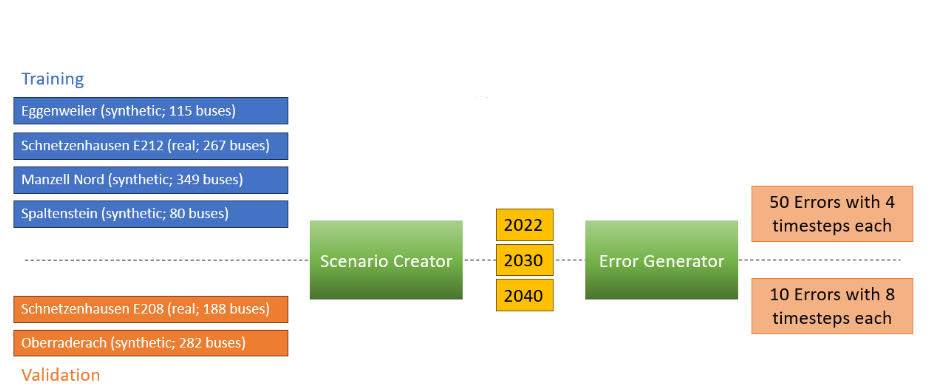
<figcaption style="text-align: center; font-size: 90%; color: darkseagreen"> Figure 12: Original dataset composition. For each grid three different power usage scenarios and 50 and 10 (faulty) variations were generated, respectively.  </figcaption>
</figure>
<br>

However, we evaluated all results using cross-validation (CV), i.e. we always trained on 4 grids and evaluated on the remaining 2. Given a set of 6 grids, this results in 15 possible splits. In the experiment section, respective metrics are measured on all of these 15 splits.

<h2 id="experiments"> Experiments </h2>

In the previous algorithm design <a href="#ref12"> [12] </a>, four classes were used, 3 classes for different error types and one for correct nodes. As described above, we only distinguish between green and red nodes. The former 4 error types only make sense in a limited number of scenarios. Also there is an imbalance in the dataset in favor of unsuspicious nodes, which is already huge, when not differentiating between error types (approx. 60:1). In order to deal with these imbalances, we tested different loss functions and corresponding learning rates (Experiment 1). Based on this we chose a loss function for rapid and stable convergence. We went on testing the GNN under more realistic assumptions. First, we investigated the model's performance with the former feature set in comparison to a more realisticly available one (Experiment 2). Then we added noise to the data (Experiment 3). We went on simulating the absence of certain measurement devices by incompleteness in the data (Experiment 4). Finally we also tested a new error generator, that is supposed to create more subtle errors (Experiment 5) and lastly tested this error generator in conjunction with the impairing factors from the other experiments (Experiment 6).

<h3 id="experiment-1"> Experiment 1: Balancing an imbalanced Data Set? </h3>

The data is inherently imbalanced. The output grids of the error generator have 3 red nodes, while all the rest are green nodes. Adding over all grids, variations and snapshots, this results in 594,288 green and only 9,480 red nodes in the whole dataset.

FocalLoss <a href="#ref21"> [21] </a> is a robust loss function, specifically designed to deal such data imbalances. The underlying idea is to relatively decrease loss weight on samples that are already predicted well and thus implicitly increase weight on underrepresented classes. Using \\(\sigma(x) = \frac{e^{x}}{1 + e^{x}} \\) and the authors abbreviation:

$$ p_t = y \cdot \sigma(x) + (1 - y) \cdot (1 - \sigma(x)) $$

the FocalLoss is defined as:

$$ FL(x, y) = -(1-p_t)^{\gamma} \cdot \log(p_t) $$

Another well established approach to inbalanced datasets is the usage of Binary-Cross-Entropy (BCE) with positive class weights<a href="#ref20"> [20] </a>. Given a single logit prediction \\(x\\) with ground-truth \\(y\\) and a positive class weight \\(w_pos\\) its formula reads:

$$ BCE(x, y) = -w_{pos} y \cdot \log \sigma (x) + (1 - y) \cdot \log(1 - \sigma(x)) $$

According to  <a href="#ref20"> [20] </a> the BCE positive class weight should be chosen as

$$ w = \frac{Number~of~All~Samples}{Number~of~Positive~Samples} = \frac{594288 + 9480}{9480} = 63.69 $$ 

Prestudies showed however that training with such a high weight on one class does not work well, so we decided to focus the experiment on more conservative weights. For BCE the weights \\(1.0, 3.5, 7.0\\) and \\(10.0\\) were chosen. For FocalLoss, advised standard parameters \\(\alpha=0.5\\) and \\(\gamma=2.0\\) were tested. We also altered the learning rate as performance might depend on this choice. Each model was trained for 1000 epochs.
<figure style="text-align: center; margin-top: -20px;">
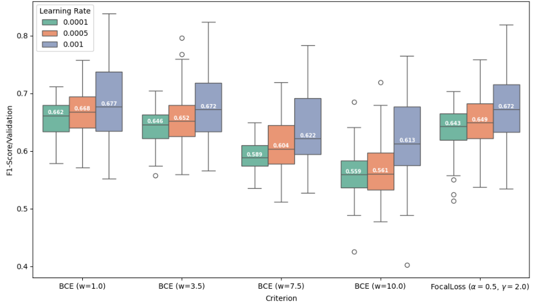
<figcaption style="text-align: center; font-size: 90%; color: darkseagreen"> Figure 13: Loss functions and learning rate determine the final performance. Each box represents 75 (5 seeds times 15 CV splits) runs. Visibly, highest medians (marked in white) are reached by the highest learning rate, while lower learning rates display less variance. BCE with positive class weight 1.0 performed best in this experiment. </figcaption>
</figure>
<br>

After training 75 models with each loss, we find that within the tested losses, BCE with no weight reaches the highest median F1-Scores for all learning rates. While others reach similar performance, we found no counter-indication to the usage of this most simple loss function. All further experiments used BCE without weights. In order to decide which learning rate works best, we took a look on the learning curves.

<figure style="text-align: center; margin-top: -20px;">
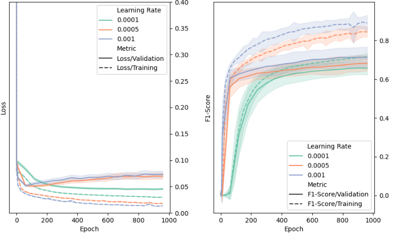
<figcaption style="text-align: center; font-size: 90%; color: darkseagreen"> Figure 14: Learning rates influence the convergence speed and stability. Each line represents 75 (5 seeds times 15 CV splits) runs. Bands represend standard deviation. Despite the slight overfitting suggested by the loss function at lr = 0.001, its F1-Score remains stable and consistently outperforms the scores at lr = 0.0005 and lr = 0.0001. </figcaption>
</figure>
<br>

It holds that a smaller learning rate guarantees a more stable convergence. Higher values face the danger of overfitting, which in this case is already apparent after epoch \\(60\\). We are however willing to trade 1-2 % of performance to receive a quicker training. Therefore, all further trainings were conducted using a learning rate of \\(0.001\\). Epochs were limited to 500. These parameters should provide convergence and still leave some room for improvements on more difficult tasks.

<h3 id="experiment-features"> Experiment 2: Which Features to extract? </h3>

<p align="center">
<table id="table-features">
  <tr>
    <th> Feature</th>
    <th> Description </th>
  </tr>
    <tr>
    <td> $$V_{ang}$$ </td> 
    <td> Voltage angle as measured/simulated on the true topology. </td>
  </tr>
  <tr>
    <td> $$ V_{mag} $$ </td> 
    <td> Voltage magnitude as measured/simulated on the true topology. </td>
  </tr>
  <tr>
    <td> $$\Delta V_{ang} (= V_{ang} - V_{ang}^{Map}) $$ </td> 
    <td> Difference between measured and simulated voltage angle </td>
  </tr> 
    <td> $$\Delta V_{mag} = (V_{mag} - V_{mag}^{Map}) $$</td>
    <td> Difference between measured and simulated voltage magnitude. </td>
  </tr>
  <tr>
    <td> $$B$$ </td> 
    <td> Indicates whether a bus is a building connection point (True) or not (False). </td>
  </tr>
</table>
</p>

In the previous algorithm design, four features were extracted from the grids to build the input tensor: \\(V_{ang} \\),  \\( V_{mag} \\) \\(\Delta V_{ang} \\) and \\(\Delta V_{mag} \\). As noted above however, we can not rely on \\(V_{ang} \\) and thus \\(\Delta V_{ang} \\) to be accessible in sufficient numbers. We therefore were interested in model performance with the former big feature set versus a realistic feature set. We further wanted to know, what is the performance of each of those four features isolated. Finally, we also tagged each bus with a boolean building flag that indicates if a bus is an endpoint in a building or not (similar to bus type, but without slack bus). We wanted to know whether this is helpful information for the model. The table <a href="#table-features"> above</a> gives an overview about the features, experiment results are depicted <a href="#figure-features"> below</a>.
<figure style="text-align: center; margin-top: -20px;">
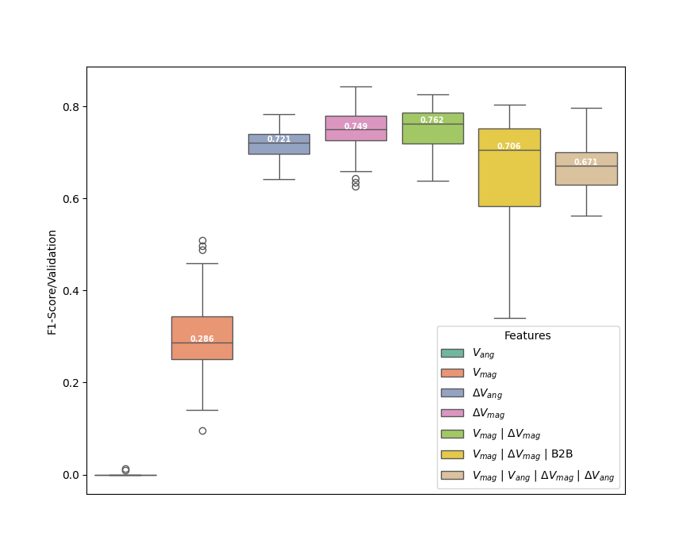
<figcaption style="text-align: center; font-size: 90%; color: darkseagreen"> Figure 15: Omitting voltage angle did not lead to performance loss but increased median (written in white) and best performance. Each box represents 75 (5 seeds times 15 CV splits) runs. </figcaption>
</figure>
<br>

Surprisingly - and contrary to the results of a hyperparameter study in the previous thesis <a href="#ref12"> [12] </a> - the two best performing feature combinations were \\(\Delta V_{mag} \\) and \\(V_{mag} | \Delta V_{mag} \\), reaching medians of 0.749 and 0.76 respectively, followed by \\(\Delta V_{ang} \\). On the other hand, the previously used feature combination \\(V_{mag} | V_{ang} | \Delta V_{mag} | \Delta V_{ang} \\) is lower in performance (median 0.671), probably due to containing redundant information, and the feature combination reaches \\(V_{mag} | \Delta V_{mag} | B \\) with 0.709 a good median performance but works quite bad on some CV splits. Interestingly \\(V_{mag}\\) (but not \\(V_{ang} \\)) can be used to a small extent for error detection. The reason for this we see in possible overloadings when placing exceptional lines. Another explanation might be the relative proximity of \\(V_{ang} \\) values, compared to the slack bus. Overall, the feature selection study can be regarded as very encouraging: If we restrict the feature set to realistically available features, we even reach higher performance.

<h3 id="Noise"> Experiment 3: Realistic Noise </h3>

In the previous algorithm design, data was assumed to be measured perfectly, i.e. without noise. This assumption is not very realistic. Luckily, since smart meters are subject to calibration laws, we have an exact estimate of what noise levels to expect: The worst-case scenario features a metering device of accuracy class 'A' and thus an allowed deviation of maximally 4 % when gauging or maximally 8 % when operating <a href="#ref17"> [17] </a>. However, there is no reason to assume, that we will face these extreme deviations systematically. To experts at Fraunhofer ISE, 2 % gaussian noise at each metering device at any point in time already seem "a lot".

In order to simulate noise onto a grid's feature tensor \\(X\\), we created an identically-sized Gaussian noise tensor \\(N\\) with mean \\(\mu=1\\) and different standard deviations \\(\sigma\in [0.00, 0.01, 0.02, 0.03, 0.04, 0.05, 0.06, 0.07]\\). We then multiply this noise tensor element-wise with \\(X\\). <a href="fig16"> In the figure below</a>, we display the effect of these different noise levels in the validation set on the F1-Score:
<figure style="text-align: center; margin-top: -20px;">
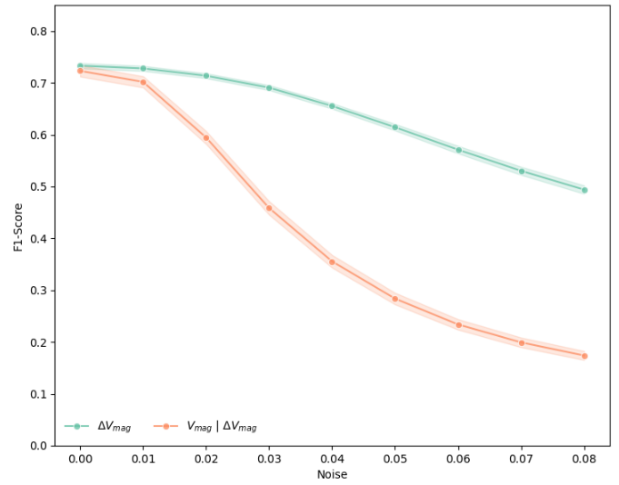
<figcaption style="text-align: center; font-size: 90%; color: darkseagreen"> Figure 16: The smaller feature set appeared more robust to noise. Each mark represents 75 (5 seeds times 15 CV splits) runs. Bands display standard error. </figcaption>
</figure>
<br>

The feature combination \\(V_{mag} \\) is far more robust to noise than the feature combination \\(V_{mag} | \Delta V_{mag} \\). In order to enhance the model's robustness to noise in the validation data, an obvious idea is to inject noise also in the training data. However, as shown <a href="#fig17"> in Figure 17 </a>, this makes no difference for the already highly robust feature set \\(V_{mag} \\). And while it does make a difference for \\(V_{mag} | \Delta V_{mag} \\), this difference does not close the gap with the other feature set. Thus, to achieve a more robust pipeline, we reduce the feature set to \\(V_{mag} \\). 

In all experiments that follow, data was evaluated at a noise level of \\(2 %\\). \\(V_{mag} \\) was used as the only feature.
<figure style="text-align: center; margin-top: -20px;">
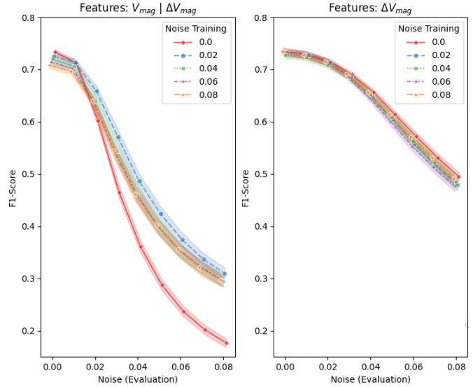
<figcaption style="text-align: center; font-size: 90%; color: darkseagreen"> Figure 17: Additional noise during training only increased the noise robustness of the less robust feature set. Each mark represents 75 (5 seeds times 15 CV splits) runs. Marks were slightly shifted for visbility. Bands display standard error. </figcaption>
</figure>
<br>

<h3 id="smart-meter-penetration"> Experiment 4: Realistic Smart Meter Penetration </h3>

In Germany in 2024, a lack of smart meters and thus missing data points in our measurement data is a major issue. German DGs have to catch up on the European smart meter rollout, as the following overview shows:
<figure style="text-align: center; margin-top: -20px;">
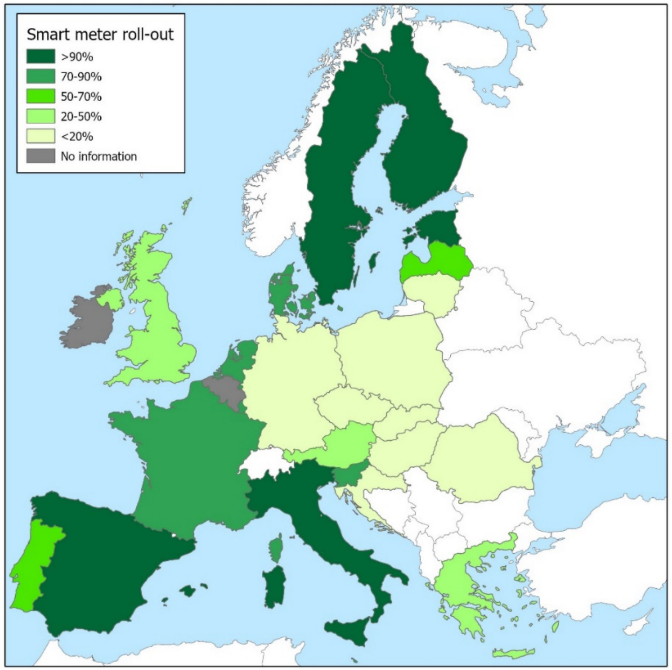
<figcaption style="text-align: center; font-size: 90%; color: darkseagreen"> Figure 18: Progress of the smart meter rollout in the European Union (2022) <a href="#href31"> [31] </a>. Germany is way behind, but plans on catching up till 2030.  </figcaption>
</figure>
<br>

Beyond that, the mere presence of a smart meter is no guarantee for available measurement data, since the measured results usually are subject to national and international data privacy regulations. Thus, it is hard to forecast the exact percentage of available measurements the algorithm has to work with, since this value varies from grid to grid. In consequence, we will look at multiple scenarios simultaneously and aim to name a necessary minimum of smart meter penetration. Experimentally, we reduced the data availability by setting the feature vector of every "non-available" bus to 0.0.
<figure style="text-align: center; margin-top: -20px;">
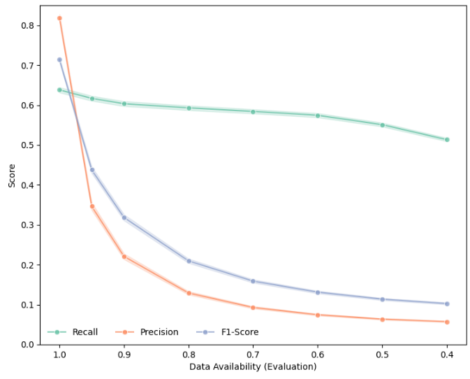
<figcaption style="text-align: center; font-size: 90%; color: darkseagreen"> Figure 19: Decreasing the percentage of measured buses drastically decreased the models precision and thus the F1-Score. Each mark represents 75 (5 seeds times 15 CV splits) runs. </figcaption>
</figure>
<br>

Sadly, the lack of data leads very quickly to a drop in the F1-Score, due to very poor precision. In its current form, the algorithm can only effectively operate on fully visible low-voltage grids. Again we try to mitigate the issues with specialised training under reduced data availability.
<figure style="text-align: center; margin-top: -20px;">
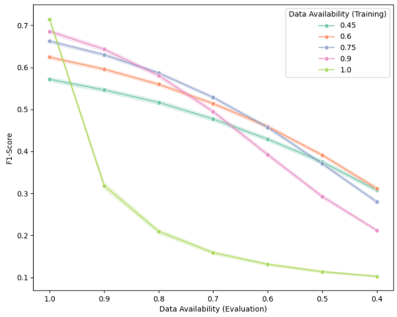
<figcaption style="text-align: center; font-size: 90%; color: darkseagreen"> Figure 20: The best choice for the data availability in the training set heavily depended on the data availability in the validation set. Each mark represents 75 (5 seeds times 15 CV splits) runs. </figcaption>
</figure>
<br>

Training with incomplete data does in fact help. As the data shows, you want to train with a smart meter penetration roughly 5-10 % higher than what you expect to face in the grid you want to classify. Nevertheless, performance loss becomes critical, especially when evaluating a grid with less than 70 % smart meter penetration. And in Germany, at least in the next five years, 70 % represents an unrealistic high value for an arbitrary grid. Therefore, addressing low smart meter penetration is an important topic for future research.

<h3 id="Realistic Errors"> Experiment 5: More Realistic Errors </h3>

Up to now, the errors to detect were chosen at random, i.e. following the pseudo code:

```pseudo
INPUT: grid

WHILE TRUE:
    (bus0, bus1) <-- random line from grid (given by start and end node)
    new_bus <-- randomly pick a bus from grid other than bus0 & bus1
    new_line <-- randomly choose between (bus0, new_bus) and (bus1, new_bus)
    new_grid <-- delete line (bus0, bus1) from grid and add new_line
    if new_grid is connected:
        RETURN new_grid  # Break if a connected grid is found.
        
```

This resulted in very obvious errors, such as long lines stretching over the grid. 

<figure style="text-align: center; margin-top: -20px;">
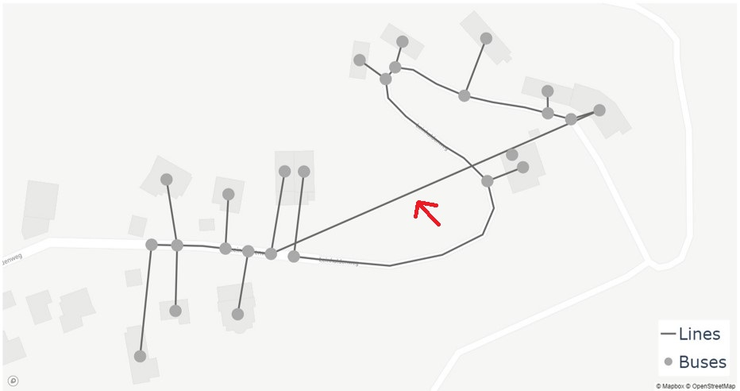
<figcaption style="text-align: center; font-size: 90%; color: darkseagreen"> Figure 21: Sample result of error generator. Mistake (marked by red arrow) might be fairly obvious to the human eye. </figcaption>
</figure>
<br>

However, in reality, very obvious errors rarely remain undetected. We therefore reworked the error generator to create more subtle errors. It should be able to avoid lines between buildings (B2B lines). Furthermore, when adding a line to the grid, the generator should prefer shorter lines over longer ones. Here is the implemented pseudo-code, where adjacency matrix refers to the symmetric matrix that has 1's in row i and column j if node i and j are connected by a line:

```pseudo
INPUT: grid, distance_weight, num_errors, building_connections_allowed

distance_matrix <-- determine distance between all nodes
weight_matrix <-- (1 / distance_matrix) ** distance_weight
adjacency_matrix <-- grid's adjacency matrix 
possible_new_lines <-- 1 - adjacency_matrix

if not building_connections_allowed:
    possible_new_lines <-- remove lines between buildings from possible_new_lines

errors = 0

WHILE errors < num_errors
    (bus0, bus1) <-- random line from grid (given by start and end node)
    grid <-- remove (bus0, bus1) from grid
    
    if grid is connected: # grid can still be connected due to redundant lines
        NEXT ITERATION
    
    subgrid_0, subgrid_1 <-- get connected sub_grids
    new_bus_0 <-- choose random bus from subgrid_0
    candidates <-- row of possible_new_lines indexed by new_bus_0
    probabilities <-- row of weight_matrix indexed by new_bus_0, normalized
    (new_bus_0, new_bus_1) <-- choose from candidates with probabilities
   
    grid <-- add line (new_bus_0, new_bus_1) to grid
    
    possible_new_lines <-- remove (new_bus_0, new_bus_1) from possible_new_lines
    errors += 1

        
RETURN grid
```

Note that setting the distance weight to \\( 0 \\) will result in all weights being equal. In this case the new error generator ignores distances like the old generator did. There is however a crucial difference between the two generators: The old error generator only reroutes one line. This results in 3 red nodes. The new error generator, on the contrary, removes one line and then adds a new one between the potentially resulting disconnected subgrids. As a result, this mechanism can create up to four red nodes.

We re-generated the dataset as described above with the distance weights 0.0, 1.0, 3.0, 5.0, and 7.0. We also allowed connections between buildings (B2B True) or forbade them (B2B False). Next, we looked at the difference in total cable length between each generated variation and its original grid. We plotted representative results for three grids.
<figure style="text-align: center; margin-top: -20px;">
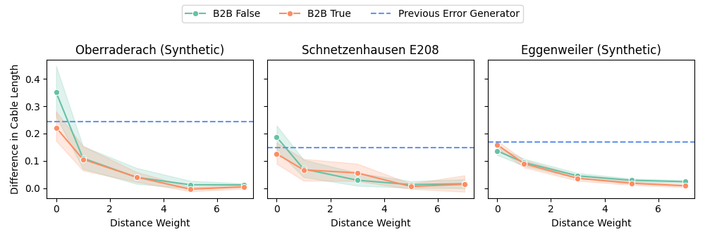
<figcaption style="text-align: center; font-size: 90%; color: darkseagreen"> Figure 22: When using a higher distance weight the variations generated by the new error generator deviate less (in length) from the original grid. Each mark represents average of 150 variations. Bands represent standard deviation. Blue line was added for comparison with old error generator.  </figcaption>
</figure>
<br>

From this experiment we gained three important insights:

<ol>
	<li> With distance weight 0, the generated results are indeed comparable to the previous dataset.
	<li> If we increase the distance weight, we get indeed shorter grids.  
	<li> In terms of grid size, the influence of allowing connections between buildings (B2B connections) is neglectable.
</ol>

Furthermore, we expected the datasets with shorter connections to be harder to classify. We also predicted that datasets with B2B connections are easier to classify than those without. We tested this hypothesis by training the model on the new datasets and comparing the performance to previous runs (blue line). The results were gained with 100 % data availability and 2 % noise.
<figure style="text-align: center; margin-top: -20px;">
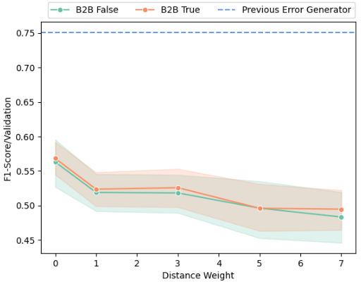
<figcaption style="text-align: center; font-size: 90%; color: darkseagreen"> Figure 23: F1-Score on different Datasets. Each mark represents average of 75 runs (5 seeds times 15 CV splits). Bands represent standard deviation. Blue line marks performance on the dataset generated with old error generator. The F1-Score for models trained on the new datasets is far lower than the F1-Score for models trained on the previous datasets. The experiment also suggests variations created with a higher distance weight are harder to classify on average. </figcaption>
</figure>
<br>

Surprisingly, the model's performance is far worse than its performance on the old dataset (difference in F1-Score 0.18). Since this is also the case for a distance weight of 0 and both B2B settings, neither the grid's length nor the absence of B2B connections can be the sole cause for this observation. One possible explanation for this difference is the increased number of errors in the output of the new error generator.
<figure style="text-align: center; margin-top: -20px;">
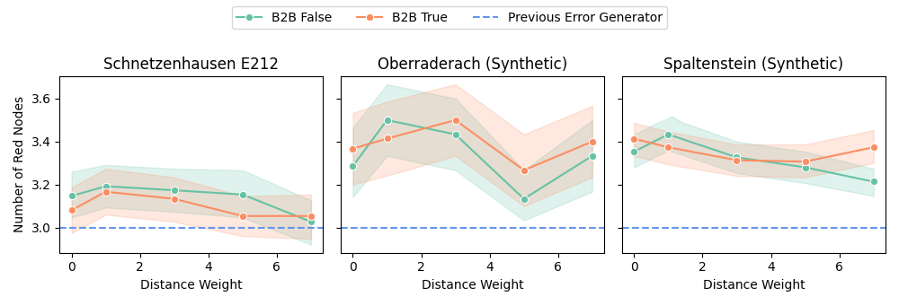
<figcaption style="text-align: center; font-size: 90%; color: darkseagreen"> Figure 24: The new error generator creates often more than 3 red nodes. Each mark represents average of average of 50 variations. Bands represent standard deviation. </figcaption>
</figure>
<br>

This shift in the number of errors might (partially) explain the performance drop. We also observed a difference in variance of the node feature \\(\Delta V_{mag}\\).
<figure style="text-align: center; margin-top: -20px;">
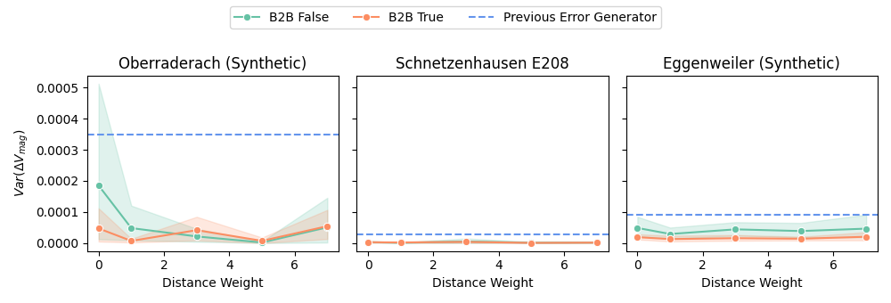
<figcaption style="text-align: center; font-size: 90%; color: darkseagreen"> Figure 25: The average voltage magnitude difference for all created grids was higher in the old datataset. Each mark represents average of 600 samples (50 variations times 3 scenarios time 4 snapshots) and their respective buses.  </figcaption>
</figure>

There is quite a gap between the mean variance of \\(\Delta V_{mag}\\) in the old dataset compared to the new one, where the variance is higher in the old dataset. Inputs with a higher variance in \\(\Delta V_{mag}\\) could possibly be easier to detect. This raises the question, where this variance comes from. Apart from the topology, one important influence on the variance of \\(V_{mag}\\) concerns a topic we have omitted so far: The exact time-step of measurement that is given as input to the GNN. Since there tends to be more grid activity in the evening, errors in the grid cause larger differences between \\(V_{mag}\\) and \\(V_{mag}^{*}\\). In the previous Master's Thesis the following observation was made "On average, there is a higher probability of identifying and correcting
errors in the evening hours between 5 pm and 11 pm." For the grids generated with the new error generator, we thus sampled the node feature timesteps from this range. However the old datasets were created with timesteps from the whole day.
<figure style="text-align: center; margin-top: -20px;">
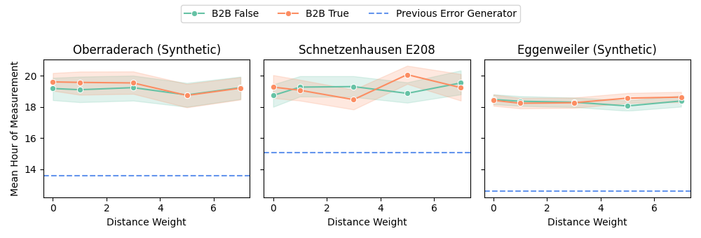
<figcaption style="text-align: center; font-size: 90%; color: darkseagreen"> Figure 26: The average hour of measurement the old dataset (blue line) was chosen lower for all grids. Each mark represents average of 600 samples (50 variations times 3 scenarios time 4 snapshots). </figcaption>
</figure>
<br>

Now this raises the question: If we reconducted the experiment with a wider range of timesteps, how would the model's performance develop? Well, if you are interested in timestep selection or possible aggregation of multiple timesteps, you should stay tuned for the next publication on this topic.

<h3 id="everything"> Experiment 6: Putting all factors together </h3>

Putting all factors together, that is, if we evaluate the model on \\(2 %\\) gaussian noise, different data availabilities and datasets created by the new error generator with distance weights in \\(\{0.0, 5.0\}\\), we observe - as expected - poor performance. 
<figure style="text-align: center; margin-top: -20px;">
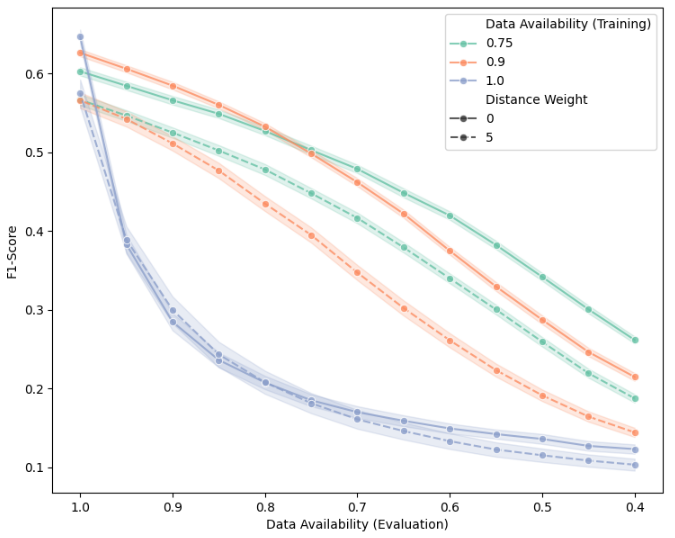
<figcaption style="text-align: center; font-size: 90%; color: darkseagreen"> Figure 27: Specialised training helps, but F1-score is strongly diminished in a more realistic setting. Each mark represents average of 75 runs (5 seeds times 15 CV splits). </figcaption>
</figure>
<br>

Though we never specifically defined, which F1-Score we aim for, the results of a classifier with a F1-Score below 0.6 do not appear trustworthy.

<h2 id="Conclusion"> Conclusion </h2>

This work aimed at investigating the performance of a previously designed GNN in a more realistic setting. We prepared large experiments by comparing different loss functions and learning rates to ensure we have an efficient training pipeline. We then looked at different feature combinations. It turned out that \\(V_{ang}\\), which is not realistically available, is not needed for our method. Further considering noise in the measurements, it looks like we are best off with one feature, namely \\(\Delta V_{mag}\\), and noise seems to be only a minor issue then. When investigating different data availabilities, however, we quickly ran into lower F1-Scores. We finally also created an error generator that generates more subtle error in the grid and showed that exchanging the old datasets with these new ones, leads to further performance loss. 

In conclusion, our algorithm does not deliver high-performing error detection yet. In principle, a GNN could be used for this task, even in a more realistic setting, but especially the lack of measurement data and more subtle errors are a big challenge. But, there are levers to increase the algorithm's performance in future work. Quick fixes include hyperparameter optimization and the optimization of time-step selection. More sophisticated improvements could be the aggregation of different time steps or the incorporation of methods of state estimation <a href="#ref33"> [33] </a>. In a few years, the grid operator's dream might thus become reality.


<footer>
    <h2 id="footnote-label"> References </h2>
    <ol>
        <li id="ref1"> https://en.wikipedia.org/wiki/Nodal_admittance_matrix </li>
        <li id="ref2"> UNFCCC, 2023, "COP28 Press Release," UNFCCC, https://unfccc.int/news/cop28-agreement-signals-beginning-of-the-end-of-the-fossil-fuel-era, accessed on 07.08.2023. </li>
        <li id="ref3"> https://en.wikipedia.org/wiki/Smart_grid </li>
        <li id="ref4"> Bundesnetzagentur, 2022, "Monitoring Report 2022," p. 43, https://www.bundesnetzagentur.de/EN/Areas/Energy/DataCollection_Monitoring/start.html, accessed on 03.11.2023. </li>
        <li id="ref5"> D. Deka, et al., 2023, "Learning Distribution Grid Topologies: A Tutorial", arXiv, 27.04.2023, arXiv:2206.10837, https://doi.org/10.48550/arXiv.2206.10837. </li>
        <li id="ref6"> https://en.wikipedia.org/wiki/Power-flow_study </li>
        <li id="ref7"> W. Yuan, et al., 2016, "Inverse Power Flow Problem," in IEEE Transactions on Control of Network Systems, vol. 10, no. 1, pp. 261-273, March 2023, doi: 10.1109/TCNS.2022.3199084. </li>
        <li id="ref8"> D. Deka, et al., 2016, "Estimating distribution grid topologies: A graphical learning based approach," 2016 Power Systems Computation Conference (PSCC), Genoa, Italy, 2016, pp. 1-7, doi: 10.1109/PSCC.2016.7541005. </li>
        <li id="ref9"> J. Yu, Y. Weng and R. Rajagopal, "PaToPa: A Data-Driven Parameter and Topology Joint Estimation Framework in Distribution Grids," in IEEE Transactions on Power Systems, vol. 33, no. 4, pp. 4335-4347, July 2018, doi: 10.1109/TPWRS.2017.2778194. </li>
        <li id="ref10"> G. Cavraro, V. Kekatos and S. Veeramachaneni, "Voltage Analytics for Power Distribution Network Topology Verification," in IEEE Transactions on Smart Grid, vol. 10, no. 1, pp. 1058-1067, Jan. 2019, doi: 10.1109/TSG.2017.2758600. </li>
        <li id="ref11"> Ardakanian, O., Wong, V. W., Dobbe, R., Low, S. H., von Meier, A., Tomlin, C. J., & Yuan, Y. (2019). On identification of distribution grids. IEEE Transactions on Control of Network Systems, 6(3), 950-960. </li>
        <li id="ref12"> Nolde, J. (2023). "Topology Error Identification in Electrical Distribution Grids with Graph Neural Networks," (Hochschule Furtwangen), </li>
        <li id="ref13"> https://pypsa.org/ </li>
        <li id="ref14"> https://en.wikipedia.org/wiki/Slack_bus </li>
        <li id="ref15"> Battaglia, P. W., et al., 2019, "Relational Inductive Biases, Deep Learning, and Graph Networks,", arXiv, 17.10.2018, arXiv:1806.01261, https://doi.org/10.48550/arXiv.1806.01261 </li>
        <li id="ref16"> S. Brody, et al., 2022, "How Attentive are Graph Attention Networks?", arXiv:2105.14491, https://doi.org/10.48550/arXiv.2105.14491 </li>
        <li id="ref17"> Directive 2004/22/EC of the European Parliament and of the Council of 31 March 2004 on Measuring Instruments, https://eur-lex.europa.eu/legal-content/en/ALL/?uri=CELEX%3A32004L0022, accesed on 12.01.2024. </li>
        <li id="ref18"> https://lackmann.de/hardware/elektrizitaetszaehler/mme </li>
        <li id="ref19"> https://www.emu-metering.de/ </li>
        <li id="ref20"> Aurelio, J. A., de Almeida, A. M., & de Castro, L. N., 2019, "Learning from Imbalanced Data Sets with Weighted Cross-Entropy Function," Neural Processing Letters, 50, 1937–1949. https://doi.org/10.1007/s11063-018-09977-1. </li>
        <li id="ref21"> Lin, T.-Y., Goyal, P., Girshick, R., He, K., & Dollar, P., 2017, "Focal Loss for Dense Object Detection," in 2017 IEEE International Conference on Computer Vision (ICCV), Venice, Italy, pp. 2999-3007. doi: 10.1109/ICCV.2017.324 </li>
        <li id="ref22"> Gesetz zum Neustart der Digitalisierung der Energiewende (GNDEW) of 20 May 2023 (BGBl. I S. 1234), https://www.recht.bund.de/bgbl/1/2023/133/VO.html, accesed on 28.01.2024. </li>
        <li id="ref23"> https://invenia.github.io/blog/2020/12/04/pf-intro/ </li>
        <li id="ref24"> https://en.wikipedia.org/wiki/Newton%27s_method#k_variables.2C_k_functions </li>
        <li id="ref25"> Dutta, R., Chakrabarti, S., & Sharma, A. (2020). Topology tracking for active distribution networks. IEEE Transactions on Power Systems, 36(4), 2855-2865. </li>
        <li id="ref26"> G. Cavraro and R. Arghandeh, "Power Distribution Network Topology Detection With Time-Series Signature Verification Method," in IEEE Transactions on Power Systems, vol. 33, no. 4, pp. 3500-3509, July 2018, doi: 10.1109/TPWRS.2017.2779129. </li>
        <li id="ref27"> Kipf, T. N., & Welling, M., 2016, "Semi-Supervised Classification with Graph Convolutional Networks," arXiv, 22.02.2017, arXiv:1609.02907, https://doi.org/10.48550/arXiv.1609.02907. </li>
        <li id="ref28"> Flynn, D., Pengwah, P., Razzaghi, R., & Andrew, A., 2023, "An Improved Algorithm for Topology Identification of Distribution Networks Using Smart Meter Data and Its Application for Fault Detection," IEEE Transactions on Smart Grid, vol. 14, no. 5, pp. 3850-3861. doi: 10.1109/TSG.2023.3239650. </li>
        <li id="ref29"> Directive 2009/72/EC of the European Parliament and of the Council of 13 July 2009 concerning common rules for the internal market in electricity and repealing Directive 2003/54/EC, https://eur-lex.europa.eu/LexUriServ/LexUriServ.do?uri=OJ:L:2009:211:0055:0093:de:PDF, accessed on 21.05.2024. </li>
        <li id="ref30"> Directive 2012/27/EU of the European Parliament and of the Council of 25 October 2012 on Energy Efficiency, amending Directives 2009/125/EC and 2010/30/EU and repealing Directives 2004/8/EC and 2006/32/EC, https://eur-lex.europa.eu/eli/dir/2012/27/oj, accessed on 23.05.2024. </li>
        <li id="ref31"> Vitiello, S., Andreadou, N., Ardelean, M. and Fulli, G., Smart Metering Roll-Out in Europe: Where Do We StandCost Benefit Analyses in the Clean Energy Package and Research Trends in the Green Deal, ENERGIES, ISSN 1996-1073, 15 (7), 2022, p. 2340, JRC123993.</li>
        <li id="ref32"> https://www.datacamp.com/tutorial/multilayer-perceptrons-in-machine-learning </li>
        <li id="ref33"> Abdel-Majeed, A., & Braun, M., 2012, "Low Voltage System State Estimation Using Smart Meters," 2012 47th International Universities Power Engineering Conference (UPEC), Uxbridge, UK, pp. 1-6. doi: 10.1109/UPEC.2012.6398598. </li>
    </ol>
</footer>
