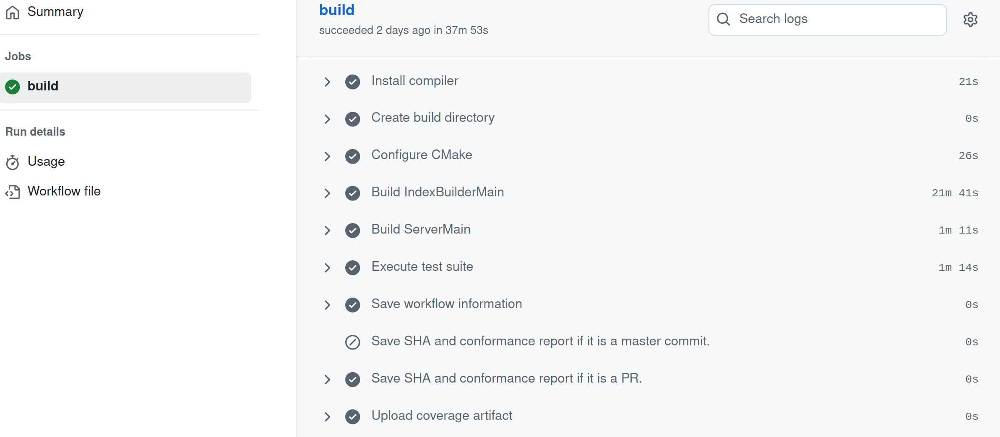
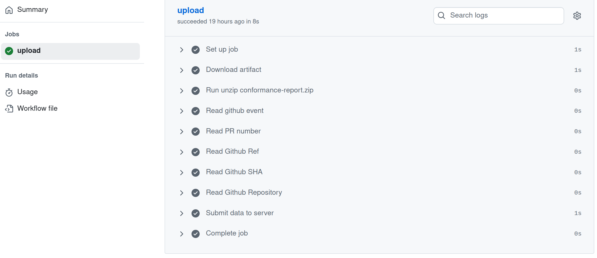
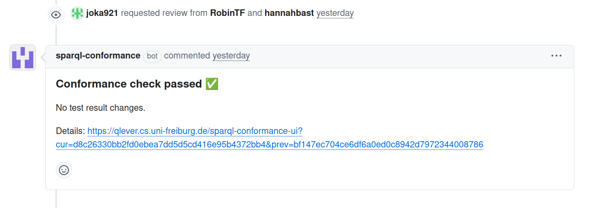
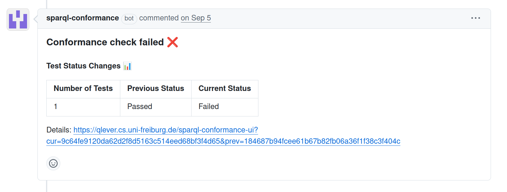
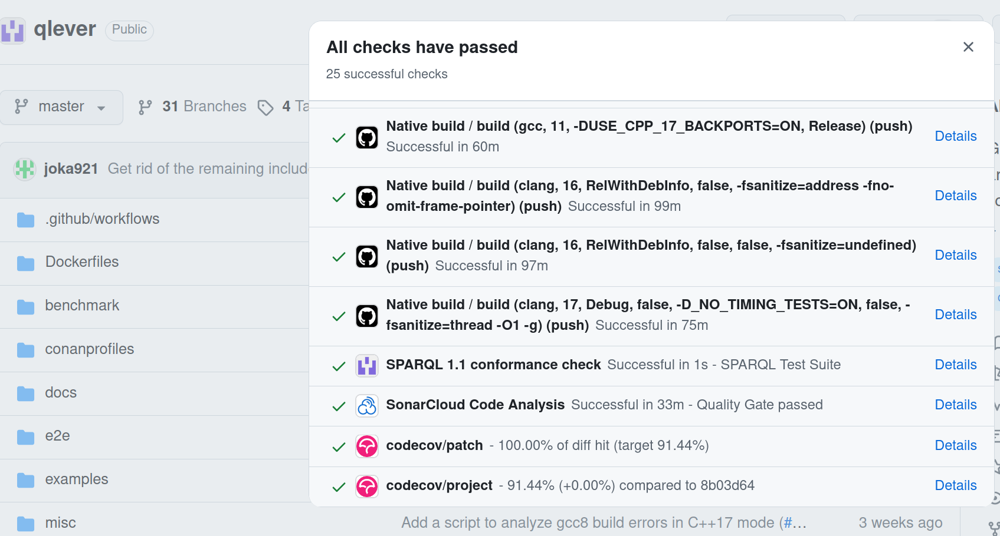

TODO SUMMARY

---

## Content
1. [Introduction](#intro)
2. [Adding Conformance Testing into the GitHub CI/CD](#auto)
3. [Working With The Results: Server, Website & GitHub Bot](#working)
4. [Local Testing with qlever-control](#local)
5. [Conclusion](#conc)

----

## 1. Introduction {#intro}
One of the challenges in software development is confidence, knowing that the changes you make today won’t quietly break features or standard conformance that worked yesterday.

For my master’s project, I focused on this issue in QLever, a SPARQL query engine which is under active development. With frequent pull requests and new features being added, it’s crucial to ensure that changes don’t come at the cost of functionality or adherence to the SPARQL standard.

During my [bachelor’s thesis](https://ad-blog.informatik.uni-freiburg.de/post/automated-standard-compliance-testing-for-qlever/), I had already worked on making the official SPARQL 1.1 conformance test suite executable against QLever and the results showed that QLever passed 23.83% of the conformance tests.  Since QLever aims to be 100% standard conformant, extending this work into a fully automated workflow was the natural next step to target higher conformance and make sure to not break existing conformance by spotting regressions early.

Instead of relying on manual testing or hoping reviewers catch regressions, I set out to design a workflow that would make conformance testing easy, automatic, and developer-friendly. The core idea: integrate the SPARQL conformance test suite into QLever’s CI/CD pipeline, extend it with visualization and feedback mechanisms, and give developers the tools to run the tests locally.

You will see how the GitHub workflows, a result server, a visualization website, a GitHub bot, and local developer tools work together as one complete workflow enabling developers to check conformance using two ways: automatically through CI & the Github bot, and instantly on their own machines.

## Adding Conformance Testing into the GitHub CI/CD {#auto}
The first step was bringing the SPARQL test suite into QLever’s already existing CI/CD system which is GitHub Actions.


**What is GitHub Actions?**

GitHub Actions is GitHub’s native automation platform that lets you create CI/CD pipelines directly inside a repository. In this case `adfreiburg/qlever`. Instead of relying on external tools, you define automation steps in so called workflows which are YAML files stored in a repository. These steps can cover everything from running programms, scripts, building artifacts, to deploying applications. The real benefit is that a CI/CD lives right next to your code and you use GitHub both for versioning and the CI/CD flow.

**What are Workflow Files?**

A workflow file is a YAML configuration file placed inside the `.github/workflows/` directory of a repository. Each workflow defines:

- When it should run, for example on every push, pull request, or on a schedule.
- Where it should run, for example GitHub-hosted Ubuntu runners, or self-hosted runners (your own custom machines).
- What jobs and steps to execute, for example installing dependencies, running programms, saving artifacts or uploading files.


Example workflow:
```yml
on:
    push:
        branches: [ master ]
    pull_request:
        branches: [ master ]
jobs:
    build:
        runs-on: ubuntu-22.04
    steps:
        - name: Checkout sparql-test-suite-files
            uses: actions/checkout@v3
            with:
                repository: "w3c/rdf-tests"
                path: sparql-test-suite

        - name: Install python dependencies
            run: |
             python -m pip install --upgrade pip
             pip install requests
             pip install rdflib
    .
    .
    .
```

To add my automated SPARQL conformancew test suite execution tool to Github Actions I created two seperate workflows:

**1. One which runs the tool:**

This workflow is triggered whenever code is pushed to the master branch, or when a pull request targets master. The first part of the workflow builds QLever from source using Clang and CMake on a fresh Ubuntu runner. It then fetches both the official W3C SPARQL test cases (`w3c/rdf-tests`) and the SPARQL conformance tool (`adfreiburg/sparql-conformance`) to prepare the testing environment.

Once the setup is complete, the workflow executes the full SPARQL 1.1 conformance suite against the newly built QLever binaries. The results of this execution are stored in a compressed JSON file, which records exactly which queries passed and which ones failed plus additional information for example the qlever server logs. To make the results traceable, the workflow also collects metadata such as the commit SHA and the event type that triggered the run.

Finally, the workflow saves these test results and metadata as an artifact. This ensures that the conformance report can be uploaded, shared, and reused later in other workflows or for long-term useage. In practice, this means that every change to QLever, whether it’s a direct commit or a proposed pull request, is automatically validated against the official SPARQL standards, giving developers immediate and reliable feedback.




**2. One which uploads the result file of the tool:**

The second workflow is responsible for uploading the results produced by the SPARQL conformance tests. It does not run on its own but is triggered automatically whenever the sparql-conformance workflow finishes. To make sure only valid results are processed, it runs only if the preceding workflow has completed successfully.

The workflow starts by downloading the artifact produced by the conformance tests. Using the GitHub Actions API, it locates the artifact named conformance-report, downloads it as a ZIP file, and unpacks it into the workspace. This archive contains the test results as well as metadata such as the commit SHA, pull request number, event type, and repository reference. Each of these metadata values is read from the files created by the first workflow and written into environment variables, so they can be used in the next steps.

Once the data is prepared, the workflow securely submits it to the conformance results server. The server URL and API key are passed as environment variables, with the API key stored in GitHub Secrets to keep it secure. The results JSON file, compressed with bz2, is uploaded together with the associated metadata using a curl request.

After the submission, the workflow checks the server’s response. If the upload was successful, the server returns an HTTP 200 status code. Any other response is treated as a failure, which causes the workflow to stop and report the error.

In short, this workflow acts as the bridge between GitHub and the external conformance results server: it takes the reports generated by the first workflow, attaches the necessary metadata, and ensures that the results are reliably and securely stored on a dedicated server for further analysis and long-term storage.



## Working With The Results: Server, Website & GitHub Bot {#working}

Having test results is one thing. Making them useful to developers is another. A raw result file stored somewhere on a server won’t help much unless developers can easily access it, understand it, and act on it.

To solve this, I built three layers on top of the CI outputs: a server, a website, and a GitHub bot. Together, they turn raw data into actionable feedback for the developer.

**The Result Server: Centralized Data Management**

The server handling the result files is a lightweight service using Node.js whose job is to receive uploads from GitHub Actions, store the result files, and serve them on demand.
This centralization solves several problems:
- Persistence: Results are stored as long as needed.
- Access: Multiple clients (website, bot, developers) can fetch the same data.
- Consistency: Everyone sees the same results for a given commit.

The implementation uses `Multer`, a `Node.js` middleware for handling `multipart/form-data`, to manage uploads efficiently.
Each request must include a valid API key in the headers (`x-api-key`), which is verified before any data is accepted. Unauthorized uploads immediately return a 403 Forbidden response, which is a simple but effective security measure that ensures only trusted pipelines can submit results.

Uploaded files are written to a dedicated results/ directory and the filename is preserved.

**The Website: Visualization and Comparison**

With results available from the server, the next step was to use the results and make them comparable.
I built a website that connects to the server and displays the test outcomes in a structured way.

Key features include the ability to browse by commit, allowing developers to view the conformance status of any uploaded commit, and a comparison view that enables side-by-side analysis of two commits, often a pull request against the master branch. This comparison is especially valuable during code reviews, as it eliminates the need to run tests manually to catch regressions. Reviewers can instantly see which tests passed before and now fail, which tests failed before and are now fixed, and whether the pull request alters the overall conformance. By providing a clear, visual summary, the website makes catching conformance regressions an easy part of the review.

**The GitHub Bot: Feedback Where It Matters**

Even with a dedicated website, developers might not always check results proactively, so to make feedback unavoidable, I built a GitHub App (bot) that integrates directly into pull requests. Using the GitHub API, the bot posts a comment summarizing whether the pull request passes the test suite, highlights exactly how many tests have changed compared to the master branch, and continuously updates its comment as new commits are pushed. This approach keeps developers within their normal workflow, they don’t need to switch or open a new tab because the conformance feedback appears directly in the pull request discussion alongside code reviews and CI status checks.

The GitHub App code is triggered when a successful upload happened and the "result server" then acts as a custom GitHub App, using `@octokit/rest` and `@octokit/auth-app` to authenticate as an installation. This allows it to perform privileged actions such as:

1. Creating or updating check runs that appear in the GitHub UI under the “Checks” tab.

2. Posting and deleting comments on pull requests with detailed test result summaries.

The current master commit result file is compared to the result file that triggered the process after that it marks the check as “success” or “failure.” Meanwhile, it also keeps pull requests clean by deleting old comments before posting fresh ones, ensuring that the PR conversation always shows the most current test result summary.







Together, the server, website, and bot form a complete feedback ecosystem: the CI runs the tests and uploads results, the server stores and serves them, the website visualizes them for deeper inspection, and the bot summarizes them in GitHub for immediate action. Each component builds on the previous one, transforming data into accessible, actionable insights that seamlessly integrate into the development process.

## Local Testing with qlever-control {#local}
Waiting for CI pipelines can be frustrating, especially for projects with long build times. To address this, I extended qlever-control, QLever’s command-line tool, to support local conformance testing. This allows developers to run the full test suite against a local QLever binary or QLever in container and to analyze individual tests by automatically building the required index, starting a local server, and enabling interactive querying. This setup lets developers reproduce and debug failing tests locally before opening or updating a pull request. By executing tests locally, developers get immediate feedback without waiting for CI pipelines to complete, saving time and costs. It also encourages earlier detection of issues. Catching bugs before code is pushed also ensures shorter review cycles and a more effecient development workflow.

## Conclusion {#conc}
Since integrating the automated SPARQL conformance testing workflow, QLever’s conformance has improved dramatically. When I first began this work, QLever successfully passed only 23.83% of the official conformance tests. Today, it passes 75.3%, and if we also count the “semi-passed” tests, cases where QLever intentionally diverges from the SPARQL standard, the success rate rises to 87.6%.

This progress isn’t just a number. It shows how continuous testing, automated feedback, and transparent result visualization can directly guide development toward higher standards conformance. By making it easy to see where QLever’s results differed from the expected outcomes, developers could systematically identify, understand, and fix gaps in conformance.

Equally important, the workflow now acts as a safety net: every new pull request is automatically tested, preventing regressions before they reach the main branch.

Integrating SPARQL conformance testing into CI/CD didn’t just improve QLever’s conformance, it added another reliable workflow for the developers to maintain and improve the engine. QLever is closer than ever to full SPARQL standard conformance.

