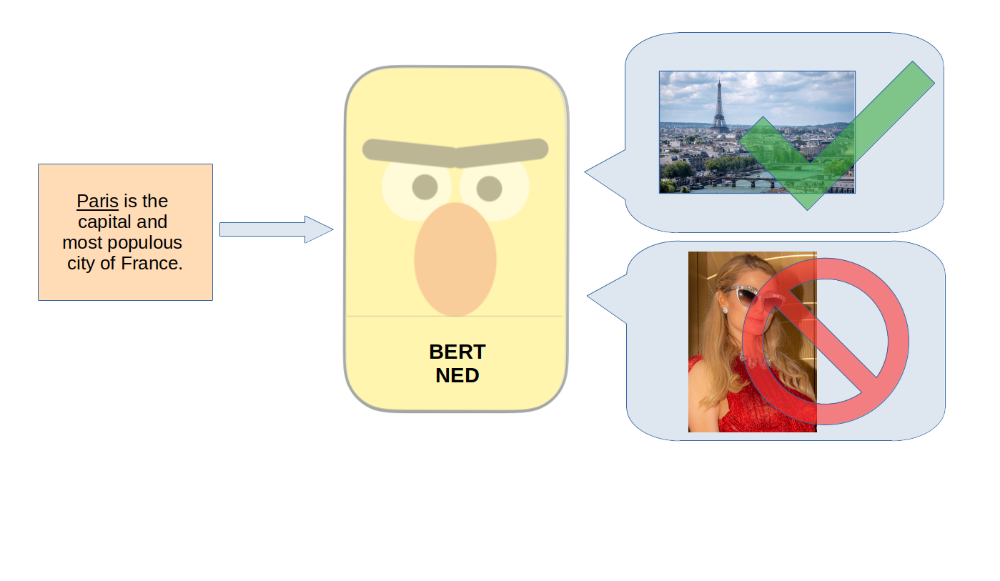
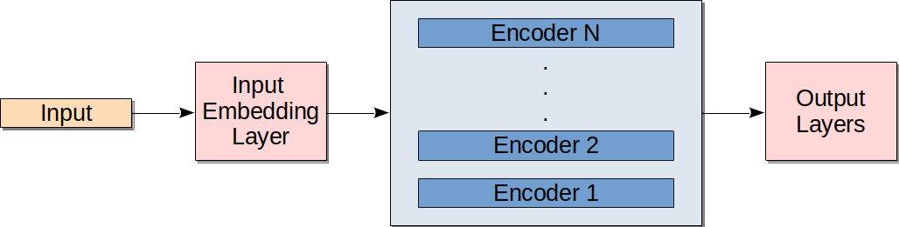
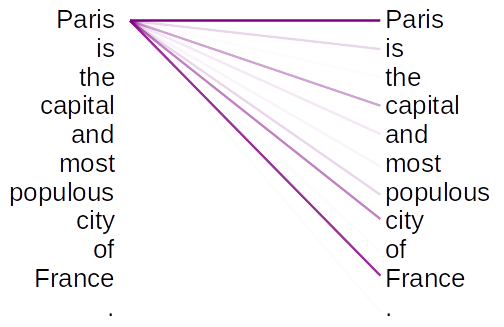
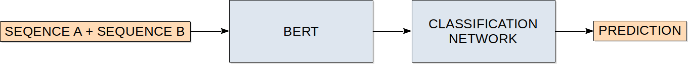

Large transformer networks such as BERT have led to recent advancements in the NLP field. The contextualized token embeddings that BERT produces should serve as good input to entity disambiguation, which benefits from context. This master project aims to use BERT on the task of Named Entity Disambiguation.

<!--more-->

# Content
- [Introduction](#intro)
- [BERT](#bert)
- [NER, Candidate Generation and Knowledge Base](#components)
- [BERT NED](#bert-ned)
- [Evaluation](#evaluation)
- [Reproducing the Results](#reproduce)
- [Summary and Future Work](#summary)

<!-- TODO: Keep up to date ^ -->

# 1. Introduction {#intro}

## Named Entity Disambiguation (NED)

Knowledge extraction from natural language texts such as web sites and research articles is an important task in the field of Natural Language Processing (NLP). One aspect of knowledge extraction from documents is Named Entity Disambiguation (NED), which is useful in applications such as search engines.

For the sake of this article, **NED** [is defined](https://github.com/sebastianruder/NLP-progress/blob/master/english/entity_linking.md) as the task of finding the correct entity in a knowledge base for a mention of an entity in a document. A **named entity**, or **entity** for the sake of this article, is a unique object that can be referred to by a proper name. The **knowledge base** is the database of entities that we use. We refer to a **mention** as all the words that belong to a mentioned entity in a document. 

<div class="example">

For example, the sentence "Paris Hilton is visiting Paris this weekend" contains mentions of two entities: "Paris Hilton" and "Paris".

</div>

Finding these mentions is the task of **Named Entity Recognition (NER)**, and is often done before and independently of NED.

After NER, it is common to reduce the search for possible entities to a relevant subset of the knowledge base. The list of possible entities for a given mention is referred to as the **candidates** for that mention. The task of finding these candidates is called **candidate generation**. After the candidate generation step, the NED task is to **find the correct candidate** for each mention. 

<div class="example">

These three tasks — NER, candidate generation, and NED — are easily understood with an example. Consider the following two sentences:

* Paris is the capital and most populous city of France.
* Paris is an American media personality.

The NER system looks at these sentences and recognizes the mentions "Paris" and "France" in the first sentence, and "Paris" in the second.

</div>

The candidate generation system takes **only the mention** as input and outputs all the entities in the knowledge base that could be referred to with that name. 


<div class="example">

Consider the two mentions of "Paris" in the first and second sentence of our example; the candidate generation system takes only the text "Paris" as input, and so generates the same list of candidates for both mentions. The candidate list may be something like this: 

* Paris, capital and largest city of France;
* Paris Hilton, American socialite and media personality;
* Sven Paris, Italian boxer;
* etc.

</div>

When we look at the example sentences, we see from their contexts that they obviously refer to different entities of "Paris". To successfully find the right candidate in the NED step (i.e. to disambiguate), it is essential that we can use the context effectively.

<!-- TODO: Figure for NER + CG + NED with the example sentence here ??? -->

Natural language processing methods usually send the input text through a process of **word embedding**. Word embeddings are numerical vector representations of words. Embedding methods vary in how they use context to make these representations. 

[Word2vec](https://arxiv.org/abs/1301.3781) is a popular method that does not use context to represent individual words in a document. Both instances of "Paris", the city and the person, will have the same vector regardless of their contexts. 

In contrast to Word2vec, the neural network model "BERT" computes **highly contextualized** word embeddings. With word embeddings from BERT, the vector for the word "Paris" in the first sentence will have rich information about the rest of the sentence. So will the word "Paris" in the second context. This makes it possible to use BERT word vectors to reach our goal of distinguishing "Paris, France" from "Paris, the socialite" in the two example sentences. 


## Addressing NED with a Neural Network

In this article, we will arrive at a neural network model for NED which builds on the model known as [BERT](https://arxiv.org/abs/1810.04805v2). We rely on external libraries for NER and candidate generation. That way, the task of our model is reduced to **picking one of the proposed candidates** for a given mention.

We formulate the problem as a series of binary classifications (i.e. classification with only two target classes). For a mention with multiple candidates, we look at **each candidate separately**. For each mention-candidate-pair, we make a prediction to answer the *True or False* question "is this the correct candidate for this mention?". Finally, we choose the one candidate with the highest "True" prediction.
<!-- The mention is represented by the document text where the mention appears, while the candidate is represented by a the start of the Wikipedia article corresponding to this candidate. -->

</img>

In the [next section](#bert), we will have a close look at how the BERT model works, which we will later use for the NED task. 
In [Section 3](#components), we introduce the components we need to address the NER and candidate generation problems, which come prior to NED. 
Then, in [Section 4](#bert-ned), we put the pieces together and show how we propose to solve NED with the model dubbed "BERT NED", along with details on how to train this model.
[Section 5](#evaluation) is dedicated to the evaluation of the model, and its performance on various benchmark datasets.
For the curious reader, [Section 6](#reproduce) details how to reproduce the results from this article.
Finally, [Section 7](#summary) gives a short summary of the achievements presented in this article. 


# 2. BERT {#bert}

The neural network architecture called BERT (Devlin <i>et al.</i>) was introduced in 2018, and has become the state-of-the-art in many Natural Language Processing (NLP) tasks. In particular, BERT is interesting because of how well the **pre-trained model generalizes** to a wide array of NLP tasks. BERT also **uses context** very effectively to represent all the individual word tokens. As we have established, using the context of an entity is essential to solving the NED problem. This is exactly the observation that motivates us to use BERT for NED.

## Pre-trained BERT

BERT is pre-trained to learn a good **representation of language** before it is applied to any specific language tasks. In fact, BERT is pre-trained on two tasks ("Masked Language Model" and "Next Sentence Prediction"). 

<details>
  <summary>
    Further reading: About the two pre-training tasks. 
  </summary>

The two self-supervised tasks are dubbed "Masked Language Model" and "Next Sentence Prediction". Masked Language Model is a **token-level task**, where BERT predicts missing tokens in the input text. The tokens are replaced by a 'MASK' token. 

The Next Sentence Prediction task is a binary prediction task. Two sequences of text are either sampled sequentially from the same document, or are randomly sampled from different documents. The task is to classify whether they follow each other in the same document. This is a **sequence-level task**, which allows BERT to learn about higher level language contexts across two sentences or sequences of text.

The two tasks are learned jointly. In practice, that means they are combined in the same loss function (by summation), and trained at the same time. Both the tasks are **"self-supervised"**, which means that they train on unlabelled data by generating their own labels. The masking positions for the Masked Language Model task and the two sentences for the Next Sentence Prediction task are randomly sampled, and the label is known. Because the generation of training data is automated, it is easy to get a lot of training data.

</details>

The BERT model, after having trained on these two tasks, already performs well for many NLP tasks. We will later see that this includes our application to NED. If we choose to also **"fine-tune"** the model by training parts or all of the BERT model, we can expect an even better performance.

## Tokenization

BERT uses [WordPiece tokenizers](https://arxiv.org/pdf/1609.08144.pdf) to convert text to digestible input sequences. This particular tokenization scheme is good at dealing with rare words. It has a vocabulary of 30.000 tokens, some of which are whole words, and some word pieces.

<div class="example">

For example, the word "gibberish" turns into three tokens: <span style="font-family:monospace">['gi', '##bber', '##ish']</span>. The latter two tokens are part of the same word as the previous token, as characterized by the prepended '##'. On the other hand, the word "Paris" is simply tokenized as <span style="font-family:monospace">['paris']</span>, meaning that this word is part of the vocabulary. 

</div>

## Architecture

BERT's architecture has **three distinct components**: the input layer, a stack of "encoders", and output layers. We will look at each of these in turn.

The figure below shows the typical BERT architecture, with an input embedding layer, a stack of encoders and some output layers.

</img>

When passing the sequence of tokens to BERT, the tokens are represented by unique IDs. In the **input layer** of BERT, each of these token IDs are mapped to an initial **embedding vector** representing that token, which is learned during training. The initial vectors are "static embeddings", meaning they do not have any information about the context. Each token is represented by an embedding vector of size 768. This vector size is also used between all the internal ("hidden") layers of the model.

During pre-training, the BERT model has two **output layers**: one for the "Masked Language Model" task and one for the "Next Sentence Prediction" task. These are omitted after pre-training. Meanwhile, the rest of the network still has a good understanding of language from the pre-training phase. By appending new **task-specific output layers** to this architecture, the BERT model is ready to be trained for new tasks. 

The **encoders** between the input and output layer do all the heavy lifting. The first encoder takes the initial vector embedding from the input layer as input, and the subsequent encoders take the output of the previous encoder as input. If we have 512 input tokens, this is always a matrix of size 512 &times; 768, where 768 is the length of each token vector. 

Each encoder computes a **new vector representation** of the tokens from the vectors of the previous encoder. The new vector representation of a token is calculated using the vectors of all the other tokens. One can think of this as every token looking at every other token in the sequence to learn more about its own context. 

<details>
  <summary>
    Further reading: Bi-directionality puts the 'B' in BERT.
  </summary>

The 'B' in BERT stands for "bi-directional" exactly because each token can look both in front of and behind itself. This type of bi-directionality is believed to be a key ingredient in BERT's success at context understanding, and is an important difference to recurrent neural network (RNN) approaches such as "ELMo".

</details>

Though there are multiple encoders in BERT, they all have the same architecture. Most important is the so-called **"self-attention"** operation, of which there are multiple in parallel in each encoder. The parallel attention operations are called "attention heads". In short, self-attention is a weighted dot-product of the input tensor with itself. This is how each token can be represented by information from all other tokens.

<div class="example">

Take our two example sentences again:

* <i>Paris</i> is the capital and most populous city of France.
* <i>Paris</i> is an American media personality.

With the self-attention operation, the token for "Paris" in the first sentence will pick up information from all the other tokens in the sentence. In particular, the occurrence of "France" may be a strong hint that we are talking about the city rather than the media personality in the first sentence. Now we see why BERT is the master of context.

</div>

The figure below shows an example of how the word "Paris" may attend to the other words in the sentence when using self-attention. The strength of the line shows how much "Paris" attends to that word. The occurrences of "capital", "city" and "France" in the context seems to be particularly interesting. 

</img>

In the BERT architecture we use here, there are twelve encoders, and twelve attention heads in parallel in each encoder. The vector length is 768 for each token through the network. This architecture gives the model a total of around **110 million weights**. This exact architecture is commonly known as "BERT Base". We are treating all input to BERT as lower case (uncased), giving us the final architecture name, "BERT Base Uncased". 

<details>
  <summary>
    Further reading: Other BERT architectures.
  </summary>

The BERT architecture can be expanded to **different sizes**. Most notable are the BERT Base and BERT Large architectures. BERT architectures are defined by **three architectural hyperparameters**: the number of encoders L, the number of attention heads in each encoder A, and the size of the vectors in the hidden layers H.

<table style="background:white">
<thead>
<tr>
<th>Model</th>
<th>L</th>
<th>A</th>
<th>H</th>
<th>Total parameters</th>
</tr>
</thead>
<tbody>
<tr>
<td>BERT Base</td>
<td>12</td>
<td>12</td>
<td>768</td>
<td>110 M</td>
</tr>
<tr>
<td>BERT Large</td>
<td>24</td>
<td>16</td>
<td>1024</td>
<td>340 M</td>
</tr>
</tbody>
</table>

<!-- | Model | L | A | H | Total parameters |
| ---- | ---- | ---- | ---- | ---- |
| BERT Base | 12 | 12 | 768 | 110 M |
| BERT Large | 24 | 16 | 1024 | 340 M | -->

</details>

<details>
  <summary>
    Further reading: Special BERT tokens reveal some BERT secrets.
  </summary>

There are three **tokens** used in the BERT architecture that are worth remarking. We refer to them as **'CLS', 'SEP' and 'PAD'**, and they each teach us something about the internals of BERT.

The **'CLS'** ("classification") token is used during pre-training as the only input token to the Next Sentence Prediction classification layer. That means this token needs to store a lot of information on the coherence of the input sentences. That makes this token useful for classification tasks that relate to the whole input, or a contrast between two sequences.

The **'SEP'** ("separator") token is used during pre-training to separate the two sentences for the Next Sentence Prediction task. It becomes important for any tasks where we have two sequences as input. 
<!-- In our NED approach, the two sentences represent the mention and the candidate respectively. -->

The **'PAD'** ("padding") token is appended to sequences that are shorter than the input sequence length of 512 tokens. This is simply because BERT always expects inputs to have the same length of 512 tokens.
</details>

<details>
  <summary>
    Further reading: Three input vectors for BERT.
  </summary>

BERT requires **three input vectors** in total. They all have the same length. First, we have the tokenized input text sequence previously discussed. 

The second vector is important for tasks with two sequences. It is a binary vector with '0's in the position of tokens in the first sequence, and '1's in the position of the second sequence in the tokenized input token. 

The third vector is also a binary vector, and simply contains '1's where there are tokens in the tokenized input sequence, except for '0's where there are padding tokens.
</details>


# 3. NER, Candidate Generation and Knowledge Base {#components}

To lay the groundwork for entity disambiguation, we need to set up a full system with **Named Entity Recognition** and **candidate generation**. The [spaCy](https://spacy.io/api) library provides us with the means to perform these tasks. 

<!-- Specifically, we use a spaCy "language model" for entity recognition, and a spaCy "KnowledgeBase object" for candidate generation. -->

## NER

The first step of analysing an input document is NER. We use a spaCy [language model](https://spacy.io/api/language) for the task. We use the '[en_core_web_lg](https://spacy.io/models/en#en_core_web_lg)' language model to process an input document and tags words as named entities. 

<details>
  <summary>
  Further reading: The 'en_core_web_lg' language model.
  </summary>

The specific language model we use, 'en_core_web_lg', is around 742 MB large. It can perform many NLP tasks, but we only need it for NER. On the [models overview](https://spacy.io/models/en), spaCy suggests a precision of 86 % and recall of 85 % on named entities for this model.
</details>

<div class="example">

We will use the following sentence as an example to see how it is handled by the different parts of the system. By convention, we will refer to this sentence as the **"input document"**:

* Paris is the capital and most populous city of France.

Let us say the spaCy language model recognizes two mentions of named entities in the example input document:

* <i>Paris</i> is the capital and most populous city of <i>France</i>.

These two **mentions**, "Paris" and "France", are what we use in the next component of the system. 

</div>

## Candidate Generation and Knowledge Base

The Named Entity Disambiguation task requires a **knowledge base** as a **source of entities**. In our case, we are using a set of 4,111,690 Wikidata entities as our knowledge base.

All entities in Wikidata are ascribed a unique and persistent ID called "QID" (a number prepended with a "Q"). An entity in Wikidata may also have a number of aliases for that entity, which are useful when we are searching for candidates. 

<div class="example">

The Wikidata entry for Paris, the French capital, is [Q90](https://www.wikidata.org/wiki/Q90), with aliases such as "City of Light" and "Paris, France". The socialite Paris Hilton has the QID [Q47899](https://www.wikidata.org/wiki/Q47899), and no aliases. 

</div>

We use a [spaCy KnowledgeBase object](https://spacy.io/api/kb) to store our knowledge base. The KnowledgeBase object stores all the entities from Wikidata, along with the aliases of each entity. 

The KnowledgeBase object conveniently has a function for **candidate generation** which generates lists of candidates from the mentions recognized by the language model. The KnowledgeBase object returns all entities where the entity name or alias matches the mention. 

<div class="example">

Consider these two input documents where the NER tagger has found the two underscored mentions:

* <i>Paris</i> is the capital and most populous city of France.
* <i>Paris</i> is an American media personality.

When we send the mention "Paris" to the KnowledgeBase object it will return the **same list** of candidates for both these mentions, even if they are in two different contexts. For example, it might give us the following list:

* <span style="font-family:monospace">['Q90', 'Q47899', 'Q580498']</span>

We see that both "Q90" (the city) and "Q47899" (the American socialite) are among the candidates. This means that the candidate generation has done its job, and it is possible to disambiguate both mentions of "Paris" to their respective correct candidates.

</div>

# 4. BERT NED {#bert-ned}

After NER and candidate generation, the final step is to disambiguate mentions to one of their candidates. This is where we introduce our own **"BERT NED"** model. 

## Representation of the Mention and the Candidate

In the input layer, BERT expects two concatenated sequences of tokens with a total of 512 tokens. We tokenize the input document as the first sequence (Sequence A). The input document has the context for the mention. As the second sequence (Sequence B), we want a text that puts the candidate in context. To this end, we use the **Wikipedia abstract** of the candidate. 

The maximum sequence length of 512 tokens is **shared** between the input document and the Wikipedia abstract. We simply take the 256 first tokens of the tokenized Wikipedia abstract. If the abstract is shorter than 256 tokens, we include more of the input document. Longer tokenized input documents are cut to length to fill up the remaining space. We make sure to keep the part where the mention occurs, even if that means missing tokens in the beginning of the input document. If necessary, the sequences are padded with 'PAD' tokens at the end to reach the required length of 512 tokens. 

<div class="example">

We look at the example input document "<i>Paris</i> is the capital and most populous city of France."
Three candidates were found for the mention "Paris" by the candidate generation:

* <span style="font-family:monospace">['Q90', 'Q47899', 'Q580498']</span>

Each of the three candidates requires an input sequence of Sequence A + Sequence B. Sequence A, which comes from tokenizing the input document, is **common for all** the three candidate's input sequences:

* Sequence A: 
</br><span style="font-family:monospace">'CLS', 'paris', 'is', 'the', 'capital', 'and', 'most', 'populous', 'city', 'of', 'france', '.',  'SEP'</span>

The initial 'CLS' token is always prepended to BERT input sequences, and the final 'SEP' token says that this is the end of Sequence A. 

Sequence B, which is a chunk of the candidate's Wikipedia abstract, is **unique for each** of the three candidates:

* Sequence B:

  1. Candidate Q90:
</br><span style="font-family:monospace">
'paris', 'is', 'the', 'capital', 'and', 'most', 'populous', 'city', 'of', 'france', ',', 'with', 'an', 'estimated', 'population', 'of', '2', ',', '175', ',', '60', '##1', 'residents', 'SEP'
</span>

  2. Candidate Q47899:
</br><span style="font-family:monospace">
'paris', 'whitney', 'hilton', 'is', 'an', 'american', 'media', 'personality', ',', 'social', '##ite', ',', 'business', '##woman', ',', 'model', ',', 'singer', ',', 'actress', ',', 'and', 'dj', 'SEP'
</span>

  3. candidate Q580498:
</br><span style="font-family:monospace">
'sven', 'paris', 'is', 'an', 'italian', 'amateur', 'boxer', 'who', 'competed', 'in', 'the', 'light', 'welterweight', 'division', 'at', 'the', '2000', 'summer', 'olympics', 'SEP'
</span>

</div>

<!-- <details>
  <summary>
    Further reading: Required extra input vectors to BERT.
  </summary>

For each of the three input sequences above, we need to generate **two additional** input vectors for BERT: a binary vector with positional information about Sequence A and Sequence B, and a binary vector with position of padding tokens. You can find some more detail on this in [Section 2](#bert)
</details> -->


To sum up, we represent the **mention with the input document** and each **candidate with their Wikipedia Abstracts**. After generating the input vectors for each candidate, we are ready to feed them to the BERT NED model for disambiguation. 

## NED with BERT

The **task of the BERT NED model** is to correctly classify if the input document in Sequence A and the candidate abstract in Sequence B are talking about the same entity. In other words, we have cast the problem as a binary classification task, with one data point for each candidate.

When we pass an input sequence for a mention-candidate pair to BERT, the encoders sequentially compute new token vector embeddings. We use the embeddings generated in the final BERT encoder as input to a "classification module". The figure below shows the general architecture of BERT NED.

</img>

The task of the **classification module** is to predict whether it thinks Sequence B is the Wikipedia abstract of the same entity that is mentioned in Sequence A. Before the classification module, BERT makes a representation of the tokens with rich contextual information to make the classification task easier.

Note that the model does not consider the input sequences for a list of candidates from the same mention to belong together. For each candidate's input sequence, it simply outputs a classification of that candidate. 

We **rank the candidates** by the output prediction numbers, and if the highest ranked candidate is above a certain threshold, this is our final candidate. If it is below the threshold, we assume that the correct entity was not in the list of candidates, and predict none of the candidates. For now, we set the threshold to zero. In other words, a positive output number predicts the candidate to be correct. A negative number means the model predicts the candidate to be wrong.

<div class="example">

We return to our example with three candidates for the mention "Paris". We pass each pair of Sequence A (from the input document) and Sequence B (from each of the candidates) to BERT NED, and get **one output prediction for each candidate**. We rank the candidates by the prediction number and get a list like this:

<table style="background:white">
  <tbody>
    <tr>
      <th>Rank
      </th>
      <th>Candidate ID
      </th>
      <th>Prediction
      </th>
    </tr>
    <tr>
    <td>1.</td>
    <td>'Q90'</td>
    <td>9.75</td>
    </tr>
    <tr>
    <td>2.</td>
    <td>'Q47899'</td>
    <td>0.64</td>
    </tr>
    <tr>
    <td>3.</td>
    <td>'Q580498'</td>
    <td>-9.57</td>
    </tr>
  </tbody>
</table>

<!-- | Rank | Candidate ID | Prediction |
| --- | --- | --- |
| 1. | 'Q90' | 9.75 |
| 2. | 'Q47899' | 0.64 |
| 3. | 'Q580498' | -9.57 | -->

In this case, the model is most confident about the first candidate. Even if the second candidate gets a positive value and is above the threshold, we pick "Q90" to be the final prediction. Which also turns out to be correct!

</div>

## The CoNLL Dataset

We are almost ready to train some real models, but first let us have a look at the main dataset used for training and validation. [AIDA CoNLL-YAGO](https://www.mpi-inf.mpg.de/departments/databases-and-information-systems/research/ambiverse-nlu/aida/downloads/) (CoNLL) is a dataset of news articles from Reuters, annotated with entities from the YAGO2 knowledge base and links to Wikipedia articles. As we are using Wikidata as a knowledge base, we use a mapping from Wikipedia to Wikidata to get unique Wikidata IDs.

<div class="example">

To illustrate the annotation of this dataset, let us consider an example sentence. If a document in the dataset contains the sentence "Paris is the capital of France", the word "Paris" will be linked to the Wikipedia article with the URL http://en.wikipedia.org/wiki/Paris, and the same for "France". Using the mapping from Wikipedia to Wikidata, we end up with the Wikidata QID "Q90". 

</div>

Some entity mentions may not be linked to entities in the knowledge base. We assume that these have not been annotated because the entities they refer to are not in the knowledge base. Because they do not have a label, we ignore them during training.

<details>
  <summary>
    Further reading: Dataset split and mention statistics
  </summary>

We use the **official split** of the dataset, with the first 946 documents as training data, the next 216 as a validation set (dubbed "test-a"), and the final 231 documents as a test set (dubbed "test-b"). More details on the dataset can be seen in the table below.

<table style="background:white">
<thead>
<tr>
<th>Dataset</th>
<th align="right">Articles</th>
<th align="right">Mentions</th>
<th align="right">Labelled mentions</th>
</tr>
</thead>
<tbody>
<tr>
<td>Training</td>
<td align="right">946</td>
<td align="right">23396</td>
<td align="right">18330</td>
</tr>
<tr>
<td>Validation</td>
<td align="right">216</td>
<td align="right">5917</td>
<td align="right">4752</td>
</tr>
<tr>
<td>Testing</td>
<td align="right">231</td>
<td align="right">5616</td>
<td align="right">4452</td>
</tr>
<tr>
<td>Total</td>
<td align="right">1393</td>
<td align="right">34929</td>
<td align="right">27534</td>
</tr>
</tbody>
</table>

<!-- To get these numbers (here for the training set):
awk '{print NR "\t" gsub(/\\\?\\B/,"") "\t" gsub(/\\\?\\Q/,"")}' conll-wikidata-iob-annotations | awk -F '\t' '{if (NR < 947){ {sum_1 += $2} {sum_2 += $3} }} END {print sum_1 "\t" sum_2}'
 -->
</details>


## Prototyped Models {#models}

The archetypical BERT NED model consists firstly of a BERT network, which outputs an embedding for each token in the final layer, and secondly a **fully connected classification network** which takes the token embeddings as input.

In order to **explore different architectures** of the classification layers, we have evaluated multiple architectures on a smaller part of the CoNLL training dataset. For convenience, this smaller dataset was roughly balanced to have at most two candidates for each mention: (1) the correct (ground truth) candidate when available (positive example), and (2) one other candidate (negative example). This gives around 33.000 candidate data points. 

When training the different prototype architectures, the weights of the BERT network (the first part of the model) were frozen and shared between all prototypes. In other words, we did not *fine-tune* any part of the BERT networks. It may seem like a big disadvantage to keep such a large part of the network fixed, but because the initial pre-trained BERT already has a good language understanding, we can still [expect good results](https://arxiv.org/pdf/1903.05987.pdf). Furthermore, we are mainly interested in seeing the performance difference between different classification architectures, and by training only a smaller part of the network we can speed up training a lot.

Each of the prototype architectures were trained for five epochs, or until the accuracy did not improve from one epoch to the next ("early stopping"). Each epoch took around 18 minutes on Google Colab on a single NVIDIA Tesla T4 GPU.

### Factors of the Classification Architecture

The prototyped classification architectures vary in **two distinct ways**: 
1. whether they have **one or two classification layers**, and 
2. which token embeddings from BERT are used as **input** to these layers.

Let us take a look at the input we can send to the classification network. 

When BERT is pretrained, the special **'CLS' token** is used as the only input token to the "Next Sentence Prediction" task. This task is a binary classification of the whole input sequence (answering the question "does Sequence B follow Sequence A in a document?"). Our formulation of the NED task is also a binary classification of sequences, so the 'CLS' token may prove useful. Using fewer tokens as input can allow us to have a smaller classification architecture. 

We prototype two models with only the 'CLS' token as input to classification. These are Model 1 and Model 2 in the table below, with one and two classification layers respectively.

Instead of using only the 'CLS' token as input, we can also envision a model using **all the 512 token embeddings** from BERT. This greatly increases the number of weights in the classification module, particularly when using two layers. With 512 tokens of length 768, this yields around four hundred thousand input values to the classification layers. Compare this with 768 when using only the 'CLS' token. 

In the table below, Model 3 and Model 4 use all the 512 token embeddings as input. Model 4, with two fully connected layers, has around 300 million additional weights!

A third way is to use the **'CLS' token along with some other hand picked tokens**. Specifically, we look at using one token corresponding to the mention and one token corresponding to the candidate. This gives only a moderate increase in the number of weights. For three tokens, we get around two thousand input values to the classification layers. 

During the forward pass, we need to distinguish these tokens in the sequence of 512 tokens. For the sake of speed and ease of implementation, we make sure the mention and candidate tokens always **appear in the same place**. To achieve this, we place the mention right after the leading 'CLS' token at the start of Sequence A. We also place the title of the candidate's Wikipedia article before its Wikipedia abstract at the start of Sequence B. 

<div class="example">

If we look at our example from before, the input tokens for candidate Q90 now looks like this:


* <span style="font-family:monospace">['CLS', <b>'paris'</b>, 'paris', 'is', 'the', 'capital', 'and', 'most', 'populous', 'city', 'of', 'france', '.',  'SEP'
<b>'paris'</b>, 'paris', 'is', 'the', 'capital', 'and', 'most', 'populous', 'city', 'of', 'france', ',', 'with', 'an', 'estimated', 'population', 'of', '2', ',', '175', ',', '60', '##1', 'residents', 'SEP']</span>

Note the extra tokens 'paris' and 'paris'.

</div>

Because a mention and candidate title is frequently represented by multiple tokens, we always take the embedding of the **first of these tokens** as input to the classification layers.

Model 5 in the table below uses this third option with tree input token embeddings to two fully connected classification layers. 


### Prototype Results

After training on the smaller dataset, we test the models on the full CoNLL test set. The results of five prototyped models can be seen in the table below. 

<table width="100%">
  <thead>
    <tr>
    <th>Model #</th>
    <th>Classif. input</th>
    <th>Classif. layers</th>
    <th style="word-wrap: word-break">Classif. parameters</br> (excl. bias)</th>
    <th>Accuracy*</th>
    </tr>
  </thead>
  <tbody>
    <tr>
      <td>1</td>
      <td>'CLS' token</td>
      <td>One output layer</td>
      <td>768</td>
      <td>59.55 %</td>
    </tr>
    <tr>
      <td>2</td>
      <td>'CLS' token</td>
      <td>One hidden layer,</br>one output layer</td>
      <td> 768 &times; 768</br>&nbsp;&nbsp;&nbsp;&nbsp; + 768 = 590,592 </td>
      <td>86.02 %</td>
    </tr>
    <tr>
      <td>3</td>
      <td>All 512 tokens</td>
      <td>One output layer</td>
      <td>512 &times; 768</br>&nbsp;&nbsp;&nbsp;&nbsp; + 768 = 393,984</td>
      <td>85.16 %</td>
    </tr>
    <tr>
      <td>4</td>
      <td>All 512 tokens</td>
      <td>One hidden layer,</br>one output layer</td>
      <td>512 &times; 768 &times; 768</br>&nbsp;&nbsp;&nbsp;&nbsp; + 768 = 301,990,656</td>
      <td>95.76 %</td>
    </tr>
    <tr>
      <td>5</td>
      <td>'CLS' token</br>+ Mention token</br>+ Candidate token</td>
      <td>One hidden layer,</br>one output layer</td>
      <td>3 &times; 768 &times; 768</br>&nbsp;&nbsp;&nbsp;&nbsp; + 768 = 1,770,240</td>
      <td>95.36 %</td>
    </tr>
  </tbody>
</table>

<!-- | Model # | Classif. input | Classif. layers | Classif. parameters (excl. bias) | Accuracy* |
| ---- | ---- | ---- | ---- | ---- |
| 1 | 'CLS' token | One output layer | 768 | 59.55 % |
| 2 | 'CLS' token | One hidden layer, one output layer | $768 * 768 + 768 * 1 = 590,592$ | 86.02 % |
| 3 | All 512 tokens | One output layer | $512 * 768 + 768 * 1 = 393,984$ | 85.16 % |
| 4 | All 512 tokens | One hidden layer, one output layer | $512 * 768 * 768 + 768 * 1 = 301,990,656$ | 95.76 % |
| 5 | 'CLS' token + Mention token + Candidate token | One hidden layer, one output layer | $3 * 768 * 768 + 768 = 1,770,240$ | 95.36 % | -->

Model 1, with just a few hundred trainable parameters, already shows a performance that is better than guessing. This gives us an indication that the pre-trained BERT network that we are using already makes a good representation of the data in the 'CLS' token. This is confirmed by the fact that Model 2 improves the performance by 26 percentage points by using only the 'CLS' token.

Comparing Model 1 to Model 2 and Model 3 to Model 4, we see that the extra hidden layer gives significant performance boosts. This is not surprising, seeing as this leads to a huge increase in the models' representational capacity. We know from the [Universal Function Approximation Theorem](https://en.wikipedia.org/wiki/Universal_approximation_theorem) that any function can be represented by a network with one hidden layer. 

It is worth noting that Model 3 with around four hundred thousand parameters performs on par with Model 2 with around six hundred thousand parameters and a hidden layer. Clearly, the 'CLS' token embedding from the pre-trained BERT does not contain all the information necessary to perform well on the task. This could of course change if we also fine-tuned the BERT network.

For these five models, more parameters is consistently better. However, when we compare the enormous Model 4 to the moderate Model 5, we see a limit to increasing model size: Model 4 has around 170 times as many classification parameters as Model 5, but only performs slightly better.

We conclude that **Model 5 shows the best potential**, and continue with that architecture from now on. To sum up Model 5: 

1. We prepend the mention to Sequence A and the candidate name to Sequence B of the input;
2. we use the final encoder's embedding of the 'CLS' token, the first mention token, and the first candidate token as input to the classification layers; and
3. we use a hidden layer with input size 3 &times; 768 and output 768, and an output layer with 768 input and one output. 


## Fine-tuning

Continuing with Model 5, which is the model we dub "BERT NED", we can now look at how fine-tuning parts of the BERT model improves our performance. As a reminder, the two classification layers have around 1.8 million trainable weights. Each BERT encoder has around 7.1 million trainable weights. We **unfreeze four encoders**, for a total of around **30 million trainable weights**. 

<details>
<summary>Further reading: Computing the number of weights in an encoder.</summary>
The self-attention mechanism in each encoder requires four matrices. They are dubbed "Key", "Query", "Value" and "Output", and are all 768 &times; 768. Following the attention are two fully connected layers that give the final output vector. The first layer has dimension 768 &times; 3072 and the final layer 3072 &times; 768. The total number of trainable parameters (excluding around seven thousand bias parameters) is:

\\[4 \times 768 \times 768 + 768 \times 3072 + 3072 \times 768 = 7,077,888\\]

</details>

<!-- <details>
  <summary>
    Further reading: Deciding how many encoders to unfreeze.
  </summary>

The limitation to how many encoders we can fine-tune is set by the working memory of our GPU. We will train on a [Nvidia Titan X Pascal](https://www.techpowerup.com/gpu-specs/titan-x-pascal.c2863) GPU with 12 GB of RAM. If we unfreeze enough encoders of the BERT network to fill up the GPU memory, we need to reduce the batch size to reduce the overall space requirements.

In order to perform the whole computation on the GPU, we need to store the model, cache the activations of the forward pass in any layer that are not frozen, and have enough memory left over for backward pass computations. 

The model itself har around 110 million weights. With 32 bit floatingpoint numbers, each weight is 4 bytes, for a total of around 440 MB. To store the activations of the forward pass for a batch of size $b$ from one encoder, we have $ b \times 7.1 \text{ million}$ weights

\\[numbers\\]

By deciding to unfreeze four encoders for a total of around 30 million trainable weights, we set the batch size to 24. Now we can store the forward and backward pass on the GPU RAM.
</details>
</br> 
-->

### Notes on the Training Data

We now train on the **full CoNLL training set**, with 946 CoNLL documents. These contain 18,330 named entities with annotations. The candidate generator fails to find any candidates for 3,379 mentions, and for another 4,145 mentions the correct candidate is not in the list of candidates. We still train on mentions without a ground truth candidate. From a total of 353,203 candidates, we have 10,815 ground truth candidates and 342,397 incorrect candidates. 

The dataset is quite unbalanced, with around 32 times as many "negative" examples (where the label is "False") as  "positive" examples (where the label is "True"). If the model only ever predicted that candidates and mention do not match (i.e. it predicts the label "False"), it would be right for 96,9 % of the candidates, but not find a single correct candidate. We want to force the model to prioritize finding the ground truth candidates as well. The solution is to give a higher loss-penalty for predicting wrong when the candidate is correct (the "positive" examples). In practice, we simply multiply the loss of those predictions with the ratio of negative to positive labels: \\(\frac{342397}{10815} \approx 32\\).


### Training Parameters
The loss function is a binary cross entropy loss, which is the default loss function for binary classification. We are using an Adam optimizer, with weight decay for regularization. The learning rate follows a cosine annealing schedule, with an initial learning rate of \\(2\times 10^{-5}\\). We use a batch size of 24.

In the BERT paper, Devlin <i>et al.</i> suggest three epochs of fine tuning for most tasks. To make sure we squeeze the potential out of our model, we train for up to five epochs, with early stopping when the accuracy on the validation data deteriorates.


# 5. Evaluation {#evaluation}

After training the BERT NED model on CoNLL training data, it firstly makes sense to look at the model's performance on the CoNLL test data. 


## Accuracy

There are multiple ways of measuring the accuracy of the model. For one, we could look at only the mentions where **the ground truth (GT) is among the proposed candidates**. This gives us three types of predictions: 

1. Correct (True Positive): BERT NED picks the ground truth candidate.
2. Wrong (False Positive): The model picks the wrong candidate.
3. Wrong (False Negative): BERT picks **no candidate**, but the correct entity **is** in the list of candidates.

A second option is to also include the cases where **the ground truth is not in the list of candidates**. If we include this second category of mentions, we have two additional types of predictions:

4. Correct  (True Negative): The correct entity **is not** in the list of candidates, and the model correctly picks **no candidate**.
5. Wrong (False Positive): The correct entity **is not** in the list of candidates, but BERT wrongly **picks a candidate**.

The **"confusion matrix"** of a classification model shows how the model performs in these different categories. It is a table with the **true label** in the columns, and the **prediction** of the model in the rows. 

When we look at **all five types of predictions** from above, the confusion matrix has two columns: "the ground truth **is** in the list of candidates" and "the ground truth **is not** in the list of candidates". 
Along the rows, we have two cases: "the model picks a candidate", and "the model does not pick a candidate". The case where the model picks a candidate is then split between picking the correct candidate and a wrong candidate. 

The resulting confusion matrix is as follows: 

<!-- Alternative: Along the rows, we need thee cases: "Predicts correct candidate", "Picks Wrong candidate", "Picks no candidate".  -->

<table>
  <tbody>
    <tr>
      <th style="background:linear-gradient(to top right,#f4f8fb 49.5%,#e3ecf3 49.5%,#e3ecf3 50.5%,#f4f8fb 50.5%);line-height:1;">
        <div style="margin-bottom:2em;text-align:right;">Actual</br>class</div>
        <div style="margin-right:2em;text-align:left;">Predicted</div>
      </th>
      <th>GT in candidates
      </th>
      <th>GT not in candidates
      </th>
    </tr>
    <tr>
      <th>Picks candidate
      </th>
      <td style="background:linear-gradient(to bottom right,#fff 49.5%,#e3ecf3 49.5%,#e3ecf3 50.5%,#fff 50.5%);line-height:1;">
        <b><div style="margin-bottom:2em;margin-right:5em;text-align:left;">Picks GT</br>(True Positive)</div></b>
        <div style="text-align:right;">Picks wrong</br>(False Positive)</div>
      </td>
      <td>False Positive
      </td>
    </tr>
    <tr>
      <th>Picks none
      </th>
      <td>False Negative
      </td>
      <td><b>True Negative</b>
      </td>
    </tr>
  </tbody>
</table>

</br>

If we fill in the confusion matrix of BERT NED with the **results on the CoNLL test set**, we get the following:

<table>
  <thead>
    <tr>
      <th style="background:linear-gradient(to top right,#f4f8fb 49.5%,#e3ecf3 49.5%,#e3ecf3 50.5%,#f4f8fb 50.5%);line-height:1;">
        <div style="margin-bottom:2em;text-align:right;">Actual</br>class</div>
        <div style="margin-right:2em;text-align:left;">Predicted</div>
      </th>
      <th>GT in candidates
      </th>
      <th>GT not in candidates
      </th>
    </tr>
  </thead>
  <tbody>
    <tr>
      <th>Picks candidate
      </th>
      <td style="background:linear-gradient(to bottom right,#fff 49.5%,#e3ecf3 49.5%,#e3ecf3 50.5%,#fff 50.5%);line-height:1;">
        <b><div style="margin-bottom:2em;margin-right:5em;text-align:left;">2129 (TP)</div></b>
        <div style="text-align:right;">27 (FP)</div>
      </td>
      <td>16 (FP)
      </td>
    </tr>
    <tr>
      <th>Picks none
      </th>
      <td>59 (FN)
      </td>
      <td><b>720 (TN)</b>
      </td>
    </tr>
  </tbody>
</table>

We use the following standard formula to calculate the prediction **accuracy** from the numbers in the confusion matrix:

\\[\frac{\text{True Positive} + \text{True Negative}}{\text{True Positive} + \text{True Negative} + \text{False Positive} + \text{False Negative}}\\] 
\\[ = \frac{2129 + 720}{2129 + 720 + 27 + 59 + 16} = 96.54\text{ %}\\]

<!-- (2129+720)÷(2129+720+27+59+16)=0,965435446 -->

<details>
<summary>Further reading: Evaluating different thresholds</summary>

The output of BERT NED generally falls in the range of -15 to 15. If we apply the logistic sigmoid function to the output, we squish it to a value between 0 and 1. If the model outputs 0, the logistic sigmoid function evaluates to 0.5 (50 %). In other words, the model is maximally uncertain between "is the right candidate" and "is not the right candidate".

Though this seems like an obvious threshold, we may want to **include some results where BERT NED is less certain**. We define a new model with a confidence threshold of 0.25 (25 %). This model gives us the following confusion matrix on CoNLL test:

<table style="background:white">
  <tbody>
    <tr>
      <th style="background:linear-gradient(to top right,#f4f8fb 49.5%,#e3ecf3 49.5%,#e3ecf3 50.5%,#f4f8fb 50.5%);line-height:1;">
        <div style="margin-bottom:2em;text-align:right;">Actual</br>class</div>
        <div style="margin-right:2em;text-align:left;">Predicted</div>
      </th>
      <th>GT in candidates
      </th>
      <th>GT not in candidates
      </th>
    </tr>
    <tr>
      <th>Picks candidate
      </th>
      <td style="background:linear-gradient(to bottom right,#fff 49.5%,#e3ecf3 49.5%,#e3ecf3 50.5%,#fff 50.5%);line-height:1;">
        <b><div style="margin-bottom:2em;margin-right:5em;text-align:left;">2144 (TP)</div></b>
        <div style="text-align:right;">28 (FP)</div>
      </td>
      <td>62 (FP)
      </td>
    </tr>
    <tr>
      <th>Picks none
      </th>
      <td>43 (FN)
      </td>
      <td><b>674 (TN)</b>
      </td>
    </tr>
  </tbody>
</table>

By comparing this confusion matrix with the confusion matrix of the original model, we see that it has more True Positive predictions (2129 to 2144). This is because this model is **bolder in making a prediction**. We also see that the number of True Negatives decreases (720 to 674). Indeed, the gain in True Positive prodictions is lower than the lost True Negative predictions, and the overall accuracy of the model goes down from the 96.54 % of the previous model:

\\[\frac{2144 + 674}{2144 + 674 + 28 + 43 + 62} = 95.49\text{ %}\\]

<!-- (2144+674)÷(2144+674+28+43+62)=0,954930532 -->

We conclude that the original **threshold of 0.5 confidence performs better** than the second threshold of 0.25, and we keep the original model.

</details>


## Results

Because we have relied on external components for Named Entity Recognition and candidate generation, BERT NED's performance can only get as good as these preceding components. In the results table below, we compare the model to **two baseline models**. Both of these models use the same modules for NER (the spaCy language model) and candidate generation (the spaCy KnowledgeBase object) as BERT NED. The only difference between these models and our system is the NED module, so we can directly compare BERT NED's performance.

The first model, the **"Prior linker"**, is fairly simple: it always picks the candidate with the highest prior probability. This is akin to picking the candidate that is most frequent in the texts the model has seen.

The second model, the **"spaCy linker"**, uses the [default entity linking pipeline](https://spacy.io/api/architectures#EntityLinker) from spaCy. The Wikipedia abstracts of entities in the knowledge base are used to make embeddings: all the words in a Wikipedia abstract are embedded by the spaCy language model, 'en_core_web_lg', and the average of the word embeddings gives the final embedding for that knowledge base entity. The "spaCy linker" model has been trained in a self-supervised way on at least 90,000 Wikipedia articles, where hyperlinks to other Wikipedia articles were used as mentions.

The two benchmark models always pick a candidate. That means they are not able to predict that the ground truth is not among the candidates. For that reason, we only report the accuracy of the model in picking the right candidate **when the ground truth is in the list of candidates**. This is equivalent to the accuracy in the **left column of the confusion matrix**, and not the same accuracy as we calculated for the model above.

<details>
  <summary>
    Further reading: About the benchmark datasets.
  </summary>


The CoNLL dataset has a validation set for use during training ("test-a"), and a proper test dataset that is only used to check performance after training ("test-b"). However, because we have not used the validation set for any purpose other than early stopping between epochs, we report the results on both these datasets.

In addition to the two CoNLL test sets, we report the results on **three other datasets**. The model is **not further trained** on any data from these training sets. Using datasets that are distinct from CoNLL can give an idea of how the model generalizes outside this domain.

The "Wikipedia" dataset is an unpublished hand annotated dataset of 40 Wikipedia articles with 738 annotated mentions. The smaller "ACE-2004" dataset has 57 documents with 306 mentions. The "MSNBC" dataset has 20 news articles with 756 mentions from MSNBC News. 

<!-- 
To find mentions in "ours":
cat /nfs/students/matthias-hertel/wiki_entity_linker/benchmark/development_labels_bold.jsonl | grep -o -e '], "Q' | wc -l 
-->
</details>

| Model | CoNLL test | CoNLL dev | Wikipedia | ACE-2004 | MSNBC |
| ---- | ---- | ---- | ---- | ---- | ---- |
| BERT NED | **96.12 %** | **96.55 %** | 89.45 % | **92.64 %** | **90.97 %** |
| Prior linker | 85.64 % | 88.75 % | **89.87 %** | 91.41 % | 74.77 % |
| spaCy linker | 83.75 % | 87.02 % | 87.34 % | 82.21 % | 69.68 % |

We see that BERT NED outperforms the other two models in all domains except Wikipedia. The spaCy linker is trained on Wikipedia articles, and the prior linker uses priors from Wikipedia. Comparing them on the CoNLL datasets is also unfair, as this is the type of data that BERT NED is trained on. However, neither of the models have seen data from "ACE-2004" and "MSNBC" during training, and BERT NED shows a better performance on both datasets. 

<!-- Note: This is the accuracy of the third to last line in the evaluation output: "correct" in "true entity in candidates" for the two spaCy linkers. Not for BERT NED though. -->

<!-- BERT NED:
* Conll test:
(2215−59−27)÷2215 = 0,961173815
With numbers from table: 
(2215−(75−(2231−2215))−27)÷2215
( Tot-(Pick none (FN))-pick wrong (FP)) ÷ Tot
* Conll dev:
(2435−(109−(2486−2435))−26)÷2435=0,96550308
* Ours:
(237−(18−(236−237))−6)÷237 = 0,894514768
212/237 = 0,894514768
* ACE:
151/163=0,926380368
* MSNBC:
393/432=0,909722222
-->
<!-- prior:
(2215−318)÷2215=0,856433409 
88.75% correct (2161/2435)
89.87% correct (213/237)
91.41% correct (149/163)
74.77% correct (323/432)
-->
<!-- spaCy: 
(2215−360)÷2215=0,837471783
(2435−316)÷2435 = 0,870225873
(237−30)÷237 = 0,873417722
(163−29)÷163 = 0,82208589
(432−131)÷432 = 0,696759259
-->


<!--
* NOTE to self: The performance measure that the wiki_entity_linker spits out, is "NERD", not "NED", which is kind of what I'm working on. NERD is Entity Linking (NER+NED), rather than only NED. I will have to make my own precision/recall for this, as the one from wiki_e_l doesn't for example find false negatives.
* The W_E_L .cases and .jsonl files, considers as "detected" only the mentions where the model predicts something. That leaves out all the mentions where the candidate wrongly didn't pick any of the candidates, even if the GT was there. 
* BERT performance WITHIN the performance of the NER and CG. I.e. given the NEs that the NER finds, and not the others. I.e. only the ones that are detected. Then, the performance within what the CG gives us to work with (definitions follow...)
* Recall, precision and F1 as measures:
  * True Positive: (Correct prediction) True candidate is among candidates, and BERT finds it;
  * False Negative: (Wrong prediction) True candidate is among candidates, but BERT doesn't choose any candidate
  * False positive: (Wrong prediction) True candidate is not among candidates, but BERT chooses a candidate
  * True Negative: (Correct prediction) True candidate is not among candidates, and BERT doesn't choose any.
  -->
 

<!-- 
 With the spaCy NER + CG pipeline, 2215 entities have the GT among the candidates! In the evaluation table, this is 2951 - 736 = 2215 from "Wrong Candidates" column. Because the spaCy models always predict SOMETHING, we know that this is the correct total. This is the upper limit for how many predictions BERT can get right (NOT 2156!).


 Next, the number of errors in the "Multi Candidates" column is the number of false predictions of BERT NED where it picked the wrong candidate when the right candidate was present. This is a false linking, but not a false positive per se, as this is a positive. 

 However, BERT NED has more errors: 
 2215 (mentions where GT IS in the candidates) 
 - 2156 (mentions where GT is in cands, and BERT predicts SOMETHING)
 =   more errors where it wrongly predicts that the GT is not among the candidates. These are a type of false negative prediction! I think these errors are contained in the errors of column "Wrong Candidates", because 2231 - 2215 = 16 are errors where BERT NED has predicted a candidate, but there can have been no candidate (2215 is the upper limit, 2231 is the number of linkings). And:
 59 + 16 = 75, which is the error number in "Wrong Candidates".

 There is a complementary category of true negatives as well: where BERT NED correctly predicts that the GT is not among the candidates, and thus predicts nothing. These show up as part of the "undetected" in the evaluation table, but we can derive it. For BERT NED: 
   2951 (found by NER, as observed from spaCy models) 
 - 2231 (mentions where BERT NED made an attempt)
  = 720, which is the number of NER detection where BERT didn't predict anything. This fits with 
    720 
  + 16 (errors where BERT predicts a candidate, but GT is not in candidates) 
  = 736 the number of mentions where the GT is missing from candidates (observed from spaCy models, which always predict something).

 In total, BERT NED makes 
   59 (doesn't pick a candidate, but GT is there)
 + 16 (picks a candidate when GT is not there)
 + 27 (picks the wrong candidate, and GT is there)
 = 102 errors. 

 The accuracy is: 2849 / (102 + 2849) = 0,965435446
 -->

# 6. Reproducing the Results {#reproduce}

With access to GPU architecture, you can reproduce the results in this article. The code for training a model can be found in [this repository](https://github.com/amundfr/bert_ned). It includes a Dockerfile to **reproduce the environment** for the scripts. To build the Docker image:

```shell
docker build -t bert_ned .
```

If you are running this on a machine from the Algorithms and Data Structures (AD) group at the University of Freiburg, use 'wharfer' instead of 'docker':

```shell
wharfer build -t bert_ned .
```

When running the Docker container, you will need to mount volumes with the **prerequisite data**. This data can be found in '/nfs/students/matthias-hertel/wiki_entity_linker/' on any AD machine. 

If you cannot access the data, you will need to reproduce it. The system requires a spaCy vocabulary, a spaCy KnowedgeBase with Wikidata QIDs, an annotated version of CoNLL with Wikidata IDs, and a mapping of Wikidata QID to Wikipedia abstracts. 

By mounting a directory for the data that the program generates, the system can take shortcuts later. A directory for the trained model is also a good idea. This is an example command to run the container:

```shell
docker run -v /nfs/students/matthias-hertel/wiki_entity_linker:/bert_ned/ex_data \
-v /some/local/directory/with/data:/bert_ned/data \
-v /some/local/directory/with/models:/bert_ned/models -it bert_ned
```

Note that we are mounting to /bert_ned/ex_data for external data, /bert_ned/data for internal data, and /bert_ned/models for the model. If you want to change the paths used in the container, simply edit the file and directory paths in the 'config.ini' file. 

Inside the container, the script at 'bert_ned_full_pipeline.py' contains all the steps. This script is governed by the settings in the 'config.ini' file. Run the script inside the container with the following command:

```shell
python bert_ned_full_pipeline.py
```

In order to train a model, you will need a Cuda-enabled GPU with sufficient working memory (GPU RAM). The model in this project was trained on a Nvidia Titan X Pascal GPU with 12 GB memory. Finally, you only need patience: the training takes a few hours per epoch.


# 7. Summary and Future Work {#summary}
<!-- Major take-away: Using context, and using BERT to represent that context, is a good idea! -->

In this article, we have shown that the contextualized token embeddings from BERT form a good basis for Named Entity Disambiguation. With a neural network trained on classifying matching pairs of mentions and candidates, we achieve an accuracy of over 96 % in candidate selection. 

Future work should be focused on integrating Named Entity Recognition or candidate generation with BERT NED. By formulating a greater part of the problem as one neural network model, we draw on the advantages of end-to-end learning (learning all the steps of the pipeline simultaneously as one neural network) and representation learning (learning to extracty features from raw data). 


<style>
.example {
  background-color: #cbe8f0;
  color: black;
  border-radius: 10px;
  padding: 33px;
  padding-bottom: 0;
  margin: 15px 0 33px 0;
}

details {
  background-color: #e5e5e5;
  border: 1px solid grey;
  padding: 20px;
  padding-bottom: 0;
  margin: 15px 0;
}

summary {
  padding-bottom: 20px;
}

table tbody tr td {
   vertical-align: middle;
}
</style>
