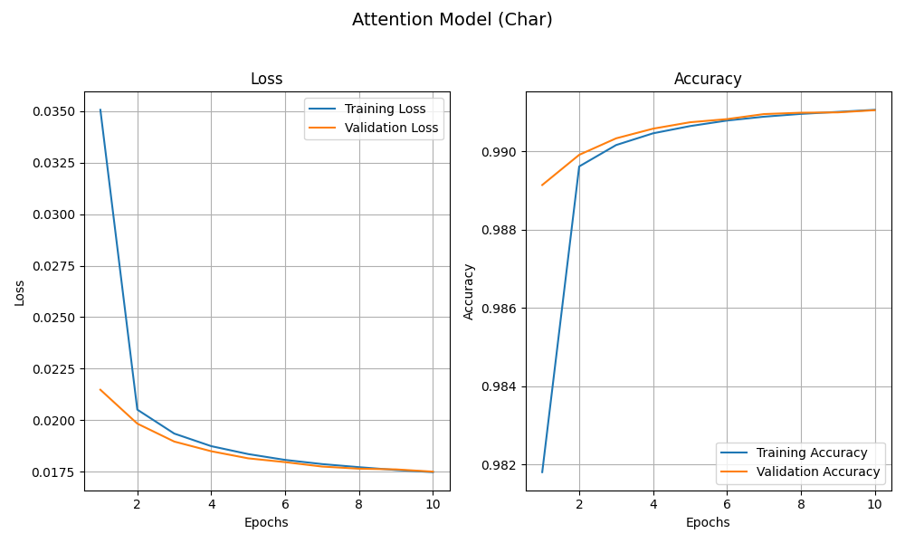
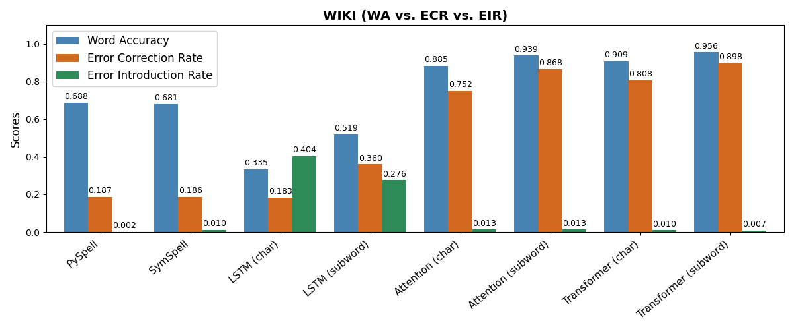
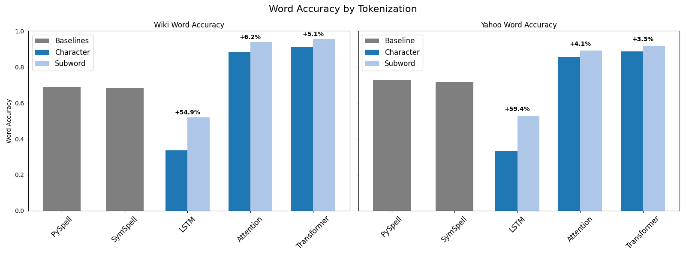

We all like texts without spelling errors.
In this project, we approach the task of spelling correction using
Encoder-Decoder-based neural networks. We show the underlying
architectures of three models -- an LSTM model, an LSTM model with
attention mechanism and a Transformer model. We train them and compare
their performance. Additionally, we analyze how different tokenization
methods affect each model's performance.

<!--more-->

#### Contents
- [Introduction](#introduction)
- [Encoder-Decoder Architecture](#encoder-decoder-architecture)
- [Model Comparison](#model-comparison)
    - [LSTM](#lstm-model)
    - [Attention](#lstm-model-with-attention-mechanism)
    - [Transformer](#transformer-model)
- [Data](#data)
	- [Tokenization](#tokenization)
- [Training](#training)
- [Results](#results)
- [Conclusion](#conclusion)
- [References](#references)

## Introduction

This project focuses on developing spelling correction models that take
a given text input and produce an accurately spelled output.

For example:

-   Input: I taught them **too** **knot** wear **ylleow sun glasses** or
    any **joolery** during **there** experiments.

-   Output: I taught them **to not** wear **yellow sunglasses** or any
    **jewelry** during **their** experiments.

Before we dive into the details of the models, we first introduce the
underlying concept of the encoder-decoder architecture.

## Encoder-Decoder Architecture

The Encoder-Decoder Architecture was first applied on
Sequence-to-sequence tasks by [Sutskever et al. (2014)](https://arxiv.org/pdf/1409.3215) in their work on
machine translation with neural networks. Since then, it was used for
many other sequence-to-sequence tasks, such as text summarization and
spelling correction.

A strength of this architecture is its ability to map between input
sequences and output sequences of varying lengths, which makes it
suitable for spelling correction, as corrections can often change the
length of the text. This is achieved by splitting the processing of the
input sequence from the output generation into two different phases: encoding and decoding.

The architecture consists of two major parts: the encoder and the
decoder.

*Figure 1: Encoder-Decoder Architecture for Sequence-to-sequence tasks.*

**The Encoder** reduces the input sequence into a summarized
representation, known as the context vector. This context vector
captures the important information from the input and is fixed-sized.

**The Decoder** then uses the context vector to generate a correct
output sequence. It does not have access to the original input sequence,
but solely relies on the information provided by the context vector.

Both encoder and decoder are implemented using Recurrent Neural
Networks.

### Recurrent Neural Networks (RNNs)

Recurrent Neural Networks (RNNs) are neural networks designed to handle sequential data.
Unlike other neural networks, RNNs
maintain a hidden state, that allows them to store information across
time steps. This hidden state accumulates information from previous
inputs and enables the network to incorporate the past information when
generating an output. As a result, RNNs can better understand sequences
as whole and adjust their predictions based on previous inputs and
outputs.

RNNs can be visualized in two forms: rolled and unrolled. The rolled
view, shown on the left side of Figure 2, represents the network as a
single unit. The unrolled view on the right side, expands the network
across time steps, making it easier to see, how each input element \\(x_t\\)
influences the corresponding hidden state \\(h_t\\) and ultimately the final
output. For the following explanations, we'll use the unrolled
representation.

*Figure 2: Rolled and unrolled represenation of RNN, adapted from Olah (2015), [Understanding
LSTMs](https://colah.github.io/posts/2015-08-Understanding-LSTMs/).*

### **Vanilla RNN**
The simplest type of RNN is the Vanilla RNN. At each time it processes
the current input together with the previous hidden state, using the
weight matrices, a bias term and a tanh activation function.

*Figure 3: Vanilla RNN Cell, Adapted from Olah (2015), [Understanding
LSTMs](https://colah.github.io/posts/2015-08-Understanding-LSTMs/).*

The updated hidden state can be mathematically represented as:

$$
h_t = \tanh(W_x \cdot x_t + W_h \cdot h_{t-1} + b)
$$
**Where:**

- \\(x_t\\) is the current input  
- \\(h_{t-1}\\) is the previous hidden state  
- \\(W_x\\) and \\(W_h\\) are the weight matrices of the neural network  
- \\(b\\) is a bias term  

The tanh activation function normalizes the output and creates the next
hidden state. This hidden state can be further processed, to get the
final output for each step, such as a word in a sentence.

**What are the downsides of using Vanilla RNN cells?**

Although the hidden state in the Vanilla RNNs is designed to retain
information from one step to the next, the simple structure limits its
effectiveness. Vanilla RNNs struggle to maintain relevant information
across longer sequences due to issues like vanishing or exploding
gradients. Gradients determine how the networks weights are updated in the training phase:

$$\text{New Weight} = \text{Current Weight} - (\text{Learning Rate} \times \text{Gradient})$$

In the case of vanishing gradients, the updates to the weights of the
network become minimal, which prevents to network to capture long-term
dependencies. With exploding gradients, the weights change too much,
which destabilizes the network.

To avoid the gradient problems experienced by Vanilla RNNs, we use
advanced Long Short-Term Memory (LSTM) networks for our first two
models.

### **Long Short-Term Memory (LSTM)**

LSTMs address vanishing and exploding gradients by an additional
memory component, called the cell state. Specialized gates control the
flow of information between the input, the cell state, and the hidden
state. This allows the network to better retain information across
longer sequences.

*Figure 4: Comparison Vanilla RNN and LSTM Cell.*

In LSTMs, the hidden state serves as a short-term memory, which captures
the most relevant information at each time step. The cell state serves
as the long-term memory, which holds relevant information of the entire
sequence.

Three gates control the flow of information between the hidden and the
cell state.

**Forget Gate:**
The forget gate determines which parts of the cell state are no longer
needed and should be reduced or removed. It uses a sigmoid activation
function, that outputs values between \\(0\\) and \\(1\\). These values are
multiplied with the cell state. Values close to \\(0\\) reduce certain
information, while values close to \\(1\\) keep information in the cell state.

**Input Gate:**
The input gate adds new information into the cell state. It consists of
two parts -- a sigmoid and a tanh layer. The sigmoid layer determines
how much of new information is allowed into the cell state. The tanh
layer scales this information, to update the cell state in a normalized
way.

**Output Gate:**
The output gate updates the hidden state based on the previous hidden
state and the updated cell state. The sigmoid layer determines which
parts of the cell state, are relevant for the output. Values near to \\(1\\)
imply a higher relevance, meaning the part of the cell state should be
carried forward. The output of the sigmoid layer is multiplied with the
normalized cell state from the tanh layer.

*Figure 5: LSTM Cell with highlighted Forget, Input and Output Gate.*

In combination these gates control which information is removed, which
is added, and how much is kept. This helps LSTMs to maintain information
across longer sequences.

Building on this architecture, we build two LSTM-based models,
and a Transformer-based model.

## Model Comparison

### **LSTM model**

The first model is based on the paper ["Sequence to Sequence Learning
with Neural Networks" by Sutskever et al. (2014)](https://arxiv.org/pdf/1409.3215).
We refer to this as the LSTM model in this project. It uses LSTMs in both the encoder and
decoder. For the initial task of machine translation, Sutskever uses
multilayered LSTMs with 4 layers, to add complexity to the model. To
reduce the model size and complexity, we simplify the model and use a
two-layer approach. In the two-layer approach, the outputs of the first
LSTM layer, are the inputs for the second layer.

For simplicity, we illustrate this LSTM model and the following LSTM
Model with attention mechanism, using a single LSTM layer, although the
actual implementation uses two layers.

**Encoder**

-   The encoder processes the input sequence step by step, updating its
    internal states \\(h_t\\) and \\(c_t\\) with each token.

-   Only the last hidden state and last cell state of the encoder are
    used to form the context vector. All other intermediate states are
    discarded.

*Figure 6: Encoder of the LSTM model.*

**Decoder**

-   The decoder's cell state and hidden state are initialized with the
    states from the context vector provided by the encoder.

-   The decoding process starts with a start-of-sequence (SOS) token as
    initial input.

-   At each decoding step:

    -   The decoder processes the current input element and updates the
        hidden state.

    -   The updated hidden state is passed through a dense layer (fully
        connected layer) followed by a softmax activation function, to
        produce a probability distribution over the models vocabulary.

    -   The token with the highest probability is selected as the
        output and used as input for the next decoding step.

-   This process repeats with each newly generated token serving as the
    input of the next step, until the end-of-sequence (EOS) token is
    generated.

-   The sequence of output tokens forms the final output of the model.

*Figure 7: Decoder of the LSTM model.*

The decoder therefore only relies on the final hidden and cell states of
the encoder to generate the output. This makes it highly dependent on
the encoders ability to capture all relevant information. Figure 8
shows the full LSTM model.

*Figure 8: Full Encoder-Decoder LSTM model.*

This structure can work for shorter inputs, but may struggle with longer
sequences. Compressing all the information of the input sequence into a
fixed size vector, can lead to information loss. Especially for longer
sequences, the encoder must decide which information it wants to
prioritize. The decoder then must extract all the relevant information
from this limited context.

*Figure 9: Example of information loss in context vector.*

Figure 9 shows how the context vector might underrepresent the words
"friendly" and "dog". Instead, it focuses on the word "baking".
Consequently the decoder misinterprets the context as beeing related to
cooking and incorrectly transforms "dog" to "dough", instead of
correcting "baking" to "barking".

Ideally, the decoder should not only use the final states of the
encoder, as they might not include all information from the input
sequence.

### **LSTM Model with Attention mechanism**

The second model improves the baseline model by adding an attention mechanism into the decoder, as introduced by [Luong et al. (2015)](https://arxiv.org/pdf/1508.04025). We will refer to this model as the Attention model.

The attention mechanism allows the decoder to learn which parts of the
input sequence are the most relevant for each step. Instead of only
relying on the final states, the decoder **accesses** **all intermediate
hidden states** from the encoder. This allows the decoder to
individually weigh the different hidden states, depending on their
relevance at each generation step.

**Encoder:**

-   The Encoder is identical to the encoder of the model without
    attention, but instead of only passing the final states, all
    intermediate hidden states are kept.

**Decoder:**

-   The Decoder is initialized with the final encoder states.

-   **Attention scores** are calculated between the current decoder
    hidden state and all intermediate encoder hidden states. These
    scores specify how much attention the decoder should give to each
    part of the input sequence.

-   The normalized attention scores are used to create a weighted sum of
    all the encoder\'s intermediate states, to form a new
    **attention-weighted context vector.**

-   This attention-weighted vector is concatenated with the current
    decoder hidden state and is passed into a Dense and Softmax layer to
    get the output token.

*Figure 10: Structure of the Attention Model.*

The attention mechanism allows the model to dynamically evaluate the
relevance of each part of the input sequence, for the current generation
step. By including all intermediate encoder states, it ensures that
information is not lost in the fix-sized context vector, even with
longer sequences. This addresses the limitations of the baseline model,
shown in Figure 9.

### **Transformer Model**
The third model is the Transformer model. The Transformer architecture,
introduced by [Vaswani et al. (2017)](https://arxiv.org/pdf/1706.03762), is a significant evolution of
encoder-decoder models. It avoids recurrent layers (like LSTMs), and
instead relies on a self-attention mechanism that processes an entire
input sequence in parallel. It does not build up information by
processing all tokens sequentially, but allows all tokens to interact
with each other simultaneously.

Like the previous models, the transformer model follows an
encoder-decoder architecture. However, because it works so differently
from the previous models, we will only summarize its main features.

Key points of the Transformer model:

-   **Self-attention:** At its core the transformer uses a
    self-attention mechanism, which allows each token of the input
    sequence to focus on other tokens, regardless of the position.

-   **Multi-Head-Attention:** Runs several self-attention processes
    (heads) in parallel. Each head can focus on different features in
    the data.

-   **Positional Encoding:** Since the transformer processes inputs in
    parallel and does not use recurrence, it cannot capture the order of
    a sequence by itself. Therefore, a positional encoding layer adds
    this information.

**Encoding Phase:** Each token in the input sequence is transformed into
a new representation using self-attention. This process is repeated
across multiple layers, improving the representations, step by step.

**Decoding Phase:** The decoder generates the output sequence on token
at a time. At each step it uses the encoder's final states and all
already generated tokens.

The animation below shows, how a Transformer processes an input
sequence, to generate an output sequence, in a text translation task.

*Figure 11: Visualization of a transformer model. While this animation shows translation, the same applies to spelling correction. Image from [Google Research](https://research.google/blog/transformer-a-novel-neural-network-architecture-for-language-understanding/).*

The ability to process all token simultaneously, makes the transformer
much faster than recurrence-based models. Also, by using self-attention
over recurrence, the transformer model can capture long dependencies
without experiencing vanishing gradients.

Now that we explored the model architectures, we turn to the training process.

## Data

The models were trained on two datasets with different characteristics.
The Wikipedia (WIKI) dataset covers a wide range of topics in a factual
style. From this dataset we extracted 10.7 million random sentences, resulting in
an average sentence length of 102 characters.

In contrast, the Yahoo L6 Answers corpus (YAHOO) consists of questions
and answers, in a more conversational style, averaging 72 characters per
sentence. From this dataset we also extracted 10.7 million sentences.

The resulting training set consists of 21.4 million sentences and has a
file size of 1.75 GB. The test sets are created from the original
datasets, without overlap with the training sets.

| Dataset  | Training Set Size | Training Sentences | Test Set Size | Test Set Sentences |
|----------|-------------------|--------------------|---------------|--------------------|
| WIKI     | 1 GB              | 10.7 million       | 10 MB         | 115 000            |
| YAHOO    | 0.8 GB            | 10.7 million       | 10 MB         | 160 000            |
| Combined | 1.8 GB            | 21.4 million       |               |                    |

*Table 1: Overview Datasets.*

**Cleansing**

To reduce noise in the training data, the following preprocessing steps
were applied to the datasets:

-   Remove weblinks

-   Remove all sentences containing numbers

-   Remove special characters except common punctuation marks (:',.?!).

-   Lowercasing

Lowercasing reduces the vocabulary size by merging duplicates like
'The' and 'the'. This reduces the model size and helps to keep the focus on spelling correction rather than
capitalization. Correcting capitalization errors (truecasing) is
considered a separate task.

**Error Introduction**

To use the clean datasets for spelling correction, we
introduced artificial errors, with a probability of 20% per word.
The range of error types was designed to resemble real-world errors:

-   Addition: Inserting an extra character (some 🡪 somme)

-   Removal: Deleting a character (spelling → speling)

-   Swap: Swapping two characters (the 🡪 teh)

-   Replacement: Replace a character (weather 🡪 weathrr)

-   Merge: Merging two words (with the 🡪 withthe)

-   Dictionary: Replace a word by a common misspelling (neighborhood →
    naborhood)

For character addition and replacement, we considered the keyboard
adjacency, favoring neighboring characters. To simulate more realistic
errors, we used a misspelling dictionary, which contains common
misspellings. If a word appeared in this dictionary, it could be
replaced by a commonly misspelled version.

The errors were generated dynamically during training and randomized each epoch, which should
reduce possible overfitting.
The sentences were then transformed into numerical representations, to
be processable by neural networks.

### **Tokenization**

Tokenization was the first step of the transformation. The sentences
were divided into smaller units, called tokens, which can be words,
subwords, or characters. Each token was assigned an ID, forming the vocabulary of the model. The models can only process tokens from this
predefined vocabulary, which was set before training.

1.  **Word tokenization** treats each word as one token. While this is
    an intuitive approach, it is not ideal for spelling correction due
    to out-of-vocabulary (OOV) words. If the model encounters a word,
    that is not included in the predefined vocabulary, there is no
    corresponding ID to convert it to. To handle these cases, such words
    can be marked as OOV, and replaced with a special OOV token. This
    OOV token would act as a placeholder, but contained no information of
    the word.

Using word-level tokenization for spelling correction would require a
vocabulary that includes all regular words, rare words, names, slang,
along with every possible misspelling. Given that the standard English
vocabulary already contains \~170,000 words, adding misspellings would
make the vocabulary unmanageable.

2.  **Character tokenization** treats each character as a single token.
    Words are split into characters, which reduces the model's
    vocabulary to just a small set of letters and punctuation. It
    eliminates the OOV problem, as every word can be built from
    characters.

A drawback is that single characters don't carry much meaning on their
own. The model must understand the sentence, by looking at one letter at
the time, and combine the letters to meaningful words. This results in
longer sequences and increases the training complexity as the model must
identify patterns across many tokens.

3.  **Subword tokenization** combines the strengths of word and
    character-tokenization. The vocabulary consists of common words and
    includes fragments of words and characters to build rare or unknown
    words. This solves the OOV problem and is a good compromise
    regarding sequence length.

*Figure 12: Different tokenization methods, adapted from [Ashraf](https://medium.com/@abdallahashraf90x/tokenization-in-nlp-all-you-need-to-know-45c00cfa2df7). (2022)*

**Considerations when choosing a tokenization method**

We saw that the tokenization method affects OOV words, sequence length
and information density. Additionally, it's also important, how many
tokens are shared between a correct and misspelled word. Ideally,
minor misspellings should produce similar token sequences, so that the model can .

For example, consider the word 'spelling' and the misspelled version
'spleling'. With character tokenization, both sequences share many
tokens:

Character-tokenized:

-   Correct: s, p, e, l, l, i, n, g &nbsp;&nbsp;&nbsp;&nbsp;&nbsp;&nbsp; --> &nbsp;&nbsp;\[19, 16, 5, 12, 12, 9, 14, 7\]

-   Incorrect: s, p, l, e, l, i, n, g &nbsp;&nbsp;&nbsp; --> &nbsp;&nbsp;\[19, 16,  12, 5, 12, 9, 14, 7\]

With subword tokenization, a small mistake leads to a completely
different token sequence.

Subword-tokenized:

-   Correct: sp, elling &nbsp;&nbsp;&nbsp;&nbsp;&nbsp;&nbsp;&nbsp;&nbsp; --> &nbsp;&nbsp;\[1148, 4481\]

-   Incorrect: s, ple, ling &nbsp;&nbsp;&nbsp; --> &nbsp;&nbsp;\[82, 789, 3321\]

If misspelled words share few tokens with the correct version, it is
harder for the model to recognize the intended word.

**Our Tokenization Setup**

To evaluate the effect of different tokenization, we chose character and
subword tokenization. We used the SentencePiece Tokenizer, which
supports both tokenization methods. The character tokenizer has a
vocabulary size of 37, consisting of letters, punctuation, and special
tokens.

For the subword-level tokenizer we used a vocabulary size of 7500
tokens. This resulted in a vocabulary dominated by whole words rather
than subwords, likely because there wasn't enough variation in the
dataset to force the tokenizer to split common words further. As a
result, split misspelled words shared almost no tokens with the correct
words.

Reducing the vocabulary size and maximum token length, encouraged the
tokenizer to use subwords instead of words, increasing the token
overlap. However, this also made the strategy more similar to character
tokenization. To keep a clear distinction between the two tokenization
methods, we chose to keep the 7500 token configuration.

Throughout this project, we refer to the models that use character tokenization as 'char models',
and those using subword tokenization as 'subword models'.

### **Embeddings**

Token IDs don't contain any semantic or syntactic information about
their word. For example, "cat" and "bird" may have IDs 2 and 6, but
these IDs don't capture any relationship between the words. To add
meaning, the tokens are converted into vector embeddings, which are
vectors that capture these relationships.

We chose not to use pretrained models like GloVe, Word2Vec or FastText,
because many of them either don't support subwords, or primarily are
trained to capture semantic similarities. Capturing syntactic
similarities would be more relevant for our task.

Instead, we integrated an embedding layer in each model. This layer
transforms the token IDs into enriched vectors and passes them to
subsequent layers. By training the embedding layer alongside the model,
it learns special embeddings suited for spelling correction. For our
embedding layer, we used an embedding size of 256.

As alternative to embeddings, we also experimented with one-hot
encoding. Here, each token is represented by a binary vector of zeros,
except a single 1 at the position corresponding to the vocabulary ID of
the token. This simple method doesn't capture relationships, but worked
surprisingly well for character tokenization. For subword tokenization
however, it became impractical, due to the large vocabulary size, which
drastically increased the memory consumption.

## Training

The project is implemented in Python (version 3.10) and uses Keras, a
high-level API for TensorFlow, which simplifies the building and
training of neural networks.

Major libraries used:

-   TensorFlow/Keras: For defining, training, and evaluating models

-   Keras-NLP: For advanced neural network layers (e. g. Transformer
    components)

-   NumPy

The models were trained on the university's KISLURM KI-Cluster. Each
model was trained on four Nvidia RTX 2080 TI, with a total of 44GB VRAM.
For a consistent comparison, each model was trained for 10 epochs. The
models were trained in batches of 256 sentences, with a fixed learning
rate of 0.001.

**Training Time**

The training time for both LSTM and Attention models, was highly influenced by the tokenization method.
With character tokenization it took them approximately 2 hours per epoch, while
subword tokenization doubled the training time. The transformer models had the longest training times,
over 4 hours per epoch, regardeless the tokenization. Unlike the other models, the Transformer model trained faster with subword tokenization.
| Model       | Character Tokenization | Subword Tokenization |
|-------------|------------------------:|---------------------:|
| LSTM        | 2:01 h                 | 4:06 h               |
| Attention   | 1:53 h                 | 3:53 h               |
| Transformer | 4:32 h                 | 4:07 h               |

*Table 2: Average training times per epoch.*

**Training Curves**

The training curves of all models follows a similar pattern. As an
example, we can look at the Attention model with character tokenization.

*Figure 13: Training curve of the Attention model using subword tokenization.*

We can see that the loss decreases steadily, while the accuracy steadily
increases. This suggests that the model is training well, with no
overfitting or underfitting. Also, the training and validation curves
are close, which indicates that the model generalizes well to unseen
data.

It's important to note that these accuracy scores are not the model
performance during inference. This is because Keras uses teacher forcing
in the training and validation phase. The real performance without using
teacher forcing is evaluated in the next chapter.

### Evaluation Metrics

To fairly compare the models across different tokenizations, we are not 
using token-level metrics. The different granularities and sequence
lengths would distort the results. Instead, we evaluate on the word
level, which is also more meaningful: a word is either spelled correctly
or it is not.

We focus on three metrics: **Word Accuracy (WA), Error Correction Rate (ECR)**, **Error Introduction Rate (EIR).**

**Word Accuracy (WA):** Measures the overall accuracy of the output. This includes words that were already correct and those which were fixed.

$$
\text{WA} = \frac{\text{correctly predicted words}}{\text{total words}}
$$

**Error Correction Rate (ECR):** Measures how effectively the model corrects misspellings.

$$
\text{ECR} = \frac{\text{errors corrected}}{\text{total errors in input}}
$$

**Error Introduction Rate (EIR):** Measures how often the model overcorrects and introduces errors into already correct text.

$$
\text{EIR} = \frac{\text{new errors introduced}}{\text{total words}}
$$

## Results

To evaluate our models, we selected two baselines, PySpell and SymSpell,
which are common Python libraries for spelling correction. PySpell
follows Norvig's algorithm, while SymSpell uses a precomputed lookup
table to choose between correction candidates. For SymSpell we chose the
standard configuration, which corrects words independently from the
context. Therefore, both baselines are context insensitive.

After training all models for 10 epochs, we get the following results:

| **Models**               | **WIKI WA ↑** | **WIKI ECR ↑** | **WIKI EIR ↓** | **YAHOO WA ↑** | **YAHOO ECR ↑** | **YAHOO EIR ↓** |
|:-------------------------|--------------:|---------------:|---------------:|---------------:|----------------:|----------------:|
| PySpell                  |       0.6881  |       0.1866   | **0.0017**     |       0.7255   |       0.2048    | **0.001**       |
| SymSpell                |       0.681   |       0.1864   | 0.01           |       0.7181   |       0.2014    | 0.0089          |
| LSTM Character                |       0.3348  |       0.1828   | 0.404          |       0.3307   |       0.1548    | 0.4692          |
| LSTM Subword             |       0.5187  |       0.3596   | 0.2758         |       0.5271   |       0.3434    | 0.3077          |
| Attention Character      |       0.8846  |       0.7518   | 0.0133         |       0.8556   |       0.6753    | 0.0356          |
| Attention Subword   |       0.9391  |       0.8679   | 0.0126         |       0.8906   |       0.7786    | 0.0391          |
| Transformer Character         |       0.9093  |       0.8083   | 0.0096         |       0.8858   |       0.7498    | 0.0295          |
| Transformer Subword      | **0.9558**    | **0.9154**     | 0.0068         | **0.8985**     | **0.8218**      | 0.0276          |

*Table 3: Comparison of Baselines, LSTM, Attention and Transformer models, each with character and subword tokenization WA: Word Accuracy, ECR: Error Correction Rate, EIR: Error Insertion Rate.*

The following figure shows how the models performed on the WIKI dataset.

*Figure 14: Model comparison on Word Accuracy, Error Correction, and Introduction Rate on the WIKI test set*.

1. **Baseline models: Pyspell & Symspell**

PySpell and SymSpell correct only a relatively small portion of errors
with an Error Correction Rate (ECR) of about 0.186. However, their low
Error Introduction Rate (EIR) shows that they are very confident with
already correct words and rarely introduce new errors. This leads to a
moderate Word Accuracy of around 0.681. It should be noted that
SymSpell also supports context aware correction, which may yield better
results.

2.  **LSTM models**

The LSTM model with character tokenization performs similarly to the baselines in terms of error correction.
The subword model even surpasses the baselines, reaching an ECR of 0.360. This success is overshadowed by
the highest Error Introduction Rate of both models, reaching 0.404. Both
the character and subword LSTM model heavily overcorrect words, which
brings down the Word Accuracy to just 0.335 (char) and 0.519 (subword).

3.  **Attention Models**

Adding an attention mechanism to the LSTM leads to a significant
performance jump. Both character and subword models correct more than
four times as many errors as PySpell and SymSpell, with the subword
model reaching an ECR of 0.868. The attention mechanism, which sets the
focus on relevant parts of the input, keeps the Error Introduction Rate
low (EIR: 0.013). The high ECR and low EIR boost the Word Accuracy
reaching 0.88 (char) and 0.94 (subword).

4.  **Transformer Models**

The transformers further reduce the number of overcorrections. With an
EIR of only 0.0068, the Transformer subword model introduces the least errors of all
Encoder-Decoder models, coming second only to Pyspell (EIR: 0.0017).
It further outperforms all other models,
achieving the best Error Correction Rate of 0.898 and the highest Word
Accuracy of 0.956.

5. **Influence of Tokenization**

All subword models consistently outperform their character-based
counterparts. Figure 15 shows the relative improvement of Word Accuracy
when switching from character to subword tokenization for both test
sets.

*Figure 15: Relative Word Accuracy improvement of subword tokenization vs. character tokenization.*

The better performance is also seen in the Error Correction Rate and
Error Insertion Rate. The only exception, where character tokenization
performs better than subword tokenization, can be found in the Attention
Model tested on the YAHOO dataset, where the character model shows a
slightly lower Error Introduction Rate (3.56%) compared to the subword
model (3.91%).

It seems that having fewer shared tokens between a misspelled word and
the correct word doesn't hinder subword tokenization from correcting
words. The higher performance of the subword models may come from the
fact that subwords fragment words less than single characters. The
resulting tokens are more meaningful and help the models to better
understand the context.

**WIKI vs. YAHOO Dataset**

When comparing the models on the different test sets, we see that the
baselines perform better on the YAHOO dataset, while the neural models
perform better on the WIKI dataset.

*Figure 16: Side-by-Side Word Accuracy Comparison for each model.*

A possible explanation could be that the YAHOO test set, being
user-generated, contains more typos, slang and inconsistent
punctuation. Neural networks might be more sensitive to this.
Similarly, if the ground truth contains errors, correct outputs could be
marked as incorrect, affecting the score.

### Example Corrections

Input: she desided to meat her freind at the park.

| Model                | Corrected Output                                                                                                                             |
|----------------------|----------------------------------------------------------------------------------------------------------------------------------------------|
| PySpell              | she decided to meat her friend at the park. |
| SymSpell             | she decided to meat her friend at the park. |
| LSTM (char)          | she desided to mean three farie that the prak.                |
| LSTM (subword)       | she decided to meet her friend at the park.      |
| Attention (char)     | she decided to meat her friend at the park. |
| Attention (subword)  | she decided to meet her friend at the park.      |
| Transformer (char)   | she decided to meet her friend at the park.      |
| Transformer (subword)| she decided to meet her friend at the park.      |

Input: darwin has benn described as one of the most influencial figueres in human history and was honuored by burial in westminister abbey.

| Model                | Corrected Output                                                                                                                         |
|----------------------|------------------------------------------------------------------------------------------------------------------------------------------|
| PySpell             | darwin has been described as one of the most influential figures in human history and was honored by burial in westminster abbey. |
| SymSpell            | darwin has been described as one of the most influential figures in human history and was honoured by burial in westminster abbey. |
| LSTM (char)        | darwin has ben cereshowed acit one of the mostfillering finds under this in about have which another unbore subjeralism in the date.|
| LSTM (subword)      | darwin has been described as one of the most influenced mario shiresinfen that human is about world war ii during italian steambremon. |
| Attention (char)    | darwin has been described as one of the most influential figures in human history and was honoured by burial in westminister abbey. |
| Attention (subword) | darwin has been described as one of the most influential figure in human history and was honoured by burial in westminister abbey. |
| Transformer (char)  | darwin has been described as one of the most influential figures in human history and was honoured by burial in westminister abbey. |
| Transformer (subword) | darwin has been described as one of the most influential figures in human history and was honoured by burial in westminster abbey. |

Input: whn  he finaly  arrived at the resaurant  after driving threw  the buzy strets  of the city, he relized  that he had forgoten  his wallte  at home.

| Model                | Corrected Output                                                                                                                                      |
|----------------------|-------------------------------------------------------------------------------------------------------------------------------------------------------|
| PySpell              | when  he finally  arrived at the restaurant  after driving threw  the buy  streets  of the city, he realized  that he had forgotten  his wallet  at home.       |
| SymSpell             | when he final arrived at the restaurant after driving threw the buy stress of the city, he realized that he had forgotten his wallet at home.         |
| LSTM (char)          | when hi final partiar were tarks are authoritie recrub it they substrend to his feep, the children was the trade holding the hoose at walk.           |
| LSTM (subword)       | when he finally arrived at the resurg after training he grew the dusty star , the retirement, he had his feet from the waldha not taken.              |
| Attention (char)     | when he finally arrived at the resurant after driving threw the buzy streets of the city, he realized that he had forgotten his wall that home.       |
| Attention (subword)  | when he finally arrived at the restaurant after driving through the buzy streets of the city, he realized that he had forgotten his wallet at home.  |
| Transformer (char)   | when he finally arrived at the restaurant after driving through the busy streets of the city, he realized that he had forgotten his wallet at home.   |
| Transformer (subword)| when he finally arrived at the restaurant after driving through the busy streets of the city, he realised that he had forgotten his wallet at home.   |

## Conclusion

We have shown that Encoder-Decoder models can significantly outperform
traditional, dictionary based methods for spelling correction. While the
LSTM model without attention struggles to generate meaningful outputs
and frequently overcorrects, the models with attention mechanisms, such
as the attention-based LSTM and the Transformer, show good performances
compared to the baselines.

The results also highlight the role of tokenization. Across all models,
subword tokenization yields better performance than character
tokenization.\
Notably, the transformer model with subword tokenization achieved the
highest word accuracy and Error Correction Rate while introducing almost
no errors. In terms of performance, it makes it a strong candidate for
everyday use.

### Future improvements

-   All models continued to improve after 10 epochs of training.
    Extending the training, could further improve the performance.

-   Training on a dataset with more realistic spelling errors, rather
    than synthetic ones, could improve real-world performance. This
    could be combined with curriculum learning, where the spelling error
    difficulty increases over time.

-   Techniques like grid search could be used to tune hyperparameters
    such as hidden size and learning rate. Currently, the parameters
    models are not optimized.

-   For the LSTM-based models: Previous research [(Sutskever et
    al., 2014)](https://arxiv.org/pdf/1409.3215) showed that in sequence-to-sequence tasks, LSTMs benefit
    from reversing the input sequences.

-   Adding beam search in decoding could help penalize non-existing words.

-   Future work could also extend the evaluation by comparing the
    current models with more advanced AI models.

### DEMO:

This project includes a Flask-based web app, that allows users to test the
models with own input sentences. The app can be started in the
docker container.

## References:
-   Olah, C. (2015). Understanding LSTMs. colah\'s blog. https://colah.github.io/posts/2015-08-Understanding-LSTMs/

-   Sutskever, I., Vinyals, O., & Le, Q. V. (2014). Sequence to sequence
    learning with neural networks. arXiv:1409.3215.

-   Luong, M.-T., Pham, H., & Manning, C. D. (2015). Effective
    approaches to attention-based neural machine translation.
    arXiv:1508.04025.

-   Vaswani, A., Shazeer, N., Parmar, N., Uszkoreit, J., Jones, L.,
    Gomez, A. N., Kaiser, Ł., & Polosukhin, I. (2017). Attention is all
    you need. arxiv:1706.03762.

-   Ashraf, A. (2022). Tokenization in NLP: All you need to know.
    Medium.\
    <https://medium.com/@abdallahashraf90x/tokenization-in-nlp-all-you-need-to-know-45c00cfa2df7>

**Datasets:**

-   May, P. (2022). Wikipedia 2 Corpus. GitHub repository.
    <https://github.com/GermanT5/wikipedia2corpus>

-   Wikimedia Foundation. (2022). Wikipedia database dumps.\
    <https://dumps.wikimedia.org>

-   Yahoo Research. (2015). Yahoo! Answers Comprehensive Questions and
    Answers Version 1.0 (L6). Yahoo! Webscope.
    https://webscope.sandbox.yahoo.com/catalog.php?datatype=l

-   Norvig, P. (2007). English spelling errors dataset. Collected from
    Wikipedia and Mitton\'s spelling corpus. https://norvig.com/ngrams/spell-errors.txt

-   Tatoeba Project. (n.d.). English sentences dataset. Retrieved from
    https://tatoeba.org/en/downloads