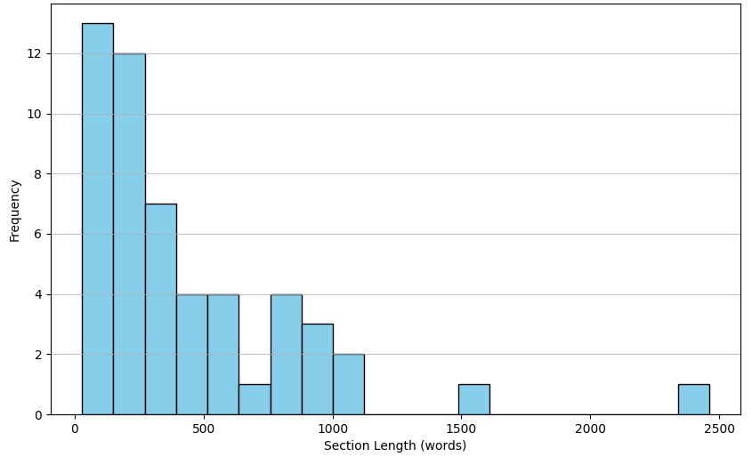

This master's project covers a retrieval-augmented in-context question answering system for the procurement domain, using top retrieval models, re-rankers, and LLMs to answer questions from procurement policy documents. We also discuss the process of building and optimizing this system for accuracy and performance.

# Table of Contents
- <a href="#introduction">Introduction</a>
- <a href="#problem-statement-and-proposed-approach">Problem Statement and Proposed Approach</a>
- <a href="#data_preprocessing">Preparing Procurement Data for Procurement Assistant</a>
  - <a href="#preprocessing_pipeline">Breaking Down the Data Preprocessing Pipeline</a> 
- <a href="#retrievers">Choosing the Right Embedding Models</a>
    - <a href="#retriever_working">How it works?</a>
    - <a href="#retrievers_results">Which Embedding Model Works Best?</a>
- <a href="#faiss">FAISS Indexing</a>
    - <a href="#faiss_working">How it Works?</a>
- <a href="#re-rankers">Optimizing Document Ranking: The Role of Re-Rankers</a>
    - <a href="#reranker_working">How it Works?</a>
    - <a href="#best_reranker">Which Re-ranker Works Best?</a>
- <a href="#is_reranking_needed">The Role of Re-ranking: Is It Essential?</a>
- <a href="#llm">Transforming Context into Answers: The Role of LLMs</a>
    - <a href="#llm_working">How it Works?</a>
    - <a href="#llm_results">Evaluating LLMs Performance</a>
- <a href="#chatbot_webapp">Developing a Responsive and Interactive Chatbot Web Application</a>
- <a href="#full_system">From Query to Response: Procurement Assistant</a>
- <a href="#test_results">Evaluating System Effectiveness: Quantitative and Qualitative Results</a>
- <a href="#results_summary">Results Overview</a>
- <a href="#conclusion">Conclusion</a>

# Introduction

In recent years, retrieval-augmented question answering (QA) systems have gained significant traction for their ability to integrate both retrieval mechanisms and generative models, providing high-quality answers to user queries. These systems pull information from large datasets to answer complex questions, offering more precise and context-aware responses.

In this blog, we explore a practical implementation of a retrieval-augmented in-context question answering system tailored to the procurement domain. Our system integrates the best retrieval models, re-rankers, and language models (LLMs) to effectively answer procurement-related questions based on policy documents (PDFs), containing unstructured data. We also explore the process of building this system and testing it for optimal accuracy and performance.

# Problem Statement and Proposed Approach

The existing system relies on a ticket-based approach, where users submit queries that are manually addressed based on priority — High (answered within 4 to 6 hours), Medium (one or two business days), and Low (within a week). On an average, around thousands of tickets are being created for this purpose. While 80% of tickets are resolved in a single response, the remaining 20% require follow-up questions. As a result, waiting for an answer can take anywhere from hours to a week. This process is time-consuming, prone to delays, and heavily dependent on human intervention, leading to inefficiencies, inconsistent response times, and scalability issues as query volumes increase.

This brings us to the need for a more efficient solution - a procurement assistant, which is why we explore the implementation of a retrieval-augmented in-context question answering system tailored specifically to the procurement domain. Our system leverages the best retrieval models, re-rankers, and language models (LLMs) to quickly and accurately answer procurement-related questions based on the data from policy documents (PDFs). Furthermore, We also dive into the process of building and optimizing this system for enhanced accuracy, performance, and scalability.

# Preparing Procurement Data for Procurement Assistant
The first step in creating any effective retrieval-augmented system is efficient data processing. In our case, procurement data is often found in PDFs, which are converted into markdown files for easy processing.

## Breaking Down the Data Preprocessing Pipeline

- **Conversion to Markdown**: We first convert raw PDFs into markdown files using PDF parsing tool (marker-pdf). This format retains key structural elements like headings, bullet points, and tables, making the data more accessible and organized.

- **Metadata Creation**: A critical part of the preprocessing phase is creating a metadata file that maps each section of the markdown files to a specific index. This ensures that relevant sections of the document can be efficiently retrieved later in the process.

- **Benchmark Creation**: To facilitate proper evaluation, we create a benchmark dataset of questions paired with the corresponding section index from the markdown files and the answer to those questions. This benchmark of 45 queries is essential for evaluating the performance of different retrieval, ranking and LLM models.

With this processed data, we are ready to build the backbone of our system: the retriever and re-ranker components.

# Choosing the Right Embedding Models

At the heart of our retrieval-augmented QA system is the retriever. Retrievers (Embeddings models) are used to fetch relevant data from the list of PDF documents sections embedded as vectors based on a given query. For this task, we evaluate a variety of embedding models to determine which one provides the best retrieval performance.

## How it Works?

- Each section of the PDF documents is treated as a chunk, with each chunk stored as a separate index in the metadata file.

- We use a set of embedding models (22) from HuggingFace to convert each section chunk into dense vector representations.

- Two types of embedding models were used: Hugging Face Transformer models and Sentence Transformer models.

- These vector embeddings capture semantic information about the text, allowing the model to identify relevant document sections when queried.

- The retriever model is evaluated on the benchmark dataset using Average Recall @ k, Average Precision @ k to process all the queries in the benchmark across various top-k values (5, 10, 15, 20). The model that achieves 100% (or highest) Average Recall with the least top-k as possible is considered the best performing for retrieval.

Through this evaluation process, we can determine which embedding model yields the highest-quality embeddings for retrieving the most relevant document sections.

## Which Embedding Model Works Best?

From the results, it is clear that **NovaSearch/stella_en_1.5B_v5** is the best embedding model for our use case, achieving a perfect Average Recall@k (100%) and the lowest top-k value of 10. Overall, the Sentence Transformer embedding models produced higher-quality embeddings compared to the Hugging Face Transformer models for our use case.

<table>
    <thead>
        <tr>
            <th><strong>
Model
</strong></th>
            <th><strong>
Top-K
</strong></th>
            <th><strong>
Average Precision@K
</strong></th>
            <th><strong>
Average Recall@K
</strong></th>
        </tr>
    </thead>
    <tbody>
        <tr>
            <td><strong>NovaSearch/stella_en_1.5B_v5 (Sentence Transformer)</strong></td>
            <td><strong>
10
</strong></td>
            <td><strong>
10%
</strong></td>
            <td><strong>
100%
</strong></td>
        </tr>
        <tr>
            <td>Alibaba-NLP/gte-large-en-v1.5 (Sentence Transformer)</td>
            <td>
15
</td>
            <td>
7%
</td>
            <td>
100%
</td>
        </tr>
        <tr>
            <td>NovaSearch/stella_en_1.5B_v5 (Sentence Transformer)</td>
            <td>
15
</td>
            <td>
7%
</td>
            <td>
100%
</td>
        </tr>
        <tr>
            <td>Snowflake/snowflake-arctic-embed-l-v2.0 (Sentence Transformer)</td>
            <td>
20
</td>
            <td>
5%
</td>
            <td>
100%
</td>
        </tr>
        <tr>
            <td>Alibaba-NLP/gte-large-en-v1.5 (Sentence Transformer)</td>
            <td>
20
</td>
            <td>
5%
</td>
            <td>
100%
</td>
        </tr>
        <tr>
        <td>Snowflake/snowflake-arctic-embed-l-v2.0 (HF Transformer)</td>
        <td>
20
</td>
        <td>
48%
</td>
        <td>
97%
</td>
    </tr>
    </tbody>
</table>

# FAISS Indexing

Once we have identified the best embedding model, the next step is to index the document sections for efficient retrieval. This is where FAISS, a library developed by Facebook AI Research, comes into play. FAISS is designed for efficient similarity search and clustering of dense vectors.

## How it Works?

- **Creating the FAISS Index**: Using the embeddings generated from the best embedding model for each section (indiced in metadata), we create a FAISS index (IndexFlatL2). This index consisting of 52 indices allows us to quickly retrieve the closest matches to a query from the document sections.

- **Efficient Search**: The FAISS index enables nearest neighbor search on a large-scale corpus of data, providing fast retrieval times even when dealing with thousands of document sections.

- **Top-k Selection**: After building the FAISS index, we use it to fetch the top-k most relevant document sections for a given question. The selected top-k is determined by the retriever model's performance above (Top-10).

Leveraging FAISS (Facebook AI Similarity Search) in our retrieval process ensures both scalability and efficiency, even when we continue to add more data over time. FAISS allows for fast and accurate similarity searches, which is essential as the volume of data increases.

The graph below illustrates the distribution of section lengths for each index. Upon analyzing the data, we observe that the majority of indices have section lengths below 1200 words approximately. Only two sections exceed 1200 words, highlighting that most of the data is well-optimized for retrieval. This distribution allows for quick and resource-efficient searches, maintaining optimal performance even with large-scale datasets.

<figure style="text-align: center;">
    

    

    <figcaption style="font-size: 20px;">Section Length Distribution for Each Index</figcaption>
</figure>

# Optimizing Document Ranking: The Role of Re-Rankers
While the FAISS index allows us to retrieve a set of relevant document sections, we want to refine these results further. This is where re-rankers come in.

## How it Works?

- We use a set of re-rankers (39) to take the top-k retrieved results of the best retriever and re-rank them based on relevance to the question at hand.

- The re-ranking process utilized two types of models: Cross-Encoders and Sentence Transformers.

- Similar to the retriever, the re-ranker is also evaluated using Mean Reciprocal Rank (MRR) and Recall@k to determine which model performs best at accurately ranking the retrieved document sections.

- The model with a highest MRR is considered as high performing.

- For instance, if the retriever provides 10 possible document sections for a question, the re-ranker re-ranks the most relevant contexts to the top among the 10 retrieved results.

By integrating the re-ranker, we ensure that the model delivers the most contextually accurate answers by refining the results before passing them to the LLM.

## Which Re-ranker Works Best?

The table below highlights **Alibaba-NLP/gte-Qwen2-1.5B-instruct** as the best re-ranking model for our use case, achieving the highest MRR score of 84%.

<table>
    <thead>
        <tr style="padding: 15px;">
            <th><strong>
Model Name
</strong></th>
            <th><strong>
MRR
</strong></th>
            <th><strong>
Recall@1
</strong></th>
            <th><strong>
Recall@5
</strong></th>
            <th><strong>
Recall@10
</strong></th>
        </tr>
    </thead>
    <tbody>
        <tr>
            <td><strong>gte-Qwen2-1.5B-instruct (Sentence Transformer)</strong></td>
            <td><strong>
84%
</strong></td>
            <td><strong>
73%
</strong></td>
            <td><strong>
98%
<strong></td>
            <td><strong>
100%
</strong></td>
        </tr>
        <tr>
            <td>gte-large-en-v1.5 (Sentence Transformer)</td>
            <td>
75%
</td>
            <td>
60%
</td>
            <td>
96%
</td>
            <td>
100%
</td>
        </tr>
        <tr>
            <td>ms-marco-MiniLM-L-6-v2 (Cross-Encoder)</td>
            <td>
70%
</td>
            <td>
58%
</td>
            <td>
82%
</td>
            <td>
100%
</td>
        </tr>
        <tr>
            <td>ms-marco-TinyBERT-L-6 (Cross-Encoder)</td>
            <td>
68%
</td>
            <td>
53%
</td>
            <td>
84%
</td>
            <td>
100%
</td>
        </tr>
        <tr>
            <td>granite-embedding-125m-english (Sentence Transformer)</td>
            <td>
64%
</td>
            <td>
47%
</td>
            <td>
84%
</td>
            <td>
100%
</td>
        </tr>
    </tbody>
</table>

# The Role of Re-ranking: Is It Essential?

For our use case, the sentence transformer embedding model **NovaSearch/stella_en_1.5B_v5** plays a crucial role in generating high-quality embeddings, which have been evaluated against our benchmark dataset. The model performs exceptionally well, providing accurate and efficient embeddings that are essential for effective question answering. To further optimize the results, a re-ranking module is incorporated, but it is only activated when the cosine similarity between the retrieved content and the query falls below a certain defined threshold.

**In our use case, the determined threshold is 0.3.**

## Threshold Calculation

The threshold is determined through a simple yet effective approach outlined below:

1. Create a **scores** list to store the average similarilty score (avg_score).

2. For each query in the benchmark, retrieve the top k relevant indices using the best embedding model.

3. Generate embeddings for both the query and each of the retrieved sections.

4. Compute the cosine similarity between: The query embedding and each section embedding.

5. Calculate the average similarity score (avg_score) for each query and store it in the **scores** list.

6. Repeat steps 2 to 5 for all the queries in the benchmark dataset.

7. Next, compute the mean similarity score (mean_sim) of the **scores** list.

8. Then, calculate the standard deviation of the **scores** list (std_dev_sim).

9. Finally, the threshold is calculated as: 

  <h3 style="color: white;">Threshold = mean_sim - (1 * std_dev_sim)</h3>

By using this threshold-based re-ranking approach, we ensure that only the most relevant results are considered when the initial retrieval does not meet the required similarity score. This optional re-ranking module enhances the system's performance time and scalability, especially as new documents are added to the system, without significantly slowing down the retrieval process.

# Transforming Context into Answers: The Role of LLMs

The Large Language Model (LLM) is the final piece of the puzzle. After the retriever and an optional re-ranker have narrowed down the most relevant document sections, the LLM is tasked with generating the final answer based on these contexts.

## How it Works?

- The LLM processes the top-10 retrieved (or re-ranked) document sections alongside the user’s question.
- It operates with a temperature setting of 0.4, striking a balance between generating contextually relevant responses and utilizing external knowledge.
- The maximum token limit is set to 400, allowing for detailed yet concise responses.
- The model then generates an answer by drawing the information from these contexts based on the question, utilizing its internal language understanding to synthesize a coherent response.
- Popular LLMs like GPT-based models (GPT-35-turbo, GPT-35-turbo-16k, GPT-4, GPT-4-32k, GPT-4o) are employed for this step.

The LLMs are evaluated for accuracy using benchmark dataset queries, both with and without relevant context, ensuring they provide contextually accurate answers based on information retrieved from the FAISS index.

## Evaluating LLMs Performance

The evaluation shows that incorporating retrieved contexts from a retriever, boosted LLM model accuracy by over 65% compared to baseline (context-free) performance. Among all the models compared, **GPT-4o** stood out as the best choice for our use case, achieving an impressive **98% accuracy** when grounded on retrieved contexts while keeping query costs per minute manageable.

<table style="padding: 30px;">
    <thead>
        <tr>
            <th><strong>
Model
</strong></th>
            <th><strong>
Accuracy (without context - Baseline) in %
</strong></th>
            <th><strong>
Accuracy (with context) in %
</strong></th>
        </tr>
    </thead>
    <tbody style="padding: 25px;">
        <tr>
            <td><strong>GPT-4o<strong></td>
            <td><strong>
31%
</strong></td>
            <td><strong>
98%
</strong></td>
        </tr>
        <tr>
            <td>GPT-4-32k</td>
            <td>
24%
</td>
            <td>
98%
</td>
        </tr>
        <tr>
            <td>GPT-4</td>
            <td>
16%
</td>
            <td>
91%
</td>
        </tr>
        <tr>
            <td>GPT-35-turbo-16k</td>
            <td>
13%
</td>
            <td>
87%
</td>
        </tr>
        <tr>
            <td>GPT-35-turbo</td>
            <td>
16%
</td>
            <td>
71%
</td>
        </tr>
    </tbody>
</table>

The questions posed by users are highly specific to the organization's procurement policies, which can change over time. Without specific context, the model cannot tailor its responses to the most current guidelines. In the absence of relevant context, LLMs may provide broad, generalized answers that fail to address the specific details of the question. Therefore, providing relevant context is essential for ensuring accurate and context-aware responses.

# Developing a Responsive and Interactive Chatbot Web Application

To develop the web application for our procurement assistant, HTML, CSS, and JavaScript was used to create a dynamic and interactive user experience. JavaScript played a crucial role in adding interactivity, ensuring seamless user engagement. For responsiveness, Bootstrap, a powerful front-end framework, was leveraged to make the website adaptable across various devices. With Bootstrap’s flexible grid system and pre-designed components, the chatbot interface maintains a clean and user-friendly layout on desktops, tablets, and mobile screens. By combining these technologies, the chatbot web application delivers a smooth, responsive, and engaging experience for users.

# From Query to Response: Procurement Assistant

When a user submits a query related to procurement policy documents, the chatbot’s backend initiates a robust retrieval process to find the most relevant information. First, the system searches through a FAISS index, retrieving the top 10 relevant indices with section embeddings that match the query. The section or context from each of these indices is then extracted. If necessary, a re-ranking module is triggered to enhance relevance. A module evaluates the cosine similarity between the retrieved contexts and the user query and if the average similarity falls below a predefined threshold (0.3), the re-ranker is optionally applied to refine the results. Once the most relevant passages are determined — whether retrieved or re-ranked — they are packaged with the user’s question as a prompt and sent to the LLM (GPT-4o). The LLM then generates a response, including the context number used for reference. Finally, the user receives a well-structured answer to their query, along with a direct link to the procurement policy document where the relevant information was found. This seamless process ensures accurate and contextually rich responses, enhancing the user experience in navigating complex policy documents.

<figure style="text-align: center;">
    

    <figcaption style="font-size: 20px;">From Query to Response: Procurement Assistant</figcaption>
</figure>

# Evaluating System Effectiveness: Quantitative and Qualitative Results

The fully integrated procurement assistant system was evaluated using a set of test queries, some of which were real queries submitted by users as support tickets. The overall performance of the system can be summarized as follows:

    

        <h2 style="color:black; font-size: 25px;">Accuracy</h2>
        <h2 style="color:black; font-size: 25px;">~98%</h2>
    

    

        <h2 style="color:black; font-size: 25px;">Response Time</h4>
        <h2 style="color:black; font-size: 25px;">~7.82 seconds</h2>
    

    

        <h2 style="color:black; font-size: 25px;">Latency</h2>
        <h2 style="color:black; font-size: 25px;">~0 seconds</h2>
    

Additionally, here are few user feedback for the User Interface of the Procurement Assistant:

    

        

            <h3 style="color:black;">The user interface is visually appealing, with a well-thought-out color scheme. The colors are subtle yet effective, contributing to a clean and aesthetically pleasing design.</h3>
        

        

            <h3 style="color:black;">The chatbot's design is highly impressive, and the user interface stands out as superior to existing systems. Keep up the excellent work!</h3>
        

        

            <h3 style="color:black;">The UI looks really good, and visually appealing. The colors, fonts, and layout make it a pleasure to look at!</h3>
        

        <!-- Repeat content for scrolling effect -->
        

            <h3 style="color:black;">The user interface is visually appealing, with a well-thought-out color scheme. The colors are subtle yet effective, contributing to a clean and aesthetically pleasing design.</h3>
        

        

            <h3 style="color:black;">The chatbot's design is highly impressive, and the user interface stands out as superior to existing systems. Keep up the excellent work!</h3>
        

        

            <h3 style="color:black;">The UI looks really good, and visually appealing. The colors, fonts, and layout make it a pleasure to look at!</h3>
        

    

Overall, the integrated procurement assistant system demonstrates impressive quantitative and qualitative performance metrics, complemented by positive user feedback on its intuitive UI design.

# Results Overview

- The best embedding model (retriever) **NovaSearch/stella_en_1.5B_v5** achieved 100% Average Recall@k, ensuring relevant sections were retrieved.
- The best re-ranker model **Alibaba-NLP/gte-Qwen2-1.5B-instruct** showed strong MRR results (84%), optionally refining the ranking of document sections for better accuracy.
- The best LLM **GPT-4o** provided contextually accurate answers (98%) with minimal latency and response time, making the system robust for real-world deployment in procurement use cases.

# Conclusion

By integrating the best retriever, an optional re-ranker, and an LLM (GPT-4o), our retrieval-augmented in-context question answering system is able to efficiently and accurately respond to procurement-related questions conditioned on the procurement policy documents. The use of pre-trained models for embedding, retrieval, ranking, and final answer generation using llm allows for rapid development, while our careful evaluation ensures optimal performance like accurate answers, minimal latency and quick response. This system can be deployed in real-world procurement environments to assist professionals in navigating complex documents, making it easier to extract valuable insights and make informed decisions.
