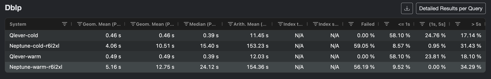
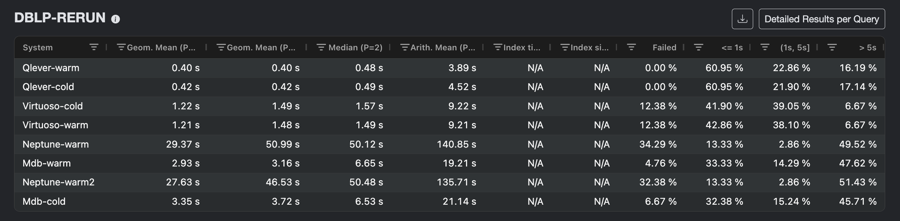
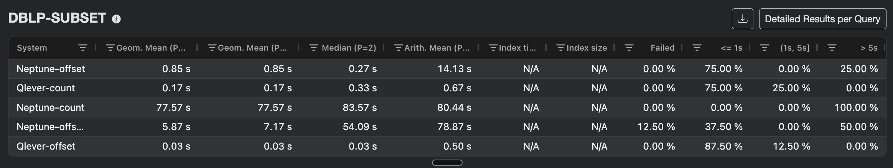
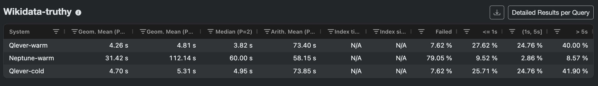
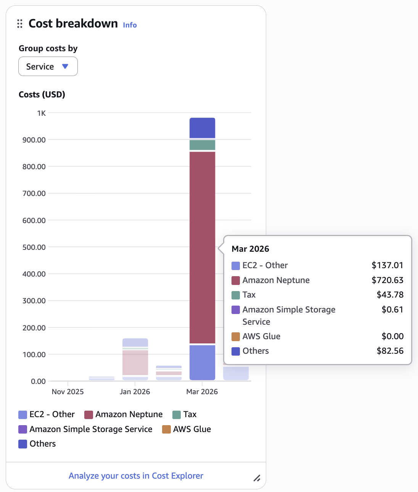

We ran QLever, one of the fastest open-source RDF engines, on a cloud VM (Amazon EC2) and benchmarked it against Amazon's native flagship managed graph database, Neptune, on real, large-scale datasets.

What did we find? This project set out to answer that question, and the results
surprised us too.

<!--more-->

## Contents

1. [Why benchmark QLever in the cloud?](#why-benchmark-qlever-in-the-cloud)
2. [The experimental setup](#the-experimental-setup)
   - [Datasets and benchmarks](#datasets-and-benchmarks)
   - [Engines and hardware](#engines-and-hardware)
   - [Warm vs cold: defining fair conditions](#warm-vs-cold-defining-fair-conditions)
3. [DBLP: from "too good to be true" to a fair fight](#dblp-from-too-good-to-be-true-to-a-fair-fight)
   - [Initial results and a dose of skepticism](#initial-results-and-a-dose-of-skepticism)
   - [Fixing the setup: query format, engine version, timeouts](#fixing-the-setup-query-format-engine-version-timeouts)
   - [Virtuoso and MillenniumDB as a sanity check](#virtuoso-and-millenniumdb-as-a-sanity-check)
   - [The COUNT(\*) experiment](#the-count-experiment)
4. [Wikidata-truthy: scaling to 8 billion triples](#wikidata-truthy-scaling-to-8-billion-triples)
   - [Building and loading](#building-and-loading)
   - [Benchmarks at scale](#benchmarks-at-scale)
5. [The cost of running in the cloud](#the-cost-of-running-in-the-cloud)
6. [What we found and what it means](#what-we-found-and-what-it-means)

---

## Why benchmark QLever in the cloud?

[QLever](https://github.com/ad-freiburg/qlever) is an open-source RDF/SPARQL engine
developed at the Chair for Algorithms and Data Structures at the Technical faculty, University of Freiburg.
It is designed to handle hundreds of billions of triples on a single machine, and has consistently outperformed other SPARQL engines in published evaluations. Most of those evaluations, however, run on dedicated research hardware. The question this project asks is different: what happens when you run QLever on a commodity cloud VM and compare it against a purpose-built, fully managed cloud graph database, specifically [Amazon Neptune](https://aws.amazon.com/neptune/)?

This matters beyond just academic curiosity. Organizations increasingly build their knowledge
infrastructure on cloud platforms, and Neptune is AWS's default recommendation for graph workloads. Understanding how these two options compare on realistic, large-scale SPARQL benchmarks is useful for anyone selecting a tech stack.

This was my Master's project at the AD chair, supervised by Prof. Hannah Bast and Robin Textor-Falconi. The goal was to *"Deploy QLever in the cloud and evaluate its performance in comparison to related
systems, in particular Amazon Neptune."* I deployed both systems on AWS (Frankfurt, `eu-central-1`), ran standardized SPARQL benchmarks on two large RDF datasets, and collected everything into a reproducible evaluation pipeline.

What follows is the story of what I found including a few surprises, scepticism and shock along the way.

---

## The experimental setup

### Datasets and benchmarks

I used two datasets representative of real-world RDF knowledge graphs:

- **DBLP** — the computer science bibliography in RDF

  ([dblp.org/rdf](https://dblp.org/rdf/dblp.ttl.gz)),
  approximately **525 million triples**.
- **Wikidata-truthy** — the truthy-statements subset of Wikidata

  ([dumps.wikimedia.org](https://dumps.wikimedia.org/wikidatawiki/entities/latest-truthy.nt.gz)),
  approximately **8.1 billion triples**, about 16× larger than DBLP.

For benchmarking I used the [Sparqloscope](https://github.com/ad-freiburg/sparqloscope)
suite and also Tanmay Garg's multi-engine evaluation framework
([sparql-engine-evaluation-tanmay](https://github.com/ad-freiburg/sparql-engine-evaluation-tanmay)).
The specific benchmark files were:

- `dblp.medium.queries.yaml` — approximately 100 queries covering JOIN patterns,

  OPTIONAL, MINUS, EXISTS, UNION, GROUP BY aggregates, COUNT/SUM/MIN/MAX, DISTINCT,
  REGEX filters, transitive path expressions, numeric and string functions, and
  result-size stress tests.
- `wikidata-truthy.large.queries.yaml` — a similar suite adapted to Wikidata schema

  (around 97 queries in the runs we performed).

A uniform per-query timeout of **300 seconds** (5 minutes) was applied throughout. All query YAML files and every result file from the experiments are archived in the internal AD chair Git repository `qlever-cloud-benchmark`.

### Engines and hardware

I ran four engines on DBLP and two on Wikidata-truthy:

| Engine | Deployment | Instance (DBLP) | Instance (Truthy) |
|---|---|---|---|
| QLever | EC2, Docker | `r6i.2xlarge` (64 GiB) | `r6i.8xlarge` (256 GiB) |
| Amazon Neptune | Managed cluster | `db.r6i.2xlarge` | `db.r6g.8xlarge` |
| Virtuoso (OSE) | EC2, Docker | `r6i.2xlarge` | — |
| MillenniumDB | EC2, Docker | `r6i.2xlarge` | — |

Instance classes were matched by available memory to make the comparison as fair as possible. All experiments ran in `eu-central-1a` (Frankfurt). The
QLever, Virtuoso, and MillenniumDB engines were managed using the `qlever-control` CLI, which handles index building, server lifecycle, and benchmark execution uniformly across all engines.

For the QLever DBLP index I needed to set `STXXL_MEMORY = 40G` in the Qleverfile of the engine to give the external-memory merge phase enough room. For Wikidata-truthy (`r6i.8xlarge`, 256 GiB, 3 TB `gp3` EBS volume at `/data`) I raised this to `STXXL_MEMORY = 80G`. Neptune data was loaded from an S3 bucket via Neptune bulk loader endpoint with an IAM loader role. The DBLP load completed in roughly **21 hours**; Wikidata-truthy took about **32 hours**.

### Warm vs cold: defining fair conditions

For every engine and dataset I ran a **warm** run (server running, OS page cache populated) and a **cold** run (caches cleared, server restarted from scratch before the first query). For the EC2-based engines, cold runs were preceded by:
```bash
sudo bash -c "sync; sleep 5; echo 3 > /proc/sys/vm/drop_caches"
```
OS page cache is cleared entirely, ensuring the engine cannot benefit from previously cached index data. For Neptune there is no equivalent mechanism, we approximated a cold start by **rebooting the writer instance** before each cold run.

*Results from the initial run:*



---

## DBLP: from "too good to be true" to a fair fight

### Initial results and a dose of skepticism

After completing the full DBLP Sparqloscope run on both QLever and Neptune, the results were striking. Most queries that QLever executed in **under a second** were taking Neptune **50–100+ seconds**. Many queries timed out entirely.

Our analysis of the results: they looked great for QLever. So great, in fact, that we doubted whether the comparison was really fair. This was a legitimate concern. Before claiming QLever is orders of magnitude faster than the state-of-the-art cloud product that runs natively, you want to be confident the setup is actually fair to both sides.

**There were two concrete problems.**  

**Problem 1: Query Format.** I had started with the Sparqloscope TSV file, which wraps each logical query in an extra outer COUNT layer:
```sql
-- AD Freiburg TSV format (dblp.benchmark.tsv)
SELECT (COUNT(*) AS ?qlever_count_)
WHERE {
  SELECT (COUNT(*) AS ?count)
  WHERE {
    ?s dblp:hasSignature ?o1 .
    OPTIONAL { ?s dblp:createdBy ?o2 . }
  }
}
```
This nested COUNT structure exists because of how QLever's original benchmarking query was designed. QLever can optimize through it. But for Neptune (and other engines), it is a genuine nested aggregation; the inner query produces one scalar row, and the outer COUNT then aggregates that one row. The final answer is always 1, but Neptune doesn't know that and has to execute both aggregation stages, making it a costlier query.

**Problem 2: Configuration.** I was running an older Neptune engine version with a default parameter group that imposed shorter timeouts than intended, and I had not set the `--download-or-count download` flag in the benchmarking CLI, which was causing the client to wrap some queries with yet another COUNT layer on top of what was already in the YAML.

### Fixing the setup: query format, engine version, timeouts

For the final DBLP rerun I made the following changes simultaneously:

1. **Switched to `dblp.medium.queries.yaml`** for all engines. This file uses clean single-COUNT queries:
```sql
-- YAML format (dblp.medium.queries.yaml)
SELECT (COUNT(*) AS ?count)
WHERE {
  ?s dblp:hasSignature ?o1 .
  OPTIONAL { ?s dblp:createdBy ?o2 . }
}
```

2. **Used `--download-or-count download`** in `qlever benchmark-queries`, so queries are forwarded to Neptune exactly as written in the YAML without any further wrapping.

3. **Upgraded Neptune** to engine version **1.4.6.3.R1**.

4. **Created a custom cluster parameter group** with `neptune_query_timeout = 300000`

   (300 s), applied it to the cluster, and rebooted the writer instance to activate it. Added `?timeout=300000` to the SPARQL URL as well to be consistent on both client and server.

5. **Placed the Neptune cluster and EC2 instance in the same availability zone**

   (`eu-central-1a`) with a properly configured security group Neptune SG allows port 8182 from the EC2 security group, not a fixed IP, so the rule survives EC2 restarts.

Neptune results improved considerably after these changes, not because the DBLP data or the benchmark definition changed, but because Neptune was no longer being penalized by redundant aggregation layers and misconfigured timeouts. This is an important lesson in methodology, worth emphasizing: **When comparing engines, the benchmark setup must be fair to *all* engines under test, not just the one you developed.**

### Virtuoso and MillenniumDB as a sanity check

Even after fixing the setup, QLever remained substantially faster than Neptune on nearly every query. After some discussions, Robin's suggestion was to add two more engines:
**Virtuoso** and **MillenniumDB** to check whether Neptune is an outlier:

> *"The goal would be to find out if other engines fall more in line with QLever or Neptune."*

I used Tanmay's multi-engine framework for this. Virtuoso was straightforward via the `qvirtuoso` wrapper. MillenniumDB required a small workaround as the Docker image build script referenced a `master` branch that no longer existed. So I cloned the repository, checked out the correct branch, and built the image manually before importing DBLP. 

*Overview of all benchmark results across all four datasets:*



**Virtuoso and MillenniumDB aligned much more closely with QLever than with Neptune.**
Neptune consistently ran slower by a wide margin on most query categories, even after all the configuration improvements. This ruled out the hypothesis that QLever had some hidden advantage in our setup; **Neptune performance is the outlier here.**

### The COUNT(\*) experiment (DBLP-SUBSET)

One pattern in the data stood out: the queries where Neptune was slowest were almost uniformly COUNT-heavy. Global `COUNT(*)`, `COUNT(DISTINCT ...)`, and complex `GROUP BY` queries took **50–110 seconds** on Neptune; QLever handled the same queries in **under a second**. Queries that exported rows with a small `LIMIT` were comparatively faster on Neptune. This led to further discussions about whether `COUNT(*)` might be introducing disproportionate overhead on Neptune.

To investigate further, I selected **8 representative queries** from the DBLP
benchmark covering joins, OPTIONAL chains, GROUP BY, COUNT DISTINCT, regex filters, and a full triple count scan and created two variants for each:

1. **COUNT variant**: the original Sparqloscope query with

   `SELECT (COUNT(*) AS ?count)`.
2. **OFFSET variant**: same logical pattern, rewritten as a plain SELECT with
   `OFFSET 100000 LIMIT 10` and no aggregation.

*Results for DBLP-SUBSET:*



| Query | QLever (COUNT) | Neptune (COUNT) | Neptune (OFFSET 100k) | Neptune (N-1)
|---|---:|---:|---:|---:|
| join-2-large-large | 0.48 s | 86.10 s | 0.30 s | 79.21 s |
| optional-join-3-chain-1 | 1.09 s | 98.95 s | 0.14 s | 83.43 s |
| group-by-count-high-multiplicity | 0.02 s | 108.36 s | 0.19 s | 0.05 s |
| group-by-implicit-string-min | 0.40 s | 56.10 s | 0.23 s | 0.06 s |
| distinct-count-wrong-sort-order | 1.16 s | 102.64 s | 0.40 s | 0.06 s|
| regex-prefix-2 | 0.01 s | 55.30 s | 55.98 s | 54.01 s |
| regex-prefix-3 | 0.01 s | 55.00 s | 55.69 s | 54.17 s |
| number-of-triples | 0.01 s | 81.04 s | 0.13 s | HTTP 500 |

For **five of the eight queries**, removing COUNT and using an OFFSET reduced
Neptune time from tens of seconds down to a fraction of a second. The two **regex** queries (`regex-prefix-2`, `regex-prefix-3`) were unaffected, Neptune took ~55 seconds regardless of COUNT or OFFSET, because the bottleneck there is the full scan of `rdfs:label` values and regex evaluation, not the aggregation step. QLever performance was essentially unchanged across all formulations.

We also tested an *"OFFSET(N−1)"* variant (*"Neptune-offset1"* in benchmark results) setting OFFSET to exactly one less than the true result size, forcing the engine to compute the full answer while returning only the last row. This confirmed the same pattern, though for the heaviest query (`number-of-triples`, 536 million triples) Neptune returned an HTTP 500 error.

After discussing my findings, we agreed that the 8-query subset provides enough evidence to understand where the COUNT overhead lives. Rewriting the entire ~100-query DBLP suite in OFFSET form and rerunning would add significant cost and engineering effort without changing the fundamental story. We kept the
**COUNT-based full Sparqloscope results as the main comparison** and treat this subset as supporting analysis.

---

## Wikidata-truthy: scaling to 8 billion triples

### Building and loading

For Wikidata-truthy I provisioned an `r6i.8xlarge` EC2 instance (32 vCPUs, 256 GiB RAM) with a dedicated **3 TB `gp3` EBS volume**. The truthy RDF dump downloaded to approximately **66 GB** compressed. Building the QLever index ran inside `tmux` over several hours with `STXXL_MEMORY = 80G`.

For Neptune I used a `db.r6g.8xlarge` instance and engine version **1.4.7.0.R1** applying lessons learned from the DBLP rerun from the outset: clean query YAML, correct timeouts, matching instance class, stable VPC/AZ/SG setup. Loading **8.1 billion triples** from S3 took roughly **32 hours** and completed without errors (`totalRecords: 8,139,010,854`, `parsingErrors: 0`, `insertErrors: 0`).

### Benchmarks at scale

*Results for Wikidata-truthy:*



The QLever warm and cold runs on Wikidata-truthy produced nearly identical totals:

| Run | Total | Median | Failed |
|---|---:|---:|---:|
| QLever warm | 2906.85 s | 3.28 s | 8 |
| QLever cold | 2954.49 s | 3.70 s | 8 |

The negligible warm–cold difference makes physical sense at this scale: **8 billion triples far exceed what the OS page cache can hold.** Dropping the cache barely changes anything. QLever indexed data structures dominate the query cost. This also means the warm results are representative and are not artificially boosted by cache effects.

Neptune on Wikidata-truthy was, frankly, poor. A large fraction of the queries either timed out (300 s) or returned HTTP 500 errors with:

> *"Operation terminated (deadline exceeded or resource limit)"*

The affected queries clustered into familiar categories: regex over large text
predicates (`rdfs:label`, `schema:description`), string function queries (`STRLEN`, `STRBEFORE`, `STRAFTER`), and large result-export queries (`LIMIT 10000000`). These are exactly the query types that showed structural weaknesses in the DBLP subset experiments, now fully exposed at **16× the dataset size**.

We had applied every improvement learned from DBLP: clean YAML queries, newest Neptune engine, correct timeouts and parameter group, matched instance classes, correct Availability Zone and VPC setup. **The Truthy results are not a configuration problem.** They reflect Neptune's internal performance characteristics on heavy SPARQL workloads at such scale.

---

## The cost of running in the cloud

Performance differences are one part of the story. The cost side turned out to be equally revealing and, for me personally, unexpectedly dramatic.

During the first two months, costs were modest. I was working on DBLP with
`r6i.2xlarge` / `db.r6i.2xlarge` instances, stopping them between runs and restoring Neptune from a snapshot each time to avoid paying for idle hours:

| Month | EC2 + EBS | Neptune | Total |
|---|---:|---:|---:|
| January | ~$26 | ~$13 | **$38.70** |
| February | ~$38 | ~$19 | **$57.41** |

March, on the other hand, was a different story. I ran the Wikidata-truthy experiment: a `db.r6g.8xlarge` Neptune cluster running continuously for roughly **56 hours** (32 h loading + 24 h benchmarking), an `r6i.8xlarge` EC2 instance with a 3 TB EBS volume running for several days, plus ongoing storage and I/O charges.

The AWS Billing Console at the time (before the bills were generated) reflected **"Total forecasted cost for current month" at the time, exceeding $1400** 

*My reaction when I checked the billing console after the entire benchmark experiment:*


The actual March bill came to **$984.58**
(*Note: "Total forecasted cost" is estimate, has a delay and is really generous in its estimation of charges*):
- **EC2** (QLever, `r6i.8xlarge` + 3 TB EBS + Others): **$219.40**
- **Amazon Neptune** (`db.r6g.8xlarge`, loading + benchmarking): **$720.63**

*Service-wise cost breakdown of the AWS Billing Console for March:*

For context: `db.r6g.8xlarge` in `eu-central-1` runs at roughly **$5.51/hour**. 
56 hours of compute alone is already ~$300, before adding Neptune I/O charges and storage billing. Unlike an EC2 instance, which you can stop and keep the EBS volume, **a Neptune cluster cannot be stopped without destroying the data.** You either run it or delete it, paying for every hour. The `r6i.8xlarge` EC2 runs at roughly **$2.02/hour** and can be stopped between experiments at any time.

**Neptune cost 3.3× more than EC2** for the same experimental period and performed substantially worse. The charges for the month of March tell a real and important story. 

**You may have gotten a rough estimate of the price, but supporting resources like EC2 instances, EBS volumes, I/O costs and S3 all together, for long periods of time add up pretty quickly and can give you a price shock.**

Grand total across all three months:

| Month | USD | EUR (approx.) |
|---|---:|---:|
| January | $38.70 | €33.30 |
| February | $57.41 | €49.04 |
| March | $984.58 | ~€850 |
| **Grand total** | **~$1,081** | **~€932** |

We had set a rough budget of €200, but the Wikidata-truthy run significantly exceeded that, which is why the cost story is worth telling explicitly and is of importance when trying to answer the question asked in this project.

---

## What we found and what it means

Across both datasets, all four engines, and every variant of the methodology
experiments, the results tell a consistent story.

**1. QLever is substantially faster than Amazon Neptune on realistic SPARQL workloads.**
On DBLP (525M triples), QLever completed the full ~100-query Sparqloscope suite in a few minutes total. Neptune took hours and failed on many queries. On Wikidata-truthy (8.1B triples), QLever finished the same suite in roughly 48 minutes; Neptune failed on a large fraction of queries entirely.

**2. COUNT(\*) is a significant and specific weakness for Neptune.**
The 8-query subset experiments showed this clearly: for GROUP BY, COUNT DISTINCT, and global count queries, removing COUNT from the query reduced Neptune runtimes by 2–3 orders of magnitude. For joins and simple scans, Neptune was still slower without COUNT. For regex, Neptune was considerably slower; QLever was essentially unaffected by these formulation changes.

**3. Benchmark format matters more than one might expect.**
Starting with the TSV (with nested COUNT wrappers) made Neptune look even worse
than it is. Switching to clean YAML format combined with correct engine
configuration meaningfully improved Neptune results. The lesson: **benchmark all engines on the same and fair footing, or your conclusions are not trustworthy.**

**4. Virtuoso and MillenniumDB align with QLever, not Neptune.**
This rules out QLever having a hidden advantage. Neptune is the outlier.

**5. The cost gap is striking.**
Running QLever on EC2 is dramatically cheaper than running Neptune at comparable scale.
For the Wikidata-truthy experiment, Neptune cost more than three times what the EC2 deployment cost, while producing worse and less reliable results.

---

**Clear distinction:** These findings do NOT mean Amazon Neptune is the wrong choice for every workload. It is a fully managed service with real operational advantages over a raw EC2 deployment, which lacks index management, automatic backups, multi-AZ replication, deep integration with the AWS ecosystem. For organizations where those properties are worth a premium or where SPARQL is only a small part of a broader AWS native architecture, Neptune can still be a reasonable choice.

But for **analytical SPARQL workloads over large RDF graphs**, especially ones that are COUNT-heavy or involve regex over large text predicates, the evidence here makes a clear case for **QLever on EC2**: substantially faster, more complete, and dramatically cheaper at scale.

All query YAML files and every result file from the experiments are archived in the internal AD chair Git repository `qlever-cloud-benchmark`. Interactive results are available at [qlever.dev/evaluation-sri/www](https://qlever.dev/evaluation-sri/www/).

My sincere thank you to **Tanmay Garg** for going out of his way to help.

Thank you to **Robin Textor-Falconi** and **[Prof. Dr. Hannah Bast](https://ad.informatik.uni-freiburg.de/staff/bast)** for their guidance, feedback and support throughout this project.

<style>
  
    figure {
        transform: translateY(-0.5em);
    }
    figcaption {
        text-align: center;
        font-size: 0.75em;
        transform: translateY(-1em);
    }
    figcaption.multi-line {
        text-align: justify;
        padding: 0 5em;
    }
</style>