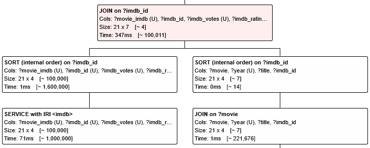

[QLever](https://qlever.cs.uni-freiburg.de/wikidata) is a SPARQL query engine used to search [RDF](https://www.w3.org/RDF/)(Resource Description Framework) databases.
Within a SPARQL query the `SERVICE` keyword can be used to define a federated query computed by a different endpoint, allowing information from datasets hosted on different endpoints to be embedded into the same query.
This blog-post will highlight some improvements to the implementation of the QLever Service operation.

<!--more-->

## Table of Contents

- [What is a Federated Query?](#what-is-a-federated-query)
- [Efficient Computation](#efficient-computation)
- [Result format](#result-format)
- [RuntimeInformation for Federated Queries](#runtimeinformation-for-federated-queries)
- [Conclusion](#conclusion)

## What is a Federated Query?

Usually a SPARQL query can be sent to a QLever endpoint to retrieve information provided in its dataset. However, sometimes we might be interested in integrating information from multiple datasets provided by different endpoints - here the `SERVICE` keyword comes in.
It allows the user to define a Federated Query that will be sent to and processed by a given SPARQL endpoint.

Let's take a look at an example:

We are interested in a list of all movies that were directed by the [Coen brothers](https://en.wikipedia.org/wiki/Coen_brothers). As it turns out, we can find movies and their `imdb_id`, as well as the Coen brothers, Ethan and Joel, in the Wikidata database. This results in the titles of the movies directed by the Coen brothers, but we are also interested in their rating and votes on [IMDb](https://imdb.com)(Internet Movie Database). Unfortunately they are not available in the Wikidata database.

Using a Service query to a SPARQL endpoint that provides the IMDb dataset, we can extend our previous result with these two columns.

````sparql
PREFIX wd: <http://www.wikidata.org/entity/>
PREFIX wdt: <http://www.wikidata.org/prop/direct/>
PREFIX schema: <http://schema.org/>
PREFIX imdb: <https://www.imdb.com/>
PREFIX rdfs: <http://www.w3.org/2000/01/rdf-schema#>
PREFIX p: <http://www.wikidata.org/prop/>
SELECT ?movie ?title ?year ?imdb_id ?imdb_votes ?imdb_rating WHERE {
  { SELECT ?movie (YEAR(MIN(?date)) AS ?year) WHERE { ?movie wdt:P31 wd:Q11424; wdt:P577 ?date } GROUP BY ?movie }
  ?movie wdt:P345 ?imdb_id .
  ?movie wdt:P57 wd:Q13595531 .
  ?movie rdfs:label ?title FILTER (LANG(?title) = "en") .

  SERVICE <https://qlever.cs.uni-freiburg.de/api/imdb> {
    ?movie_imdb imdb:id ?imdb_id .
    ?movie_imdb imdb:type "movie" .
    ?movie_imdb imdb:numVotes ?imdb_votes .
    ?movie_imdb imdb:averageRating ?imdb_rating .
  }
}
ORDER BY DESC(?imdb_votes)
````

<figure>
    <center>
    <div style="height: 200px; width: auto; overflow-x: scroll;">
    
    </div>
    <figcaption>Query result</figcaption>
    </center>
    <br>
</figure>

---

## Efficient Computation

When we take a look at the runtime information tree, we can see that the Service query has been joined with the rest of the query on the `?imdb_id` variable.

<figure>
    <center>
    
    <figcaption>Runtime information tree (original)</figcaption>
    </center>
    <br>
</figure>

However, while there are only 21 movies directed by the Coen brothers found by the query, the Service query result consists of ~315,000 rows, which will mostly be discarded in the following `JOIN`-operation.

The Solution: Provide the Service endpoint with the query context, so that result rows of the Service query that would later be discarded are never computed and transferred in the first place.
This is achieved by first computing the result of the query part that will later be joined with the Service. The Service query will then be extended with a `VALUES` clause containing all values from the columns used to join the Service result.
In this case it means, that we first evaluate the result joined with the Service, and then create a `VALUES` clause containing the values of the results `?imdb_id` column.

So internally, QLever will send this query to the Service endpoint:

````sparql
SELECT * {
  VALUES (?imdb_id) { ("tt0477348") ("tt0118715") ("tt0116282") ... } .
  ?movie_imdb imdb:id ?imdb_id .
  ?movie_imdb imdb:type "movie" .
  ?movie_imdb imdb:numVotes ?imdb_votes .
  ?movie_imdb imdb:averageRating ?imdb_rating .
}
````

In this case, the runtime information tree shows that the Service operation now results only in the 21 required rows, reducing its computation time from almost 7,000ms to about 70ms. Additionally, the requesting QLever instance no longer has to process and store irrelevant result rows of the Service Query (~315,000 in this example, can be much more).
This significantly improves the efficiency and might even help queries complete on less powerful hardware.

<figure>
    <center>
    
    <figcaption>Runtime information tree (improved)</figcaption>
    </center>
    <br>
</figure>

---

## Result Format

For receiving the query result of a SPARQL query, there are a couple of standardized result formats commonly used like e.g. CSV, TSV or JSON.
Previously, QLever requested the result of Service queries from Service endpoints to be in TSV(Tab-separated-values)-format.
This resulted in some Service queries to not work as expected, e.g. when the Service result contained literals with escaped characters, datatypes or blank nodes.

Instead, QLever now uses the [SPARQL 1.1 Query Results JSON](https://www.w3.org/TR/sparql11-results-json/) format, representing each binding as a JSON-object containing a `type`, `value`, and optionally, `xml:lang` and `datatype` fields. For Example:


| TSV | JSON |
| --- | --- |
| `"Abraham \"Bram\" Wiertz"@en` | `{"value" : "Abraham \"Bram\" Wiertz", "type": "literal", "xml:lang": "en"}` |
| `"42"^^<http://www.w3.org/2001/XMLSchema#integer>` | `{"value": "42", "type": "literal", "datatype": "http://www.w3.org/2001/XMLSchema#integer"}` |
| `"2025-01-01"^^<http://www.w3.org/2001/XMLSchema#date>` | `{"value": "2025-01-01", "type": "literal", "datatype": "http://www.w3.org/2001/XMLSchema#date"}` |

While being more verbose, it allows for a more robust and therefore correct representation of RDF-bindings.
It also allows QLever to receive additional information besides the query result from the Service endpoint.

---

## RuntimeInformation for Federated Queries

During the computation of a query, the QLever engine collects so-called `RuntimeInformation` about the query execution.
This information includes the computation time, and the size of the result for each operation in the query.
A QLever endpoint provides this information to the client using a WebSocket endpoint.
A client such as [QLever UI](https://github.com/ad-freiburg/qlever-ui) can fetch and display this information, allowing the user to analyze the queries performance.

In order to obtain the runtime information for a Service query, we have extended the Service operation with a WebSocket client.
During the retrieval of the Service query result, the WebSocket client fetches the runtime information from the Service endpoint.
Since runtime information is a QLever specific feature, it can only be retrieved if the Service endpoint is also a QLever instance.
While other SPARQL query engines might collect information on the query execution too, there is no standardized format that we can make use of.

The runtime information of the Service query in the previous example can now be visualized in QLever UI like this:
<figure>
    <center>
    
    <figcaption>RuntimeInformation of the Service query</figcaption>
    </center>
    <br>
</figure>

This also works for nested Service queries, as long as each Service endpoint is a QLever instance.

---

## Conclusion

Federated queries are a powerful feature of the SPARQL query language, allowing the user to extend queries beyond a single dataset.
With the presented improvements targeting both efficiency and correctness, usability of the QLever Service operation has improved significantly.
Future work might include additional communication with QLever Service endpoints using the presented WebSocket client, such as cancelling the query execution if the user aborts the query early.
