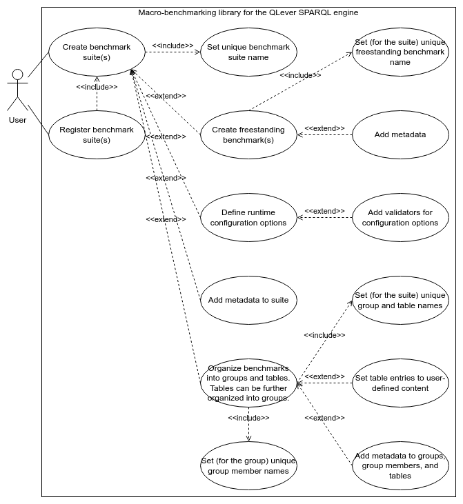
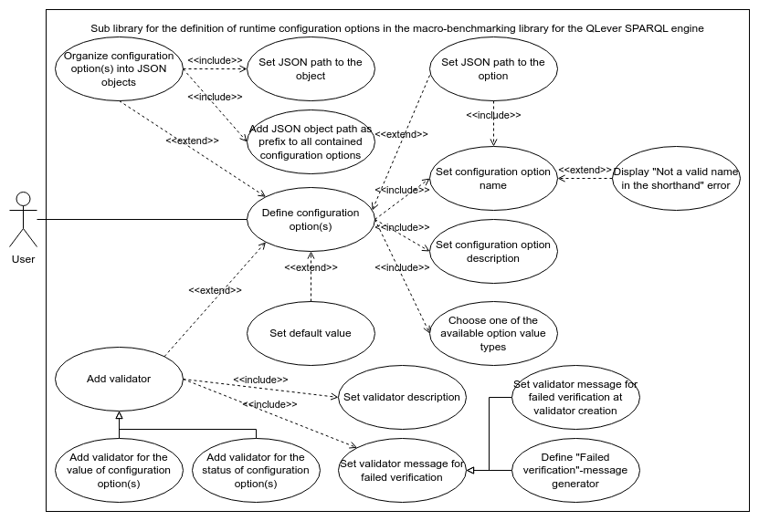
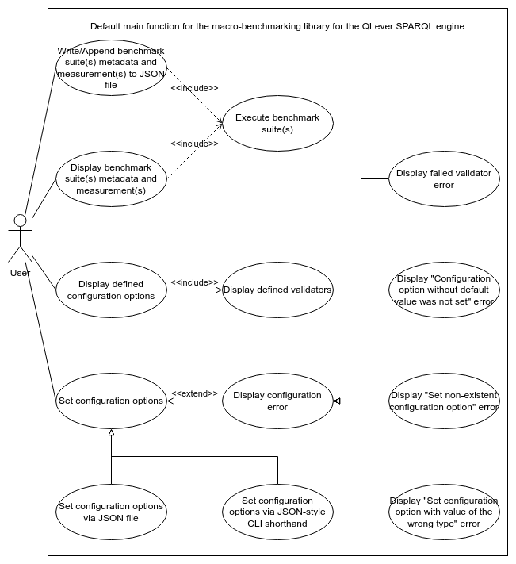
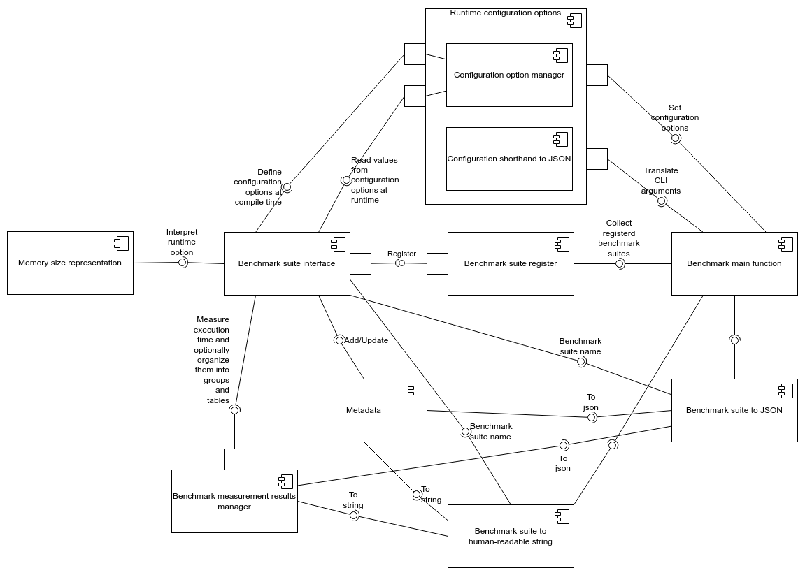

Comparing execution times of different algorithm implementations can be time and work intensive. This time and work is needed to cover every possible, generalized situation for the different algorithm implementations, otherwise, no true statements can be made about the execution times of different algorithm implementations. To make covering every possible, generalized situation for the different algorithm implementations easier, I've built an internal macro-benchmarking library for the [QLever SPARQL engine](https://github.com/ad-freiburg/qlever). The internal macro-benchmarking library for the [QLever SPARQL engine](https://github.com/ad-freiburg/qlever) offers a simple method for measuring execution time in seconds, multiple ways to organize measured execution times, metadata support, and support for user-defined runtime configuration options, which should simplify the generation of measured execution times.

<!--more-->
---
## Content
- [Introduction](#introduction)

- [Key Ideas](#key-ideas)

  - [Macro Benchmark Suite Creation](#macro-benchmark-suite-creation)

  - [Defining Runtime Configuration Options](#defining-runtime-configuration-options)

  - [Macro Benchmark Suite Execution](#macro-benchmark-suite-execution)

- [Implementation](#implementation)

- [Conclusion](#conclusion)

- [Glossary](#glossary)
----

## Introduction

Reducing the execution times for queries to the [QLever SPARQL engine](https://github.com/ad-freiburg/qlever) requires reducing the execution times of algorithm implementations in the [QLever SPARQL engine](https://github.com/ad-freiburg/qlever). Reducing the execution time of an algorithm implementation in the [QLever SPARQL engine](https://github.com/ad-freiburg/qlever), is done by either changing the used algorithm, or by changing the implementation of the algorithm.

It is not always apparent if the changed implementation or changed algorithm always has a reduced execution time, only has a reduced execution time in specific situations, or never has a reduced execution time. To tell if, and when, the execution time is reduced, the execution time must be measured in every possible, generalized situation the changed implementation or changed algorithm may encounter. Such measurements are done with a set of benchmarks, a computer program that measures the speed, a.k.a. execution time, of computer software. A set of benchmarks is called a benchmark suite. A benchmark suite should contain at least one benchmark for every possible, generalized situation the changed implementation or changed algorithm may encounter. However, creating a benchmark suite with at least one benchmark for every possible, generalized situation the changed implementation or changed algorithm may encounter takes a lot of time.

Generating a benchmark suite with at least one benchmark for every possible, generalized situation the changed implementation or changed algorithm may encounter via an algorithm is not possible. Because generation via an algorithm is not possible, I've tried to reduce the construction time by building an internal macro-benchmarking library for the [QLever SPARQL engine](https://github.com/ad-freiburg/qlever).

A macro benchmark is designed to measure long execution times. A long execution time, for example, would be one second. A long execution time tends to correlate to a large workload, the amount of work that a person or machine has to do within a particular period of time.

Currently, my internal macro-benchmarking library for the [QLever SPARQL engine](https://github.com/ad-freiburg/qlever) enables its user to measure execution time in seconds, organize macro benchmarks, define configuration option for use at runtime, and define metadata. The organized macro benchmark measurements, defined runtime configuration options, and defined metadata can be displayed in a human-readable format. The organized macro benchmark measurements and defined metadata can also be exported to a JSON file.

There are third-party benchmarking libraries that could be used for benchmark suite construction instead of my internal macro-benchmarking library for the [QLever SPARQL engine](https://github.com/ad-freiburg/qlever). However, all third-party benchmarking libraries that I could find are micro benchmarking libraries. A micro benchmarking library is designed to measure very short execution times, often in the range of milliseconds, as accurately as possible. The [QLever SPARQL engine](https://github.com/ad-freiburg/qlever) has a focus on short execution times for big workloads. However, in the context of the [QLever SPARQL engine](https://github.com/ad-freiburg/qlever), a short execution time for a big workload can mean multiple seconds to multiple days. Multiple seconds to multiple days are not a good fit for micro benchmarks, who are designed for execution times in the range of milliseconds. Multiple seconds to multiple days are better measured with a macro benchmarks, who are designed for long execution times in the range of one seconds and longer. Therefore, when writing a benchmark for an implemented algorithm in the [QLever SPARQL engine](https://github.com/ad-freiburg/qlever) with the same focus as the [QLever SPARQL engine](https://github.com/ad-freiburg/qlever), a short execution time of multiple seconds to multiple days for a big workload, a macro benchmark is a better fit than a micro benchmark.

## Key Ideas

In this section, I will walk through all the functionality my internal macro-benchmarking library for the [QLever SPARQL engine](https://github.com/ad-freiburg/qlever) provides.

First off, a few short definitions:

- Benchmark: A computer program that measures the speed, a.k.a. execution time, of computer software.

- Benchmark suite: Set of benchmarks.

- Metadata: Information that is given to describe or help you use other information.

- Workload: The amount of work that a person or machine has to do within a particular period of time.

The functionality of my internal macro-benchmarking library for the [QLever SPARQL engine](https://github.com/ad-freiburg/qlever) can be split into three sections:

1. Creating one, or more, macro benchmark suites.

2. Defining runtime configuration options.

3. Executing one, or more, macro benchmark suites.

For every section, I will go through a UML use case diagram overview and explain the UML use case diagram overview.

### Macro Benchmark Suite Creation

<figure>
    <center>
    
    <figcaption>Figure 1 - UML use case diagram overview for macro benchmark suite creation.</figcaption>
    </center>
    <br>
</figure>

In this section, I will go through the creation of macro benchmark suites inside my internal macro-benchmarking library for the [QLever SPARQL engine](https://github.com/ad-freiburg/qlever).

Firstly, a user creates zero, or more, empty macro benchmark suites. Every macro benchmark suite has to be uniquely named by the user. This unique name is used to differentiate between different macro benchmark suites when executing one, or more, macro benchmark suites.

Inside a macro benchmark suite, a user can create zero, or more, freestanding macro benchmarks. Freestanding macro benchmarks are normal macro benchmarks, that are not organized in any structure. Every freestanding macro benchmark has to be named by the user. The name of a freestanding macro benchmark must be unique inside the macro benchmark suite containing the freestanding macro benchmark. Metadata can be added to a freestanding macro benchmark.

Inside a macro benchmark suite, runtime configuration options can be defined. If a user created more than one macro benchmark suite, all the macro benchmark suites need to have the same runtime configuration options. For more information see the section [defining runtime configuration options](#defining-runtime-configuration-options).

Inside a macro benchmark suite, metadata can be added to the macro benchmark suite itself. This metadata normally describes general information. General information are information, that are shared by all macro benchmarks in the macro benchmark suite.

Inside a macro benchmark suite, a user can create zero, or more, table for the organization of macro benchmarks. Every table has to be named by the user. The name of a table must be unique inside the macro benchmark suite containing the table. Metadata can be added to a table. The number of columns in a table must be set when creating a table and can not be changed, as are the names of the columns in a table. However, the number of rows in a table can set when creating a table and can be changed after creating the table. Names for the rows in a table are optional. Names for the rows in a table can be set when creating a table and can be changed after creating the table. Every entry in a table is either a macro benchmark measurement or set by a user. An entry set by a user can be a boolean, a string, or a rational number.

Inside a macro benchmark suite, a user can create zero, or more, groups for the organization of macro benchmarks and tables. Every group has to be named by the user. The name of a group must be unique inside the macro benchmark suite containing the group. Metadata can be added to a group. A group is a set of group members. A group member can be a macro benchmark or a table. Every group member has to be named by the user. The name of a group member must be unique inside the group containing the group member. Metadata can be added a to a group member.

After a user creates zero, or more, empty macro benchmark suites and defines the inside of the macro benchmark suites, the user can register none, only a part, or all of the macro benchmark suites. Only registered macro benchmark suites will be executed later. For more information see the section [macro benchmark suite execution](#macro-benchmark-suite-execution).

### Defining Runtime Configuration Options

<figure>
    <center>
    
    <figcaption>Figure 2 - UML use case diagram overview for runtime configuration option definition.</figcaption>
    </center>
    <br>
</figure>

In this section, I will go through the process of defining runtime configuration options inside my internal macro-benchmarking library for the [QLever SPARQL engine](https://github.com/ad-freiburg/qlever).

Runtime configuration options are, in the context of my internal macro-benchmarking library for the [QLever SPARQL engine](https://github.com/ad-freiburg/qlever), variables inside a compiled program, that can be set by a user at runtime from outside the compiled program. Runtime configuration options are organized within a recursive JSON object structure. A recursive JSON object structure is a JSON object, that can contain only key value pairs with the value a recursive JSON object structure or a runtime configuration option. A user can set the runtime configuration options at runtime either by passing a JSON file, or by passing a JSON-style shorthand string via the CLI. For more information about the JSON-style shorthand see the section [macro benchmark suite execution](#macro-benchmark-suite-execution).

A user can define zero, or more, runtime configuration options. When defining a runtime configuration option, a user must:

- Define an array of strings, with at least one string, describing the position of the runtime configuration option in the recursive JSON object structure. I call this array of strings a JSON path. Iteratively using the JSON path strings as keys inside the recursive JSON object structure, will point to the runtime configuration option. However, the JSON path to a runtime configuration option is not allowed to be a prefix of an JSON path to a different runtime configuration option. The last string of the JSON path to a runtime configuration option will be used as the name for the runtime configuration option. 

- Write a description for the runtime configuration option. The description is later used in the generated documentation. For more information about the generated documentation see the section [macro benchmark suite execution](#macro-benchmark-suite-execution).

- Choose one of the available types for the value of the runtime configuration option. The available types for the value of the runtime configuration option are boolean, string, number, array of boolean, array of string, or array of number. The runtime configuration option can only be set to a value of the type chosen for the runtime configuration option.

Optionally, a user can give a default value for the runtime configuration option. When the runtime configuration option is not set a runtime and a default value for the runtime configuration option was given, the runtime configuration option will be set to the default value. When no default value for the runtime configuration option was given, the runtime configuration option must be set at runtime.

A user can create zero, or more, JSON objects inside the recursive JSON object structure. Runtime configuration options can be defined inside those JSON objects. JSON objects inside the recursive JSON object structure are used to organize runtime configuration options. When creating a JSON object inside the recursive JSON object structure, the user must give an array of strings, with at least one string, describing the position of the JSON object in the recursive JSON object structure. I call this array of strings a JSON path. The JSON path to the JSON object is added as a prefix to the JSON paths of all the runtime configuration options contained inside the JSON object.

After defining the runtime configuration options, the user can add zero, or more, validators. A validator, in the context of my internal macro-benchmarking library for the [QLever SPARQL engine](https://github.com/ad-freiburg/qlever), checks the validity of the status of a runtime configuration option at runtime or checks the validity of the value a runtime configuration option was set to at runtime. A validator can check the validity of one, or more, runtime configuration options at runtime. When defining a validator, a user must:

- Give the runtime configuration options, a validator checks the validity of at runtime, to the validator.

- Write a description for the validator. The description is later used in the generated documentation. For more information about the generated documentation see the section [macro benchmark suite execution](#macro-benchmark-suite-execution).

- Write a failure message. The failure message is shown when the validator checks the validity of runtime configuration options and the runtime configuration options do not pass. For more information see the section [macro benchmark suite execution](#macro-benchmark-suite-execution). The failure message can be a fixed message or a message generated by the validator. A message generated by the validator can include more information, for example, has the runtime configuration option a default value and was it set at runtime?

### Macro Benchmark Suite Execution

<figure>
    <center>
    
    <figcaption>Figure 3 - UML use case diagram overview for macro benchmark suite execution.</figcaption>
    </center>
    <br>
</figure>

In this section, I will go through the functionality of the current default main function for my internal macro-benchmarking library for the [QLever SPARQL engine](https://github.com/ad-freiburg/qlever).

Firstly, when macro benchmarks are executed, than every macro benchmark in a registered macro benchmark suite is executed once. Only executing a subset of all macro benchmarks in registered macro benchmark suites is not supported. Macro Benchmarks in not registered macro benchmark suites can never be executed. The execution of macro benchmarks only happens if a user chose to write, and optionally append, registered macro benchmark suites metadata and measurements to a JSON file, or if a user chose to display the registered macro benchmark suites metadata and measurements. While executing the macro benchmarks, a message will be displayed before and after executing a macro benchmark. This message informs the user about the progress of the macro benchmark executions.

A user can choose to display the registered macro benchmark suites metadata and measurements. After executing all macro benchmarks in registered macro benchmark suites, the registered macro benchmark suites will be displayed in a list. Every registered macro benchmark suit will be displayed as:

- Macro benchmark suite name.

- Macro benchmark suite metadata.

- What values the runtime configuration options of the registered macro benchmark suite were set to.

- A detailed list of all the runtime configuration options of the registered macro benchmark suite and all the validator for runtime configuration options of the registered macro benchmark suite. Every runtime configuration option of the registered macro benchmark suite is displayed with the runtime configuration option name, the runtime configuration option value type, the value the runtime configuration option was set to, the runtime configuration option description, and the runtime configuration option default value, if a runtime configuration option default value was given. If a runtime configuration option of the registered macro benchmark suite is contained inside a JSON object, the fact, that the runtime configuration option of the registered macro benchmark suite is contained inside a JSON object, will be displayed, together with the name of the JSON object, that contains the runtime configuration option of the registered macro benchmark suite. Every validator for runtime configuration options of the registered macro benchmark suite is displayed with the validator description.

- A list of the freestanding macro benchmarks in the registered macro benchmark suite. Every freestanding macro benchmark is displayed with the measured time in seconds and the freestanding macro benchmark metadata, if freestanding macro benchmark metadata was defined.

- A list of the tables in the registered macro benchmark suite. Every table is displayed with the table metadata, if table metadata was defined. The content of a table is displayed row for row and separated by line breaks. Above the displayed rows of a table, the tables column names are displayed.

- A list of the groups in the registered macro benchmark suite. For every group the group metadata is displayed, if the group metadata was defined. For every group all group members are displayed in a list. The macro benchmarks in a group are displayed the same way as the freestanding macro benchmarks. The tables in a group are displayed the same way as the entries of the list of tables in the registered macro benchmark suite.

A user can choose to write the registered macro benchmark suites metadata and measurements to a JSON file. If wanted, the registered macro benchmark suites metadata and measurements can be appended to the JSON file. If the user does not want the registered macro benchmark suites metadata and measurements to be appended to the JSON file, the content of the JSON file will be overwritten. The new content of the JSON file will contain JSON representations of all registered macro benchmark suites.

The JSON representation of a registered macro benchmark suite contains the registered macro benchmark suite name, registered macro benchmark suite metadata, JSON representations of all the freestanding macro benchmarks in the registered macro benchmark suite, JSON representations of all the groups in the registered macro benchmark suite, and JSON representations of all the tables in the registered macro benchmark suite. The JSON representation of a freestanding macro benchmark in the registered macro benchmark suite contains the name of the freestanding macro benchmark in the registered macro benchmark suite, the metadata of the freestanding macro benchmark in the registered macro benchmark suite, and the measurement of the freestanding macro benchmark in the registered macro benchmark suite. The JSON representation of a table in the registered macro benchmark suite contains the name of the table in the registered macro benchmark suite, the metadata of the table in the registered macro benchmark suite, and JSON representations of the content of the table in the registered macro benchmark suite. The JSON representation of a group in the registered macro benchmark suite contains the name of the group in the registered macro benchmark suite, the metadata of the group in the registered macro benchmark suite, and JSON representations all the group members of the group in the registered macro benchmark suite.

A user can display all runtime configuration options of all registered macro benchmark suites and all the validator for runtime configuration options of all the registered macro benchmark suites. Displaying all runtime configuration options of all registered macro benchmark suites and all the validator for runtime configuration options of all the registered macro benchmark suites does not execute any macro benchmarks of the registered macro benchmark suites. The runtime configuration options of all registered macro benchmark suites and all the validator for runtime configuration options of all the registered macro benchmark suites are displayed in as a list. A runtime configuration option of the registered macro benchmark suite is displayed with the runtime configuration option name, the runtime configuration option value type, the value the runtime configuration option was set to, the runtime configuration option description, and the runtime configuration option default value, if a runtime configuration option default value was given. If a runtime configuration option of the registered macro benchmark suite is contained inside a JSON object, the fact, that the runtime configuration option of the registered macro benchmark suite is contained inside a JSON object, will be displayed, together with the name of the JSON object, that contains the runtime configuration option of the registered macro benchmark suite. A validator for runtime configuration options of the registered macro benchmark suite is displayed with the validator description.

As a reminder:

- Runtime configuration options are, in the context of my internal macro-benchmarking library for the [QLever SPARQL engine](https://github.com/ad-freiburg/qlever), variables inside a compiled program, that can be set by a user at runtime from outside the compiled program.

- Runtime configuration options are organized within a recursive JSON object structure. A recursive JSON object structure is a JSON object, that can contain only key value pairs with the value a recursive JSON object structure or a runtime configuration option.

A user can set the values of runtime configuration options at runtime either by passing a JSON file, or by passing a JSON-style shorthand string. Setting the values of runtime configuration options at runtime either by passing a JSON file, or by passing a JSON-style shorthand string does not execute any macro benchmarks of the registered macro benchmark suites.

When a user sets the values of runtime configuration options at runtime by passing a JSON file, the JSON file must contain a modified version of the recursive JSON object structure for configuration options. I call this modified version of the recursive JSON object structure for configuration options the runtime configuration. The runtime configuration contains no configuration options. Instead of configuration options, the runtime configuration contains values for configuration options. A configuration option at the same position as a value in the runtime configuration will be set to this value.

When a user sets the values of runtime configuration options at runtime by passing a JSON-style shorthand string, the JSON-style shorthand string describes a runtime configuration, see the previous paragraph, in a different syntax, slightly different from JSON. The syntax used in the JSON-style shorthand string was designed for use with the CLI. For more information about the syntax used in the JSON-style shorthand string, see the relevant paragraph in the section [implementation](#implementation).

Setting the values of runtime configuration options at runtime can fail. If syntax error are ignored, the reason for the failure when trying to set the values of runtime configuration options at runtime must be one of the following:

- A validator checked the validity of one, or more, runtime configuration options at runtime and the runtime configuration option failed the validity check. In this case, the failure message of the validator where the configuration options failed is displayed, and the names and values of all configuration options who were checked for validity by the validator are displayed.

- The user did not set the value of a configuration option without a default value. A configuration option without a default value must always be set. Remember, runtime configuration options are, in the context of my internal macro-benchmarking library for the [QLever SPARQL engine](https://github.com/ad-freiburg/qlever), variables inside a compiled program, that can be set by a user at runtime from outside the compiled program. A variable without a value can lead to hard to identify errors in algorithms. The configuration option without a default value who was not set will be displayed.

- The user tried to set the value of a non-existent configuration option. Trying to set the value of a non-existent configuration option tends to be the symptom of a bigger error or bigger misunderstanding.

- The user tried to set the value of a configuration option to a value with a type different from the defined type of the value of the configuration option. Remember, runtime configuration options are, in the context of my internal macro-benchmarking library for the [QLever SPARQL engine](https://github.com/ad-freiburg/qlever), variables inside a compiled program, that can be set by a user at runtime from outside the compiled program. A variable with a type different from the expected type can lead to hard to identify errors in algorithms. The configuration option whose value the user tried to set to a value with a type different from the defined type of the value of the configuration option will be displayed.

## Implementation

In this section, I will give a rough overview about the implementation of my internal macro-benchmarking library for the [QLever SPARQL engine](https://github.com/ad-freiburg/qlever).

<figure>
    <center>
    
    <figcaption>Figure 4 - UML component diagram overview for my internal macro-benchmarking library for the QLever SPARQL engine.</figcaption>
    </center>
    <br>
</figure>

In order to define a macro benchmark suite, a user must implement the benchmark suite interface. The benchmark suite interface holds a metadata object. As a reminder, metadata are information, that are given to describe or help you use other information. The metadata object held by the macro benchmark suite normally describes general information. General information are information, that are shared by all macro benchmarks in the macro benchmark suite. The metadata object held by the macro benchmark suite can be accessed via getter.

The metadata class itself wraps a third-party JSON object. However, only key value pairs can be added to the third-party JSON object wrapped by the metadata class. Key value pairs added to the third-party JSON object wrapped by the metadata class can never be deleted, but the value in a key value pair can be updated.

```cpp
class ExampleBenchmarkSuiteImplementation : public BenchmarkInterface {
 public:
  BenchmarkResults runAllBenchmarks() final {
    BenchmarkMetadata& meta{getGeneralMetadata()};
    meta.addKeyValuePair("exampleOne", 7);
    meta.addKeyValuePair("exampleTwo", "Fourty");
    // The new value is 8.971.
    meta.addKeyValuePair("exampleOne", 8.971);
    return BenchmarkResults{};
  }
};
```
<center style="margin-top:-35px;margin-bottom:55px;">Figure 5: Minimized example usage of the metadata of an example benchmark suite interface implementation.</center>

For the definition of runtime configuration options the benchmark suite interface holds a configuration option manager. A configuration option manager handles the definition of runtime configuration options, manages defined runtime configuration options, handles the defining of validators, and manages defined validators.

A quick reminder for the example, runtime configuration options are, in the context of my internal macro-benchmarking library for the [QLever SPARQL engine](https://github.com/ad-freiburg/qlever), variables inside a compiled program, that can be set by a user at runtime from outside the compiled program.

```cpp
class ExampleBenchmarkSuiteImplementation : public BenchmarkInterface {
 protected:
  // The values the runtime configuration options were set to will be found here.
  std::string dateString_;
  int numberOfStreetSigns_;
  std::vector<bool> wonOnTryX_;
  float balanceOnStevesSavingAccount_;

 public:
  ConfigOptions() {
    ad_utility::ConfigManager& manager = getConfigManager();

    // Simple runtime configuration options with default values.
    manager.addOption("date", "The current date.", &dateString_, "22.3.2023"s);
    manager.addOption("coin-flip-try", "The number of succesful coin flips.",
                      &wonOnTryX_, {false, false, false, false, false});
    auto numSigns =
        manager.addOption("num-signs", "The number of street signs.",
                          &numberOfStreetSigns_, 10000);

    // A simple validator that checks the value of a configuration option.
    manager.addValidator([](const int& num) { return num >= 0; },
                         "The number of street signs must be at least 0!",
                         "Negative numbers, or floating point numbers, are not "
                         "allowed for the configuration option \"num-signs\".",
                         numSigns);

    // Sub manager can be used to organize runtime configuration options better.
    // They are basically just a path prefix for all the runtime configuration options
    // inside it.
    // Note: I've called sub manager
    // "JSON objects inside the recursive JSON object structure" inside this thesis.
    ad_utility::ConfigManager& subManager{
        manager.addSubManager({"accounts"s, "personal"s})};
    subManager.addOption("steve"s, "Steves saving account balance.",
                         &balanceOnStevesSavingAccount_, -41.9f);
  }
};
```
<center style="margin-top:-35px;margin-bottom:55px;">Figure 6: Minimized example usage of the runtime configuration options of an example benchmark suite interface implementation.</center>

Often a user will want to limit memory usage of a macro benchmark suite. For example, when the macro benchmark suite is executed on different hardware with more, or less, available memory. I've created an explicit type for memory size representation to easier communicate such memory usage limits inside code. This explicit type for memory size representation is called `MemorySize`. `MemorySize` supports interpreting strings, comparisons between values of `MemorySize`, conversion to string, and conversion to, and from, most memory size units like, for example, bytes, kilobytes, and megabytes. By using `MemorySize` in conjunction with runtime configuration options, a user can easily set different memory usage limits at runtime.

As a reminder, a user can create freestanding macro benchmarks, tables for the organization of macro benchmarks, and groups for the organization of macro benchmarks and tables. For more information see the section [macro benchmark suite creation](#macro-benchmark-suite-creation).

A user creates freestanding macro benchmarks, tables for the organization of macro benchmarks, and groups for the organization of macro benchmarks and tables, using a macro benchmark measurement results manager. A macro benchmark measurement results manager manages instances of classes representing freestanding macro benchmarks, tables for the organization of macro benchmarks, and groups for the organization of macro benchmarks and tables. In the benchmark suite interface, a user creates a macro benchmark measurement results manager by implementing an abstract function that returns a macro benchmark measurement results manager.

```cpp
class ExampleBenchmarkSuiteImplementation : public BenchmarkInterface {
 public:
  BenchmarkResults runAllBenchmarks(){
    BenchmarkResults results{};

    /*
    The functions for measuring the execution time of functions only take
    lambdas, which will be called without any arguments. Simply wrap the actual
    function call you want to measure.
    */
    auto& dummyFunctionToMeasure = [](){
      // Do whatever you might want to measure.
    };

    // In order to recognise later, which time belongs to which macro benchmark,
    // most of the functions concerning the measurement of functions, or their
    // organization, require an identifier. A.k.a. a name.
    const std::string identifier = "Some identifier";

    // Create a freestanding macro benchmark.
    results.addMeasurement(identifier, dummyFunctionToMeasure);

    /*
    Create an empty table with a number of rows and columns.
    The number of columns can not be changed after creation, but the number of rows can.
    Important: The row names aren't saved in a seperate container, but INSIDE the
    first column of the table.
    */
    auto& table = results.addTable(identifier, {"rowName1", "rowName2", "etc."},
      {"Column for row names", "columnName1", "columnName2", "etc."});

    // You can add measurements to the table as entries, but you can also
    // read and set entries.
    table.addMeasurement(0, 2, dummyFunctionToMeasure); // Row 0, column 1.
    table.setEntry(0, 1, "A custom entry");
    table.getEntry(0, 2); // The measured time of the dummy function.

    // Replacing a row name.
    table.setEntry(0, 0, "rowName1++");

    /*
    Creates an empty group. Groups and tables can be added to better organize
    them.
    */
    auto& group = results.addGroup(identifier);
    // Add a macro benchmark.
    group.addMeasurement(identifier, dummyFunctionToMeasure);
    // Add a table.
    group.addTable(identifier, {"rowName1", "rowName2", "etc."},
      {"Column for row names", "columnName1", "columnName2", "etc."});

    return results;
  }
};
```
<center style="margin-top:-35px;margin-bottom:55px;">Figure 7: Minimized example usage of benchmark measurement results manager inside a example benchmark suite interface implementation.</center>

After defining a macro benchmark suite, and the content of the macro benchmark suite, a user must register the implemented benchmark suite interface of the defined macro benchmark suite. An implemented benchmark suite interface is registered using the benchmark suite register. Every instance of benchmark suite register shares the same internal array of registered implemented benchmark suite interfaces. Creating a global instance of `BenchmarkRegister` and passing an instance of the implemented benchmark suite interface, will add the instance of the implemented benchmark suite interface to the internal array of registered, implemented benchmark suite interfaces. To make the registering of implemented benchmark suite interfaces easier, a macro is available. This macro performs all steps needed to register the implemented benchmark suite interface.

Finally, the benchmark main function, a collection of functions, manages the registered macro benchmark suites. The benchmark main function uses a third-party library to translate the CLI arguments generated by the user. After translating the CLI arguments generated by the user, the main function uses various helper functions to execute the translated CLI arguments generated by the user.

If a CLI argument to display all runtime configuration options of all registered macro benchmark suites and all the validator for runtime configuration options of all the registered macro benchmark suites was given, the benchmark main function will display all runtime configuration options of all registered macro benchmark suites and all the validator for runtime configuration options of all the registered macro benchmark suites, using a helper function in the benchmark main function and a helper function in the configuration option manager.

As a reminder:

- Runtime configuration options are organized within a recursive JSON object structure. A recursive JSON object structure is a JSON object, that can contain only key value pairs with the value a recursive JSON object structure or a runtime configuration option.

- A user can set the values of runtime configuration options at runtime either by passing a JSON file, or by passing a JSON-style shorthand string.

- When a user sets the values of runtime configuration options at runtime by passing a JSON file, the JSON file must contain a modified version of the recursive JSON object structure for configuration options. I call this modified version of the recursive JSON object structure for configuration options the runtime configuration. The runtime configuration contains no configuration options. Instead of configuration options, the runtime configuration contains values for configuration options. A configuration option at the same position as a value in the runtime configuration will be set to this value.

- When a user sets the values of runtime configuration options at runtime by passing a JSON-style shorthand string, the JSON-style shorthand string describes a runtime configuration, see the previous list item, in a syntax slightly different from JSON. The syntax used in the JSON-style shorthand string was designed for use with the CLI.

The syntax of a JSON-style shorthand string is the normal JSON syntax with four differences:

1. Only a runtime configuration can be described.

2. No line breaks.

3. The key of any key value pair is not surrounded by quotation marks. Furthermore, a key can only contain letters, numbers, the dash symbol, and the underscore symbol.

4. The outermost JSON object in the runtime configuration is not surrounded by curly brackets. All other JSON objects than the outermost JSON object are still surrounded by curly brackets.

If a CLI argument for setting the values of runtime configuration option was given, the benchmark main function, using a helper class, that translates the configuration shorthand to JSON, and the configuration option manager, sets the values of the runtime configuration options of all registered macro benchmark suites.

If a CLI argument to display the registered macro benchmark suites metadata and measurements was given, the benchmark main function will execute all macro benchmarks in registered macro benchmark suites and display the registered macro benchmark suites, using multiple helper functions, in a list. The collection of multiple helper functions for displaying the registered macro benchmark suites is called "Benchmark suite to human-readable string" in the figure <a href="#ComponentDiagram">4</a>.

If a CLI argument to write, and optionally append, the registered macro benchmark suites metadata and measurements to a given JSON file was given, the benchmark main function will execute all benchmarks in registered macro benchmark suites, translate the registered macro benchmark suites, using multiple helper functions, to JSON, and write the JSON to the given JSON file.  The collection of multiple helper functions for translating the registered macro benchmark suites to JSON is called "Benchmark suite to JSON" in the figure <a href="#ComponentDiagram">4</a>.

## Conclusion

I have created a relatively easy to use internal macro-benchmarking library for the [QLever SPARQL engine](https://github.com/ad-freiburg/qlever) with a focus on organizing macro-benchmarks and processing runtime configuration options.

I have compared the features of my macro-benchmarking library for the [QLever SPARQL engine](https://github.com/ad-freiburg/qlever) with the features of nine different third-party micro-benchmarking libraries. I was unable to find any third-party macro-benchmarking libraries for the `C++`-language. The nine different micro-benchmarking libraries are:

- [Picobench](https://github.com/iboB/picobench)

- [Nanobench](https://nanobench.ankerl.com/)

- [Catch2](https://github.com/catchorg/Catch2)

- [Sltbench](https://github.com/ivafanas/sltbench?tab=readme-ov-file)

- [Folly benchmark component](https://github.com/facebook/folly)

- [CppBenchmark](https://github.com/chronoxor/CppBenchmark)

- [Hyperfine](https://github.com/sharkdp/hyperfine)

- [Celero](https://github.com/DigitalInBlue/Celero)

- [Google benchmark](https://github.com/google/benchmark)

As a reminder, the [QLever SPARQL engine](https://github.com/ad-freiburg/qlever) has a focus on short execution times for big workloads. In the context of the [QLever SPARQL engine](https://github.com/ad-freiburg/qlever), a short execution time for a big workload can mean multiple seconds to multiple days. Micro benchmarks are designed for execution times in the range of milliseconds. Multiple seconds to multiple days are better measured with a macro benchmarks, who are designed for long execution times in the range of one second and longer.

Following from this information, when working with execution times longer than one second, my macro-benchmarking library for the [QLever SPARQL engine](https://github.com/ad-freiburg/qlever) tends to be the better choice than any of the nine different micro-benchmarking libraries. Furthermore, my macro-benchmarking library for the [QLever SPARQL engine](https://github.com/ad-freiburg/qlever) offers better organization of the benchmarks in the form of groups and tables, and offers runtime configuration option support. Any of the nine different third-party micro-benchmarking libraries supports, at most, the organization of benchmarks into groups. Furthermore, eight of the nine different third-party micro-benchmarking libraries do not support runtime configuration option in any way. Only [Sltbench](https://github.com/ivafanas/sltbench?tab=readme-ov-file) support runtime configuration options, as far as I could find. However, the [Sltbench](https://github.com/ivafanas/sltbench?tab=readme-ov-file) runtime configuration options support seems to be barely documented and seems to only support basic value passing, based on some example benchmarks I could find in the documentation of [Sltbench](https://github.com/ivafanas/sltbench?tab=readme-ov-file).

When working with execution times shorter than one second, any of the nine different micro-benchmarking libraries are a better choice than my macro-benchmarking library for the [QLever SPARQL engine](https://github.com/ad-freiburg/qlever). The measurement tool used by my macro-benchmarking library for the [QLever SPARQL engine](https://github.com/ad-freiburg/qlever) is too inaccurate to use for execution times shorter than one second. Any of the nine different micro-benchmarking libraries are more accurate when measuring execution times shorter than one second. Any of the nine different micro-benchmarking libraries are more accurate when measuring execution times shorter than one second, because their time measurement tools are more accurate, and they implement algorithms to reduce measurement errors. Some of the nine different micro-benchmarking libraries also support more measurement metrics than execution time.

While my macro-benchmarking library for the [QLever SPARQL engine](https://github.com/ad-freiburg/qlever) has its own niche in macro benchmarks, there is room for improvement:

- Currently, the value of a runtime configuration option must be a boolean, string, number, array of boolean, array of string, or array of number. Explicit support for creating a more complex value by interpreting a JSON structure, like a JSON object, would allow a user more flexibility. Being able to create a more complex value by interpreting a JSON structure, could also lead to a more informative runtime configuration option documentation.

- Currently, the benchmark main function executes every macro benchmark in a registered macro benchmark suite exactly once. Most algorithms for the reduction of execution time measurement errors require multiple execution time measurements from the repeated execution of the same benchmark. Extending the benchmark main function to execute every macro benchmark in a registered macro benchmark suite a given number of times, would allow an easy creation of repeated macro benchmark measurements. The repeated macro benchmark measurements could then be written to a JSON file. If a user requires more accurate execution measurements, the user could then use the JSON file of repeated macro benchmark measurements in conjunction with algorithms for the reduction of execution time measurement errors to reduce the execution time measurement error.

While I was working on an extensive example macro benchmark for my bachelor thesis, using my macro-benchmarking library for the [QLever SPARQL engine](https://github.com/ad-freiburg/qlever), I identified three, for now, problems with the ideas behind my macro-benchmarking library for the [QLever SPARQL engine](https://github.com/ad-freiburg/qlever).

Firstly, extracting the information from the content of the JSON file that contains the registered macro benchmark suites metadata and measurements, and that is generated by the benchmark main function, is more complex than anticipated. As of now, I will refer to the JSON file that contains the registered macro benchmark suites metadata and measurements, and that is generated by the benchmark main function, as the benchmark JSON file. The content of the benchmark JSON file is not missing any registered macro benchmark suites metadata or measurements. The JSON structure in the benchmark JSON file is complex enough, that a human can not comprehend all content of the benchmark JSON file by reading it. Purely interpreting the JSON structure of the benchmark JSON file with a program, takes, in my experience, over an hour of work. Reworking the structure of the benchmark JSON file to be simpler, could lessen the time needed to interpret, with a program, the JSON structure of the benchmark JSON file.

Secondly, my macro-benchmarking library for the [QLever SPARQL engine](https://github.com/ad-freiburg/qlever) does not support the repetition of macro benchmarks. Originally, I thought that the fluctuation of macro benchmarks execution time measurements would be ignorable. In micro benchmarks, the fluctuation of execution time measurements is in the range of, at most, centiseconds. A centisecond is `0.01` seconds. Centiseconds are ignorable in macro benchmark execution time measurements, where the focus is on execution time measurements longer than one second. However, a look at the repeated measurement of my example macro benchmark for my bachelor thesis, using my macro-benchmarking library for the [QLever SPARQL engine](https://github.com/ad-freiburg/qlever), has shown fluctuation of execution time measurements in macro benchmarks, that are in the range of seconds. Fluctuations in the range of seconds are not ignorable in macro benchmark execution time measurements. However, when comparing two macro benchmarks whose difference in execution time is multiple seconds, fluctuations in the range of seconds are ignorable. After all, fluctuations in the range of seconds do not change which execution time is faster, when comparing execution times with a difference of multiple seconds.

The fluctuations of macro benchmark execution time measurements can not be removed. However, there are multiple algorithms, that approximate the true average of a macro benchmark execution time measurement if given a set of the same macro benchmark execution time measurement repeated multiple times. As of now, I will refer to algorithms that approximate the true average of a measurement if given a set of the same measurement repeated multiple times as average measurement approximation algorithms. Average measurement approximation algorithms can be found in micro benchmarking system, like the nine different micro-benchmarking libraries I have mentioned before. A user could use average measurement approximation algorithms easier if my macro-benchmarking library for the [QLever SPARQL engine](https://github.com/ad-freiburg/qlever) supported the repetition of macro benchmarks. Alternatively, average measurement approximation algorithms could be directly integrated into my macro-benchmarking library for the [QLever SPARQL engine](https://github.com/ad-freiburg/qlever). However, as said at the end of the previous paragraph, when comparing two macro benchmarks whose difference in execution time is multiple seconds, the execution times can be compared without further processing. Executing a macro benchmark multiple times in order to use an average measurement approximation algorithm would only waste time, when comparing two macro benchmarks whose difference in execution time is multiple seconds. As a reminder, an execution of a macro benchmark can also take multiple seconds to multiple days. Repeated execution of a macro benchmark could take over a week, even if repeated execution is not needed. If any average measurement approximation algorithms are directly integrated into my macro-benchmarking library for the [QLever SPARQL engine](https://github.com/ad-freiburg/qlever), then, the usage of any integrated average measurement approximation algorithms must be configurable.

Thirdly, when the internal measurement tool used by my macro-benchmarking library for the [QLever SPARQL engine](https://github.com/ad-freiburg/qlever) measures the execution time of computer software, the internal measurement tool used by my macro-benchmarking library for the [QLever SPARQL engine](https://github.com/ad-freiburg/qlever) does not stop measuring the execution time of computer software the moment the computer software finishes. As of now, I will refer to the internal measurement tool used by my macro-benchmarking library for the [QLever SPARQL engine](https://github.com/ad-freiburg/qlever) simply as the internal measurement tool. The internal measurement tool can not stop measuring the execution time of computer software the moment the computer software finishes because of overhead in the computer software and the computer temporarily switching to the execution of different computer software. The time difference between the execution time of computer software and the execution time of computer software measured by internal measurement tool is called noise.

It is possible for a macro benchmark execution time measurement to nearly entirely consist of noise. As of now, I will refer to a macro benchmark execution time measurement that nearly entirely consist of noise as a noisy macro benchmark measurement. Noisy macro benchmark happen when the execution time of the measured computer software is too short, often less than `0.1` seconds. A noisy macro benchmark measurement is useless to the user, because, the noisy macro benchmark measurement does not say anything about the macro benchmark. However, identifying a noisy macro benchmark measurement is harder than I anticipated. Currently, my macro-benchmarking library for the [QLever SPARQL engine](https://github.com/ad-freiburg/qlever) has no support for filtering out noisy macro benchmark measurements, because, I have not found a way to identify a noisy macro benchmark measurement using only a single macro benchmark execution. Furthermore, even with repeated macro benchmark executions, I have yet to find a reliable way to identify a noisy macro benchmark measurement, that is capable of identifying every noisy macro benchmark measurement.

Theoretically, the problem of noisy macro benchmark measurements could be solved by the user. The user could manually compare repeated macro benchmark executions. If the execution time measurements from repeated macro benchmark executions look like noisy macro benchmark measurements, a user could either delete the macro benchmark, or adjust the workload for the macro benchmark until the execution time measurements have an acceptable level of noise. As a quick reminder, workload is the amount of work that a person or machine has to do within a particular period of time. However, giving the responsibility of solving the noisy macro benchmark measurement problem to the user, has a few problems. The main problem is that noisy macro benchmark measurements are not easy to identify. Different macro benchmarks have different minimum and maximum bounds for noise. Hardware also affects minimum and maximum bounds for noise. A user would have to examine repeated macro benchmark measurements for noisy macro benchmark behavior. However, noisy macro benchmark behavior is hard to identify when the minimum and maximum bounds for noise are not known. Additionally, the examination of multiple repeated macro benchmark measurements could take a lot of time, and mental energy of the user, when there are a lot of macro benchmarks. A user may not wish to spend his time examining multiple repeated macro benchmark measurements, every time, when he wants to evaluate his macro benchmarks.

## Glossary

- Benchmark: A computer program that measures the speed, a.k.a. execution time, of computer software.

- Benchmark suite: Set of benchmarks.

- Metadata: Information that is given to describe or help you use other information.

- Workload: The amount of work that a person or machine has to do within a particular period of time.
