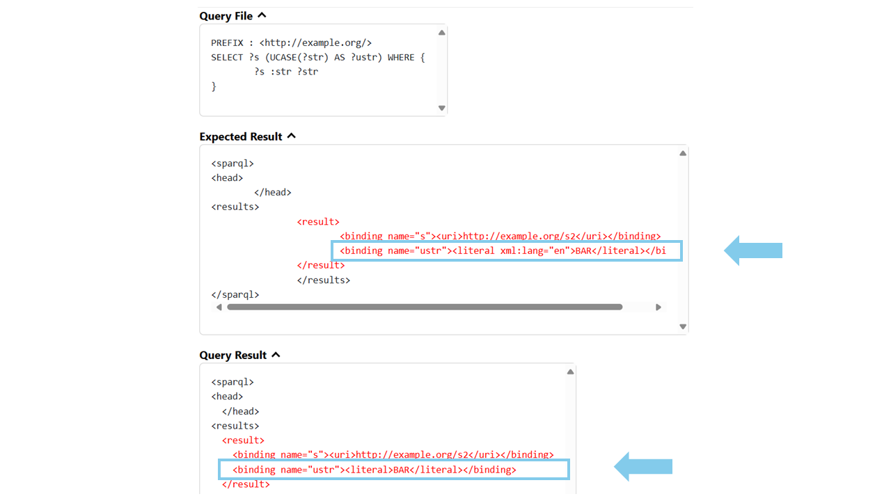

In this project, we improved the handling of language tags and datatypes in string expressions, such as `SUBSTR`, `UCASE`, `STRAFTER` and `CONCAT`, in the SPARQL engine QLever, making it more compliant with the SPARQL specification. Prior to this project, QLever discarded all language tags and datatypes when processing literals in string expressions.

## Table of Contents
- [Introduction](#introduction)
- [Implementation](#implementation)
- [Conclusion](#conclusion)

## Introduction
SPARQL defines several string expressions, such as `SUBSTR`, `UCASE`, `LCASE`, `STRAFTER`, `STRBEFORE`, or `CONCAT`, that operate on literals. According to the SPARQL 1.1 specification, these functions must handle metadata associated with literals, such as language tags (e.g., `"Hallo"@de` for a German word) or datatypes (e.g., `"2025"^^xsd:int` for an integer value). For example, applying  the `UCASE` function to a literal like `"Hallo"@de` should return `"HALLO"@de`, preserving the original language tag.\
\
Before this project, QLever did not fully meet this requirement. When evaluating string functions, it ignored language tags and datatypes. As a result, an expression like `UCASE("Hallo"@de)` incorrectly returned `"HALLO"` instead of `"HALLO"@de`. Consequently, tests that checked for correct semantic behavior failed. Below is an example screenshot showing failing tests of the `UCASE` expression.
<figure style="text-align: center;">
    

    <figcaption style="font-size: 20px;">Failing test of UCASE() in the SPARQL testsuite for QLever</figcaption>
</figure>

This was because the required behavior had not yet been implemented. The functions used by the string expressions to access literals were not designed to handle metadata. They relied on a template function called `StringExpressionImpl`, which in turn used a function named `StringValueGetter` to access literals. This function extracts only the plain string content from a literal, without preserving its language tag or datatype.

For example, in the case of the `UCASE` function, QLever would apply the uppercasing operation to the raw string `"Hallo"`, resulting in `"HALLO"`. However, the original language tag `@de` was lost in the process, because StringValueGetter did not carry the metadata forward. So the literal `"Hallo"@de` was transformed into `"HALLO"` instead of the correct `"HALLO"@de`.

In the end, the `UCASE` function returns a literal that is newly created from the transformed string content. The new idea for the implementation is that the ValueGetter should no longer just extract the string content of the literal, transform it, and create a new literal. Instead, it should operate on the full literal object, apply the transformation directly, and then return the modified literal preserving all relevant metadata such as language tags and datatypes.

## Implementation
To improve the handling of string expressions, we introduced two variants of a getter function called `LiteralValueGetter`. These functions are now used in the `StringExpressionImpl` template to extract literals from two types of inputs: `LiteralOrIri` objects, which can represent either literals (e.g., `"42"^^xsd:int` or `"Hallo"@de`) or IRIs (e.g., `<http://example.org>`) and `ValueId`s, which are internal references to literals or IRIs stored in QLever’s dictionary.

We implemented the two variants of the `LiteralValueGetter`: `LiteralValueGetterWithStrFunction` and `LiteralValueGetterWithoutStrFunction`. 
- `LiteralValueGetterWithStrFunction` implicitly applies the SPARQL `STR()` function. It removes datatypes from literals while preserving language tags, and converts IRIs into literals without a datatype. 
- `LiteralValueGetterWithoutStrFunction` processes only valid string literals, meaning those that have either the `xsd:string` datatype or no datatype at all, and excludes all other literals or IRIs.

The `LiteralValueGetter` variants are now used in string expressions that  take literals as input and return modified literals as output.  Since these functions now operate directly on `Literal` objects, the `Literal` class was extended with additional methods to allow in-place manipulation of literals.\
For example, the `UCASE` function now uses a new method called `replaceContent(std::string_view newContent)`, which replaces the string content of a literal.\
\
As part of this work, several string expressions were updated:

- The string expressions `SUBSTR`, `UCASE`, `LCASE`, `STRAFTER`, `STRBEFORE`, and `REPLACE` now consistently preserve the language tag of their input literal.
- For the expression `CONCAT`, the result will now retain the language tag only if all input arguments share the same tag. If the inputs differ in their language tags or datatypes, the result will be a plain string without any tag or datatype. 
- The behavior of `STRDT` and `STRLANG` has been extended: if either function is applied to a literal that already has a datatype or language tag, the result is now correctly `UNDEF`.

## Conclusion
Through this project, we improved QLever's support for literals with language tags and datatypes across a wide range of string expressions. As a result, QLever now conforms more closely to the SPARQL 1.1 specification, and the related tests now pass successfully.