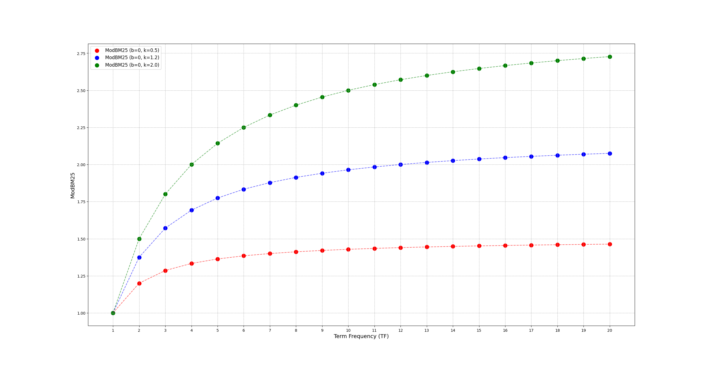
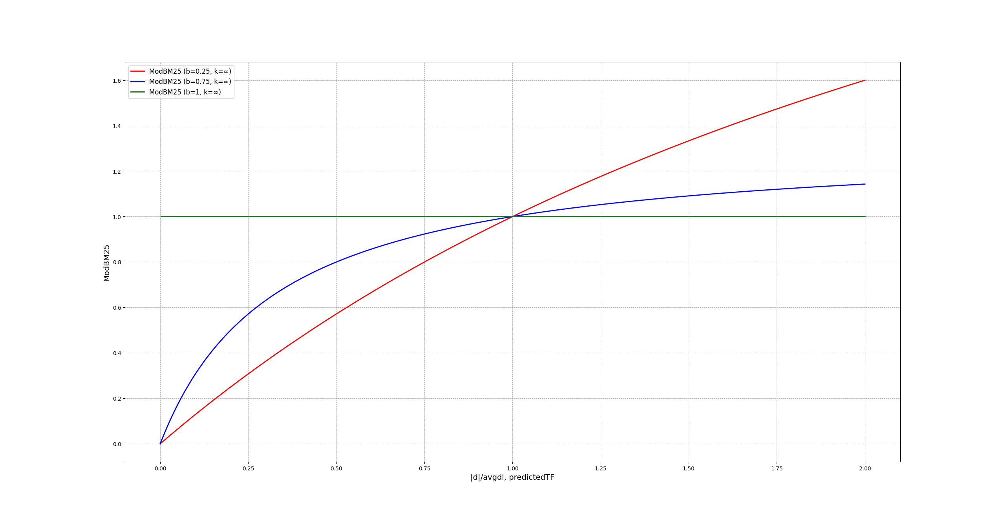
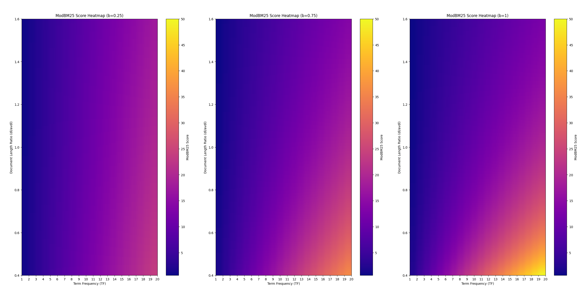

The [QLever](https://qlever.cs.uni-freiburg.de/) engine can be used to query databases. Besides the classic queries it also provides a text search. This text search was missing one of the most important parts which is a good scoring metric. Scoring metrics are used to sort results by their estimated importance. To further increase the usability a new way to formulate text search queries has been added which simplifies the process of querying text.

<!--more-->

# Introduction

In this blog post it is discussed which search methods [QLever](https://qlever.cs.uni-freiburg.de/) provides and, in detail, how simple text search metrics evolved. The text search metrics explained and partially analyzed are [_term frequency_](#term-frequency-tf), [_inverse document frequency_](#inverse-document-frequency-idf) and the [_best match 25_](#best-match-25-bm25) formula. Afterwards it is explained what steps have been taken to implement these scoring metrics into [QLever](https://qlever.cs.uni-freiburg.de/).  The next section will explain how to use the new scoring metrics. In this part the new way to formulate text queries, called [text search service](#text-search-service-explained), is explained and an example is given.

# Table of contents

1. [Introduction](#introduction)
2. [Search Methods](#search-methods)
	- [SPARQL](#sparql)
	- [Text Search](#text-search)
		- [Term Frequency (TF)](#term-frequency-tf)
		- [Inverse Document Frequency (IDF)](#inverse-document-frequency-idf)
		- [Best Match 25 (BM25)](#best-match-25-bm25)
		- [Algorithm to calculate TF-IDF and BM25](#algorithm-to-calculate-tf-idf-and-bm25)
3. [Text Search in QLever](#text-search-in-qlever)
	- [Showing scores](#showing-scores)
	- [Background improvements](#background-improvements)
	- [Implementing new scores](#implementing-new-scores)
4. [Using the new Text Search](#using-the-new-text-search)
	- [Building the text index with TF-IDF or BM25 scores](#building-the-text-index-with-tf-idf-or-bm25-scores)
	- [Text Search Service explained](#text-search-service-explained)
	- [Benefits of Text Search Service](#benefits-of-text-search-service)
5. [Conclusion](#conclusion)

# Search Methods

Searching is a key concept of database engines. For a given query or request from a user the engine should return a gratifying result. To achieve this there are different types of searches for different use cases. Using query languages like [SQL](https://de.wikipedia.org/wiki/SQL) or [SPARQL](#sparql) on respective databases provides a 100% semantic accuracy ensuring that the queried properties are always fulfilled. At the same time the search is restricted to these exact properties which may be unwanted. Text searches however can only approximate the semantic accuracy or importance of a result. The positive side of this is the obvious possibility to search text but also getting results with possibly more information than just simple database entries.

## SPARQL

[SPARQL](https://www.w3.org/TR/sparql11-query/) as a query language works on a seemingly simple knowledge base. This knowledge base uses the [RDF](https://en.wikipedia.org/wiki/Resource_Description_Framework) (Resource Description Framework). The key concept of the [RDF](https://en.wikipedia.org/wiki/Resource_Description_Framework) is formulating all data as triples. These triples consist of a subject, predicate and object similar to basic sentences in latin languages (see <a href="#fig1">Figure 1</a>). Queries can be formulated with variables marked with a `?`. All entries that fit the specified criteria are returned (see <a href="#fig2">Figure 2</a>).

<figure id='fig1' style="text-align: center;">

<table>
    <tr>
        <td>SUBJECT</td>
        <td>PREDICATE</td>
        <td>OBJECT</td>
    </tr>
    <tr>
        <td>&lt;Ada_Lovelace&gt;</td>
        <td>&lt;is-a&gt;</td>
        <td>&lt;Scientist&gt;</td>
    </tr>
    <tr>
        <td>&lt;Alan_Turing&gt;</td>
        <td>&lt;is-a&gt;</td>
        <td>&lt;Scientist&gt;</td>
    </tr>
    <tr>
        <td>&lt;John_von_Neumann&gt;</td>
        <td>&lt;is-a&gt;</td>
        <td>&lt;Scientist&gt;</td>
    </tr>
    <tr>
        <td>&lt;William_Shakespeare&gt;</td>
        <td>&lt;is-a&gt;</td>
        <td>&lt;Writer&gt;</td>
    </tr>
    <tr>
        <td>&lt;William_Shakespeare&gt;</td>
        <td>&lt;said&gt;</td>
        <td>&quot;To be or not to be&quot;</td>
    </tr>
</table>
  
<figcaption>Figure 1: Example of an RDF database.</figcaption>
</figure>

&NewLine;

```sparql
SELECT ?entity WHERE {
  ?entity <is-a> <Scientist> .
}
```

<figure id='fig2' style="text-align: center;">
<table>
    <tr>
        <td>?entity</td>
    </tr>
    <tr>
        <td>&lt;Ada_Lovelace&gt;</td>
    </tr>
    <tr>
        <td>&lt;Alan_Turing&gt;</td>
    </tr>
    <tr>
        <td>&lt;John_von_Neumann&gt;</td>
    </tr>
</table>
 
<figcaption>Figure 2: Example of a SPARQL query and its result.</figcaption>
</figure>

&NewLine;

## Text Search

The problem of text search is: Given a query of one or multiple words from a user, return the texts the user wants to see. The simplest way to query a large amount of different texts is by searching for a particular word. For all texts it is checked if the word occurs and if so the text is returned. A problem with this approach is a potentially large result with a random order needing to be studied by the user for good results. To improve this, ranking metrics are used.

### Term Frequency (TF)

One simple ranking metric is [_term frequency_](#term-frequency-tf) short TF. TF checks how often the search word occurs in a text and ranks texts accordingly.
$$
f(d, q) = \text{\#}q \text{ occurs in }d
$$
where:
$$
q = \text{search word},\quad d=\text{document searched}
$$

### Inverse Document Frequency (IDF)

Another progress was the introduction of [_inverse document frequency_](#inverse-document-frequency-idf) or IDF. IDF is an approximation of how rare a word is across all documents.
Mathematically: 
$$
IDF_q = log(\frac{N_d}{D_q})
$$
where:
$$
N_d= \text{\#Documents total},\  D_q=\text{\#Documents containing term q}
$$

The multiplication of both TF and IDF leads to the TF-IDF metric.

### Best Match 25 (BM25)

One thing the [TF-IDF](#inverse-document-frequency-idf) metric doesn't account for is a word naturally occurring more often in a longer text. The [BM25](#best-match-25-bm25) scoring metric addresses this while also providing a form of tuning with the [b- and k-parameter](#bm25-parameters).
Mathematically:
$$
BM25(d,q)=IDF(q)\cdot \frac{f(d,q)\cdot(k+1)}{f(d,q)+k\cdot(1-b+b\cdot \frac{|d|}{avgdl})}
$$
where:
$$
|d|=\text{document length},\ avgdl = \text{average document length}
$$
and:
$$
b \in [0,1],\quad k \geq 0
$$
(The document length is often measured in number of words per document)

#### BM25 Parameters

To better understand this metric one can change the [BM25](#best-match-25-bm25) formula and leave out the [IDF](#inverse-document-frequency-idf) multiplication to isolate the part influenced by the parameters.

##### K-Parameter

To see only the effects of the [_k-parameter_](#k-parameter)  **b** is set to **0** changing the equation further to:
$$
ModBM25(TF)=\frac{TF\cdot(k+1)}{TF+k}
$$

<figure id='fig3' style="text-align: center;">


<figcaption>Figure 3: Visualization of the <a href="#k-parameter">k-parameter</a> in <a href="#best-match-25-bm25">BM25</a>.</figcaption>
</figure>

&NewLine;

One can observe that the natural structure of the equation leads to the TF having a damped effect. A linear increase of the TF doesn't lead to a linear increase in score but instead the score approaches a limit. This can be mathematically proven:
$$
\lim \limits_{TF\to\infty}\frac{TF\cdot(k+1)}{TF+k}=\lim \limits_{TF\to\infty}\frac{TF\cdot(k+1)}{TF}=k+1
$$
One can also observe a lower **k** leads to the TF having a lower effect on the score. On the other end with **k** going to infinity the score approaches the standard TF:
$$
\lim \limits_{k\to\infty}\frac{TF\cdot(k+1)}{TF+k}=\lim \limits_{k\to\infty}\frac{TF\cdot k+TF}{TF+k}=\lim \limits_{k\to\infty}\frac{TF\cdot k}{k}=TF
$$
<span id="b0kinftyproof"></span>

A standard value for **k** is **1.75**. This is a middle ground for still letting the TF influence the score but capping it at a reasonable number to not get arbitrarily large scores.

##### B-Parameter

To actually see the effects of the [_b-parameter_](#b-parameter) the [BM25](#best-match-25-bm25) formula without [IDF](#inverse-document-frequency-idf) has to be adjusted further. First letting **k** approach infinity:
$$
\lim \limits_{k\to \infty}\frac{TF\cdot(k+1)}{TF+k\cdot(1-b+b\cdot \frac{|d|}{avgdl})}=\lim \limits_{k\to \infty}\frac{TF\cdot k+TF}{TF+k\cdot(1-b+b\cdot \frac{|d|}{avgdl})}
$$
$$
=\lim \limits_{k\to \infty}\frac{k\cdot TF}{k\cdot(1-b+\frac{|d|}{avgdl})}=\frac{TF}{1-b+b\cdot \frac{|d|}{avgdl}}
$$
Instead of the TF being a variable it is set to an approximation. This is done through guessing the **avgdl** and guessing each word of a document has a probability **p** to be the search term. This leads to:
$$predictedTF=p\cdot \frac{|d|}{avgdl}\cdot avgdl \Rightarrow predictedTF \propto \frac{|d|}{avgdl}
$$
If we choose p = 0.005 and an average document length of 200 we get:
$$
ModBM25(predictedTF,\frac{|d|}{avgdl})=\frac{predictedTF}{1-b+b\cdot \frac{|d|}{avgdl}}=\frac{\frac{|d|}{avgdl}}{1-b+b\cdot \frac{|d|}{avgdl}}
$$

<figure id='fig4' style="text-align: center;">


<figcaption>Figure 4: Visualization of the <a href="#b-parameter">b-parameter</a> in <a href="#best-match-25-bm25">BM25</a>.</figcaption>
</figure>

&NewLine;

One can see for **b** approaching **0** the score is approaching the TF which is already seen in the <a href="#b0kinftyproof">proof</a> above. On the other hand in the extreme case of **b** = **1** the increased TF doesn't change the score at all since:
$$
predictedTF \propto \frac{|d|}{avgdl} \Rightarrow predictedTF = c\cdot \frac{|d|}{avgdl}
$$
$$
\frac{predictedTF}{1-b+b\cdot \frac{|d|}{avgdl}}=\frac{c\cdot \frac{|d|}{avgdl}}{1-b+b\cdot \frac{|d|}{avgdl}}=\frac{c\cdot \frac{|d|}{avgdl}}{ \frac{|d|}{avgdl}}=c
$$
$$
c\in \mathbb{R}
$$
The reason **b** isn't set to **1** is:
$$
\lim \limits_{\frac{|d|}{avgdl}\to0}\frac{TF}{1-b+b\cdot\frac{|d|}{avgdl}}\overset{b=1}{=}\lim \limits_{\frac{|d|}{avgdl}\to0}\frac{TF}{\frac{|d|}{avgdl}}\to\infty
$$
This isn't a completely correct limit since the document length can't approach **0** and the biggest TF possible with a document of length one is **1**. The correct limit would be:
$$
\frac{TF}{1-b+b\cdot\frac{|d|}{avgdl}}=\frac{1}{1-b+b\cdot\frac{1}{avgdl}}=\frac{1}{1+b\cdot(-1+\frac{1}{avgdl})}\overset{b=1}{=}avgdl
$$
Meaning for an increasingly smaller document the score can approach unusually large numbers. The [_b-parameter_](#b-parameter) can control this growth:
$$
b\cdot\frac{|d|}{avgdl} > 0
$$
$$
\frac{TF}{1-b+b\cdot\frac{|d|}{avgdl}}\leq\frac{TF}{1-b}
$$

This effect can be observed in a plot where:
$$
0.4\leq\frac{|d|}{avgdl}\leq1.6,\quad1\leq TF\leq20
$$

<figure id='fig5' style="text-align: center;">


<figcaption>Figure 5: Visualization of the <a href="#b-parameter">b-parameter</a> in <a href="#best-match-25-bm25">BM25</a> with heatmaps.</figcaption>
</figure>

&NewLine;

In the left heatmap with **b** = **0.25** one can see a nearly linear increase in score for increasing TF only minimally dependent on the ratio of document length to average document length. In the right heatmap with **b** = **1** one can see the really high scores for small documents. The standard value for **b** is **0.75** (seen in the middle) since it provides a good middle ground between counteracting the naturally higher TF of large documents without favoring short documents to much since they probably provide less information.

With all that said: Parameter optimization is a large topic with score formulas like [BM25](#best-match-25-bm25). It involves fitting the parameters to ones data and performing extensive testing with different settings to see which parameters fit best. This may take a long time and depending on use case might not be worth it.

### Algorithm to calculate TF-IDF and BM25

[TF-IDF](#inverse-document-frequency-idf) needs the following information to be calculated:
- The TF for all words in all documents
- The number of documents a word occurs in for all words of all documents

[BM25](#best-match-25-bm25) needs the following information to be calculated:
- The TF for all words in all documents
- The number of documents a word occurs in for all words of all documents
- The document length of all documents, the number of all documents -> average document length

The only difference in the required information is the document length and the number of all documents. It is explained why this doesn't make a big difference time wise.

An efficient way to store and retrieve this information is through building an inverted index. In this case the inverted index is a mapping of words to all documents they appear in and at the same time to the TF of this word in the respective documents. In pseudo code the map would be:
```
typeof(InvertedIndex) = Map(Word -> Vector(Pair(Document, TF)))
```

To build this map one has to iterate over all documents and therefore can detect all words. At the same time it is possible to get the information of how long each document is and create a map for this as well. This leads to the information being gathered in one pass over all documents. To compute the scores another pass is needed.

These two passes and the possibly huge hash map make the scores rather intensive to compute.

# Text Search in QLever

Before continuing it should be known that [QLever](https://qlever.cs.uni-freiburg.de/) has one main option when it comes to the text index: It can construct a text index from all literals in the [RDF](https://en.wikipedia.org/wiki/Resource_Description_Framework) database and/or use external files containing the needed data.

## Showing scores

In the old version of [QLever](https://qlever.cs.uni-freiburg.de/) scores were already pre-computed in the external files and never shown to the user. Therefore the first step to have useful scores available in [QLever](https://qlever.cs.uni-freiburg.de/) was to show the already computed scores.

## Background improvements

To cleanly implement the new scoring metrics some other refactoring had to be done.

First the parsing of the external files was old and coded in one place with other functions of the text index. Extracting and modernizing it helped to improve overall code quality and helped with the implementation of the other scores.

Another really rigid internal process was saving the scores in the index and reading them when queried. Once again extracting and splitting the functions up helped to reduce the complexity of the code file for the text index. It also set an easier to modify base to implement the other scores.

## Implementing new scores

As described above in the [algorithm](#algorithm-to-calculate-tf-idf-and-bm25) section an inverted index is built while iterating over all documents of the external file and/or the literals of the [RDF](https://en.wikipedia.org/wiki/Resource_Description_Framework) database. In the case of [QLever](https://qlever.cs.uni-freiburg.de/) the inverted index for scores has an inner hash map. So in pseudo code:
```
typeof(InvertedIndex) = Map(Word -> Map(Document -> TF)))
```

If [TF-IDF](#inverse-document-frequency-idf) or [BM25](#best-match-25-bm25) is used as scoring metric during the text index building the steps executed are as follows:
- Iterate over all documents and/or literals and build the inverted index. At the same time build a hash map to connect documents to their length.
- During the writing of the text index file calculate the score on demand using the inverted index and document length map.

In the query retrieval (if scores are asked for):
- Read the scores from the text index file and return them in the table

# Using the new Text Search

To use the scores the text index has to be build with the correct flags. Afterwards the new scores can easily be used with the already implemented feature of `ql:contains-word`. Since this doesn't allow for further customization a new service was put in place. It is used with the `SERVICE` keyword and the `<https://qlever.cs.uni-freiburg.de/textSearch/>` service IRI.

## Building the text index with TF-IDF or BM25 scores

To build the text index with the new scores, new flags were added:

Setting the [_scoring metric_](#text-search):
- Flag(s): --set-scoring-metric, -S
- Options: 
	- "explicit": Using the scores specified in the `wordsfile.tsv`
	- "tf-idf": Using the above explained [TF-IDF](#inverse-document-frequency-idf) scores
	- "bm-25": Using the above explained [BM25](#best-match-25-bm25) scores
- Default: "explicit"

Setting the[ _b-parameter_](#b-parameter):
- Flag(s): --bm25-b
- Options:
	- A number between **0** and **1**, both included
- Default: 0.75

Setting the[ _k-parameter_](#k-parameter):
- Flag(s): --bm25-k
- Options:
	- A number greater than or equal to **0**
- Default: **1.75**

## Text Search Service explained

As talked about above a service was put in place to have more control over the text search and make it more accessible.

The general structure of this text search service looks like the following:
```sparql
PREFIX textSearch: <https://qlever.cs.uni-freiburg.de/textSearch/>

SELECT * WHERE {
	SERVICE textSearch: {
		?text textSearch:contains [textSearch:word "prefix*" ; textSearch:prefix-match ?prefix_match ; textSearch:score ?prefix_score] .
		?text textSearch:contains [textSearch:entity ?entity ; textSearch:score ?entity_score] .
	}
}
```

Can be also expressed as:

```sparql
PREFIX textSearch: <https://qlever.cs.uni-freiburg.de/textSearch/>

SELECT * WHERE {
	SERVICE textSearch: {
		?text textSearch:contains ?occurence1 .             # Bind first config to text variable
		?occurence1 textSearch:word "prefix*" .             # Specify word or prefix to search in text
		?occurence1 textSearch:prefix-match ?prefix_match . # Bind prefix completion variable
		?occurence1 textSearch:score ?prefix_score .        # Bind score variable
		?text textSearch:contains ?occurence2 .             # Bind second config to text variable
		?occurence2 textSearch:entity ?entity .             # Specify entity to search in text
		?occurence2 textSearch:score ?entity_score .        # Bind score variable
	}
}
```

<figure id='fig6' style="text-align: center;">

<figcaption>Figure 6: General structure of a text search service query.</figcaption>
</figure>

&NewLine;

It works by connecting text variables like `?text` in this case to one or multiple configurations. Those configurations are either representing a word or an entity search. For the word search the configuration has to specify a word or prefix to search for and has options to bind the prefix match and the score to variables. For the entity search the configuration has to specify an entity to search for which can be a literal, IRI or variable and has the option to bind the score to a variable. To get a full grasp of what this feature provides see the [documentation on GitHub](https://github.com/ad-freiburg/qlever/blob/b76c0c864f124a20b7a59b83a74e3346649c5747/docs/text_search.md).

## Benefits of Text Search Service 

The main benefit for the user is the possibility to bind the score variable which is later shown in the result table. This allows easy filtering or sorting of the scores without knowing how [QLever](https://qlever.cs.uni-freiburg.de/) using `ql:contains-word` internally chooses the name of the score variable. Generally, this service increases the control the user has over word and entity search. This makes the text search side of [QLever](https://qlever.cs.uni-freiburg.de/) more accessible and allows for easier usage of the output columns in follow up queries.

# Conclusion

While the old version of [QLever](https://qlever.cs.uni-freiburg.de/) had precomputed scores they were never shown thus useless for the user. Making them visible was an easy way to give the user more information in the search results. These so called explicit scores from the external files are in general less useful compared to [TF-IDF](#inverse-document-frequency-idf) or [BM25](#best-match-25-bm25) since they don't provide a good scoring metric to sort results after but the benefit of them is a low computational cost. Also they can be adapted if the user creates an index themselves increasing the benefit of them. The addition of [TF-IDF](#inverse-document-frequency-idf) and [BM25](#best-match-25-bm25) scores adds qualitative scoring metrics to [QLever](https://qlever.cs.uni-freiburg.de/) and therefore improves the text search side of it, but both metrics have the problem of a larger computational cost. To make scores in general more accessible the [text search service](#text-search-service-explained) provides a form of customization to the user. It also makes the sorting of scores easier since no knowledge about the internal creation of variables is needed. These features together with the internal code refactoring were steps to modernize the text search side of [QLever](https://qlever.cs.uni-freiburg.de/) and help in keeping [QLever](https://qlever.cs.uni-freiburg.de/) a good choice as a [SPARQL](https://www.w3.org/TR/sparql11-query/)+Text search engine.
