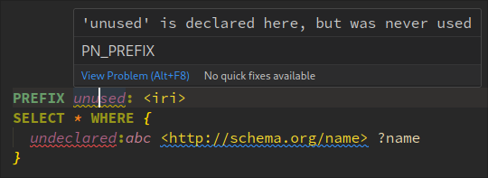
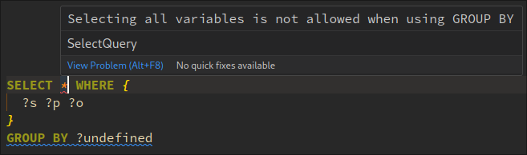
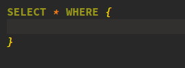

Modern developer environments are way more capable than simple text editors.
They provide domain-specific tools to improve the user experience.
They give hints, suggest changes and completions and more.  
In this article, we will take a look behind the curtains and build language support for *SPARQL*,
a query language for knowledge graphs.

<!--more-->

You can find the source code in my [GitHub repository](https://github.com/IoannisNezis/sparql-language-server).  
And a live demo on [qlue-ls.com](https://qlue-ls.com/).


# TL;DR

I built a [sparql-language-server](https://github.com/IoannisNezis/Qlue-ls) from scratch in [Rust](https://www.rust-lang.org/), powered by [tree-sitter](https://tree-sitter.github.io/tree-sitter/).
To showcase the language server I built a [web editor](https://sparql.nezis.de/) using [Monaco](https://microsoft.github.io/monaco-editor/).
To run the language server within the browser, I used [WebAssembly](https://webassembly.org/)

# Content

- [Motivation](#motivation)
- [Goal](#goal)
- [The Language Server Protocol ](#the-language-server-protocol)
    - [JSON-RPC](#json-rpc)
    - [Document synchronization](#document-synchronization)
    - [Capabilities](#capabilities)
- [Implementation](#implementation)
    - [speakingJSON-RPC](#speaking-json-rpc)
    - [Parser: the Engine under the hood](#parser:-the-engine-under-the-hood)
        - [Tree-sitter](#tree-sitter)
    - [Implemented Capabilities](#implemented-capabilities)
        - [Formatting](#formatting)
        - [Hover](#hover)
        - [Diagnostics](#diagnostics)
        - [Code Actions](#code-actions)
        - [Completion Suggestions](#completion-suggestions)
- [Using the Language server](#using-the-language-server)
    - [Neovim](#neovim)
        - [Installing the Programm](#installing-the-programm)
        - [Attaching](#attaching)
    - [VS-code](#vs-code)
    - [The Browser](#the-browser)
        - [WebAssembly](#webassembly)
            - [Tree-Sitter in WebAssembly](#tree-sitter-in-webassembly)
        - [The Editor](#the-editor)
        - [TextMate](#textmate)
        - [Plugging everything together](#plugging-everything-together)
- [How does Qlue-ls compare against other software?](#how-does-qlue-ls-compare-against-other-software)
    - [Qlue-ls vs sparql-formatter](#qlue-ls-vs-sparql-formatter)
- [Future work](#future-work)
    - [Stronger Parser](#stronger-parser)
    - [Query Sparql endpoint](#query-sparql-endpoint)
    - [Enhance existing features](#enhance-existing-features)
- [Acknowledgements](#acknowledgements)

# Motivation

The problem of providing language support to developers is very old.
In the past domain-specific development environments where very common.

| Domain    | development environment |
| --------- | ----------------------- |
| Java      | Eclipse                 |
| Microsoft | Visual Studio           |
| C/C++     | Turbo C++               |
| python    | PyCharm                 |
| R         | RStudio                 |
| LaTeX     | TeXworks or Overleave   |

These Programs contain source-code editors, but also provide a suit of integrated tool's that support the development process of their respective domains.
That's why they are also referred to as IDE's (**I**ntegrated **D**evelopment **E**nvironment).
While these development environments still dominate, modern development environments seem to go a different direction.

Some of the new kids on the block are: [neovim](https://neovim.io/), [vscode](https://code.visualstudio.com/) or [sublime text](https://www.sublimetext.com/).
They all are **general purpose** code editors that have a open-source plugin ecosystem and allow for a personalized customization. A core maintainer of Neovim,
[TJ DeVries](https://github.com/tjdevries), calls them PDE's (**P**ersonalized **D**evelopment **E**nvironment), although i don't think it caught on yet.

Long story short: Language support in these PDE's is not build in, but provided via an extension.
This is made possible by a Protocol published by Microsoft in 2016: The **L**anguage **S**erver **P**rotocol (LSP).
It enables the Editor (LSP-Client) and the Language support program (LSP-Server or Language Server) to be separated into two independent components.


[^2]

A key advantage of this architecture, is the reusablitity.  
The language support has to be written only once, and not over and over again for every development tool.

[^8]

# Goal

My goal is to create a Language Server for [SPARQL](https://www.w3.org/TR/sparql11-query/#rQueryUnit).
The language server should be able to **format** queries, give **diagnostic** reports and suggest **completions**.
To work in the [Qlever-UI](https://qlever.cs.uni-freiburg.de/) the Language Server should be accessible from an editor which runs in the browser.

# The Language Server Protocol

Let's talk briefly about the Protocol.
It's build on top of [JSON-RPC](https://www.jsonrpc.org/specification), a [*JSON*](https://de.wikipedia.org/wiki/JSON) based protocol that enables, as the name suggests, inter-process communication.  
This means the development tool (in our case the editor) and the language server run in two separate processes and communicate asynchronously via **JSON-RPC**.

## JSON-RPC

I will give you just a brief introduction, if you want to know more you can read the [specification](https://www.jsonrpc.org/specification#id1).

A normal JSON-RPC request has a `id`, `method` and `params` field.  
The `method` is the name of the invoked operation, the `params` field contains the optional parameters for this invoked operation.

A normal JSON-RPC response has a `id` and `result` field.  
The `id` has to be the same as the `id` of the corresponding request. This enables asynchronous communication.  
The `params` contain the result of the operation, if present.


 Request: `{"jsonrpc": "2.0", "method": "add", "params": [21, 21], "id": 1}`
 Response: `{"jsonrpc": "2.0", "result": 42, "id": 1}`


There are also notifications[^4] and error responses, but we will omit them for now.

## Document synchronization

For the Language server to do anything, it's required to "see" the workspace.

The LSP-specification defines 3 [Document Synchronization](https://microsoft.github.io/language-server-protocol/specifications/lsp/3.17/specification/#textDocument_synchronization) methods for this purpose:
 - [`textDocument/didOpen`](https://microsoft.github.io/language-server-protocol/specifications/lsp/3.17/specification/#textDocument_didOpen)
 - [`textDocument/didChange`](https://microsoft.github.io/language-server-protocol/specifications/lsp/3.17/specification/#textDocument_didChange)
 - [`textDocument/didClose`](https://microsoft.github.io/language-server-protocol/specifications/lsp/3.17/specification/#textDocument_didClose)

which are mandatory to implement (for clients).  
Whenever a document is being opened, changed or closed the client is sending the information to the server, via these methods.

The [textDocument/didChange](https://microsoft.github.io/language-server-protocol/specifications/lsp/3.17/specification/#textDocument_didChange) notification[^4] supports full and incremental synchronization.
The server and client negotiate this during [initialization](https://microsoft.github.io/language-server-protocol/specifications/lsp/3.17/specification/#initialize).

Incremental changes were more diffucult than expected.
This is mainly because of the translation between different encodings.
Editors give the position in the text-document (row, column) based on an utf-16 string representation.
While the chars them self are encoded in utf-8.
Of course utf-8 is a variable length encoding, so different characters can have different byte-sizes.


This was a bit confusing to get right.

Through these messages the language server has a "mirrored" version of the editor state.


 Here is a example for a incremental **textDocument/didChange** notification.
```json
 {
	"params": {
		"contentChanges": [
			{
				"rangeLength": 6, //deprecated
				"text": "42",
				"range": {
					"end": {
						"line": 3,
						"character": 22
					},
					"start": {
						"line": 3,
						"character": 16
					}
				}
			}
		],
		"textDocument": {
			"uri": "file:\/\/\/home\/ianni\/code\/sparql-language-server\/example.sparql",
			"version": 227
		}
	},
	"jsonrpc": "2.0",
	"method": "textDocument\/didChange"
}
```


## Capabilities

When initialization and synchronization work, the real fun begins.  
Now we can implement complex language features and provide actual smarts to the editor.
As long as both the client and server support the capability.

Here is an **incomplete** list of Language Feature capabilities that made it into the specification

| capability                                                                                                                                         | effect                                                        | State of implementation |
| -------------------------------------------------------------------------------------------------------------------------------------------------- | ------------------------------------------------------------- | ----------------------- |
| [Go to Declaration](https://microsoft.github.io/language-server-protocol/specifications/lsp/3.17/specification/#textDocument_declaration)          | Jump to the declaration of a symbol                          | Not planned             |
| [Go to Definition](https://microsoft.github.io/language-server-protocol/specifications/lsp/3.17/specification/#textDocument_definition)            | Jump to the definition of a symbol                           | Not planned             |
| [Document Highlight](https://microsoft.github.io/language-server-protocol/specifications/lsp/3.17/specification/#textDocument_documentHighlight)   | Highlight  all references to a symbol                         | Planned                 |
| [Document Link]()                                                                                                                                  | Handle Links in a Document                                    | Planned                 |
| [Hover](https://microsoft.github.io/language-server-protocol/specifications/lsp/3.17/specification/#textDocument_hover)                            | Show Information about the hovered symbol                     | In progess              |
| [Folding Range](https://microsoft.github.io/language-server-protocol/specifications/lsp/3.17/specification/#textDocument_hover)                    | Indentify  foladable ranges in the document.                  | Not planned             |
| [Document Symbols](https://microsoft.github.io/language-server-protocol/specifications/lsp/3.17/specification/#textDocument_documentSymbol)        | Identify all symbols in a document                            | Not planned             |
| [Inline Value](https://microsoft.github.io/language-server-protocol/specifications/lsp/3.17/specification/#textDocument_inlineValue)               | Show Values in the editor                                     | Not Planned             |
| [Completion Proposals](https://microsoft.github.io/language-server-protocol/specifications/lsp/3.17/specification/#textDocument_completion)        | Give Completion Proposals to the user                         | In progress             |
| [Publish Diagnostics](https://microsoft.github.io/language-server-protocol/specifications/lsp/3.17/specification/#textDocument_publishDiagnostics) | Send Information like Hints, Warnings or Errors to the editor | In progress             |
| [Pull Diagnostics](https://microsoft.github.io/language-server-protocol/specifications/lsp/3.17/specification/#textDocument_pullDiagnostics)       | Request Information like Hints, Warningso Errors              | In progress             |
| [Code Action](https://microsoft.github.io/language-server-protocol/specifications/lsp/3.17/specification/#textDocument_codeAction)                 | Suggest changes                                               | In progress             |
| [Formatting](https://microsoft.github.io/language-server-protocol/specifications/lsp/3.17/specification/#textDocument_formatting)                  | Format the whole document                                     | Done                    |
| [Range Formatting](https://microsoft.github.io/language-server-protocol/specifications/lsp/3.17/specification/#textDocument_rangeFormatting)       | Format the provided range in a document                       | Not Planned             |
| [Rename](https://microsoft.github.io/language-server-protocol/specifications/lsp/3.17/specification/#textDocument_rangeFormatting)                 | Rename a symbol                                               | Planned                 |

# Implementation

Let's talk about what I actually did.

I choose to use [Rust](https://www.rust-lang.org/) for this project since its fancy and I like shiny things.  
Rust is the most admired programming language in the [Stack overflow developer survey 2024](https://survey.stackoverflow.co/2024/technology#2-programming-scripting-and-markup-languages),
and i was curious to find out why. After this project I can confirm that Rust is a brilliant language, but the leading curve is quiet steep.

The error handling, increddibly smart compiler, functional approach and rich ecosystem enable a smooth developing expirience.
That being said, the very strict compiler makes it hard to get stuff done quickly, however the resulting code is a lot more robust.

Here is the module structure of my crate[^5]:


## speaking JSON-RPC

Okay first things first, we need to speak **JSON-RPC**.  
After that we can implement some tool to analyze SPARQL queries.  
When we got the analysis tool running we can use it to provide some language features.

Assume we set up the Editor (client) to connect to our language server.  
It will send an utf-8 byte-stream. We need to interpret the bytes and respond.

The first message will look something like this:

```json
{
	"jsonrpc": "2.0",
	"id": 1,
	"method": "initialize",
	"params": {
		"capabilities": {...},
		"clientInfo": {
			"name": "Neovim",
			"version": "0.10.2+v0.10.2"
		},
		"processId": 6369,
		...
	}
}
```

For each type of message I build a set of corresponding structs:

```rust
#[derive(Serialize, Deserialize, Debug, PartialEq)]
pub struct Message {
    pub jsonrpc: String,
}

#[derive(Serialize, Deserialize, Debug, PartialEq)]
pub struct RequestMessageBase {
    #[serde(flatten)]
    pub base: Message,
    /**
     * The request id.
     */
    pub id: RequestId,
    /**
     * The method to be invoked.
     */
    pub method: String,
}

#[derive(Serialize, Deserialize, Debug, PartialEq, Clone)]
#[serde(untagged)]
pub enum RequestId {
    String(String),
    Integer(u32),
}

#[derive(Debug, Serialize, Deserialize, PartialEq)]
#[serde(rename_all = "camelCase")]
pub struct InitializeParams {
    pub process_id: ProcessId,
    pub client_info: Option<ClientInfo>,
    #[serde(flatten)]
    pub progress_params: WorkDoneProgressParams,
}

#[derive(Debug, Serialize, Deserialize, PartialEq)]
#[serde(untagged)]
pub enum ProcessId {
    Integer(i32),
    Null,
}

#[derive(Debug, Serialize, Deserialize, PartialEq)]
pub struct ClientInfo {
    pub name: String,
    pub version: Option<String>,
}
```

For **se**rializing and **de**serializing I used [serde](https://serde.rs/).  
Note that in Rust the notion of "Inheritance" does not exist. It uses "traits" to define shared behavior.  
I solved this issue with `#[serde(flatten)]`, which inlines the data from a struct into a parent struct.  
Another issue was the naming convention.  
I JSON-RPC the fields are written in *camelCase*, but Rust uses *snake_case*.  
Serde also offers a solution for that: the `#[serde(rename_all = "camelCase")]` annotation.

This is basically how I read and write messages.
I defined structs for the basic [lifecycle massages](https://microsoft.github.io/language-server-protocol/specifications/lsp/3.17/specification/#initialize):

| message                                                                                                               | sender | type         | effect                                         |
| --------------------------------------------------------------------------------------------------------------------- | ------ | ------------ | ---------------------------------------------- |
| [initialize](https://microsoft.github.io/language-server-protocol/specifications/lsp/3.17/specification/#initialize)  | client | request      | initialize connection, comunicate capabilities |
| [initalized](https://microsoft.github.io/language-server-protocol/specifications/lsp/3.17/specification/#initialized) | client | notification | signals reception of initialize response        |
| [shutdown](https://microsoft.github.io/language-server-protocol/specifications/lsp/3.17/specification/#shutdown)      | client | request      | shutdown server, dont exit                     |
| [exit](https://microsoft.github.io/language-server-protocol/specifications/lsp/3.17/specification/#exit)              | client | notification | exit the server process                        |

Then I defined the basic structs for  [document synchronization](https://microsoft.github.io/language-server-protocol/specifications/lsp/3.17/specification/#textDocument_synchronization)

| message                                                                                                                                      | sender | type         | effect                              |
| -------------------------------------------------------------------------------------------------------------------------------------------- | ------ | ------------ | ----------------------------------- |
| [textDocument/didOpen](https://microsoft.github.io/language-server-protocol/specifications/lsp/3.17/specification/#textDocument_didOpen)     | client | notification | signals newly opened text document   |
| [textDocument/didChange](https://microsoft.github.io/language-server-protocol/specifications/lsp/3.17/specification/#textDocument_didChange) | client | notification | signals changes to a text document   |
| [textDocument/didClose](https://microsoft.github.io/language-server-protocol/specifications/lsp/3.17/specification/#textDocument_didClose)   | client | notification | signals closed text document |

With these messages defined, we can open and close a connection to a client and keep a synchronized state of the clients documents.

To run this native i also needed to listen to stdin and parse the [Header](https://microsoft.github.io/language-server-protocol/specifications/lsp/3.17/specification/#headerPart) from raw bytes, but i spare you that experience.

## Parser: the Engine under the hood

Okay now we want to build some tools to analyze the given text,
and provide some smarts.

First we need to "understand" the given text.
Understanding arbitrary text is quiet the challenge, and we only recently made some advancements in that area.
Luckily all SPARQL queries follow a strict structure, called a grammar, which is defined in its [specification](https://www.w3.org/TR/sparql11-query/#rQuery).
A grammar is basically a set of production rules that map nonterminal-symbols to other nonterminal-symbols or terminal-symbols. Every valid SPARQL query can be produced by applying those rules until only terminal symbols are left.
For some grammars we can build a program that reconstructs which production rules got used to produce a given string. Such a program is called **parser**. The result of a parser, the rules that got used, is called **syntax tree**.

Here is an example:

**Query**:
```sparql
SELECT * WHERE {
  ?s ?p ?p
}
```

**Syntax tree:**
```lisp
(unit ; [0, 0] - [3, 0]
  (SelectQuery ; [0, 0] - [2, 1]
    (SelectClause ; [0, 0] - [0, 8]
      "SELECT" ; [0, 0] - [0, 6]
      "*") ; [0, 7] - [0, 8]
    (WhereClause ; [0, 9] - [2, 1]
      "WHERE" ; [0, 9] - [0, 14]
      (GroupGraphPattern ; [0, 15] - [2, 1]
        "{" ; [0, 15] - [0, 16]
        (GroupGraphPatternSub ; [1, 2] - [1, 10]
          (TriplesBlock ; [1, 2] - [1, 10]
            (TriplesSameSubjectPath ; [1, 2] - [1, 10]
              (VAR) ; [1, 2] - [1, 4]
              (PropertyListPathNotEmpty ; [1, 5] - [1, 10]
                (VAR) ; [1, 5] - [1, 7]
                (ObjectList ; [1, 8] - [1, 10]
                  (VAR)))))) ; [1, 8] - [1, 10]
        "}")))) ; [2, 0] - [2, 1]
```

### Tree-sitter

Usually parses get to parse complete strings that are valid.
When you give them invalid input they react not so happy (symbolic image below)


[^3]

In our use-case the text we handle is incomplete most of the time.
So we need a parser that is resilient to errors.

The big-boy-language-servers like [rust-analyser](https://github.com/rust-lang/rust-analyzer) use customized [resilient LL Parsers](https://matklad.github.io/2023/05/21/resilient-ll-parsing-tutorial.html).
But since I wanted to get on the road quick, I choose [tree-sitter](https://tree-sitter.github.io/tree-sitter/) (for now... ;)).
Tree-sitter, at its core, is a parser generator. It generates error resilient parsers.
Its most commonly used in editors like [neovim](https://neovim.io/) or emacs[^6] to highlight text.

Parser generators take a grammar and generate a fully functioning parser.
I found a [sparql-tree-sitter](https://github.com/GordianDziwis/tree-sitter-sparql) grammar by [GordianDziwis](https://github.com/GordianDziwis).
It had a few minor issues and was a bit dusty.
So I [forked](https://github.com/GordianDziwis) it and it and changed a few things to work better with Rust.

If you want to take a close look at the parser:

1. Clone the grammar-repository:

```bash
git clone https://github.com/IoannisNezis/tree-sitter-sparql.git
cd tree-sitter-sparql
```

2. Install the [tree-sitter CLI](https://tree-sitter.github.io/tree-sitter/creating-parsers#installation)
3. Start the playground web-app:
```bash
tree-sitter playground
```

The generated parser is written in C.
For some C-reasons I won't get into right now, tree-sitter can generate rust-bindings that allow us to call the c-functions from our rust-program (something I will regret later).
It provides some functions to parse and navigate the resulting concrete-syntax-tree.


Here is an example from the format function:
```rust
   let mut parser = Parser::new();
   match parser.set_language(&tree_sitter_sparql::LANGUAGE.into()) {
    Ok(()) => {
        let tree = parser
            .parse(text.as_bytes(), None)
            .expect("could not parse");
        let formatted_text =
            format_helper(&text, &mut tree.walk(), 0, "  ", "", &format_settings);
        return formatted_text;
    }
    Err(_) => panic!("Could not setup parser"),
}
```


A cool feature of tree-sitter is [queries](https://tree-sitter.github.io/tree-sitter/using-parsers#pattern-matching-with-queries).
A query is build out of one or more patterns. Each pattern is an [S-expression](https://en.wikipedia.org/wiki/S-expression).
Tree-sitter can match these patterns against the syntax tree and return all matches.


Let's say we want to find all *triples* in a group-graph-pattern that have a predicate that match "pre:p1":
The query could look like:
```sparql
SELECT * WHERE {
    ?s pre:p2 "object1" .
    ?s2 pre:p1 "object2"
}
```
My Tree-sitter parser would generate this parse-tree:
```lsip
(unit
  (SelectQuery
    (SelectClause)
    (WhereClause
      (GroupGraphPattern
        (GroupGraphPatternSub
          (TriplesBlock
            (TriplesSameSubjectPath
              subject: (VAR)
              (PropertyListPathNotEmpty
                predicate: (Path
                  (PathSequence
                    (PathEltOrInverse
                      (PathElt
                        (PathPrimary
                          (PrefixedName
                            (PNAME_NS
                              (PN_PREFIX))
                            (PN_LOCAL)))))))
                (ObjectList
                  object: (RdfLiteral
                    value: (String
                      (STRING_LITERAL))))))
            (TriplesSameSubjectPath
              subject: (VAR)
              (PropertyListPathNotEmpty
                predicate: (Path
                  (PathSequence
                    (PathEltOrInverse
                      (PathElt
                        (PathPrimary
                          (PrefixedName
                            (PNAME_NS
                              (PN_PREFIX))
                            (PN_LOCAL)))))))
                (ObjectList
                  object: (RdfLiteral
                    value: (String
                      (STRING_LITERAL))))))))))))
```

And here is the query:
```lisp
(TriplesSameSubjectPath
  (VAR)
  (PropertyListPathNotEmpty
    (Path) @path (#eq? @path "pre:p1"))) @triple
```
`@path` and `@triple` are captures and store the nodes that match the pattern.


#### How resilient is tree-sitter?

Very, resilient.
Tree-sitter recovers from basically anything and conserves information from very incomplete input.
So the question is not how resilient it is, the problem is how good the quality of the information it conserves is.

Tree-sitter produces GLR parsers.
It explores, nondeterministically, many different possible LR (bottom-up) parses.
Then it chooses the "the best one".
In the words of [Alex Kladov](https://github.com/matklad) the creator of [rust-anayzer](https://github.com/rust-lang/rust-analyzer) this leads to the following behavior:
>(...) Tree-sitter \[can\] recognize many complete valid small fragments of a tree, but it might have trouble
> assembling them into incomplete larger fragments.

This is very useful for the use-case of syntax highlighting. You want to highlight as many tokens as possible, the larger context of in which they appear is often not so important.

In our use-case however, it's the other way around.

Let's look at a few examples.

## Implemented Capabilities

Okay, now that you may have an idea of the fundamental mechanisms.
Let's talk about the features, besides the lifecycle and synchronization, that I implemented.


The implemented features are just a **proof of concept**!
There are many features that could and should be added.
But that takes a lot of time to get right.
And frankly also requires a stronger parser.
This should just give you an idea of what's possible.


### Formatting

When the client sends a `textDocument/formatting` request, the server returns a list of [`TextEdit`](https://microsoft.github.io/language-server-protocol/specifications/lsp/3.17/specification/#textEdit)'s.
A `TextEdit` is a incremental change, composed of a Range and a String.
The Client then applies the changes and thus formats the document.

I implemented this with a post-order-[traversal](https://en.wikipedia.org/wiki/Tree_traversal) of the parse-tree provided by tree-sitter.


[^7]

Each step the "Type" of the node is matched and handled with a strategy.
For example "separate each child by a new line" or "capitalize the text".
That is done recursively.

Here are a few examples of formatted queries.  
If you want to get a more detailed picture, check out the [formatting tests](https://github.com/IoannisNezis/Qlue-ls/blob/main/src/server/message_handler/formatting/tests.rs).

```sparql
BASE <http://...>
PREFIX namespace1: <iri>
PREFIX namespace12: <iri>
SELECT ?s ?p (MAX (?o)  AS ?max_a )
FROM <...>
FROM <...>
WHERE {
    {
        ?s namespace1:p1 ?o ;
          namespace12:p2 "dings" .
        ?other <abc> 32 .
        FILTER ((?other * 4) > 6 || ?o = "bar")
    }
    UNION {
        {
            SELECT * WHERE {
                ?a ?b ?c .
                BIND (?c + 3 AS ?var)
            }
            GROUP BY ?a
            HAVING ?b > 9
            ORDER BY DESC(?a)
            LIMIT 100
            OFFSET 10
        }
    }
}
```

```sparql
SELECT * WHERE {
    wd:Q11571 p:P166 [ pq:P585 ?date ] .
    wd:Q11572 p:P166 [
        pq:P585 ?date ;
        <...> ?other
    ]
    wd:Q11572 p:P166 []
}
```

```sparql
SELECT * WHERE {
    ?a ?b ",,," .
    FILTER (1 IN (1, 2, 3))
}
```

```sparql
SELECT * WHERE {
    ?a <iri>/^a/(!<>?)+ | (<iri> | ^a | a) ?b .
}
```

I added some optional formatting, like aligning prefix declarations and predicates.
Here is an example for a query with every non default option:

```sparql
prefix n1:     <...>
prefix n12:    <...>
prefix n123:   <...>
prefix n1234:  <...>
prefix n12345: <...>

select * 
where {
  ?var n1:p "ding" ;
       n12:p "foo" ;
       n123:p "bar" ;
       n1234:p "baz" ;
       n12345:p "out of filler" ;
}
```

Here is the full default format configuration:

```toml
[format]
align_predicates = true
align_prefixes = false
separate_prolouge = false
capitalize_keywords = true
insert_spaces = true
tab_size = 2
where_new_line = false
```

#### Ideas for the future

There are three things that the formatter does not handle well:

- **Comments**: should be possible to place at the end of a line:
    ```sparql
    SELECT * WHERE {
        ?s ?p ?o # EOL comment
    }
    ```

- **Long lines**: should cause a line break
    ```sparql
    SELECT ?v1 ?v3 ?v4 ?v5 ?v6 ?v7 ?v8 ?v9 ?v10
           ?v11 ?v12 ?v13 ?v14 ?v15 ?v16 ?v17
           ?v18 ?v19 ?v20 ?v21 ?v22 ?v23 ?v24
           ?v25 ?v26 ?v27 ?v28 ?v29 ?v30 ?v31
    WHERE {}
    ```
- **small nested queries**: should be compressed
    ```sparql
    SELECT ?castle WHERE {
        osmrel:51701 ogc:contains ?castle .
        { { ?castle osmkey:historic "castle" }
          UNION
          { ?castle osmkey:historic "tower" . ?castle osmkey:castle_type "defensive" } }
        UNION
        { ?castle osmkey:historic "archaeological_site" . ?castle osmkey:site_type "fortification" }
        ?castle osmkey:name ?name .
        ?castle osmkey:ruins ?ruins .
        OPTIONAL { ?castle osmkey:historic ?class }
        OPTIONAL { ?castle osmkey:archaeological_site ?class }
    }
    ```


### Hover

When the client sends a `textDocument/hover` to request, the server responds with information about a given position in a text-document.

This is useful to give inexperienced users documentation about how some constructs work:

 

#### Ideas for the future

Here are a few ideas I have to extend this feature.
**These are not implemented yet**

Display the structure of the query;

In a serious implementation, since these graph-patterns can get quiet complex, I would use [mermaid.js](https://mermaid.js.org/) to generate diagrams. This would require a custom plugin in the editor to render these diagrams.

If the language server can query the knowledge graph autonomously (not implemented yet), it could display additional information retrieved from the knowledge graph.
For example the label of a resource:

Or the incoming and outgoing edges:


I'm sure there are many more ways to use "hover" to provide information to the user,
if you have a cool idea, [open an issue on github](https://github.com/IoannisNezis/Qlue-ls/issues) :)

### Diagnostics

A diagnostic is information provided by the language server about an issue in the source code.
They can be of different *severity*:
- **Error**: Critical issues; must be fixed (e.g., syntax errors, undefined variables).
- **Warning**: Potential problems; should be reviewed (e.g., deprecated functions, unused variables).
- **Info**: General insights; optional attention (e.g., code style improvements, documentation suggestions).
- **Hint**: Suggestions for enhancement (e.g., refactor opportunities, alternative approaches).

Diagnostics are either published by the server via a `textDocument/publishDiagnostics` notification,
or requested by the client via a `textDocument/diaglostic` request.

The diagnostics I implemented are:
- an error diagnostic for undeclared prefixes
- a warning diagnostic for unused prefixes
- an information diagnostic for uncompressed URI's



#### Ideas for the future

Highlight syntax errors:


This would require a more powerful parser, that gives information about how the parse failed.

Highlight semantic errors, like selecting all variables in a `GROUP BY`:



Giving hints to make queries more concise:


### Code Actions

The `textDocument/codeAction` request is send from the client to the server to request a set of commands for a given range in a textdocument. These commands can have arbitrary effect, but in most cases change the text-document through text-edits.


The change of the text-document is always done by the client (editor).
The server provides the text-edits but its up to the client to apply them since it "owns" the text-document.


Often code-actions correspond to a diagnostic they resolve. Such code-actions are called "quickfix".
The exemplary code action I implemented is "Shorten URI".
The idea is to shorten a URI into its compact ["Curie"](https://www.w3.org/TR/2010/NOTE-curie-20101216/) form.

| Before code action                       | After code action                       |
| ---------------------------------------- | --------------------------------------- |
|  |  |

This code-action is powered by [curies.rs](https://github.com/biopragmatics/curies.rs).

### Completion Suggestions
The key feature for a SPARQL language server is, in my opinion, code-completion.
Here the editor provides suggestions to the user.
In SPARQL this is not just a convenience. Without smart completion suggestsions a user has to know the ontology by heart. Its also a massive efficiency boost for experianced users.

Here is a possible structure for completions:

#### 1. Static

The simplest kind of completions is just to provide static snippets of keywords or structures to the user.
For this just the "Location" of the cursor is relevant, the context of the content of the knowledge-graph does not influence the suggestions.

Here are a few Examples i implemented:

|                                                |                                                |                                     |
| ---------------------------------------------- | ---------------------------------------------- | ----------------------------------- |
|            |            |   |
|           |           |  |

#### 2. Dynamic

Dynamic completions are more complex. They use all information available to provide context based suggestions.

This again could be split into two categories:

#### 2.1. Offline

Here the Language server only uses "locally available" information:
That is: Text in the editor and the data bundled with the language server (for example known prefixes).

A Simple example for this are suggestions of already defined variables:


This uses the parse-tree to find all variables.
Currently, this is done very stupid, as this also suggests variables when they are out of scope:


#### 2.1. Online

Here the Language Server uses data from a SPARQL-endpoint to provide completion suggestions.

This is not implemented yet!


Here is a example from the Qlever-OSM-endpoint: <htps://qlever.cs.uni-freiburg.de/api/osm-planet/>.
[**O**pen**S**treet**M**ap](https://www.openstreetmap.org/) (OSM) is a Project that collects Geodata that is publicly accessible. Basically Google-maps, just without Google.
This data can be represented in an RDF knowledge graph and queried using SPARQL.
For example this query returns every bicycle parking spot in [Freiburg](https://www.openstreetmap.org/relation/62768):
```sparql
PREFIX geo: <http://www.opengis.net/ont/geosparql#>
PREFIX osmkey: <https://www.openstreetmap.org/wiki/Key:>
PREFIX ogc: <http://www.opengis.net/rdf#>
PREFIX osmrel: <https://www.openstreetmap.org/relation/>
PREFIX rdfs: <http://www.w3.org/2000/01/rdf-schema#>
SELECT ?bicycle_parking ?geometry WHERE {
  osmrel:62768 ogc:sfContains ?bicycle_parking .
  ?bicycle_parking osmkey:amenity "bicycle_parking" ;
                   geo:hasGeometry/geo:asWKT ?geometry .
}
```

Now I want to know the same thing just for Berlin.  
Unfortunately i forgot that the relation ID of Berlin is `62422`...  
A good online-contextual-completion should help me:

|                            |                           |
| -------------------------- | ------------------------- |
|  |  |

# Using the Language server

Ok, now let's talk about how to use the language server.
An editor needs to have a language server client and connect to our server.

I looked at three editors: neovim, vs-code, and a custom web-based-editor.

## Neovim

To get a language server running with neovim is very easy because it has a build in language client and
neovim is build to be hacked.

### Installing the Program

First `Qlue-ls` needs to be available as executable binary on the system, neovim runs on.
You could just build the binary from source.
But to make it more convenient I added the binary into two "repositories":

The Rust repository [crate.io](https://crates.io/crates/qlue-ls). To install from there, run:
```shell
cargo install qlue-ls
```
And the python repository [Pypi](https://pypi.org/project/qlue-ls/). To install from there, run:
```shell
pipx install qlue-ls
```
The python package is build with the help of [maturin](https://github.com/PyO3/maturin).

### Attaching

All you need is a `init.lua` file in your config directory with the following snippet:

```lua
vim.api.nvim_create_autocmd({ 'FileType' }, {
  desc = 'Connect to qlue-ls',
  pattern = { 'sparql' },
  callback = function()
    vim.lsp.start {
      name = 'qlue-ls',
      cmd = { 'qlue-ls', 'server' },
      root_dir = vim.fn.getcwd(),
      on_attach = function(client, bufnr)
        vim.keymap.set('n', '<leader>f', vim.lsp.buf.format, { buffer = bufnr, desc = 'LSP: ' .. '[F]ormat' })
      end,
    }
  end,
})
```
When you open a `sparql` file (a file with suffix `.rq`).
This runs the command `qlue-ls server` and connects the language client to this process.

## VS-code

In vs-code there is no build in language-client.
Instead, you have to create a vs-code-extention that acts as a language-client.
I will do that in the Future™.

## The Browser

Okay, now the for the cherry on top:
Let's connect this thing to a web-based editor (an editor that runs in a browser).
"But wait!" you might say, "browser is JavaScript land".
And you would be right, until 2017.

### WebAssembly

[WebAssembly](https://webassembly.org/) is a open standard defined by the [World Wide Web Consortium](https://www.w3.org/).
It defines a Bytecode to run programs withing the browser.
All big browsers support it.

If your Program can be converted (compiled) to this WebAssembly(WASM) Bytecode it can execute in the Browser.
[^9]
So now we need to build a compiler to convert Rust to WASM Bytecode...
Unfortunately [some strangers on the Internet](https://github.com/rustwasm/team) already did that.
The Project is called [wasm-pack](https://rustwasm.github.io/wasm-pack/).

It's very organic and simple, you just annotate the method or struct you want to "export" to WASM.

```rust
#[wasm_bindgen]
pub fn init_language_server(writer: web_sys::WritableStreamDefaultWriter) -> Server {
    wasm_logger::init(wasm_logger::Config::default());
    Server::new(move |message| send_message(&writer, message))
}
```

Then wasm-pack builds WASM-bytecode and JavaScript "glue code".
This glue code does a lot off stuff to bridge the gap between JavaScript and WASM.

```javascript
...
export function init_language_server(writer) {
    const ret = wasm.init_language_server(writer);
    return Server.__wrap(ret);
}
...
```

To actually run this in the browser I needed to jump through a couple more hoops but I spare you the details.
I packaged the result and uploaded it to [npm](https://www.npmjs.com/package/qlue-ls): a JavaScript repository.
Now we can install the package using npm and access it from a JavaScript file:

```bash
npm install qlue-ls
```

```javascript
import { init_language_server } from "qlue-ls";
const server = init_language_server(...);
server.listen(...);
```

#### Tree-Sitter in WebAssembly

As stated earlier tree-sitter creates a parser in c and I wrote my program in Rust.
Turns our compiling a Rust program that calls external C functions to WebAssembly creates something
called "**ABI-Incompatibilities**".
I wish I could tell you how I solved that, but to be honest, I don't want to talk about this experience, since it was extremely painful.

In short, I found a [project](https://github.com/shadaj/tree-sitter-c2rust) that ports the C code to Rust and all my issues disappeared.
This is the second reason for me to move away from tree-sitter.

### The Editor

Next we need a web-based editor.
There are a couple options, here are a few:

- [Monaco-Editor](https://microsoft.github.io/monaco-editor/)
- [CodeMirror](https://codemirror.net/)
- [ACE Editor](https://ace.c9.io/)

None of them have built in language clients, but all of them have extensions that provides one.

- Monaco-Editor: [monaco-languageclient](https://github.com/TypeFox/monaco-languageclient)
- CodeMirror: [@shopify/codemirror-language-client](https://github.com/shopify/theme-tools), [codemirror-languageserver](https://github.com/FurqanSoftware/codemirror-languageserver), [codemirror-languageservice](https://github.com/remcohaszing/codemirror-languageservice)
- ACE Editor: [ace-linters](https://github.com/mkslanc/ace-linters)

But to be fair the ones for CodeMirror don't really look stable.

I decided to go with Monaco for a couple reasons:

- It's very mature (It's the same editor that drives vs-code)
- The language-client extension looks very active.
- I hope to get a synergy effect since both LSP and Monaco are from Microsoft

I will eventually also try ACE.

To get Monaco running with the language client I again had to jump to a few hoops (actually a lot),
but I again spare you with the details.

### TextMate

A good editor needs Syntax highlighting. (The thing that makes the colors)

| without syntax highlighting              | with syntax highlighting              |
| ---------------------------------------- | ------------------------------------- |
|    |  |

For Monaco-Editor there are 2 options:

- [Monarch](https://microsoft.github.io/monaco-editor/monarch.html): build specifically for Monaco, well suited for simple languages
- [TextMate Grammar](https://macromates.com/manual/en/language_grammars): feature of the [TextMate](https://macromates.com/) Editor, widely used standard in text editors 

I went with TextMate Grammar.
It's more complex but also more powerful and can be used with other editors.

TextMate Grammars use the [Oniguruma](https://github.com/kkos/oniguruma) regex engine.
Basically you use write patters that identify the tokens you want to highlight.

Here is a simple example:

```json
 {
	"scopeName": "source.sparql",
	"fileTypes": ["sparql"],
	"foldingStartMarker": "\\{\\s*$",
	"foldingStopMarker": "^\\s*\\}",
	"patterns": [
		{
			"name": "keyword.control.sparql",
			"match": "\\b(SELECT|WHERE|FILTER|)\\b"
		},
		{
			"name": "string.quoted.double.sparql",
			"begin": "\"",
			"end": "\"",
			"patterns": [
				{
					"name": "constant.character.escape.sparql",
					"match": "\\\\."
				}
			]
		}
	]
}
```

### Plugging everything together

Now this actually falls under "hoops I needed to jump through".
But I think its quite esthetic.

Here are the Pieces we have so far:

The DOM-Element, the Monoco-Editor-Worker, the TextMate-Worker, the Language-Server.
With Worker i mean [Web Worker](https://de.wikipedia.org/wiki/Web_Worker). Web-Worker's allow JavaScript code to be executed separated from the main-thread.

All that's left is a Worker that forwards the Language-server WASM component.

Here is the architecture:


# How does Qlue-ls compare against other software?

Now we have a language server we can use in various Editors that has limited capabilities.
How does this compare against other software that's out there?

Here is what I found:

| Tool                                                                                | Description                                                                                                               | Platform     | Mainainer                                                             | FOSS          |
| ----------------------------------------------------------------------------------- | ------------------------------------------------------------------------------------------------------------------------- | ------------ | --------------------------------------------------------------------- | ------------- |
| [sparql-langauge-server](https://github.com/stardog-union/stardog-language-servers) | SPARQL language server build in TypeScript                                                                                | web & native | [Stardog](https://www.stardog.com/)                                   | ✅  Apache-2.0 |
| [RDF and SPARQL plugin](https://plugins.jetbrains.com/plugin/13838-rdf-and-sparql)  | A RDF and SPARQL Plugin for JetBrains IDEs                                                                                | native       | [Sharedvocabs Ltd](https://plugins.jetbrains.com/vendor/sharedvocabs) | ❌ 5€/month    |
| [Qlever-UI](https://github.com/ad-freiburg/qlever-ui)                               | A custom [codemirror](https://codemirror.net/) editor for the [Qlever](https://github.com/ad-freiburg/QLever) triplestore | web          | [ad-freiburg](https://ad.informatik.uni-freiburg.de/)                 | ✅  Apache-2.0 |
| [YASGUI](https://github.com/TriplyDB/Yasgui)                                        | A lightweight, web-based SPARQL editor                                                                                    | web          | [Triply](https://triply.cc/en-US)                                     | ✅  MIT        |
| [sparql-formatter](https://github.com/sparqling/sparql-formatter/tree/main)         | A SPARQL formatter build in JavaScript                                                                                    | web          | [SPARQLing](https://github.com/sparqling)                             | ?             |

Let's look at how these tools compare in the aspects discussed in this article. (**personal opinion**)

| Feature                      | Qlue-ls | Stardog's SPARQL-ls | JetBrains Plugin | Qlever-UI              | YASGUI |
| ---------------------------- | ------- | ------------------- | ---------------- | ---------------------- | ------ |
| Formatting                   | ⭐⭐⭐     | ❌                   | ⭐⭐⭐              | ⭐⭐⭐<br>(using Qlue-ls) | ⭐⭐     |
| Hover (Offline)              | ⭐       | ⭐                   | ⭐⭐               | ❌                      | ❌      |
| Hover (Online)               | ❌       | ❌                   | ❌                | ⭐⭐                     | ❌      |
| Diagnostics                  | ⭐⭐      | ⭐                   | ⭐⭐               | ❌                      | ⭐      |
| Code-actions                 | ⭐⭐      | ❌                   | ⭐⭐               | ❌                      | ❌      |
| Completion - offline-static  | ⭐⭐      | ⭐                   | ⭐⭐⭐              | ⭐⭐                     | ❌      |
| Completion - offline-dynamic | ⭐       | ⭐                   | ⭐                | ⭐⭐                     | ⭐      |
| Completion - online-dynamic  | ❌       | ❌                   | ❌                | ⭐⭐                     | ⭐      |

| Symbol | Meaning         |
| ------ | --------------- |
| ⭐⭐⭐    | nearly perfect  |
| ⭐⭐     | could be better |
| ⭐      | bearly working  |
| ❌      | not implemented |


These observations came from a brief inspection. It's possible they are better than I think they are!
For example `YASGUI` also supports custom queries for completion. I did not have the time to test this properly!
I know that `Qlever-UI` also uses custom queries, so the distinction between the two may be unfair.


## Qlue-ls vs sparql-formatter

Since [sparql-formatter](https://github.com/sparqling/sparql-formatter/tree/main) is "just" a formatter, it's not really fair to compare it like the other tools.
So let's do a direct comparison:

I build a scraper that collected all 381 example queries from the [Wikidata Query Service](https://query.wikidata.org/).
Then I formatted the query with `Qlue-ls` and `sparql-formatter` and compared the two results using diff.
Here are the differences:

### Core differences

#### Error resilience

`sparql-formatter` expects correct queries, while `Qlue-ls` also works with incomplete queries.
The quality of the result depends on how the parser handles the error.
#### Concrete vs Abstract
Then the two function slightly different.
`Qlue-ls` uses a Concrete Syntax Tree (*CST*) and `sparql-formatter` uses an Abstract Syntax Tree (*AST*).

While a *CST* represent the **complete** syntactic structure of the input (including parentheses, punctuation ...),
an *AST* is an abstracted representation. It omits syntactic details and only keeps the essential elements.

For example: an input like `(22 * (3 - 1) - 2)`
The trees would be:

| CST          | AST          |
| ------------ | ------------ |
|  |  |

While you can use both for formatting, a *CST* guaranties that no token gets lost or is added.
For example `sparql-formatter` adds a "." here:

| before                     | after                     |
| -------------------------- | ------------------------- |
|  |  |

### Errors

Let's look at critical errors the formatters do (or don't do)

#### Errors in sparql-formatter

#### Strange Brackets in Expression lists

`sparql-formatter` throws an error for this query:

```
SyntaxError at line:5(col:11-12)
Expected: != && * + - / < <= = > >= IN NOT ||
--
          )

```
The brackets are strange but no reason to throw an error.

#### Encapsulated Aggregate
`sparql-formatter` throws an error for encapsulated aggregates:


```
file:///usr/lib/node_modules/sparql-formatter/src/formatter.js:811
  if (variable.varType === '$') {
               ^

TypeError: Cannot read properties of undefined (reading 'varType')
```
#### Errors in Qlue-ls formatter

None I know of.

### Opinion based differences

#### Where-Clause newline

| Qlue-ls                   | sparql-formatter          |
| ------------------------- | ------------------------- |
|  |  |

#### Union-Clause newline

| Qlue-ls                   | sparql-formatter          |
| ------------------------- | ------------------------- |
|  |  |

#### Capitalize Keywords

`sparql-formatter` capitalizes some, but not all keywords.
`Qlue-ls` capitalizes all.

| Qlue-ls                   | sparql-formatter          |
| ------------------------- | ------------------------- |
|  |  |

#### Line length based line breaks

sparql-formatter will add a linebreak if the line get to long.

| Qlue-ls                    | sparql-formatter          |
| -------------------------- | ------------------------- |
|  |  |
### Summary

`sparql-formatter` has line length based line breaks, but has a few runtime errors, adds tokens (non-breaking) and has inconsistent capitalization.

`Qlue-ls` is error resilient and has no known runtime errors.

Overall the two create surprisingly similar outputs.
I opened up an issue for the bugs I found so maybe in the future we will produce the same output (aside the `CST`/`AST` stuff).

I also wanted to do a performance comparison.
But creating arbitrarily long random SPARQL queries is a side quest I don't have the time for.

# Future work

`Qlue-ls` is right now (07-01-2025) still in the alpha phase.
It was my first Rust project and first contact with linked-data.
I'm proud of my work, but I'm sure there is a lot to improve!

Aside the code quality, efficiency, and so on, here is the roadmap for this project.

## Stronger Parser

As stated earlier Tree-Sitter was nice to get going fast, but it's not the right solution for this problem.
I need a Parser that **deterministically** gives me the exact "location" within the parse tree for any position in the editor.
This could be achieved with a resilient "LL(1)" parser.
There is a [article](https://matklad.github.io/2023/05/21/resilient-ll-parsing-tutorial.html) by [Alex Kladov](https://github.com/matklad), the creator of [rust-analyzer](https://github.com/rust-lang/rust-analyzer) (**the** rust language server) that goes into detail on this topic. This will be the topic of my Bachelor Thesis.

## Query Sparql endpoint

Currently, `Qlue-ls` it not firing any queries against a SPARQL-endpoint.
This will open a new world of cool Features and make this Language server actually useful.

There are three reasons I did not implement this yet:
1. I think this will open a box of cool new Problems I don't have the Time to solve (and i don't want to do it for free)
2. I currently ship to WASM **and** x86 targets, this makes this a bit more complex
3. This opens the box of **async** and I heard that is another level of complexity in Rust

## Enhance existing features

Formatting should try to maintain a maximal line length.
It could also try to keep things more concise.

Diagnostics and code-actions can be extended majorly.

I did not implement this since its mostly repetitive extra work that does not bring any new insights.
Also, since all existing features depend on the parse-tree, I want to build a stronger parser first!
# Acknowledgements

- [TJ DeVries](https://github.com/sponsors/tjdevries) for awesome LSP tutorials:
	- [Building a Language-Server from scratch](https://www.youtube.com/watch?v=YsdlcQoHqPY)
	- [LSP in neovim](https://www.youtube.com/watch?v=bTWWFQZqzyI)
- [Gordian Dziwis](https://github.com/GordianDziwis/tree-sitter-sparql) for doing the heavy lifting
- [guyutongxue](https://github.com/Guyutongxue/clangd-in-browser) for showing how to run clangd in the browser

[^1]: https://tree-sitter.github.io/tree-sitter/
[^2]: https://microsoft.github.io/language-server-protocol/overviews/lsp/overview/
[^3]: https://www.zeit.de/video/2024-11/6364737354112/neuseeland-abgeordnete-protestieren-mit-haka-tanz-im-neuseelaendischen-parlament
[^4]: notifications are messages without a `id`, since they do not expect a response.
[^5]: In rust packages are called crates (you know... because cargo ships crates...)
[^6]: https://www.youtube.com/watch?v=wLg04uu2j2o
[^7]:https://www.geeksforgeeks.org/postorder-traversal-of-binary-tree/
[^8]: https://code.visualstudio.com/api/language-extensions/language-server-extension-guide
[^9]:https://www.researchgate.net/figure/WebAssembly-data-flow-architecture_fig1_373229823
