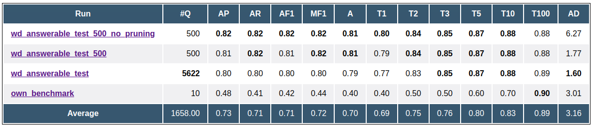

Aqqu is an efficient question answering system that answers given natural language
questions over the knowledge base Freebase. In short, a pipeline generates SPARQL queries
that might answer a given question and then ranks them in order to get the query that is
most likely to answer the question. This project aims to implement a basic
version of Aqqu for question answering on Wikidata instead of Freebase and to improve
the accuracy of previous implementations using Wikidata.

<!--more-->

## Content
1. [Introduction](#introduction)
2. [Preprocessing](#preprocessing)
3. [Pipeline](#pipeline)
4. [Evaluation](#evaluation)
5. [Conclusion](#conclusion)

## Introduction {#introduction}

Knowledge graphs are large networks that represent information by defining relationships
between different data items. Wikidata is such a knowledge graph, it has over 99
million data items and belongs to the Wikimedia Foundation. The data is organized
in RDF graph format, which means that it consists out of triple statements in the form
\\( \langle subject, predicate, object \rangle \\). Usually, the subject and the object are entities, in Wikidata
each of the three parts can be an IRI, which is basically an identifier for graph nodes, and
objects can also be literals.

To get desired information from knowledge graphs like Wikidata, the query language SPARQL
is used. Very basic SPARQL queries contain one or more triple patterns that are similar to
the triples in RDF, with the difference that elements in the triples also can be
variables. A simple SPARQL query that 
asks for the height of Mount Everest using Wikidata is the following:
```sparql
PREFIX wdt: <http://www.wikidata.org/prop/direct/>
PREFIX wd: <http://www.wikidata.org/entity/>
SELECT ?height WHERE {
  wd:Q513 wdt:P2044 ?height .
}
```
*Q513* and *P2044* are the Wikidata IDs for the entity *Mount Everest* and the relation
*elevation above sea level*. The object in the triple is replaced by the variable *?height*,
executing the query gives us the result *8848.86*, which is the height of Mount Everest.
We see that coming up with such a query, although this is a simple example, can be very challenging
since the internal structure of the data as well as the IDs of entities and relations must be known.

Knowledge base question answering is a research field that aims to answer natural
language questions over knowledge graphs. This removes the need to be familiar with SPARQL queries
and in general can be helpful in everyday life.
[Aqqu](https://ad-publications.cs.uni-freiburg.de/CIKM_freebase_qa_BH_2015.pdf) is such a system that was 
built for question answering on [Freebase](https://en.wikipedia.org/wiki/Freebase_(database)), 
another knowledge base. For a given question, it generates all
queries that could answer the question and then uses a feature-rich approach to learn to rank these
queries. In the end, the best ranked query is executed and the result is the estimated answer for
this question.

Since Aqqu relies heavily on Freebase, which has not been updated since 2016, there is the need
to adapt the system to another knowledge graph, in our case Wikidata. 
The project [Aqqu-Wikidata](https://ad-blog.informatik.uni-freiburg.de/post/simple-question-answering-on-wikidata/) 
implemented a basic version of Aqqu for Wikidata and also provided an evaluation 
frontend. Although this project is a rewrite, the logic still relies on 
both the implementations of Aqqu and Aqqu-Wikidata, 
also some small parts of the implementation as well as the evaluation frontend were taken from there.
Similar to Aqqu-Wikidata, I will also only focus on simple questions, which are questions
that are answerable with one single triple.


## Preprocessing {#preprocessing}

Before the actual question answering pipeline can be used, some
preprocessing steps have to be done to reduce the running time.

First, the entities (id, label, popularity score) and the relations
(id, name, number occurrences) are acquired from Wikidata. For the popularity score of the entities,
we use the number of Wikipedia sitelinks the corresponding entity has. In many cases, there
are multiple entities with the same label, for example persons that have the same name.
In these cases it is very difficult to decide which of them is the one asked for in the question,
the popularity score is a useful indicator for that. The number of occurrences of a relation
is the number of entities in the knowledge graph that have the respective predicate. This score
is useful in a similar sense, it is more likely that a question asks for a popular relation than an
unpopular one. We also store
the aliases that are provided by Wikidata for both the entities and the relations.

Next, the relation aliases from the previous step are taken and all lemmatized versions
of these aliases are computed and stored. The lemmatization of a word is gained by reducing inflectional 
forms, for example the lemmatization of the words *am, are, is* is *be*. This can be done with the
natural language processing library [spaCy](https://spacy.io/), which is also the basis of the pipeline
that is explained in the next section.

We distinguish between two different query templates, depending on whether the query asks for
the subject or the object of a triple. We precompute answer types for each relation and
each query template in the following way: 
For each of the five answer types *Person, Character, Organization, Location, Event* we check if
more than five percent of the answers for all corresponding queries are subclasses of the
entity of this answer type. Additionally, Wikidata allows us to directly check if a relation is
of type *Time*, when this is the case, we also add *Date* to the list of answer types for that relation.

[RocksDB](https://rocksdb.org/) is a key value store that is optimized for fast storage.
With building two RocksDB indices, one for the entities and one for the relations, we can quickly
access desired information without reading the entire data always.
The entity index helps to get all stored information of an entity and to get all
matching entities for a given lemmatized sequence of words.
The relation index gives all information for a given relation and also all
relation aliases, which is useful in the relation matching step of the pipeline.


## Pipeline {#pipeline}
<h4>Entity matching</h4>

As a first step, we tokenize the given natural language question and remove the question mark
symbol if existing. Tokens can loosely be understood as words. For example, for the question
*Where was Albert Einstein born?*, we get the tokens ["Where", "was", "Albert", "Einstein", 
"born"]. With generating the tokens, spaCy already tags the words with part of speech tags.
The goal is to look at all subsequences of tokens that might be an alias of an entity,
therefore it makes sense to merge neighbored tokens that 
are both tagged as proper nouns to prevent looking on unnecessary subsequences. 
In the previous example, "Albert" and "Einstein" are combined to "Albert Einstein". 
Now a list of all subsequences of tokens which have at least one proper noun or at least two
tokens is generated. Then, for every subsequence, we look in the entity index for all entities
that have this subsequence as their alias and save them. In the end, the list of identified
entities gets sorted by the number of tokens and by the popularity score 
and the best 50 are kept for the following steps.

<h4>Candidate generation</h4>

For each entity, we generate all query candidates that might answer the question by combining the entity with the 
possible relations that can occur with this entity. Since 
the focus are simple questions, there are two possible types of queries: One asks for the third element of 
the triple, like the Mount Everest example in the introduction, and the other one asks for the first element 
of the triple. The second template is appropriate for questions like *Who is a person that was born in Munich?*. 
We also save the number of answers that each query has.
For *Q937*, which is the entity of Albert Einstein and one of the entities that was matched during
the entity matching,
4190 query candidates are generated in this step. In 2922 of them, the query asks for the third element
of the triple, in 1268 it asks for the first element of the triple.


<h4>Relation matching</h4>

In this step, the goal is to gain values that indicate how well the relation of a query candidate
matches the given question. First, we select all relevant tokens of the question by removing
the ones that were already matched by an entity, and then we also remove the tokens that are
not tagged by a content tag. As content tags we define different forms of nouns, verbs and
adjectives, as well as adverbs and numbers. The first metric is the literal score, which is
the highest number of lemmatized tokens of one of the relation aliases of the candidate,
that also appears in the lemmatized content tokens of the question. The second one is the number of 
exact relation matches, which is one, if the lemmatized version of one relation alias appears
exactly in this order in the lemmatized question without entity tokens, and zero otherwise.

To continue the Albert Einstein example, we will look at the correct query candidate, which is the
following query:
```sparql
PREFIX wdt: <http://www.wikidata.org/prop/direct/>
PREFIX wd: <http://www.wikidata.org/entity/>
SELECT ?o WHERE {
  wd:Q937 wdt:P19 ?o
}
```
*P19* is the Wikidata ID for the relation *place of birth*.
From the tokenized question, the tokens ["Where", "born"] remain after removing the entity matched tokens and
the tokens that are not tagged by a content tag. One of the Wikidata aliases 
of *P19* is "born", thus when comparing the lemmatized versions of both the aliases 
and the question tokens, we can directly match this alias to the content words. Therefore,
we get a literal score of one and also an exact relation match in this example.


<h4>Candidate features</h4>

For the ranking process, in which we learn a ranker model that ranks the generated candidates in order
to find out which of them are most likely to answer the question, the following features are used:


|             Feature             |                                                        Description                                                        |
|:-------------------------------:|:-------------------------------------------------------------------------------------------------------------------------:|
|      Exact entity matches       |                                              Number of exact entity matches.                                              |
|   Exact entity token matches    |            Binary value that is one if a subsequence of the question exactly matches the label of the entity.             |
|     Entity popularity score     |                                       Number of wikipedia sitelinks the entity has.                                       |
|     Exact relation matches      | Binary value that is one if the lemma of a relation alias matches the lemmatized question tokens of a question perfectly. |
|          Literal score          |       Max number of tokens that appear in a relation alias and match a token of the content tokens of the question.       |
|     Occurrences relation KB     |                                Number of times the relation occurs in the knowledge base.                                 |
|       Exact token matches       |                                   Sum of exact entity token matches and literal score.                                    |
| Proportion matched/total tokens |             Number of question tokens that were matched in any way divided by the number of question tokens.              |
|          Result size 0          |                              Binary value that is one if the candidate query has no results.                              |
|        Result size 1-20         |                 Binary value that is one if the result size of the candidate query lies between 1 and 20.                 |
|        Result size > 20         |                         Binary value that is one if the candidate query has more than 20 results.                         |
|           Ngram value           |          Output logistic regression model that learned correlations between relations and words in the question.          |
|        Answer type match        |      Binary value that is one if the beginning of the question gets matched to one of the precomputed answer types.       |


The ngram value is a measure for the correspondence between one- or two-word phrases of the question
and the relation of a query candidate. 
It can be very useful because it indicates how well the relation of a candidate corresponds to 
the question, even if the features of the relation matching itself don't indicate a correspondence. 
One example that illustrates that is the question *Who is Cristiano Ronaldo?*. The expected answer 
may be *a football player*. This correspondence, that *Who is* asks for the profession of a person, cannot be 
measured by the other features.
To get this ngram value, we train a logistic regression model in the following way: For each candidate that is 
generated while processing the training questions, we combine each one- or two-word phrase of the question with 
the relation of the candidate. Then, we one-hot-encode the collected data for the training process and use 
the values of the correct candidates as positive examples and all other values as negative examples. To get realistic 
values for the following learning steps, the training data is divided into six folds and the predictions for 
the instances of one fold are done with a model that was trained on the other five folds.


The answer type match feature states whether the words of the given question indicate a certain answer type, 
that is also an answer type of the relation of the candidate, or not. Therefore, we take the answer types
that were precomputed for each relation.
For the six answer types  *Person, Character, Organization, Location, Event, Date*,
we decide this as follows: 
If the first word of the question is *Who*, we check if *Person, Character* or *Organization* are
in the set of precomputed answer types for that candidate.
If the first word is *Where*, we check for the answer types *Location* and 
*Event*. When the question starts with *When* or *Since when*, we look for the answer type *Date*.
For the correct candidate of the Albert Einstein example, we get an answer type match, since the
question starts with *Where*, and *Location* was precomputed as an answer type of *P19*.


<h4>Ranking</h4>

A pairwise ranking approach is used, which infers a ranking of the candidates with binary classification that states 
whether one candidate should be ranked higher than another one. Therefore, a random forest with 100 estimators is 
trained by giving positive examples (true candidate, false candidate) and negative examples (false candidate, true 
candidate) from the processed training set. The performance of this ranking step can be improved significantly by using 
a simple candidate pruning step. It turned out that just removing all the candidates, which have both a ngram value 
smaller than 0.5 and a literal score of 0, eliminates around 90% of the candidates without a considerable decrease in 
accuracy.


<a name="desc"></a>
## Evaluation {#evaluation}

For the evaluation, we use the answerable test set of the dataset 
[wikidata-simplequestions](https://github.com/askplatypus/wikidata-simplequestions). It currently contains 5622 
simple (and answerable) questions, which means that they are answerable with a query that uses only one triple. 
For the evaluation, we derive useful measures that describe how well the pipeline performs on the 
test set. The accuracy gives the fraction of the questions where the answers of the query that is provided as
solution are exactly the same as the answers of the highest ranked query.
T*X* is the fraction of questions where the correct candidate was among the top 
*X* candidates. Also, average precision and recall as well as average F1 and the median F1 score are given. AD is the 
average duration in seconds that was needed to answer a question.



The run wd_answerable_test shows the evaluation on the entire test set. It has an accuracy of 79% and a T1 score of 77%, 
having an average duration of 1.6 seconds per question. The two wd_answerable_test_500 runs show the differences when 
using no candidate pruning. The average duration increases by 4.5 seconds and in the other scores there 
are only very small changes. The own_benchmark run evaluates the pipeline on 10 own question that are answerable with 
Wikidata. Here it is clearly noticeable that the pipeline doesn't perform good. The reason might be that the 
structure of the questions slightly differs from the questions were the pairwise ranker model was trained on.


## Conclusion {#conclusion}

The pipeline performs good on the given simplequestions dataset, the accuracy and the performance of the 
pipeline could be improved considerably, compared to results of Aqqu-Wikidata. Still, as the 
performance on the benchmark shows, there are many things to improve. 

<h4>Possible improvements</h4>

- Generalize to more complex questions, where the corresponding SPARQL query uses more than only one triple. 
- Introduce further features that can also describe that words of the question correspond to a relation even if the (lemmatized) words don't match. One possibility would be to introduce a similarity score using word vectors. 
- Test other machine learning methods, try deep learning for better relation matching. 
- Enhanced answer type matching that has more than six answer types. 
- Machine learning model for candidate pruning to further reduce the runtime. 
- Optimize candidate generation step - the execution of the queries that get all possible candidates and also computes the answer size of each candidate currently needs the largest amount of time. 
- Improve the entity matching such that also entities can be recognized even if no words match directly. Currently, for a large number of the questions that aren't answered correctly, the reason for the failure is that the correct candidate was not generated because the entity was not recognized. This is a very difficult topic because recognizing more entities also means that there are many more candidates. 

