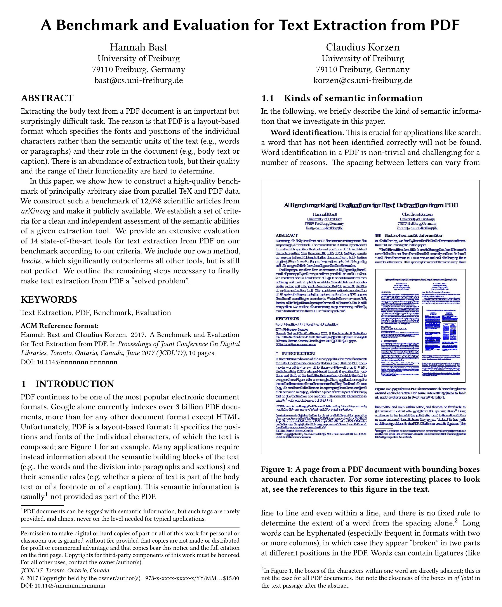
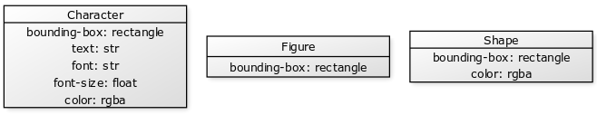
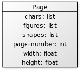
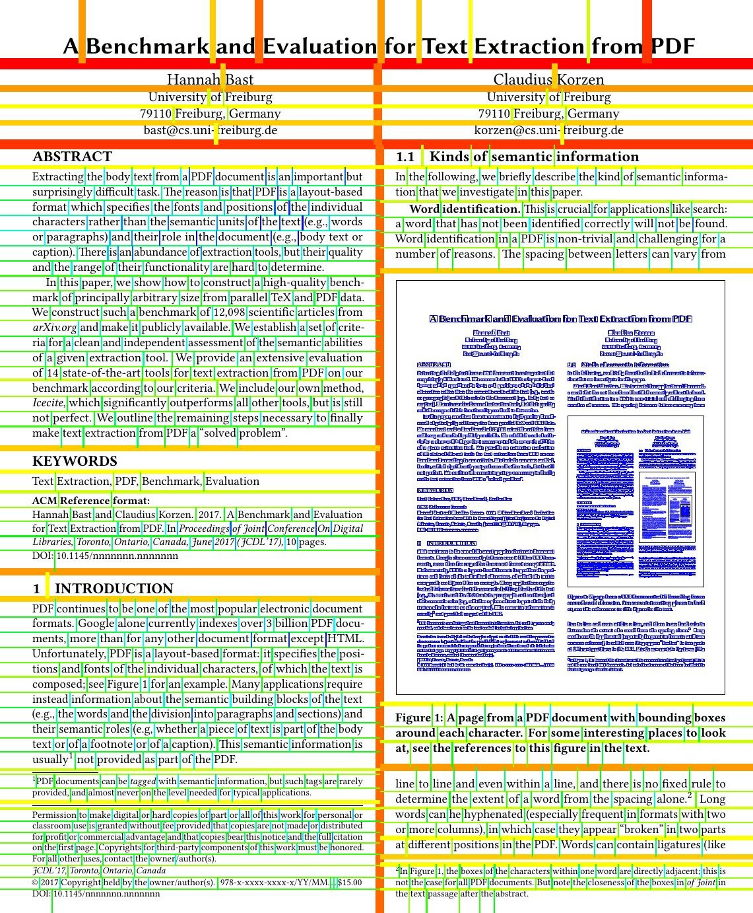
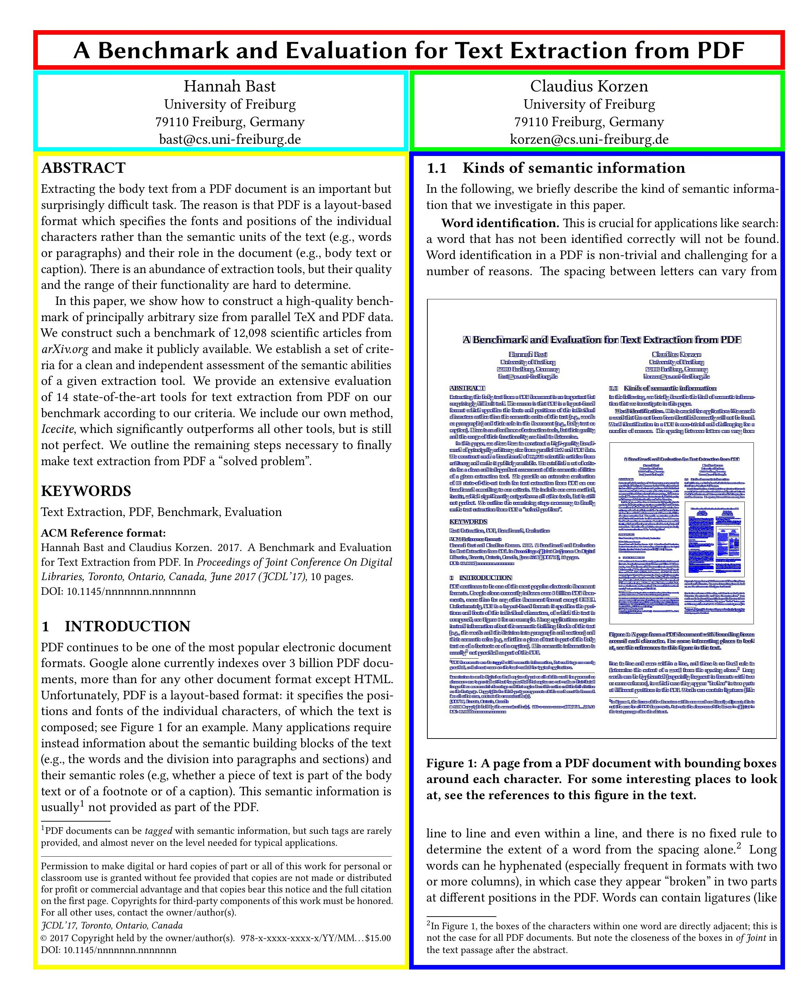

PDF is a widely used file format and in most cases very convenient to use for
representing text. However, PDF is layout-based, i.e., text is only saved
character by character and not even necessarily in the right order. This makes
tasks like keyword search or text extraction pretty difficult. The goal of this
project is to detect individual words, text blocks, and the reading order of a
PDF document to allow for reconstruction of plain text.

## Content

1. [Introduction](#introduction)

2. [Problem definition](#problem-definition)

3. [Designing the algorithm](#designing-the-algorithm)

   - [Prerequisites](#1-prerequisites)

   - [The algorithm](#2-the-algorithm)

      - [Computing possible cuts](#2-1-computing-possible-cuts)

      - [Choosing a "best cut"](#2-2-choosing-a-best-cut)

      - [Splitting the page](#2-3-splitting-the-page)

4. [Evaluation of segmentation](#evaluation-of-segmentation)

   - [Visual evaluation](#1-visual-evaluation)

   - [Algorithmic evaluation](#2-algorithmic-evaluation)

   - [Evaluation results](#3-evaluation-results)

5. [Problems and future improvements](#problems-and-future-improvements)

## Introduction

Most layout-based text document formats like PDF do not include information
about word- or paragraph boundaries nor the reading order. That is, in most
layout-based documents only information about individual characters, figures,
or shapes and of their corresponding attributes (e.g., position, font, size,
color, etc.) are given. To further complicate things no whitespace characters
are provided, meaning we have to determine word or paragraph boundaries by the
positions of the characters alone. Also, the distance between two words can vary
within a document. While this does not pose a challenge for human readers
and determining in which order headlines, columns, or paragraphs should be
read is obvious to us, the same problems are much more difficult to solve for
computers.

For example, let us consider the layout of the PDF above. As a reader, we can
easily determine that we should read the headline first, then both of the
authors, and lastly the left and right column. A computer, however, solving this
task, may not detect the columns of the document and thus mix up the lines of
both columns.\
Our goal is to devise an algorithm that is capable of segmenting a PDF document,
meaning the algorithm should be able to recognize individual words and text
blocks and their corresponding reading order. We define a text block as a set of
words that are adjacent in the PDFs layout. Note that sections or paragraphs can
consist of multiple text blocks (e.g., in the PDF above the paragraph "Word
identification" is split into two text blocks by the figure). In this project, we
will only consider PDF documents but the approach may be easily generalized to
work with other visual text formats that provide the layout information described
above.

## Problem definition

We now want to give a precise definition of the problem we are trying to solve.
We are given a list of characters, figures, and shapes extracted from a PDF,
where each of these objects comes with the coordinates of the lower-left and
upper-right corner of its bounding box, its color, and in the case of a
character also with its font name, font size, and the additional specifiers
'bold' and 'italic'.\
Our goal is to produce a list of rectangles that represent the bounding boxes
of the detected words and text blocks ordered by reading order.

## Designing the algorithm

Before we can start designing an algorithm, we need to establish two things:
The prerequisites that will be necessary to run the algorithm and the approach
the algorithm is supposed to use to solve our problem.

### 1. Prerequisites

Our algorithm is supposed to process layout-based text documents. So we need
some data structures that can hold the relevant information of a document for
the algorithm to run on.
Naturally, we want to represent the characters of the document. So we consider a
class 'Character' that holds all the necessary information of a character in a
layout-based document. Similarly, we define classes 'Figure' and 'Shape' for
figures and shapes in the document respectively.

Finally, we may now represent our document page by page using a class 'Page'
which holds a list of all its characters, figures, and shapes, and some
additional information like page number and the dimensions of the page (these
may differ from document to document or even from page to page!).

We now have established sound data structures we can later run our algorithm on,
but we still need a way of extracting the information needed for the
instantiation of our classes from our document. For this, we incorporate a
two-step process: the first step is to parse the (in our case PDF-) document
into a format that contains all characters, figures, and shapes and their
corresponding attributes. For this task, we use
[PdfAct](https://github.com/ad-freiburg/pdfact) to extract this information. We
then use a simple, self-implemented parser that converts the extracted
information into instantiations of our classes.\
We are now able to convert any given PDF to a list of page objects that
hold all information our algorithm will need later on.  

### 2. The algorithm

For our algorithm, we use a simple recursive XY-Cut approach (heavily inspired
by the approach described in this [paper](https://www.ecse.rpi.edu/~nagy/PDF_chrono/1992_Seth_ViswanathanPrototype_IEEE_Computer92.pdf)).
The structure of the
algorithm then becomes extremely simple:
```
function segment-document(document):
    for every page in document do
        yield recursive-xy(page)
``` 
where recursive-xy is defined as
```
function recursive-xy(page):
    cuts := possible-cuts(page)

    best-cut := choose-best-cut(cuts)

    if not best-cut then
        return empty_list() 

    p1, p2 := split-page(page, best-cut)

    return list(best-cut, recursive-xy(p1), recursive-xy(p2))
```
We define a cut to be a tuple \\(([a, b], \textrm{dir})\\) where the first entry
is an interval that specifies where we are allowed to cut and the second entry
is a boolean value indicating the direction of the cut (we choose \\(\text{dir}\\)
to be \\(\textbf{true}\\) if we cut vertically through the page and
\\(\textbf{false}\\) if we cut horizontally). From here on cuts whose second
entry is \\(\textbf{true}\\) will be referred to as "x-cuts" and cuts whose
second entry is \\(\textbf{false}\\) as "y-cuts".\
The algorithm is built upon three subroutines that compute all possible cuts on
the current page, evaluate which of them should be made, and create two
"subpages" by applying the chosen cut to the given page. The algorithm then
builds a nested list representation of a binary tree (called an XY-tree) that
has the form 
$$[\text{best-cut}, \ \text{recursive-xy(p1)}, \ \text{recursive-xy(p2)}],$$
where the first entry is the current node that represents the cut made in this
recursion level and the second and third entry represent the left and the right
subtree which are the results of the segmentation of the first and second
subpage respectively.\
We will now go into more detail regarding every one of these subroutines.

### 2.1. Computing possible cuts

The computation of possible cuts can be intuitively understood as the process
of determining where a horizontal or vertical line may be drawn through the
whole subpage without crossing any characters, figures, or shapes on the
subpage. We will split the computation of all possible cuts into the calculation
of x-cuts and y-cuts respectively.\
For the sake of example, let us consider how to determine all the possible
x-cuts on a given page. The given page will contain a list of entities (where
Entity is one of Character, Figure, or Shape) that each has a "bounding box"
(that is, the smallest rectangle the entity fits into). A bounding box may be
represented by only two points (i.e., the lower left and the upper right corner
of the rectangle). Let's consider a page with only three entities: 
$$[\\{e\_1: (0, 1), (2, 3)\\}, \\{e\_2: (1, 0), (3, 1)\\},
\\{e\_3: (4, 2), (5, 4)\\}].$$
Because we only are interested in x-cuts right now, we don't need to consider
the y-coordinates of the bounding boxes. Therefore we only consider the
"projection" of the entities onto the x-axis:
$$[\\{e\_1: [0, 2]\\}, \\{e\_2: [1, 3]\\}, \\{e\_3: [4, 5]\\}].$$
This yields a list of intervals representing the sections of the x-axis that
are "blocked" by our entities. We now compute to the union of these intervals
which yields
$$[0, 2] \cup [1, 3] \cup [4, 5] = [0, 3] \cup [4, 5].$$
Note that in the resulting list none of the intervals overlap. We now have
computed a list of intervals where we would collide with the bounding box of an
entity if we would cut through them. So our final step is to compute the "gaps"
of this list. That is if we assume the list of intervals to be sorted by their
starting point, for each pair of consecutive intervals \\([a\_i, b\_i]\\) and
\\([a\_{i+1}, b\_{i+1}]\\) we take the gap \\([b\_i, a\_{i+1}]\\) between them.
Our example yields exactly one such gap, i.e., \\([3, 4]\\). This interval
represents the first entry of a possible x-cut we can make on our example page.\
In this fashion, we may compute all the intervals of x-cuts and y-cuts that are
possible on a given page. We then pair these intervals with their corresponding
boolean value indicating x- or y-cut. This yields a list of all cuts we need to
consider for the given page.\
Note that in PDF some characters of a word may have a really small space between
them which then could be detected as a possible interval for a cut. To avoid (or
at least reduce) this problem we define a threshold \\(m \geq 0\\) and only
consider cuts whose interval has a length of at least \\(m\\). We use
\\(m = 0.5\\) which for most documents is bigger than the distance between the
characters of a word but still smaller than the distance between two words.

### 2.2. Choosing a "best cut"

Now that we have computed all possible cuts, we need some way of choosing the
best one of them. This begs the question of what a "best cut" is even supposed
to be. Without going into too much detail, we say a cut is "good" (or even "the
best") if it is consistent with the layout and the natural reading
order of the current page (e.g., we split between headline
and text body before splitting the body into individual lines or split into
individual lines before splitting into individual words). There are many simple
but naive ways to choose a "best" cut.\
The most primitive approach used in this project is the "alternating-cut"
strategy. This strategy will simply start by returning a y-cut and then start
alternating between x- and y-cuts. Although it is possible to get somewhat
decent results on PDFs with very specific layout (e.g., the first chosen y-cut
separates headline and text body and the following x-cut separates the body
into columns), this is in general not a useful way of choosing the best
cut because it essentially ignores everything except the direction of the cut.\
An obvious improvement while still being extremely simple is to choose cuts by
their size (i.e., the length of the corresponding interval). We call this the
"largest-cut" strategy. This is reasonable because in almost all PDFs distance
is used for a clear visual distinction of the different parts of the document
(e.g., the distance between a headline and the following body of text will be
larger than the distance of two lines within the text body). This strategy
will perform much better in detecting things like columns in the text than the
previous approach. For example, if we have text separated into two columns the
alternating strategy may choose to split horizontally between lines (and thus
across the columns) instead of vertically between the columns simply because
it chose an x-cut in the previous step. The largest approach will prefer to split between
columns over splitting between lines because the distance between columns will
simply be larger. While better than just alternating between directions this
strategy also has many problems. One such problem is that in PDF vertical
distance and horizontal distance aren't always directly comparable which will
lead us to our next strategy.\
While distance is a key factor in determining the layout of a PDF
simply choosing the largest cut all the time is not always correct. In
particular, not only the size but also the direction of a cut is important. For
example, the distance between two columns can be as large or even larger than
the distance between a headline and the remaining text. In general, it is
noticeable that when given an x-cut and a y-cut of similar size it is often
better to prefer the y-cut over the x-cut. This leads us to our next approach
the "weighted-largest-cut" strategy. This strategy yields a "largest" cut but
favors y-cuts by multiplying their size by some factor \\(r \geq 1\\) (in my
experiments \\(r = 2.5\\) brought forth the best results). This strategy
performed really well on my test corpus of about 20 PDF documents. Especially in
splitting headlines, columns, and sections, the strategy produced good results.
It is easy to see that even though this strategy might be a pretty decent
heuristic for choosing a best cut, it still is far from perfect. It will most
likely not work as well on a larger corpus of documents because the value of
\\(r\\) was adjusted to work well on my set of test documents and does not need
to be good in general.\
All the previous strategies are focusing on only one or two properties of a cut.
So naturally we would be interested in a strategy that can look at multiple (or
better arbitrarily many) properties at the same time. To achieve this we will
consider a more general approach. First we define a parameter \\(P\\) to be a
function from the set of possible cuts to the interval \\([0, 1]\\) that
assesses the quality of a cut with respect to some property (we consider \\(1\\)
to be the best achievable quality and \\(0\\) the lowest).\
An example of such a parameter is \\(P\_{size}\\) which assigns each cut \\(c\\)
its own size divided by the size of the largest cut \\(c\_{max}\\) that has the
same direction as \\(c\\):
$$P\_{size}\(c\) = \frac{size\(c\)}{size(c\_{max})}$$
The larger the size of a cut the higher its \\(P\_{size}\\) value will be, the
largest cut will have a value of \\(1\\).\
Now we define another function
$$f : [0, 1]^n \rightarrow [0, 1]$$
where \\(n\\) is the number of properties we want to consider and \\(f\\) has
the following two properties: for all \\(x\_1,\dots,x\_n,y\_1,\dots,y\_n
\in [0, 1]\\) the implication
$$\bigwedge\_{i=1}^n x\_i \leq y\_i \Longrightarrow f(x\_1,\dots,x\_n) \leq
f(y\_1,\dots,y\_n)$$
holds (i.e., \\(f\\) is monotone in every variable) and for all
\\(x\_1,\dots,x\_n \in [0, 1]\\) 
$$\bigwedge\_{i=1}^n x\_i = 1 \Longleftrightarrow f(x\_1,\dots,x\_n) = 1.$$
We then use one parameter for every property we want to take into account
(properties can be size, position, or direction of a cut, fonts and font sizes
on both sides of the cut, etc.). This gives us a set of parameters
\\(\\{P\_1,\dots,P\_n\\}\\). We may now choose a best cut by selecting a cut
\\(c\\) that maximizes the expression \\(f(P\_1\(c\),\dots,P\_n\(c\))\\). A
further refinement may be made by incorporating a weight
\\(w\_i \in \mathbb{R}^+\\) for every parameter that determines how much impact
a change to that parameter should have on the value of \\(f\\).\
In practice I mostly used the three parameters \\(P\_{pos}, P\_{fs}\\), and the
above mentioned \\(P\_{size}\\).\
\\(P\_{pos}\\) assigns each cut its relative position on the current subpage
with respect to its direction. That is, for height \\(h\\) and width \\(w\\)
of the subpage and a cut \\(c = ([a, b], \textrm{dir})\\):
$$P\_{pos}\(c\) = \begin{cases} 1 - \frac{a}{w} & if \textrm{ dir} =
\textbf{true} \\\\\frac{a}{h} & if \textrm{ dir} = \textbf{false}\end{cases}.$$
Note that because cuts cannot overlap it does not matter if we use \\(a, b\\),
or \\(a + \frac{b - a}{2}\\) in the above definition. \\(P\_{pos}\\) will prefer
cuts whose positions match the natural reading order (we read from top to
bottom and from left to right), thus the closer a y-cut is to the top of the page
the higher its value and similarly the closer an x-cut is to the left margin the
higher its value will be.\
\\(P\_{fs}\\) will look at the different font sizes of the subpages a cut
produces and prefer cuts whose subpages have similar font sizes. More precisely,
let \\(p\_1\(c\)\\) and \\(p\_2\(c\)\\) be the two subpages created by a cut
\\(c\\), \\(\textrm{avg-fs}(p\_i\(c\))\\) the average, and
\\(\textrm{max-fs}(p\_i\(c\))\\) the maximum font size of subpage \\(p\_i\\).
We now define \\(\textrm{dev-fs}(p\_i\(c\)) = \textrm{max-fs}(p\_i\(c\)) -
\textrm{avg-fs}(p\_i\(c\)\\) as the deviation between the maximum and the
average font size\. We then have:
$$P\_{fs}\(c\) = \frac{1}{1 + \max\\{\textrm{dev-fs}(p\_1\(c\)),
\textrm{dev-fs}(p\_2\(c\))\\}}.$$
The more similar the font sizes of the worse subpage are the better a cuts
\\(P\_{fs}\\) value will be.\
Using these parameters produces reasonable results but is neither strictly
better nor strictly worse than "weighted-largest-cut". It does really well in
respect to word order within a line because it will split the words of the line
from left to right. Similarly, it will almost always start by splitting the
headline from the text which is good for title pages but not for pages without
headlines where for example it would make more sense to split between text and
page numbering (usually located at the very bottom of the page) first.\
While in general, this approach is definitely more refined than the previous
strategies, it is still nontrivial to find sets of parameters and weights that
lead to proper results in the selection of cuts. Experimenting with these values
by hand becomes tedious really fast and thus is not really feasible for tuning
to achieve the best possible results. However, a machine learning model is very
well suited to be trained for such a purpose and we will briefly touch this
topic again in [a later section](#problems-and-future-improvements).

### 2.3. Splitting the page

Unlike the previous subroutine, applying a chosen cut to a given page is pretty
straightforward. We create two subpages and assign all entities of the given
page to one of those. Let \\(P\\) the set of entities of the given page
$$P = \\{\\{e\_i: (x\_1, y\_1), (x\_2, y\_2) \\} \ \vert \ 1 \leq i \leq n\\}.$$
For an x-cut \\(([a, b], \textbf{true})\\), the first subpage then has the
following set of entities
$$P\_1 = \\{\\{e\_i: (x\_1, y\_1), (x\_2, y\_2)\\} \ \vert \ x\_2 \leq a\\},$$
similarly the entity set of the second subpage is
$$P\_2 = \\{\\{e\_i: (x\_1, y\_1), (x\_2, y\_2)\\} \ \vert \ x\_1 \geq b\\}.$$
From the way we computed the possible cuts we know in fact that each entity in
\\(P\\) has to either be  in \\(P\_1\\) or in \\(P\_2\\).\
Here is an example of entities on a page, each represented by their bounding
box, being distributed to the first subpage (marked in green) and second subpage
(marked in red) by an x-cut (marked in blue).

In the case of a y-cut we would use \\(y\_1\\) and \\(y\_2\\) in the definition
of \\(P\_1\\) and \\(P\_2\\) respectively.

## Evaluation of segmentation

Now that we have a sound foundation for our algorithm, we need a way to assess
how well the algorithm performs on a document with a given choosing strategy.

### 1. Visual evaluation

Initially, it suffices to evaluate the segmentation made by the algorithm
"visually". That is, we traverse the resulting XY-tree via a depth-first search
and compute the starting and endpoint of every cut we encounter. We then use
these points to draw a line for each cut using
[pdf-drawer](https://ad-git.informatik.uni-freiburg.de/ck1028/pdf-drawer).\
A visualization of a segmentation done using the "weighted-largest-cut" strategy
(described [here](#2-2-choosing-a-best-cut)) created with pdf-drawer looks like
this:

An attempt was made to visualize the depth of a cut in the XY-tree by the
thickness and the color the lines were drawn in (cuts are drawn thinner and
change color from red to green to blue the deeper they are in the tree).

### 2. Algorithmic evaluation

While a visual evaluation is great to get a feeling of how a particular choosing
strategy operates, we need a better method of assessing quality more objectively
than "just by looking at it". We would also be interested in a quality measure
that allows objective comparisons of segmentations. Therefore we are looking for
methods that measure how similar a segmentation by the algorithm is to a given
ground truth for a document.\
This leads us to the first and simplest approach to compare the result of our
algorithm to a ground truth. We create an "optimal" XY-tree up to a certain
depth for every page of the given document (we build the tree by manually
choosing the cut that is best for every situation). For a segmentation computed
by the algorithm, we can now traverse both trees the same way and for every node
increase the current score if the cut represented by the node is correct with
respect to our ground truth or decrease the score if it is not. For this
approach, it is reasonable to weigh the adjustments made to the score less the
deeper in the tree we currently are. This yields a score for each page and we
may assign a score to the whole document by taking the mean of these scores:
$$\text{score}(doc) = \frac{1}{\vert Pages \vert} \sum\_{p \in Pages}
\text{score}(p).$$
This approach still has some major flaws. First of all, if a cut is not correct
there is no proper way to evaluate the correctness of the subtrees of that node
(they might be correct with respect to the cut of the parent node but that cut
was not correct, to begin with). Second, we have no easy way of generating the
ground truth from a given document (generating a sound ground truth is about
equally as complex as always choosing the correct cut right from the start).\
Our second approach is to describe the layout of a page by an ordered list of
rectangles. For example, we may describe the general layout of this page by
using these rectangles (in the order: red, turquoise, green, yellow, blue):

Note, that we may adjust the accuracy of such a description by adding or
removing rectangles as we see fit.\
After that, we reconstruct a similar list of rectangles (similar in accuracy to
the given ground truth) from the cuts in the XY-tree produced by the algorithm.
We now can compare these two lists by applying the following quality measures.
Let \\(L\_G\\) be the ordered list of ground truths and \\(L\_A\\) the list
constructed from the result of our algorithm. We then define
$$R^+ = \vert \\{r \ \vert \ r \in L\_A, r \not\in L\_G\\} \vert,$$
$$R^- = \vert \\{r \ \vert \ r \in L\_G, r \not\in L\_A\\} \vert,$$
$$Inv = \vert \\{ (r, r') \ \vert \ r, r' \in L\_A \cap L\_G,
r <\_{L\_G} r', r' <\_{L\_A}r\\} \vert.$$
That is, \\(R^+\\) is the number of elements that are in the list of the
algorithm but not in the ground truth list, \\(R^-\\) is the number of elements
that are in the ground truth list but not in the list of the algorithm, and
\\(Inv\\) is the number of inversions of the elements in \\(L\_A \cap L\_G\\)
in terms of the ordering of \\(L\_G\\) and \\(L\_A\\) respectively. Intuitively
\\(Inv\\) can be understood as the number of pairs of rectangles that appear in
both lists but not in the same order.\
We may interpret \\(R^+\\) as the amount of "wrong" rectangles found by the
algorithm, \\(R^-\\) as the amount of "correct" rectangles the algorithm could
not find, and \\(Inv\\) as a measure for the similarity of the orderings of the
two lists. Similar to the previous approach we may now either consider the
individual \\(R^+\\), \\(R^-\\), and \\(Inv\\) scores per page or take the
average over the whole document.

### 3. Evaluation results

To assess the quality of our cut choosing strategies we created "ground truths"
for 10 of our PDF documents. Every ground truth consists of one ordered list of
rectangles per page of the document (as described above). These were created
manually and thus are neither perfect nor really in-depth (they mainly focus on
correct headline and column detection).\
The following table reports the results of the evaluation. All values are reported
as the average over all documents. Additionally to the absolute \\(R^+\\) and
\\(R^-\\) values we provided percentage values representing the ratio of "wrong"
rectangles to all rectangles found in case of \\(R^+\\) and the ratio of "missed"
rectangles to all rectangles expected by the ground truth for \\(R^-\\). For each
of the evaluation criteria, the value of the worst-performing strategy is marked
in red and the value of the best-performing one in blue.

| Strategy | \\(R^+\\) | \\(R^+ \ (\\%)\\) | \\(R^-\\) | \\(R^- \ (\\%)\\) | \\(Inv\\) |
|----------|-----------|------------------|-----------|------------------|-----------|
| alternating | \\(\color{red}{1400.1275}\\) | \\(\color{red}{99.86}\\) | \\(\color{red}{2.7425}\\) | \\(\color{red}{85.56}\\) | \\(0.0\\) |
| largest | \\(1398.4168\\) | \\(99.64\\) | \\(1.0318\\) | \\(29.6\\) | \\(0.0\\) |
| weighted-largest | \\(\color{blue}{1398.2875}\\) | \\(\color{blue}{99.59}\\) | \\(\color{blue}{0.9025}\\) | \\(\color{blue}{26.08}\\) | \\(0.0\\) |
| arbitrary (\\(P\_{size}, P\_{pos}, P\_{fs}\\)) | \\(1398.8075\\) | \\(99.61\\) | \\(1.4225\\) | \\(49.83\\) | \\(0.0\\) |

As expected the "alternating-cut" strategy performs worst out of all evaluated
strategies. The "largest-cut" strategy outperforms it by a big margin but is still
worse than the best-performing "weighted-largest-cut" strategy. Surprisingly the
approach for arbitrary parameters is outperformed by both the "largest-cut" and
the "weighted-largest-cut" strategy. This could be due to a sub-par selection of
parameters and weights as opposed to the well fine-tuned (but most likely
overfitted) weight for the "weighted-largest-cut" strategy. Another reason might
be that headline and column detection can still be pretty easily done by these
simple strategies and that is what the ground truths are mainly focused on. Also
very noticeable is the lack of any inversions on the evaluated documents. For the
alternating strategy, this can be explained by the low amount of correct
rectangles found because inversions will only be computed on correctly
identified rectangles. Furthermore, because the ground truths are relatively
shallow and thus do not dictate many expected rectangles low values for
inversions are to be expected. The complete absence of detected inversions is
still surprising and suggests that even these simple strategies have some
capabilities to respect reading order (like considering headlines before
the body, left column before right column, etc.).\
Note that because the list of rectangles output by the algorithm is not yet
filtered (i.e., adjusted to the granularity of the ground truth) before performing
the evaluation all strategies report unusually high \\(R^+\\) values.

## Problems and future improvements

Although up to this point we have established a stable baseline, there are still
some problems that need to be addressed. First of all, we do not yet have a cut
choosing strategy that performs reasonably well on a larger set of documents.
While it is somewhat doable to tweak a given choosing strategy to work well on a
specific document, it is pretty difficult to generalize such a strategy to
perform decently on a larger corpus. Second, the overall execution time of the
algorithm and the JSON parser could still be improved. Especially the computation
of the possible cuts (on a page with many entities many intervals are already
included in previously considered intervals) and the parameters used for choosing
cuts can be improved. Lastly, we can not yet use the results of our segmentation
to extract text.\
In the future, I want to include some extensions and further improvements to
this project. One obvious improvement is the use of a machine learning model for
choosing cuts. The choice and proper weighting of parameters (as described
[here](#2-2-choosing-a-best-cut)) is a task well suited to be learned by
a neural network and I am confident a well-trained model can help us achieve a
more general but still reasonable strategy to choose cuts. It will also be
exciting to apply the results of the algorithm to various tasks that require
layout information (like extraction of text). I look forward to continuing to
work on this project and hopefully expand it to a proper bachelor's thesis!

## Acknowledgments

Special thanks to the head of the Chair Algorithms and Data Structures,
[Hannah Bast](https://ad.informatik.uni-freiburg.de/staff/bast), and my
supervisor,
[Claudius Korzen](https://ad.informatik.uni-freiburg.de/staff/korzen), who
wrote this compelling
[paper](https://ad-publications.cs.uni-freiburg.de/benchmark.pdf), that peaked
my interest in this particular topic and which was used in many examples
throughout this post!
