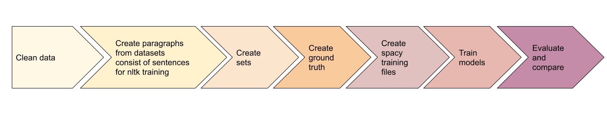
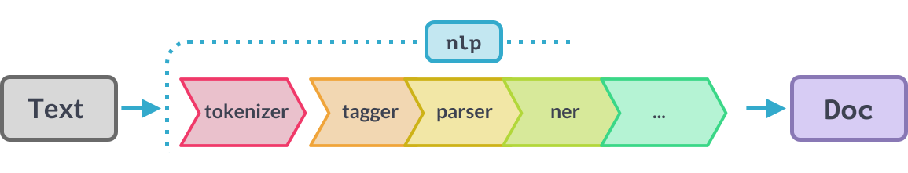
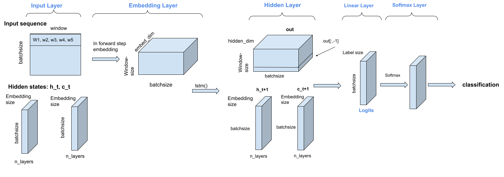
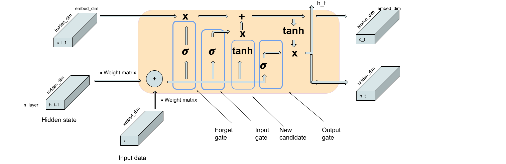

Sentence segmentation is a basic part of many natural language
processing (NLP) tasks.  The leading NLP Python libraries
spaCy and NLTK offer  pre-trained models for that. These
models often fail on a specific domain. The goal of this
project is to measure the performance of these libraries and
compare their results with a custom made LSTM model on special
domains like Wikipedia or arXiv.
<!--more-->

## Table of Contents

1. [Introduction](#introduction)
2. [Addressed task](#addressed-task)
3. [Data Sources](#data-sources)
4. [Workflow](#workflow)
    - [Preparing Data](#preparing-data)
    - [Tools](#tools)
        - [spaCy](#spacy)
        - [NLTK](#nltk)
        - [LSTM](#lstm)
5. [Evaluation](#evaluation)
    - [Metrics](#metrics)
    - [Results](#results)
    - [Common errors](#common-errors)
6. [Potential improvements](#improvements)

## Introduction

<b>NLP</b> (Natural Language Processing) is a field of data science that works with text data using Computational Linguistics.
As human language is continuously changing and evolving, it has many rules and exceptions, that makes every NLP task a real challenge.

## Addressed Task

Sentence boundary detection is a determining task within text processing
and influences the success of the whole result.  During sentence segmentation,
we would want to break a (long) text into sentences. 

>* Input text:
> "God is Great! I won a lottery."
>* Output:
>['God is Great!' | 'I won a lottery. ']

Although it seems to be a relatively easy task, the ambiguity of the
period's usage makes it complex.  The special forms in an uncommon domain
like formulas, variety of abbreviations can break the common structure of
the language, causing errors in sentence boundary detection. Let us give some examples:

|  | example |
| -------- | -------- |
| abbreviations     | No., e.g., etc., J. F. Kennedy     |
| formulas|(0.02  ≤  z  ≤  0.04) |
| link |<https://hackmd.io> |
|Enumerated lists |1. example |
| quote in a sentence |"Dinosaurs Alive!" was a walkthrough attraction that guests paid an additional fee to access.|

*Table 1. Hard cases in the sentence segmentation task*

## Data sources

In this experiment four different datasets were used to test the models: Wikipedia, arXiv, Brown and Europarl.

|  | # paragraphs| # sentences |
| -------- | --------: | --------: |
| Wikipedia   |45.676.715 |    -   |
| arXiv       | 1.006.228 |    -   |
| Brown corpus   |  - | 56.636 |
| Europarl corpus|  -  | 1.920.209 |
| Mixed          |    62.442 |   530.276 |

*Table 2. Size of the datasets*

The *Europarl* corpus is extracted from the proceedings of the European Parliament with
more than 1.9 million sentences.
*Brown* corpus contains texts from 500 sources with varied genres. It was created at
Brown University from works published in the United States in 1961. These two datasets
contain sentences.
*Wikipedia* dataset has more than 45 million paragraphs from Wikipedia entries. The *arXiv*
dataset contains above 1 million paragraphs in the field of scholarly articles from several
research domains. These last two datasets consist of paragraphs.
From the Wikipedia dataset three different subsets was created, from arXiv two, in order to test how the size of the training data influences the models' result. For the same reason was another subset from Europarl extracted.
The size of this dataset was fitted to spaCy's training system: its  special format limited the number of sentences within one file.

|  | # paragraphs used in training| # sentences used in training |
| -------- | --------: | --------: |
| Wikipedia XL   |38.328.946 |    -   |
| Wikipedia L    | 1.000.000 |    -   |
| Wikipedia S    |   100.000 |    -   |
| arXiv L        |   576.371 |    -   |
| arXiv S        |   100.000 |    -   |
| Brown corpus   |    15.575 |    55.837 |
| Europarl S     |    88.546 |   500.000 |
| Europarl L     |   317.338 | 1.904.801 |
 
 *Table 3. Training sets used to train the models. Brown and Europarl hold a sentence in each line, paragraphs are generated.*

## Workflow

The goal of the project was achieved through several steps, which I present in the next
sections.

</img>

### Preparing Data

Data preparation includes cleaning and correcting the raw data. It is an important step,
as errors and inaccuracies limit the performance of the models.
The following cleaning was done in the preparation step:

* replace references to a number: [\\ref=action] => [1]
* replace several spaces to one
* delete meaningless paragraphs containing only one sentence or word
* fix sentence boundary errors in sentence based datasets (europarl)

The whole data was split into three sets: training, development and test set.
<b>Training set</b> is 80% of the whole dataset, it was used to train the models.
<i>Unsupervised learning</i> needs no labels for the training set, so there is no need
of additional editing of the raw text. I  used subsets of the same datasets (i.e. Wikipedia XL,
Wikipedia L and Wikipedia S) to test how the differently sized training sets influence the models' performance, see tables in 
 [evaluation](#evaluating) section. 
On the contrary <i>supervised learning</i> uses [training example-label] pairs, where the label is
the desired output. That means that for the supervised learning all paragraphs had to be split
into sentences to create their labels. 
The remaining 20% was split to create a <b>development and test set</b>. The model was evaluated on
the development set as I was building it. Test set was used for the last evaluation.
To be able to measure and compare the performance of the models, a small subset of <b>ground truth</b> was created from the development set and the test set.   The ground truth  is labelled data, containing a small piece of text and the separated sentences are a label for this text. The ground truth contains paragraphs on which the default models of NLTK and spaCy struggled the most, producing errors. That was made by segmenting the development set both with the default model of NLTK and spaCy, and I took the sentences where they gave different results. Until now all the preparation steps were automatized, but creating labels needed to be manually done.
Also training LSTM and spaCy required sentences. I extracted a subset of Wikipedia and arXiv
training set and development set and segmented it manually. 
It has to be mentioned that sometimes the segmentation of a  sentence is ambiguous, and it could be split
differently, for example:

> He said "I like sentence segmentation. It is a nice problem."

This paragraph can be split in different ways, I used the following solution:

> [He said "I like sentence segmentation. | 'It is a nice problem."]

### Tools

The following libraries were used from Python during the development of the project.

#### spaCy

[spaCy](https://spaCy.io/) is a relatively new package for NLP in Python.
spaCy is  featuring a state-of-the-art speed and neural network models with  pretrained components for every common NLP task,  including  sentence segmentation.
spaCy offers four components for sentence segmentation.  The most accurate one uses convolutional neural network and is based on syntactic dependency labels. The dependency tree describes the relations between parts within a sentence. Sentence boundaries are calculated from this parse tree.

</img>
_Quelle: www.spaCy.io_

The pretrained <b>Dependency Parser</b> powers the sentence boundary detection and  works for general-purpose domains, however it fails on a special text with formulas or other non-word content like equations. To train the Parser, one would need to label data containing sentences flagged with the dependencies. Besides training we have other possibilities to optimize the output of the Parser.
A text is processed in several steps – this is also referred to as the *processing pipeline*. Tokenization is the first step that splits the text into individual parts called tokens. Because Tokenization is a foundational step on which further processing highly depends, we can customize the Parser by modifying the tokenizer pipeline. 

_Quelle: www.spaCy.io_

That was done in the project in the following way: 

- **modify prefix, suffix, infix sets**:
*Prefix* is a character at the beginning of the word, *suffix* is a character at the end,
and *infix* is a character within the word. 
The prefixes, suffixes and infixes mostly define punctuation rules – for example, when to
split off periods (at the end of a sentence), and when to leave tokens containing periods
intact (abbreviations like “U.S.”). During tokenization the strings will be split on
punctuation like commas, periods, hyphens or quotes contained in the three sets. We can add
characters to the sets, or remove some from them.

- **add a special case**:
A special case can be used to prevent a token from being split during the tokenization when punctuation rules are applied. It works for abbreviations, for example 'Fig.' will stay intact.

- **merge tokens**:
For merging two or more tokens we can define regular expression patterns. After the text were segmented into sentences, the defined rules for merging will be applied. As a result, there would be no sentence boundary set between the merged tokens.

- **Add component**:
We can also add a custom pipeline component. This component defines additional rules for setting _is_sent_start_ flag for segment starting tokens.

The next table contains what we can achieve with these modifications:
| used method | original tokenization  | modified tokenization|
| ------------- | ------------- |-------------|
|remove infix|'it', "'", 's'|'it's'|
|add special case|'Dr', '.''| 'Dr.'|
|merge tokens|'J', '.'', 'S', '.'', 'Bach'|'J. S. Bach'|
|add component|'Next, in Fig.', '2 [formula], we draw '|'Next, in Fig. 2 [formula], we draw the interior structure|

*Table 4. Result of customizing spaCy*

The <b>SentenceRecognizer</b> (Senter) is a simpler statistical component, faster, and smaller than the Parser and for training it needs labelled data containing only sentence boundary annotations (setting the is_sent_start flag). As data labelling is a very time and effort consuming task, the Senter was trained on a smaller dataset containing labelled sentences.
To improve spaCy's Senter we have an additional method: Use a custom function during training spaCy's model.
In that function the learned abbreviations from NLTK were added as special case.

#### NLTK

The other library is [NLTK](https://www.nltk.org/book/), released in 2001.
It also provides diverse tools for text processing and analyzing, and includes more than
50 corpora and lexical sources.
NLTK uses PunktSentenceTokenizer which is an unsupervised algorithm
([Unsupervised Multilingual Sentence Boundary Detection, Kiss & Strunk (2006)](https://watermark.silverchair.com/coli.2006.32.4.485.pdf?token=AQECAHi208BE49Ooan9kkhW_Ercy7Dm3ZL_9Cf3qfKAc485ysgAAApAwggKMBgkqhkiG9w0BBwagggJ9MIICeQIBADCCAnIGCSqGSIb3DQEHATAeBglghkgBZQMEAS4wEQQMLE4tvLL8t8fx0Bp2AgEQgIICQ9Ex8udErO7v5Rw7ba-v1MVMUgxU9ySXymbFeDOrmrkosX8aA-enosfncKN1-wgXf6YToCkKsEfMajnDfVI63OL130zxQU3GQJNZa0oY362SMrUAmk1oxBLV-uyiknVzaBvXuy1cDfA256STCLzpD7QLASBYt5CP4VWlpQOwx5LvKVtwmZVxrE1GAtNalmfi7-QekRNe-CtebIHvrVf_oF1jq7cwv_HX-csE33Dr1_GJqgLhNh_mRaiW6d3nMZHInv2QAwGe_JWaYHG5e_C1C02mB3v5SdXfk85Pwi7U1BKASYXCjULe2SRMqFFvUG9To2UQwYPd2PvVika375QCkZX5FI2C_DzEv8dLJLldHvgyOKihmQ5WVBUPUj0TBdxdV3vg487exLK6tkg_gOMREJNhtt_vKZO5--3Qst-fgUCe0dBb9yI--KltoNwJ7JHOcc2Sxc5qtxmPXzU4yK6LoJwUN_xqbgdzvsKVPMxkpqBsswmOJszPIB9rH4TYkQKF3bnEAERoZTw4UFxBfXDOqYoTbKdcVt0ceXIUDibuB01DFh0OVGyNWwJePoDThYEOUFsSm5jo-0xAY5RJCSC0a2TVa2FgBuCVR7NCUFyRIhtO18pyHg476xphotGBgw9QBNpCyl1Ur6yPtOv6oLDtA57JsZFJrtY4bTFDhT4AO_fUobtP09bpzOz6mUNULzlKVz4dzVna-KtMATGDS5GzC-mVRL432H19vPl-DSHJFpI8TEP38HjRBhhaDxqsT8dK10xSPQ)),
meaning that we need to feed it with a raw text and no labelling is needed.
The basic assumption of the algorithm is that detecting abbreviations and collocations
yields a large percentage of all sentence boundaries.
The algorithm uses the frequencies calculated during the training by counting the
punctuations and tokens being the end of a sentence.
As  abbreviations in a text depend on the actual text and text genre, training
and customizing the abbreviation set can improve the model. The NLTK tokenizer's 
abbreviation set has to be updated with lowercase abbreviations without the 
trailing period at the end:

> [fig, etc, e.g, dr, mr, u.s, ref, ]

To get a good result, a large amount of training data has to be used. The NLTK model was trained on the given domain and further customized by updating with some special abbreviations like 'al.' so that the period after 'al.' is not a sentence boundary;  and collocations such as 'St. Louise'  won't be split on the period.

#### LSTM

Neural network is a system inspired by the human brain with the purpose of being able to determine patterns. Our goal is to find a function that models the connection between our input and the needed output. LSTM (Long short term memory) is a special kind of neural network, which is capable of learning long term dependencies. So if there is a large gap between the prediction and the relevant information, it can "remember".  
The advantage offered by LSTM can be used in the current Sentence Boundary Detection task: we want to predict, whether a token is a sentence boundary or not, based on the previous tokens.

 

### Implementation using Pytorch

The basic idea of this implementation is to use a sliding context window to give a context
for the actual token, for which we want to determine if it is a sentence boundary or not. For
this we tokenize the input text: eventually we use every character in the string, also the
spaces between the words, because it can hold important information: the periods in 'a.k.a'
are no sentence boundaries.

In LSTM we have to encode all the words as vectors. After tokenizing the text a word-index mapping is made, giving every token a unique index.

> I love books. => I: 0, love: 1, books: 2, ' ': 3, ".": 4

That gives a quick accessibility of the words if prediction is done, but that would give us a
sparse vector representation.
For LSTM there is a deeper representation of the words: **word embedding** that maps every token
(word) to a vector, in our case a vector of length 32. This vector gives a projection of the
word in the 32 dimensional vector space. In the model a self trained embedding was used.
To train an LSTM neural network labelled data is needed, so each word is categorized as
sentence boundary (label = 1) or not sentence boundary (label = 0).
LSTM iterates through the input in several times, that is our epoch parameter.
The LSTM model is fed with the input matrix, cut into small packages called batches.

Two other matrices are also input for the LSTM neural network: the hidden and the cell state.
The cell state is the internal state of the LSTM cell, holding the information from the previous inputs - that is the long short term memory.
The hidden state is passed to the next layer to compute a prediction - it is the working directory.
The weights of the LSTM cell are the results of the training - that is the long-term memory.
At the beginning, the cell state and the hidden state are initialized to zero.

</img>

*Workflow of the LSTM neural network model*

LSTM is distinguished by three gates,  which are modifying the cell state.
These gates are the neurons or layers in the network. A neuron is a function that calculates
a weighted sum of the input:

> $$ \sum (Weights \cdot Input) + bias$$

The gates add or remove information from the cell state by using an activation function. The activation function decides whether a layer should be activated or not. All three gates work with a sigmoid function which is a nonlinear function that transforms its input to a number between 0 and 1:  
>  $$\sigma(x)=\frac{1}{1+e^{-x}}$$

These gates are the essence of LSTM, using themm we can update the cell state and calculate the new hidden state:
* the <b>forget gate</b> filters the old state and decides what information to discard.
    > $$f_f = \sigma(W_f \cdot (h_{t-1}, x_t), bias_f)$$
*  the <b>input gate</b> decides what information to let through from the input *x*
    > $$f_i = \sigma(W_i \cdot (h_{t-1}, x_t), bias_i)$$
* <b>tanh layer</b> regulates the new input between -1 and 1 and outputs a new candidate
    > $$f_{nc} = tanh(W_{nc} \cdot (h_{t-1}, x_t), bias_{nc})$$
where $$tanh(x) = \frac{e^x - e^{-x}}{e^x + e^{-x}}$$
* to update the cell state, the previous cell state will be multiplied by the output of the forget gate. After that, the input gate's output should be multiplied by the new candidate and the product should be added to the cell state *c*.
* the <b>output gate</b> calculates how much of the input is used in our output *h_t*, 
    > $$f_o = \sigma(W_o \cdot (h_{t-1}, x_t), bias_o)$$

* the updated cell state will be sent through a tanh function again and multiplied by the output of the output gate.

</img>

> W = weight matrix, different for each gate 
h = hidden state 
x = input sequence 

The current output *h_t* of the model can be used for prediction. It must be transferred by
the *softmax* function into  probabilities: for the last token in each window of being a
sentence boundary or not. We use only the prediction for being a sentence boundary with a
threshold of 0.15: any sample above or equal to 0.15 is given the positive label. Otherwise,
it is negative. 
The neural network was trained using labelled training data of concatenated sentences, using
a 9 token context window. I chose the training parameters differently depending on the number of sentences
in the training set. In this way I tried to counterbalance the size issue in the training sets.
The model was trained for 5 epochs with a learning rate set to 0.01 on the dataset with larger training set (Europarl L). The datasets with smaller training set (arXiv, Wikipedia) was trained in 200 epochs, Brown in 100 epochs.

## Evaluation

The models were compared on different metrics described in the next two sections.

### Metrics

For the detailed evaluation the *confusion matrix* was used. Confusion matrix contains the following four entries:

|          | Predicted No | Predicted Yes|
| -------- | -------- | -------- |
|Valid boundary | true negative     | false positive     |
|Not valid boundary   | false negative     | true positive     |

*Table 5: The confusion matrix*

* true positive = sentence boundaries found by the model that exist in the reference
* false positive = sentence boundaries found by the model that were not present
* false negative = reference bounds that were missing from the model's output 
* there is no true negative value = (there was no sentence boundary and the model did not find it)

For each sentence both the beginning and the end was counted in order to get the number of correctly found sentences.
The following common metrics were used:
* error rate: the number of incorrect predictions divided by the total number of predictions. 
$$error\ rate = \frac{(false\ positives + false\ negatives)} {number\ of\ all\ candidates}$$
* precision: the rate of the correctly predicted sentence boundaries in all the predicted boundaries. 
$$precision = \frac{true\ positives} {(true\ positives\ +\ false\ positives)}$$
* recall: the rate of the correct predictions within all the sentence boundaries. 
$$Recall = \frac{true\ positives} {(true\ positives\ +\ false\ negatives)}$$
* F-measure: summarizes the model's performance. 
$$F\ measure = \frac{2\ ×\ precision\ ×\ recall} {precision\ +\ recall}$$

### Results

The models' accuracy was measured based on a manually created ground truth, containing paragraphs and their sentence segmented version.
The next table reports a comparison of all the models and benchmarks based on the number of correct sentences they returned:

|Segmenter| arXiv S| arXiv L| Wikipedia S| Wikipedia L| Wikipedia XL|Brown | Europarl S| Europarl L|
| -------- | -------- | -------- |-------- |-------- |-------- | -------- | -------- |-------- |
| NLTK default        | 77.66% |  77.56% | 87.44% | 86.62% | 86.62% | 84.39% |   -    | 93.20% |          
| NLTK trained        | 83.32% |  83.41% | 89.05% | 87.55% | 86.47% | 84.89% |   -    | 93.50% |    
| NLTK customized     | 87.25% |  87.12% | 90.25% | 88.78% | 87.99% | 83.70% |   -    | 93.41% | 
| spaCy default senter| 71.56% |    -    | 78.74% |    -   |     -  | 81.39% | 91.69% |   -    |
| spaCy default parser| 68.04% |    -    | 74.11% |    -   |     -  | 82.65% | 92.49% |   -    |    
| spaCy trained senter| 86.33% |    -    | 81.43% |    -   |     -  | 93.80% | 93.91% | 94.24% |    
| spaCy customized parser| 70.55% |  -   | 77.25% |   -    |    -   | 74.84% | 92.56% |   -    |      
| LSTM                   | 74.57% |  -   | 66.09% |   -    |    -   | 77.06% | 77.63% | 92.08% |  

*Table 6: Comparison of the segmentizers - the same ground truth was used for datasets from the same domain but with a differently sized training set*

The following tables contain the detailed results of the experiment.

* The default tokenizer in NLTK has the best result on Europarl, as this corpora is the most similar to the corpora used in the pre-trained NLTK tokenizer:

| NLTK default | Arxiv S| Wikipedia S| Brown | Europarl L|
| -------- | -------- | -------- | -------- |-------- |
| error rate | 0.20   | 0.12     | 0.09     | \\(\color{red}{0.05}\\) |
| precision | 0.85    | 0.90     | 0.97     | \\(\color{red}{0.97}\\) |
| recall    | 0.94    | 0.98     | 0.93     | \\(\color{red}{0.98}\\) |
| F measure | 0.89    | 0.94     | 0.95     | \\(\color{red}{0.97}\\) |
| # sentences in Ground Truth| 4683   | 3415  | 6724 | 6765|
| # correct sentences | 3635   | 2986   | 5723   | 6305  |
| % correct sentences | 77.66% | 87.58% | 84.75% |\\(\color{red}{93.20\\%}\\) |

*Table 7. The results of the default NLTK model*

* In all the domains the **trained NLTK** returned more correct sentences and improved the  results,
however, it is interesting to note, that a larger dataset caused no obvious and clear improvement. It could be caused by
the fact, that NLTK collects the abbreviations and applies probabilities, and in a larger dataset these probabilities and the rates change.

| Trained NLTK | Arxiv S | Arxiv L | Wikipedia S |  Wikipedia L| Wikipedia XL | Brown | Europarl L|
| -------- | -------- | -------- |-------- |-------- |-------- |-------- | -------- |
| Error rate | 0.16 | 0.16 | 0.11  | 0.11 | 0.12 | 0.09   | \\(\color{red}{0.05}\\) |
| precision  | 0.86 | 0.86 | 0.91  | 0.91 | 0.90 | 0.98   | \\(\color{red}{0.97}\\) |
| recall     | 0.97 | 0.97 | 0.98  | 0.98 | 0.98 | 0.93   | \\(\color{red}{0.98}\\) |
| F measure  | 0.91 | 0.91 | 0.94  | 0.94 | 0.94 | 0.95   | \\(\color{red}{0.97}\\) |
|  # sentences in Ground Truth  | 4683   | 4683 | 3415 | 3415   | 3415| 6724   | 6765  |
|  # correct sentences   | 3899  | 3908 | 3041  | 3016 | 2983 | 5755    | 6325   |
|  % correct sentences   | 83.32% | 83.41% | 89.05% | 88.32% | 87.35% | 85.22%  | \\(\color{red}{93.50\\%}\\) |

*Table 8. The results of the trained NLTK model*

* **Customizing NLTK** brings a small improvement in some cases. However, correcting
some errors can ruin other segmentations: for example, if we add all letters to the abreviation set (J. S. Bach),
it holds for one letter variables (x) and won't be counted as a sentence boundary at the end of a sentence (x.).
During customizing I was focusing on the arXiv and Wikipedia, and the rules could ruin some segmentations in the other domains.

| Customized NLTK | arXiv S | arXiv L | Wikipedia S | wikipedia L| Wikipedia XL | Brown | Europarl L|
| -------- | -------- | -------- |-------- |-------- |-------- |-------- |-------- |
| Error rate | 0.09 | 0.09 | 0.08 |0.08 | 0.09 | 0.09   | \\(\color{red}{0.05}\\)   |
| precision  | 0.97 | 0.97  | 0.95   | 0.95 | 0.94 | 0.98   | \\(\color{red}{0.97}\\)   |
| recall     | 0.94 | 0.94  | 0.97   | 0.97 | 0.97| 0.92   | \\(\color{red}{0.98}\\)   |
| F measure  | 0.96 | 0.96 | 0.96   | 0.96 | 0.95 | 0.95   | \\(\color{red}{0.97}\\)   |
|  # sentences in Ground Truth  | 4683 | 4683  | 3639 | 3639 | 3639  | 6724   | 6765  |
|  # correct sentences   | 4083  | 4080 | 3084  | 3063 | 3036| 5665    | 6319  |
|  % correct sentences   | 87.25% | 87.12% | 90.31% | 89.69%  | 88.90% | 83.89%  | \\(\color{red}{93.41\\%}\\)  |

*Table 9. The results of the trained and customized NLTK model*

* **spaCy's Parser segmentizer** uses dependency trees, that performs best in the common
domain like Europarl. In other domains the formulas, variables and other domain-specific
forms ruin the sentence structure and make it hard to use the dependencies within a sentence.

| default spaCy parser | Arxiv | Wikipedia | Brown | Europarl |
| -------- | -------- | -------- |-------- |-------- |
| Error rate | 0.29  | 0.22   | 0.12     | \\(\color{red}{0.07}\\)    |
| precision  | 0.74  | 0.82   | 0.96     | \\(\color{red}{0.95}\\)    |
| recall     | 0.94  | 0.93   | 0.92     | \\(\color{red}{0.98}\\)    |
| F measure  | 0.83  | 0.87   | 0.94     | \\(\color{red}{0.97}\\)    |
| # sentences in Ground Truth | 4683 | 3639 | 6724 | 6765 |
| # correct sentences | 3200 | 2529 | 5579 | 6257 |
|  % correct sentences | 68.40% | 74.06% | 82.62% | \\(\color{red}{92.49\\%}\\) |

*Table 10. The results of the  default spaCy Parser model*

* **Customizing the Parser from spaCy** didn't bring improvement in all the cases. That is because
if some errors were corrected with rules, other cases were ruined.

| customized spaCy parser | Arxiv | Wikipedia | Brown | Europarl |
| -------- | -------- | -------- |-------- |-------- |
| Error rate | 0.22     | 0.20 | 0.19 | \\(\color{red}{0.06}\\) |
| precision  | 0.85     | 0.86 | 0.92 | \\(\color{red}{0.96}\\) |
| recall     | 0.90     | 0.93 | 0.87 | \\(\color{red}{0.98}\\) |
| F measure  | 0.88     | 0.89 | 0.90 | \\(\color{red}{0.97}\\) |
|  # sentences in Ground Truth | 4683 | 3518 | 6753 | 6765 |
|  # correct sentences | 3354 | 2636 | 5072 | 6262 |
|  % correct sentences | 71.62% | 77.19% | 75.11% | \\(\color{red}{92.56\\%}\\) |

*Table 11. The results of the customized spaCy parser*

* Using **spaCy's Senter** with a statistical method improved the results on the specific domains like arXiv.

| default spaCy senter | Arxiv | Wikipedia | Brown | Europarl |
| -------- | -------- | -------- |-------- |-------- |
| Error rate | 0.23 | 0.17  | 0.11  | \\(\color{red}{0.07}\\) |
| precision  | 0.84 | 0.90  | 0.98  | \\(\color{red}{0.95}\\) |
| recall     | 0.91 | 0.91  | 0.91  | \\(\color{red}{0.97}\\) |
| F measure  | 0.87 | 0.91  | 0.94  | \\(\color{red}{0.96}\\) |
| # sentences in Ground Truth | 4683 | 3539 | 6724 | 6765 |
| # correct sentences | 3351 | 2688 | 5616 | 6203 |
| % correct sentences | 71.56% | 78.71% | 81,68% | \\(\color{red}{91.69\\%}\\) |

*Table 112. The results of the default spaCy Senter model*

* After **training spaCy Senter**, all the metrics climbed higher.

| trained spaCy senter | Arxiv | Wikipedia | Brown | Europarl S| Europarl L|
| -------- | -------- | -------- |-------- |-------- | -------- |
| Error rate | 0.11 | 0.15 | 0.03  | 0.04  | \\(\color{red}{0.04}\\) |
| precision  | 0.93 | 0.91 | 1.0 | 0.98  | \\(\color{red}{0.98}\\)   |
| recall     | 0.95 | 0.93 |0.97| 0.98  | \\(\color{red}{0.98}\\)   |
| F measure  | 0.94 | 0.92 | 0.98 | 0.98  | \\(\color{red}{0.98}\\)   |
|  # sentences in Ground Truth | 4683 | 3539 | 6753 | 6765| 6765|
|  # correct sentences | 4041 | 2777 | 6378 | 6353 | 6375 |
|  % correct sentences | 86.33% | 81.32% | 94.45% | 93.91% |\\(\color{red}{94.24\\%}\\)|

*Table 13. The results of the trained spaCy senter model*

* For better results in the **LSTM** model the possible improvements have to be implemented.
The high error rate shows that the model segments on more places than needed.
Recall indicates that the existing sentence boundaries were detected in a high percentage. 
The table shows on the example of Europarl dataset that the larger sized training data leads to better performance. 

| LSTM | Arxiv | Wikipedia | Brown | Europarl S | Europarl L |
| -------- | -------- | -------- |-------- |-------- | -------- |
| Error rate | 0.28 | 0.32 | 0.22 | \\(\color{red}{0.23}\\) | \\(\color{red}{0.08}\\) |
| precision  | 0.74 | 0.69 | 0.79 | \\(\color{red}{0.78}\\) | \\(\color{red}{0.93}\\) |
| recall     | 0.97 | 0.98 | 0.98 | \\(\color{red}{0.99}\\) | \\(\color{red}{0.99}\\) |
| F measure  | 0.84 | 0.81 | 0.87 | \\(\color{red}{0.87}\\) | \\(\color{red}{0.96}\\) |
|  # sentences in Ground Truth | 4683 | 3518 | 6753 | 6765 |6765|
|  # correct sentences | 3491 | 2467 | 5204 |  5252  | 6229 |
|  % correct sentences | 74.57% | 72.24% | 77.06% | \\(\color{red}{79.63%}\\) | \\(\color{red}{92.08\\%}\\) |

*Table 14. The results of the LSTM model*

#### Common errors

The NLTK models' most common error was to split the sentence in case there was a quote within the sentence: 
> ["Do I Wanna Know?" | is performed in the key of G minor.]

The NLTK models have the common error that they are not able to find the sentence boundary if there is no whitespace between the period and the first letter of the next sentence.
> [those songs that's hard to beat...It's got references to mortality]

or if there was no punctuation:

> [Contributions to schools The scholarship plan would provide federal contributions [...]]

This structure was typical for Brown, because of the frequent usage of titles. That caused less errors in the spaCy models. 
However, spaCy tended to split the sentences into more chunks for different reasons:
The Parser that works on dependencies could not find the right dependency if there was a non-word content in the sentence like an equation or formula. The Senter was sensitive for a period after numbers and letters were used as abbreviations in names.

> [The Authors thank dr. | A. Pai (IUCAA) for having posed the problem, and dr.| B. | Owen ]
[Sec. | 21. | Manufactures (Tables 972−1007)]

Abbreviations were a main source of errors for all the models, especially with names like J. F. Kennedy., or a sentence boundary after a one-letter variable name, where the boundary has been overseen.

> [...] Q2 ~ 1 / r2T and x = Q2 / s. The the broadening corresponding to ([2]) takes the form [...]

Using rules in customizing the model some of these errors could be avoided, however, in most of the cases that caused some other errors in the segmentation.
For example, adding all letters as abbreviation caused that a variable at the end of a sentence was considered as an abbreviation and classified as non sentence boundary.

> [probably around 345-335 B.C.  A massive, curved, retaining wall was built.]

The same thing happened with numbers:

> October 24. 2017.

It was not recognized as sentence end.
The evaluation showed that all models had a better result on a common domain, but some special patterns could cause error. For example, in Europarl - which can be considered as the simplest task - the following pattern caused lots of errors for the spaCy models:
> in writing. - The extension of the Scientific and Technological Cooperation agreement
 
Abbreviation at the end of the sentence caused also errors:
> [Common themes include love, courtship, the countryside, etc. "Hò" is popular in Cần Thơ - Vietnam.]

For the LSTM model the common hard cases were: abbreviations, especially in names, symbols in formulas, periods after numbers caused false segmentation.
It is also interesting to note, that LSTM errors were similar to the default spaCy errors. Improvement through longer training was capped, larger training data would be also needed.

## Potential Improvements

* using a larger dataset for training on the specific domains
* Using pretrained embedding
* Bidirectional LSTM has a potential to improve the actual LSTM model. It is an extension to the original LSTM, training two LSTMs: the second uses a reversed copy of the input giving a further context.
* using a special training set consisting mostly of the hard cases 

