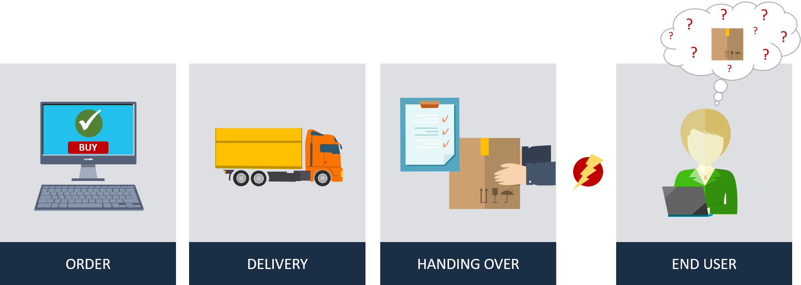
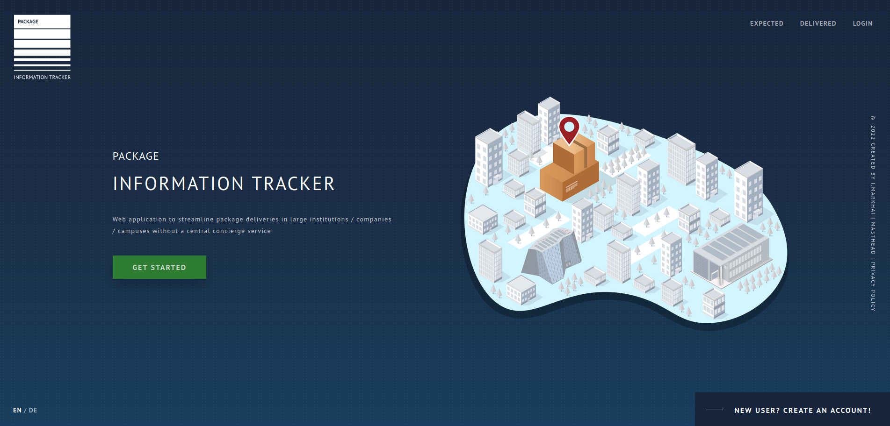
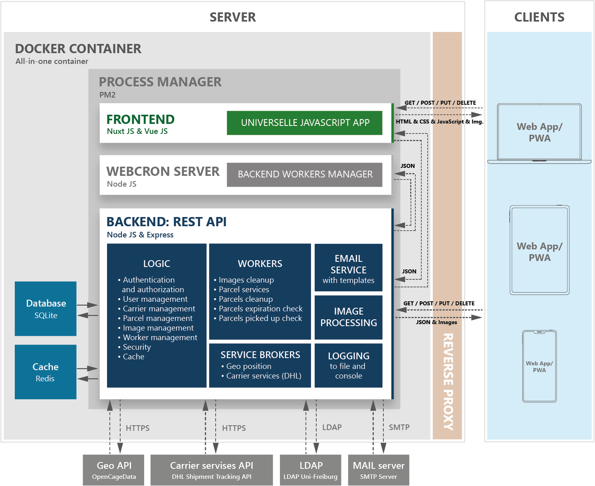

The project aims to create a web application to optimize parcel delivery in large institutions / companies / campuses without a central concierge service.

<!--more-->


## Content

1. [Introduction](#introduction)
2. [Requirements](#requirements)
3. [Implementation](#implementation)
    - [Frontend](#frontend)
    - [Backend](#backend)
4. [Integration and Deployment](#integration-and-deployment)
4. [Conclusion](#conclusion)

## Introduction

One of the main problems with the delivery of packages by parcel service providers is the handover to the end user, especially when delivering to other people, that often leads to the loss of the parcels. This post shows how to build a web application to solve the problem of lost packets within large institutions, companies or campuses without a central concierge service.


<center style="margin-top:-35px;margin-bottom:55px;">Figure 1:  Problem with delivery to end user</center>

<br>

## Requirements

The following requirements were implemented during the development of the application:
- The system was supposed to be a web-based application and was supposed to optimize the delivery of packages to large institutions, companies or university campuses without a central concierge service;
- It should be possible to manage the packages as autonomously as possible;
- The system should automatically notify the package owner and recipient of the changes;
- It should be possible to search the packages;
- The system should be connected to at least one tracking API to display the current status of packages;
- The application should be easy to deploy and configurable.

## Implementation

Based on all defined requirements, a web application called "Package Information Tracker" was developed. This application has been divided into two parts: backend and frontend. Due to the versatility of JavaScript, it was decided to use this language for development. This makes the implementation of full-stack applications more consistent and faster using the same technologies, development tools and frameworks.

### Frontend

The frontend was implemented using the open source framework Nuxt.js (based on Vue.js) as a responsive single-page application with server-side rendering. This enables fast loading when the page is called up for the first time, relieves the server and reduces data exchange when the application is used further. This means that such an App takes advantages of dynamic websites and single page applications (SPA).
In addition, the application has been expanded to become a "Progressive Web App" (PWA), which means that it can be saved from the browser to the home screen with little effort. The application then gets its own icon and looks like a native App, which aims to offer users faster access and the best possible user experience.
The frontend project folder also contains a configuration folder where you can find many different settings such as enabling or disabling LDAP and email login, adding a new language, redirecting to the imprint and data protection page and much more. Application branding information can also be customized here.


<center style="margin-top:-35px;margin-bottom:55px;">Figure 2: Application home page</center>

### Backend

The logic and content management is done in a REST architecture style (Representational State Transfer) and implemented using Node.js and Express.js. Since we assume that there will only be up to a few hundred advertisements at the same time, the decision was made to use an SQLight database system. In addition, the outdated and completed advertisements are automatically deleted and thus the amount of data does not grow constantly. To reduce the number of requests to the database, enable scaling, and improve the response time of REST API applications, an in-memory caching solution called Redis is used.
Package Information Tracker web application API can be divided into backend logic, worker, service broker, mailer, image processing and logging. This backend REST API consists of 7 API controllers and 7 main routes divided into 39 subroutes. The main routes are responsible for the following tasks:
- "auth" is used for authentication and authorization as well as for managing the logged-in user data. This route is protected against brute force attacks with a so-called "rate limiter";
- "users" is used for user administration and is only available to administrators. The administrator can change user data and block and delete specific users;
- "carriers" is used to manage transport services. This route is available to admins and moderators. Besides it displays here whether such services have an additional connection to the transport service API and when the package status was last updated;
- “parcels” is used to manage packages and is the main part of the backend logic;
- "images" is used to manage package photos;
- "workers" has only one route, and is mainly used by the internal "web cron server" for launching backend workers;
- "healthz" has only one route and is used to monitor the server health. There is a JSON response with "success: true" if the server is working properly and all environment variables important for server functioning are set.


<center style="margin-top:-35px;margin-bottom:55px;">Figure 3: Web application architecture</center>

## Integration and Deployment

Because Node.js is single-threaded to take advantage of multi-core systems and reduce the possibility of failures, the application can be scaled out. This can be realized by launching multiple instances at the same time. For this step, it was decided to use a process manager for Node.js applications with an integrated load balancer called PM2 and thus start not only the backend, but also the frontend processes for server-side rendering. "Web cron server" is also initiated by the process manager to reduce the possibility of errors and ensure the safe work of the workers.
In the "cluster-mode.json" file you can set how many instances of backend, frontend and worker should run with Process Manager (PM2). Default is:
- backend (2 instances)
- worker (1 instance)
- frontend (2 instances)
 
Figure 3 shows the entire architecture of the application, including the process manager and the docker. A reverse proxy is not a part of the application and would need to be configured on the hosting server. In addition, the application domains should be encrypted with SSL certificates.

```bash
*************************************************************
Welcome to help!
*************************************************************
You can choose one of the following options:
'make start-cache'	  	    - Start cache server (start redis server)
'make stop-cache'	  	    - Stop cache server (stop redis server)
'make start'		  	    - Start application
'make stop'			        - Stop application
'make develop'	  	    	- Start application in development mode
'make monit'		    	- Monitoring application in cluster mode in real time
'make logging'		  	    - List last logs
'make checkstyle'		    - Check the style
'make test'			        - Run unit tests
'make seed-add-admin'		- Add admin to the database
'make seed-delete-admin'	- Delete admin from the database
'make seed-carriers'		- Seed the database with carriers data
'make seed-fake'		    - Seed the database with fake data
'make drop-fake'		    - Drop fake data
'make db-drop'			    - Drop the database
```
<center style="margin-top:-35px;margin-bottom:55px;">Figure 4: Application commands in Docker container</center>

A Makefile was created in the Docker container, which provides the most important commands for starting, seeding the database, monitoring and testing the application. Thus, entering a "make help" command will list all other application-specific commands (see Figure 4).

The application can be easily installed on any server with existing Docker. Any security sensitive data can be given as arguments during the build process (see Figure 5, 6).

```bash
# 1. Build container
$ docker build -t ievgen-markhai-project . --no-cache

# 2. Run locally
$ docker run -it -p 3000:3000 -p 8000:8000 -p 636:636 --name ievgen-markhai-project ievgen-markhai-project

# 3. Activate cache and seed the data
$ make start-cache
$ make seed-add-admin
$ make seed-carriers
$ make seed-fake

# 4. Start app
$ make start
$ make logging

# 5. Open browser
# frontend: http://localhost:8000/
# backend api: http://localhost:3000/

```
<center style="margin-top:-35px;margin-bottom:55px;">Figure 5: Build and run Docker containers locally</center>

```bash
# 1. Build container
docker build --target deploy \
  --build-arg FRONTEND_URL=<frontend-url> \
  --build-arg FRONTEND_PORT=<frontend-port> \
  --build-arg BACKEND_URL=<backend-url> \
  --build-arg BACKEND_PORT=<backend-port> \
  --build-arg DHL_KEY=<key> \
  --build-arg OPENCAGE_KEY=<key> \
  --build-arg WORKERS_PROTECTION_TOKEN=<token> \
  --build-arg JWT_SECRET=<secret> \
  --build-arg USER_EMAIL_ADMIN=<admin@admin.com> \
  --build-arg USER_PASSWORD_ADMIN=<password> \
  --build-arg USER_PASSWORD_FAKE_USER=<password> \
  --build-arg SMTP_PASSWORD_PROD=<password> \
  -t ievgen-markhai-project . --no-cache

# 2. Run for production
docker run -d \
  -p <frontend-port>:<frontend-port> \
  -p <backend-port>:<backend-port> \
  -p <ldap-port>:<ldap-port> \
  -v <full-path-to-directory>/backend/db/data:/app/backend/db/data \
  -v <full-path-to-directory>/backend/static/images:/app/backend/static/images \
  -v <full-path-to-directory>/backend/logs/error:/app/backend/logs/error \
  --restart unless-stopped \
  --name ievgen-markhai-project ievgen-markhai-project

# 3. Run 'make help' command
docker exec -it ievgen-markhai-project /bin/bash
make help

# 4. Seed the data
$ make seed-add-admin
$ make seed-carriers

# 5. Loggin / Monitoring
$ make logging
$ make monit
```
<center style="margin-top:-35px;margin-bottom:55px;">Figure 6: Build and run Docker containers for production</center>

## Conclusion

A web application called "Package Information Tracker" was worked out in this project to solve problems with lost packages within large institutions, companies or campuses without a central concierge service. Using the Nuxt.js framework for developing a universal JavaScript application on the frontend side, as well as Node.js and Express.js on the backend side turned out to be positive for the creation process. The result is an App that can work independently of external cloud solutions and the interfaces of external services - such as the DHL Shipment Tracking API, the OpenCage Geocoding API, the Uni-Freiburg LDAP server and an SMTP server - just to extend the own functionality used. By containerizing it, using Docker and using PM2 as the process manager, the application has proven to be easy to deploy, failsafe and configurable.

If you want to try the "Package Information Tracker", please visit [www.package-tracker.markhai.com](www.package-tracker.markhai.com)
