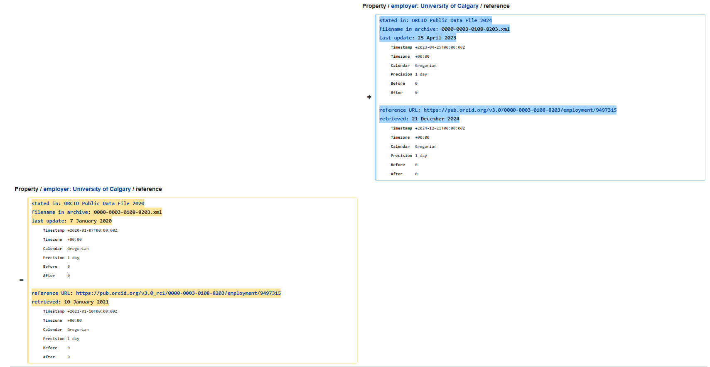

Retrieving the latest changes that has been applied to wikidata, in the SPARQL 1.1 Update Language. 
For this purpose we use wikidata api called recentchanges. And afterwards they are parsed into rdf format.

<!--more-->

## Table of Contents

- [Introduction](#introduction)
- [Methodology](#methodology)
- [Results](#results)
- [Conclusion](#conclusion)


---

## Introduction
[Wikidata](https://www.wikidata.org/) is a free and collaborative knowledge base that acts as a structured data repository for Wikipedia and other Wikimedia projects. It provides a machine-readable database that is constantly evolving as users and automated bots update entries with new facts, corrections, and links.

### **Wikidata Homepage Screenshot**


### **Wikidata as a Triple Store**
Wikidata represents information using a **triple-based structure**, where each fact consists of:
- **Subject** → the entity (e.g., "Berlin")
- **Predicate** → the relationship (e.g., "is the capital of")
- **Object** → the value (e.g., "Germany")

This structure follows the **RDF (Resource Description Framework) model**, allowing for flexible and linked data representation.

### **How Wikidata Updates Work**
Since Wikidata is constantly changing, updates occur through a series of **insertions, deletions, and modifications**:
- **Insertion**: Adding new triples to represent new facts.
- **Deletion**: Removing outdated or incorrect triples.
- **Modification**: Changing a triple by deleting the old value and inserting a new one.

This means that **every change in Wikidata is effectively a combination of deletions and insertions**, ensuring that the data remains dynamic and accurate over time.

### **Wikidata Recent Changes Screenshot**


This report explores methods to efficiently monitor and track Wikidata updates, ensuring that we capture meaningful changes as they happen.

---

## Methodology

### Observing Changes on Wikidata
When examining changes on **Wikidata** through its website, each modification is displayed as a **list of styled HTML tables**. These tables visually highlight the inserted, deleted, or modified triples in a human-readable format.

While this representation is useful for manual review, it poses challenges for **machine processing and automation**. The structured changes, as displayed on the website, lack **semantic compatibility** with potential automated workflows, making it difficult to systematically track and analyze data modifications.

### **A Wikidata Change Screenshot**


### Researching a Machine-Readable Approach
I researched extensively for solutions to retrieve **Wikidata changes in SPARQL Update format** ([SPARQL 1.1 Update](https://www.w3.org/TR/sparql11-update/)). The most straightforward approach seemed to be leveraging the **Wikidata API** to capture recent changes.

The following API request retrieves recent changes from Wikidata:
https://www.mediawiki.org/wiki/API:RecentChanges

```python
api_url = "https://www.wikidata.org/w/api.php"
params = {
    "action": "query",
    "list": "recentchanges",
    "rcstart": end_time,
    "rcend": start_time,
    "rclimit": CHANGE_COUNT,
    "rcprop": "title|ids|sizes|flags|user|timestamp",
    "format": "json",
    "rctype": CHANGES_TYPE,  # Limit the type of changes to edits and new entities
}
```

This request **fetches metadata** about recent changes, such as edit timestamps, user IDs, and entity IDs. However, it **does not provide the actual change data**.

## Processing Changes: Comparing Revisions

To obtain the actual modifications, my approach involved:

1. **Fetching the old and new revision IDs** from the change metadata.
2. **Making an additional API request** to compare these revisions. https://www.mediawiki.org/w/api.php?action=help&modules=compare.
    This api can compare two wikidata pages or two revisions of the same entity.
3. **Extracting the changes from the returned HTML table**, which is the same visual representation seen on the Wikidata website.
4. **Parsing the HTML into SPARQL Update format** and identifying the set of changed triples.

This approach initially seemed promising, but it introduced **significant workload challenges** due to:

- **Different data structures** and representations of changes in Wikidata.
- **Complexity in parsing the HTML tables** into a structured SPARQL update format while handling all edge cases.

## Challenges and Alternative Considerations

Despite extensive effort in scripting an **HTML-to-SPARQL Update** parser, I encountered an **endless loop of edge cases**. The sheer variability in how changes were formatted in Wikidata made it impractical to cover all scenarios.

After investing considerable time in refining the approach, I **decided to explore alternative solutions** that could be more scalable and reliable.


## Second Approach: Using RDF Graph Comparison

After another round of research, trial and error, and forum participation, I found another method that could be useful for the task at hand.

### **Extracting Changes Using RDF Graphs**
The most complete and correct way is:
1. **Retrieve the change metadata** using the Wikidata API.
2. **Fetch the old and new revision IDs** from the metadata.
3. **Query the entity dump for each revision ID** to obtain the full data of that entity.
4. **Parse the entity dumps into a knowledge graph** using the Python library **rdflib**.
5. **Compute the difference between the two graphs**:
   - **Graph A - Graph B** → identifies deleted triples.
   - **Graph B - Graph A** → identifies inserted triples.
6. **Generate SPARQL Update statements** based on the detected changes.

### **Advantages and Trade-offs**
This approach is **slightly slower than the first one** since for each change, **two complete Wikidata entity dumps** must be retrieved and processed. However, it ensures that:
✅ **All changes are correctly detected**  
✅ **The extracted triples are well-formatted** and consistent  
✅ **Edge cases and formatting inconsistencies are minimized**  

### **Optimizing with rdflib**
I used various **rdflib** options to **fine-tune** the method to best suit my needs, improving the processing efficiency and handling different data structures correctly.

https://rdflib.readthedocs.io/en/stable/

### **Optimizing Readability with URL Translation**
To improve readability, I **utilized Python dictionaries** to **translate full URLs into Wikidata prefixes**.  
This makes the extracted triples **more concise and human-readable** while maintaining semantic accuracy.

### **Final Implementation and Testing**
This is the **approach we chose**, and we were happy with the results.  

To ensure reliability:
- **Unit tests** were added to verify that the detected changes match expected outputs.
- **Manual testing** was conducted to cross-check changes against the Wikidata interface.


Worth mentioning, multiple command-line arguments are available to tailor the project for different use cases.

---


## Results

After thorough research and testing, we ultimately chose the **second method**—retrieving entity dumps for each revision and computing the differences between RDF graphs. This approach, despite being slightly slower, provided **the most accurate and structured representation of changes** in **SPARQL Update format**.

### **Testing and Validation**
Once implemented, the method was rigorously tested to ensure its correctness and reliability:
- **Automated unit tests** were created to verify that the extracted insertions and deletions matched expected results.
- **Manual validation** was performed by comparing detected changes against the official Wikidata change logs.
- Edge cases, such as **complex nested structures** and **non-standard data modifications**, were tested to confirm that the solution handled a wide range of scenarios effectively.

The results demonstrated that this method **consistently captured all relevant changes**, accurately formatting them into SPARQL updates.

### **Building a Python Package**
To make the solution more accessible and reusable, I **developed a standalone Python project** based on this approach. The project was structured as a Python package, allowing for **easy installation and integration** into different workflows.  

Key features of the package include:
- A **command-line interface (CLI)** for flexibility in specifying parameters, allowing users to:
  - **Filter the number of changes** to process.
  - **Specify an entity ID** to track specific items.
  - **Select the type of change** (e.g., edit, new entity, deletion).
  - **Set a custom time period** for fetching modifications.
  - **Enable debugging options** for detailed logging and troubleshooting.
- **Customizable settings** to adapt to different user needs.
- **Efficient handling of Wikidata dumps** to ensure a structured and automated process.

By packaging the solution into a reusable project, we enabled **future users** to easily install and deploy the tool in their own applications without needing to rewrite the implementation from scratch.

---


## Limitations

While the implemented solution proved to be effective in tracking Wikidata changes, there were some limitations that impacted the project:

### **1. Time Constraints**  
Due to limited time, we had to make certain trade-offs in implementation and optimization. While the current method successfully retrieves and processes changes, additional refinements—such as improving performance and automating real-time tracking—could not be fully explored within the project timeline.

### **2. API Restrictions**  
The **Wikidata RecentChanges API** restricts results to the **last 500 changes** per request. This limitation makes it difficult to capture **large-scale historical modifications** or track changes over extended periods without implementing additional mechanisms, such as **periodic data fetching and storage solutions**.

Despite these constraints, the chosen approach ensures **accuracy and reliability**, making it a practical solution for structured change tracking. Future improvements could focus on **scaling the system to handle larger datasets** and **overcoming API limitations through alternative data retrieval methods**.

---

## Conclusion

In this project, we explored various approaches to tracking **Wikidata changes** in a structured and machine-readable format. Initially, we attempted to extract changes using the **Wikidata API and HTML parsing**, but this method proved to be inefficient and difficult to generalize due to the varying structures of change representations.

After further research and experimentation, we adopted a more reliable approach—**retrieving entity dumps for each revision and computing the differences using RDF graphs**. While slightly slower, this method ensured **completeness, accuracy, and proper formatting of SPARQL Update statements**.


This project serves as a foundation for further improvements, such as **optimizing performance**, **integrating real-time tracking**, and **enhancing compatibility with other knowledge graph systems**.  

By providing an **accurate and reusable** tool, we contribute to the broader effort of **monitoring and analyzing dynamic knowledge graphs** in an efficient manner.

---
