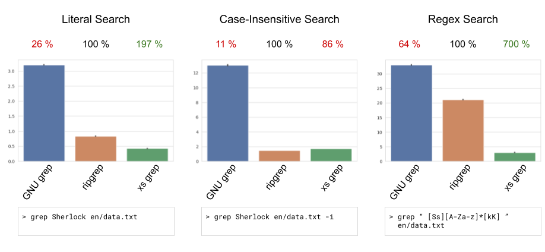
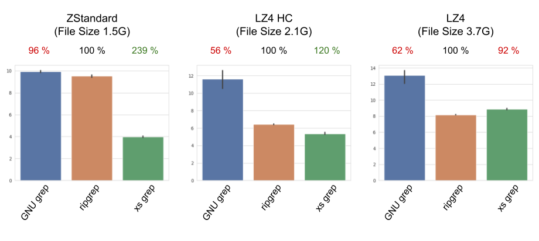

xs grep is a GNU grep-like executable.
It is built using x-search, a C++ library for fast external string search that was written in the scope of my
bachelor-thesis.
This project briefly describes how x-search was used to implement xs grep.
Further, this project aims to introduce xs grep in a more practical way than my thesis did and to provide
implementation insights into xs grep.
<!--more-->

## Content

1. [Introduction](#introduction)
2. [Using xs grep](#Usage)
3. [Implementation](#implementation)
3. [Benchmarks](#benchmarks)
5. [Conclusion](#conclusion)

## Introduction

Have you ever struggled to search a set of large files for a given pattern?
Well, you're not alone.
No matter whether you are a developer or a system administrator.
While developers working in fields such as _bioinformatics_, _natural language processing_ or _information retrieval_
need to search large files for specific patterns within the software, system administrators often need to search patterns
within system files such as log files.

Developers usually need to fall back on their own implementations including reading a file, searching the pattern,
saving the results.
Well, easy...

♫ _Ticking away the moments that make up a dull day,
Fritter and waste the hours in an offhand way_ ♫ (Time, Pink Floyd)

... and... slow?
System administrators are luckier: Most Linux distributions come with GNU grep, a command line search tool for searching
patterns within files.
However, what if you could have a GNU grep-like program that is not only faster than GNU grep but also provides a C++ library that can be easily included in your C++ projects, making your custom implementations obsolete and thus, saving
your time?

Well, that's where xs grep comes into play.
Inspired by GNU grep's functionality, xs grep takes external searches to the next level:
Performant, customizable, versatile.

Whether you are a developer, a system administrator or just looking for a search tool, xs grep is worth checking out.
In this blog post, we'll look at xs grep: Its command line tool usage, library and how you can
extend and customize it to your specific needs.

The source code is available [here](https://github.com/lfreist/xsgrep).

## Usage

xs grep provides both, a grep-like executable and a C++ library.
I will first present its executables usage before guiding you through including the library in your
project.

### The Executable

xs grep's executable (`xs`) provides the basic functionalities of GNU grep (well, it's actually me who decided, what's
basic...).

So let's take a look at what's basic for me:

- single file input (no directories)
- single patterns (regex and literal)
  ```
  -F, --fixed-strings   PATTERN is string (not regex)
  -i, --ignore-case     perform case-insensitive search
  ```
- supported output control options:
  ```
  -b, --byte-offset     print the byte offset with output lines
  -n, --line-number     print the line number with output lines
  -o, --only-matching   show only nonempty parts of lines that match
  -c, --count           count the number of matches
  ```

Additionally, xs grep supports some config flags:

```
-m, --metafile    the metafile of a xs grep preprocessed file
-j, --threads     the number of worker threads used for the search
--max-readers     the number of concurrently reading threads (default = 1)
--no-mmap         do not use memory mapping
```

#### Examples

| Command                       | Explanation                                                 | Example Output Line                      |
|-------------------------------|-------------------------------------------------------------|------------------------------------------|
| `xs Sherlock sample.txt`      | print all lines within `sample.txt` that contain `Sherlock` | Okay, Sherlock, time for a break, huh?   |
| `xs Sherlock sample.txt -b`   | print the byte offset of the printed line and the line      | 6:Okay, Sherlock, time for a break, huh? |
| `xs Sherlock sample.txt -n`   | print the line number of the printed line and the line      | 2:Okay, Sherlock, time for a break, huh? |
| `xs Sherlock sample.txt -o`   | only print the nonempty parts of the matching line          | Sherlock                                 |
| `xs Sherlock sample.txt -j 1` | only use a single worker thread                             | Okay, Sherlock, time for a break, huh?   |

So far, so good...
You can see, xs grep can just instantly replace GNU grep for searches on single files.

However, xs grep can do even more!
You may have wondered what the `--metafile` flag is for.
xs grep's specific preprocessing includes compression using the LZ4 and ZStandard compression algorithms.
This preprocessing creates a metafile holding some information in the processed file.
This is valuable when working on a computer with slow secondary memory, such as HDD.
In this case, reading compressed files and then decompressing them can be much faster before searching for the pattern.
Yes, this is only useful when you frequently search static files (files that don't change).

> **Example:**
>
> 1. Run the preprocessing: `xspp sample.txt -a zstd -o sample.xszst -m sample.xszst.meta`
> 2. Run the search: `xs Sherlock sample.xszst -m sample.xszst.meta`
>
> The output is equivalent to the `xs Sherlock sample.txt` output.

The only difference to using xs grep as GNU grep is that you additionally pass the metafile as command line argument
with the `--metafile` (`-m`) flag.

Here is the full information on what options `xspp` supports:

```
Options for xspp:
  -h [ --help ]                    produces this help message.
  --input-file arg                 path to input-file
  -o [ --output-file ] arg         path to output-file (gets overwritten)
  -m [ --meta-file ] arg           path to meta-file (gets overwritten)
  -a [ --compression-alg ] arg     compression alg (zstd, lz4, none (default))
  -l [ --compression-level ] arg   compression level (default: lz4 (only available if used with --hc): 1, zstd: 3)
  --hc                             use high compression algorithm. Only available for lz4.
  -s [ --chunk-size ] arg          number of threads
  -j [ --threads ] arg             size of one chunk that is read
  -d [ --bytes-nl-distance ] arg   number of bytes between new lines that are stored in meta-file
```

The `--bytes-nl-distance` flag can be used for saving byte offsets of newline characters.
This is used by xs grep for faster line number searching.

### The library

If you want to integrate the search functionality within your own C++ project, you are at the right place!
The library provided with xs grep can be easily included within your projects.
Since xs grep is built using CMake, I'll show you how to include it in your CMake project:

1. Download xs grep into your projects root directory: `git clone https://github.com/lfreist/xsgrep`
   > If you use git as version control, I recommend including it via git
   modules: `git submodule add https://github.com/lfreist/xsgrep`
2. Copy the following into your projects root `CMakeList.txt`:
   ```cmake
   # CMakeList.txt
   
   # ...
   add_subdirectory(xsgrep)
   include_directories(xsgrep/include)
   # ...
   ```
3. Write your code:
   ```c++
   // main.cpp
   
   #include <xsgrep/grep.h>

   int main() {
       // ...
       Grep grep("Sherlock", "sample.txt");  // search "Sherlock" within "sample.txt"
       auto result = grep.search();
       // ...
   }
   ```
4. Build your project and link xs grep:
   ```cmake
   # CMakeList.txt
   
   # ...
   add_executable(MyProgram main.cpp)
   target_link_libraries(MyProgram PRIVATE libgrep)
   # ...
   ```

#### API

A full API description is available on [GitHub](https://github.com/lfreist/xsgrep/wiki/Library#api) and since API docs
are considered boring, I won't list them here.

## Benchmarks
Within my thesis, I have not only presented comparisons of GNU grep, ripgrep and xs grep, but also discussed the
reasons for the observations concerning the used search algorithms etc.
If you are interested in such details, please check out the *Evaluation* section within my thesis.

### Sample Specifications
- Search tools:
    - GNU grep Version 3.7
    - ripgrep Version 13.0.0
    - xs grep Version 1.0 (submitted version)
- Sample data: English version of the
  [opensubtitles2016](https://object.pouta.csc.fi/OPUS-OpenSubtitles/v2016/mono/en.txt.gz) dataset:
    - Size: 9.3 GB
    - Lines: 337,845,355
- Patterns:
    - `Sherlock`: 13,645 matching lines
    - `[sS][A-Za-z]*[kK]`: 1,079,731 matching lines

### Reading from RAM Cache

Reading data from RAM cache is similar to operating on data read into RAM.
An everyday use case for this is running grep multiple times on the same file (e.g. for searching different patterns).

> 
>
> _Figure 1: Comparison results of GNU grep, ripgrep and xs grep for literal (left), case-insensitive literal (mid) and
> regex (right) searches on data read from RAM cache. Full raw data are available on GitHub._

xs grep outperforms GNU grep by far in all three scenarios (literal: ~ 750 %, case-insensitive: ~ 760 %, regex search:
~ 1090 %).
It also outperforms ripgrep when performing literal or regex searches.
xs grep is only left behind for the case-insensitive search.
However, this is easily explained:
xs grep performs a case-insensitive search by transforming all data and the pattern to lowercase and then runs a
case-sensitive search.
ripgrep in contrast implements a pretty smart case-aware algorithm called Teddy.
Using Teddy, ripgrep can perform case-insensitive searches without lowercasing all data, saving a lot of time.
I have provided more information on Teddy within my thesis.

### Reading from HDD

Reading from HDD is slow and a commonly known bottleneck for text-based algorithms.
However, reading data from HDD is also a process that frequently takes place - especially when operating on large data.
Therefore, the performance of command line search tools in this scenario matters a lot.

>
>
> _Figure 2: Comparison results of GNU grep, ripgrep and xs grep for literal searches on data read from HDD. Full raw
> data are available on GitHub._

Uff. All three compared tools are equally fast (or slow) when searching data that are read from HDD.
This is, because of the slow read.
The 25 seconds that GNU grep, ripgrep and xs grep need to search are dominated by reading the data from HDD.
The only way to increase the performance is to lower the amount of read data.

By compressing the data, we can trade I/O time for computing time.
While the data become smaller by compression (lower I/O time), the data must be decompressed (higher computing
time) before being searched.

Figure 3 shows how compressing data can increase overall performance.
GNU grep and ripgrep do not support any internal configuration for reading and decompressing compressed data.
Therefore, we use command line compression and decompression tools for these processes and pipe the uncompression
output to the corresponding search tool (for example using ZStandard):

1. Compress data: `zstd en/data.txt en/data.zst`
2. Decompress and search data: `zstdcat en/data.zst | grep Sherlock`

xs grep provides an internal configuration and preprocessing tool (`xspp`) for compressing data and searching compressed
data:

1. Compress data: `xspp en/data.txt -o en/data.xszst -m en/data.xszst.meta -a zstd`
2. Decompress and search data: `xs Sherlock en/data.xszst -m en/data.xszst.meta`

Figure 3 shows a selection of the benchmarking results.

> 
>
> _Figure 3: Comparison results of reading and searching compressed data (ZStandard: left, LZ4 HC: mid, LZ4: right)
> using GNU grep, ripgrep and xs grep. Full raw data are available on GitHub._

First things first:
Compressing the data increases the overall performance for all considered compression tools by at least 200 %.
Using ZStandard as a compression tool achieves the highest speedups.
This is because of the good compression ratio:
The size of the ZStandard compressed data is only 1.5 GB, and since the process is heavily I/O-bound, shrinking the file
size achieves the best speedups.

Using the xs grep-specific preprocessing further increases the overall performance when using ZStandard or LZ4 HC.
This is due to xs grep's ability to utilize multiple threads for decompression.
For ZStandard and LZ4 HC compressed data, the decompression dominated the I/O (because of the small file sizes). Thus,
using multiple threads for decompression increases the performance.

However, it is essential to note that the observations cannot be generalized.
You might have a little faster or slower HDD or SSD, and the critical point on which the process switches from being
I/O-bound to CPU-bound is shifted.
Thus, it is crucial to play around with the compression algorithms on your system to achieve the best results.

## Conclusion

xs grep is a powerful search tool that enables developers to easily include grep-like searches in their projects.
Further, xs grep provides an executable that outperforms traditional grep-like programs.
The presented data show that for both literal and regex searches, xs grep can deliver results more than 200 %
faster than similar tools.

Furthermore, xs grep has the unique ability to utilize internal configurations for compressing and decompressing data.
This means that even on machines with slow secondary memory, xs grep can deliver fast search results without
sacrificing performance too much.

Whether you're a developer, system administrator, or just looking for a more efficient way to search data, xs grep is an
excellent choice.
With its customizable search parameters, flexible output options, and lightning-fast performance, xs grep is sure to
help streamline your workflow and save you time and effort.
So why not give it a try and see how it can help you achieve your goals?


## Additional Details: Implementation
For those of you interested in more details on the underlying implementation of xsgrep using x-search...
Here we are!
Note that the following information are not relevant for neither, using the executable nor using the library.

xs grep utilizes x-search, the C++ library for fast external string search developed in the scope of my thesis.
x-search provides two different types of APIs that are described [here](https://github.com/lfreist/x-search/wiki).

Since xs grep implements custom tasks to increase performance, it uses the
[advanced API](https://github.com/lfreist/x-search/wiki/Advanced-Usage) of x-search.

Since the advanced API provides base classes that must be inherited by custom task implementations, most of the
implementations of the tasks used within xs grep are just implementing inherited virtual methods.

I will not bother you with too many details on these implementations since the source code is documented and available
on GitHub.
Instead, I will introduce the custom tasks in a more descriptive way:

### The Reader
xs grep utilizes the default implementations provided by x-search.
Therefore, no custom implementations are necessary.

### The Processors
Since xs grep supports searching compressed inputs, tasks that decompress the read data are necessary.
As with the readers, xs grep utilizes the default implementations for decompressing ZStandard and LZ4 compressed data
provided by x-search.

### The Searcher
To support the different grep-like search settings (case-sensitivity, regex, count matches, ...), I have implemented
a custom searcher (`GrepSearcher`) for xs grep.
It inherits the `xs::task::base::ReturnProcessor<T>` class and implements the virtual `R process(const T* data)` method.
`GrepSearcher` is constructed with parameters defining the settings for the searcher.
A call of `GrepSearcher::process(const T* data)` searches the data considering the provided settings.

### The Result Type
The default result types provided by x-search aim to return collected results.
However, a grep-like executable should write results to the console instead of collecting them.
Therefore, I have implemented a custom result type that writes results to a provided stream instead of collecting them.

xs grep can utilize multiple threads for concurrently searching read chunks.
However, the printed results should be in the same order the matches occur within the original data.
Therefore, the result type must implement a solution for the case that a chunk B that is read after chunk A is searched
faster and thus provided to the result before A.

The solution to this is the following:
- The searcher does not only return the search results but also the index of the chunk that was searched.
- The result type to which the search results are provided checks for the index of the chunk of the results:
    - The results are written to the stream if the index is in order.
    - If the index is out of order, the partial results are buffered in a map using the index as the key.
      Using a map allows for fast checking of the buffer for the following result.

### Putting the pieces together
Now that we have all the tasks needed for constructing the `xs::Executor`, we can put the things together.
For simplicity's sake, xs grep provides a class called `Grep`, that constructs the `xs::Executor` internally.
However, `Grep`s implementation is pretty simple:
It provides an interface for setting search and output configurations and when one of the search methods is called,
a private method is called that constructs the `xs::Executor`, joins it and returns the resullt.

In order to build a command line tool, I have written a file containing the `main()` function.
Within this main function, the command line arguments stated earlier are parsed using `boost::program_options` and the
`Grep` class is used for searching.
