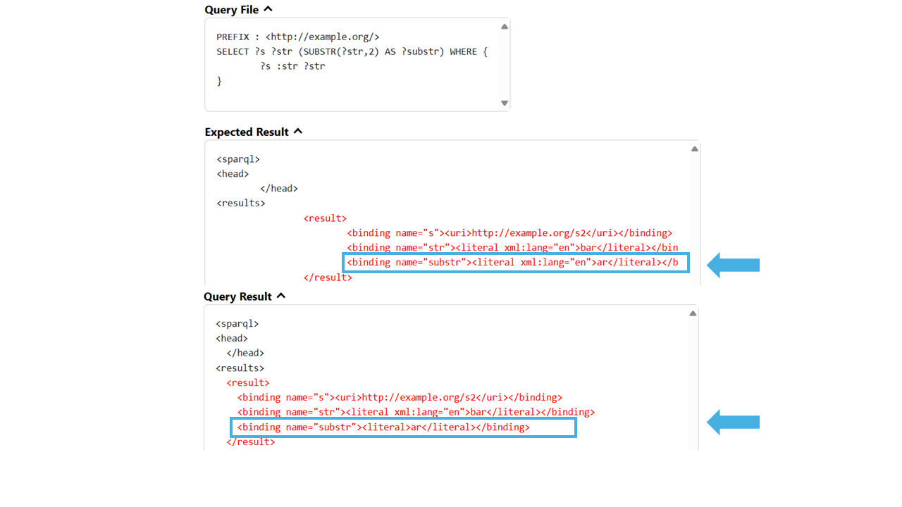

The current string function implementation in the SPARQL engine QLever incorrectly discards datatype and language tags. In this project, we improved QLever’s compliance with the SPARQL specification by handling language tags and datatypes in string expressions such as SUBSTR, UCASE, STRAFTER or CONCAT.

## Table of Contents
- [Introduction](#introduction)
- [Implementation](#implementation)
- [Conclusion](#conclusion)

## Introduction
SPARQL defines several string expressions — such as `SUBSTR`, `UCASE`, `LCASE`, `STRAFTER`, `STRBEFORE`, or `CONCAT` — that operate on RDF literals. A requirement of the SPARQL 1.1 specification is that such expressions must correctly handle language tags and datatypes. For example, a call like `SUBSTR("Grüße"@de, 1, 3)` should return a result that also carries the `@de` language tag.\
\
Prior to this project, QLever dropped all language tags and datatypes when evaluating these functions. As a result, the engine's behavior deviated from the SPARQL standard, and tests that verified correct semantic behavior failed. Below is an example screenshot showing failing tests of the `SUBSTR` expression.
<figure style="text-align: center;">
    

    <figcaption style="font-size: 20px;">Failing test of SUBSTR() in the SPARQL testsuite for QLever</figcaption>
</figure>

## Implementation
To address the incorrect handling of language tags and datatypes in string functions, we extended QLever’s existing ValueGetter infrastructure. Previously, string expressions used a `StringValueGetter` that returned only the raw string content of a literal, discarding any additional information such as language tags or datatypes.\
\
We introduced additional `LiteralValueGetter` variants. These make it possible to retain and propagate metadata like language tags during expression evaluation. The infrastructure supports variants that either apply the `STR()` function implicitly or restrict processing to only valid string literals, depending on the context of the expression.\
The `LiteralValueGetter` is now used in string expressions that take and return strings.
The string expressions `SUBSTR`, `UCASE`, `LCASE`, `STRAFTER`, `STRBEFORE`, and `REPLACE` have been updated to consistently preserve the language tag of their input.
For the expression `CONCAT`, the result will now retain the language tag only if all input arguments share the same tag. If the inputs differ in their language tags or datatypes, the result will be a plain string without any tag or datatype. The behavior of `STRDT` and `STRLANG` has been extended: if either function is applied to a literal that already has a datatype or language tag, the result is now correctly `UNDEF`.

## Conclusion
Through this project, we have implemented a infrastructure for handling RDF literals with language tags and datatypes across a wide range of string functions in QLever. As a result, QLever now conforms more closely to the SPARQL 1.1 specification, and the related tests now pass successfully.