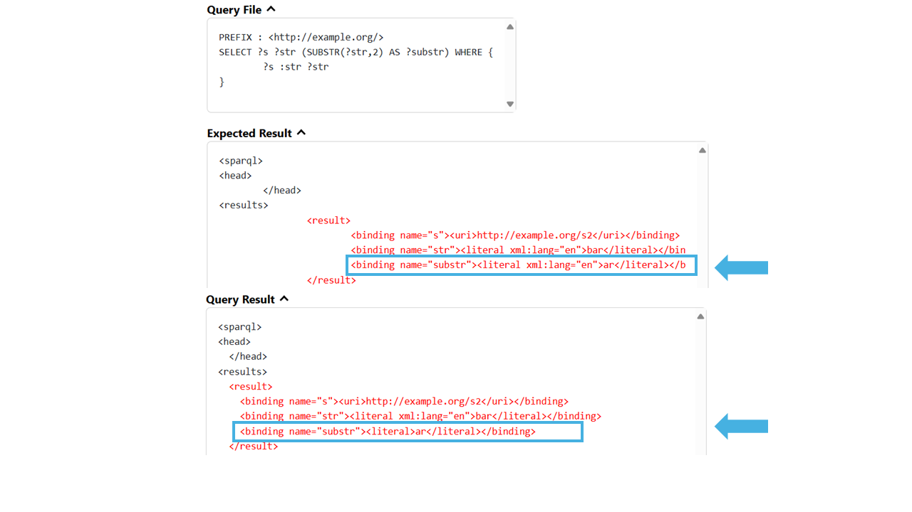

In this project, we improved the handling of language tags and datatypes in string expressions such as `SUBSTR`, `UCASE`, `STRAFTER`, and `CONCAT` in the SPARQL engine QLever, making it more compliant with the SPARQL specification. Prior to this project, QLever dropped all language tags and datatypes when literals were processed in string expressions.

## Table of Contents
- [Introduction](#introduction)
- [Implementation](#implementation)
- [Conclusion](#conclusion)

## Introduction
SPARQL defines several string expressions — such as `SUBSTR`, `UCASE`, `LCASE`, `STRAFTER`, `STRBEFORE`, or `CONCAT` — that operate on literals.
According to the SPARQL 1.1 specification, these functions must handle metadata associated with literals, such as language tags (e.g., `"Hallo"@de` for a German word) or datatypes (e.g., a string explicitly typed as `xsd:string`).
For example, applying an UCASE to a literal like "Hallo"@de (a German-language string) should return "HALLO"@de, maintaining the language tag.\
\
Before this project, QLever dropped all language tags and datatypes when evaluating these functions. As a result, the engine's behavior deviated from the SPARQL standard, and tests that verified correct semantic behavior failed. Below is an example screenshot showing failing tests of the `SUBSTR` expression.
<figure style="text-align: center;">
    

    <figcaption style="font-size: 20px;">Failing test of SUBSTR() in the SPARQL testsuite for QLever</figcaption>
</figure>

The problem was caused by how QLever internally evaluated string expressions. It used a general template function called StringExpressionImpl, which relies on a helper function named StringValueGetter. This component extracts only the plain string content from a literal, without preserving its language tag or datatype.

For example, in the case of the UCASE function, QLever would apply the uppercasing operation to the raw string "Hallo", producing "HALLO". However, the resulting literal no longer included the original language tag @de, since StringValueGetter did not pass this metadata along. As a result, "Hallo"@de became "HALLO" instead of the correct "HALLO"@de.

## Implementation
To address the not yet implemented handling of language tags and datatypes in string exprssions, we extended QLever’s existing ValueGetter infrastructure. Die ValueGetter Structur die in den String Expressions genutzt wurde besteht aus StringValueGetter

Previously, string expressions used a `StringValueGetter` that returned only the raw string content of a literal, discarding any additional information such as language tags or datatypes.\
\
We introduced additional `LiteralValueGetter` variants. These make it possible to retain and propagate metadata like language tags during expression evaluation. The infrastructure supports variants that either apply the `STR()` function implicitly or restrict processing to only valid string literals, depending on the context of the expression.\
The `LiteralValueGetter` is now used in string expressions that take and return strings.
The string expressions `SUBSTR`, `UCASE`, `LCASE`, `STRAFTER`, `STRBEFORE`, and `REPLACE` have been updated to consistently preserve the language tag of their input.
For the expression `CONCAT`, the result will now retain the language tag only if all input arguments share the same tag. If the inputs differ in their language tags or datatypes, the result will be a plain string without any tag or datatype. The behavior of `STRDT` and `STRLANG` has been extended: if either function is applied to a literal that already has a datatype or language tag, the result is now correctly `UNDEF`.

## Conclusion
Through this project, we have implemented a infrastructure for handling RDF literals with language tags and datatypes across a wide range of string functions in QLever. As a result, QLever now conforms more closely to the SPARQL 1.1 specification, and the related tests now pass successfully.
